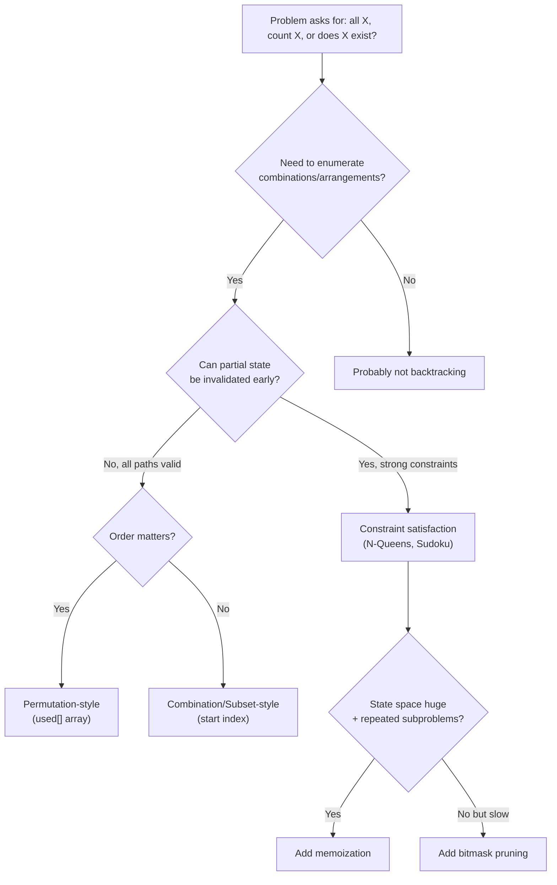

Let's build this properly — backtracking is one of those topics that feels mysterious until the underlying pattern clicks, and then it becomes almost mechanical. Given how much ground "beginner to master" covers, I'll teach this in a few connected parts rather than one giant dump — foundations first, then patterns, then advanced optimization. Let's start with the foundations.

## Part 1: What Backtracking *Actually* Is

### The core idea, stripped to its essence

Backtracking is **brute force with a memory of what you've tried, and the discipline to undo bad choices immediately.**

That's it. Every backtracking problem is really this loop:

1. **Choose** — pick an option for the current decision
2. **Explore** — recurse deeper, as if that choice were final
3. **Un-choose (backtrack)** — undo the choice before trying the next option

If you internalize nothing else today, internalize this: backtracking is **DFS over a tree of decisions**, where each node is a partial solution, and each edge is a choice you made to get there.

### The intuition: the "maze" mental model

Imagine you're in a maze. At every junction, you pick a direction and walk. If you hit a dead end, you don't teleport back to the start and forget everything — you **walk back to the last junction** and try the *next* unexplored direction. You never explore the same path twice, and you never lose the work you did getting there.

That "walk back to the last junction" step **is** backtracking. It's not a special algorithm bolted onto recursion — it's just recursion where you're honest about undoing state.

### Why "brute force with pruning"?

A pure brute-force solution to something like "generate all subsets" would generate every combination independently, often recomputing shared work. Backtracking instead builds one path at a time, and — crucially — **abandons a path the moment it becomes invalid or unpromising**, rather than building it all the way out and checking at the end. This abandoning-early step is called **pruning**, and it's the entire reason backtracking is often fast enough to be practical despite operating on exponential search spaces.

So: backtracking = **exhaustive search + incremental construction + early abandonment**.

### The decision tree — the picture you should see in your head

For almost every backtracking problem, you can draw a tree where:
- The **root** = empty/initial state
- Each **level** = one decision point (pick the next element, place the next queen, choose the next character...)
- Each **node** = a partial solution so far
- Each **leaf** (or node where you stop going deeper) = either a complete valid solution, or a dead end

Backtracking is just a DFS traversal of this tree, where you *build* the tree as you go (you never have it in memory all at once) and you prune subtrees that can't lead anywhere useful.

Example — generating subsets of `[1,2,3]`, deciding "include or exclude" each number:

```
                    []
              /            \
         include 1        exclude 1
           [1]                []
          /    \             /    \
      incl 2  excl 2     incl 2  excl 2
      [1,2]    [1]        [2]      []
       / \      / \        / \      / \
     ...  ...  ...       ...
```

Every root-to-leaf path is one subset. That's the whole problem — you just need code that walks this tree.

### Backtracking vs. its cousins (this is where people get confused)

| Technique | What it does |
|---|---|
| **Plain recursion / DFS** | Breaks a problem into subproblems and recurses. Backtracking *is* DFS — just DFS specifically over a space of *choices*, with explicit undo. |
| **Divide & Conquer** | Splits into independent subproblems, solves each, *combines* results (merge sort, quicksort). No "undoing" — subproblems don't share mutable state. |
| **Dynamic Programming** | Backtracking *with overlapping subproblems* — same subproblem appears multiple times, so you cache results instead of recomputing. If a backtracking problem has overlapping states and you only need a *count* or *optimal value* (not all actual solutions), it's often a DP problem in disguise. |
| **Greedy** | Makes one choice per step and *never* reconsiders it. No backtrack step at all — commits and moves on. |

**Rule of thumb:** if the problem asks for *all* solutions, *one* valid solution, or to *count* solutions to a combinatorial/constraint problem — and a greedy or DP approach isn't obviously enough — think backtracking.

### The universal Java template

Almost every backtracking solution fits this exact skeleton:

```java
void backtrack(List<Integer> path, /* other state */) {
    if (isComplete(path)) {           // base case: found a full solution
        result.add(new ArrayList<>(path));   // IMPORTANT: copy! not the same reference
        return;
    }

    for (int choice : getChoices(path)) {     // try every option at this decision point
        if (!isValid(choice, path)) continue; // pruning: skip invalid choices early

        path.add(choice);              // 1. CHOOSE
        backtrack(path);               // 2. EXPLORE
        path.remove(path.size() - 1);  // 3. UN-CHOOSE (the actual "backtrack")
    }
}
```

Five things to notice, because they're where beginners make 90% of their bugs:

1. **`new ArrayList<>(path)`** — if you add `path` itself to `result`, every future mutation of `path` will silently corrupt every previously saved solution, because Java lists are passed by reference. This is *the* most common backtracking bug.
2. **The undo step is not optional.** If you forget `path.remove(...)`, your state leaks between branches and later branches see stale data from earlier ones.
3. **Pruning (`isValid`) should happen *before* recursing**, not after — checking early is what keeps the search fast. Checking a full solution only at the leaf is technically correct but throws away backtracking's main advantage.
4. **State is mutated and restored in place** (the same `path` list), not copied at every call — this is what makes it memory-efficient compared to naive recursion that passes new copies around.
5. The **for loop** represents "all choices at this decision point" — this is where the tree branches.

### How to recognize a backtracking problem (the pattern-matching skill)

This is the part people actually struggle with — not writing the code once you know it's backtracking, but *realizing* it is. Look for these signals:

- **"Find all..."** — all subsets, all permutations, all combinations, all valid arrangements, all paths
- **"Find a/any valid..."** — a solution to N-Queens, a valid Sudoku fill, a way to escape a maze
- **Constraint satisfaction** — you're placing things under rules (queens that can't attack, digits that can't repeat) and need to check validity as you go
- **The problem naturally decomposes into a sequence of choices** made one at a time, where later choices depend on earlier ones
- **The search space is combinatorial** (grows exponentially, like 2ⁿ or n!) — no known formula or greedy shortcut gets you there directly
- **You'd need to "try something, and if it doesn't work, undo it and try something else"** — if you catch yourself describing the solution this way in plain English, it's backtracking

And the counter-signal: if the problem only asks for a *count* or an *optimal number* (not the actual arrangements) AND choices overlap between different paths (same subproblem reached multiple ways), suspect **DP** can solve it faster than raw backtracking.

### Full worked example: Subsets (with a hand-trace)

Let's trace the tree above in actual Java, since seeing execution order is where intuition really solidifies.

```java
import java.util.*;

class Solution {
    List<List<Integer>> result = new ArrayList<>();

    public List<List<Integer>> subsets(int[] nums) {
        backtrack(nums, 0, new ArrayList<>());
        return result;
    }

    private void backtrack(int[] nums, int start, List<Integer> path) {
        result.add(new ArrayList<>(path));   // every node is itself a valid subset

        for (int i = start; i < nums.length; i++) {
            path.add(nums[i]);                    // CHOOSE
            backtrack(nums, i + 1, path);          // EXPLORE (only look forward, avoids duplicates)
            path.remove(path.size() - 1);          // UN-CHOOSE
        }
    }
}
```

For `nums = [1,2,3]`, trace it in your head or on paper:

```
call backtrack(start=0, path=[])       -> save []
  i=0: path=[1]
    call backtrack(start=1, path=[1])  -> save [1]
      i=1: path=[1,2]
        call backtrack(start=2, path=[1,2]) -> save [1,2]
          i=2: path=[1,2,3]
            call backtrack(start=3, ...) -> save [1,2,3]
            (loop ends, nothing to try)
          undo -> path=[1,2]
        (loop ends)
      undo -> path=[1]
      i=2: path=[1,3]
        call backtrack(start=3, path=[1,3]) -> save [1,3]
        (loop ends)
      undo -> path=[1]
    (loop ends)
  undo -> path=[]
  i=1: path=[2]
    ... (2, [2,3])
  undo -> path=[]
  i=2: path=[3]
    ... ([3])
  undo -> path=[]
```

Notice the pattern: every single call to `backtrack` immediately saves the current `path` as a valid subset — because "any prefix is a valid subset" here. The `start` index is the pruning mechanism: it stops us from ever going "backwards" and generating `[2,1]` as a duplicate of `[1,2]`.

### Complexity — the honest picture

Backtracking's time complexity is almost always tied directly to the size of the decision tree it explores, times the work done per node. For subsets it's O(2ⁿ) nodes (each element is in/out) times O(n) to copy each path, giving O(n · 2ⁿ). For permutations it's O(n!) leaves. This is why **pruning is not an optimization — it's the difference between "runs" and "doesn't run"** for any nontrivial input size. A well-pruned backtracking solution can be orders of magnitude faster than an unpruned one even though both are technically exponential.

---

That's the foundation: the mental model, the template, how to spot it, and one fully traced example. Once this is solid, everything else — permutations, combinations with dedup, N-Queens, Sudoku solver, word search, palindrome partitioning, subset-sum — is just **variations on the same five-line template**, differing only in what `getChoices`, `isValid`, and `isComplete` mean.

Want to move to **Part 2: the core pattern library** (permutations, combinations, handling duplicates, grid/graph backtracking like N-Queens and word search) next, or do you want to sit with Part 1 and try implementing something yourself first — e.g., I give you a problem and you write the backtracking code, and I review it?

---

## Part 2: The Core Pattern Library

Every backtracking problem you'll ever meet is a variation of a handful of archetypes. Once you can recognize *which* archetype you're looking at, writing the code becomes almost mechanical. Let's go through them one by one, each with the reasoning first, then the Java.

---

### Archetype 1: Permutations — "order matters, use everything once"

**Reasoning:** Subsets asked "in or out" per element. Permutations ask "in what *order* do I use every element." The key structural difference: at each decision point, you're not choosing whether to include the *next* element in a fixed sequence — you're choosing *which remaining element* goes next. That means you can't use a simple `start` index anymore (every element is still "available" regardless of position); instead you need to track **which elements have already been used**.

```java
class Solution {
    List<List<Integer>> result = new ArrayList<>();

    public List<List<Integer>> permute(int[] nums) {
        boolean[] used = new boolean[nums.length];
        backtrack(nums, used, new ArrayList<>());
        return result;
    }

    private void backtrack(int[] nums, boolean[] used, List<Integer> path) {
        if (path.size() == nums.length) {        // complete only when all elements placed
            result.add(new ArrayList<>(path));
            return;
        }

        for (int i = 0; i < nums.length; i++) {
            if (used[i]) continue;                // pruning: skip already-used elements

            used[i] = true;
            path.add(nums[i]);                    // CHOOSE
            backtrack(nums, used, path);           // EXPLORE
            path.remove(path.size() - 1);          // UN-CHOOSE
            used[i] = false;                       // undo the "used" mark too — easy to forget!
        }
    }
}
```

**The bug beginners hit here:** forgetting to reset `used[i] = false`. Any piece of mutable state you touch in the CHOOSE step must be untouched in the UN-CHOOSE step — `used` is state exactly like `path` is, it's just not visible in the output.

**Base case difference from subsets:** in subsets, *every node* is a valid answer. In permutations, *only leaves at full depth* are valid answers — that's why the `result.add` happens at the top with a size check, not unconditionally like in subsets. This distinction — "every node is an answer" vs "only leaves are answers" — is one of the first questions you should ask when you see a new problem.

---

### Archetype 2: Combinations — "order doesn't matter, pick k of n"

**Reasoning:** This is subsets' sibling, constrained to a fixed size `k`. Same `start`-index trick to avoid generating `[2,1]` as a "different" combination than `[1,2]`. The new idea here is a sharper pruning technique: **if the remaining elements can't possibly fill out the combination to size k, stop immediately** — no point recursing into a branch that's mathematically dead.

```java
class Solution {
    List<List<Integer>> result = new ArrayList<>();

    public List<List<Integer>> combine(int n, int k) {
        backtrack(n, k, 1, new ArrayList<>());
        return result;
    }

    private void backtrack(int n, int k, int start, List<Integer> path) {
        if (path.size() == k) {
            result.add(new ArrayList<>(path));
            return;
        }

        // Pruning: if even taking every remaining number can't reach size k, stop.
        int remainingNeeded = k - path.size();
        for (int i = start; i <= n - remainingNeeded + 1; i++) {
            path.add(i);
            backtrack(n, k, i + 1, path);
            path.remove(path.size() - 1);
        }
    }
}
```

That loop bound `i <= n - remainingNeeded + 1` is a real optimization, not cosmetic — without it you'd still get the correct answer (the base-case check would just reject incomplete paths later), but you'd waste huge amounts of time recursing into branches that were doomed from the start. **This is the essence of good pruning: detect "this can never work" as early as possible, ideally in the loop condition itself, not after descending several more levels.**

---

### Archetype 3: Handling duplicates — "don't generate the same answer twice"

**Reasoning:** Real inputs often have duplicate values (`[1,2,2]`). Naively running the subset/permutation template produces duplicate *outputs* (two identical `[1,2]`s from using either of the two `2`s). The fix is always the same idea: **sort first, then at each decision level, skip a choice if it's equal to the previous choice you already tried *at that same level*.**

Why "at that same level" and not globally? Because using a repeated value is fine *across* levels (deeper in the same path) — `[2,2]` is a valid subset — you only want to avoid trying the *same value twice as siblings* in the same for-loop, which would just re-explore an identical subtree.

```java
class Solution {
    List<List<Integer>> result = new ArrayList<>();

    public List<List<Integer>> subsetsWithDup(int[] nums) {
        Arrays.sort(nums);                        // sorting makes duplicates adjacent
        backtrack(nums, 0, new ArrayList<>());
        return result;
    }

    private void backtrack(int[] nums, int start, List<Integer> path) {
        result.add(new ArrayList<>(path));

        for (int i = start; i < nums.length; i++) {
            if (i > start && nums[i] == nums[i - 1]) continue;  // skip duplicate siblings
            path.add(nums[i]);
            backtrack(nums, i + 1, path);
            path.remove(path.size() - 1);
        }
    }
}
```

The condition `i > start && nums[i] == nums[i-1]` is worth memorizing verbatim — it's the standard "no duplicate branches at this level" guard, and it reappears in combination-sum-with-duplicates, permutations-with-duplicates, and beyond. `i > start` matters because it only compares *siblings* (choices at the same loop), not a value against itself at `i == start`.

---

### Archetype 4: Grid/graph backtracking — "explore neighbors, mark visited, unmark on the way out"

**Reasoning:** This is where backtracking meets DFS-on-graphs directly. Problems like **Word Search** (find a word by moving to adjacent grid cells) follow the exact same CHOOSE/EXPLORE/UN-CHOOSE structure — the only difference is that "choices" are now "which neighboring cell to move to," and the "used" tracking is a visited-marker on the grid itself (often done in-place to save memory, by temporarily overwriting the cell).

```java
class Solution {
    public boolean exist(char[][] board, String word) {
        int rows = board.length, cols = board[0].length;
        for (int r = 0; r < rows; r++) {
            for (int c = 0; c < cols; c++) {
                if (backtrack(board, word, r, c, 0)) return true;
            }
        }
        return false;
    }

    private boolean backtrack(char[][] board, String word, int r, int c, int idx) {
        if (idx == word.length()) return true;          // complete: matched whole word

        // Pruning: out of bounds, or cell doesn't match the needed character
        if (r < 0 || r >= board.length || c < 0 || c >= board[0].length
            || board[r][c] != word.charAt(idx)) {
            return false;
        }

        char temp = board[r][c];
        board[r][c] = '#';                 // CHOOSE: mark visited (in place, no extra memory)

        boolean found =
               backtrack(board, word, r + 1, c, idx + 1)
            || backtrack(board, word, r - 1, c, idx + 1)
            || backtrack(board, word, r, c + 1, idx + 1)
            || backtrack(board, word, r, c - 1, idx + 1);

        board[r][c] = temp;                // UN-CHOOSE: restore the cell — critical!

        return found;
    }
}
```

Notice the short-circuit `||` chain — this is backtracking that stops the instant *any* one direction returns `true`, which is itself a form of pruning: don't keep exploring once you've already found what you need. Also notice the UN-CHOOSE (`board[r][c] = temp`) happens **regardless of whether `found` is true or false** — restoring state is not conditional on success.

---

### Archetype 5: Hard constraint satisfaction — N-Queens

**Reasoning:** This is the canonical "real" backtracking problem, and it ties everything above together. The choices are "which column to place a queen in, on this row." The pruning is the interesting part: a placement is invalid if it shares a column, or either diagonal, with any previously placed queen. The insight that makes this efficient: **check validity incrementally against only the queens placed so far — never generate a full board and check it at the end.**

```java
class Solution {
    List<List<String>> result = new ArrayList<>();

    public List<List<String>> solveNQueens(int n) {
        int[] queens = new int[n];   // queens[row] = column of the queen in that row
        backtrack(queens, 0, n);
        return result;
    }

    private void backtrack(int[] queens, int row, int n) {
        if (row == n) {
            result.add(buildBoard(queens, n));
            return;
        }

        for (int col = 0; col < n; col++) {
            if (isValid(queens, row, col)) {     // prune BEFORE placing, not after
                queens[row] = col;                // CHOOSE
                backtrack(queens, row + 1, n);    // EXPLORE
                // UN-CHOOSE: nothing to explicitly undo — queens[row] gets overwritten
                // next iteration, since we only ever read up to index `row`.
            }
        }
    }

    private boolean isValid(int[] queens, int row, int col) {
        for (int r = 0; r < row; r++) {
            int c = queens[r];
            if (c == col) return false;                    // same column
            if (Math.abs(c - col) == Math.abs(r - row)) return false;  // same diagonal
        }
        return true;
    }

    private List<String> buildBoard(int[] queens, int n) {
        List<String> board = new ArrayList<>();
        for (int col : queens) {
            StringBuilder sb = new StringBuilder();
            for (int c = 0; c < n; c++) sb.append(c == col ? 'Q' : '.');
            board.add(sb.toString());
        }
        return board;
    }
}
```

Worth pausing on: this is the first example where the "un-choose" step is **implicit** rather than an explicit line of code — because `queens[row]` just gets overwritten by the next candidate `col` in the loop, there's nothing to manually reset. This is a good general lesson: *the CHOOSE/UN-CHOOSE pattern is about conceptually restoring state, not always about a literal `remove()` call* — sometimes overwriting achieves the same thing.

---

### The pattern-recognition cheat sheet so far

| Problem shape | Signal | Key mechanism |
|---|---|---|
| Subsets | "all subsets/every combination" | `start` index, every node is an answer |
| Permutations | "all orderings" | `used[]` array, only leaves are answers |
| Combinations (size k) | "choose k of n" | `start` index + size-based pruning bound |
| With duplicates | input has repeats, "no duplicate results" | sort + skip-equal-sibling guard |
| Grid/graph | "path in a grid", "reach from A to B" | mark/unmark visited, bounds + match pruning |
| Constraint placement | "place N things obeying rules" | validity check *before* recursing, using only what's placed so far |

---

That's the full pattern library that ~90% of backtracking problems draw from. Part 3 will go into **advanced territory**: how to make backtracking genuinely fast (real pruning theory, constraint propagation, ordering heuristics), how to recognize when backtracking should be *upgraded* to DP or *hybridized* with memoization, bitmasking tricks for state (used in N-Queens and traveling-salesman-style problems), and a structured way to approach a brand-new, never-seen-before backtracking problem from scratch under interview pressure.

Want to go there next, or do you want a couple of practice problems now (I'll give you 2–3 and review your code) to lock in Parts 1–2 before adding more theory?

---

Since you're prepping for L4/L5 interviews, here's a complete backtracking template progression in Java — from the core skeleton to advanced pruning patterns.

## 1. The Universal Skeleton

Every backtracking problem fits this shape:

```java
void backtrack(State state, List<Result> results) {
    if (isGoal(state)) {
        results.add(new Result(state));  // often a copy!
        return; // or don't return, if goal states can extend further
    }
    for (Choice choice : getChoices(state)) {
        if (!isValid(choice, state)) continue;   // pruning
        applyChoice(state, choice);               // choose
        backtrack(state, results);                // explore
        undoChoice(state, choice);                 // un-choose (backtrack)
    }
}
```

Three moves per iteration: **choose → explore → un-choose**. Everything else is variation on `getChoices`, `isValid`, and when you record a result.

---

## 2. Beginner: Subsets (decision at each index: include/exclude)

```java
class Solution {
    public List<List<Integer>> subsets(int[] nums) {
        List<List<Integer>> results = new ArrayList<>();
        backtrack(nums, 0, new ArrayList<>(), results);
        return results;
    }

    private void backtrack(int[] nums, int start, List<Integer> current,
                            List<List<Integer>> results) {
        results.add(new ArrayList<>(current)); // every node is a valid subset

        for (int i = start; i < nums.length; i++) {
            current.add(nums[i]);              // choose
            backtrack(nums, i + 1, current, results); // explore
            current.remove(current.size() - 1); // un-choose
        }
    }
}
```

**Key beginner insight:** the `start` index prevents revisiting earlier elements — this is how you avoid duplicate combinations without a `used[]` array.

---

## 3. Permutations (all elements, order matters — needs `used[]`)

```java
class Solution {
    public List<List<Integer>> permute(int[] nums) {
        List<List<Integer>> results = new ArrayList<>();
        boolean[] used = new boolean[nums.length];
        backtrack(nums, used, new ArrayList<>(), results);
        return results;
    }

    private void backtrack(int[] nums, boolean[] used, List<Integer> current,
                            List<List<Integer>> results) {
        if (current.size() == nums.length) {
            results.add(new ArrayList<>(current));
            return;
        }
        for (int i = 0; i < nums.length; i++) {
            if (used[i]) continue;             // pruning: skip used
            used[i] = true;
            current.add(nums[i]);
            backtrack(nums, used, current, results);
            current.remove(current.size() - 1);
            used[i] = false;
        }
    }
}
```

| Pattern | Loop starts at | Needs `used[]`? | Order matters? |
|---|---|---|---|
| Subsets | `start` (from index) | No | No |
| Combinations (choose k) | `start` | No | No |
| Permutations | `0` always | Yes | Yes |

---

## 4. Intermediate: Handling Duplicates

The recurring bug beginners hit: input has duplicate values, output has duplicate results. Fix = **sort first, then skip same-value siblings at the same recursion depth**.

```java
class Solution {
    public List<List<Integer>> subsetsWithDup(int[] nums) {
        Arrays.sort(nums); // REQUIRED — duplicates must be adjacent
        List<List<Integer>> results = new ArrayList<>();
        backtrack(nums, 0, new ArrayList<>(), results);
        return results;
    }

    private void backtrack(int[] nums, int start, List<Integer> current,
                            List<List<Integer>> results) {
        results.add(new ArrayList<>(current));
        for (int i = start; i < nums.length; i++) {
            // skip duplicates at the SAME tree depth (not same branch)
            if (i > start && nums[i] == nums[i - 1]) continue;
            current.add(nums[i]);
            backtrack(nums, i + 1, current, results);
            current.remove(current.size() - 1);
        }
    }
}
```

**Why `i > start` and not `i > 0`:** you *want* duplicates within the same branch (e.g. `[1,1,2]` as a valid subset) — you only want to skip trying the *same value twice as a sibling choice* at a given loop.

---

## 5. Intermediate: Constraint-Satisfaction (N-Queens style)

Here `isValid` becomes the real engine — you're pruning entire subtrees, not just skipping duplicates.

```java
class Solution {
    public List<List<String>> solveNQueens(int n) {
        List<List<String>> results = new ArrayList<>();
        int[] cols = new int[n]; // cols[row] = column of queen in that row
        backtrack(cols, 0, n, results);
        return results;
    }

    private void backtrack(int[] cols, int row, int n, List<List<String>> results) {
        if (row == n) {
            results.add(buildBoard(cols, n));
            return;
        }
        for (int col = 0; col < n; col++) {
            if (isValid(cols, row, col)) {
                cols[row] = col;             // choose
                backtrack(cols, row + 1, n, results); // explore
                // no explicit undo needed — cols[row] gets overwritten next iter
            }
        }
    }

    private boolean isValid(int[] cols, int row, int col) {
        for (int r = 0; r < row; r++) {
            if (cols[r] == col) return false;                    // same column
            if (Math.abs(cols[r] - col) == Math.abs(r - row)) return false; // diagonal
        }
        return true;
    }

    private List<String> buildBoard(int[] cols, int n) {
        List<String> board = new ArrayList<>();
        for (int c : cols) {
            char[] row = new char[n];
            Arrays.fill(row, '.');
            row[c] = 'Q';
            board.add(new String(row));
        }
        return board;
    }
}
```

**Key insight:** when state is stored in a fixed-size array indexed by "depth" (row), you often don't need an explicit undo — the next iteration just overwrites it. This is a subtle but important optimization over `List`-based state.

---

## 6. Advanced: Pruning with Bitmasks (O(1) validity checks)

The N-Queens `isValid` above is O(row) per check. At scale (n=12+), swap to bitmasks tracking occupied columns/diagonals:

```java
class Solution {
    private int count = 0;

    public int totalNQueens(int n) {
        backtrack(0, n, 0, 0, 0);
        return count;
    }

    // cols, diag1, diag2 = bitmasks of occupied columns/diagonals
    private void backtrack(int row, int n, int cols, int diag1, int diag2) {
        if (row == n) {
            count++;
            return;
        }
        int available = ((1 << n) - 1) & ~(cols | diag1 | diag2);
        while (available != 0) {
            int bit = available & (-available); // lowest set bit = next choice
            available -= bit;                     // remove it (prunes this branch after)
            backtrack(row + 1, n,
                      cols | bit,
                      (diag1 | bit) << 1,
                      (diag2 | bit) >> 1);
            // no undo needed — bitmasks passed by value
        }
    }
}
```

**Why this is "advanced":** passing masks *by value* through recursion eliminates the need for explicit undo entirely — each call has its own immutable snapshot. This is the pattern you'll see in the fastest N-Queens / Sudoku solvers.

---

## 7. Advanced: Backtracking + Memoization (when subproblems repeat)

Pure backtracking recomputes from scratch. When the same `(state)` recurs — e.g. word break, partition problems — cache results:

```java
class Solution {
    public boolean wordBreak(String s, List<String> wordDict) {
        Set<String> dict = new HashSet<>(wordDict);
        Map<Integer, Boolean> memo = new HashMap<>();
        return backtrack(s, 0, dict, memo);
    }

    private boolean backtrack(String s, int start, Set<String> dict,
                               Map<Integer, Boolean> memo) {
        if (start == s.length()) return true;
        if (memo.containsKey(start)) return memo.get(start);

        for (int end = start + 1; end <= s.length(); end++) {
            if (dict.contains(s.substring(start, end))
                    && backtrack(s, end, dict, memo)) {
                memo.put(start, true);
                return true;
            }
        }
        memo.put(start, false);
        return false;
    }
}
```

This is the bridge between pure backtracking and DP: **backtracking explores state space; memoization caches state → result once you notice states repeat** (i.e., the recursion graph is a DAG, not a tree).

---

## 8. The Decision Framework (how to recognize backtracking problems)



---

## 9. Cheat Sheet: What Changes Between Variants

| Variant | Recursion param | Duplicate input handling | Undo needed? |
|---|---|---|---|
| Subsets/Combinations | `start` index | `if(i>start && nums[i]==nums[i-1]) continue` | Yes (List) |
| Permutations | `used[]` array | Same skip rule, but check `!used[i-1]` too | Yes (List) |
| Grid/board (Sudoku, N-Queens) | row/position | N/A (positions are unique) | Sometimes (array overwrite) |
| Bitmask-optimized | masks by value | N/A | No (immutable per call) |
| Backtrack + memo | `start`/state key | N/A | No if returning bool/value |

---

**Practice progression I'd suggest:** Subsets → Combinations → Permutations → Subsets II (dup) → Combination Sum (reuse elements) → N-Queens → Sudoku Solver → Word Break (memo bridge) → Palindrome Partitioning.

Want me to drill you on one of these next — e.g. walk through Combination Sum (where elements can be reused, so the `start` index logic changes again), or turn this into a set of practice problems with test cases?

---

Alright — let’s build a **Backtracking Master Template** the same way you like (clean, reusable, interview-ready, with deep intuition + Java code).

---

# 🔥 1. What is Backtracking (Intuition First)

Backtracking =
👉 **Try → Explore → Undo (revert) → Try next option**

Think of it like exploring a **decision tree**:

```
           []
       /    |    \
     [1]   [2]   [3]
    /  \    ...
 [1,2] [1,3]
```

At every step:

* You **choose** something
* You **recurse**
* Then you **undo (backtrack)**

---

# 🧠 2. When to Use Backtracking (INTERVIEW SIGNALS)

If you see:

* “Generate all…”
* “Find all combinations/permutations/subsets”
* “Try all possibilities”
* “Constraint-based search (like Sudoku, N-Queens)”

👉 **Use Backtracking**

---

# 🧱 3. UNIVERSAL BACKTRACKING TEMPLATE

Here is your **MASTER TEMPLATE (Java)** 👇

```java
import java.util.*;

public class BacktrackingTemplate {

    static List<List<Integer>> result = new ArrayList<>();

    public static void main(String[] args) {
        int[] nums = {1, 2, 3};
        backtrack(nums, new ArrayList<>(), 0);
        System.out.println(result);
    }

    static void backtrack(int[] nums, List<Integer> path, int start) {

        // 🟢 1. BASE CASE (collect answer)
        result.add(new ArrayList<>(path));

        // 🔁 2. CHOICES LOOP
        for (int i = start; i < nums.length; i++) {

            // 🟡 3. MAKE CHOICE
            path.add(nums[i]);

            // 🔵 4. RECURSE
            backtrack(nums, path, i + 1);

            // 🔴 5. UNDO (BACKTRACK)
            path.remove(path.size() - 1);
        }
    }
}
```

---

# 🧩 4. TEMPLATE BREAKDOWN (VERY IMPORTANT)

### 🟢 1. Base Case

```java
result.add(new ArrayList<>(path));
```

* Store current path as a valid answer

---

### 🔁 2. Choices Loop

```java
for (int i = start; i < nums.length; i++)
```

* Explore all available options

---

### 🟡 3. Choose

```java
path.add(nums[i]);
```

---

### 🔵 4. Recurse

```java
backtrack(nums, path, i + 1);
```

---

### 🔴 5. Undo (Backtrack)

```java
path.remove(path.size() - 1);
```

👉 THIS is what makes it **backtracking**

---

# 🔥 5. TYPES OF BACKTRACKING (IMPORTANT PATTERNS)

---

## ✅ TYPE 1: Subsets (Pick / Not Pick)

### Key Idea:

* Each element → either **take or skip**

```java
static void subsets(int[] nums, int index, List<Integer> path) {

    if (index == nums.length) {
        result.add(new ArrayList<>(path));
        return;
    }

    // PICK
    path.add(nums[index]);
    subsets(nums, index + 1, path);

    // UNDO
    path.remove(path.size() - 1);

    // NOT PICK
    subsets(nums, index + 1, path);
}
```

---

## ✅ TYPE 2: Permutations (Use visited[])

### Key Idea:

* Order matters → avoid reuse

```java
static void permute(int[] nums, List<Integer> path, boolean[] used) {

    if (path.size() == nums.length) {
        result.add(new ArrayList<>(path));
        return;
    }

    for (int i = 0; i < nums.length; i++) {

        if (used[i]) continue;

        used[i] = true;
        path.add(nums[i]);

        permute(nums, path, used);

        path.remove(path.size() - 1);
        used[i] = false;
    }
}
```

---

## ✅ TYPE 3: Combinations (Avoid duplicates via start)

```java
static void combine(int[] nums, int start, List<Integer> path) {

    result.add(new ArrayList<>(path));

    for (int i = start; i < nums.length; i++) {

        path.add(nums[i]);
        combine(nums, i + 1, path);
        path.remove(path.size() - 1);
    }
}
```

---

## ✅ TYPE 4: Constraint Problems (Pruning 🔥)

Example: N-Queens / Sudoku

👉 Add **validity check BEFORE recursion**

```java
if (!isValid(...)) continue;
```

---

# 🚀 6. MASTER TEMPLATE (FINAL INTERVIEW VERSION)

This is your **ultimate reusable version**:

```java
static void backtrack(...) {

    // 🟢 BASE CASE
    if (goalReached) {
        result.add(new ArrayList<>(path));
        return;
    }

    // 🔁 TRY ALL CHOICES
    for (choice in choices) {

        // ❌ PRUNING (optional but powerful)
        if (invalid(choice)) continue;

        // 🟡 MAKE CHOICE
        makeChoice(choice);

        // 🔵 RECURSE
        backtrack(...);

        // 🔴 UNDO CHOICE
        undoChoice(choice);
    }
}
```

---

# 🧠 7. HOW TO IDENTIFY WHICH TEMPLATE TO USE

| Problem Type      | Template Style       |
| ----------------- | -------------------- |
| Subsets           | pick / not pick      |
| Combinations      | start index          |
| Permutations      | visited[]            |
| String partitions | substring loop       |
| Grid problems     | 4 directions         |
| N-Queens          | constraint + pruning |

---

# 🔥 8. INTERVIEW THINKING FRAMEWORK

When you see a problem:

### Step 1: Ask

👉 “Am I generating all possibilities?”

### Step 2: Define

* What is `path`?
* What is a `choice`?
* When is solution complete?

### Step 3: Write skeleton

* base case
* loop
* choose
* recurse
* undo

---

# ⚡ 9. COMMON MISTAKES

* ❌ Forgetting `new ArrayList<>(path)`
* ❌ Not undoing (backtracking step)
* ❌ Wrong base case
* ❌ Not handling duplicates
* ❌ Missing pruning → TLE

---

# 🔥 10. DRY RUN (VERY QUICK)

For `[1,2]`:

```
[]
 ├── [1]
 │    ├── [1,2]
 │    └── backtrack → [1]
 └── [2]
```

---

# 🧩 11. ONE-LINE MEMORY HOOK

👉 **Backtracking = DFS + Undo**

---

# 🚀 Next Step

If you want, I can:

* Solve **Word Search (classic backtracking)** step-by-step
* Give you **Top 20 interview problems** with patterns
* Teach **advanced pruning + optimization tricks**

Just tell me 👍


