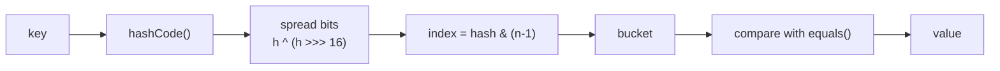
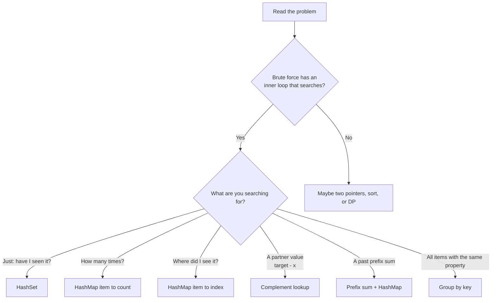

# HashMap (DSA) in Java: Beginner to Master

---

## Part 1: The Big Idea

### The problem it solves

You have a list of 1 million names. You want to know: **"Is 'Riyaz' in this list?"**

- **Array/List:** Check one by one. That is O(n).
- **Sorted array:** Binary search. That is O(log n).
- **HashMap/HashSet:** Jump straight to the answer. That is **O(1)** on average.

### Real-life intuition

Think of a **library with numbered shelves**.

You don't scan every shelf. A rule tells you: *"Books starting with 'R' go to shelf 18."*
You walk straight to shelf 18.

A HashMap does the same:
1. It takes your **key**.
2. It runs a **rule (hash function)** to get a shelf number.
3. It looks only at that shelf.

### What a HashMap stores

It stores **key → value** pairs.

```
"apple"  → 3
"banana" → 5
"mango"  → 1
```

- Keys are **unique**.
- Values can repeat.
- A **HashSet** is just a HashMap with keys only.

### The one-line summary of this whole topic

> **HashMap lets you replace a search loop with a lookup.**

Most HashMap problems come down to this. Keep it in mind through the whole guide.

---

## Part 2: How HashMap Works Inside

You do not need this for most problems. But it helps you reason about speed, bugs, and interview questions.

### The flow



### Buckets (the shelves)

Inside, HashMap is an **array of buckets**. Default size is 16.

```
index:   0     1     2     3     4    ...   15
       [   ] [   ] [ A ] [   ] [ B ]       [   ]
                     |           |
                   [ C ]       [ D ]
```

Here C shares a bucket with A, and D shares one with B. This is a **collision**.

### What is a collision?

Two different keys land in the **same bucket**.
This is normal. It cannot be fully avoided.

**How Java handles it:**
- Items in the same bucket are linked in a **linked list**.
- To find a key, Java goes to the bucket, then checks each node with `equals()`.
- **Java 8+:** if one bucket gets 8 or more nodes (and the table has at least 64 slots), the list becomes a **balanced tree**. Worst case becomes O(log n), not O(n).

### Load factor and resize

- **Load factor** = 0.75 by default.
- With capacity 16, the limit is 16 × 0.75 = **12 entries**.
- When you add the 13th, the table **doubles** to 32.
- All entries are **rehashed** into the new table.

This costs O(n) once in a while. But on average each `put` stays O(1). This is called **amortized O(1)**.

### Complexity table

| Operation | Average | Worst |
|---|---|---|
| `put` | O(1) | O(log n) (tree bucket) |
| `get` | O(1) | O(log n) |
| `containsKey` | O(1) | O(log n) |
| `remove` | O(1) | O(log n) |
| iterate all | O(n + capacity) | same |

> **Interview note:** Say "O(1) average." Never say "always O(1)."

### The equals/hashCode contract

This is the **most important rule** for custom keys.

1. If `a.equals(b)` is true, then `a.hashCode() == b.hashCode()` **must** be true.
2. Same hash does **not** mean equal. Collisions are allowed.

If you break rule 1, HashMap **cannot find your key**.

```java
class Point {
    int x, y;
    Point(int x, int y) { this.x = x; this.y = y; }
    // NO equals/hashCode -> BUG as a key
}

Map<Point, String> m = new HashMap<>();
m.put(new Point(1, 2), "A");
m.get(new Point(1, 2));   // null! Different objects, default identity hash
```

**Fix 1 (Java 16+):** use a `record`. It generates both methods.

```java
record Point(int x, int y) {}
Map<Point, String> m = new HashMap<>();
m.put(new Point(1, 2), "A");
m.get(new Point(1, 2));   // "A"
```

**Fix 2:** write `equals` and `hashCode` yourself (or use `Objects.hash(x, y)`).

---

## Part 3: Java API You Must Know

### Creating

```java
Map<String, Integer> map = new HashMap<>();
Set<Integer> set = new HashSet<>();
```

Always declare with the **interface** (`Map`), not the class.

### Core methods

```java
map.put("a", 1);                 // add or overwrite
map.get("a");                    // 1, or null if missing
map.getOrDefault("z", 0);        // 0 if missing
map.containsKey("a");            // true
map.containsValue(1);            // O(n), avoid in loops
map.remove("a");
map.size();
map.isEmpty();
map.putIfAbsent("b", 2);         // only if key missing
```

### Power methods (use these, they make code short)

**1. Count frequency**
```java
map.put(x, map.getOrDefault(x, 0) + 1);
// or the cleaner way:
map.merge(x, 1, Integer::sum);
```

**2. Group items into lists**
```java
map.computeIfAbsent(key, k -> new ArrayList<>()).add(item);
```

**3. Decrement and remove at zero**
```java
if (map.merge(c, -1, Integer::sum) == 0) map.remove(c);
```
`merge` returns the new value.

### Iterating

```java
for (Map.Entry<String, Integer> e : map.entrySet()) {
    String k = e.getKey();
    int v = e.getValue();
}
for (int v : map.values()) { }
for (String k : map.keySet()) { }
```

Use `entrySet()` when you need both key and value. It is faster than calling `get` for every key.

### The family

| Class | Order | Speed | Use when |
|---|---|---|---|
| `HashMap` | none | O(1) | default choice |
| `LinkedHashMap` | insertion (or access) order | O(1) | LRU cache, ordered output |
| `TreeMap` | sorted by key | O(log n) | need floor/ceiling/range |
| `HashSet` | none | O(1) | existence check |
| `TreeSet` | sorted | O(log n) | sorted unique values |

### Array instead of HashMap

If keys are small, like `'a'..'z'` or digits, use an array.

```java
int[] freq = new int[26];
freq[c - 'a']++;
```

It is faster and uses less memory. HashMap is for **large or unknown key ranges**.

---

## Part 4: Common Mistakes (Learn These Early)

### 1. Comparing `Integer` with `==`

```java
Map<String, Integer> m = new HashMap<>();
m.put("a", 1000);
m.put("b", 1000);
m.get("a") == m.get("b");        // false!
m.get("a").equals(m.get("b"));   // true
```

Java caches Integers only from -128 to 127. Always use `.equals()`.

### 2. Using arrays as keys

```java
Map<int[], Integer> m = new HashMap<>();
m.put(new int[]{1, 2}, 5);
m.get(new int[]{1, 2});          // null! arrays use identity hash
```

**Fix:** use `List<Integer>` (`List.of(1, 2)`), a `String` like `"1,2"`, a `record`, or encode as a `long`.

### 3. Changing a key after inserting

If a key's fields change, its hashCode changes. The entry is now in the wrong bucket and is lost. **Use immutable keys.**

### 4. Modifying a map while looping over it

```java
for (String k : map.keySet()) {
    if (bad(k)) map.remove(k);   // ConcurrentModificationException
}
```

**Fix:**
```java
map.entrySet().removeIf(e -> bad(e.getKey()));
```

### 5. Recursive `computeIfAbsent` for memoization

```java
// Can throw ConcurrentModificationException in Java 9+
memo.computeIfAbsent(n, k -> solve(k - 1) + solve(k - 2));
```

**Fix:** check `containsKey`, compute, then `put`.

### 6. `get` returns null → NullPointerException

```java
int x = map.get("missing");      // NPE (unboxing null)
```

Use `getOrDefault` or check first.

### 7. Integer overflow in prefix sums

Use `long` when sums can grow large.

---

## Part 5: How to Know a Problem Needs a HashMap

### The golden signal

Write the **brute force** first. Look at its shape.

```
for i in array:
    for j in array:        // <- this inner loop is "searching"
        if (something about i and j) ...
```

If the inner loop is **searching for something**, ask:

> *"Can I remember what I saw, so I can look it up instead of searching?"*

If yes, use a HashMap or HashSet.

### Keyword signals

| You see... | Think... |
|---|---|
| "Does X exist / any duplicate?" | `HashSet` |
| "Count occurrences / frequency" | `HashMap<item, count>` |
| "Find a pair that sums to / differs by K" | complement lookup |
| "Group by some property" | `HashMap<key, List>` |
| "Subarray with sum K" (negatives allowed) | prefix sum + HashMap |
| "First / last position of something" | `HashMap<item, index>` |
| "Longest / shortest window with condition" | sliding window + HashMap |
| "Same structure / one-to-one mapping" | two maps |
| "Cache / O(1) get and put" | HashMap + linked structure |
| "Clone / copy with references" | `HashMap<old, new>` |
| "Repeated subproblems" | memoization map |

### Decision flow



### The thought process in 5 steps

1. **Brute force first.** What is the O(n²) idea?
2. **Find the repeated search.** What does the inner loop look for?
3. **Decide the key.** What do I look up by?
4. **Decide the value.** What do I need back: count, index, list, or boolean?
5. **Decide the timing.** Do I look up *before* inserting or *after*? (This matters. See Two Sum.)

---

## Part 6: The Patterns

Each pattern has: **Idea → Template → Example → Why it works.**

---

### Pattern 1: Existence (HashSet)

**Idea:** "Have I seen this before?"

**Example: Contains Duplicate**
```java
public boolean containsDuplicate(int[] nums) {
    Set<Integer> seen = new HashSet<>();
    for (int x : nums) {
        if (!seen.add(x)) return true;   // add() returns false if already present
    }
    return false;
}
```

`add()` returns `false` when the element already exists. That makes it one line.

**Time:** O(n). **Space:** O(n).

---

### Pattern 2: Frequency Counting

**Idea:** Count how many times each item appears. Then answer questions using the counts.

**Template**
```java
Map<T, Integer> freq = new HashMap<>();
for (T x : items) freq.merge(x, 1, Integer::sum);
```

**Example: Valid Anagram**
Two strings are anagrams if they have the same letter counts.

```java
public boolean isAnagram(String s, String t) {
    if (s.length() != t.length()) return false;
    int[] count = new int[26];
    for (int i = 0; i < s.length(); i++) {
        count[s.charAt(i) - 'a']++;
        count[t.charAt(i) - 'a']--;
    }
    for (int c : count) if (c != 0) return false;
    return true;
}
```

Here an array is better than HashMap because there are only 26 keys. For Unicode input, use `HashMap<Character,Integer>`.

**Other problems:** Majority Element, First Unique Character, Ransom Note, Find All Anagrams in a String.

---

### Pattern 3: Complement Lookup (Two Sum)

**Idea:** For each `x`, I need a partner `target - x`. Don't search for it. **Remember** what I've seen and ask the map.

**Brute force:** O(n²). For each i, loop to find `target - nums[i]`.

**Optimized:**
```java
public int[] twoSum(int[] nums, int target) {
    Map<Integer, Integer> seen = new HashMap<>();   // value -> index
    for (int i = 0; i < nums.length; i++) {
        int need = target - nums[i];
        if (seen.containsKey(need)) {
            return new int[]{ seen.get(need), i };
        }
        seen.put(nums[i], i);
    }
    return new int[]{};
}
```

**Why look up before insert?**
Because an element must not pair with itself. If `nums = [3]` and `target = 6`, inserting first would wrongly match 3 with 3.

**Trace:** `nums = [2, 7, 11, 15]`, `target = 9`

```
i=0  x=2   need=7   seen={}          -> not found, put 2:0
i=1  x=7   need=2   seen={2:0}       -> FOUND -> [0, 1]
```

**Variations:**
- Count pairs with difference K: look up `x - k` and `x + k`.
- 4Sum II: store all sums of two arrays in a map, then look up the negated sums of the other two.

```java
public int fourSumCount(int[] a, int[] b, int[] c, int[] d) {
    Map<Integer, Integer> ab = new HashMap<>();
    for (int x : a) for (int y : b) ab.merge(x + y, 1, Integer::sum);
    int count = 0;
    for (int x : c) for (int y : d) count += ab.getOrDefault(-(x + y), 0);
    return count;
}
```
This is O(n²) instead of O(n⁴). The idea is "meet in the middle."

---

### Pattern 4: Store the Index (Last or First Seen)

**Idea:** Value = *where* I saw it. This lets me compute distances or jump a window start.

**Example: Longest Substring Without Repeating Characters**

```java
public int lengthOfLongestSubstring(String s) {
    Map<Character, Integer> last = new HashMap<>();   // char -> last index
    int left = 0, best = 0;
    for (int right = 0; right < s.length(); right++) {
        char c = s.charAt(right);
        if (last.containsKey(c) && last.get(c) >= left) {
            left = last.get(c) + 1;                   // jump past the duplicate
        }
        last.put(c, right);
        best = Math.max(best, right - left + 1);
    }
    return best;
}
```

**Why `last.get(c) >= left`?**
The map may hold an old index from *before* the window. That char is no longer in the window, so we must ignore it.

```
s = "abcabcbb"
 window grows: a, ab, abc
 right=3 'a' seen at 0, left=0 -> left=1  -> "bca"
 right=4 'b' seen at 1, left=1 -> left=2  -> "cab"
```

**Other problems:** Contains Duplicate II (`|i-j| <= k`), Two Sum (index version), Longest Subarray with Equal 0s and 1s.

---

### Pattern 5: Prefix Sum + HashMap

This is the most important advanced pattern. Take your time here.

**Problem:** Count subarrays whose sum equals K. The array can have **negative numbers**.

**Why sliding window fails:** With negatives, adding an element can make the sum go down. You cannot shrink the window by a simple rule.

**Key idea:**
Let `prefix[i]` = sum of the first i elements.
Sum of subarray `(j+1 .. i)` = `prefix[i] - prefix[j]`.

We want `prefix[i] - prefix[j] = K`. So:

```
prefix[j] = prefix[i] - K
```

At each position i, I ask:
> *"How many earlier prefix sums equal `prefix[i] - K`?"*

That is a map lookup.

```java
public int subarraySum(int[] nums, int k) {
    Map<Integer, Integer> count = new HashMap<>();   // prefix sum -> times seen
    count.put(0, 1);                                  // empty prefix
    int sum = 0, ans = 0;
    for (int x : nums) {
        sum += x;
        ans += count.getOrDefault(sum - k, 0);
        count.merge(sum, 1, Integer::sum);
    }
    return ans;
}
```

**Why `count.put(0, 1)`?**
It handles subarrays that start at index 0. If the running sum itself equals K, then `sum - k = 0`. We need 0 to already be in the map.

**Trace:** `nums = [1, 2, 3]`, `k = 3`

```
start: count={0:1}, sum=0, ans=0
x=1: sum=1, need -2 -> 0 found.      count={0:1, 1:1}
x=2: sum=3, need  0 -> 1 found. ans=1 ([1,2]).  count={0:1,1:1,3:1}
x=3: sum=6, need  3 -> 1 found. ans=2 ([3]).    count={...,6:1}
```

**Variants of the same trick:**

| Problem | What to store | Change |
|---|---|---|
| Longest subarray with sum K | first index of each prefix | `max(i - firstIndex)` |
| Equal 0s and 1s | treat 0 as -1, find sum 0 | store first index |
| Subarray sums divisible by K | `prefix % k` → count | use `((sum % k) + k) % k` |
| Continuous Subarray Sum (multiple of k, length ≥ 2) | `prefix % k` → first index | check `i - idx >= 2` |
| 2D prefix sums | same idea in 2D | |

**Rule to remember:**
> "Subarray" + "sum/count equals something" + negatives possible → **prefix sum + HashMap.**

---

### Pattern 6: Group by a Canonical Key

**Idea:** Items that are "the same" in some sense should share a key. Compute a **canonical form** for each item. Use it as the map key.

**Example: Group Anagrams**

All anagrams become the same string when sorted.

```java
public List<List<String>> groupAnagrams(String[] strs) {
    Map<String, List<String>> groups = new HashMap<>();
    for (String s : strs) {
        char[] a = s.toCharArray();
        Arrays.sort(a);
        String key = new String(a);
        groups.computeIfAbsent(key, k -> new ArrayList<>()).add(s);
    }
    return new ArrayList<>(groups.values());
}
```

**Faster key:** a count signature, which avoids sorting.
```java
int[] cnt = new int[26];
for (char c : s.toCharArray()) cnt[c - 'a']++;
String key = Arrays.toString(cnt);       // O(L) instead of O(L log L)
```

**The thinking skill:** *"What do all items in one group share? Turn that into a key."*

| Problem | Canonical key |
|---|---|
| Group Anagrams | sorted chars / count array |
| Group Shifted Strings | differences between consecutive chars |
| Find Duplicate Subtrees | serialized subtree string |
| Max Points on a Line | reduced slope (use gcd) |
| Group by digit sum | the digit sum |

---

### Pattern 7: Two-Way Mapping (Isomorphism)

**Idea:** Each A must map to exactly one B, **and** each B must come from exactly one A.

**Example: Isomorphic Strings** (`"egg"` and `"add"` → true; `"foo"` and `"bar"` → false)

```java
public boolean isIsomorphic(String s, String t) {
    Map<Character, Character> st = new HashMap<>();
    Map<Character, Character> ts = new HashMap<>();
    for (int i = 0; i < s.length(); i++) {
        char a = s.charAt(i), b = t.charAt(i);
        if (st.containsKey(a) && st.get(a) != b) return false;
        if (ts.containsKey(b) && ts.get(b) != a) return false;
        st.put(a, b);
        ts.put(b, a);
    }
    return true;
}
```

**Why two maps?** With one map, `"ab"` → `"aa"` passes. A→A and B→A. But two different letters cannot map to the same one. The reverse map catches this.

**Same idea:** Word Pattern, Valid Sudoku (sets per row/col/box).

---

### Pattern 8: Sliding Window + HashMap

**Idea:** The window's state is a **frequency map**. Expand the right edge. Shrink the left edge when a rule breaks.

**Template**
```java
Map<Character, Integer> cnt = new HashMap<>();
int left = 0;
for (int right = 0; right < n; right++) {
    // 1. add s[right] to the map
    // 2. while window is invalid: remove s[left], left++
    // 3. update the answer
}
```

**Example: Longest Substring with At Most K Distinct Characters**

```java
public int lengthOfLongestSubstringKDistinct(String s, int k) {
    Map<Character, Integer> cnt = new HashMap<>();
    int left = 0, best = 0;
    for (int right = 0; right < s.length(); right++) {
        cnt.merge(s.charAt(right), 1, Integer::sum);
        while (cnt.size() > k) {
            char c = s.charAt(left++);
            if (cnt.merge(c, -1, Integer::sum) == 0) cnt.remove(c);   // keep size() honest
        }
        best = Math.max(best, right - left + 1);
    }
    return best;
}
```

**Important:** Remove keys when the count hits 0. Otherwise `size()` is wrong.

**Other problems:** Minimum Window Substring, Permutation in String, Fruit Into Baskets, Longest Repeating Character Replacement.

**Window vs prefix-sum rule:**
- Only positives / validity is monotonic → sliding window.
- Negatives or "exactly K" sums → prefix sum + HashMap.

---

### Pattern 9: Sets for Smart Scanning

**Example: Longest Consecutive Sequence** (O(n), unsorted input)

Sorting gives O(n log n). We want O(n).

**Idea:** Only start counting from the **beginning** of a sequence. A number `x` is a start if `x - 1` is not in the set.

```java
public int longestConsecutive(int[] nums) {
    Set<Integer> set = new HashSet<>();
    for (int x : nums) set.add(x);
    int best = 0;
    for (int x : set) {
        if (!set.contains(x - 1)) {            // x is a sequence start
            int cur = x, len = 1;
            while (set.contains(cur + 1)) { cur++; len++; }
            best = Math.max(best, len);
        }
    }
    return best;
}
```

**Why O(n) and not O(n²)?**
Each number is visited by the inner `while` loop at most once. Only starts enter the loop, and each sequence is walked once.

---

### Pattern 10: Top K / Frequency Ranking

**Idea:** Count with a map. Then pick the top K by count.

```java
public int[] topKFrequent(int[] nums, int k) {
    Map<Integer, Integer> freq = new HashMap<>();
    for (int x : nums) freq.merge(x, 1, Integer::sum);

    // bucket sort: index = frequency
    List<Integer>[] bucket = new List[nums.length + 1];
    for (Map.Entry<Integer, Integer> e : freq.entrySet()) {
        int f = e.getValue();
        if (bucket[f] == null) bucket[f] = new ArrayList<>();
        bucket[f].add(e.getKey());
    }

    int[] res = new int[k];
    int idx = 0;
    for (int f = bucket.length - 1; f >= 0 && idx < k; f--) {
        if (bucket[f] == null) continue;
        for (int x : bucket[f]) {
            if (idx < k) res[idx++] = x;
        }
    }
    return res;
}
```

| Approach | Time |
|---|---|
| Map + sort entries | O(n log n) |
| Map + min-heap of size K | O(n log K) |
| Map + bucket sort | O(n) |

---

### Pattern 11: Clone / Copy with References

**Idea:** When copying a structure with cross-links (graph, linked list with random pointer), keep a map **old node → new node**. It prevents duplicates and breaks cycles.

```java
public Node cloneGraph(Node node) {
    if (node == null) return null;
    Map<Node, Node> copy = new HashMap<>();
    return dfs(node, copy);
}

private Node dfs(Node n, Map<Node, Node> copy) {
    if (copy.containsKey(n)) return copy.get(n);
    Node c = new Node(n.val);
    copy.put(n, c);                       // put BEFORE recursing, to stop cycles
    for (Node nei : n.neighbors) c.neighbors.add(dfs(nei, copy));
    return c;
}
```

The map also works as a **visited set**.

**Same idea:** Copy List with Random Pointer.

---

### Pattern 12: Memoization (DP Cache)

**Idea:** If a recursive function repeats the same inputs, store results in a map.

```java
Map<Integer, Long> memo = new HashMap<>();

long fib(int n) {
    if (n <= 1) return n;
    if (memo.containsKey(n)) return memo.get(n);
    long res = fib(n - 1) + fib(n - 2);
    memo.put(n, res);
    return res;
}
```

**For multi-parameter states**, build a key such as `i + "," + j`, a `record State(int i, int j)`, or encode as `i * 1_000_003L + j`. Prefer arrays when the state space is small and dense.

---

### Pattern 13: Design Problems (HashMap + Another Structure)

HashMap is fast at lookup but has no order and no "random pick." Combine it with another structure to fix that.

#### A. LRU Cache = HashMap + Doubly Linked List

```
HashMap:   key -> node
List:      [most recent] <-> ... <-> [least recent]

get(k):  map lookup, move node to front       O(1)
put(k):  insert at front; if full, remove tail O(1)
```

**Java shortcut with `LinkedHashMap`:**
```java
class LRUCache<K, V> extends LinkedHashMap<K, V> {
    private final int capacity;
    LRUCache(int capacity) {
        super(capacity, 0.75f, true);        // true = access order
        this.capacity = capacity;
    }
    @Override
    protected boolean removeEldestEntry(Map.Entry<K, V> eldest) {
        return size() > capacity;
    }
}
```
In interviews, you are usually expected to build the doubly linked list by hand. Know both.

#### B. Insert/Delete/GetRandom in O(1)

```
ArrayList:  [10, 20, 30, 40]     (for random access)
HashMap:    10->0, 20->1, 30->2, 40->3   (value -> index)

delete(20): swap 20 with the last element (40), pop the last,
            update map for 40.
```

```java
class RandomizedSet {
    private final List<Integer> list = new ArrayList<>();
    private final Map<Integer, Integer> idx = new HashMap<>();
    private final Random rnd = new Random();

    public boolean insert(int val) {
        if (idx.containsKey(val)) return false;
        idx.put(val, list.size());
        list.add(val);
        return true;
    }

    public boolean remove(int val) {
        if (!idx.containsKey(val)) return false;
        int i = idx.get(val);
        int last = list.get(list.size() - 1);
        list.set(i, last);                  // move last into the hole
        idx.put(last, i);
        list.remove(list.size() - 1);
        idx.remove(val);                    // remove AFTER updating (handles val == last)
        return true;
    }

    public int getRandom() {
        return list.get(rnd.nextInt(list.size()));
    }
}
```

**Other design problems:** LFU Cache (map + frequency buckets), Time-Based Key-Value Store (`Map<String, TreeMap<Integer,String>>`), Design Twitter, Logger Rate Limiter, Insert Delete GetRandom with duplicates.

---

### Pattern 14: Hashing Strings and Structures

- **Rolling hash (Rabin-Karp):** find a pattern in text by comparing hash numbers, not strings. On a hash match, verify with `equals`.
- **Serialization as a key:** turn a tree into a string such as `"1,2,#,#,3,#,#"` and use it as a map key to detect duplicate subtrees.
- **Bitmask as a key:** for small sets of up to 31 items, encode the set as an `int` (for example, to track which letters appeared).

---

## Part 7: HashMap vs. Other Tools

| Situation | Better tool |
|---|---|
| Sorted array, find pair, O(1) space needed | two pointers |
| Need sorted order / nearest key / range | `TreeMap` |
| Keys are small ints (0..n or a..z) | plain array |
| Need min/max repeatedly | heap |
| Need insertion order preserved | `LinkedHashMap` |
| Multithreaded access | `ConcurrentHashMap` |

**Trade-off to say in interviews:**
HashMap trades **space for time**. You pay O(n) memory to get O(1) lookups. If the interviewer says "O(1) space," think two pointers or sorting instead.

---

## Part 8: Advanced Topics

### 1. Why is capacity always a power of 2?

The index is `hash & (n - 1)`. That works like `hash % n` but is faster. It only works correctly when n is a power of 2.

### 2. Why `h ^ (h >>> 16)`?

Using `& (n-1)` only looks at the **low bits**. If hash codes differ only in their high bits, they would collide. XOR-ing the high 16 bits into the low 16 spreads the information.

### 3. Resizing cost

If you know the size ahead, pre-size the map to avoid rehashing:
```java
Map<Integer, Integer> m = new HashMap<>(expectedSize * 4 / 3 + 1);
```

### 4. HashMap is not thread-safe

Concurrent writes can corrupt it. Use `ConcurrentHashMap`, or wrap with `Collections.synchronizedMap`.

### 5. Null handling

- `HashMap` allows one `null` key and many `null` values.
- `ConcurrentHashMap` and `TreeMap` do not allow null keys.

### 6. Iteration order is not guaranteed

Never depend on it. If order matters, use `LinkedHashMap` or `TreeMap`.

### 7. Hash collision attacks

An attacker can craft many keys with the same hash to slow your map. Java 8's tree buckets reduce the damage, since worst case becomes O(log n) for comparable keys.

---

## Part 9: Cheat Sheet

### Templates

```java
// Existence
Set<T> seen = new HashSet<>();
if (!seen.add(x)) { /* duplicate */ }

// Frequency
Map<T,Integer> f = new HashMap<>();
f.merge(x, 1, Integer::sum);

// Group
map.computeIfAbsent(key, k -> new ArrayList<>()).add(x);

// Complement
if (seen.containsKey(target - x)) { ... }
seen.put(x, i);

// Prefix sum
count.put(0, 1);
sum += x;
ans += count.getOrDefault(sum - k, 0);
count.merge(sum, 1, Integer::sum);

// Remove at zero
if (cnt.merge(c, -1, Integer::sum) == 0) cnt.remove(c);
```

### Quick questions to ask yourself

1. Is my inner loop only *searching*? → Use a map.
2. What is the **key**? What is the **value**?
3. Look up **before** or **after** inserting?
4. Are negatives allowed? → Prefix sum, not sliding window.
5. Is the key range small? → Use an array.
6. Is my key **immutable** and does it have proper `equals`/`hashCode`?
7. Did I handle the base case (`put(0, 1)`)?
8. Do I need to remove keys at zero count?

---

## Part 10: Practice Roadmap (LeetCode)

**Level 1: Foundations**
1. Contains Duplicate
2. Valid Anagram
3. Two Sum
4. Ransom Note
5. First Unique Character in a String
6. Majority Element
7. Intersection of Two Arrays II

**Level 2: Core patterns**
8. Group Anagrams
9. Top K Frequent Elements
10. Longest Consecutive Sequence
11. Isomorphic Strings / Word Pattern
12. Valid Sudoku
13. Contains Duplicate II
14. Longest Substring Without Repeating Characters
15. Subarray Sum Equals K
16. 4Sum II

**Level 3: Advanced**
17. Continuous Subarray Sum
18. Subarray Sums Divisible by K
19. Contiguous Array
20. Minimum Window Substring
21. Longest Substring with At Most K Distinct Characters
22. Clone Graph / Copy List with Random Pointer
23. Find Duplicate Subtrees
24. Max Points on a Line

**Level 4: Design**
25. LRU Cache
26. Insert Delete GetRandom O(1)
27. Time Based Key-Value Store
28. LFU Cache
29. Insert Delete GetRandom O(1) with Duplicates

### How to practice each problem

1. Write the brute force in one line.
2. Mark the "search" part.
3. Name your key and value out loud.
4. Code it.
5. Trace with a tiny example.
6. State time and space.
7. Ask: "Could an array or two pointers do this with less space?"

---

## Final Mental Model

```
Brute force  ->  find repeated search  ->  remember past in a map
   O(n^2)                                       O(n)
```

If you remember one thing:

> **A HashMap is memory you can query instantly. When your algorithm keeps asking "have I seen something like this before?", store the answer once and look it up forever.**

Want to go deeper? I can write a hands-on practice set, with 10 problems in increasing difficulty, each with hints (not solutions), so you can test pattern recognition yourself.
