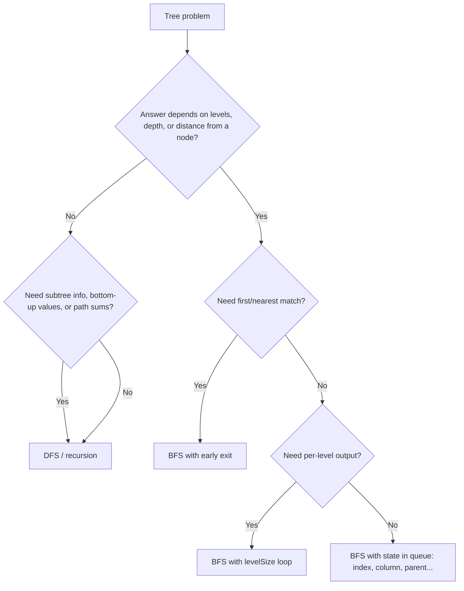

# Tree BFS (Level-Order Traversal) in Java

## 1. The core idea

**BFS visits a tree one level at a time, from the top down.** Everything at depth 0, then everything at depth 1, then depth 2, and so on.

```
            1            <- level 0
          /   \
         2     3         <- level 1
        / \     \
       4   5     6       <- level 2
          /
         7               <- level 3

BFS order: 1 | 2 3 | 4 5 6 | 7
```

**Intuition:** drop a stone in water and the ripples spread outward in rings. The root is the stone, and each level is one ring. BFS asks "who is 1 step away, then 2 steps, then 3?"

**The data structure is a queue (FIFO).** Children are added to the back while we process the front, so a node's children can only be processed after everything already on its level. That is what enforces the level ordering.

```
Queue trace for the tree above (front on the left):

start:          [1]
poll 1, add 2,3:   [2, 3]
poll 2, add 4,5:   [3, 4, 5]
poll 3, add 6:     [4, 5, 6]
poll 4:            [5, 6]
poll 5, add 7:     [6, 7]
poll 6:            [7]
poll 7:            []
```

## 2. The template

Memorize this one. About 90% of tree BFS problems are small edits to it.

```java
class TreeNode {
    int val;
    TreeNode left, right;
    TreeNode(int val) { this.val = val; }
}

public List<List<Integer>> levelOrder(TreeNode root) {
    List<List<Integer>> result = new ArrayList<>();
    if (root == null) return result;              // 1. guard

    Queue<TreeNode> queue = new ArrayDeque<>();   // 2. queue
    queue.offer(root);

    while (!queue.isEmpty()) {                    // 3. one iteration = one level
        int levelSize = queue.size();             // 4. SNAPSHOT the size
        List<Integer> level = new ArrayList<>(levelSize);

        for (int i = 0; i < levelSize; i++) {     // 5. process exactly this level
            TreeNode node = queue.poll();
            level.add(node.val);                  // <-- per-node work goes here

            if (node.left != null)  queue.offer(node.left);
            if (node.right != null) queue.offer(node.right);
        }
        result.add(level);                        // <-- per-level work goes here
    }
    return result;
}
```

### Why the `levelSize` snapshot matters

When a level starts, the queue contains exactly that level's nodes. While you process them, you add the next level's nodes to the back. If you loop on `queue.size()` directly, the size changes mid-loop and levels blur together. Freezing the size into `levelSize` gives you a clean boundary between levels.

That boundary is what lets you answer level-dependent questions: "last node of each level", "sum of each level", "depth", "which level is this node on".

**Two skeletons to know:**

| Skeleton | Use when |
|---|---|
| **Level-by-level** (with `levelSize` loop) | The answer depends on which level a node is on, or you need per-level output |
| **Plain queue loop** (no inner loop) | You only need the visiting order, or you track depth inside the queue entry |

### Complexity

- **Time:** O(n). Every node is enqueued and dequeued once.
- **Space:** O(w), where w is the maximum width of the tree. For a complete tree the last level has about n/2 nodes, so worst case is O(n). For a skewed tree it is O(1), which is where BFS beats recursive DFS, since DFS uses O(h) stack that can reach O(n) on a skewed tree.

## 3. How to recognize a Tree BFS problem

Look for these signals in the problem statement:

1. **The word "level"** appears: level order, per level, each level, by level.
2. **Depth-based answers:** minimum depth, "closest leaf", "shortest path from the root", "first node at depth k".
3. **Row/layer language:** "right side view", "leftmost value in the last row", "largest value in each row".
4. **Sibling or neighbor relationships on the same level:** connect next pointers, cousins, width.
5. **"Nearest / minimum steps"** in a tree treated as a graph: distance K, time to spread from a node, burning tree.
6. **Serialization or construction in array/level form**, since heap-style arrays are level-order.
7. **Early termination pays off:** you want the *first* node satisfying a condition top-down, and going deeper is wasteful.

### The thought process

Ask these questions in order:



**Rule of thumb:** DFS is natural when information flows *from children to parent* (heights, diameters, subtree sums). BFS is natural when information flows *across a level* or *outward from a source*.

## 4. Variants and patterns

### Pattern A: Collect per level (the baseline)

**Level Order Traversal (LC 102)** is the template in section 2.

**Reverse Level Order (LC 107):** run the same code, then reverse the result. Or insert at the front with `result.add(0, level)`, though that is O(L²) over the levels, so reversing once is better.

```java
Collections.reverse(result);
```

### Pattern B: Alternate direction (Zigzag, LC 103)

Do not change the traversal order. Only change how you store each level.

```java
public List<List<Integer>> zigzagLevelOrder(TreeNode root) {
    List<List<Integer>> result = new ArrayList<>();
    if (root == null) return result;

    Queue<TreeNode> queue = new ArrayDeque<>();
    queue.offer(root);
    boolean leftToRight = true;

    while (!queue.isEmpty()) {
        int size = queue.size();
        Deque<Integer> level = new ArrayDeque<>();

        for (int i = 0; i < size; i++) {
            TreeNode node = queue.poll();
            if (leftToRight) level.addLast(node.val);
            else             level.addFirst(node.val);

            if (node.left != null)  queue.offer(node.left);
            if (node.right != null) queue.offer(node.right);
        }
        result.add(new ArrayList<>(level));
        leftToRight = !leftToRight;
    }
    return result;
}
```

**Lesson:** the traversal stays the same, and only the output arrangement changes.

### Pattern C: Pick a specific node per level

**Right Side View (LC 199):** take the last node of each level.

```java
public List<Integer> rightSideView(TreeNode root) {
    List<Integer> view = new ArrayList<>();
    if (root == null) return view;
    Queue<TreeNode> queue = new ArrayDeque<>();
    queue.offer(root);

    while (!queue.isEmpty()) {
        int size = queue.size();
        for (int i = 0; i < size; i++) {
            TreeNode node = queue.poll();
            if (i == size - 1) view.add(node.val);   // last in level
            if (node.left != null)  queue.offer(node.left);
            if (node.right != null) queue.offer(node.right);
        }
    }
    return view;
}
```

Left view is `i == 0`. **Find Bottom Left Tree Value (LC 513)** is the first node of the last level. A neat trick is to enqueue right before left, so the last node polled is the answer, with no level tracking at all.

### Pattern D: Aggregate per level

**Average of Levels (LC 637), Largest Value in Each Row (LC 515), Deepest Leaves Sum (LC 1302).**

```java
public List<Double> averageOfLevels(TreeNode root) {
    List<Double> res = new ArrayList<>();
    Queue<TreeNode> q = new ArrayDeque<>();
    q.offer(root);
    while (!q.isEmpty()) {
        int size = q.size();
        long sum = 0;                       // long to avoid int overflow
        for (int i = 0; i < size; i++) {
            TreeNode n = q.poll();
            sum += n.val;
            if (n.left != null)  q.offer(n.left);
            if (n.right != null) q.offer(n.right);
        }
        res.add((double) sum / size);
    }
    return res;
}
```

For Deepest Leaves Sum, reset `sum` at each level and return the last computed sum when the queue empties.

### Pattern E: Depth and early exit

**Maximum Depth (LC 104):** count the levels.

```java
int depth = 0;
while (!q.isEmpty()) {
    int size = q.size();
    for (int i = 0; i < size; i++) { /* poll, enqueue children */ }
    depth++;
}
return depth;
```

**Minimum Depth (LC 111):** this is where BFS wins. Return at the *first leaf* you see.

```java
public int minDepth(TreeNode root) {
    if (root == null) return 0;
    Queue<TreeNode> q = new ArrayDeque<>();
    q.offer(root);
    int depth = 1;

    while (!q.isEmpty()) {
        int size = q.size();
        for (int i = 0; i < size; i++) {
            TreeNode n = q.poll();
            if (n.left == null && n.right == null) return depth;  // first leaf
            if (n.left != null)  q.offer(n.left);
            if (n.right != null) q.offer(n.right);
        }
        depth++;
    }
    return depth;
}
```

DFS must explore the whole tree to be sure. BFS stops at the first leaf, so it is far faster on wide, shallow-leaf trees. This "first hit is optimal" property is the heart of BFS for shortest-path-style questions.

### Pattern F: Connect same-level neighbors

**Populating Next Right Pointers (LC 116 / 117).**

Basic version with a queue:

```java
for (int i = 0; i < size; i++) {
    Node n = q.poll();
    if (i < size - 1) n.next = q.peek();   // next in queue is its right neighbor
    if (n.left != null)  q.offer(n.left);
    if (n.right != null) q.offer(n.right);
}
```

**Advanced: O(1) extra space.** Use the `next` pointers you have already built as the "queue" for the level below. This works for any binary tree (LC 117):

```java
public Node connect(Node root) {
    Node levelStart = root;
    while (levelStart != null) {
        Node dummy = new Node(0), tail = dummy;      // builds next level's chain
        for (Node cur = levelStart; cur != null; cur = cur.next) {
            if (cur.left != null)  { tail.next = cur.left;  tail = tail.next; }
            if (cur.right != null) { tail.next = cur.right; tail = tail.next; }
        }
        levelStart = dummy.next;                      // move to next level
    }
    return root;
}
```

This is a strong interview follow-up. It shows you understand that a "level" is a linked list you can walk without extra memory.

### Pattern G: Carry extra state in the queue

Sometimes a node alone is not enough. You need the node plus something else.

**Maximum Width of Binary Tree (LC 662).** Number nodes like a heap: the children of index `i` are `2i` and `2i+1`. Width of a level is `lastIdx - firstIdx + 1`.

```java
record Pair(TreeNode node, long idx) {}

public int widthOfBinaryTree(TreeNode root) {
    long best = 0;
    Queue<Pair> q = new ArrayDeque<>();
    q.offer(new Pair(root, 0));

    while (!q.isEmpty()) {
        int size = q.size();
        long first = q.peek().idx();          // normalize to prevent overflow
        long last = 0;
        for (int i = 0; i < size; i++) {
            Pair p = q.poll();
            long idx = p.idx() - first;
            last = idx;
            if (p.node().left != null)  q.offer(new Pair(p.node().left,  2 * idx));
            if (p.node().right != null) q.offer(new Pair(p.node().right, 2 * idx + 1));
        }
        best = Math.max(best, last + 1);
    }
    return (int) best;
}
```

The pitfall is index overflow on deep skewed trees. Subtracting the level's first index keeps the numbers small.

**Vertical Order Traversal (LC 314):** store `(node, column)`. Left child gets `col - 1`, right child gets `col + 1`. BFS guarantees top-to-bottom, left-to-right order within a column. (LC 987 also asks you to sort ties on the same row and column, so it is harder.)

```java
public List<List<Integer>> verticalOrder(TreeNode root) {
    List<List<Integer>> res = new ArrayList<>();
    if (root == null) return res;
    TreeMap<Integer, List<Integer>> cols = new TreeMap<>();
    Queue<TreeNode> nodes = new ArrayDeque<>();
    Queue<Integer> colQ = new ArrayDeque<>();
    nodes.offer(root); colQ.offer(0);

    while (!nodes.isEmpty()) {
        TreeNode n = nodes.poll();
        int c = colQ.poll();
        cols.computeIfAbsent(c, k -> new ArrayList<>()).add(n.val);
        if (n.left != null)  { nodes.offer(n.left);  colQ.offer(c - 1); }
        if (n.right != null) { nodes.offer(n.right); colQ.offer(c + 1); }
    }
    res.addAll(cols.values());
    return res;
}
```

**Cousins in Binary Tree (LC 993):** at each level, check that x and y are both present and do *not* share the same parent.

### Pattern H: Validate structure level by level

**Check Completeness of a Binary Tree (LC 958).** Enqueue *including nulls*. Once you see a null, every later node must be null.

```java
public boolean isCompleteTree(TreeNode root) {
    Queue<TreeNode> q = new LinkedList<>();   // LinkedList allows null
    q.offer(root);
    boolean seenNull = false;
    while (!q.isEmpty()) {
        TreeNode n = q.poll();
        if (n == null) { seenNull = true; continue; }
        if (seenNull) return false;           // node after a gap
        q.offer(n.left);
        q.offer(n.right);
    }
    return true;
}
```

Important: `ArrayDeque` throws `NullPointerException` on null, so use `LinkedList` when you must enqueue nulls.

**Even-Odd Tree (LC 1609):** at even levels values must be odd and strictly increasing, at odd levels even and strictly decreasing. Track `level % 2` and the previous value.

### Pattern I: Serialization (LC 297)

Level-order with null markers is the same format LeetCode uses for its examples.

```java
public String serialize(TreeNode root) {
    if (root == null) return "";
    StringBuilder sb = new StringBuilder();
    Queue<TreeNode> q = new LinkedList<>();
    q.offer(root);
    while (!q.isEmpty()) {
        TreeNode n = q.poll();
        if (n == null) { sb.append("null,"); continue; }
        sb.append(n.val).append(',');
        q.offer(n.left);
        q.offer(n.right);
    }
    return sb.toString();
}

public TreeNode deserialize(String data) {
    if (data.isEmpty()) return null;
    String[] t = data.split(",");
    TreeNode root = new TreeNode(Integer.parseInt(t[0]));
    Queue<TreeNode> q = new ArrayDeque<>();
    q.offer(root);
    int i = 1;
    while (!q.isEmpty() && i < t.length) {
        TreeNode parent = q.poll();
        if (!t[i].equals("null")) {
            parent.left = new TreeNode(Integer.parseInt(t[i]));
            q.offer(parent.left);
        }
        i++;
        if (i < t.length && !t[i].equals("null")) {
            parent.right = new TreeNode(Integer.parseInt(t[i]));
            q.offer(parent.right);
        }
        i++;
    }
    return root;
}
```

The queue during deserialization mirrors the queue during serialization: parents are consumed in the same order they were produced.

### Pattern J: Tree as an undirected graph (advanced)

A tree only has downward edges. For "distance from an arbitrary node" you need the *upward* edge too. The fix is to build a **parent map**, then run BFS with a `visited` set.

**All Nodes Distance K in Binary Tree (LC 863):**

```java
public List<Integer> distanceK(TreeNode root, TreeNode target, int k) {
    Map<TreeNode, TreeNode> parent = new HashMap<>();
    // Step 1: BFS to record parents
    Queue<TreeNode> q = new ArrayDeque<>();
    q.offer(root);
    while (!q.isEmpty()) {
        TreeNode n = q.poll();
        if (n.left != null)  { parent.put(n.left, n);  q.offer(n.left); }
        if (n.right != null) { parent.put(n.right, n); q.offer(n.right); }
    }

    // Step 2: BFS outward from target, k levels
    Set<TreeNode> seen = new HashSet<>();
    q.offer(target);
    seen.add(target);
    int dist = 0;
    while (!q.isEmpty() && dist < k) {
        int size = q.size();
        for (int i = 0; i < size; i++) {
            TreeNode n = q.poll();
            for (TreeNode nb : new TreeNode[]{n.left, n.right, parent.get(n)}) {
                if (nb != null && seen.add(nb)) q.offer(nb);
            }
        }
        dist++;
    }
    return q.stream().map(n -> n.val).toList();
}
```

The same idea solves **Amount of Time for Binary Tree to Be Infected (LC 2385)**: BFS from the start node over parent, left and right, and the answer is the number of levels minus 1. It is also the basis for multi-source BFS. Enqueue several starting nodes at level 0 and they all spread simultaneously.

### Pattern K: N-ary trees (LC 429)

The template is identical. Replace the two `if` lines with a loop over `children`:

```java
for (Node child : node.children) queue.offer(child);
```

## 5. BFS vs DFS

| Question | Prefer |
|---|---|
| Per-level output, level aggregates | **BFS** |
| Minimum depth / nearest match | **BFS** (early exit) |
| Neighbors on the same level | **BFS** |
| Distance from a non-root node | **BFS** (parent map) |
| Height, diameter, balance, LCA | **DFS** (bottom-up) |
| Path sums, root-to-leaf paths | **DFS** (carry state down) |
| Very wide tree, memory tight | **DFS** (O(h) vs O(w)) |
| Very deep tree, stack overflow risk | **BFS** (heap queue, no recursion) |

**Hybrid trick:** you can produce level-order with DFS by passing `depth` and grouping by index. This is useful when you want DFS's structure but level-based output:

```java
void dfs(TreeNode n, int depth, List<List<Integer>> res) {
    if (n == null) return;
    if (depth == res.size()) res.add(new ArrayList<>());
    res.get(depth).add(n.val);
    dfs(n.left, depth + 1, res);
    dfs(n.right, depth + 1, res);
}
```

## 6. Common pitfalls

1. **Not snapshotting `queue.size()`** before the inner loop. This is the most frequent bug and it silently merges levels.
2. **Forgetting the `root == null` guard.** `queue.offer(null)` on an `ArrayDeque` throws.
3. **Using `ArrayDeque` when you need nulls in the queue.** Use `LinkedList` (completeness check, serialization).
4. **Using `Stack` or `LinkedList` as a stack by accident.** For a queue use `poll`/`offer`, not `pop`/`push`.
5. **Off-by-one on depth.** Decide whether the root is depth 0 or 1 and match the problem's definition.
6. **Overflow in index-based problems** (width). Normalize indices per level.
7. **Enqueuing nulls, then dereferencing them.** Check `if (node != null)` before children.
8. **Marking `visited` too late** in the graph-style variant. Mark when you *enqueue*, not when you dequeue, or you will enqueue the same node many times.
9. **Assuming BFS is always better for shortest paths.** It is only correct here because every edge has the same weight of 1.

## 7. A reusable checklist for any new problem

1. Is the tree rooted, and do I need levels or distance? If yes, use BFS.
2. What does one *level* need to produce: a list, a sum, one node, a boolean?
3. What does one *node* need to carry besides itself: index, column, parent, depth?
4. Do I need nulls in the queue? If yes, use `LinkedList`.
5. Can I stop early? If yes, return inside the loop.
6. Do I need upward movement? If yes, build a parent map plus `visited`.
7. Can space be reduced by reusing existing pointers, as in the `next` trick?

## 8. Practice roadmap

**Tier 1, foundation:** 102 Level Order, 107 Level Order II, 104 Max Depth, 111 Min Depth, 199 Right Side View, 637 Average of Levels, 515 Largest Value in Each Row.

**Tier 2, variations:** 103 Zigzag, 116 and 117 Next Pointers, 429 N-ary Level Order, 513 Bottom Left Value, 1302 Deepest Leaves Sum, 993 Cousins, 958 Complete Tree, 1609 Even-Odd Tree.

**Tier 3, state in the queue:** 662 Maximum Width, 314 Vertical Order, 987 Vertical Traversal (with sort), 297 Serialize/Deserialize.

**Tier 4, graph-style BFS:** 863 Distance K, 2385 Infection Time, 1161 Max Level Sum, 623 Add One Row, 919 Complete Binary Tree Inserter.

Work through each tier until you can write the template from scratch and explain, for every problem, *why* BFS fits and what the queue carries. That reasoning matters more than the code.

If you'd like, I can put this into a Markdown file for your DSA notes, or turn it into a runnable Java file with a `TreeNode` builder and tests for each pattern.
