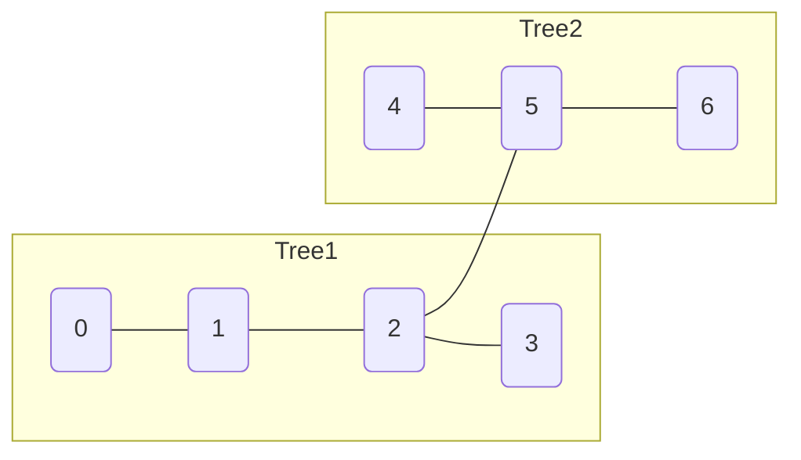

Alright — let’s rebuild this from **first principles** so it *clicks intuitively*, not just formula memorization.

---

# 🧠 Step 1: What is the problem really asking?

You have:

* Tree A
* Tree B

You will:
👉 Add **ONE edge** between any node in A and any node in B

Then:
👉 Find the **minimum possible diameter** of the final tree

---

# 🧠 Step 2: What is "diameter"?

👉 Diameter = **longest path between any 2 nodes**

### Example

```
0 - 1 - 2 - 3
```

Diameter = 3 (from 0 → 3)

---

# 🧠 Step 3: What happens when we connect trees?

Let’s say:

```
Tree1:     0 - 1 - 2
Tree2:     3 - 4
```

Now we connect:

```
2 ---- 3
```

Final tree:

```
0 - 1 - 2 - 3 - 4
```

👉 Diameter = 4

---

# ❗ Important Observation

After merging, the **longest path** can be:

### Case 1: Completely inside Tree1

→ length = `d1`

### Case 2: Completely inside Tree2

→ length = `d2`

### Case 3: Crossing between trees

→ THIS is the tricky one

---

# 🧠 Step 4: Understand the "cross-tree path"

This path looks like:

```
deep node in Tree1 → ... → connection → ... → deep node in Tree2
```

So:

```
distance = (distance from node → connection in Tree1)
         + 1 (new edge)
         + (distance from connection → node in Tree2)
```

---

# 🔥 Key Question

👉 How do we minimize this cross-tree distance?

We control:

* Which node in Tree1 we connect
* Which node in Tree2 we connect

---

# ❌ Bad Idea: Connect endpoints

Example:

```
Tree1: 0 - 1 - 2 - 3   (diameter = 3)
Tree2: 4 - 5 - 6       (diameter = 2)
```

Connect endpoints:

```
3 ---- 6
```

Longest path:

```
0 → 1 → 2 → 3 → 6 → 5 → 4
= 6
```

❌ Too big

---

# ✅ Better Idea: Connect centers

Now we introduce a new concept.

---

# 🧠 Step 5: What is "center" of a tree?

Center = node which minimizes the **maximum distance to all nodes**

👉 Think of it as:

> “Best middle point of the tree”

---

### Example

```
0 - 1 - 2 - 3
```

* Diameter = 3
* Center = node `1` or `2`

---

# 🧠 Step 6: What is radius?

👉 Radius = distance from center to farthest node

For above:

```
radius = ceil(diameter / 2)
       = (3 + 1) / 2 = 2
```

---

# 🔥 Why center matters?

If you connect at center:

* Maximum distance inside tree is minimized
* So cross-tree path becomes smallest

---

# 🧪 Example: Compare both approaches

---

## ❌ Connect endpoints

Tree1:

```
0 - 1 - 2 - 3
```

Tree2:

```
4 - 5 - 6
```

Connect:

```
3 --- 6
```

Longest path:

```
0 → 6 → 4 = 6 steps
```

---

## ✅ Connect centers

Tree1 center = 1 or 2
Tree2 center = 5

Connect:

```
2 --- 5
```

Now longest path:

```
0 → 2 → 5 → 4 = 4 steps
```

👉 MUCH smaller!

---

# 🧠 Step 7: Generalizing this

For each tree:

```
Max distance from center = radius
```

So cross-tree path becomes:

```
radius1 + 1 + radius2
```

---

# 🧠 Step 8: Final answer logic

After merging:

```
final diameter = max(
    d1,                      // inside Tree1
    d2,                      // inside Tree2
    radius1 + radius2 + 1    // cross-tree path
)
```

---

# 🔥 Why we take max?

Because longest path could be:

* fully inside Tree1
* fully inside Tree2
* or crossing trees

---

# 🧠 Step 9: Why NOT brute force?

If you try all connections:

```
n * m possibilities → 10^5 * 10^5 = 10^10 ❌
```

Impossible.

---

# 🧠 Step 10: Final intuition (MOST IMPORTANT)

👉 Connecting trees is like:

> "Where should I attach them so the longest path is minimized?"

Answer:

✅ Attach at **centers**

Because:

* endpoints = worst
* random nodes = unpredictable
* centers = balanced

---

# 🧠 One-line intuition

> “To minimize longest path, connect the most central points.”

---

# 🏁 Final Summary

* Diameter → longest path in tree
* Radius → distance from center to farthest node
* Best merge → connect centers
* Final answer:

```
max(d1, d2, r1 + r2 + 1)
```

---

# 🔥 If you still feel unclear

I can next show:

1. 🎯 Visual animation-style explanation
2. 🧩 How to find center nodes step-by-step
3. 🧠 Why radius = (diameter + 1) / 2 (proof)

Just tell me 👍


Great — let’s **visualize this like an animation** so your brain *sees* why this works 👇

---

# 🎬 Step 1: Two separate trees

### Tree 1

```
0 — 1 — 2 — 3
```

### Tree 2

```
4 — 5 — 6
```

---

# 🎯 Step 2: What is diameter?

👉 Longest path in each tree

```
Tree1: 0 → 3  → length = 3
Tree2: 4 → 6  → length = 2
```

---

# 🎬 Step 3: Try a BAD connection (endpoints)

```
0 — 1 — 2 — 3
               \
                6 — 5 — 4
```

---

## 🔥 Longest path now?

```
0 → 1 → 2 → 3 → 6 → 5 → 4
= 6 edges
```

❌ Diameter = **6 (very large!)**

---

# 🎬 Step 4: Let’s “move” the connection inward

We slowly shift connection toward the middle 👇

---

## Step 4A: Slightly better

```
0 — 1 — 2 — 3
          \
           5 — 4
            \
             6
```

Still long paths exist.

---

# 🎯 Step 5: Find CENTER of each tree

---

## Tree1

```
0 — 1 — 2 — 3
      ↑   ↑
    centers
```

## Tree2

```
4 — 5 — 6
      ↑
    center
```

---

# 🎬 Step 6: BEST connection (center to center)

```
0 — 1 — 2 — 3
        |
        5
       / \
      4   6
```

---

# 🎯 Now check longest path

### Option 1:

```
0 → 3 = 3
```

### Option 2:

```
4 → 6 = 2
```

### Option 3 (cross tree):

```
0 → 1 → 2 → 5 → 4 = 4
```

👉 Diameter = **4**

---

# 🧠 Compare results

| Connection Type | Diameter |
| --------------- | -------- |
| Endpoints       | 6 ❌      |
| Random          | 5 ❌      |
| Centers         | 4 ✅      |

---

# 🎬 Step 7: Why center works (visual intuition)

Think of trees as "stretchable ropes":

---

## ❌ Endpoint connection

```
[----Tree1----]----[----Tree2----]
```

👉 Long + long = VERY long

---

## ✅ Center connection

```
      [Tree1]
         |
        (center)
         |
        (center)
         |
      [Tree2]
```

👉 Balanced → shortest maximum distance

---

# 🎬 Step 8: Visualizing radius

### Tree1

```
0 — 1 — 2 — 3
      ↑
    center
```

Max distance from center:

```
2 → 0 = 2
2 → 3 = 1
```

👉 radius ≈ 2

---

### Tree2

```
4 — 5 — 6
      ↑
```

Max distance:

```
5 → 4 = 1
5 → 6 = 1
```

👉 radius = 1

---

# 🎯 Step 9: Build cross-tree path

```
(deep node in Tree1)
        ↓
0 → 1 → 2
           \
            5 → 4
```

Distance:

```
= radius1 + 1 + radius2
= 2 + 1 + 1 = 4
```

---

# 🎬 Step 10: Mermaid Visualization (clean mental model)



---

# 🧠 Final Intuition (Lock this in)

👉 The longest path after merging is either:

1. Inside Tree1 → `d1`
2. Inside Tree2 → `d2`
3. Crossing trees:

```
deepest → center → center → deepest
= r1 + r2 + 1
```

---

# 🏁 Final Formula

```
max(d1, d2, r1 + r2 + 1)
```

---

# 🔥 Interview Trick (Golden Line)

> “To minimize the maximum distance, always connect the most central points.”

---

If you want next:

* 🎯 How to FIND center using BFS (very important)
* 🧠 Why radius = (d+1)/2 proof (visual)
* 💻 Full Java + dry run

Just tell me 👍

