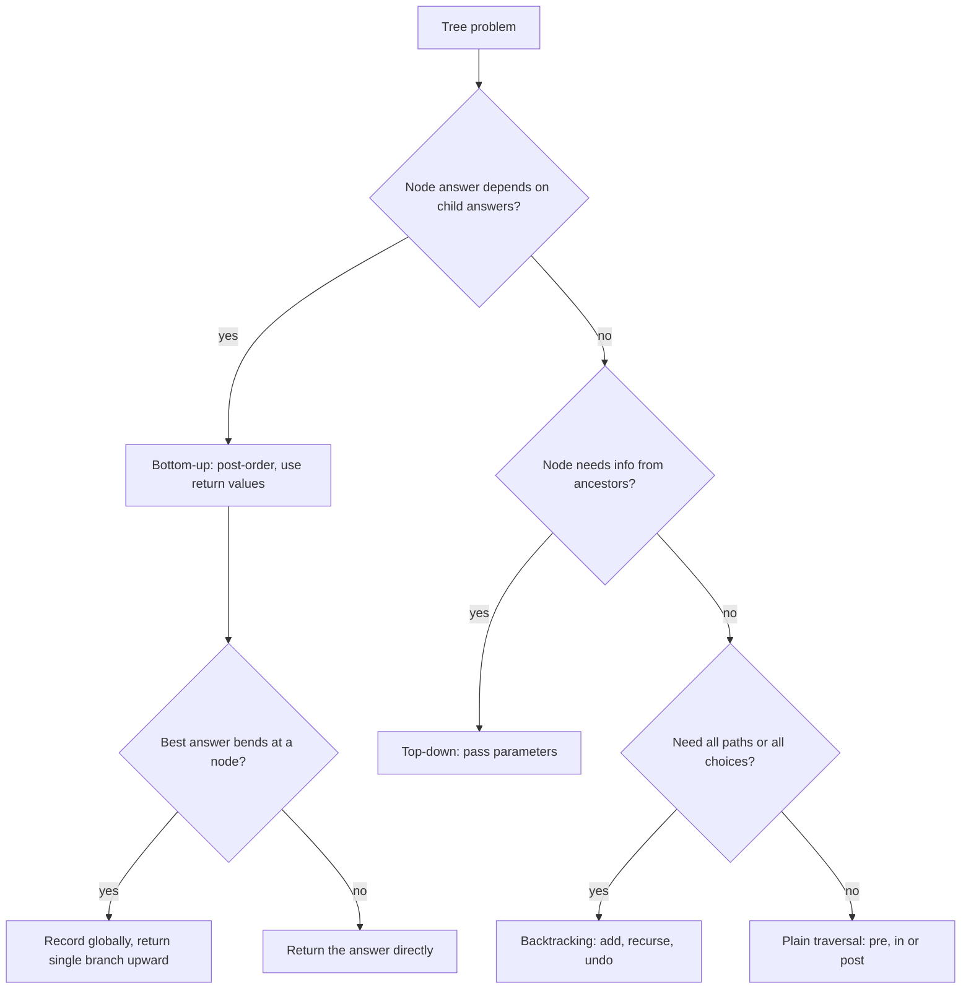

# Tree DFS: From Zero to Mastery (Java)

## Chapter 1: The idea

A tree is a **recursive structure**: every tree is a node plus a left tree plus a right tree.

```
        1
       / \
      2   3
     / \   \
    4   5   6
```

**DFS (Depth-First Search)** means: go as deep as possible along one path, and only when stuck, come back and try the next branch.

The order for the tree above is `1 → 2 → 4 → (back) → 5 → (back, back) → 3 → 6`.

The other approach is BFS, which goes level by level. DFS goes **branch by branch**.

**Why recursion fits trees so well:**

- The subtree under node 2 is itself a tree.
- So any problem on a tree can be handed to the children as the same problem on smaller trees.
- The function calls itself on `left` and `right`, and the call stack remembers where to return.

```java
class TreeNode {
    int val;
    TreeNode left, right;
    TreeNode(int val) { this.val = val; }
}
```

## Chapter 2: The three moments (pre, in, post)

Every DFS visits a node at **three moments**:

```java
void dfs(TreeNode node) {
    if (node == null) return;      // base case

    // (1) PRE-ORDER moment: arriving at node, children not yet explored
    dfs(node.left);
    // (2) IN-ORDER moment: left subtree done, right not started
    dfs(node.right);
    // (3) POST-ORDER moment: both subtrees done, about to leave
}
```

For the tree above:

| Order | Sequence | Work happens |
|---|---|---|
| Pre | 1 2 4 5 3 6 | before children |
| In | 4 2 5 1 3 6 | between children |
| Post | 4 5 2 6 3 1 | after children |

**Timeline for node 2:**

```
enter(2) ─► [PRE work]
            dfs(4)  ... fully done
            [IN work]
            dfs(5)  ... fully done
            [POST work] ─► exit(2), return to 1
```

**Which moment to use:**

- **Pre-order** works when the parent must act before the children. Examples: copying a tree, serializing, passing info downward (path sums).
- **In-order** works for BSTs, because it gives sorted order.
- **Post-order** works when the parent needs the children's answers first. Examples: height, diameter, deleting a tree, evaluating an expression tree. **Most hard tree problems are post-order.**

## Chapter 3: The recursion mindset (the leap of faith)

Beginners try to trace the whole recursion in their head. Don't. Do this instead:

1. **Define the contract in one sentence.** For example: "`height(node)` returns the height of the subtree rooted at `node`."
2. **Base case.** For `null`, what is the answer?
3. **Trust.** Assume `f(left)` and `f(right)` already return correct answers.
4. **Combine.** Use those answers plus the current node to build the answer for `node`.

```java
int height(TreeNode node) {                 // contract: height of subtree, null = 0
    if (node == null) return 0;             // base case
    int l = height(node.left);              // trust
    int r = height(node.right);             // trust
    return 1 + Math.max(l, r);              // combine
}
```

**Most DFS bugs come from a vague contract.** If you can't say exactly what the function returns, you can't write it.

## Chapter 4: The core framework (how to think)

Information moves in two directions through a tree:

```
        parent
          │  ▲
 params   │  │  return value
 (down)   ▼  │  (up)
        child
```

Before coding, answer these **four questions**:

| # | Question | Decides |
|---|---|---|
| 1 | What does each node need to **know from above**? | function parameters |
| 2 | What does each node need to **get from below**? | return type |
| 3 | Is the final answer the return value, or something **recorded on the side**? | global/field vs return |
| 4 | Does the problem need **all paths/choices** (undo needed)? | backtracking |



## Chapter 5: How to recognize a Tree DFS problem

**Strong signals in the problem statement:**

- "Binary tree" or "root" appears, and the answer relates to **paths, depth, subtrees, ancestors, or validity**.
- Words like "root-to-leaf", "path", "subtree", "ancestor", "descendant", "diameter", "balanced", "BST".
- The answer for a node is defined in terms of its children's answers.
- You need information that is only complete after visiting the entire subtree.
- The problem involves **structure comparison** (same tree, symmetric, subtree of another).
- **Graph-that-is-a-tree** inputs (n nodes, n-1 edges, connected). Use DFS with a `parent` argument.

**When BFS is better instead:**

- Level-by-level answers (level order, right side view, minimum depth in a wide tree, zigzag).
- Shortest path in an unweighted graph.
- "Nearest" anything, where the first hit is the answer.

DFS wins when you need **complete subtree information**, or when every root-to-leaf path must be explored.

## Chapter 6: The pattern catalog

### Pattern A: Pure bottom-up (return value only)

The answer is built from the children's answers.

```java
// 104. Max depth
int maxDepth(TreeNode n) {
    return n == null ? 0 : 1 + Math.max(maxDepth(n.left), maxDepth(n.right));
}

// 226. Invert tree
TreeNode invert(TreeNode n) {
    if (n == null) return null;
    TreeNode l = invert(n.left), r = invert(n.right);
    n.left = r; n.right = l;
    return n;
}

// Count nodes / sum of all values: same shape
int count(TreeNode n) { return n == null ? 0 : 1 + count(n.left) + count(n.right); }
```

**Trap (LC 111, min depth):** a node with only one child is **not** a leaf, so `1 + min(l, r)` is wrong. Handle the single-child case explicitly:

```java
int minDepth(TreeNode n) {
    if (n == null) return 0;
    if (n.left == null) return 1 + minDepth(n.right);
    if (n.right == null) return 1 + minDepth(n.left);
    return 1 + Math.min(minDepth(n.left), minDepth(n.right));
}
```

### Pattern B: Two trees at once (parallel DFS)

The function takes **two nodes** and recurses on matching positions.

```java
// 100. Same tree
boolean same(TreeNode a, TreeNode b) {
    if (a == null && b == null) return true;
    if (a == null || b == null) return false;
    return a.val == b.val && same(a.left, b.left) && same(a.right, b.right);
}

// 101. Symmetric: pair left with RIGHT
boolean mirror(TreeNode a, TreeNode b) {
    if (a == null && b == null) return true;
    if (a == null || b == null) return false;
    return a.val == b.val && mirror(a.left, b.right) && mirror(a.right, b.left);
}
// call: mirror(root.left, root.right)
```

LC 572 (Subtree of Another Tree) is this pattern nested inside a traversal: at each node of `root`, call `same(node, subRoot)`.

### Pattern C: Top-down (parameters carry info downward)

The child needs something from its ancestors, so you pass it as an argument.

```java
// 1448. Good nodes: node >= max on path from root
int good(TreeNode n, int maxSoFar) {
    if (n == null) return 0;
    int self = n.val >= maxSoFar ? 1 : 0;
    maxSoFar = Math.max(maxSoFar, n.val);
    return self + good(n.left, maxSoFar) + good(n.right, maxSoFar);
}

// 112. Path sum: subtract as you go down
boolean hasPathSum(TreeNode n, int remain) {
    if (n == null) return false;
    remain -= n.val;
    if (n.left == null && n.right == null) return remain == 0;
    return hasPathSum(n.left, remain) || hasPathSum(n.right, remain);
}

// 129. Sum root-to-leaf numbers
int sumNumbers(TreeNode n, int cur) {
    if (n == null) return 0;
    cur = cur * 10 + n.val;
    if (n.left == null && n.right == null) return cur;
    return sumNumbers(n.left, cur) + sumNumbers(n.right, cur);
}
```

**Validate BST (LC 98)** is the classic. It is **not** enough to compare a node with its children. Each node has a valid **range** inherited from all its ancestors:

```java
boolean valid(TreeNode n, long lo, long hi) {
    if (n == null) return true;
    if (n.val <= lo || n.val >= hi) return false;
    return valid(n.left, lo, n.val) && valid(n.right, n.val, hi);
}
// valid(root, Long.MIN_VALUE, Long.MAX_VALUE)
```

```
        5
       / \
      3   8        the 4 is fine locally under 8,
         /         but must be > 5 (ancestor bound). Bounds catch this.
        4
```

Many problems **combine** top-down params and bottom-up returns (Good Nodes does).

### Pattern D: Backtracking (all root-to-leaf paths)

Use it when you must **collect paths**. The shared list is mutated, so you must **undo** after recursing.

```java
// 113. Path Sum II
List<List<Integer>> pathSum(TreeNode root, int target) {
    List<List<Integer>> res = new ArrayList<>();
    dfs(root, target, new ArrayList<>(), res);
    return res;
}

void dfs(TreeNode n, int remain, List<Integer> path, List<List<Integer>> res) {
    if (n == null) return;
    path.add(n.val);                                   // choose
    remain -= n.val;
    if (n.left == null && n.right == null && remain == 0)
        res.add(new ArrayList<>(path));                // COPY the path
    dfs(n.left, remain, path, res);
    dfs(n.right, remain, path, res);
    path.remove(path.size() - 1);                      // un-choose
}
```

**Rules of backtracking:**

1. Add before the recursive calls and remove after both.
2. Copy the path when saving it (`new ArrayList<>(path)`), otherwise later mutations corrupt your result.
3. If you pass an **immutable value** (int, String), the undo is automatic, because each call gets its own copy.

### Pattern E: "Record at node, return single branch" (the most important advanced pattern)

Some problems ask for a **path that can bend** at any node (diameter, max path sum, longest univalue path). Two different quantities exist:

- **What I record at this node:** a path that goes through the node, using **both** children. Here the node is the "top" of the path.
- **What I return to my parent:** a path the parent can extend, so it can use **only one** child branch.

```
Best path bends at X:          But X can only report ONE arm upward:

     l ── X ── r                       X
                                       │ (parent extends one arm)
                                    longer arm
```

```java
// 543. Diameter (edges on longest path)
int best = 0;
int diameter(TreeNode root) { height(root); return best; }

int height(TreeNode n) {
    if (n == null) return 0;
    int l = height(n.left), r = height(n.right);
    best = Math.max(best, l + r);          // record: bend at n
    return 1 + Math.max(l, r);             // return: one arm
}

// 124. Max path sum (values can be negative)
int best = Integer.MIN_VALUE;
int maxPathSum(TreeNode root) { gain(root); return best; }

int gain(TreeNode n) {
    if (n == null) return 0;
    int l = Math.max(0, gain(n.left));     // ignore negative arms
    int r = Math.max(0, gain(n.right));
    best = Math.max(best, n.val + l + r);  // record: bend at n
    return n.val + Math.max(l, r);         // return: one arm
}
```

**The test for this pattern:** "Is the answer allowed to use both children of some node?" If yes, record the two-armed value globally and return the one-armed value.

### Pattern F: Return multiple values (state / tree DP)

When one number is not enough information, return **a pair (or a small object)**.

```java
// 337. House Robber III: {rob this node, skip this node}
int rob(TreeNode root) {
    int[] r = dfs(root);
    return Math.max(r[0], r[1]);
}

int[] dfs(TreeNode n) {
    if (n == null) return new int[]{0, 0};
    int[] l = dfs(n.left), r = dfs(n.right);
    int rob  = n.val + l[1] + r[1];                                  // children must be skipped
    int skip = Math.max(l[0], l[1]) + Math.max(r[0], r[1]);          // children are free
    return new int[]{rob, skip};
}
```

**Sentinel trick (LC 110, balanced tree):** return `-1` to mean "already unbalanced", so you can stop early and get O(n) instead of O(n²).

```java
boolean isBalanced(TreeNode root) { return check(root) != -1; }

int check(TreeNode n) {
    if (n == null) return 0;
    int l = check(n.left);  if (l == -1) return -1;
    int r = check(n.right); if (r == -1) return -1;
    if (Math.abs(l - r) > 1) return -1;
    return 1 + Math.max(l, r);
}
```

Harder versions use **3 states**. In LC 968 (Binary Tree Cameras), each node is one of: "has camera", "covered, no camera", "not covered". Return the state upward and let the parent decide.

### Pattern G: Lowest Common Ancestor

```java
// 236. LCA in a binary tree
TreeNode lca(TreeNode root, TreeNode p, TreeNode q) {
    if (root == null || root == p || root == q) return root;
    TreeNode l = lca(root.left, p, q);
    TreeNode r = lca(root.right, p, q);
    if (l != null && r != null) return root;   // p and q are on different sides
    return l != null ? l : r;                  // both on one side (or not found)
}
```

**Contract:** "returns p or q if found in this subtree, the LCA if both are found, else null." Once that sentence is clear, the code writes itself.

**BST version (LC 235):** use the ordering, with no full search needed.

```java
TreeNode lcaBST(TreeNode root, TreeNode p, TreeNode q) {
    while (root != null) {
        if (p.val < root.val && q.val < root.val) root = root.left;
        else if (p.val > root.val && q.val > root.val) root = root.right;
        else return root;
    }
    return null;
}
```

### Pattern H: BST + in-order

In-order on a BST gives **sorted order**, which gives you several problems:

```java
// 230. Kth smallest, iterative with early exit
int kthSmallest(TreeNode root, int k) {
    Deque<TreeNode> st = new ArrayDeque<>();
    TreeNode cur = root;
    while (cur != null || !st.isEmpty()) {
        while (cur != null) { st.push(cur); cur = cur.left; }
        cur = st.pop();
        if (--k == 0) return cur.val;
        cur = cur.right;
    }
    return -1;
}
```

- Validate BST: in-order values must be strictly increasing (keep a `prev`).
- Recover BST (LC 99): in-order has exactly two "descents", so swap those nodes.
- Search/insert/delete: **prune** by comparing with the node (go left or right, never both).

### Pattern I: Path counting with prefix sums (LC 437)

This is Two Sum on tree paths. Keep a map of **prefix sums seen on the current root-to-node path**, and **undo** on exit.

```java
int pathSum(TreeNode root, int target) {
    Map<Long, Integer> prefix = new HashMap<>();
    prefix.put(0L, 1);
    return dfs(root, 0L, target, prefix);
}

int dfs(TreeNode n, long cur, int target, Map<Long, Integer> prefix) {
    if (n == null) return 0;
    cur += n.val;
    int res = prefix.getOrDefault(cur - target, 0);   // paths ending here
    prefix.merge(cur, 1, Integer::sum);               // choose
    res += dfs(n.left, cur, target, prefix) + dfs(n.right, cur, target, prefix);
    prefix.merge(cur, -1, Integer::sum);              // un-choose (backtrack)
    return res;
}
```

This is Pattern D (backtracking) and Pattern C (top-down) combined.

### Pattern J: Constructing and serializing trees

**Build from preorder + inorder (LC 105).** Preorder's first element is the root. Inorder splits left from right.

```java
int preIdx = 0;
TreeNode build(int[] pre, int[] in) {
    Map<Integer, Integer> pos = new HashMap<>();
    for (int i = 0; i < in.length; i++) pos.put(in[i], i);
    return helper(pre, pos, 0, in.length - 1);
}

TreeNode helper(int[] pre, Map<Integer, Integer> pos, int lo, int hi) {
    if (lo > hi) return null;
    int v = pre[preIdx++];
    TreeNode node = new TreeNode(v);
    int mid = pos.get(v);
    node.left  = helper(pre, pos, lo, mid - 1);   // left BEFORE right (preorder consumption order)
    node.right = helper(pre, pos, mid + 1, hi);
    return node;
}
```

**Serialize/deserialize (LC 297).** Preorder with null markers is unambiguous.

```java
String serialize(TreeNode root) { StringBuilder sb = new StringBuilder(); ser(root, sb); return sb.toString(); }
void ser(TreeNode n, StringBuilder sb) {
    if (n == null) { sb.append("#,"); return; }
    sb.append(n.val).append(',');
    ser(n.left, sb); ser(n.right, sb);
}

TreeNode deserialize(String data) {
    return des(new ArrayDeque<>(Arrays.asList(data.split(","))));
}
TreeNode des(Deque<String> q) {
    String s = q.poll();
    if (s.equals("#")) return null;
    TreeNode n = new TreeNode(Integer.parseInt(s));
    n.left = des(q); n.right = des(q);
    return n;
}
```

### Pattern K: Subtree identity (find duplicates, LC 652)

Give every distinct subtree shape an **ID** built from its children's IDs. Equal IDs mean equal subtrees, and this runs in O(n).

```java
Map<String, Integer> idOf = new HashMap<>();
Map<Integer, Integer> freq = new HashMap<>();
List<TreeNode> res = new ArrayList<>();

int dfs(TreeNode n) {
    if (n == null) return 0;
    int l = dfs(n.left), r = dfs(n.right);            // post-order: children first
    String key = l + "," + n.val + "," + r;
    int id = idOf.computeIfAbsent(key, k -> idOf.size() + 1);
    if (freq.merge(id, 1, Integer::sum) == 2) res.add(n);
    return id;
}
```

### Pattern L: Trees given as graphs (parent argument) and rerooting

For input like `n` nodes with `edges`, DFS needs a `parent` to avoid walking back:

```java
void dfs(int u, int parent, List<List<Integer>> g) {
    for (int v : g.get(u)) {
        if (v == parent) continue;
        dfs(v, u, g);
    }
}
```

**Rerooting (advanced): LC 834, sum of distances from every node to all others.** Do **two DFS passes**:

```
Pass 1 (post-order): compute subtree size and distance-sum for the ROOT's view.
Pass 2 (pre-order):  push the answer from parent to child:
   ans[child] = ans[parent] - size[child] + (n - size[child])
```

```java
int n; int[] count, ans; List<List<Integer>> g;

int[] sumOfDistancesInTree(int n, int[][] edges) {
    this.n = n; count = new int[n]; ans = new int[n]; g = new ArrayList<>();
    for (int i = 0; i < n; i++) g.add(new ArrayList<>());
    for (int[] e : edges) { g.get(e[0]).add(e[1]); g.get(e[1]).add(e[0]); }
    dfs1(0, -1);
    dfs2(0, -1);
    return ans;
}

void dfs1(int u, int p) {                        // bottom-up
    count[u] = 1;
    for (int v : g.get(u)) if (v != p) {
        dfs1(v, u);
        count[u] += count[v];
        ans[u] += ans[v] + count[v];
    }
}

void dfs2(int u, int p) {                        // top-down
    for (int v : g.get(u)) if (v != p) {
        ans[v] = ans[u] - count[v] + (n - count[v]);
        dfs2(v, u);
    }
}
```

The idea: moving the root from `u` to child `v` makes the `count[v]` nodes in v's subtree **1 closer**, and the other `n - count[v]` nodes **1 farther**.

## Chapter 7: Iterative DFS (and why you need it)

Use it when the tree can be **very deep** (skewed, 10⁵ nodes), where Java's recursion will throw `StackOverflowError`, or when interviewers ask for it.

```java
// Pre-order
List<Integer> preorder(TreeNode root) {
    List<Integer> res = new ArrayList<>();
    if (root == null) return res;
    Deque<TreeNode> st = new ArrayDeque<>();
    st.push(root);
    while (!st.isEmpty()) {
        TreeNode n = st.pop();
        res.add(n.val);
        if (n.right != null) st.push(n.right);   // push right first so left pops first
        if (n.left != null)  st.push(n.left);
    }
    return res;
}

// In-order: "go left as far as possible, pop, then go right"
List<Integer> inorder(TreeNode root) {
    List<Integer> res = new ArrayList<>();
    Deque<TreeNode> st = new ArrayDeque<>();
    TreeNode cur = root;
    while (cur != null || !st.isEmpty()) {
        while (cur != null) { st.push(cur); cur = cur.left; }
        cur = st.pop();
        res.add(cur.val);
        cur = cur.right;
    }
    return res;
}

// Post-order: visit a node only when its right subtree is done
List<Integer> postorder(TreeNode root) {
    List<Integer> res = new ArrayList<>();
    Deque<TreeNode> st = new ArrayDeque<>();
    TreeNode cur = root, prev = null;
    while (cur != null || !st.isEmpty()) {
        while (cur != null) { st.push(cur); cur = cur.left; }
        TreeNode top = st.peek();
        if (top.right != null && top.right != prev) {
            cur = top.right;                      // go explore the right subtree first
        } else {
            res.add(top.val);
            prev = top;
            st.pop();
        }
    }
    return res;
}
```

**Key insight:** the explicit stack **is** the call stack. `prev` tells you whether you're returning from the right child.

**Morris traversal (O(1) extra space, in-order).** It temporarily wires each node's in-order predecessor back to it:

```java
List<Integer> morris(TreeNode root) {
    List<Integer> res = new ArrayList<>();
    TreeNode cur = root;
    while (cur != null) {
        if (cur.left == null) {
            res.add(cur.val);
            cur = cur.right;
        } else {
            TreeNode pred = cur.left;
            while (pred.right != null && pred.right != cur) pred = pred.right;
            if (pred.right == null) { pred.right = cur; cur = cur.left; }   // make thread
            else { pred.right = null; res.add(cur.val); cur = cur.right; }  // remove thread
        }
    }
    return res;
}
```

It is good to know, but rarely required. It modifies the tree temporarily, so it is not safe with concurrent readers.

## Chapter 8: Complexity

- **Time:** O(n). Every node is visited a constant number of times.
- **Space:** O(h) for the call stack, where h is the height.
  - Balanced: h = log n.
  - Skewed (a linked list): h = n.
- Watch for hidden O(n²): calling `height()` at every node inside another recursion (the naive balanced check). The fix is to return the info upward (Pattern A/F).
- Backtracking that copies paths costs O(n · h) in the worst case for output.

**Java stack overflow:** default stack depth is usually around 10–20k frames. Options:

1. Convert to iterative.
2. Run in a thread with a larger stack:
```java
new Thread(null, () -> solve(), "big", 1 << 27).start();
```

## Chapter 9: Common mistakes

1. **Vague contract.** Write the return meaning as a comment before coding.
2. **Forgetting the null base case**, or checking `n.left == null` before `n == null`.
3. **Confusing null with leaf.** A leaf has *both* children null. A node with one child is not a leaf (LC 111, LC 112).
4. **Comparing only with the parent** in BST validation. Use bounds.
5. **`int` overflow in bounds.** Use `long`, since `Integer.MIN_VALUE` can be a node value.
6. **Not undoing in backtracking**, or not copying the path when saving.
7. **Returning the two-armed value upward** in diameter/max path sum (Pattern E). The parent can only extend one arm.
8. **Global state not reset** between test cases (fields in LeetCode solutions persist across calls in some setups, so initialize inside the method).
9. **Mixing up preorder consumption order** in construction: build `left` before `right`.
10. **Not using the BST property** (searching both sides when you could prune).

## Chapter 10: DFS vs BFS on trees

| Need | Pick |
|---|---|
| Info from complete subtrees (height, diameter, validity) | DFS (post-order) |
| Pass constraints downward (ranges, running sum) | DFS (pre-order) |
| All root-to-leaf paths | DFS + backtracking |
| BST sorted order | DFS in-order |
| Level by level, right side view, zigzag | BFS |
| Nearest / shortest in unweighted structure | BFS |
| Very deep tree | Iterative DFS or BFS |
| Very wide tree (memory) | DFS (O(h) beats O(width)) |

## Chapter 11: Your decision checklist

Run this mentally on every tree problem:

1. **Write the contract:** "`f(node)` returns ___ for the subtree at node."
2. **Base case:** what does `null` return? (0, true, null, empty pair?)
3. **Top-down info?** If the node needs something from ancestors, add a parameter.
4. **Bottom-up info?** If the parent needs something from children, decide what to return (a value, a pair, a sentinel).
5. **Can the answer bend at a node?** If yes, record globally and return one arm.
6. **Need all paths?** Use backtracking: add, recurse, undo, copy.
7. **BST?** Use ordering to prune, or in-order for sorted sequence.
8. **Check the leaf definition** and the null-child cases.
9. **Complexity check:** any repeated subtree work? Can it return the info instead?

## Chapter 12: Practice ladder

**Foundation (Patterns A–C)**
- 104 Maximum Depth, 100 Same Tree, 226 Invert Binary Tree, 101 Symmetric Tree
- 112 Path Sum, 111 Minimum Depth, 129 Sum Root to Leaf Numbers, 257 Binary Tree Paths
- 1448 Count Good Nodes, 98 Validate BST, 110 Balanced Binary Tree

**Intermediate (Patterns D, G, H)**
- 113 Path Sum II, 236 / 235 LCA, 230 Kth Smallest in BST
- 572 Subtree of Another Tree, 114 Flatten to Linked List, 863 All Nodes Distance K
- 250 Count Univalue Subtrees, 1110 Delete Nodes and Return Forest

**Advanced (Patterns E, F, I, J, K)**
- 543 Diameter, 124 Max Path Sum, 687 Longest Univalue Path, 1372 Longest ZigZag Path
- 337 House Robber III, 979 Distribute Coins, 968 Binary Tree Cameras
- 437 Path Sum III, 105 / 106 Construct from Traversals, 297 Serialize/Deserialize
- 652 Find Duplicate Subtrees, 333 Largest BST Subtree, 99 Recover BST

**Expert (Pattern L)**
- 834 Sum of Distances in Tree, 865 Smallest Subtree with All Deepest Nodes, 1650 LCA III (parent pointers)

## Mastery test

You have it when, given a new problem, you can answer these **without looking at code**:

- "What does my function return, and what does `null` return?"
- "What flows down, and what flows up?"
- "Is the answer the return value or a side record?"
- "Is a leaf `both children null` here?"

If those four answers are clear, the code is just typing.

I can go deeper on any chapter (for example, a full walkthrough of tracing Max Path Sum step by step), or give you a timed practice set with hints hidden. Which would you like?


---

