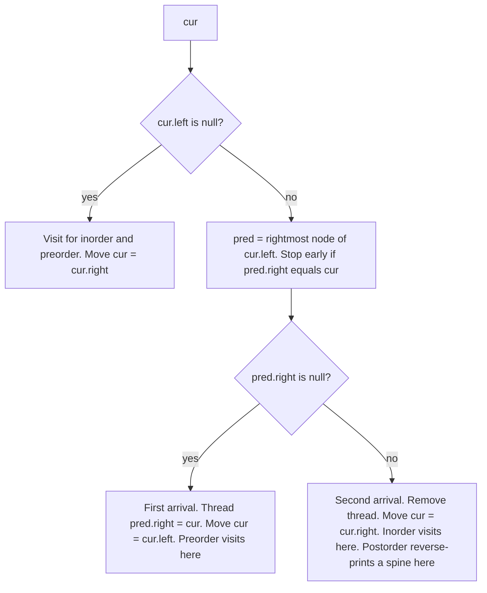

# Morris Traversal: All Three Orders (Java)

Morris traversal visits every node in **O(n) time and O(1) extra space**. There is no recursion and no stack. The price is that it temporarily modifies the tree.

## Chapter 1: The idea

**The problem it solves:** in a normal DFS, after finishing a node's left subtree you need to get back to that node. The call stack (or an explicit stack) remembers this, and it costs O(h) space.

**The trick:** a tree has many `null` right pointers. Borrow them.

When you are at `cur` and about to go into its left subtree, find the last node you will visit in that subtree. That node is the **in-order predecessor** of `cur`: the rightmost node of `cur.left`. Its `right` pointer is `null`, so temporarily point it back at `cur`. This is called a **thread**.

```
Before threading:                 After threading (thread = ~~>)

        cur                              cur <~~~~~~+
       /   \                            /   \        :
      L     R                          L     R       :
     / \                              / \            :
    .   P   <- pred (rightmost)      .   P ~~~~~~~~~~+
```

When the traversal finishes the left subtree, it reaches `P` and follows `P.right` straight back to `cur`. No stack was needed.

**How does it know it's the second arrival?** When it walks down to find the predecessor, it stops if it sees `pred.right == cur`. That means the thread already exists, so the left subtree is done.

## Chapter 2: The decision at every node



The **only difference between the three orders is when you record the node:**

| | No left child | First arrival (thread created) | Second arrival (thread found) |
|---|---|---|---|
| **Inorder** | visit | nothing | **visit** |
| **Preorder** | visit | **visit** | nothing |
| **Postorder** | nothing | nothing | **reverse-print a spine** |

## Chapter 3: Inorder Morris (with a full trace)

```java
List<Integer> morrisInorder(TreeNode root) {
    List<Integer> res = new ArrayList<>();
    TreeNode cur = root;
    while (cur != null) {
        if (cur.left == null) {
            res.add(cur.val);                 // visit
            cur = cur.right;                  // may follow a thread back up
        } else {
            TreeNode pred = cur.left;
            while (pred.right != null && pred.right != cur) pred = pred.right;

            if (pred.right == null) {         // first arrival
                pred.right = cur;             // make thread
                cur = cur.left;
            } else {                          // second arrival
                pred.right = null;            // remove thread (restore tree)
                res.add(cur.val);             // visit
                cur = cur.right;
            }
        }
    }
    return res;
}
```

**Trace on this tree** (expected inorder: `1 2 3 4 6`):

```
      4
     / \
    2   6
   / \
  1   3
```

| Step | cur | What happens | Threads present |
|---|---|---|---|
| 1 | 4 | left exists, pred = 3, `3.right == null` → thread 3→4, go left | 3→4 |
| 2 | 2 | pred = 1, thread 1→2, go left | 3→4, 1→2 |
| 3 | 1 | no left → **visit 1**, go right (follows thread to 2) | 3→4, 1→2 |
| 4 | 2 | pred = 1, `1.right == 2` → remove thread, **visit 2**, go right | 3→4 |
| 5 | 3 | no left → **visit 3**, go right (thread to 4) | 3→4 |
| 6 | 4 | pred = 3, `3.right == 4` → remove thread, **visit 4**, go right | none |
| 7 | 6 | no left → **visit 6**, go right (null) → done | none |

The tree is fully restored at the end.

## Chapter 4: Preorder Morris

The code is almost identical. Preorder visits a node **before** its left subtree, so visit at the moment you **create the thread**.

```java
List<Integer> morrisPreorder(TreeNode root) {
    List<Integer> res = new ArrayList<>();
    TreeNode cur = root;
    while (cur != null) {
        if (cur.left == null) {
            res.add(cur.val);                 // visit (no left subtree to wait for)
            cur = cur.right;
        } else {
            TreeNode pred = cur.left;
            while (pred.right != null && pred.right != cur) pred = pred.right;

            if (pred.right == null) {         // first arrival
                res.add(cur.val);             // visit NOW (before going left)
                pred.right = cur;
                cur = cur.left;
            } else {                          // second arrival
                pred.right = null;            // just clean up
                cur = cur.right;
            }
        }
    }
    return res;
}
```

On the same tree this gives `4 2 1 3 6`.

## Chapter 5: Postorder Morris (the hard one)

Postorder visits a node **after** both subtrees, and there is no single moment where a node can simply be recorded. The standard solution has two parts.

**Part 1: a dummy root.** Create `dummy` with `dummy.left = root`. This makes the real root's right spine get processed like any other left subtree.

**Part 2: reverse-print the right spine.** Each time you get the **second arrival** at `cur` (its left subtree is done), the nodes on the path from `cur.left` down the right edges to `pred` are ready to print. Each of those nodes has already had its left subtree printed. They must come out **bottom-up**, from `pred` back to `cur.left`.

```
cur
 /
A          right spine of the left subtree: A → B → C
 \         postorder needs:  C, B, A   (children before parents)
  B
   \
    C  (= pred)
```

To print in reverse without extra space, **reverse the pointers on that path, walk it, then reverse it back.**

```java
List<Integer> morrisPostorder(TreeNode root) {
    List<Integer> res = new ArrayList<>();
    TreeNode dummy = new TreeNode(0);
    dummy.left = root;
    TreeNode cur = dummy;

    while (cur != null) {
        if (cur.left == null) {
            cur = cur.right;
        } else {
            TreeNode pred = cur.left;
            while (pred.right != null && pred.right != cur) pred = pred.right;

            if (pred.right == null) {         // first arrival
                pred.right = cur;
                cur = cur.left;
            } else {                          // second arrival
                pred.right = null;
                addReversedSpine(cur.left, pred, res);
                cur = cur.right;
            }
        }
    }
    return res;
}

// Adds values on the right-edge path from..to in REVERSE order, then restores the path.
private void addReversedSpine(TreeNode from, TreeNode to, List<Integer> res) {
    reverse(from, to);
    TreeNode n = to;
    while (true) {
        res.add(n.val);
        if (n == from) break;
        n = n.right;
    }
    reverse(to, from);                        // restore original pointers
}

// Reverses the right-pointers along the path from..to
private void reverse(TreeNode from, TreeNode to) {
    if (from == to) return;
    TreeNode prev = from, cur = from.right;
    while (true) {
        TreeNode next = cur.right;
        cur.right = prev;
        prev = cur;
        cur = next;
        if (prev == to) break;
    }
}
```

**Trace on the same tree** (expected: `1 3 2 6 4`):

| Event | Output added |
|---|---|
| Second arrival at 2 (left subtree is just `1`) | 1 |
| Second arrival at 4, spine of left subtree is `2 → 3` | 3, 2 |
| Second arrival at dummy, spine of the real root's right side is `4 → 6` | 6, 4 |

Result: `1 3 2 6 4`. ✔

## Chapter 6: Complexity and why it's still O(n)

- **Time O(n).** It looks like the predecessor search could make it O(n²), but each edge along a right spine is walked at most about twice: once when the thread is created and once when it is removed. Total work is bounded by a small constant times n.
- **Space O(1)** extra (the output list doesn't count).
- Postorder does more pointer work (reversal, walk, restore) but is still O(n) overall.

## Chapter 7: Reusable version (visitor style)

To reuse in-order Morris across many problems, pass in what to do at each visit:

```java
void morrisInorder(TreeNode root, Consumer<TreeNode> visit) {
    TreeNode cur = root;
    while (cur != null) {
        if (cur.left == null) {
            visit.accept(cur);
            cur = cur.right;
        } else {
            TreeNode pred = cur.left;
            while (pred.right != null && pred.right != cur) pred = pred.right;
            if (pred.right == null) { pred.right = cur; cur = cur.left; }
            else { pred.right = null; visit.accept(cur); cur = cur.right; }
        }
    }
}
```

**Kth smallest in BST (LC 230), O(1) space:**

```java
int kthSmallest(TreeNode root, int k) {
    int[] count = {0}, ans = {-1};
    morrisInorder(root, n -> { if (++count[0] == k) ans[0] = n.val; });
    return ans[0];
}
```

**Validate BST (LC 98), O(1) space:**

```java
boolean isValidBST(TreeNode root) {
    TreeNode[] prev = {null};
    boolean[] ok = {true};
    morrisInorder(root, n -> {
        if (prev[0] != null && prev[0].val >= n.val) ok[0] = false;
        prev[0] = n;
    });
    return ok[0];
}
```

**Recover BST (LC 99), true O(1) space:** in a sorted sequence with two swapped nodes, you'll see one or two "descents" (`prev.val > cur.val`).

```java
void recoverTree(TreeNode root) {
    TreeNode[] prev = {null}, first = {null}, second = {null};
    morrisInorder(root, n -> {
        if (prev[0] != null && prev[0].val > n.val) {
            if (first[0] == null) first[0] = prev[0];   // first descent: left culprit
            second[0] = n;                              // last descent: right culprit
        }
        prev[0] = n;
    });
    int t = first[0].val; first[0].val = second[0].val; second[0].val = t;
}
```

**Flatten Binary Tree to Linked List (LC 114)** is a Morris-style preorder variant. It rewires permanently instead of threading temporarily:

```java
void flatten(TreeNode root) {
    TreeNode cur = root;
    while (cur != null) {
        if (cur.left != null) {
            TreeNode pred = cur.left;
            while (pred.right != null) pred = pred.right;
            pred.right = cur.right;      // attach right subtree after the left subtree's last node
            cur.right = cur.left;
            cur.left = null;
        }
        cur = cur.right;
    }
}
```

## Chapter 8: The gotchas

1. **Never exit early.** If you `return` mid-traversal (say, once you find the kth element), threads are left in the tree and it stays corrupted, possibly with cycles. Notice the examples above record the answer and **keep running to completion**.
2. **The loop condition matters.** `while (pred.right != null && pred.right != cur)` must check *both*. Without the second check you'd loop forever on an existing thread.
3. **Not thread-safe.** Another thread reading the tree during the traversal sees a corrupted structure.
4. **Duplicate values are fine.** It works on node identity (`pred.right == cur` compares references), not on values.
5. **Postorder needs the dummy node.** Without it, the root's final right spine is never printed.
6. **Restore before you visit or move.** In the second-arrival branch, set `pred.right = null` first.
7. **Exceptions in the visitor** leave the tree threaded. Keep visitors simple.

## Chapter 9: When to use it (and when not to)

**Use it when:**
- The interviewer asks *"can you do it in O(1) space?"* for an in-order or preorder traversal.
- The tree may be extremely deep and you want no stack at all.
- Recover BST in O(1) space (LC 99).

**Avoid it when:**
- Concurrent readers use the tree.
- The tree is read-only or shared.
- You need early termination without full traversal.
- Readability matters more than space. Iterative stack DFS is usually the better production choice.

## Practice set

- **LC 94** Inorder Traversal, **LC 144** Preorder Traversal, **LC 145** Postorder Traversal. Do all three with Morris.
- **LC 230** Kth Smallest in BST, **LC 98** Validate BST.
- **LC 99** Recover BST (the classic O(1) space follow-up).
- **LC 114** Flatten Binary Tree to Linked List.

Postorder is the one people forget, so I'd suggest hand-tracing it once on a 5-node tree until reversing the spine feels natural. I can walk through that trace pointer by pointer if you want.
