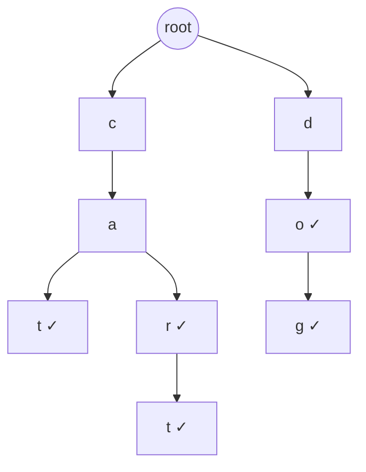
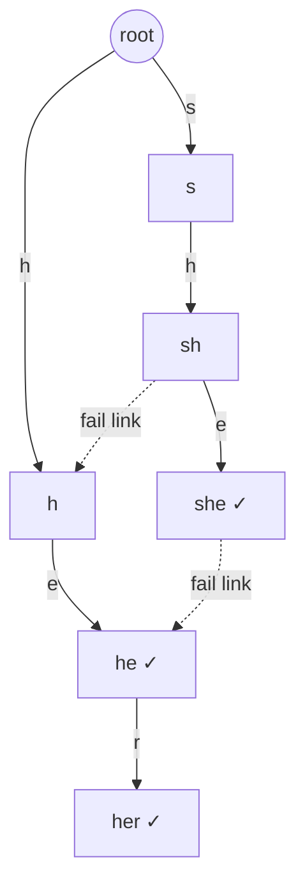

# Trie (Prefix Tree): Beginner to Master (Java)

---

## Chapter 1: The problem a Trie solves

Suppose you have 1 million words and you keep getting queries like:

- Does the word `"apple"` exist?
- Are there any words starting with `"app"`?
- Give me all words starting with `"ap"`.

**Approach 1: List / array of strings.** Checking a prefix means scanning every word. That is O(N · L) per query.

**Approach 2: HashSet.** Exact lookup is O(L), which is great. But "does anything start with `app`?" is a problem. A hash set has no idea about prefixes, so you scan everything again.

**Approach 3: Sorted array + binary search.** Prefix queries work in O(L · log N), but inserts are expensive and it's awkward to maintain.

The real issue is that **words share prefixes**, and none of these structures exploit that.

> A Trie stores each shared prefix **once**, so a query walks down the characters of the query, not over the words in the dataset.

The cost of a query then depends only on the **length of the query**, not on how many words are stored.

---

## Chapter 2: Intuition

Think of a dictionary in a library.

You don't scan every page for "cart". You go to the section for **c**, then the shelf for **ca**, then **car**, then **cart**. Every letter narrows the search space.

A Trie is that idea as a data structure:

- Each **edge** is a character.
- Each **node** represents the prefix formed by the path from the root to it.
- Some nodes are marked as **end of word**.

Insert `cat`, `car`, `cart`, `dog`, `do`:

```
                 (root)
                /      \
               c        d
               |        |
               a        o*        <- "do" ends here
              / \       |
             t*  r*     g*        <- "cat", "car", "dog"
                 |
                 t*               <- "cart"

   * = end of word
```



Three things to notice:

1. `car` and `cart` share the path `c → a → r`. That is the **space saving**.
2. `car` is a word **and** a prefix of `cart`. This is why we need the `isEnd` flag. Existence of a node does not mean a word ends there.
3. Every node is a **prefix**. That is why prefix queries are trivial.

---

## Chapter 3: Anatomy of a Trie node

A node needs two things:

1. **Children**: a way to go from this node to the next character.
2. **Marker**: does a word end here?

Two ways to store the children:

| Style | Structure | Best when |
|---|---|---|
| Array | `TrieNode[26]` | Small fixed alphabet (lowercase a-z). Fastest. |
| HashMap | `Map<Character, TrieNode>` | Large or unknown alphabet (Unicode, mixed case, digits). Saves memory when sparse. |

```
Array-based node (a-z):
+------------------------------------------------+
| isEnd: false                                   |
| children: [ _ _ [a] _ _ ... [t] ... _ _ ]      |
|             a b  c  d e       t          z     |
+------------------------------------------------+
   index = ch - 'a'
```

---

## Chapter 4: Basic implementation (LeetCode 208)

```java
class TrieNode {
    TrieNode[] children = new TrieNode[26];
    boolean isEnd;
}

class Trie {
    private final TrieNode root = new TrieNode();

    // O(L)
    public void insert(String word) {
        TrieNode cur = root;
        for (char ch : word.toCharArray()) {
            int i = ch - 'a';
            if (cur.children[i] == null) {
                cur.children[i] = new TrieNode();
            }
            cur = cur.children[i];
        }
        cur.isEnd = true;
    }

    // O(L)
    public boolean search(String word) {
        TrieNode node = walk(word);
        return node != null && node.isEnd;
    }

    // O(L)
    public boolean startsWith(String prefix) {
        return walk(prefix) != null;
    }

    // Follow the path for s. Return the last node, or null if the path breaks.
    private TrieNode walk(String s) {
        TrieNode cur = root;
        for (char ch : s.toCharArray()) {
            cur = cur.children[ch - 'a'];
            if (cur == null) return null;
        }
        return cur;
    }
}
```

**The single most important helper is `walk`.** Almost every Trie problem starts with "walk down the trie following these characters".

The only difference between `search` and `startsWith` is the last line:

```
search("car")     -> reach node 'r'  -> isEnd?  yes -> true
search("ca")      -> reach node 'a'  -> isEnd?  no  -> false
startsWith("ca")  -> reach node 'a'  -> exists  -> true
startsWith("cx")  -> path breaks     -> null    -> false
```

### Trace: insert "cat", then "car"

```
insert("cat"):                 insert("car"):
 root                           root
  └─c                            └─c            (reused)
    └─a                            └─a          (reused)
      └─t*                           ├─t*
                                     └─r*        (new node)
```

Only **one** new node was created for `car`, because `ca` was shared.

---

## Chapter 5: HashMap-based variant

```java
class TrieNode {
    Map<Character, TrieNode> children = new HashMap<>();
    boolean isEnd;
}

// insert
TrieNode cur = root;
for (char ch : word.toCharArray()) {
    cur = cur.children.computeIfAbsent(ch, k -> new TrieNode());
}
cur.isEnd = true;
```

| | Array `[26]` | HashMap |
|---|---|---|
| Speed | Faster (direct index) | Slower (hashing, boxing) |
| Memory per node | Always 26 pointers (~104-208 bytes) | Only used children, plus map overhead |
| Alphabet | Fixed | Any |
| Sorted traversal | Free (iterate 0..25) | Needs `TreeMap` |

**Rule of thumb:** use the array for lowercase-letter problems (most interview problems), and the map for anything else.

---

## Chapter 6: Complexity

Let **N** = number of words, **L** = average word length, **M** = length of the query.

| Operation | Time | Notes |
|---|---|---|
| insert | O(L) | Independent of N |
| search / startsWith | O(M) | Independent of N |
| Build the trie | O(N · L) | Sum of all characters |
| Space | O(N · L) worst case | Fewer nodes if prefixes are shared |
| Space per node (array) | O(Σ), Σ = 26 | The hidden cost |

Space is the honest weakness. In the worst case (no shared prefixes) you have N·L nodes, each holding 26 pointers. That is why compressed tries and hash-based children exist (see Chapter 12).

---

## Chapter 7: How to recognize a Trie problem

Ask these questions when reading a problem.

**Signal 1: The word "prefix" appears.** Starts with, common prefix, autocomplete, shortest unique prefix, replace with root.

**Signal 2: Many strings, many queries.** A dictionary of words is built once and then queried repeatedly.

**Signal 3: You are matching against a set of words while walking through something else.** For example, a grid of letters (Word Search II) or a stream of characters. Instead of checking each word separately, you walk **one trie** in step with your traversal.

**Signal 4: Wildcards or partial matches in a dictionary.** `b.d` matches `bad` and `bid`. The trie lets you branch only where letters exist.

**Signal 5: Bits of integers, with XOR or "best match" queries.** Treat each number as a string of 32 bits. A binary trie lets you greedily choose the opposite bit at each level.

**Signal 6: Constraint smell.** If a brute-force approach checks every word against every position or query, and the total input is large, you want to share the work across common prefixes.

### Decision table

| Problem says... | Think... |
|---|---|
| "words starting with X" | Trie, walk to the prefix node |
| "count words with prefix" | Trie, keep a `pass` counter per node |
| "find all words from a dictionary in a grid" | Trie + DFS/backtracking |
| "search with `.` wildcard" | Trie + DFS on wildcard |
| "shortest prefix that is a dictionary word" | Trie, stop at first `isEnd` |
| "max XOR of two numbers" | Binary trie, greedy opposite bit |
| "suffix match on a stream" | Trie of **reversed** words |
| "top-K suggestions for typed prefix" | Trie + store data at nodes |
| "just check whether the exact word exists" | **HashSet**, not a Trie |

---

## Chapter 8: The thought process, step by step

1. **What is the alphabet?** Letters (26)? Bits (2)? Digits (10)? Any Unicode?
2. **What will I query?** Exact word, prefix, wildcard, or best match?
3. **What extra info must each node hold?** This is the key design decision. Possible answers:
   - `isEnd` (boolean): is this a word?
   - `word` (String): the full word stored at the end node (very handy in Word Search II)
   - `count` / `pass`: how many words pass through this node
   - `endCount`: how many times this exact word was inserted
   - `value`: for Map Sum style problems
   - `index`: the position of the word in the input (Palindrome Pairs)
4. **Which direction do I insert?** Normal or reversed (suffix problems)?
5. **How do I traverse?** Simple loop (exact prefix), DFS (wildcard, collect all), or DFS in sync with another structure (grid, stream)?
6. **Where do I stop or prune?** At the first `isEnd`, when a child is null, or when a node has no more words below it.

> The interview mindset: **"A Trie is a hash map for prefixes. What do I need to remember at each prefix?"**

---

## Chapter 9: Core patterns with code

### Pattern 1: Prefix counting (extra data at nodes)

**Problem:** count how many words have a given prefix, and how many equal a given word.

```java
class TrieNode {
    TrieNode[] next = new TrieNode[26];
    int pass;      // words passing through this node (prefix count)
    int endCount;  // words ending exactly here
}

class PrefixCounter {
    private final TrieNode root = new TrieNode();

    void insert(String w) {
        TrieNode cur = root;
        for (char ch : w.toCharArray()) {
            int i = ch - 'a';
            if (cur.next[i] == null) cur.next[i] = new TrieNode();
            cur = cur.next[i];
            cur.pass++;
        }
        cur.endCount++;
    }

    int countWordsEqualTo(String w) {
        TrieNode n = walk(w);
        return n == null ? 0 : n.endCount;
    }

    int countWordsStartingWith(String p) {
        TrieNode n = walk(p);
        return n == null ? 0 : n.pass;
    }

    void erase(String w) {                 // assumes w exists
        TrieNode cur = root;
        for (char ch : w.toCharArray()) {
            cur = cur.next[ch - 'a'];
            cur.pass--;
        }
        cur.endCount--;
    }

    private TrieNode walk(String s) {
        TrieNode cur = root;
        for (char ch : s.toCharArray()) {
            cur = cur.next[ch - 'a'];
            if (cur == null) return null;
        }
        return cur;
    }
}
```

This is LeetCode 1804 (Implement Trie II). The counters give you O(L) for everything, and `erase` becomes trivial without physically deleting nodes.

---

### Pattern 2: Shortest matching prefix (Replace Words, LC 648)

**Problem:** replace each word in a sentence with the shortest dictionary root that is its prefix.

**Insight:** while walking the word down the trie, **stop at the first `isEnd`**.

```java
class Solution {
    static class Node {
        Node[] next = new Node[26];
        String word;              // store the full root at its end node
    }

    public String replaceWords(List<String> dictionary, String sentence) {
        Node root = new Node();
        for (String d : dictionary) {
            Node cur = root;
            for (char ch : d.toCharArray()) {
                int i = ch - 'a';
                if (cur.next[i] == null) cur.next[i] = new Node();
                cur = cur.next[i];
            }
            cur.word = d;
        }

        StringBuilder sb = new StringBuilder();
        for (String w : sentence.split(" ")) {
            if (sb.length() > 0) sb.append(' ');
            sb.append(shortestRoot(root, w));
        }
        return sb.toString();
    }

    private String shortestRoot(Node root, String w) {
        Node cur = root;
        for (char ch : w.toCharArray()) {
            cur = cur.next[ch - 'a'];
            if (cur == null) return w;           // no root matches
            if (cur.word != null) return cur.word;  // first root found = shortest
        }
        return w;
    }
}
```

**Trick to remember:** storing `String word` instead of `boolean isEnd` avoids rebuilding the string from the path. You'll use this again in Word Search II.

---

### Pattern 3: Wildcard search (Design Add and Search Words, LC 211)

**Problem:** `addWord("bad")`, then `search("b.d")` should be true. `.` matches any single letter.

**Insight:** a normal character follows one child. A `.` **branches into all children**, so this needs DFS.

```java
class WordDictionary {
    private static class Node {
        Node[] next = new Node[26];
        boolean isEnd;
    }
    private final Node root = new Node();

    public void addWord(String word) {
        Node cur = root;
        for (char ch : word.toCharArray()) {
            int i = ch - 'a';
            if (cur.next[i] == null) cur.next[i] = new Node();
            cur = cur.next[i];
        }
        cur.isEnd = true;
    }

    public boolean search(String word) {
        return dfs(word, 0, root);
    }

    private boolean dfs(String w, int idx, Node node) {
        if (node == null) return false;
        if (idx == w.length()) return node.isEnd;

        char c = w.charAt(idx);
        if (c == '.') {
            for (Node child : node.next) {
                if (child != null && dfs(w, idx + 1, child)) return true;
            }
            return false;
        }
        return dfs(w, idx + 1, node.next[c - 'a']);
    }
}
```

```
search("b.d")

root ─b─> [b] ─'.'─┬─a─> [a] ─d─> [d*]  ✓ match
                   ├─i─> [i] ─d─> [d*]  ✓ (would also match)
                   └─(other children...)
```

Worst case (all dots) is O(26^L), but in practice the trie only has as many branches as words exist, so it's bounded by the number of stored nodes.

---

### Pattern 4: Trie + Backtracking (Word Search II, LC 212)

This is the **most famous** advanced Trie problem.

**Problem:** given a grid of letters and a list of words, return all words that can be formed by adjacent cells (no cell reused in one word).

**Naive approach:** run DFS from each cell for each word. That is O(words · cells · 4^L), which is far too slow.

**Trie approach:** build **one trie of all words**. Then do a single DFS from each cell, walking the trie **in sync** with the grid path. If the current grid path is not a prefix of any word, the trie has no such child, so **stop immediately** (pruning).

```
Grid step        Trie step
board[r][c] --->  node.next[ch]
path breaks in trie  ==>  stop DFS (no word can start this way)
```

```java
class Solution {
    static class Node {
        Node[] next = new Node[26];
        String word;    // non-null at the end of a word
    }

    public List<String> findWords(char[][] board, String[] words) {
        Node root = new Node();
        for (String w : words) {
            Node cur = root;
            for (char ch : w.toCharArray()) {
                int i = ch - 'a';
                if (cur.next[i] == null) cur.next[i] = new Node();
                cur = cur.next[i];
            }
            cur.word = w;
        }

        List<String> res = new ArrayList<>();
        for (int r = 0; r < board.length; r++) {
            for (int c = 0; c < board[0].length; c++) {
                dfs(board, r, c, root, res);
            }
        }
        return res;
    }

    private static final int[][] DIRS = {{1,0},{-1,0},{0,1},{0,-1}};

    private void dfs(char[][] b, int r, int c, Node parent, List<String> res) {
        char ch = b[r][c];
        if (ch == '#') return;                       // already visited in this path
        Node node = parent.next[ch - 'a'];
        if (node == null) return;                    // PRUNE: no word has this prefix

        if (node.word != null) {
            res.add(node.word);
            node.word = null;                        // avoid duplicates
        }

        b[r][c] = '#';                               // mark visited
        for (int[] d : DIRS) {
            int nr = r + d[0], nc = c + d[1];
            if (nr >= 0 && nc >= 0 && nr < b.length && nc < b[0].length) {
                dfs(b, nr, nc, node, res);
            }
        }
        b[r][c] = ch;                                // backtrack

        // Optional optimization: remove exhausted branches
        if (isLeaf(node)) parent.next[ch - 'a'] = null;
    }

    private boolean isLeaf(Node n) {
        if (n.word != null) return false;
        for (Node x : n.next) if (x != null) return false;
        return true;
    }
}
```

**Key ideas to internalize:**

- The **trie is the pruner.** The DFS never explores paths that can't become a word.
- Storing `word` at the node means no `StringBuilder` is needed.
- Setting `node.word = null` after finding it prevents duplicate answers.
- Removing empty leaves keeps later DFS calls fast (this is what gets the solution under the time limit on hard test cases).

---

### Pattern 5: Longest word built one character at a time (LC 720)

**Problem:** find the longest word where every prefix (one letter at a time) is also in the dictionary.

**Insight:** only walk through nodes where `isEnd` is true.

```java
class Solution {
    static class Node {
        Node[] next = new Node[26];
        String word;
    }

    public String longestWord(String[] words) {
        Node root = new Node();
        for (String w : words) {
            Node cur = root;
            for (char ch : w.toCharArray()) {
                int i = ch - 'a';
                if (cur.next[i] == null) cur.next[i] = new Node();
                cur = cur.next[i];
            }
            cur.word = w;
        }
        String[] best = {""};
        dfs(root, best);
        return best[0];
    }

    private void dfs(Node node, String[] best) {
        for (int i = 0; i < 26; i++) {              // a..z gives lexicographic tie-break
            Node child = node.next[i];
            if (child != null && child.word != null) {   // prefix must itself be a word
                if (child.word.length() > best[0].length()) best[0] = child.word;
                dfs(child, best);
            }
        }
    }
}
```

Because we iterate `a` to `z`, ties on length resolve to the lexicographically smaller word automatically, since we only replace on strictly longer.

---

### Pattern 6: Value at a prefix (Map Sum Pairs, LC 677)

**Problem:** `insert(key, val)` and `sum(prefix)` returns the sum of values of all keys with that prefix. Re-inserting a key overwrites its value.

**Trick:** store the **delta** along the path so every node holds the sum of its subtree.

```java
class MapSum {
    static class Node {
        Node[] next = new Node[26];
        int sum;
    }
    private final Node root = new Node();
    private final Map<String, Integer> vals = new HashMap<>();

    public void insert(String key, int val) {
        int delta = val - vals.getOrDefault(key, 0);
        vals.put(key, val);
        Node cur = root;
        for (char ch : key.toCharArray()) {
            int i = ch - 'a';
            if (cur.next[i] == null) cur.next[i] = new Node();
            cur = cur.next[i];
            cur.sum += delta;
        }
    }

    public int sum(String prefix) {
        Node cur = root;
        for (char ch : prefix.toCharArray()) {
            cur = cur.next[ch - 'a'];
            if (cur == null) return 0;
        }
        return cur.sum;
    }
}
```

The lesson is that **a node can hold any aggregate over its subtree**: counts, sums, max, and so on. This pre-computation makes queries O(L).

---

### Pattern 7: Top-K autocomplete (LC 642)

**Problem:** the user types characters one at a time. After each character, return the top 3 historical sentences with that prefix (ranked by frequency, then lexicographically). `#` ends the sentence.

**Design:** each node stores a map of `sentence -> count` for every sentence passing through it. The user's current position is a **pointer into the trie** that advances one character at a time.

```java
class AutocompleteSystem {
    static class Node {
        Map<Character, Node> next = new HashMap<>();
        Map<String, Integer> counts = new HashMap<>();
    }

    private final Node root = new Node();
    private Node cur;
    private final StringBuilder sb = new StringBuilder();

    public AutocompleteSystem(String[] sentences, int[] times) {
        for (int i = 0; i < sentences.length; i++) add(sentences[i], times[i]);
        cur = root;
    }

    private void add(String s, int t) {
        Node n = root;
        for (char ch : s.toCharArray()) {
            n = n.next.computeIfAbsent(ch, k -> new Node());
            n.counts.merge(s, t, Integer::sum);
        }
    }

    public List<String> input(char c) {
        if (c == '#') {
            add(sb.toString(), 1);
            sb.setLength(0);
            cur = root;
            return new ArrayList<>();
        }
        sb.append(c);
        if (cur != null) cur = cur.next.get(c);   // advance the pointer
        if (cur == null) return new ArrayList<>();

        // min-heap of size 3; the head is the "worst" of the current top 3
        PriorityQueue<Map.Entry<String, Integer>> pq = new PriorityQueue<>((a, b) ->
            a.getValue().equals(b.getValue())
                ? b.getKey().compareTo(a.getKey())
                : a.getValue() - b.getValue());

        for (Map.Entry<String, Integer> e : cur.counts.entrySet()) {
            pq.offer(e);
            if (pq.size() > 3) pq.poll();
        }
        LinkedList<String> res = new LinkedList<>();
        while (!pq.isEmpty()) res.addFirst(pq.poll().getKey());
        return res;
    }
}
```

Two ideas here: the **stateful pointer** into the trie (an incremental walk instead of restarting from the root), and **precomputed data at nodes** to avoid DFS on every keystroke. In real systems you would store only the top K per node and update it on insert.

---

### Pattern 8: Reverse trie for suffix matching on a stream (LC 1032)

**Problem:** after each incoming character, is any suffix of the stream equal to a dictionary word?

**Insight:** matching suffixes means matching from the **end** of the stream backward. So insert each word **reversed**, and walk the stream from newest character to oldest.

```java
class StreamChecker {
    static class Node {
        Node[] next = new Node[26];
        boolean isEnd;
    }
    private final Node root = new Node();
    private final StringBuilder stream = new StringBuilder();
    private int maxLen = 0;

    public StreamChecker(String[] words) {
        for (String w : words) {
            maxLen = Math.max(maxLen, w.length());
            Node cur = root;
            for (int i = w.length() - 1; i >= 0; i--) {   // reversed insert
                int idx = w.charAt(i) - 'a';
                if (cur.next[idx] == null) cur.next[idx] = new Node();
                cur = cur.next[idx];
            }
            cur.isEnd = true;
        }
    }

    public boolean query(char letter) {
        stream.append(letter);
        Node cur = root;
        int limit = Math.max(0, stream.length() - maxLen);
        for (int i = stream.length() - 1; i >= limit; i--) {
            cur = cur.next[stream.charAt(i) - 'a'];
            if (cur == null) return false;
            if (cur.isEnd) return true;
        }
        return false;
    }
}
```

```
words: "cd", "f", "kl"     reversed trie: d─c*, f*, l─k*
stream: a b c d
query('d'): walk from newest: d -> c -> isEnd ✓  ("cd" is a suffix)
```

**General principle:** if the problem is about suffixes, reverse the words.

---

### Pattern 9: Trie + DP (Word Break, LC 139)

**Problem:** can string `s` be split into dictionary words?

```java
public boolean wordBreak(String s, List<String> wordDict) {
    Node root = new Node();
    for (String w : wordDict) insert(root, w);

    int n = s.length();
    boolean[] dp = new boolean[n + 1];
    dp[0] = true;

    for (int i = 0; i < n; i++) {
        if (!dp[i]) continue;                // no valid split ends at i
        Node cur = root;
        for (int j = i; j < n; j++) {
            cur = cur.next[s.charAt(j) - 'a'];
            if (cur == null) break;          // no word continues this way
            if (cur.isEnd) dp[j + 1] = true; // a word covers s[i..j]
        }
    }
    return dp[n];
}
```

Instead of checking `s.substring(i, j)` against a HashSet (O(L) per check, O(n²·L) total), the trie **extends one character at a time and breaks early**. Concatenated Words (LC 472) is the same idea.

---

## Chapter 10: Binary Trie (XOR problems)

A Trie does not have to store letters. Store the **bits** of integers.

**Maximum XOR of two numbers (LC 421):**

To maximize `a XOR b`, you want the bits of `b` to be **opposite** to the bits of `a`, starting from the most significant bit. That is greedy, and a binary trie makes it fast.

```
nums = 3 (011), 10 (1010), 5 (0101), 25 (11001), 2, 8

Represent as 5-bit paths (MSB first):
  3  = 00011
  10 = 01010
  5  = 00101
  25 = 11001

For x = 5 (00101), we want opposite bits at each level:
  wanted:  1 1 0 1 0
  Walk trie: try 1 -> exists (25's branch) ✓ take it
             try 1 -> exists ✓
             try 0 -> ...
```

```java
class Solution {
    static class Node {
        Node[] c = new Node[2];
    }

    public int findMaximumXOR(int[] nums) {
        Node root = new Node();

        // Build the trie: 31 bits for non-negative ints
        for (int n : nums) {
            Node cur = root;
            for (int b = 30; b >= 0; b--) {
                int bit = (n >> b) & 1;
                if (cur.c[bit] == null) cur.c[bit] = new Node();
                cur = cur.c[bit];
            }
        }

        int max = 0;
        for (int n : nums) {
            Node cur = root;
            int xor = 0;
            for (int b = 30; b >= 0; b--) {
                int bit = (n >> b) & 1;
                int want = bit ^ 1;                  // opposite bit is best
                if (cur.c[want] != null) {
                    xor |= (1 << b);
                    cur = cur.c[want];
                } else {
                    cur = cur.c[bit];
                }
            }
            max = Math.max(max, xor);
        }
        return max;
    }
}
```

**Complexity:** O(N · 31) time, which is effectively O(N). The brute force is O(N²).

**Why greedy works:** a higher bit is worth more than all lower bits combined. So if you can get a 1 at a high bit, take it and never look back.

**Variants:**

- Max XOR with a query limit (offline queries + sorting): LC 1707
- Max XOR in a subarray (prefix-XOR + trie)
- Count pairs with XOR less than K (store a count in each node)

---

## Chapter 11: Deletion

You usually **don't** need physical deletion in interviews (a counter or flipping `isEnd` is enough). But for completeness:

```java
public void delete(String word) {
    delete(root, word, 0);
}

// Returns true if the caller should remove this node from its parent
private boolean delete(TrieNode node, String w, int idx) {
    if (idx == w.length()) {
        if (!node.isEnd) return false;      // word wasn't present
        node.isEnd = false;
        return isEmpty(node);               // safe to remove only if no children
    }
    int i = w.charAt(idx) - 'a';
    TrieNode child = node.children[i];
    if (child == null) return false;        // word wasn't present

    boolean removeChild = delete(child, w, idx + 1);
    if (removeChild) {
        node.children[i] = null;
        return !node.isEnd && isEmpty(node);   // cascade upward
    }
    return false;
}

private boolean isEmpty(TrieNode n) {
    for (TrieNode c : n.children) if (c != null) return false;
    return true;
}
```

Three cases to remember when deleting `w`:

```
1. w is a prefix of another word    -> just set isEnd = false
2. another word is a prefix of w    -> delete nodes until you hit that word's end
3. w is unique (no sharing)         -> delete the entire path
```

---

## Chapter 12: Advanced structures (the family tree)

### 12.1 Compressed Trie / Radix Tree / Patricia Trie

A normal trie wastes nodes on long chains with no branching. A **radix tree** merges single-child chains into one edge labeled with a **string**.

```
Standard Trie                 Radix Tree
 root                          root
  └─t                           └─"test"─┬─"er"*   (tester)
    └─e                                  └─"ing"*  (testing)
      └─s
        └─t
          ├─e─r*
          └─i─n─g*
```

Used in: IP routing tables, HTTP routers (e.g. path matching), and Linux kernel data structures. Much better memory use, but more complex insertion (edge splitting).

### 12.2 Ternary Search Tree (TST)

Each node has three children (`<`, `=`, `>`) instead of 26. It uses far less memory than an array-based trie and stays fast, so it is a good compromise for large alphabets.

### 12.3 Suffix Trie / Suffix Tree

Insert **all suffixes** of a string. Now any substring query is a prefix query on some suffix.

```
"banana": insert banana, anana, nana, ana, na, a
Is "nan" a substring?  ->  walk "nan" in the trie -> exists ✓
```

The naive suffix trie uses O(n²) space. **Suffix trees** (Ukkonen's algorithm) compress this to O(n), and **suffix arrays** are the more practical cousin. These are competitive-programming and string-algorithm territory.

### 12.4 Aho-Corasick (multi-pattern matching)

A trie of patterns plus **failure links** (like KMP's failure function, generalized to a trie). It finds **all occurrences of all patterns** in a text in O(text + matches).



When matching fails at `she`, instead of restarting, the failure link jumps to `he`, the longest proper suffix that is also a prefix in the trie. Used in antivirus scanners, grep-like tools, and profanity filters.

**For interviews:** know that it exists and what problem it solves. Implementing it is rare.

---

## Chapter 13: Trie vs. other structures

| Need | Best choice | Why |
|---|---|---|
| Exact-match membership only | `HashSet` | O(L) and much less memory |
| Prefix queries | **Trie** | O(M) independent of N |
| Sorted iteration of all words | Trie (DFS in order) or `TreeSet` | Trie gives sorted order for free with array children |
| Range queries between two strings | `TreeSet` / sorted array | Trie is awkward here |
| Wildcard `.` search | **Trie + DFS** | Hash structures can't branch |
| Approximate/fuzzy matching | Trie + DFS with an edit budget | Or BK-tree |
| Max XOR | **Binary Trie** | Nothing else gives near-linear time |
| Tight memory, huge alphabet | HashMap trie, radix tree, or TST | Array trie is too heavy |

**Honest note:** in production, a `HashMap` often wins for exact lookups, and a sorted array + binary search often wins for static prefix lookups because of cache locality. A Trie earns its place when you have **dynamic prefix queries**, **per-prefix aggregates**, or **traversal in sync with another structure**.

---

## Chapter 14: Common mistakes and pitfalls

1. **Forgetting `isEnd`.** Then `search("ca")` returns true after inserting `cat`. Node existence ≠ word existence.
2. **Mixing up `search` and `startsWith`.** They differ only in the last check.
3. **Assuming 26 lowercase letters.** Input with uppercase, digits, or spaces gives `ArrayIndexOutOfBounds`. Check constraints, and use a map or size 128/256 if needed.
4. **Modifying a shared trie across test cases.** In LeetCode, static tries persist between tests. Make the trie an instance field or create it inside the method.
5. **Not pruning in Word Search II.** Without removing exhausted leaves, you can hit TLE on adversarial tests.
6. **Duplicate results.** Set `word = null` after collecting it.
7. **Using `String` concatenation in DFS.** It causes O(L²) behavior. Use `StringBuilder` with backtracking (`setLength`), or store the word at the node.
8. **Memory blowup.** With N·L nodes and 26 pointers each, 10⁶ characters means roughly 26M references. Consider a HashMap-based or compressed variant if the memory limit is tight.
9. **Recursion depth.** For very long strings, recursive DFS on the trie can overflow the stack. Iterative walks (like insert/search) never have this problem.
10. **Off-by-one in the binary trie.** For 32-bit non-negative ints, the bits are 30 down to 0. Negative numbers need special handling (start at bit 31).

---

## Chapter 15: Reusable templates

**Template A: Array Trie (paste and adapt)**

```java
static class Node {
    Node[] next = new Node[26];
    boolean isEnd;        // or: String word; int pass; int endCount; ...
}
Node root = new Node();

void insert(String s) {
    Node cur = root;
    for (char ch : s.toCharArray()) {
        int i = ch - 'a';
        if (cur.next[i] == null) cur.next[i] = new Node();
        cur = cur.next[i];
        // cur.pass++;                 // optional: prefix counter
    }
    cur.isEnd = true;
}

Node walk(String s) {
    Node cur = root;
    for (char ch : s.toCharArray()) {
        cur = cur.next[ch - 'a'];
        if (cur == null) return null;
    }
    return cur;
}
```

**Template B: Trie + DFS traversal (collect all words below a node)**

```java
void collect(Node node, StringBuilder path, List<String> out) {
    if (node.isEnd) out.add(path.toString());
    for (int i = 0; i < 26; i++) {
        if (node.next[i] != null) {
            path.append((char) ('a' + i));
            collect(node.next[i], path, out);
            path.setLength(path.length() - 1);   // backtrack
        }
    }
}
// Usage: Node p = walk(prefix); if (p != null) collect(p, new StringBuilder(prefix), out);
```

**Template C: Binary Trie**

```java
static class BNode { BNode[] c = new BNode[2]; int cnt; }

void insert(int x) {
    BNode cur = root;
    for (int b = 30; b >= 0; b--) {
        int bit = (x >> b) & 1;
        if (cur.c[bit] == null) cur.c[bit] = new BNode();
        cur = cur.c[bit];
        cur.cnt++;
    }
}
```

---

## Chapter 16: Practice ladder

**Level 1: Foundations**
- 208. Implement Trie (Prefix Tree)
- 1804. Implement Trie II (Prefix Tree)
- 14. Longest Common Prefix (also solvable without a trie, so compare both)
- 648. Replace Words

**Level 2: Core patterns**
- 211. Design Add and Search Words Data Structure
- 677. Map Sum Pairs
- 720. Longest Word in Dictionary
- 1268. Search Suggestions System
- 1023. Camelcase Matching (Trie is optional here)

**Level 3: Trie + another technique**
- 212. Word Search II (Trie + backtracking)
- 139. Word Break (Trie + DP)
- 472. Concatenated Words (Trie + DP/DFS)
- 421. Maximum XOR of Two Numbers in an Array (binary trie)
- 1032. Stream of Characters (reversed trie)
- 642. Design Search Autocomplete System

**Level 4: Hard**
- 336. Palindrome Pairs (Trie of reversed words + palindrome checks)
- 745. Prefix and Suffix Search (combine prefix + suffix into one key: `suffix + "{" + word`)
- 1707. Maximum XOR With an Element From Array (offline queries + binary trie)
- 1938. Maximum Genetic Difference Query (binary trie on a tree, with DFS)
- 425. Word Squares (Trie + backtracking with prefix lookup)

---

## Chapter 17: How to think under interview pressure

**Step 1: Restate the problem in terms of prefixes.** "So I need to find something that shares a prefix with X..."

**Step 2: Say the brute force out loud.** For example, "Checking each word is O(N·L) per query."

**Step 3: Name the bottleneck.** "Words repeat prefixes, and I keep recomputing them."

**Step 4: Introduce the Trie.** "I'll store shared prefixes once so each query is O(L)."

**Step 5: Define the node.** Say explicitly what each node stores and why. This is what interviewers listen for.

**Step 6: Code it with the template,** then handle edge cases:
- empty string
- duplicate words
- prefix that is itself a word
- characters outside a-z

**Step 7: State complexity honestly, including space.**

**Step 8: Mention the trade-off.** "If memory matters, I'd use a HashMap-based or radix trie. If only exact matches were needed, a HashSet is simpler."

---

## The whole thing in one page

```
TRIE = tree where path from root = prefix, node = "what I know about this prefix"

Core loop:     for ch in s: node = node.next[ch]   (create on insert, stop on null in query)
Node stores:   isEnd | word | pass count | end count | sum | index | top-K list
Queries:       exact  -> walk + isEnd
               prefix -> walk + node exists
               count  -> walk + pass
               wild   -> walk + DFS on '.'
Combos:        + backtracking (grid)   + DP (word break)   + heap (top-K)
Variants:      reverse strings for suffix problems
               bits instead of letters for XOR problems
               compress chains (radix) for memory
Complexity:    O(L) per op, independent of N.  Space O(total chars × alphabet)
Trigger words: prefix, autocomplete, dictionary, wildcard, starts with,
               many words + many queries, XOR maximum, stream suffix
```

---

If you'd like, I can turn this into a Java file set you can drop into your DSA library, or go deeper on any one piece (Word Search II pruning, Aho-Corasick implementation, Palindrome Pairs) in the same style.
