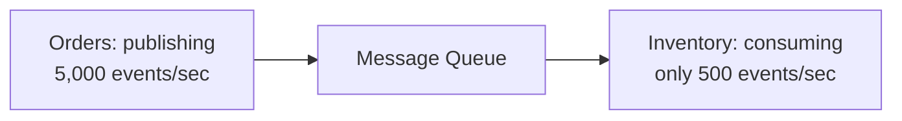
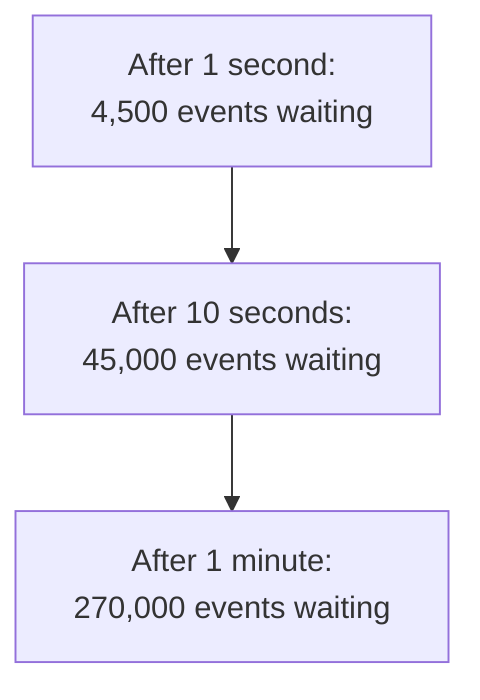
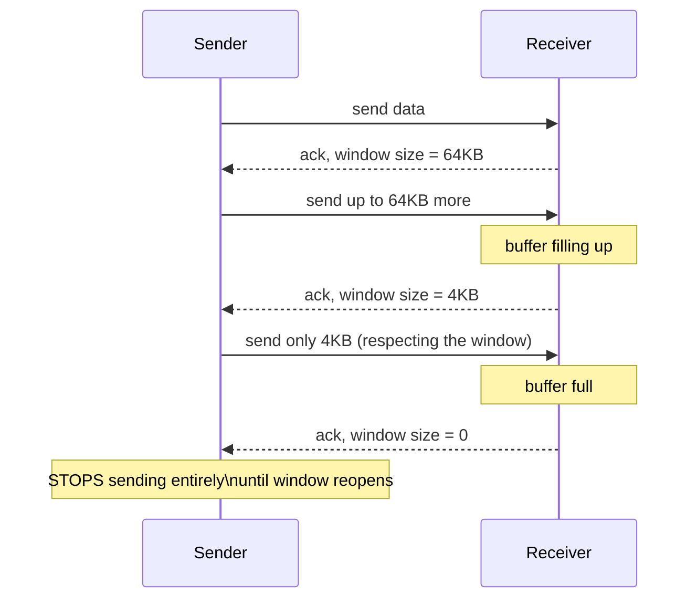
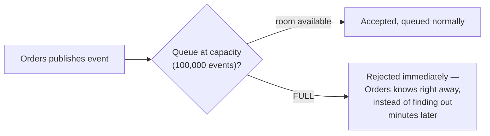
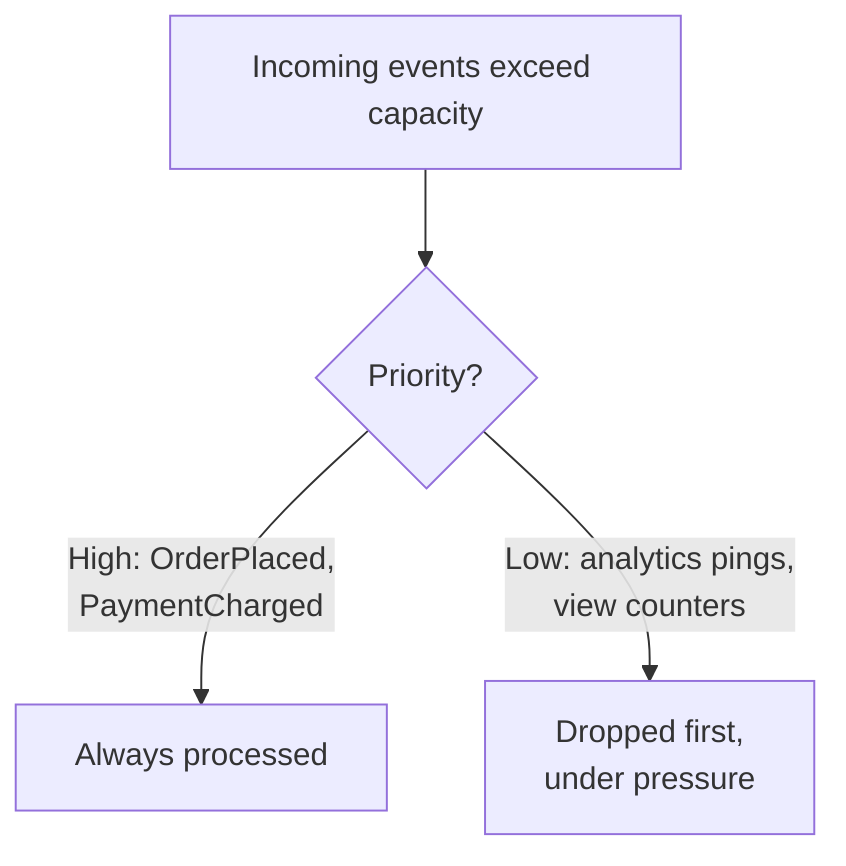
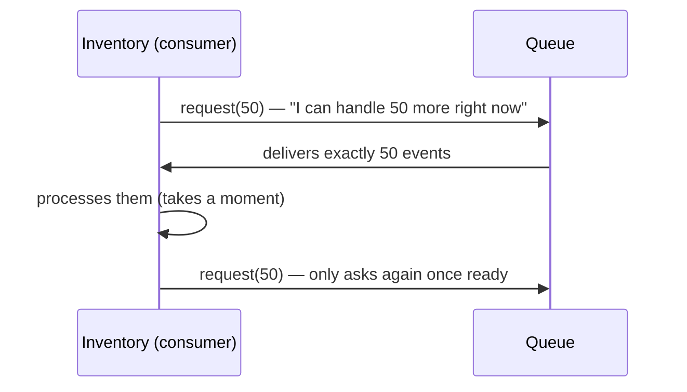
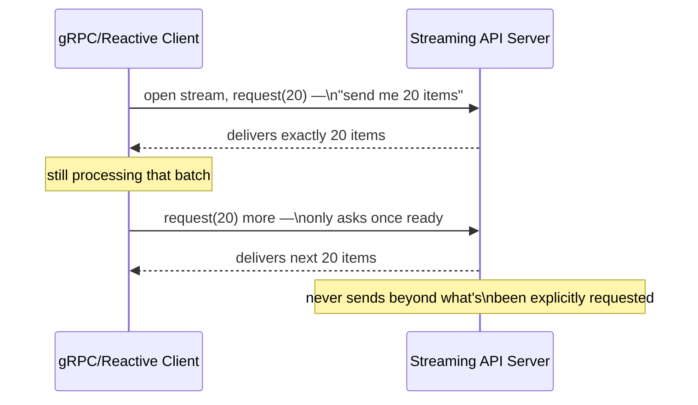
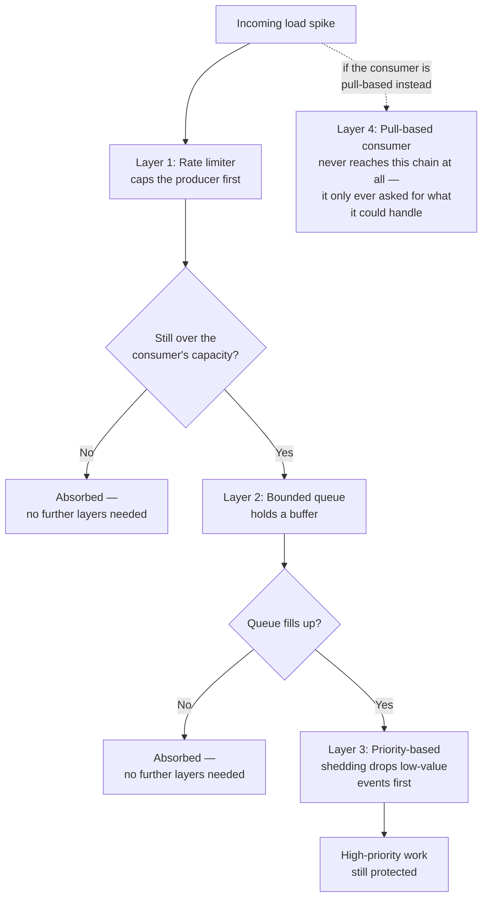
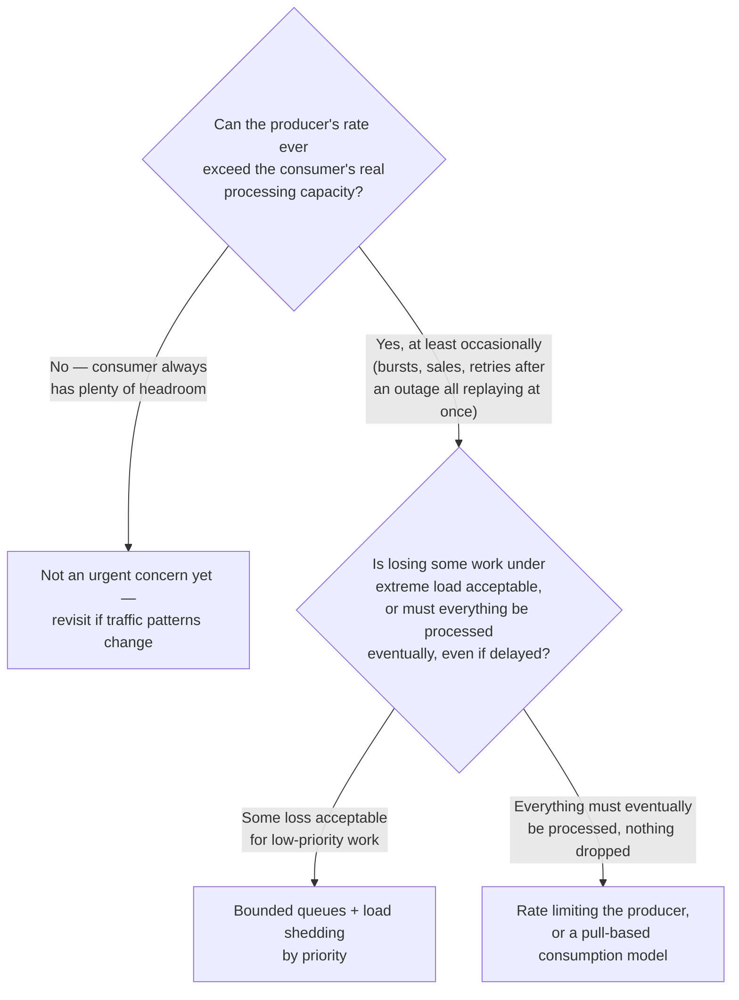
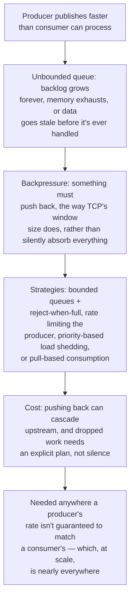

## The Story of Backpressure Handling in APIs

This is the last guide in the series, and it closes a loop several earlier guides opened but didn't finish. The Event-Driven guide showed Orders publishing events for Inventory to consume. It quietly assumed Inventory could always keep up. This guide is about what happens the day it can't.

---

## Interview Cheat Sheet

**Backpressure** is the mechanism that lets a slower consumer tell a faster producer to slow down, instead of silently drowning under a backlog it can never dig out of.

The four strategies, one line each:
- **Bounded queue + reject-when-full** — cap the buffer; once it's full, reject new work immediately instead of accepting it forever.
- **Rate limiting the producer** — cap how fast the producer is allowed to publish, before a backlog ever has a chance to form.
- **Priority-based load shedding** — when you can't process everything, decide deliberately what to drop, protecting high-value work first.
- **Pull-based consumption** — the consumer requests exactly as much as it can handle next, so the producer never has to guess the right rate.

**Where this always shows up:**
- Any event pipeline or message queue connecting services that run at different speeds.
- Any API gateway or load balancer sitting in front of a backend that can be overwhelmed.
- Any burst scenario — flash sales, retries replaying after an outage, serverless fan-out — where load arrives faster than steady-state capacity.

**If you ignore it:**
- Memory or disk exhaustion, as an unbounded queue keeps growing until the broker falls over.
- Stale or incorrect state, as processing falls minutes behind reality (e.g., a storefront showing "in stock" long after the item sold out).
- A cascading outage, as the backlog eventually drags down everything downstream of it too.

**The core trade-off:** backpressure protects the consumer and gives everyone an honest signal about real capacity — but the "push back" has to land somewhere (often the producer or its caller), and any work that gets rejected or dropped needs an explicit plan, or it's just silent data loss with extra steps.

---

## Chapter 1: Flash Sale Day

The bookstore runs a flash sale. Orders start pouring in — 5,000 a second, ten times the normal rate. Every order publishes an `OrderPlaced` event, exactly as the Event-Driven guide described. The Inventory service consumes those events to decrement stock, and it can only actually process about 500 a second — its database can't keep up with more than that, no matter how many events are waiting for it.

The gap between 5,000 arriving and 500 being processed doesn't just disappear — it accumulates, second by second, in the queue sitting between them.

If nothing intervenes, one of two things eventually happens: the queue's storage runs out and the whole broker falls over, or — even if storage holds — an order placed a minute into the sale won't have its stock decremented for **minutes**, meaning the storefront keeps showing items as "in stock" long after they're actually sold out.

---

## Chapter 2: Why This Is a Different Problem From Everything Else in This Series

It's worth being precise about what's new here, because it's easy to mistake this for a problem the earlier guides already solved.

The **Circuit Breaker** guide solved: a dependency being slow or down, on a call *you're waiting on an answer from*. The **Bulkhead** guide solved: one slow dependency exhausting resources shared with healthy ones. Neither of those is what's happening here. Inventory isn't broken. It isn't down. It isn't even slow, relative to its own normal capacity — it's just being asked to do ten times more than it can, by a producer that has no idea it's asking for too much and, worse, has no reason to find out unless something tells it.

> *"What do you do when nothing is failing, and the problem is simply that one side is faster than the other?"*

This is the **backpressure** problem: how do you get a fast producer to slow down to match a slower consumer's real capacity, rather than silently burying the consumer in a backlog it can never dig out of?

---

## Chapter 3: The Core Insight — Push Back, Instead of Absorbing Everything

The fix is right there in the name: instead of a queue silently absorbing an unlimited backlog, **something in the chain needs to push back** — signal, explicitly, that capacity has been reached, so the producer (or something even further upstream) slows down or sheds load, rather than everyone downstream quietly drowning.

This idea isn't new to distributed systems — it's exactly how TCP, the protocol underneath nearly all internet traffic, has worked for decades. A TCP receiver advertises a **window size**: "I can currently accept this many more bytes before my buffer is full." The sender is required to respect that number. If the receiver's window shrinks to zero, the sender **stops sending entirely** until the receiver signals it has room again.

Nobody calls this "backpressure" in networking class — they call it flow control — but it's the exact same idea this guide is building toward for APIs and event pipelines: **the receiving side communicates its real capacity, and the sending side is obligated to respect it.**

In practice, the metric engineers actually watch for this in production is **Kafka consumer lag** — the gap between the latest offset published to a topic and the offset a consumer group has actually processed up to. Rising lag is the early warning sign of exactly the flash-sale scenario Chapter 1 opened with: it tells you Inventory is falling behind Orders *before* the backlog turns into a full outage, which is what makes it one of the most commonly dashboarded and alerted-on numbers in any Kafka-based system.

---

## Chapter 4: Backpressure Strategies, From Simplest to Most Precise

### Strategy 1 — Bounded Queues With Reject-When-Full

The simplest fix for the flash sale scenario: cap the queue's size. Once it's full, new events are rejected immediately (with a clear error the producer can act on) rather than accepted and left to accumulate forever.

This is honest and simple: it turns "silently drowning" into "a clear, immediate signal that capacity has been reached." The trade-off is what to do with a rejected event — silently dropping an `OrderPlaced` event because Inventory couldn't keep up is rarely acceptable, so rejected work usually needs somewhere to go, like a **dead-letter queue** (a holding area for messages that couldn't be processed normally, to be retried or investigated later) rather than genuinely vanishing.

### Strategy 2 — Rate Limiting the Producer

Rather than waiting until the queue is already full, cap how fast the producer is *allowed* to publish in the first place, using the same token bucket or leaky bucket algorithms already covered in this repository's Fundamentals section for API rate limiting. Applied here, Orders itself is limited to publishing at a rate Inventory can realistically absorb, smoothing the burst out before it ever piles up in a queue.

### Strategy 3 — Load Shedding by Priority

When you truly can't process everything, decide deliberately what to drop, rather than dropping arbitrarily whatever happened to arrive last. A flash sale might prioritize actually completing checkouts over updating a "12 people are viewing this item" counter — under pressure, shed the low-value work first and protect the events that actually matter.

### Strategy 4 — Pull-Based Consumption Instead of Push

This is the most precise fix, and it mirrors TCP's window size most closely. Instead of the producer pushing events at whatever rate it wants, the **consumer explicitly requests** how many it's ready to handle next, and the producer is only allowed to send that many.

This is the model behind **Reactive Streams** (used in libraries like Project Reactor and RxJava) and it's precisely how Kafka consumers work too — a consumer pulls at its own pace rather than having messages pushed at it faster than it can keep up. The producer never has to guess the right rate; the consumer's own request rate **is** the rate, by construction. This is the cleanest solution in this chapter, and also the one that requires the most deliberate design — both ends of the pipeline need to speak this pull-based protocol, which push-based systems (plain HTTP calls, fire-and-forget queues) don't do by default.

This isn't a theoretical pattern — Netflix built **RxJava** specifically to solve backpressure between producers and consumers inside its own streaming infrastructure, where a fast server could easily overwhelm a slower client device. That real-world need is also why **Reactive Streams** later became a formal specification adopted across the JVM ecosystem, including as Java 9's built-in **Flow API** (`java.util.concurrent.Flow`) — the same `request(n)` contract shown above, baked directly into the standard library.

And this "pull, don't push" idea isn't confined to TCP or to message queues — it shows up one layer up the stack too, in application-level streaming APIs:

A gRPC streaming call (which itself runs over HTTP/2) applies the exact same contract Chapter 3's TCP diagram showed, just moved up from the transport layer to the application layer: the client's own request rate governs how much the server is allowed to send, so a slow client can never be flooded by a fast one.

### Combining the Strategies — Layered, Not Either/Or

These four strategies aren't competing options where you pick one; in a well-designed system they stack, each one catching what the layer before it didn't fully absorb.

---

## Chapter 5: The Cost — Pushing Back Has to Go Somewhere

### Cost 1 — Blocking the Producer Can Cascade Upward

If Orders is forced to slow down its publishing rate to match Inventory's capacity, and Orders itself is being called synchronously by the checkout flow, that slowdown can propagate all the way back to the customer waiting on their "Place Order" click — the exact cascading-failure shape the Circuit Breaker guide described, just triggered by a capacity mismatch instead of an outright failure. Backpressure has to be designed with an eye toward where the "push back" signal ultimately lands, or you've just moved the pain up the chain instead of resolving it.

### Cost 2 — Rejected or Dropped Work Needs an Actual Plan

The moment you introduce reject-when-full or load shedding, you've created a new category of "work that didn't happen." If there's no dead-letter queue, no retry policy, no alerting on drop rate, this quietly becomes data loss with no way to notice it happened until a customer complains. Backpressure done responsibly always pairs a "make room" decision with a "here's what happens to what didn't fit" decision.

### Cost 3 — Coordinating Flow Control Across Service Boundaries Is Real Design Work

TCP's window size works because it's built into the protocol every connection uses. Getting the same discipline across a system with many independent producers and consumers — each possibly built by a different team, in a different language, per the Sidecar guide's fleet — takes deliberate agreement on what signal means "slow down" and deliberate code on both ends to respect it. It doesn't happen automatically just because you know the concept exists.

---

## Chapter 6: When Do You Reach for This?

This concern shows up everywhere data flows between two things moving at different speeds — which, by this point in the series, is basically everywhere: event pipelines between microservices, an API gateway protecting a backend, a serverless function's burst of parallel instances all hitting the same database at once (exactly the concern the Serverless guide flagged in passing), a batch job replaying a backlog after an outage. Anywhere a producer's rate isn't guaranteed to match a consumer's, backpressure isn't an edge case to consider eventually — it's a question every one of these patterns eventually needs an honest answer to.

---

## The Full Story, End to End

| | No Backpressure | With Backpressure |
|---|---|---|
| Fast producer, slow consumer | Backlog grows unbounded | Producer is slowed, capped, or shed deliberately |
| Failure mode | Memory exhaustion, or stale/late processing | A clear, designed response: reject, delay, or drop by priority |
| Signal direction | One-way — producer never learns it's too fast | Two-way — consumer's real capacity is communicated back |
| Analogous to | A firehose aimed at a garden hose | TCP's window size / flow control |
| Best for | Producer and consumer rates are reliably matched | Any pipeline where bursts or rate mismatches are possible |

---

## Closing the Series

Ten guides, one continuous story: a bookstore that started as a monolith (Guide 1), split into microservices as it grew, and needed every pattern after that to survive the consequences of that split — serverless for bursty side-work, events to decouple reactions, CQRS to serve wildly different read and write needs, sagas to replace the transaction it gave up, the strangler fig to migrate there safely, and circuit breakers, bulkheads, sidecars, and backpressure to survive living as a distributed system day to day.

None of these patterns is "correct" in isolation. Each one is a answer to a specific, concrete pain — and each one costs something to adopt. The skill this series is really trying to build isn't memorizing ten names. It's recognizing, in your own system, which specific pain you actually have, before reaching for the pattern that answers it.

It's fitting that backpressure is where this series ends, because it's really the same free lunch Guide 1 described, just showing up again from a different angle: a monolith never has to worry about a caller overwhelming a function call, since a direct in-process call can never outpace its caller — there's no queue, no network, no gap for load to pile up in. Splitting into services, the trade-off Guide 1 made on purpose, is exactly what made backpressure a problem worth having a guide about at all.

**Where would you like to go next?** This repository's README lists several more sections worth exploring with the same depth — **Distributed Systems** (consensus algorithms, leader election, vector clocks) and **Database Design** (sharding, replication, specialized databases) are the most natural continuations from here.
