## The Story of Monolithic vs. Microservices Architecture

Let's start with why this choice even exists. Not "which one is better" — that question has no answer. The real question is: what problem was each one built to solve, and what did it cost to solve it?

---

## Interview Cheat Sheet

A **monolith** is one deployable application that contains all the code and usually one database — everything ships and runs together. **Microservices** are many independently deployable services, each owning one piece of the business and its own data, talking to each other over the network.

**Reach for microservices when:**
- Multiple teams are genuinely blocked on each other in one shared deploy queue — not just messy code, actual cross-team coordination pain
- One part of the system needs far more scale than the rest, and scaling everything together wastes real money
- One component's bugs need to stop being able to take down the whole system — you need the failure contained

**Stay monolith when:**
- You have one team, or a few teams that aren't blocked on each other
- Your scaling needs are roughly the same across the whole system, so scaling it all together isn't wasteful
- You haven't actually felt the pain yet — no coordination bottleneck, no wasted scaling, no blast-radius incident, no tech lock-in

The single biggest trade-off: **you're always exchanging coordination cost (the monolith's problem) for operational and consistency cost (the microservices' problem)** — nobody escapes complexity, you only choose which kind you're willing to manage.

---

## Chapter 1: Every System Starts as a Monolith

You're building a bookstore website. One founder, maybe two engineers. You need: users can sign up, browse books, add to cart, pay, and get an order confirmation.

The obvious thing to build is **one application** — one codebase, one process, one database.

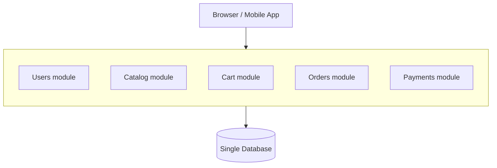

This is a **monolith** — not a slur, not a legacy mistake. It's just the name for "one deployable unit that contains all the code." Every feature lives in the same codebase. Every module can call any other module directly, as a plain function call, in the same memory space.

```python
# Inside the same process — this is just a function call.
def place_order(user_id, cart_id):
    user = users.get(user_id)          # direct call, same memory
    cart = cart.get(cart_id)           # direct call, same memory
    order = orders.create(user, cart)  # direct call, same memory
    payments.charge(user, order.total) # direct call, same memory
    return order
```

Notice what you get for free, just by being one process:
- **One transaction** can span all four steps — if payment fails, you roll back everything, and your database guarantees it.
- **One deploy** ships all the code at once — no version mismatch between "the cart code" and "the payments code."
- **One thing to run, one thing to monitor, one log file to tail.**

This is why almost every successful company — Amazon, Shopify, Facebook, Airbnb — **started as a monolith.** It's not a beginner mistake. It's the correct engineering decision when your team is small and your traffic is low. The cost of coordinating across process boundaries only pays for itself once you have a problem that a monolith can't solve.

So what problem is that?

---

## Chapter 2: The Bookstore Becomes Amazon

Five years later. You have 200 engineers. Millions of orders a day. And things that used to be simple are now a daily source of pain.

### Symptom 1 — Everyone Steps on Everyone's Feet

200 engineers, one codebase, one deploy pipeline. To ship a one-line fix to the catalog search, you still go through the same build, the same test suite, the same release train as the team touching payments.

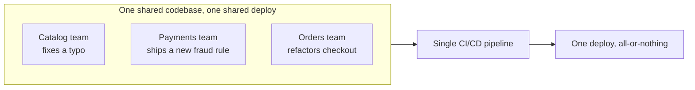

If the payments team's code has a bug that crashes the build, the catalog team's one-line typo fix is stuck behind it. Three teams, one queue, one bottleneck. This is a **coordination cost**, and it grows with the square of the number of teams — more people means more possible collisions.

### Symptom 2 — You Can't Scale One Thing Without Scaling Everything

Suppose catalog search gets hammered every Black Friday, but payments processing stays flat. In a monolith, they're the same process. To handle catalog load, you spin up more copies of the **entire application** — including the payments code nobody needed more of.

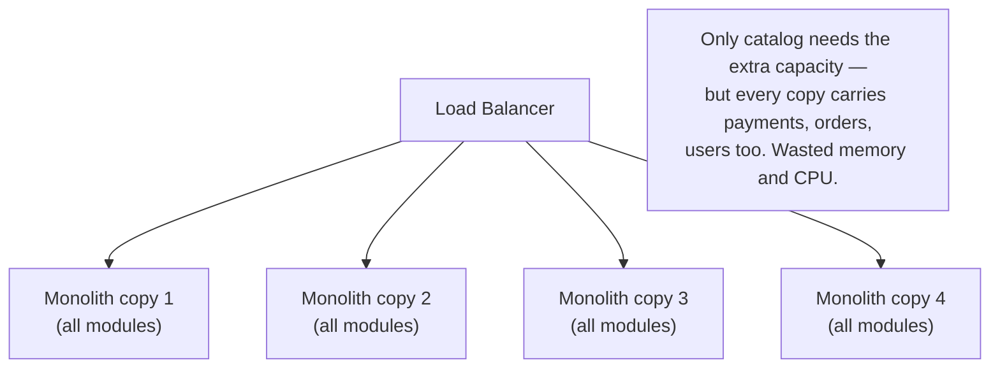

You're paying to scale code you don't need scaled. This is wasteful, but survivable — until the next symptom, which is not survivable.

### Symptom 3 — One Bug Takes Down Everything

This is the big one. In a monolith, one bad memory leak in the recommendations module can exhaust the process's memory and crash the **entire application** — including checkout, which was working fine.

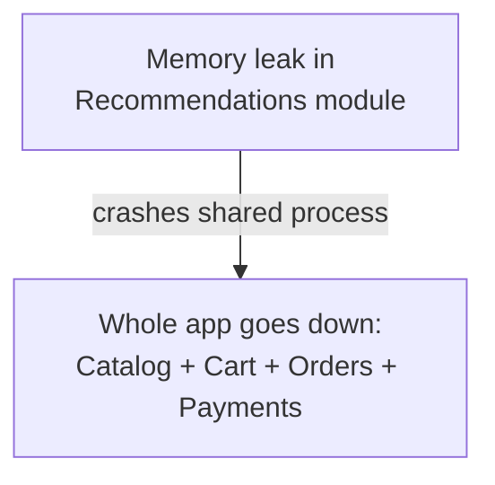

There is no wall between modules. A crash anywhere is a crash everywhere. Engineers call this having **no blast radius containment** — the "blast" from one failure spreads to the whole building because there are no firewalls between rooms.

### Symptom 4 — You're Locked Into One Technology, Forever

The monolith is written in Ruby. That was the right call in year one. But now the recommendations team wants to use Python for its machine learning libraries, and the high-frequency trading-style fraud detection team wants the raw speed of Go. In a monolith, everyone is stuck with one language, one runtime, one set of libraries — because it's all one process.

None of this is hypothetical. In 2002, Amazon's Jeff Bezos sent an internal mandate: every team's data and functionality could only be exposed through a service interface — no team could reach directly into another team's database, no exceptions. That mandate is widely credited as the origin of Amazon's service-oriented architecture, and the internal platform teams built to comply with it eventually became the foundation of AWS. Netflix hit the same wall from the failure side: a serious database corruption incident in 2008 took its DVD-rental service down for three days, and that outage is what pushed Netflix to spend the next several years, roughly 2009 to 2012, breaking its monolith apart into one of the first large-scale microservices systems.

These four symptoms — **coordination bottlenecks, wasteful scaling, unbounded blast radius, and technology lock-in** — are the actual reasons microservices exist. Not because monoliths are bad. Because at a certain size, these specific costs start to outweigh the coordination benefits a monolith gives you for free.

---

## Chapter 3: The Core Insight — Split by Boundary, Not by Layer

The fix engineers converged on: **stop deploying everything together. Split the system into independently deployable services, each owning one business capability.**

This is **microservices architecture** — many small, independently deployable services, each responsible for one piece of the business, each with its own process, and critically, **its own database.**

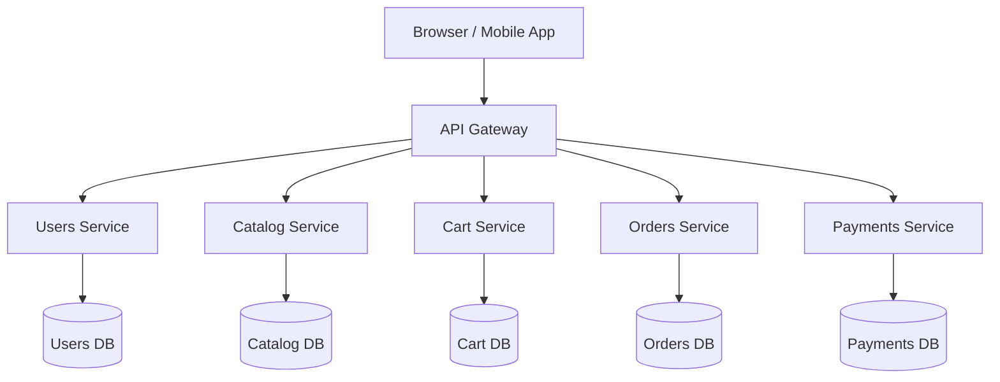

The critical design rule, and the one teams get wrong most often: **each service owns its own data, and nobody else touches that data directly.** If the Orders service needs user information, it doesn't reach into the Users database — it asks the Users service, over the network.

```python
# This is now a network call, not a function call.
def place_order(user_id, cart_id):
    user = requests.get(f"http://users-service/users/{user_id}")     # HTTP call
    cart = requests.get(f"http://cart-service/carts/{cart_id}")       # HTTP call
    order = requests.post("http://orders-service/orders", ...)        # HTTP call
    payment = requests.post("http://payments-service/charge", ...)    # HTTP call
    return order
```

Read that code again slowly. It looks almost identical to the monolith version. That similarity is exactly what makes microservices dangerous to newcomers — **the code looks the same, but every single line just changed its failure characteristics.** A function call cannot time out. A function call cannot get a response from a server that crashed mid-request. A function call cannot receive a slow response because someone else's traffic spike is saturating the network. An HTTP call can do all of these. We'll come back to this in Chapter 5, because it's the whole story.

---

## Chapter 4: What You Actually Get — The Four Symptoms, Solved

Let's connect each Chapter 2 symptom to what microservices give you.

**Independent deployability** solves the coordination bottleneck. The catalog team ships their typo fix the moment it's ready — no queue behind the payments team.

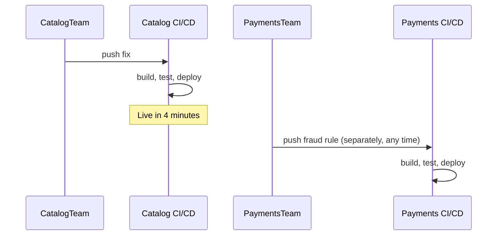

**Independent scaling** solves the wasteful-scaling problem. Scale the catalog service to 20 copies during Black Friday; leave payments at 3.

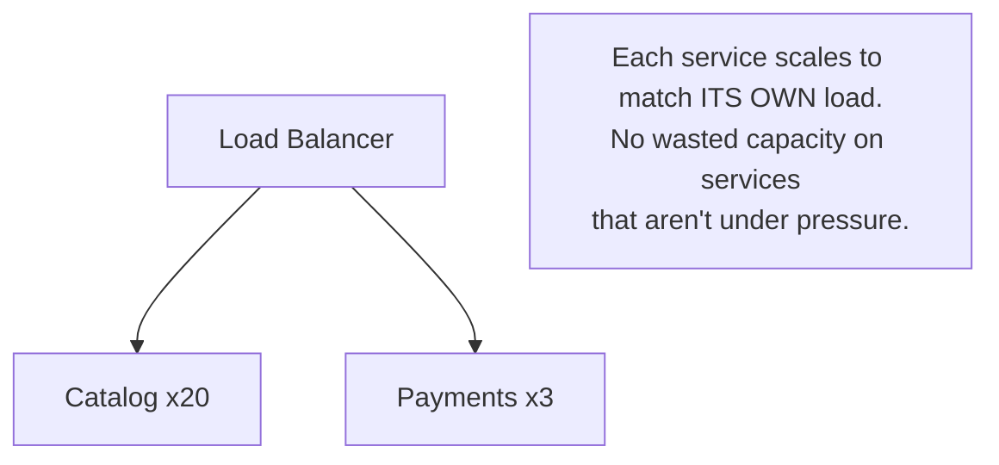

**Fault isolation** solves the blast-radius problem. A memory leak in the recommendations service crashes *that service* — checkout keeps working, maybe in a degraded mode (no personalized recommendations shown), but orders still complete.

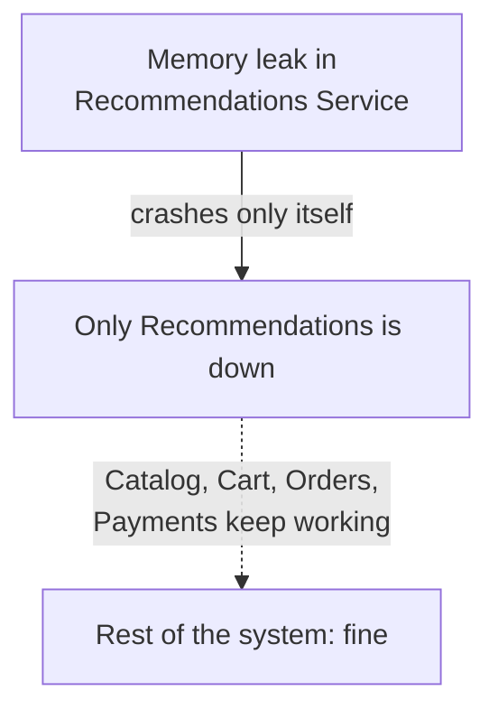

**Technology freedom** solves the lock-in problem. The recommendations team runs Python with PyTorch. The fraud team runs Go for raw throughput. The checkout team stays on the original Ruby, because it works and nobody needs to rewrite it just to satisfy an architectural purity rule.

There's a fifth, quieter benefit worth naming: **it maps the system to how your organization actually communicates.** This is **Conway's Law** — systems end up shaped like the organizations that build them. If you have five teams, you'll naturally end up with something like five service boundaries whether you plan it or not, because a team that owns a service can move without asking permission from four other teams first.

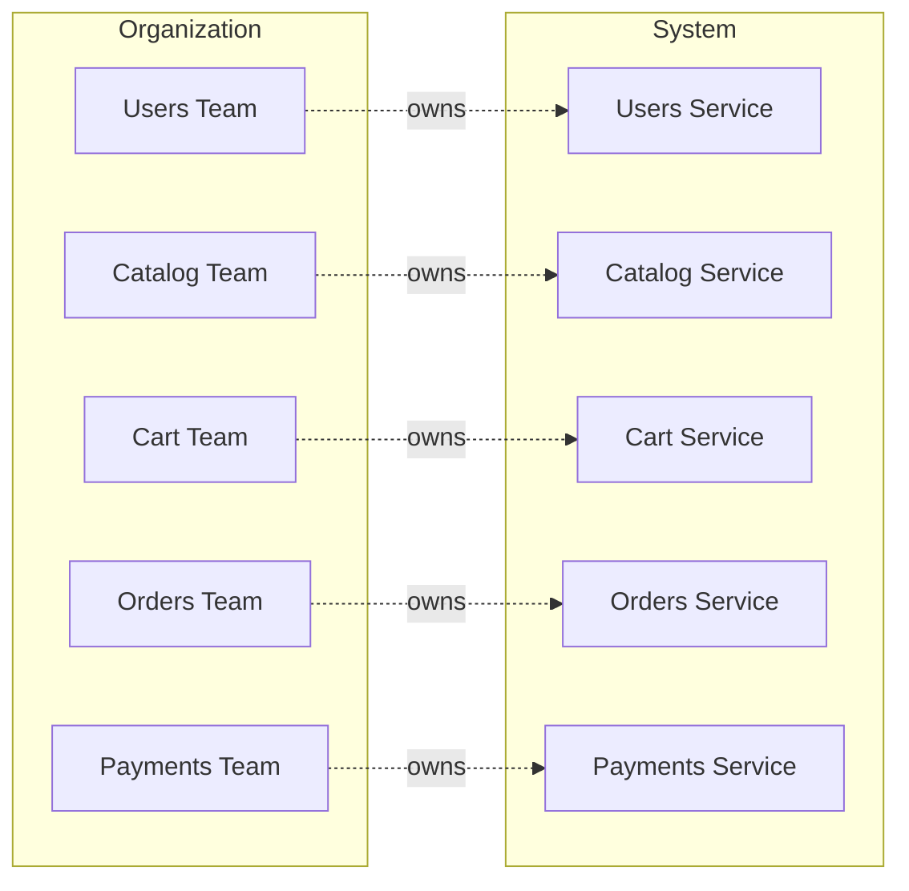

Design your service boundaries around your team boundaries, and each team can move at its own speed. Design them any other way, and every team is constantly waiting on every other team — you've just rebuilt the monolith's coordination problem with extra network hops added on top.

---

## Chapter 5: The Bill Comes Due — What Microservices Actually Cost

This is the chapter most tutorials skip, and it's the reason so many teams adopt microservices and regret it. Splitting a system into services doesn't remove complexity — **it moves complexity from inside your code to between your services**, and that new home for the complexity is much harder to debug.

### Cost 1 — Every Call Can Now Fail in New Ways

In the monolith, `payments.charge()` either runs or throws an exception you can catch in the same stack trace. Over the network, a call to the Payments service can:

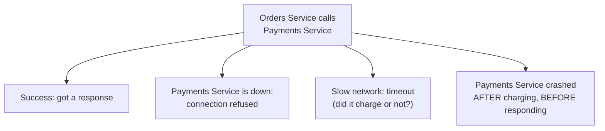

That last case is the nightmare scenario: **the money left the customer's account, but the Orders service has no idea whether it succeeded, because the response never arrived.** Do you retry (risking a double charge)? Do you not retry (risking a lost order)? This single problem — **distinguishing "it failed" from "it succeeded but I didn't hear back"** — doesn't exist in a monolith at all, and it's the reason patterns like idempotency keys, circuit breakers, and sagas exist. (More on sagas and circuit breakers in later guides in this series — they were invented specifically to answer this question.)

Even when every call succeeds — no crashes, no timeouts — the network hops still add up. Here's the same `place_order` logical chain from Chapter 3, timed end to end: first as function calls inside one process, then as network calls across services.

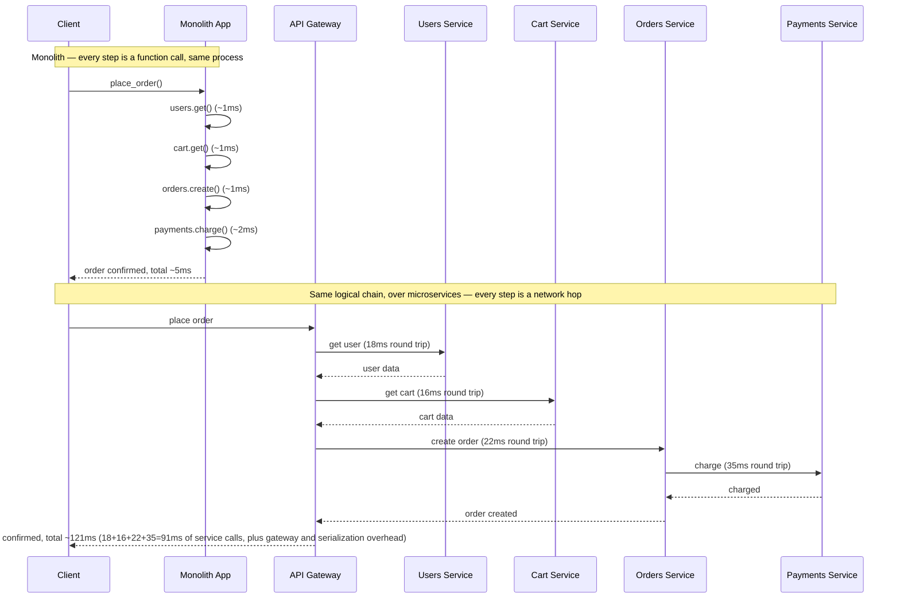

The logic didn't change. The result didn't change. But a checkout that used to complete in 5ms now takes over 120ms in the best case — where every single hop succeeds on the first try. That's the hidden cost underneath Cost 1: it's not just that calls can now fail, it's that even the calls that succeed are an order of magnitude slower, and each one is a fresh opportunity for the failure modes above.

### Cost 2 — You Lost Your Transactions

Remember the monolith's free lunch: one database transaction covering the whole order. In microservices, Users, Cart, Orders, and Payments each have their **own** database. There is no single transaction that can span all four. If Payments succeeds but Orders crashes before recording the order, you have charged a customer with no order to show for it — a state that was **structurally impossible** in the monolith and is now a real risk you must design against.

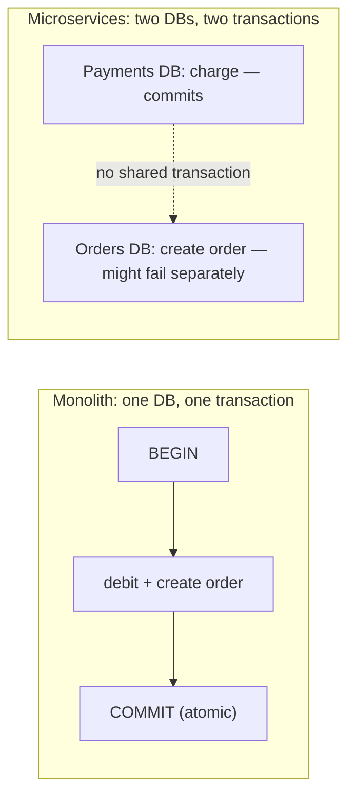

### Cost 3 — Debugging Requires Reassembling a Story From Five Places

One user complaint — "my order didn't go through" — used to mean reading one log file, top to bottom, in order. Now that request touched five services, each with its own logs, possibly on different machines, possibly at slightly different clock times.

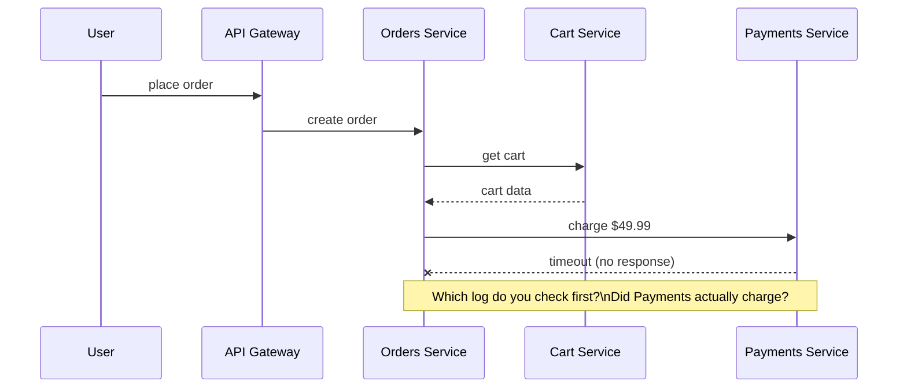

This is why **distributed tracing** (tools like Jaeger or OpenTelemetry, which stitch a single request's journey across every service it touched into one timeline) went from "nice to have" to "load-bearing infrastructure" the moment teams went to microservices. Without it, incident response becomes archaeology.

### Cost 4 — Operational Overhead Multiplies

One monolith means one thing to deploy, one thing to monitor, one set of dashboards. Fifty microservices means fifty things to deploy, fifty sets of dashboards, fifty services that each need their own on-call runbook, their own capacity planning, their own security patching schedule. Small teams frequently underestimate this until they're the ones holding the pager.

The honest summary of this chapter: **microservices trade coordination cost for operational and consistency cost.** You're not eliminating complexity. You're choosing which kind of complexity you'd rather manage, and the answer depends entirely on how big your team and your traffic actually are.

---

## Chapter 6: So Which One Do You Actually Pick?

Here's the decision framework that emerges from everything above — not "microservices are modern, monoliths are legacy," but a straightforward cost comparison.

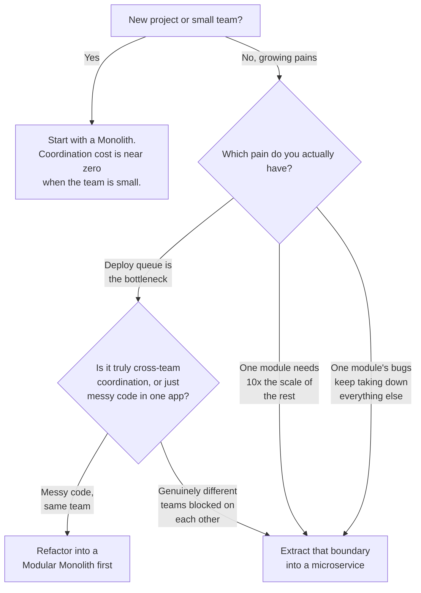

Notice the middle step most teams skip: the **modular monolith.** This is one deployable process, but internally organized into strict modules with clear boundaries and no cross-module database access — all the discipline of microservices, none of the network calls. It's the honest middle ground: you get clean boundaries (so extraction later is easy) without paying the distributed-systems tax before you actually need to.

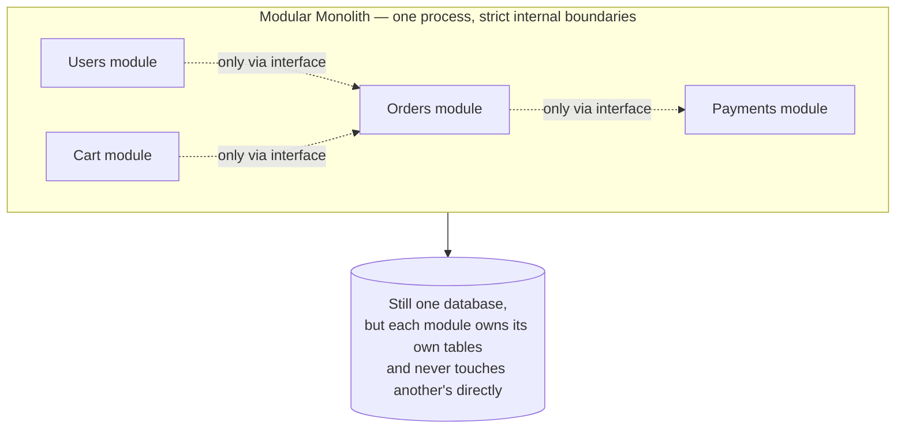

Real companies validate this path. Shopify runs a deliberately modular monolith at massive scale and has written publicly about resisting pressure to fully split into microservices. Amazon and Netflix, on the other hand, genuinely needed microservices — thousands of engineers, wildly different scaling needs per component (Netflix's video encoding pipeline has nothing in common with its billing service), and organizations too large for one deploy queue to serve. The pattern they both share: **they didn't start there.** Amazon's original bookstore was a monolith. Netflix's original DVD-rental site was a monolith. Both split only once symptoms in Chapter 2 became undeniable, and — this matters — both split gradually, one boundary at a time, rather than in one rewrite. That gradual extraction has its own name and its own guide: the **Strangler Fig Pattern**, later in this series.

Here's roughly what that staged extraction looked like for Amazon specifically — not a rewrite, a sequence of deliberate steps taken over years:

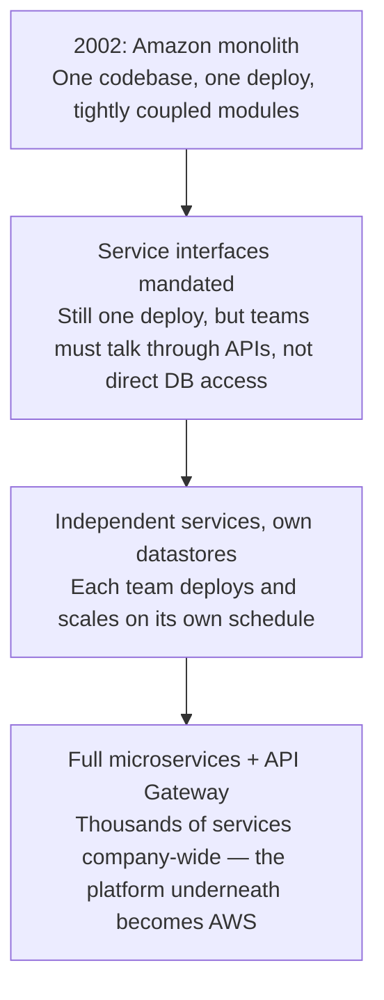

Segment's public history cuts the other way, and it's worth knowing precisely because it's the counter-example. In 2018, Segment published a widely read postmortem, "Goodbye Microservices," describing how they had split their core product into roughly nine services expecting the usual benefits — only to find that at their actual scale, the split mostly added on-call burden and cross-service debugging without a matching payoff. They consolidated those nine services back into one monolith. The lesson isn't "microservices were a mistake" — it's that the coordination cost microservices remove has to be bigger than the operational cost they add, for your specific team and traffic, right now. Segment's team and traffic didn't need the split yet. Reason from your own symptoms, not from what Amazon or Netflix did.

---

## The Full Story, End to End

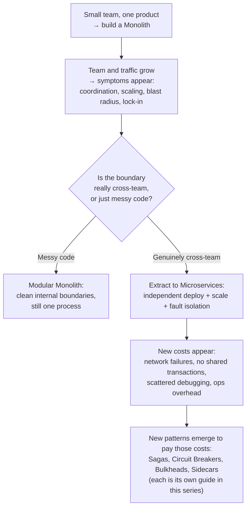

| | Monolith | Microservices |
|---|---|---|
| Deploy unit | One process, all code | Many independent services |
| Transactions | One DB, ACID across everything | No shared transaction — needs Sagas |
| Scaling | Scale the whole app together | Scale each service independently |
| Failure | One crash can take down everything | Failure contained to one service |
| Debugging | One log file, one stack trace | Distributed tracing across services |
| Team model | Works well for one team | Matches many independent teams |
| Right for | Early-stage, small team, unclear boundaries | Large org, proven boundaries, real scaling asymmetry |

**Where would you like to go next?** Natural threads from here:

- **Serverless Architecture** — what happens when you push the "independent deploy unit" idea even further, down to individual functions
- **Saga Pattern** — how to get transaction-like guarantees back once your data is split across services
- **Circuit Breaker & Bulkhead Patterns** — how to survive the "every network call can fail" problem from Chapter 5
- **Strangler Fig Pattern** — how real companies migrate an existing monolith into services gradually, without a risky big-bang rewrite
