## The Story of Serverless Architecture

Pick up where the last guide left off. Your bookstore split its monolith into microservices — Users, Catalog, Cart, Orders, Payments. That solved the big four problems. But now a smaller, quieter problem starts showing up on the AWS bill.

---

## Interview Cheat Sheet

**Serverless (FaaS)** in one sentence: you deploy a single function instead of a running server, the cloud provider runs it only when an event triggers it, and you're billed per invocation and per millisecond of execution instead of for idle uptime.

Good fit:
- Bursty, unpredictable traffic with long idle gaps between invocations (image resize on upload, webhook handlers, nightly jobs)
- Short-lived work that finishes in seconds to a few minutes, with no need to hold state between calls
- Gluing managed services together with small amounts of transformation logic, where near-zero ops overhead matters more than raw latency

Bad fit:
- Steady, high-volume traffic all day — at that scale, a dedicated server or container is cheaper per request
- Work that needs a guaranteed low-latency response on every single call (cold starts make tail latency unpredictable)
- Long-running jobs (video transcoding, multi-hour data pipelines) that exceed the platform's execution time cap

The core trade-off: near-zero idle cost and zero server management, in exchange for cold starts, mandatory statelessness, and a hard cap on how long a single invocation can run.

---

## Chapter 1: The Service Nobody Asked to Run 24/7

Somewhere in your architecture is a tiny piece of code that resizes a product photo into a thumbnail whenever a seller uploads one. It runs in maybe 200 milliseconds. It gets triggered a few hundred times a day, in bursts — a seller uploads 40 photos at once, then nothing for six hours.

To run this, in the microservices world from the last guide, you still need **a server** — a machine (or container) that is up, listening, ready to accept the request the instant it arrives.

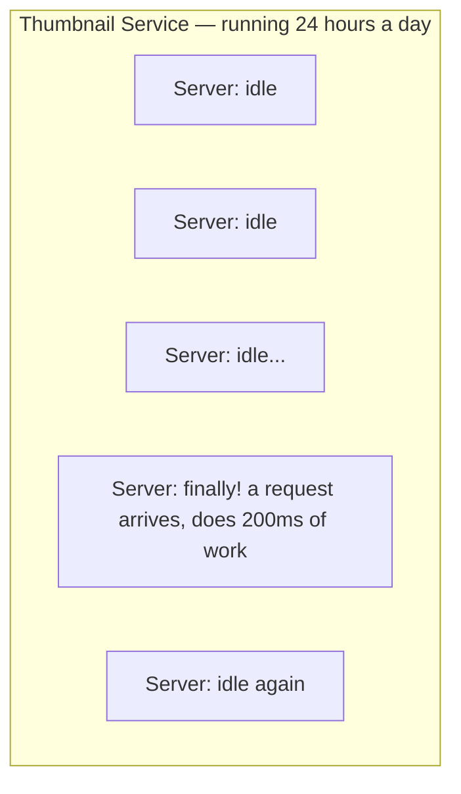

You're paying for a machine to sit there, doing nothing, more than 99% of the time, just so it's ready for the rare moment it's needed. Multiply this across a real company: dozens of small, event-triggered jobs — send a welcome email, generate an invoice PDF, resize an image, run a nightly cleanup script — each with its own "server that mostly does nothing."

And it's not just wasted money. It's wasted **attention**. Someone has to patch that server's operating system. Someone has to configure its auto-scaling group. Someone gets paged at 3am if it runs out of disk space. All of this operational weight, for a function that does 200 milliseconds of real work per invocation.

The question this chapter is building toward:

> *"Why am I managing a server at all, for code that runs for milliseconds, a few hundred times a day? Can I just... give the cloud provider the code, and let them worry about the machine?"*

---

## Chapter 2: The Core Insight — Rent the Function, Not the Machine

This is **serverless architecture** — and the name is a slight misdirection, because there are absolutely still servers involved. The point isn't "no servers." The point is **you never think about them.** You hand the cloud provider a function. They decide which machine runs it, when, and how many copies to run. You are billed only for the exact milliseconds your code was executing — not for the idle time in between.

This specific style — deploying individual functions that run in response to events — is called **FaaS (Function as a Service)**. AWS Lambda, Google Cloud Functions, and Azure Functions are the well-known implementations.

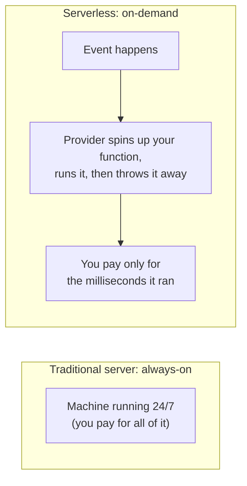

Here's the thumbnail function as a serverless function:

```python
# This is the ENTIRE deployable unit. No server to configure.
def resize_thumbnail(event, context):
    image = download(event["bucket"], event["key"])
    thumbnail = resize(image, width=200)
    upload(event["bucket"], f"thumbnails/{event['key']}", thumbnail)
    return {"status": "done"}
```

There's no `while True: listen_for_requests()` loop. No port to bind. No process to keep alive. You wrote a function that takes an input and produces an output — and you hand it to the provider, who decides everything about *where* and *when* it runs.

---

## Chapter 3: What Actually Happens When an Event Fires

To trust this model, you need to see what the provider is doing behind the curtain. Let's trace one upload, end to end.

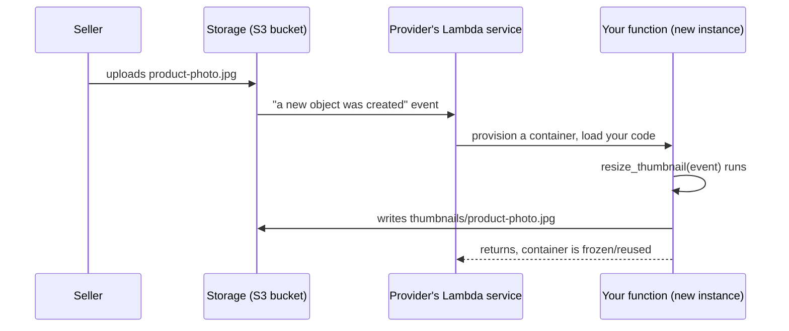

Two things to notice. First, **your function is triggered by an event**, not by a request you're listening for. Second, the provider had to **provision a container just for this invocation** — download your code, start a runtime, initialize it — before your function's first line even ran. That provisioning step has a name, and it's the single most important trade-off in this entire architecture: **the cold start.**

### The Cold Start Problem

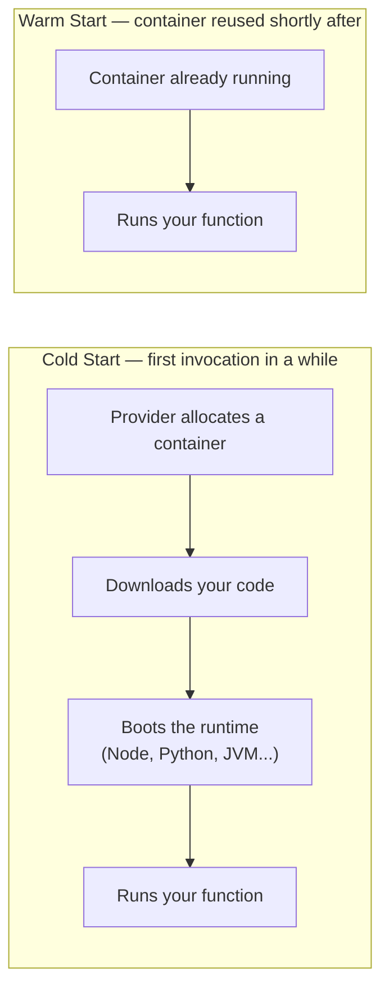

A cold start can add anywhere from tens of milliseconds (lightweight runtimes like Node or Python) to a few full seconds (a JVM booting up with a large dependency tree) before your actual code starts. If your function runs constantly, most invocations reuse an already-warm container and this cost disappears. But if it runs rarely — like our thumbnail resizer, quiet for six hours at a stretch — nearly every invocation pays the cold start tax.

To make "cold start tax" concrete, here's an illustrative timing breakdown for a JVM-based Lambda function (Java is one of the slower-booting runtimes, which is exactly why it makes a good worked example) — first a cold invocation, then a warm one moments later:

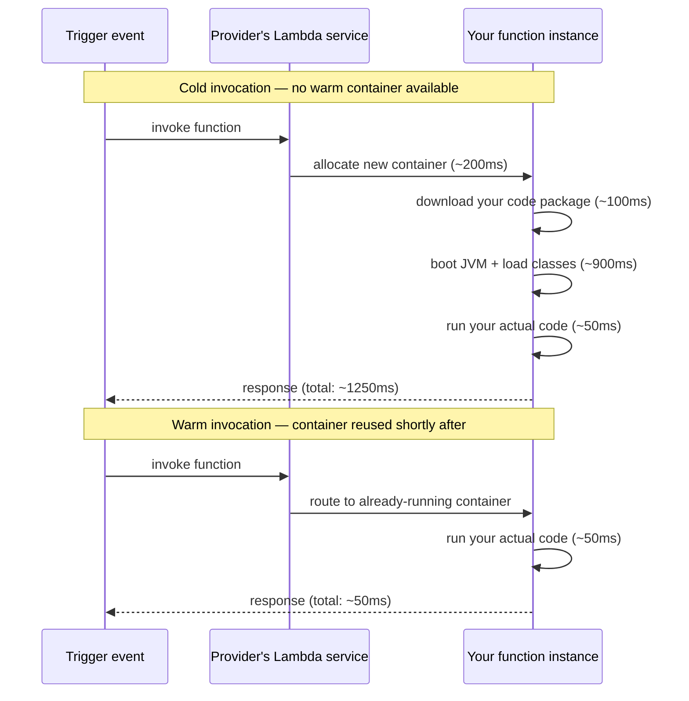

Same 50 milliseconds of actual business logic, 25x difference in total response time — and every millisecond of that gap is the provisioning tax from Chapter 2's promise: the provider had to build you a fresh, isolated machine before it could hand you the microphone.

This is why serverless is a fantastic fit for bursty, unpredictable, low-average-traffic work, and a genuinely bad fit for something that needs a guaranteed sub-10-millisecond response on every single call, every time.

### Scaling Is Automatic — And That Cuts Both Ways

The seller uploads 40 photos in ten seconds. The provider doesn't queue them behind one server. It spins up 40 separate containers, running your function 40 times, fully in parallel — the exact same code, no configuration from you.

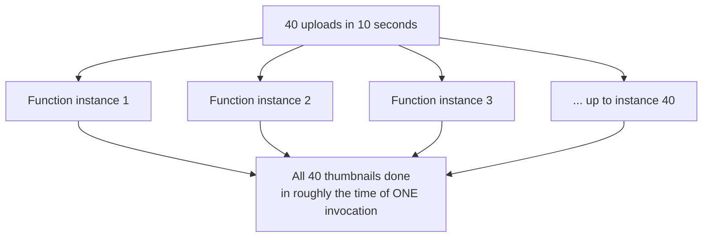

This is the payoff of Chapter 2's insight taken to its natural extreme: you never provisioned capacity for "40 at once" — the provider just did it, because you handed over a function instead of a machine. But this cuts both ways: if something downstream — say, a database — can only handle 20 concurrent connections, then 40 simultaneous function instances all trying to write at once can accidentally overwhelm it. **Auto-scaling the compute layer doesn't auto-scale everything it talks to.** More on protecting a fragile downstream service from exactly this kind of flood in the Bulkhead and Backpressure guides later in this series.

---

## Chapter 4: The Rules You Must Follow — Statelessness

Serverless imposes one hard constraint that trips up almost everyone coming from traditional servers: **you cannot assume your function's next invocation runs on the same machine, or even that a machine still exists between invocations.**

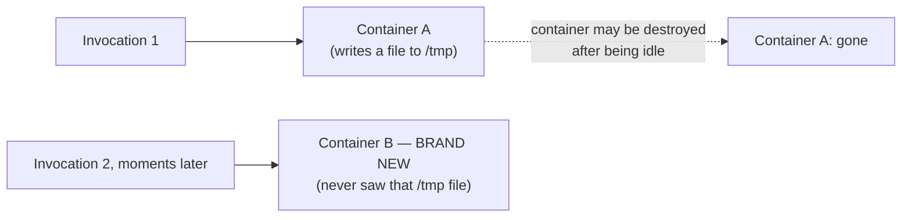

Anything you write to local disk, any in-memory cache you build up, any counter you increment — it can vanish the moment the container is recycled, and a fresh container starts from zero. This forces your function to be **stateless**: every invocation must fetch what it needs from somewhere durable (a database, an object store, a cache like Redis) and must not depend on anything left behind by a previous run.

This isn't a limitation someone forgot to fix — it's the direct consequence of Chapter 2's promise. The provider can only give you "never think about the machine" if it's free to create, reuse, or destroy that machine on its own schedule. Statelessness is the price of that freedom.

---

## Chapter 5: The Hidden Costs — What the "No Servers" Pitch Leaves Out

### Cost 1 — Execution Time Limits

Every serverless platform caps how long a single invocation can run (AWS Lambda: 15 minutes maximum). This is fine for a thumbnail resize. It's the wrong tool entirely for a long-running video transcoding job or a data pipeline that takes two hours — those belong on containers or dedicated servers, not FaaS.

### Cost 2 — You Cannot Test It Like a Normal Program

A traditional server, you run locally with `python app.py` and hit `localhost:8080`. A serverless function is triggered by cloud-specific events — an S3 upload notification, an SQS message, an API Gateway request — and those events have provider-specific shapes. Testing locally means simulating the provider's event format, or running an emulator (like AWS SAM Local), which is never a perfect match for production behavior.

### Cost 3 — Vendor Lock-In Is Real and Underrated

Your function's trigger configuration, its permission model (IAM roles), and its event payload shapes are all specific to your cloud provider. Moving a serverless codebase from AWS Lambda to Google Cloud Functions is rarely a copy-paste — it's closer to a partial rewrite of the integration layer, even though your core business logic barely changes.

### Cost 4 — Debugging Loses Your Usual Tools

You can't SSH into a serverless function to poke around while it's misbehaving — there is no persistent machine to SSH into. You're dependent entirely on the logs and traces you thought to emit ahead of time. This makes strong structured logging and distributed tracing not a nice-to-have but a prerequisite, for exactly the same reason it became a prerequisite for microservices in the previous guide — you've once again traded "a debugger attached to a running process" for "a story you have to reconstruct from logs."

### Cost 5 — At High, Steady Volume, It Gets Expensive

This is the trade-off people miss most. Serverless pricing is pay-per-invocation-per-millisecond. That's a phenomenal deal for something invoked 200 times a day. Run that same function 50 million times a day, continuously, at high, predictable volume — and the always-on server you were trying to avoid in Chapter 1 is now **cheaper**, because you've crossed the point where "pay only for what you use" costs more than "just pay a flat rate for a machine that's always busy anyway."

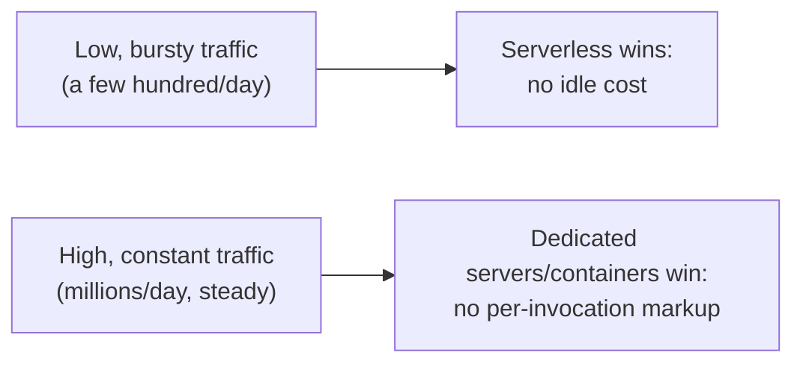

---

## Chapter 6: When Do You Actually Reach for Serverless?

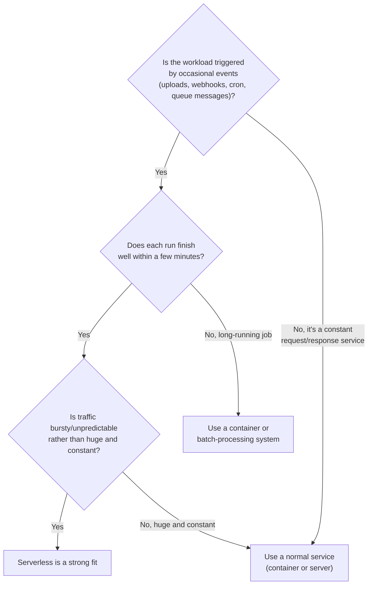

Good serverless fits: resizing an image on upload, sending a confirmation email after checkout, running a nightly report, validating a webhook payload, gluing two managed services together with a few lines of transformation logic. Poor fits: your core Orders API that takes constant, high, predictable traffic all day — for that, the always-on microservice from the previous guide is both cheaper and has none of the cold-start latency risk.

This "bursty, event-driven, occasional workload" category isn't just theory — real companies run production traffic on exactly this shape. Netflix uses AWS Lambda for parts of its video encoding and media-processing pipeline, where jobs fire in unpredictable bursts as new content is ingested rather than at a steady rate. Coca-Cola Australia became a famous AWS re:Invent case study by putting Lambda and API Gateway in front of its vending machines, handling bursty, unpredictable payment requests from machines scattered across the country without running a single server themselves. iRobot uses serverless functions to absorb bursty IoT telemetry streaming in from Roomba vacuums, where thousands of devices can all "phone home" at once and then go quiet.

There's also a middle ground worth knowing about, the same way the modular monolith was a middle ground in the last guide: **serverless containers** (AWS Fargate, Google Cloud Run). These give you the "never manage a server, never patch an OS" benefit of serverless, but without FaaS's strict short-execution-time and stateless-only constraints — you deploy a container instead of a single function, and it can run longer and hold onto more state between requests within its own lifetime. It's a reasonable choice when you want serverless's operational simplicity but your workload doesn't fit FaaS's shape.

Here's all four options placed on the same map, by traffic pattern and operational effort:

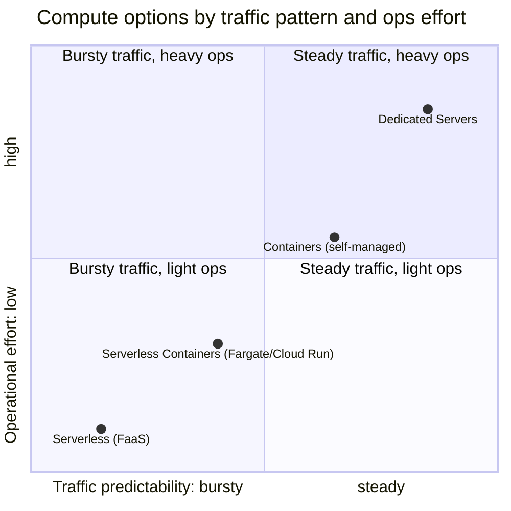

Reading the map: as traffic gets steadier and more predictable, and as you're willing to take on more operational effort in exchange for control and per-request cost efficiency, you move up and to the right — from serverless, through serverless containers, through self-managed containers, to dedicated servers. The thumbnail resizer from Chapter 1 belongs in the bottom-left corner (bursty, near-zero ops); your core Orders API, taking constant high traffic and needing dedicated capacity planning, belongs in the top-right.

---

## The Full Story, End to End

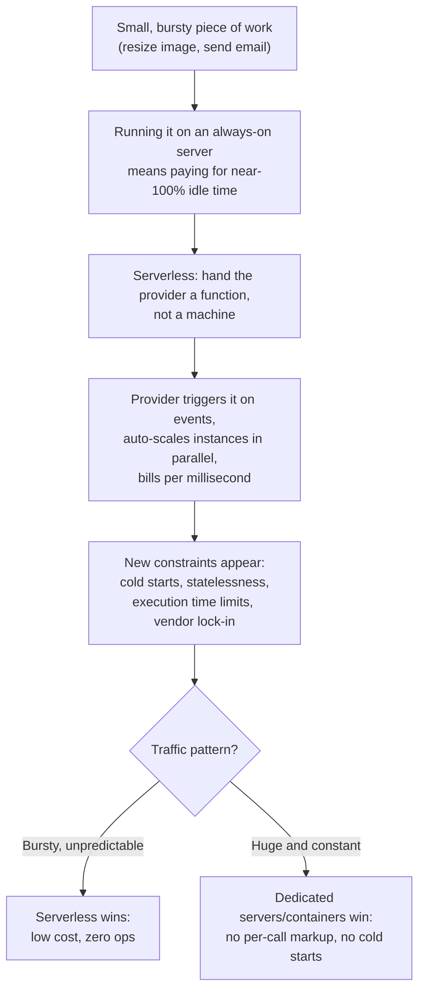

| | Traditional Server | Serverless (FaaS) |
|---|---|---|
| Unit you deploy | A running process on a machine | A single function |
| Billing | Pay for uptime, whether used or not | Pay per invocation + execution time |
| Scaling | You configure auto-scaling rules | Automatic, per-request, by the provider |
| State | Can hold state in memory between requests | Must be stateless — nothing persists between calls |
| Cold start | None — it's always running | Real cost for infrequent invocations |
| Max run time | Unbounded | Capped (minutes, not hours) |
| Best for | Steady, high, predictable traffic | Bursty, event-driven, occasional workloads |
| Ops burden | You patch, scale, and monitor the machine | Provider manages the machine entirely |

**Where would you like to go next?** Natural threads from here:

- **Event-Driven Architecture** — serverless functions are almost always triggered by events; this guide goes deep on the event backbone (queues, topics, pub-sub) that makes that triggering reliable
- **Bulkhead Pattern** — how to stop an auto-scaling burst of function instances from overwhelming a fragile downstream database
- **Backpressure Handling in APIs** — what to do when producers (events) outpace consumers (functions), even when the functions themselves scale instantly
