## The Story of Event-Driven Architecture

Back to the bookstore. Orders is now its own microservice, exactly as the first guide described. A customer clicks "Place Order," and behind that one click, four other things need to happen: Inventory needs to decrement stock, Shipping needs to create a shipment, the Email service needs to send a confirmation, and Analytics needs to record the sale.

---

## Interview Cheat Sheet

**Event-driven architecture** is a design where services communicate by publishing facts about things that already happened, through a middleman, instead of calling each other directly.

- An **event** is a statement of fact about something that already happened (`OrderPlaced`) — the publisher doesn't ask for or expect any particular reaction.
- A **command** is an instruction telling one specific receiver to do something (`ChargeCard`) — it expects that receiver to act, and often to respond back.

**Good fit:**
- One fact needs to fan out to many independent consumers (order placed, user signed up, a sensor reading)
- Consumers can tolerate a short delay before reacting
- Producers and consumers are owned by different teams and need to evolve independently

**Bad fit:**
- The caller needs an immediate, definite answer before moving on (for example, "did the payment succeed?")
- Strict, system-wide ordering across unrelated entities is required
- The team isn't ready to build idempotent consumers and version event schemas

**The core trade-off:** you gain decoupling and resilience to a consumer being down, at the cost of eventual consistency and much harder debugging, since there's no longer a single call chain to trace.

---

## Chapter 1: The Obvious Way — Orders Calls Everyone

The straightforward implementation: Orders, once it saves the order, directly calls each of the other four services.

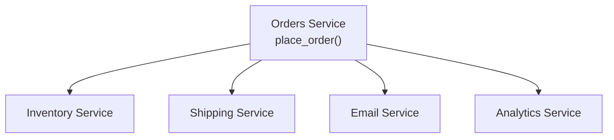

```python
def place_order(user_id, cart_id):
    order = create_order(user_id, cart_id)
    requests.post("http://inventory-service/decrement", ...)
    requests.post("http://shipping-service/create-shipment", ...)
    requests.post("http://email-service/send-confirmation", ...)
    requests.post("http://analytics-service/record-sale", ...)
    return order
```

This works. It also quietly recreates the coupling problem the first guide's split was supposed to solve — just one layer deeper.

---

## Chapter 2: Why the Obvious Way Breaks Down

### Symptom 1 — Orders Must Know About Every Consumer

Marketing wants to add a fifth thing: send a loyalty-points update whenever an order is placed. To do that, someone has to open Orders' code and add a fifth `requests.post(...)` line. **The Orders team is now a mandatory stop for every team that wants to react to an order being placed** — even though loyalty points has nothing to do with what Orders' actual job (saving the order) is.

### Symptom 2 — One Slow Consumer Blocks the Whole Request

If Analytics is having a bad day and takes 8 seconds to respond, the customer is sitting on a spinning checkout button for 8 seconds — for a step that has **nothing to do with whether their order succeeded.**

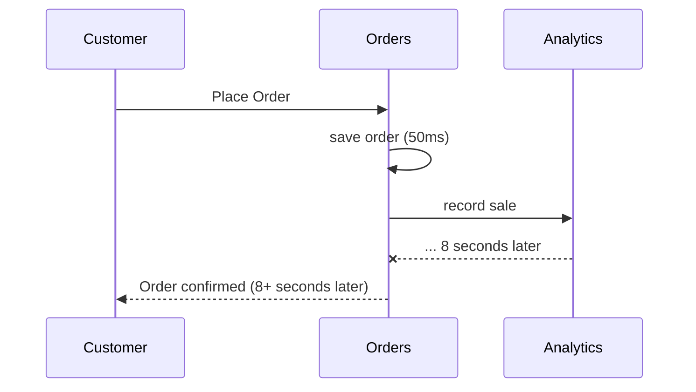

### Symptom 3 — Everyone Must Be Up, Right Now, at the Same Time

If the Email service happens to be mid-deployment when the order comes in, does the whole order fail? In the code above, an exception from that `requests.post` call to Email would need careful handling or it takes down the entire checkout — for a confirmation email that could just as easily be sent 30 seconds later.

This is called **temporal coupling** — every consumer must be available *at the exact moment* the producer acts, even though most of these follow-up actions don't actually need to happen instantly.

All three symptoms come from the same root cause: **Orders is directly calling out to services it shouldn't need to know exist.**

---

## Chapter 3: The Core Insight — Announce Facts, Don't Make Calls

The fix: Orders stops calling anyone. Instead, it announces a fact — **"an order was placed"** — to a middleman, and walks away. Anyone who cares about that fact can pick it up, whenever they're ready, without Orders ever knowing they exist.

This is **event-driven architecture.** The fact Orders announces is an **event** — a record of something that already happened (`OrderPlaced`, past tense — it's not asking anyone to do anything, it's just stating a fact). The middleman is a **message broker** (Kafka, RabbitMQ, AWS SQS/SNS) that reliably holds and delivers that fact to whoever subscribed to hear about it. Kafka is the broker interviewers bring up most often, and for good reason — LinkedIn built it in-house specifically to handle its own internal event pipeline at a scale no existing broker could handle, before open-sourcing it.

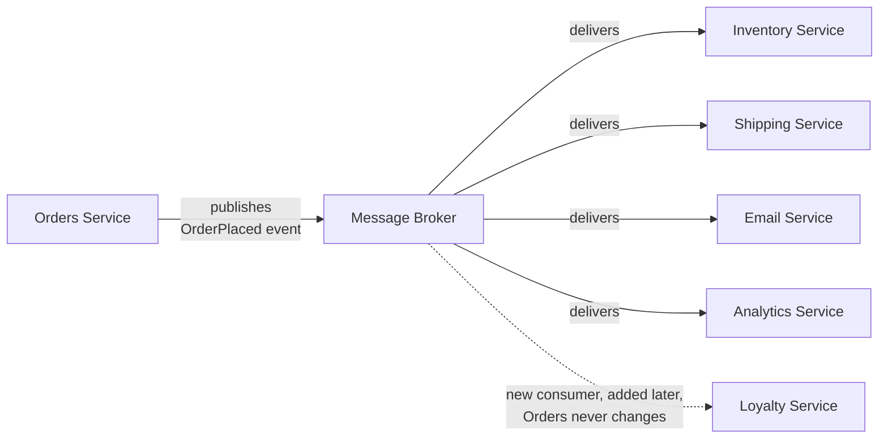

```python
def place_order(user_id, cart_id):
    order = create_order(user_id, cart_id)
    broker.publish("OrderPlaced", {"order_id": order.id, "user_id": user_id, "total": order.total})
    return order
```

Look at what changed: Orders' code got **shorter**, not longer, even though we added a consumer. Adding the Loyalty service later requires zero changes to Orders — Loyalty just subscribes to an event that was already being published. This directly answers Symptom 1. Uber runs on this exact pattern at a much larger scale: a trip's lifecycle — requested, matched, started, completed — is published as a stream of events, picked up independently by pricing, fraud detection, analytics, and notifications, none of which the trip service knows anything about.

---

## Chapter 4: How the Broker Actually Solves Symptoms 2 and 3

### Publishing Is Fire-and-Forget, Not a Blocking Call

Publishing an event to the broker is fast — you're handing a small message to a local, reliable component, not waiting on a network call to four different services. Orders confirms the order to the customer the instant the event is published, regardless of how long Inventory, Shipping, or Email take to actually process it.

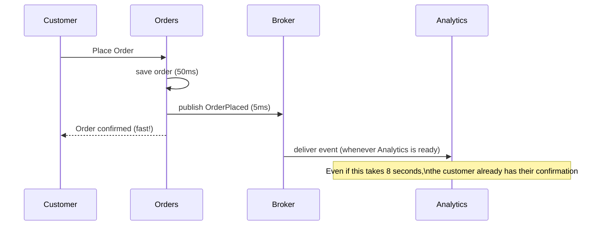

This solves Symptom 2 directly: a slow consumer only delays *that consumer's own work*, never the customer-facing request.

### Consumers Don't Need to Be Up at the Exact Moment

A message broker **holds** the event durably until each subscriber has processed it — that's its entire job. If the Email service is mid-deployment for 90 seconds, the `OrderPlaced` event just sits in the broker, waiting. The moment Email comes back up, it picks up where it left off and sends the confirmation, a little late but not lost.

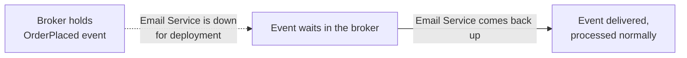

This solves Symptom 3: nobody has to be online at the same instant as anybody else.

### Two Delivery Shapes: Queues vs. Pub-Sub

There are two common ways a broker hands events to consumers, and they solve different problems.

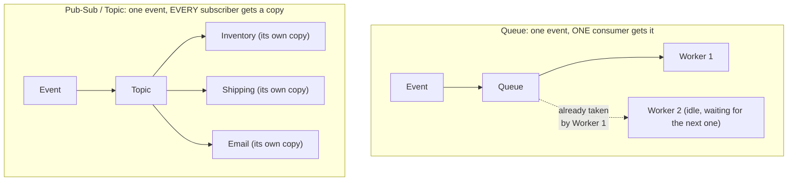

A **queue** is for distributing work across a pool of identical workers — you want exactly one worker to handle each task (like processing one payment). **Pub-sub** (publish-subscribe) is for fan-out — you want every interested party to get their own copy of the same fact, which is exactly our `OrderPlaced` scenario: Inventory, Shipping, and Email each need to react to the same event independently. Amazon's retail systems lean on this combination constantly: an SNS topic (pub-sub) fans a single event out to several SQS queues, one per interested team, so each team gets its own durable, independently-scaled queue of the same event — the standard "one event, many independent consumers" backbone across much of Amazon's backend.

### Scaling Consumers: Partitions and Consumer Groups

A single broker instance can't handle unlimited throughput on its own, so brokers like Kafka split a topic into **partitions** — parallel sub-streams of the same topic, each an ordered log in its own right. A **consumer group** is a set of consumer instances that split a topic's partitions between them, so each partition is handled by exactly one instance *within that group* — while a completely separate consumer group gets its own full copy of every event, at its own pace.

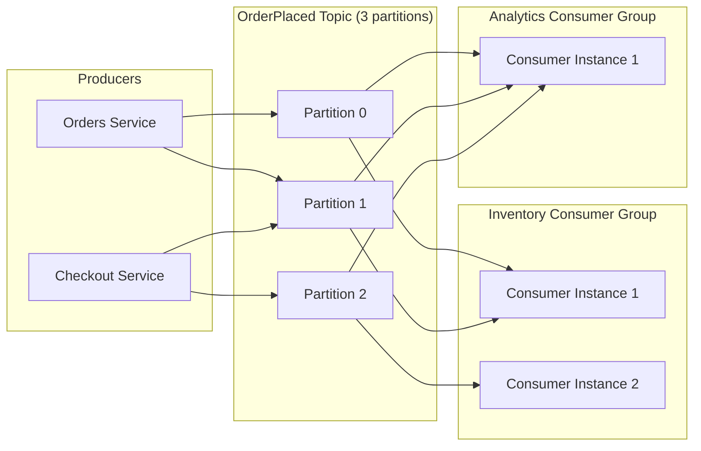

This is what makes "the broker delivers to every subscriber" concrete in a real system: within the Inventory Consumer Group, the 3 partitions are split across 2 consumer instances so the work scales horizontally, while the Analytics Consumer Group is a completely separate team getting its own full copy of the same 3 partitions, on its own hardware, at its own speed.

---

## Chapter 5: The Costs This Model Introduces

### Cost 1 — Eventual Consistency, Everywhere

The moment Orders confirms the order, Inventory hasn't decremented stock yet — it will, in a few milliseconds or a few seconds, once it processes the event. There's a real window of time where the system is **not yet consistent.** If someone checks the product page microseconds after the order, they might see stock that hasn't been decremented. This is the direct trade for Symptom 2's fix: you got a fast response by giving up the guarantee that everything is done by the time you get that response.

### Cost 2 — Delivery Isn't Always Exactly Once

Most brokers guarantee **at-least-once delivery** — meaning if anything goes wrong (a consumer crashes right after processing but before confirming receipt), the broker will redeliver the event rather than risk losing it. That means your consumer might see the same `OrderPlaced` event twice.

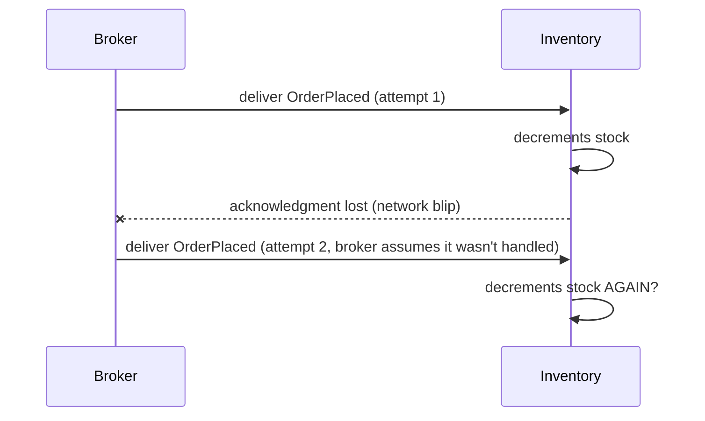

If your consumer isn't careful, stock gets decremented twice for one order. The fix is to make consumers **idempotent** — processing the same event twice produces the same result as processing it once (for example, by checking "have I already processed order #4471?" before decrementing, using the order ID as a deduplication key). This is not optional polish — it is a mandatory design requirement the moment you adopt at-least-once delivery, which is most brokers' default.

Here's that same duplicate delivery played out again, this time with the idempotency fix in place — Inventory checks a `processed_order_ids` dedup table before acting, so the redelivered event is recognized and skipped instead of decrementing stock a second time:

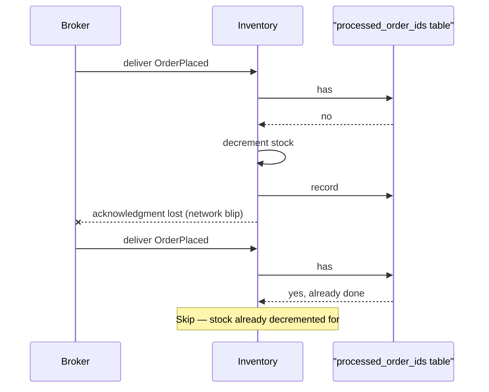

### Cost 3 — Ordering Isn't Free Either

If a customer places an order, then cancels it two seconds later, you need `OrderPlaced` to be processed before `OrderCancelled` — reversed, and Inventory would decrement stock for an order that's already cancelled. Brokers like Kafka guarantee order **only within a partition** (a sub-stream, usually one per entity — e.g., all events for a given order ID go to the same partition, in order). Get the partitioning key wrong, and you can silently lose ordering guarantees you assumed you had.

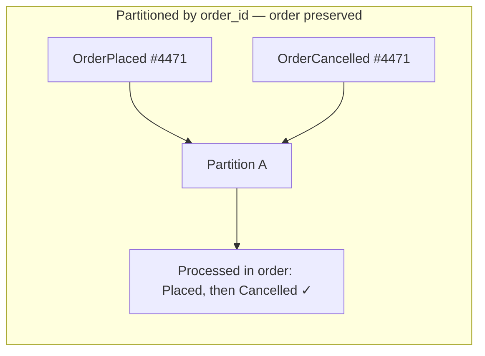

### Cost 4 — Debugging Loses the Thread Even More Than Microservices Did

The previous guide noted that microservices scatter a request's story across several logs. Event-driven systems make this worse: there's no synchronous call chain to trace at all. `OrderPlaced` might get picked up by Inventory nine seconds later, by Email eleven seconds later, each independently, with no single request ID connecting them unless you deliberately thread a **correlation ID** through every event and log line yourself.

### Cost 5 — Schemas Change, and Old Consumers Don't Know Yet

Six months in, someone adds a new field to `OrderPlaced` and renames `total` to `total_amount`. Every consumer that was reading `event["total"]` breaks — and because publishers and consumers are deployed independently (that was the whole point), you can't guarantee they upgrade at the same time. Event-driven systems need deliberate **schema versioning** — treating event shapes as a public contract that changes carefully, the same discipline you'd apply to a public API.

---

## Chapter 6: When Is This Worth It?

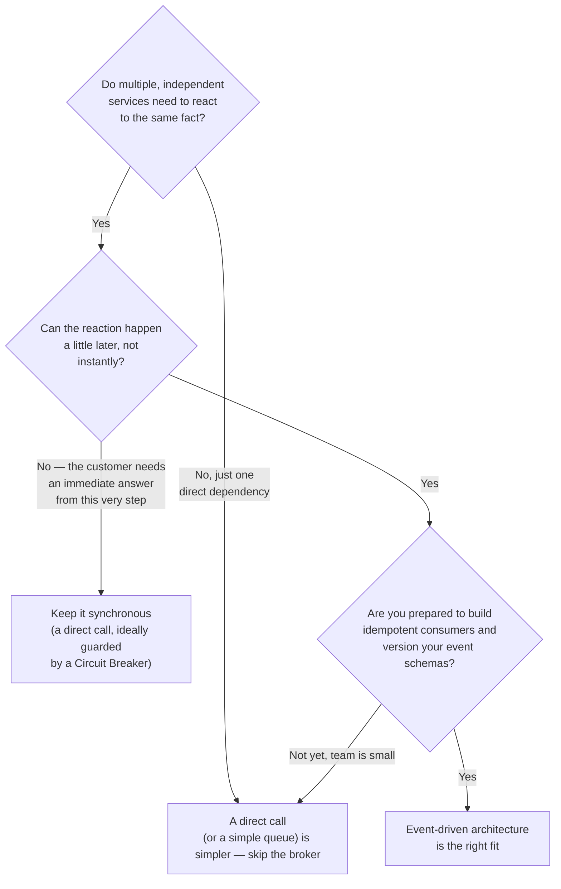

Good fits: anything where one fact needs to fan out to many independent, decoupled reactions — order placement, user signup, inventory changes, IoT sensor readings, activity feeds. Poor fits: a checkout step where the customer is staring at the screen waiting for a definite yes/no answer *right now* — that still wants a direct, synchronous call (protected by the Circuit Breaker pattern from later in this series), because "eventually consistent" isn't an acceptable answer to "did my payment go through?"

---

## The Full Story, End to End

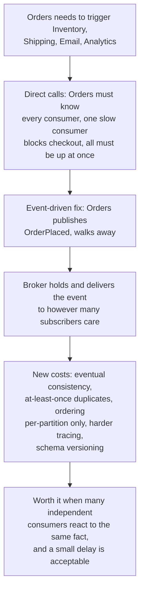

| | Direct Calls | Event-Driven |
|---|---|---|
| Producer knows about | Every consumer, by name | Nothing — just publishes a fact |
| Adding a new consumer | Requires changing the producer | Zero changes to the producer |
| Consumer downtime | Can break or delay the producer | Broker holds the event until consumer returns |
| Response latency | Sum of all consumer latencies | Just the publish, which is fast |
| Consistency | Immediate (if it succeeds) | Eventual — a delay is expected |
| Delivery guarantee | Exactly once (it's just a function call) | Usually at-least-once — requires idempotent consumers |
| Debugging | One traceable call chain | Scattered — needs correlation IDs, tracing |
| Best for | A step the caller needs an immediate answer from | Fan-out reactions that can tolerate a short delay |

**Where would you like to go next?** Natural threads from here:

- **CQRS** — how read models are often kept up to date precisely through the events this guide describes
- **Saga Pattern** — using this exact event backbone to coordinate a multi-step transaction across services, with compensations if a later step fails
- **Backpressure Handling in APIs** — what happens when publishers produce events faster than consumers can keep up with them
