## The Story of CQRS (Command Query Responsibility Segregation)

Back to the Catalog service. It has one job on paper: store products, and let people read them. One table, one model, one API. Simple — until you look at what "reading" and "writing" actually demand from that one model.

---

## Interview Cheat Sheet

**CQRS (Command Query Responsibility Segregation)** is the pattern of splitting a single system's write path and read path into two separate models — each shaped and scaled for its own job — instead of forcing one shared model to serve both.

**Good fit when:**
- Read traffic outnumbers write traffic by orders of magnitude (e.g., millions of shoppers browsing versus a handful of admins editing)
- The ideal read shape (denormalized, flattened, fast) looks nothing like the ideal write shape (normalized, validated, consistent)
- Reads and writes need to scale independently, or reads need to live in a fundamentally different kind of store (like a search index)

**Bad fit / overkill when:**
- It's a simple CRUD app with a handful of users and no real asymmetry between reads and writes
- Read and write volume and shape are roughly symmetric — there's no lopsidedness for CQRS to exploit
- The team can't yet absorb the operational cost of a sync pipeline plus two schemas to maintain

**The core trade-off:** you gain the ability to scale and shape reads and writes independently, at the cost of eventual consistency between the two models and roughly double the schema and code to maintain.

**Worth remembering by name:** CQRS is frequently paired with **Event Sourcing**, but they are two separate decisions — you can use either one without the other.

---

## Chapter 1: One Model, Two Very Different Jobs

Here's the Catalog service's product model, and its one database table:

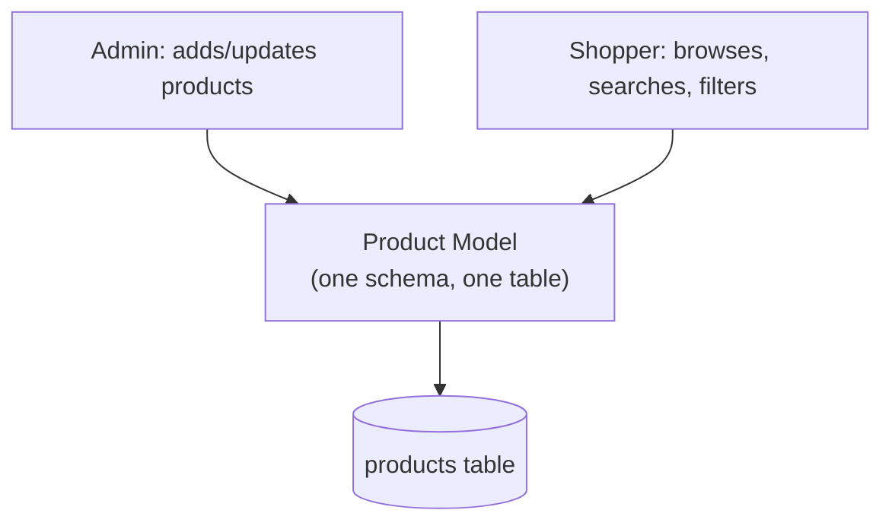

The **write side** — an admin adding a new product — needs: strict validation (price can't be negative, SKU must be unique), normalization (category stored as a foreign key, not duplicated text), and strong consistency (two admins can't create the same SKU at once).

The **read side** — a shopper browsing — needs something almost entirely different: full-text search across titles and descriptions, filters by five different facets (price range, brand, rating, in-stock, category) combined at once, sorting by popularity, and it needs to serve this to millions of requests a second, with the flexibility to add a new filter without an admin ever caring.

These are not small differences in emphasis. They are close to **opposite requirements** running through the exact same schema.

---

## Chapter 2: What Happens When You Force Both Through One Model

### Symptom 1 — The Schema That Serves Nobody Well

To make writes clean, you normalize: `products` table has a `category_id` pointing to a `categories` table. But now every search query needs a `JOIN` to show the category name. Add brand, add reviews summary, add stock-by-warehouse — now a single product listing page is joining five or six normalized tables, on every single request, for millions of shoppers a day.

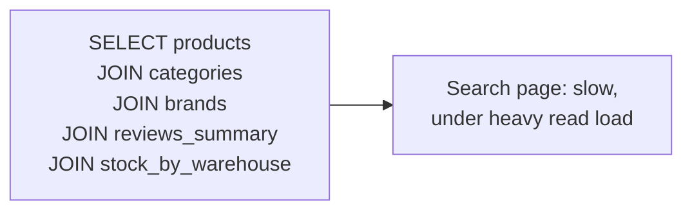

If instead you denormalize for read speed — flatten category name, brand name, and rating right onto the product row — writes get harder: now updating a category's name means updating it on every product row that references it, and you've reintroduced the very duplication normalization was meant to prevent.

**You cannot optimize one schema for both jobs. Every choice that helps one side hurts the other.**

### Symptom 2 — Read Load and Write Load Fight for the Same Resources

Product reads outnumber product writes by a factor of thousands to one — millions of shoppers browsing versus a handful of admins updating inventory. But because it's the same database, a burst of read traffic (a flash sale) can slow down the exact query an admin needs to update stock in real time, and vice versa — a bulk import job hammering writes can slow down the storefront for every shopper browsing at that moment.

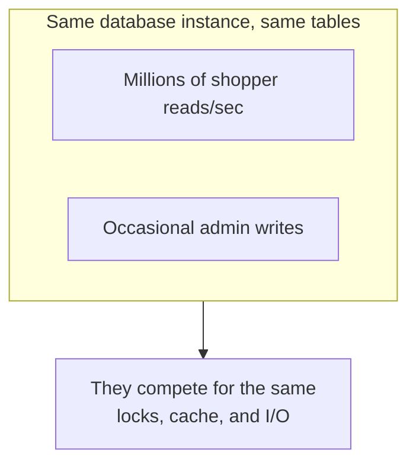

### Symptom 3 — Scaling Reads Means Scaling Writes Too, Whether You Need To or Not

Because it's one model on one database, scaling for the enormous read volume (say, adding read replicas) drags the entire schema along with it — including the complex validation and normalization logic that only the tiny sliver of write traffic ever needed.

---

## Chapter 3: The Core Insight — Split the Model in Two

**CQRS (Command Query Responsibility Segregation)** says: stop pretending reads and writes need the same model. Split them into two separate models, each free to be shaped exactly for its own job.

- A **command** is a request to change something ("add this product," "update this price"). Commands go through the **write model** — validated, normalized, consistent.
- A **query** is a request to read something ("show me products under $50 in Electronics"). Queries go through a completely separate **read model** — denormalized, flattened, built purely for fast retrieval in exactly the shape the UI needs.

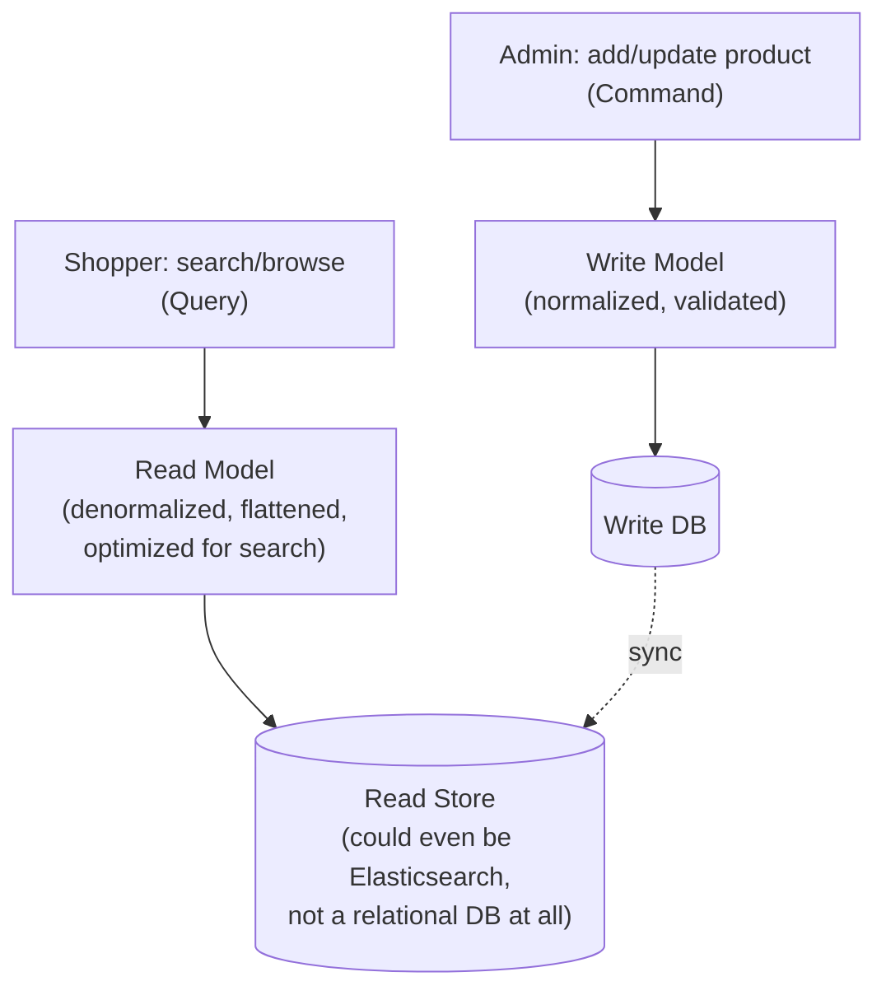

Notice the read store doesn't even have to be the same *kind* of database. Since it's not doing validation or transactions — just fast lookups — teams often put the read model in something purpose-built for search, like Elasticsearch, while the write model stays in a normal relational database that's good at enforcing rules.

This split shows up constantly once you know to look for it. Amazon's product catalog is a commonly cited real-world example: writes go through an inventory and catalog management system with strict validation, while search and browse traffic is served from a denormalized search index — conceptually similar to Elasticsearch — that's kept in sync asynchronously. Uber's dispatch and pricing systems separate the write path — driver location updates, trip state changes — from read-heavy query paths like surge-pricing lookups and ETA calculations, which need denormalized, fast-read data rather than the transactional shape writes require. Even a payment or banking system follows the same pattern: the write side enforces strict double-entry accounting validation (every debit has a matching credit), while the read side serves a denormalized "account statement" view built for fast display, not for re-deriving balances from raw ledger entries on every page load. In each case, the read and write shapes diverge for the same reason the Catalog service's do: the two jobs genuinely want different things from the data.

To make that divergence concrete, here's what the write model's schema and the read model's schema actually look like for the Catalog service:

**Write Model Schema (normalized):**

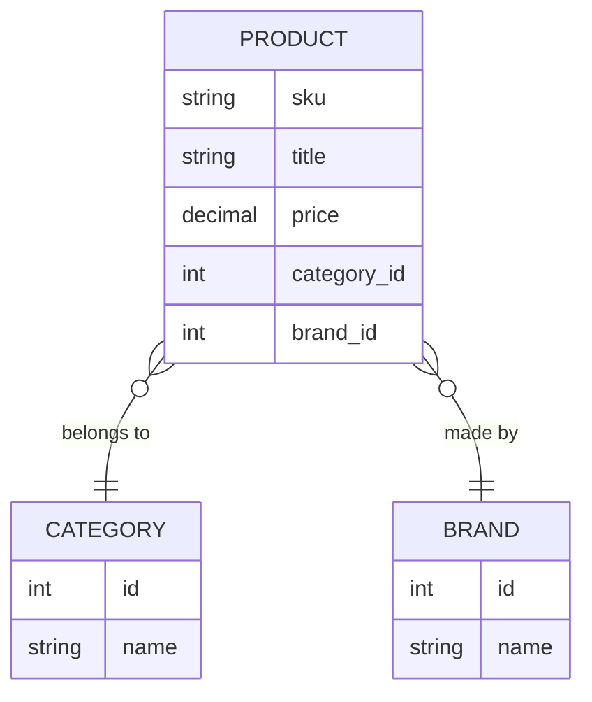

**Read Model Schema (denormalized):**

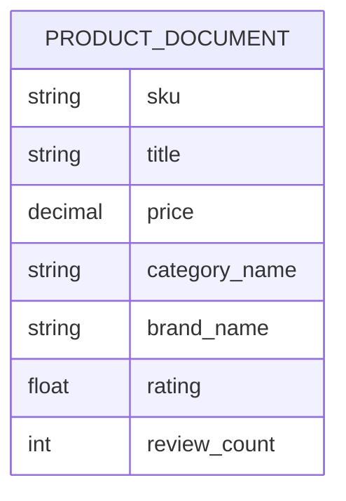

The write side keeps `category` and `brand` as separate entities so a rename happens in exactly one place. The read side flattens `category_name`, `brand_name`, and `rating` directly onto one document, so a shopper's search never needs a `JOIN` — it needs one lookup.

---

## Chapter 4: How the Two Models Stay in Sync

The write model is the source of truth. The read model is a copy, shaped for reading, and it needs to be kept up to date whenever the write model changes. The most common way to do that connects directly to the previous guide: **the write side publishes an event every time something changes, and the read side consumes those events to update its own copy.**

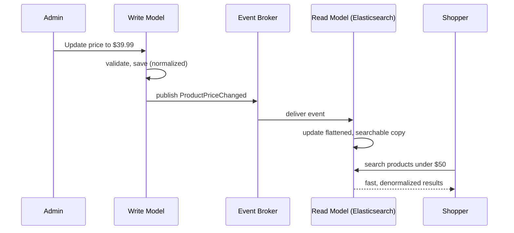

This is the exact same event-driven mechanism from the previous guide, now used for a very specific purpose: **propagating a single source of truth out to one or more read-optimized copies**, instead of fanning out to independent business reactions like Email or Shipping.

### The Query Path Never Touches the Write Model At All

This is the part that actually delivers the performance win. A shopper's search request never runs against the normalized write database — it goes straight to the denormalized read store, which was built exactly for this kind of question and doesn't need a single `JOIN`.

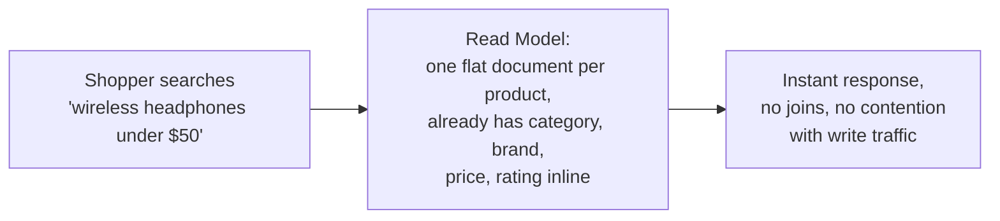

---

## Chapter 5: The Cost — You Just Gave Up Instant Consistency

### Cost 1 — The Read Side Lags Behind

Between an admin saving a price change and the read model finishing its update, there's a real window — often milliseconds, sometimes longer under load — where a shopper searching sees the **old** price. This is the same eventual consistency trade-off from the previous guide, now showing up as a very concrete, very visible bug report: *"I just updated the price, why does the site still show the old one?"*

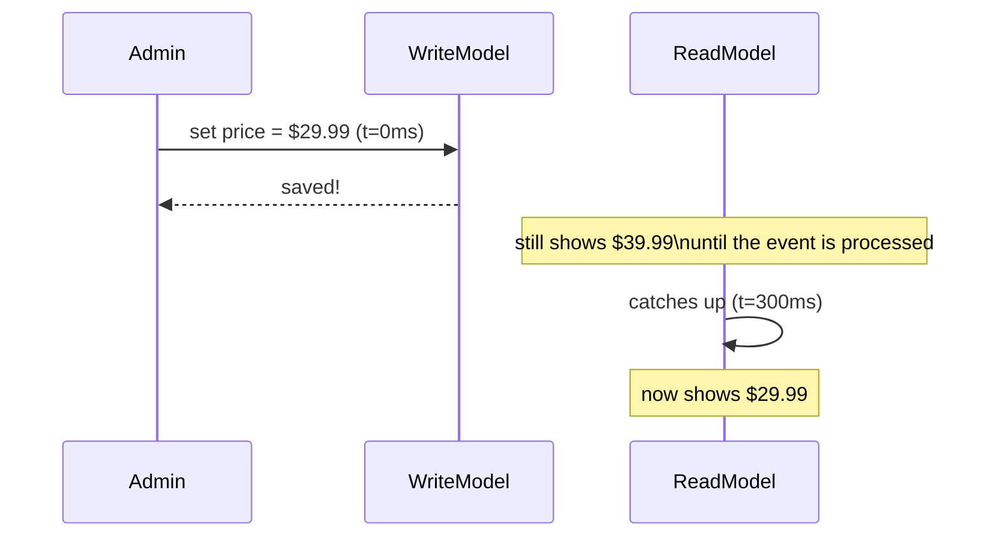

Teams using CQRS have to decide, deliberately, how much lag is acceptable, and where. For a product catalog, 300 milliseconds is invisible to a human. For an admin's own "did my edit save?" confirmation screen, you often route that one specific read straight to the write model instead — reading your own recent write directly, rather than waiting for the read model to catch up.

Here's that fix in action — the same moment, two different readers, two different routes:

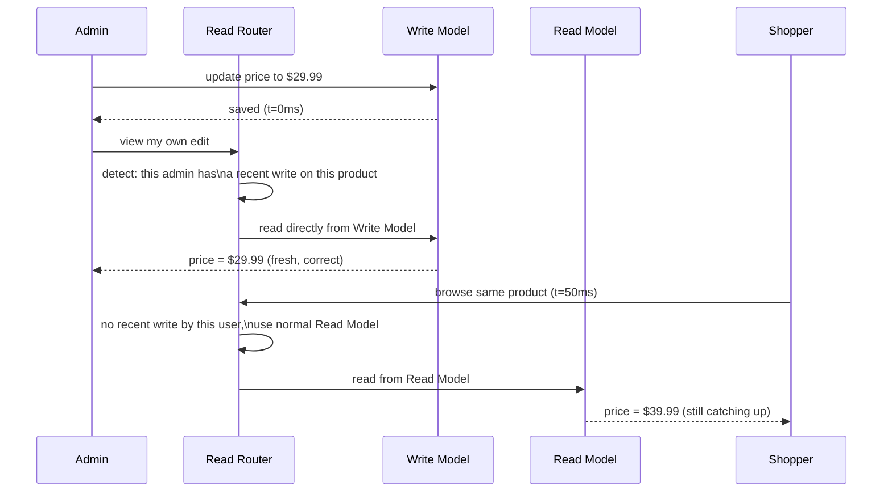

The admin gets their own change reflected instantly, without the whole system giving up eventual consistency everywhere else — every other shopper still reads from the fast, denormalized Read Model, and still sees the small, usually-invisible lag described above.

### Cost 2 — Two Models Means Twice the Code to Maintain

Every field you add to a product now potentially needs updating in two places: the write model's schema and validation, and the read model's projection logic. For a simple CRUD app — a small internal tool with a handful of users and no meaningful read/write asymmetry — this doubling of effort buys you nothing, because there was no actual conflict between read and write needs to begin with.

### Cost 3 — More Moving Parts, More Ways to Fail

The sync mechanism between write and read models is itself a system that can break — an event gets dropped, a consumer falls behind, a schema change on the write side isn't reflected on the read side. You've added an entire pipeline (the same eventual-consistency and idempotency concerns from the previous guide) purely in service of keeping two copies of the same information aligned.

---

## Chapter 6: When Is Splitting the Model Actually Worth It?

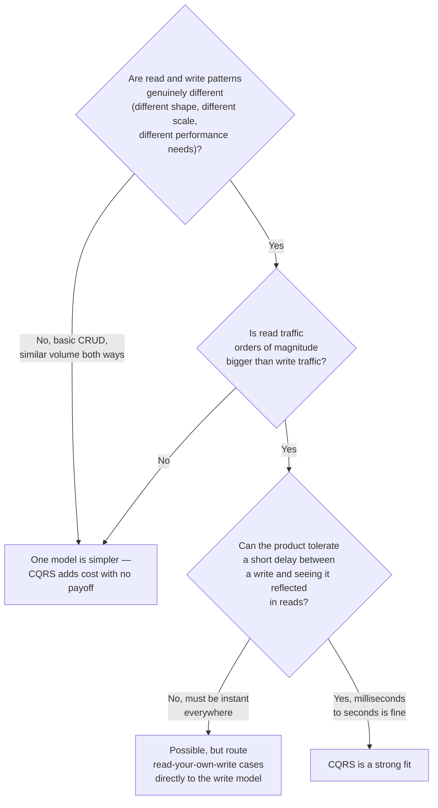

Good fits: product catalogs, search-heavy systems, dashboards aggregating data from many sources, social feeds — anywhere read volume dwarfs write volume and the ideal read shape looks nothing like the ideal write shape. Poor fits: an admin settings page with a handful of users, a simple form-backed CRUD tool, anything where reads and writes are roughly symmetric in both volume and shape — there's no asymmetry here for CQRS to exploit, only extra code to maintain.

One more thing worth knowing by name, so you recognize it later: CQRS is frequently paired with **Event Sourcing** — where instead of storing just the current state, you store the full sequence of events that led to it (every price change ever, not just the current price), and rebuild any view — including the read model — by replaying them. CQRS does not require event sourcing, and event sourcing does not require CQRS, but they show up together often enough that it's worth knowing they're two separate decisions, not one.

---

## The Full Story, End to End

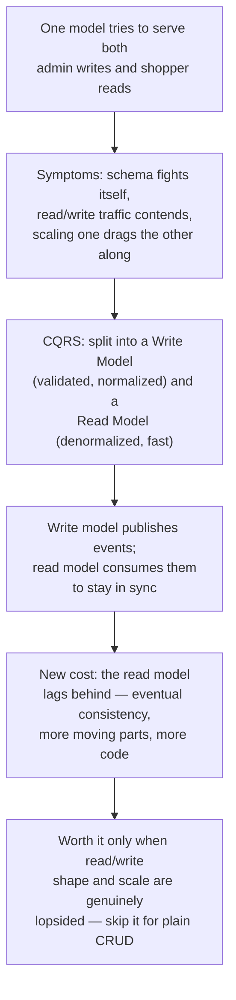

| | Single Shared Model | CQRS (Split Models) |
|---|---|---|
| Write path | Same model as reads | Dedicated, normalized, validated |
| Read path | Same model as writes | Dedicated, denormalized, fast |
| Consistency | Always immediate | Read side lags — eventual |
| Scaling | Read and write scale together | Scale each side independently |
| Code to maintain | One model | Two models + a sync mechanism |
| Best for | Simple CRUD, symmetric read/write | Read-heavy, asymmetric shape needs |

**Where would you like to go next?** Natural threads from here:

- **Saga Pattern** — coordinating writes across multiple services when a single command needs to touch more than one of them
- **Event-Driven Architecture** (previous guide) — the exact mechanism that usually keeps a CQRS read model in sync with its write model
