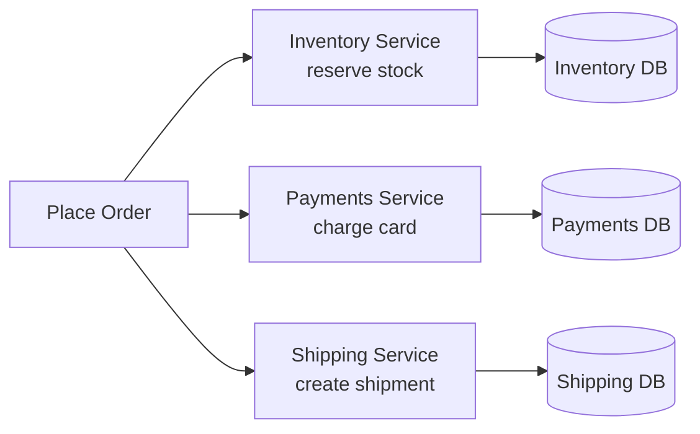
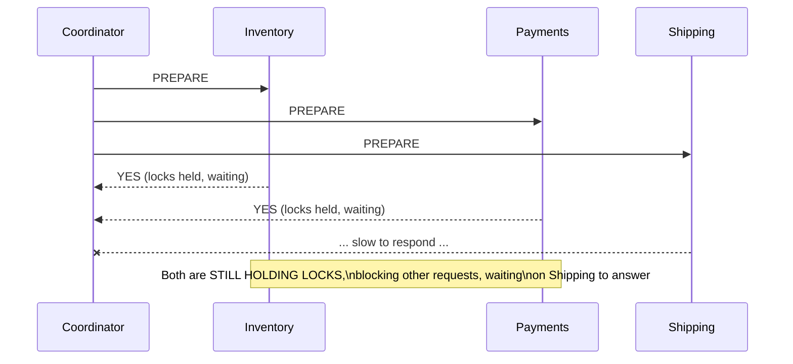
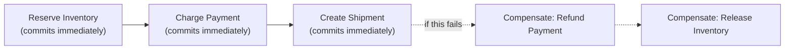
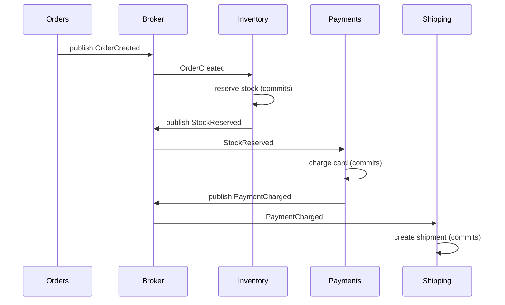
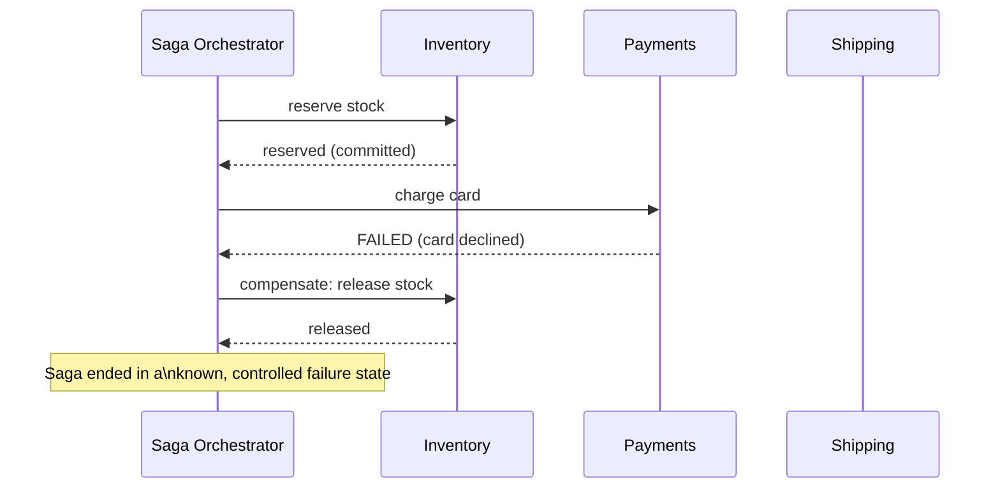
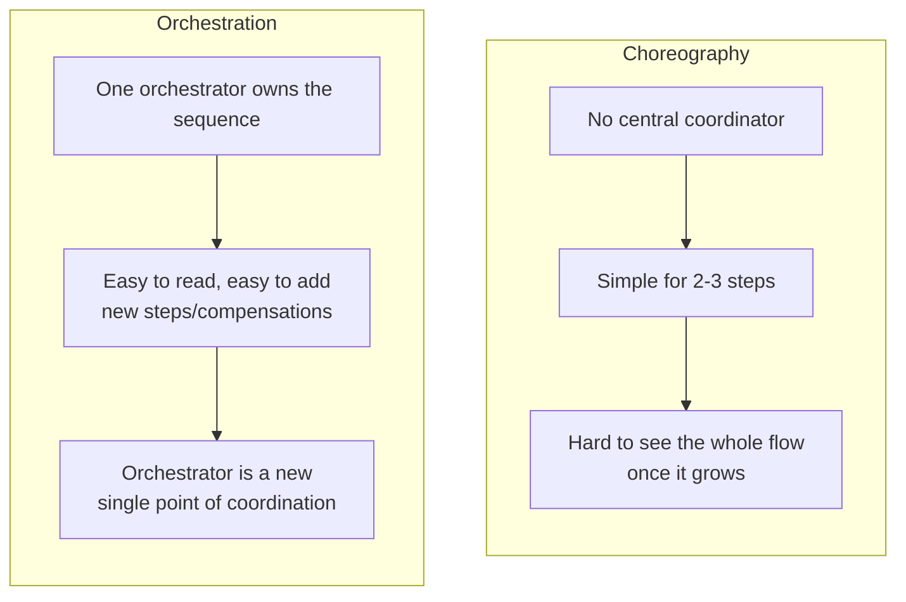
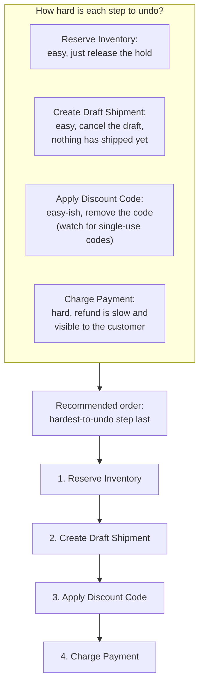
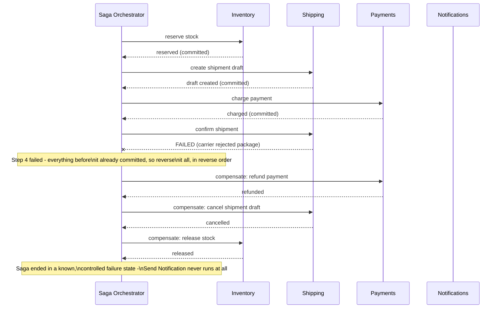
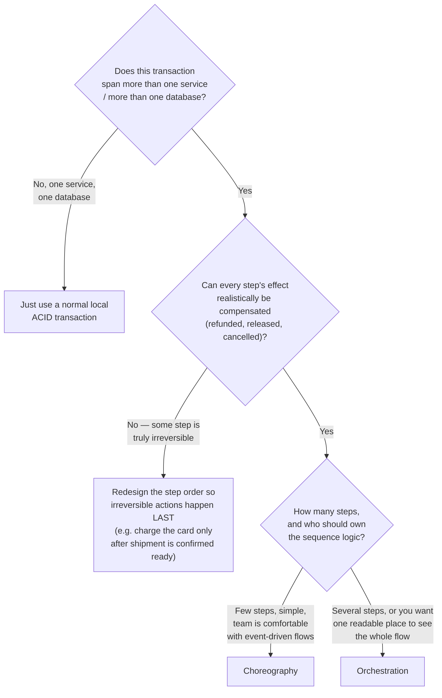
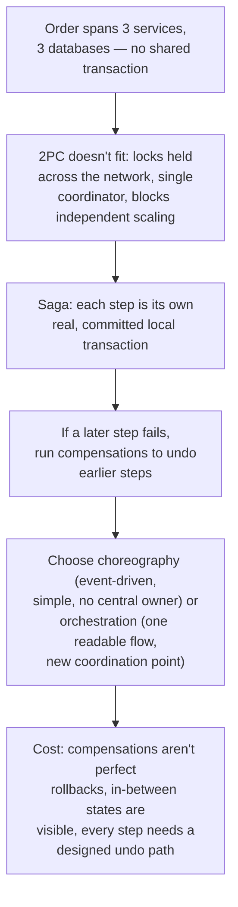

## The Story of the Saga Pattern for Distributed Transactions

The very first guide in this series left a thread dangling: when the bookstore split into microservices, it lost the one free thing a monolith gives you — **one transaction spanning the whole operation.** This guide picks that thread back up and resolves it.

---

## Interview Cheat Sheet

**The Saga pattern** keeps a business transaction consistent across multiple services by replacing one big all-or-nothing lock with a sequence of small, real, committed local transactions, each paired with a **compensating action** (a separate transaction that undoes an earlier one's effect) to run if a later step fails.

**Good fit when:**
- The transaction spans multiple services/databases that each need to keep operating and scaling independently.
- Every step's effect can realistically be compensated — refunded, released, cancelled.
- The team can tolerate other parts of the system seeing an in-progress, not-yet-finished state.

**Bad fit when:**
- Everything fits inside one service, one database — a normal local ACID transaction is simpler and free.
- A step is truly irreversible and can't be reordered to run last (a package already handed to a courier, an email already sent).
- The business genuinely cannot tolerate any visible in-between state, or needs a hard guarantee instead of an eventual, compensated one.

**Core trade-off:** you give up true, hidden-until-commit atomicity and cross-service locking — in exchange for full service independence, an *approximate* atomicity built from compensations, and in-between states that are visible to the rest of the system.

**Quick recall:** order the saga's steps so the hardest-to-undo action happens last.

---

## Chapter 1: The Transaction That No Longer Fits in One Box

Placing an order now touches three independent services, each with its own database: **Inventory** (reserve the stock), **Payments** (charge the card), **Shipping** (create the shipment).

In the monolith, this was one `BEGIN ... COMMIT` block — either all three happened, or none did, guaranteed by the database engine. Now, there is no database engine that spans all three. If Inventory's reservation succeeds and Payments' charge succeeds but Shipping then fails, you have a paid, reserved order with no shipment — a state that was **structurally impossible** before, and now has to be handled deliberately.

---

## Chapter 2: The First Instinct — Just Force a Distributed Transaction

The obvious idea: use a protocol that makes all three services commit or abort together, the same way a single database does internally. That protocol exists — it's called **Two-Phase Commit (2PC)**, and it's covered in full technical depth in [`database/DistributedTransactions/README.md`](../database/DistributedTransactions/README.md) in this repository. The short version, enough to understand why it doesn't fit here:

2PC requires every participant to hold its locks — blocking other work — from the moment it says "yes" until the coordinator finally tells everyone to commit or abort. Across a network, with independently owned, independently scaled services, that means: a central coordinator that everyone depends on (a single point of failure), locks held across a network round-trip (slow, and fragile if any one participant is slow or down), and services no longer able to operate independently — the exact coupling this whole series has been trying to remove since the first guide. **2PC was designed for machines in the same data center under one operator's control. It doesn't hold up well across independently-deployed microservices owned by different teams.**

---

## Chapter 3: The Core Insight — Don't Lock. Do It, and Undo It If Needed.

The alternative, and the one that actually works at microservices scale: give up on a true all-or-nothing lock, and instead do each step as its own small, real, committed transaction — and if a later step fails, **run a compensating action** that undoes the effect of the earlier steps.

This sequence of local transactions, each with a matching undo action, is a **saga**.

Nothing is held open waiting for permission. Inventory's reservation genuinely commits the moment it happens — it's real, visible, and done. If a later step fails, you don't roll back a lock that was never held; you run a **new**, separate transaction whose entire purpose is to undo the earlier one's effect (release the reservation, refund the charge). This is the trade at the heart of the pattern: **you give up true atomicity, and get independence and no cross-service locking in return.**

---

## Chapter 4: Two Ways to Run a Saga — Choreography and Orchestration

### Choreography — Each Service Reacts to the Last One's Event

This connects directly to the Event-Driven Architecture guide: each service does its local transaction, then publishes an event; the next service in line is simply subscribed to that event and reacts to it. No one is in charge — the sequence emerges from who's listening for what.

This is simple to start with — no new component to build, just events and subscribers. It gets hard to reason about once you have six or seven steps: the actual sequence of "what happens after what" is scattered across every service's event handlers, and there's no one place to read it end to end.

### Orchestration — One Component Directs Every Step

The alternative: a dedicated **saga orchestrator** that explicitly calls each service in order, and explicitly calls the matching compensation if something fails.

The whole sequence — including every compensation — lives in one place, in code you can actually read top to bottom. The trade-off: the orchestrator now knows about every service in the flow, which is a bit of the coupling the first guide moved away from — though notably, it's coupling contained to *one component whose entire job is coordination*, not spread across every business service's code.

This isn't just a whiteboard idea. **Netflix built and open-sourced Conductor**, a **workflow orchestration engine** (software that plays the same role as the saga orchestrator above, but built to run and track thousands of workflows at once) specifically to manage orchestration-based sagas across its microservices — content ingestion and encoding pipelines with many steps, each with defined rollback and retry behavior. Uber's trip-booking flow is a real saga too: match a driver, calculate the fare, authorize payment, send a notification — and if payment authorization fails, Uber runs a compensation that releases the matched driver back into the available pool, the exact same idea as releasing reserved inventory above.

### Deciding the Order: Which Step Goes Last?

There's a trick worth seeing concretely here — it comes back in Chapter 6, but it's easier to internalize with an example: rank each candidate step by how hard it would be to compensate, then order the saga so the hardest one runs last.

---

## Chapter 5: The Cost — Compensations Are Not Real Rollbacks

### Cost 1 — You Can't Always Truly Undo Something

A database rollback is perfect — it's as if the write never happened. A compensating transaction is not that. If Shipping already printed a shipping label and handed the package to a courier before the saga fails at a later step, you cannot "un-hand" the package to the courier. The compensation becomes "intercept the package" or "issue a return," which is a real-world business process, not a clean database undo. **Compensations only work if you design each step to have a realistic, defined undo action — and some actions, once done, genuinely don't have a clean one.**

### Cost 2 — Other Transactions Can See the In-Between State

Because each step commits for real and immediately, there's a window where the saga is only partially done — inventory is reserved, payment hasn't happened yet — and any other process reading that data right now sees this half-finished state. In a single database transaction, nobody outside sees any of it until the whole thing commits. In a saga, the in-between states are real and visible, and other parts of your system need to be written with that in mind (for example, "reserved but not yet paid" inventory should probably still count as unavailable to other shoppers, even though the saga hasn't finished).

### Cost 3 — You Must Design a Compensation for Every Step, Up Front

Every step in the saga needs its undo counterpart designed and built *before* you need it in production — and thinking through every possible failure point, for every step, in every order they could occur, is real design work that a single ACID transaction gave you for free.

### Cost 4 — Testing Every Failure Combination Is Genuinely Hard

With three steps, there are already several distinct places a saga can fail (fail at step 1, fail at step 2 after step 1 committed, fail at step 3 after both committed, fail *during* a compensation itself). Each of these needs its own test. This complexity grows with every step you add to the saga.

### Seeing It at Five Steps

The three-step example earlier only needed to undo two prior steps. Here's what the same idea looks like with five steps, where the failure happens later and there's more to unwind — order placed, stock reserved, a shipment draft created, payment charged, and now the shipment needs to be confirmed with the carrier before a notification goes out:

Notice the order of the undo: step 3 (payment) is compensated first, then step 2 (shipment draft), then step 1 (inventory) — the exact reverse of the order they committed in. Step 5, Send Notification, never runs, because the saga never got there.

---

## Chapter 6: When Do You Reach for a Saga?

A practical trick worth internalizing: **order your saga's steps so the hardest-to-undo action happens last.** Reserving inventory and creating a draft shipment are both easy to reverse. Charging a customer's card is the hardest to cleanly undo (refunds are possible, but they're never invisible to the customer, and they take days to process). Put the payment charge as the last step, after everything else has already succeeded, and you dramatically shrink the number of scenarios where you need a compensation at all.

---

## The Full Story, End to End

| | Single DB Transaction | Saga |
|---|---|---|
| Atomicity | True — all or nothing | Approximate — via compensations |
| Locking | Locks held until commit | No cross-service locks held |
| Visibility of in-progress state | Hidden until commit | Visible — other reads can see partial progress |
| Failure recovery | Automatic rollback | Explicit compensating transactions you must design |
| Coordination | The database engine | Choreography (events) or Orchestration (a coordinator) |
| Best for | One service, one database | A business transaction spanning multiple services |

**Where would you like to go next?** Natural threads from here:

- **Circuit Breaker Pattern** — protecting each individual step's network call within a saga from a slow or failing dependency
- **Event-Driven Architecture** (earlier guide) — the exact mechanism choreography-based sagas are built on
- **Distributed Transactions deep dive** — the full 2PC, three-phase commit, and consensus-algorithm story, in [`database/DistributedTransactions/README.md`](../database/DistributedTransactions/README.md)
