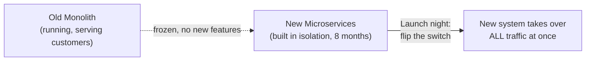
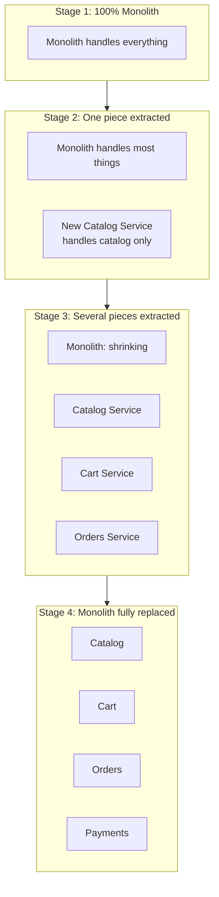
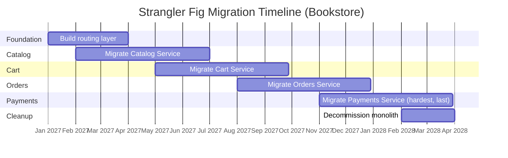
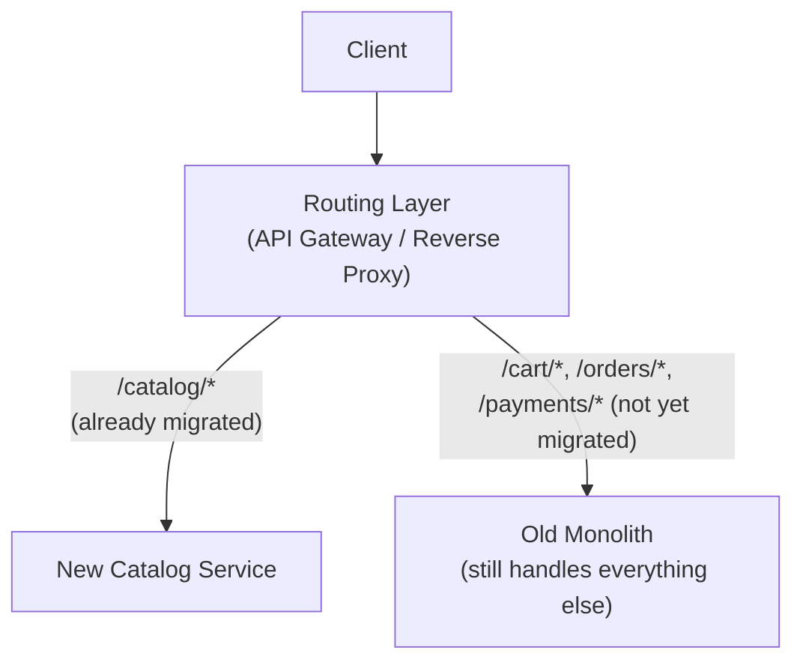
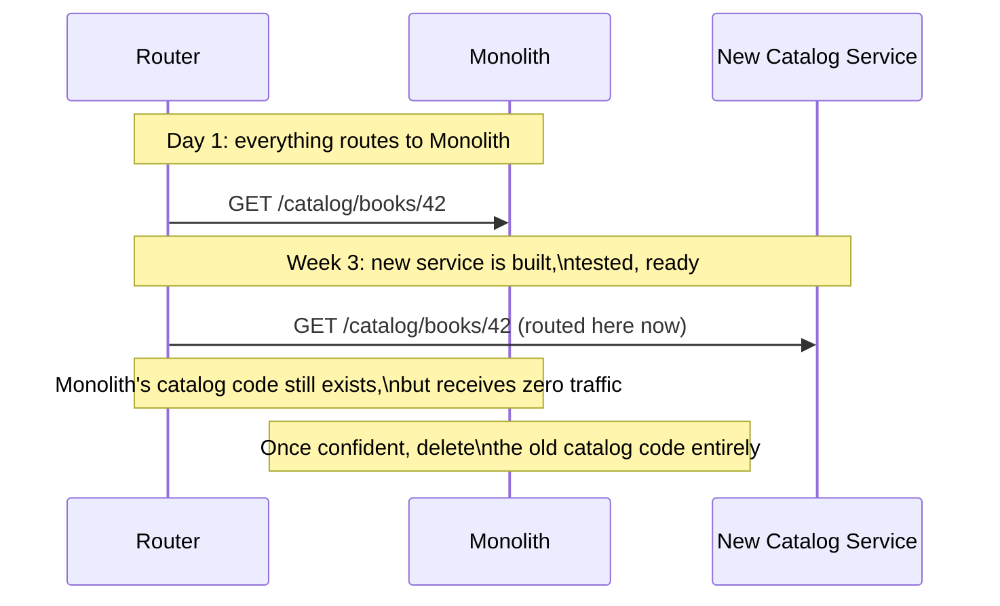
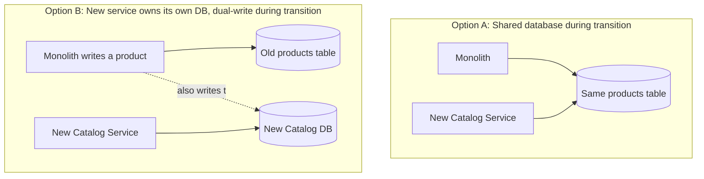
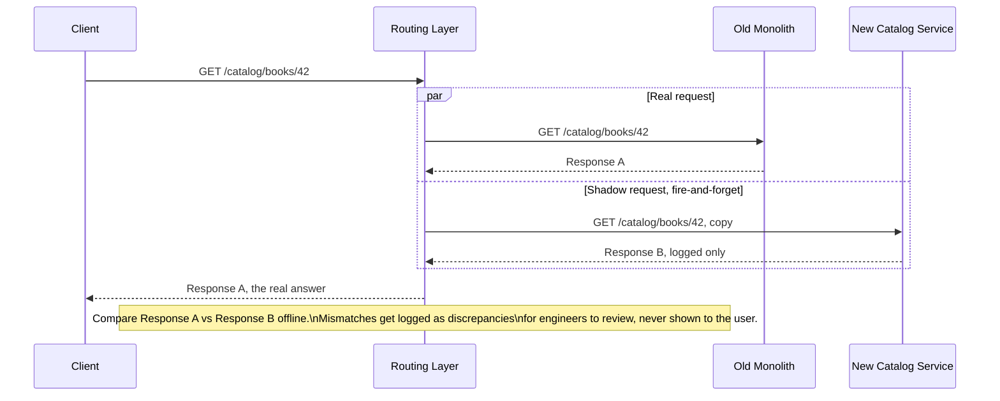
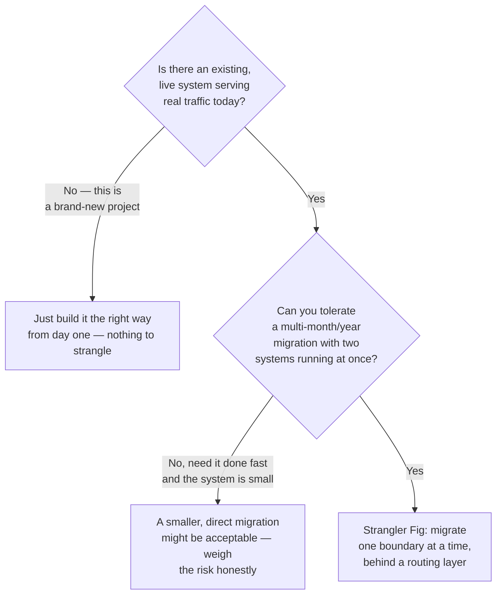
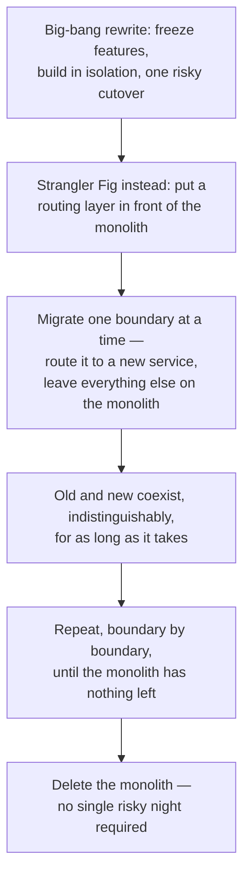

## The Story of the Strangler Fig Pattern

Every guide so far has assumed the bookstore's split into microservices already happened. This guide is about the part nobody shows you: **how do you actually get from the monolith to there, on a system that real customers are using every single day, without ever turning it off?**

---

## Interview Cheat Sheet

**Strangler Fig Pattern**: gradually replace a legacy system by routing individual pieces of its functionality to new services one boundary at a time, until the old system has nothing left to do and can be deleted — named after a vine that grows around a host tree and slowly takes over its structural support until the original tree is gone and the fig stands on its own.

**Good fit when:**
- There's a live, business-critical monolith serving real traffic today that you can't afford to freeze or cut over all at once.
- You can put a routing layer (API gateway / reverse proxy) in front of it to redirect traffic boundary by boundary.
- The organization can sustain a multi-month-to-multi-year migration without the effort losing momentum halfway through.

**Bad fit when:**
- It's a greenfield project with no existing system to strangle — just build it right from day one.
- The system is small enough that a direct, one-shot migration is genuinely lower risk than running two systems side by side.
- The team can't commit sustained engineering attention for the full migration — a half-finished strangler fig leaves you maintaining three systems instead of one (see Cost 2 below).

**Core trade-off:** you trade low per-step risk and no feature freeze for the burden of running two systems — and keeping their data in sync — in parallel for a long time, with the real danger that the migration stalls partway and never actually finishes.

---

## Chapter 1: The Tempting, Terrible Idea — Just Rewrite It

Ten years in, the bookstore's monolith is showing its age. The obvious-sounding plan: freeze the old system, spend eight months building a clean microservices version from scratch, then do one big cutover on launch night.

This has a well-known name in industry lore: **"the big rewrite,"** and it has a well-known failure rate. Netscape famously spent about three years rewriting its browser from scratch in the late 1990s — during which competitors shipped continuously and Netscape's market share collapsed. The rewrite eventually shipped, but the company that needed it no longer existed in the same form by the time it did.

There are three concrete reasons this specific plan tends to fail, not just bad luck:

**It freezes feature work for months.** While the new system is being built, the business still needs the old one to keep evolving — new promotions, bug fixes, seasonal features. Either you freeze the old system (falling behind competitors) or you keep changing it (meaning the new system, built against yesterday's requirements, is already out of date by the time it ships).

**Requirements move while you're not looking.** Eight months of "we'll match the old behavior exactly" turns into "wait, did the old system actually work like that, or like this?" — because nobody wrote it all down, and the one place that knowledge lived was the old code, which you stopped closely reading the day you started the rewrite.

**The cutover is one enormous, all-or-nothing bet.** Every bug, every missed edge case, every subtle behavior difference between old and new surfaces **all at once, in production, for every customer, at the same time** — on the one night you have the least ability to quietly roll part of it back.

---

## Chapter 2: The Core Insight — Grow the New System Around the Old One

The fix takes its name from an actual tree. A **strangler fig** starts as a vine wrapped around a host tree. Over years, it grows thicker, sends down its own roots, and gradually takes over structural support — until eventually the original tree can be entirely gone, and the fig stands on its own, having never needed a moment where the whole forest held its breath.

Applied to software: instead of rewriting everything at once, you **intercept traffic for one small piece of functionality at a time, redirect just that piece to a brand-new service, and leave everything else running exactly as it was on the old monolith.** Ship that one piece, watch it in production, learn from it, then take the next piece. Repeat until the monolith has nothing left to do — at which point you delete it, and nobody notices the day it happened, because it happened gradually, in the open, in production, over many small and individually low-risk steps.

Here's what that gradual, boundary-by-boundary schedule might actually look like on a calendar, for the bookstore — note how each service's migration window overlaps the next, because you start building confidence in the next boundary before the current one is fully done:

Notice Payments comes last, not first — it's usually the most tangled part of the monolith (money, refunds, fraud checks, third-party integrations), so teams typically save it until they've built confidence on lower-stakes boundaries first.

---

## Chapter 3: The Mechanism — A Routing Layer That Knows Who's in Charge of What

The piece that makes this possible is a thin routing layer sitting in front of both the old and new systems — usually the same API gateway or reverse proxy already covered in the Networking section of this series (Nginx, Envoy). It looks at each incoming request and decides: **has this piece already been migrated, or does it still belong to the monolith?**

From the outside — from the customer's browser — nothing looks different at all. Same domain, same URLs, same behavior. The only thing that changed is which system, behind the scenes, actually answers a `/catalog/*` request. This is the entire trick: **the routing layer lets old and new coexist, indistinguishably, for as long as the migration takes.**

### Walking Through One Migration, Step by Step

Crucially, you don't delete the monolith's old catalog code the moment you flip the route — you leave it there, unused, for a while, as a safety net. If something goes wrong with the new service, flipping the route back is a one-line config change, not an emergency rewrite. Only once the new service has proven itself in production do you go back and remove the dead code from the monolith.

---

## Chapter 4: The Part Everyone Underestimates — The Data

Routing HTTP requests is the easy part. The hard part: for a while, **both the old monolith and the new Catalog service need to agree on the same underlying product data**, because other parts of the still-running monolith (say, the Cart, which hasn't been migrated yet) still need to read product details too.

Sharing the database is the simpler starting point but re-creates exactly the coupling the first guide's split was meant to remove — the new service isn't really independent yet, it's just a new process pointed at the old shared table. Dual-writing (writing every change to both the old and new stores during the transition) gets you real independence sooner, but it's genuinely fiddly — you now have two copies of the truth that must be kept in sync, and any bug in the dual-write logic means the two copies quietly drift apart.

---

## Chapter 5: The Cost — This Takes Discipline to Actually Finish

### Cost 1 — You're Running (and Paying For) Two Systems at Once

For the whole migration period — which is often measured in months or years, not weeks — you have both the shrinking monolith and the growing set of new services in production simultaneously, each needing monitoring, on-call coverage, and security patches. This is real, sustained overhead that a big-bang rewrite (for all its risk) at least avoids.

### Cost 2 — The Migration Can Stall, Forever

This is the most common real-world failure mode, and it's a quiet one rather than a dramatic one: a team migrates the easy 80% of the monolith, momentum fades, priorities shift, and the last 20% — usually the gnarliest, most tangled, most business-critical part — never gets extracted. You end up maintaining **three** systems indefinitely: the new services, the old monolith's remnant, and the routing layer holding them together — which is more operational surface than either the pure monolith or the pure microservices architecture would have been on its own.

### Cost 3 — Keeping Two Data Copies in Sync Is Real Engineering Work

Whichever data strategy from Chapter 4 you pick, it needs active engineering attention for the full duration of the migration — it is not a "set it up once and forget it" concern. A bug in the sync logic doesn't crash loudly; it corrupts data quietly, and you often don't find out until a customer notices a wrong price or a missing order.

### Cost 4 — You Need Confidence That Old and New Actually Agree

Before flipping a route, you want strong evidence the new service behaves the same as the old one for real traffic — not just your test suite. A common technique is to route a request to *both* systems, serve the old system's response to the actual user, but compare it against the new system's response in the background (sometimes called **shadow traffic** or a **parallel run**) — building confidence before the new system ever serves a real user.

The user only ever sees Response A — the monolith's answer. Response B never reaches them; it's captured purely so engineers can compare the two and catch discrepancies before trusting the new service with real traffic.

---

## Chapter 6: When Do You Reach for This?

This pattern only makes sense when there's a live system to strangle. It's the de-risking answer to exactly the situation the first guide in this series ended on: a monolith that has earned its keep, has real customers depending on it, and needs to become microservices without a risky one-shot cutover. Netflix, Amazon, and most large tech companies that are microservices-based today got there this way — gradually, boundary by boundary, over years — not through a single rewrite weekend.

Two real, well-documented examples make this concrete rather than theoretical. The Guardian newspaper spent several years moving theguardian.com off a monolithic Java application, migrating one section of the site at a time behind a routing layer — a frequently cited real-world strangler fig case study, with no single big-bang cutover. Amazon's own original bookstore application went through the same gradual process after its internal 2002 API mandate (the same mandate this series' first guide, Monolithic vs. Microservices Architecture, traces back to): teams peeled functionality out from behind stable APIs over years, one boundary at a time, arriving at the service-oriented architecture that today underpins AWS — not through a rewrite weekend, but exactly the pattern this chapter describes.

---

## The Full Story, End to End

| | Big-Bang Rewrite | Strangler Fig |
|---|---|---|
| Risk per step | One giant, all-at-once bet | Many small, individually reversible bets |
| Feature freeze | Usually required on the old system | Not required — old system keeps evolving |
| Rollback | Extremely hard once cut over | Flip one route back |
| Data | One big migration at the end | Ongoing sync during the transition |
| Duration | Fixed (in theory) | Open-ended — can stall if momentum fades |
| Operational load | Low, then a single spike of risk | Sustained — two systems running in parallel |
| Best for | Rarely — high risk, low success rate | Migrating a live, business-critical monolith |

**Where would you like to go next?** Natural threads from here:

- **Monolithic vs. Microservices Architecture** (first guide in this series) — the destination this pattern is migrating you toward, and why
- **Circuit Breaker Pattern** — protecting the routing layer's calls to a newly-extracted, not-yet-battle-tested service
