## The Story of the Circuit Breaker Pattern

Two guides back, the Saga pattern quietly assumed something: that when Orders calls Payments and Payments is slow, Orders just... waits. This guide is about why that assumption is dangerous, and what to do instead.

---

## Interview Cheat Sheet

**Circuit Breaker in one line:** stop calling a dependency that's already failing, so its failure doesn't cascade upward and take down services that are otherwise perfectly healthy.

**The three states, one line each:**
- **Closed** — calls flow through normally; the breaker just watches success and failure counts in the background.
- **Open** — failures crossed the threshold; calls fail immediately with a fallback, without even contacting the dependency.
- **Half-Open** — after a cooldown, exactly one test call checks whether the dependency has recovered before traffic resumes.

**Good fit when:**
- The call crosses a network to a dependency that could be slow or unavailable.
- A hang on that call could exhaust shared threads or connections and take down the caller too.
- You can define a real fallback (a cache, a sane default, an honest error) for what happens while the breaker is open.

**Bad fit when:**
- It's an in-process function call — those can't hang the way a network call can.
- There's no fallback the caller can actually act on.
- The real issue is raw capacity, not a failing dependency — that's a scaling or **Bulkhead** problem, not a breaker problem.

**Core trade-off:** a circuit breaker contains cascading failure and frees up resources fast, but it's a containment mechanism, not a root-cause fix — and badly tuned thresholds cause their own instability instead of preventing it.

---

## Chapter 1: The Day Payments Got Slow

It's a normal Tuesday. The Payments service's database is under unexpected load — a batch job someone forgot to schedule off-hours. Every call to Payments, instead of the usual 50 milliseconds, now takes 30 seconds before timing out.

Orders calls Payments synchronously, the way any of these guides' early examples show:

```python
def place_order(user_id, cart_id):
    order = create_order(user_id, cart_id)
    payment = requests.post("http://payments-service/charge", ..., timeout=30)
    return order
```

Every single checkout request now ties up an Orders thread (or connection, or worker — whatever your runtime uses to handle one request at a time) for the full 30 seconds, waiting on a service that's very unlikely to answer in time anyway.

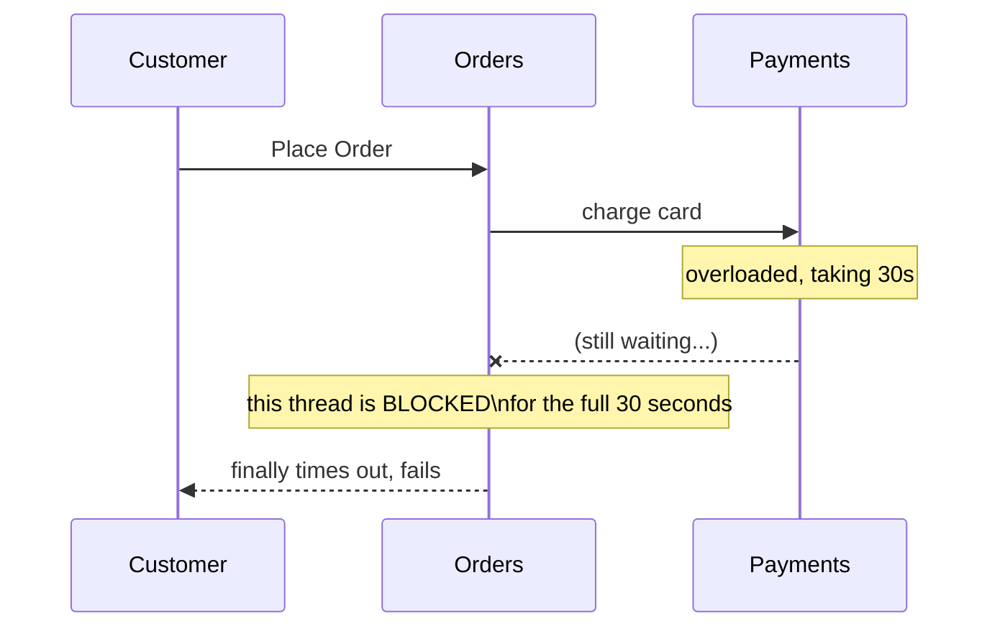

---

## Chapter 2: How One Slow Service Takes Down Ones That Were Never Broken

Here's the part that turns an inconvenience into an outage. Orders has a limited number of threads (or connections) available to handle incoming requests — say, 100. If checkouts arrive faster than one every 30 seconds, those 100 threads all fill up waiting on Payments, one by one.

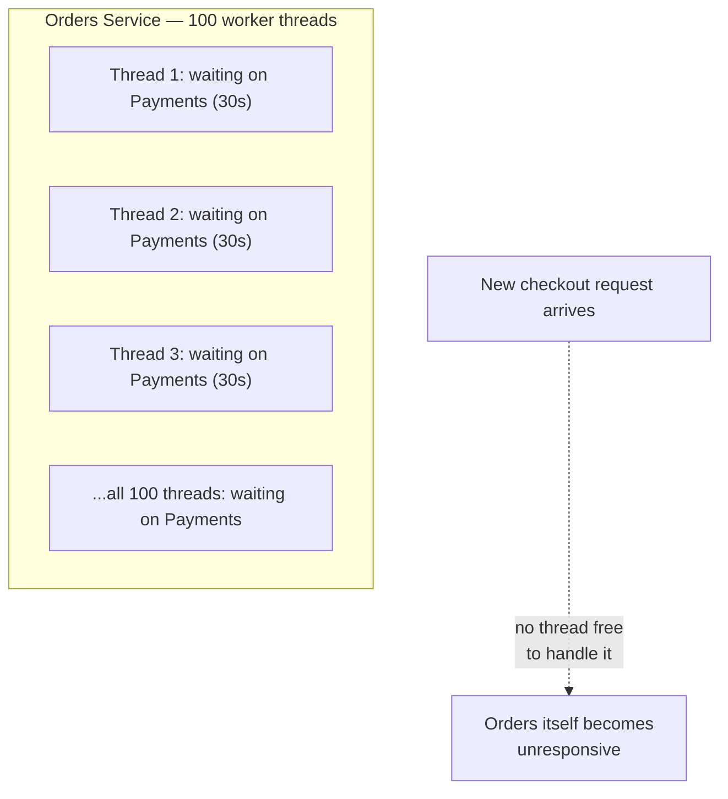

Once all 100 threads are stuck waiting on the slow Payments call, **Orders can't accept any new requests at all** — not even ones that have nothing to do with payments, like checking an order's status. Orders is now down, even though nothing is actually wrong with Orders' own code. And if some other service calls Orders synchronously the same way, that caller's threads start filling up too, waiting on an Orders that's stuck waiting on Payments.

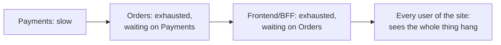

This is a **cascading failure**: one slow dependency, several layers down, takes the entire chain above it down too — even the parts that were working perfectly fine on their own. This is the sharpest version yet of a cost the very first guide in this series warned about: over a network, a call can be *slow* in a way an in-process function call never can be, and slow is often more dangerous than an outright failure, because a fast, clean error lets you react immediately — a hanging call just sits there, consuming resources, teasing you with the possibility it might still succeed.

---

## Chapter 3: The Core Insight — Stop Trying, Fail Fast Instead

The fix borrows its name and its idea directly from household electrical wiring. A physical **circuit breaker** trips when it detects too much current flowing — cutting the circuit before the wiring overheats and starts a fire. It doesn't fix the underlying fault. It just stops the damage from spreading, and gives you room to fix the actual problem safely.

Applied to a service call: **after a call to a dependency fails repeatedly, stop calling it for a while. Fail immediately, instead of hanging for 30 seconds hoping this attempt will be different.**

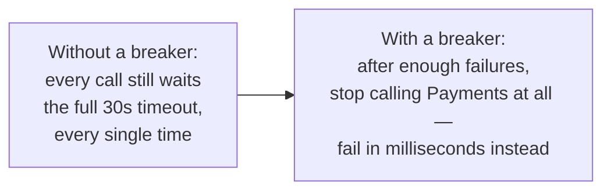

The critical shift in mindset: **a fast failure is a feature, not a bug.** Orders' threads are freed up almost instantly instead of being tied up for 30 seconds each. Payments, meanwhile, gets a break from a flood of requests it can't handle anyway — giving its own recovery (say, that batch job finishing) an actual chance to happen, instead of being permanently buried under retries.

---

## Chapter 4: The Three States — How a Breaker Actually Behaves

A circuit breaker is a small state machine sitting in front of every call to a particular dependency, tracking recent successes and failures.

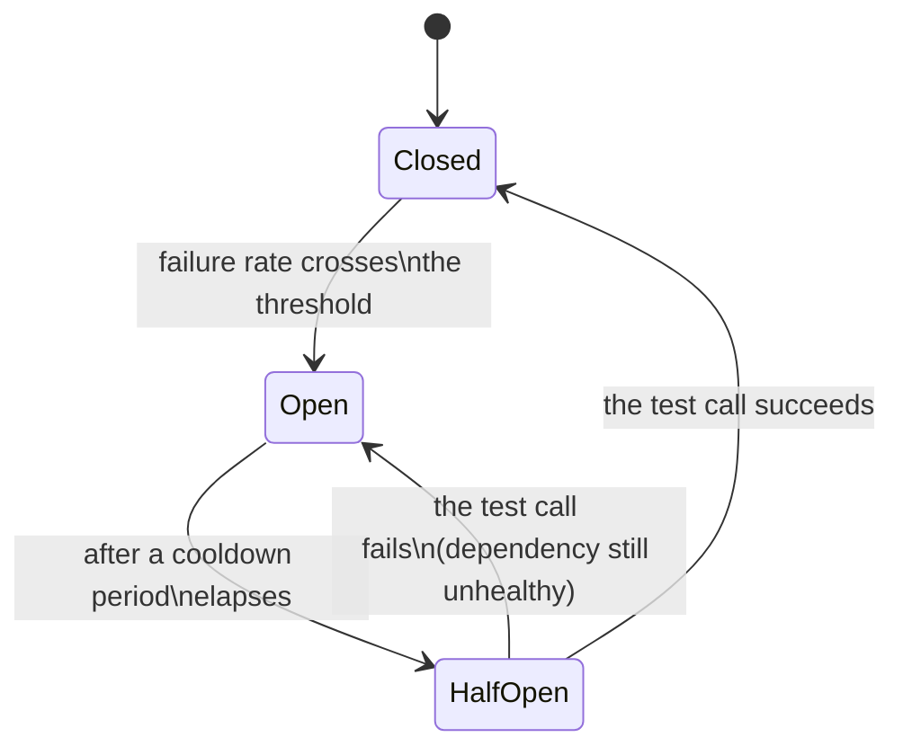

**Closed** is the normal state — calls flow straight through to Payments, and the breaker just quietly counts successes and failures in the background. Nothing about the behavior looks different from having no breaker at all.

**Open** is the tripped state — once failures cross a configured threshold (say, more than 50% of calls failed in the last 10 seconds), the breaker stops even attempting the call. It fails **immediately**, in microseconds, using a fallback instead.

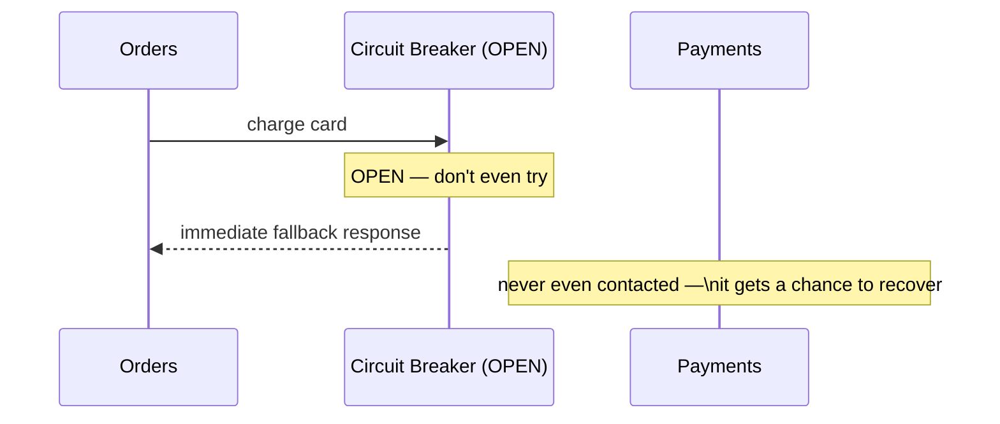

**Half-Open** is the cautious recovery state — after a cooldown period (say, 20 seconds), the breaker lets exactly one test call through to see if Payments has recovered. If that call succeeds, the breaker closes and normal traffic resumes. If it fails, the breaker goes straight back to Open for another cooldown period, rather than flooding a possibly-still-struggling Payments with a full burst of traffic all at once.

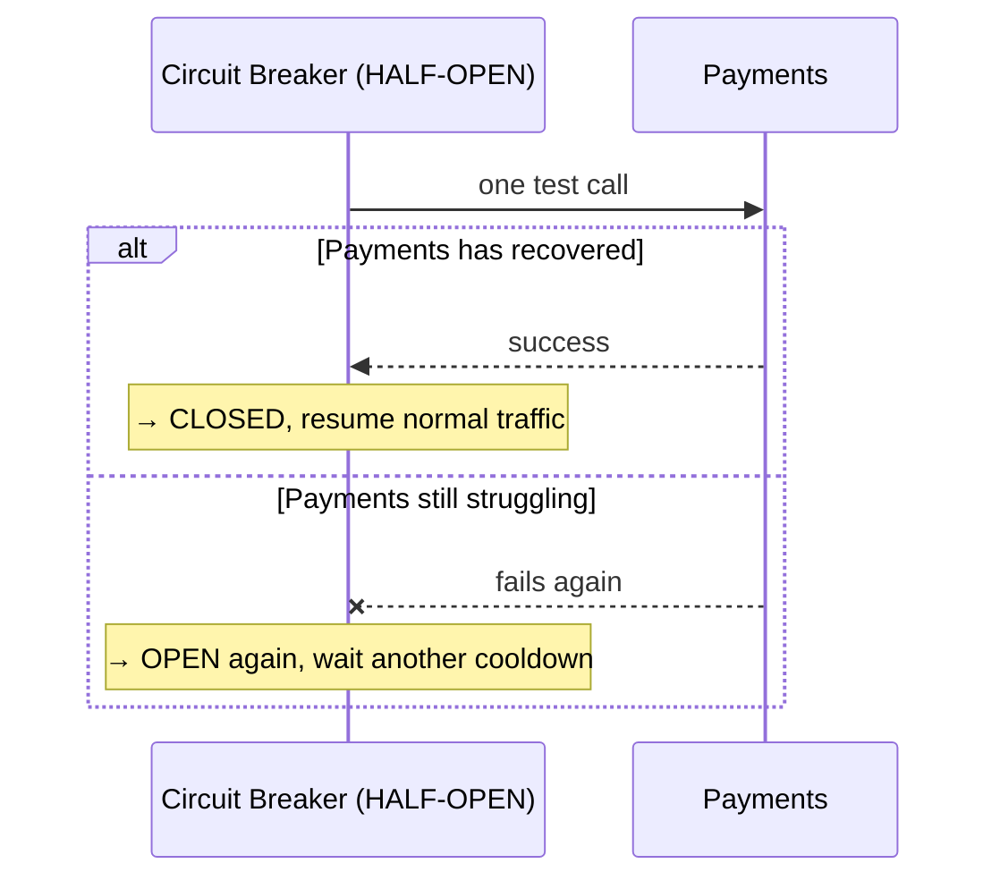

That diagram compresses both outcomes into one box. It's worth seeing the failed attempt on its own, since it's the path that's easy to forget when you're only picturing the happy case:

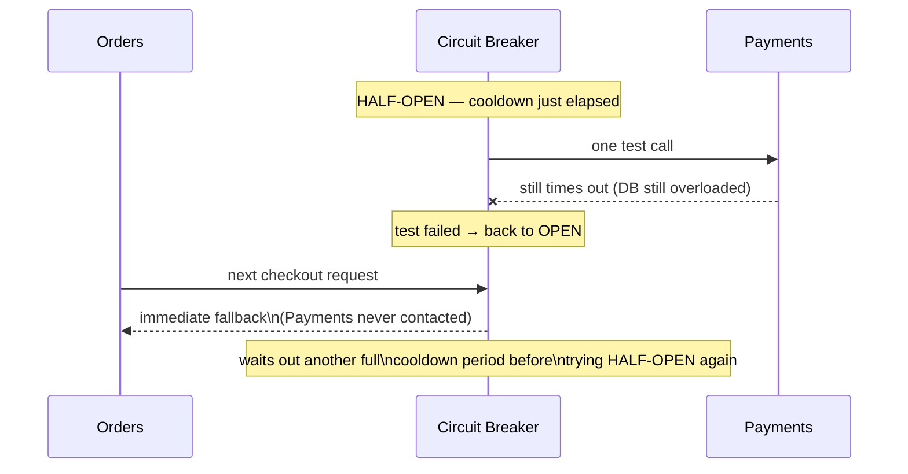

The dependency doesn't get a second flood of traffic just because one cooldown elapsed — it gets one cautious probe, and if that fails, everyone goes back to waiting.

### Seeing the State Machine on a Clock

The state names can feel abstract until you see them against real elapsed time. Here's a plausible timeline for the exact Payments incident this chapter opened with:

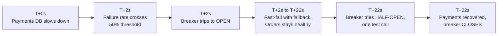

The entire outage, from Orders' point of view, lasted about 2 seconds — the time it took the threshold to trip. Everything after that was fast-failing with a fallback, not hanging, which is the whole point of the pattern.

### What Does "Fallback" Actually Mean?

The fallback is what the breaker returns instead of the real call, while Open. It has to be something your calling code can sensibly handle — a cached previous response, a clearly-marked default value, or an honest error the caller can act on ("payments temporarily unavailable, please retry checkout in a moment") rather than a 30-second hang. Designing a good fallback is at least as important as the breaker's threshold tuning — a breaker with a bad fallback just replaces "hangs for 30 seconds" with "fails confusingly, instantly," which is only a partial improvement.

---

## Chapter 5: The Cost — Tuning This Is Trickier Than It Looks

### Cost 1 — A Breaker That Trips Too Easily Causes Its Own Outages

If the failure threshold is too sensitive, a brief, harmless blip (one slow database query, one dropped packet) can trip the breaker into Open, cutting off a dependency that was actually fine. This is called **flapping** — the breaker oscillating open and closed based on noise rather than a real, sustained problem. Getting the threshold and time window right takes real production data, not a guess.

### Cost 2 — Every Caller Needs a Real Fallback Strategy

Adding a circuit breaker without thinking through what happens in the Open state just moves the problem: now, instead of "hangs for 30 seconds," you get "fails immediately, and the caller has no idea what to do with that." The fallback has to be designed with the same care as the happy path — this is not something you bolt on for free.

### Cost 3 — It Contains the Damage, It Doesn't Fix the Cause

A circuit breaker stops a slow Payments service from taking down Orders. It does absolutely nothing to fix Payments' overloaded database. It's a **resilience** mechanism, not a **root-cause** fix — the batch job still needs to be rescheduled, the database still needs more capacity. Treat a tripped breaker as a loud, useful signal pointing you at a real problem, never as the fix for that problem.

---

## Chapter 6: When Do You Reach for This?

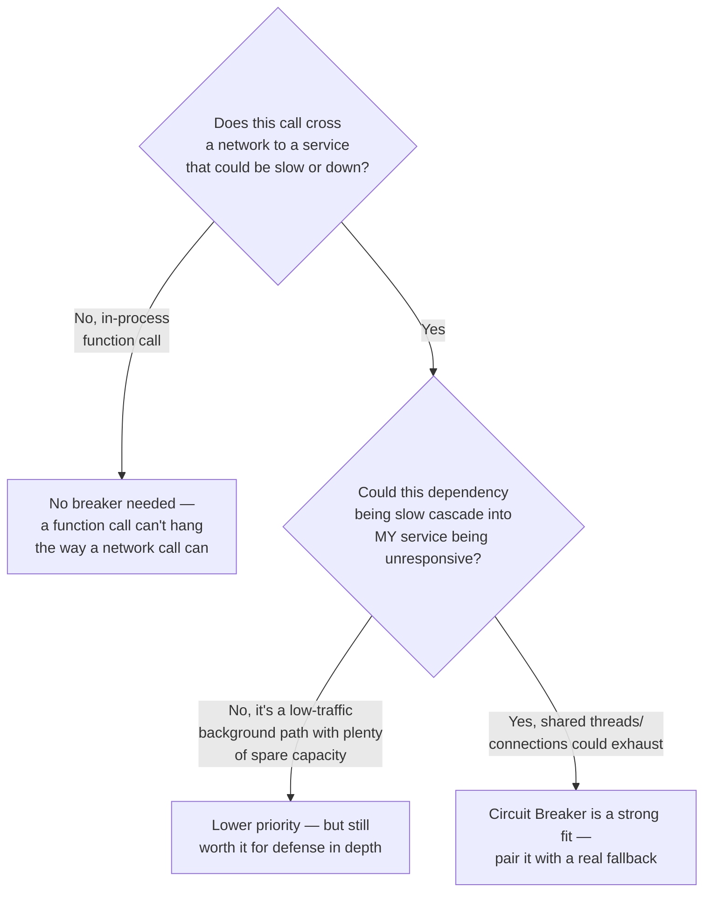

Any synchronous, cross-network call to a dependency that could plausibly be slow or unavailable is a candidate — this is exactly the concern the very first guide flagged when it pointed out that a network call, unlike a function call, can hang. Well-known libraries exist specifically for this. Netflix built and open-sourced **Hystrix** in the early 2010s after its own postmortems traced several major outages back to exactly this problem — synchronous calls between microservices with no circuit breaker in front of them, cascading into site-wide failures — so Hystrix was built specifically to stop that from happening again, and it's what popularized the pattern industry-wide. Hystrix is now in maintenance mode (Netflix itself has since moved on internally), and its role has been taken over by **Resilience4j** for the JVM and **Polly** for .NET, both of which implement the same Closed/Open/Half-Open state machine described earlier in this guide. In practice, a circuit breaker is almost always paired with the next guide's pattern — the **Bulkhead** — because a breaker only trips *after* enough failures have already happened; a bulkhead limits how much damage those failures can do while the breaker is still gathering evidence.

---

## The Full Story, End to End

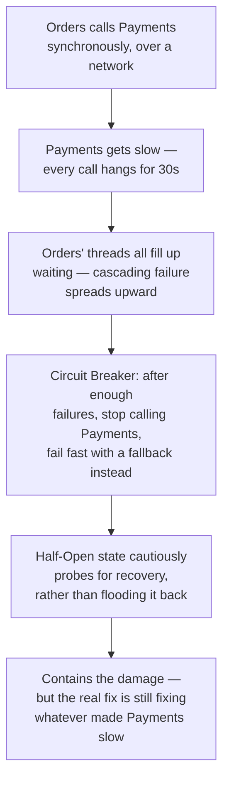

| | No Circuit Breaker | With Circuit Breaker |
|---|---|---|
| A slow dependency causes | Every caller hangs for the full timeout | Callers fail fast after the threshold trips |
| Thread/connection exhaustion | Likely — cascades upward | Prevented — threads freed immediately |
| Recovery | Dependency gets flooded the instant it comes back | Half-Open cautiously tests with one call first |
| Root cause | Untouched either way | Untouched either way — this contains, it doesn't fix |
| Best for | Never, for cross-network calls | Any synchronous call to a possibly-unreliable dependency |

**Where would you like to go next?** Natural threads from here:

- **Bulkhead Pattern** — isolating resources per-dependency so one slow call can't exhaust the shared pool a breaker is watching over
- **Backpressure Handling in APIs** — the complementary problem of a fast producer overwhelming a slow consumer, rather than a slow dependency overwhelming a fast caller
