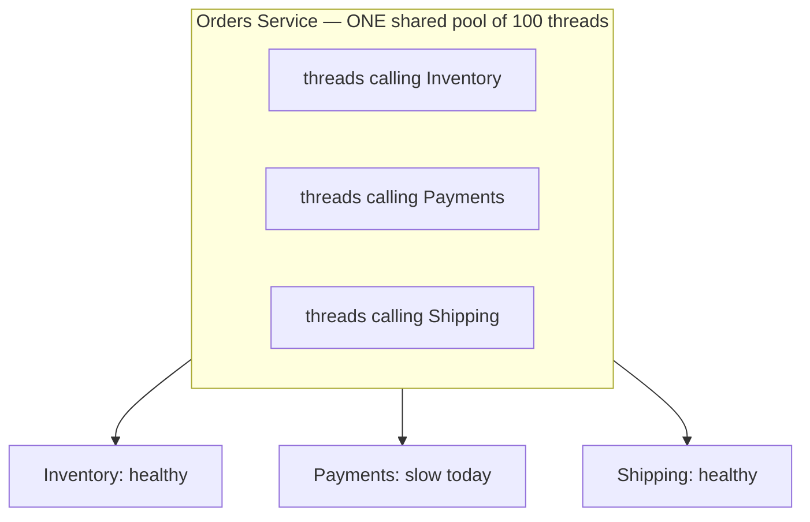
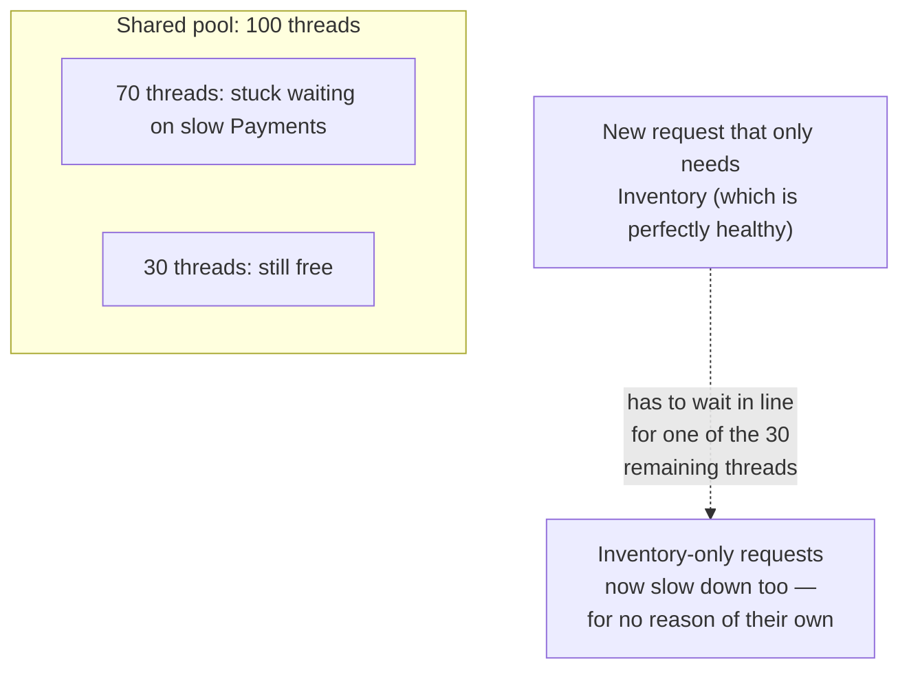
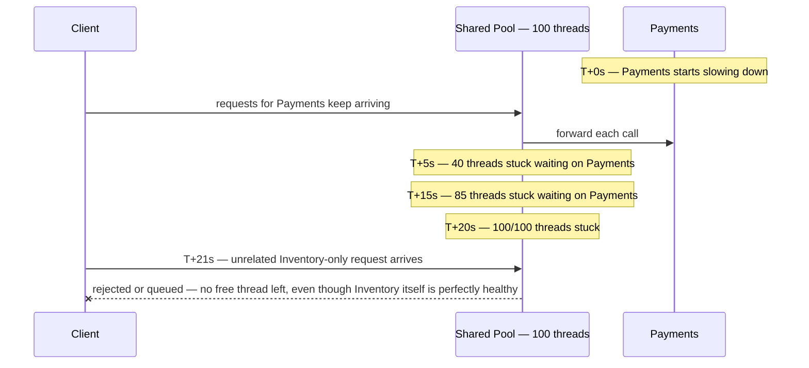
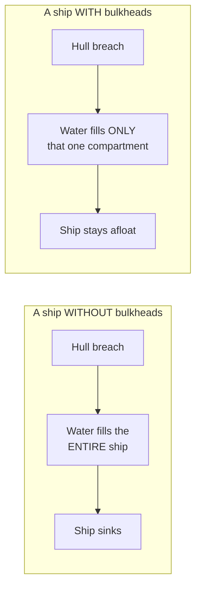
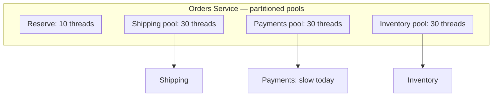
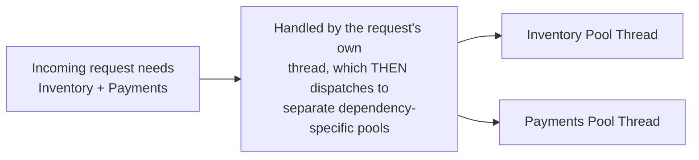
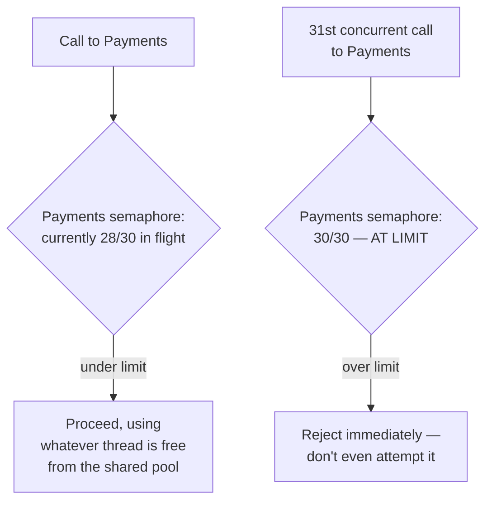
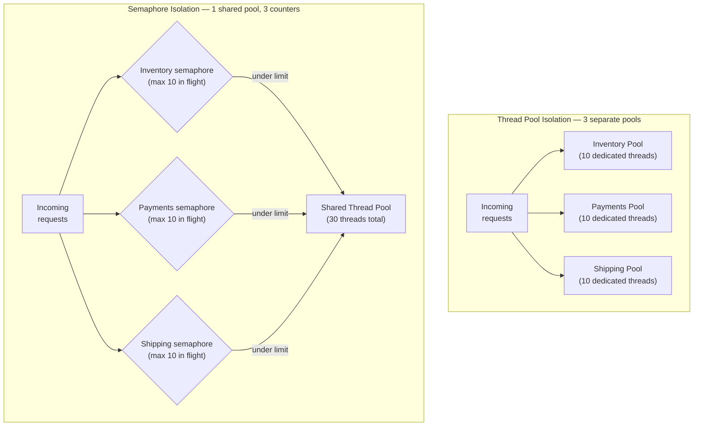
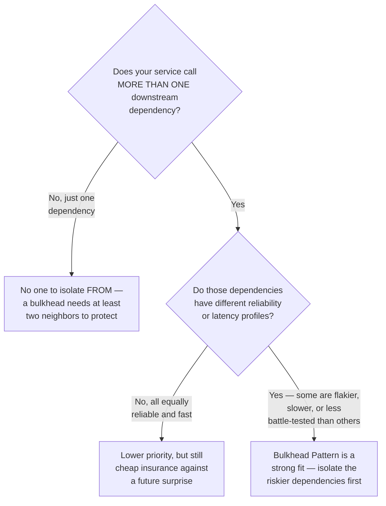
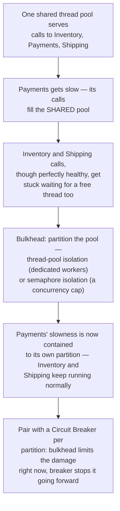

## The Story of the Bulkhead Pattern

The previous guide fixed the Payments slowdown with a circuit breaker — but it left a gap open, and that gap is where this guide starts. A breaker only trips *after* it has seen enough failures. What happens in the meantime, while it's still gathering evidence?

---

## Interview Cheat Sheet

- **Bulkhead Pattern, in one sentence**: give each downstream dependency its own capped share of a resource — a set of threads or a concurrency limit — so a slow or failing dependency can only exhaust its own share, never the resources every other dependency also needs.
- **Thread pool isolation**: each dependency gets its own dedicated pool of worker threads — strongest isolation, highest memory and CPU cost.
- **Semaphore isolation**: one shared pool of threads, but a simple counter per dependency caps how many concurrent calls to it are allowed at once — cheaper, slightly weaker isolation.
- **Good fit**:
  - Your service calls several downstream dependencies with different reliability or latency profiles.
  - At least one dependency is flaky, slow, or a third party you don't control.
  - A slow dependency has previously dragged down calls to unrelated, healthy dependencies.
- **Bad fit**:
  - Your service calls only one downstream dependency — there's no neighbor to protect.
  - All dependencies are equally fast, reliable, and battle-tested.
  - Traffic is low enough that a fixed partition would throttle a dependency's own normal peak load.
- **Core trade-off**: a contained blast radius vs some reserved capacity sitting unused when only one dependency is busy.
- **vs. the Circuit Breaker (previous guide)**: the breaker decides *whether* to attempt a call at all, based on recent failure history; the bulkhead caps *how much* of a shared resource one dependency can consume regardless of what the breaker has decided — different halves of the same problem, usually deployed together.

---

## Chapter 1: The Gap the Circuit Breaker Doesn't Cover

Orders calls three dependencies: Inventory, Payments, and Shipping. Sensibly, it has one shared pool of 100 worker threads handling all incoming requests — including whichever downstream call each request happens to be making.

Payments starts responding slowly again, exactly like the previous guide. The circuit breaker in front of Payments is watching — but it needs a certain number of failed or slow calls before it trips open. During that observation window, every request trying to reach Payments is still tying up a thread from the **shared** pool for the full timeout.

If Payments gets slow enough for long enough, it can consume all 100 threads before the breaker even finishes tripping — and now **Inventory and Shipping requests, which have nothing wrong with them at all, are stuck waiting in line too**, purely because they happen to share a thread pool with the sick dependency. One noisy, struggling neighbor has taken down the whole apartment building, even though every other unit was fine.

Here's that same exhaustion playing out on a clock, so it's concrete rather than just descriptive:

---

## Chapter 2: The Core Insight — Give Every Dependency Its Own Compartment

The name comes from ship design. A ship's hull is divided into separate watertight compartments called **bulkheads**. If the hull is breached and one compartment floods, the bulkheads keep the water from spreading — the ship stays afloat, listing perhaps, but afloat, because the damage was **contained** to one compartment instead of sinking the whole vessel.

This isn't only a metaphor — it's grounded in real, and slightly tragic, ship history. The actual RMS Titanic really did have physical bulkheads dividing its hull into 16 watertight compartments. But those bulkhead walls didn't extend high enough above the waterline: once enough compartments flooded and the ship's bow tipped down, water simply spilled over the top of one bulkhead into the next compartment, defeating the isolation they were built to provide. It's a real historical case of a bulkhead that existed on paper but wasn't implemented completely enough to actually contain the damage — a strong, memorable parallel to a software bulkhead whose pool sizes are misconfigured and quietly fail to achieve real isolation.

Applied to software: **stop sharing one resource pool across every dependency. Give each dependency its own dedicated, limited pool of threads or connections**, so a slow or failing dependency can only ever exhaust its own small compartment — never the whole ship.

Now, when Payments gets slow, only its own 30 threads fill up and get stuck. Inventory's 30 threads and Shipping's 30 threads are in a **completely separate compartment** — physically incapable of being exhausted by Payments' problems, because they were never shared with Payments to begin with. The blast radius of a failing dependency shrinks from "the whole service" to "just its own partition."

---

## Chapter 3: Two Ways to Build the Compartment Wall

### Thread Pool Isolation — A Dedicated Set of Workers Per Dependency

The heaviest but most complete form: each downstream dependency gets its own actual thread pool, so calls to Payments literally cannot use a thread that was reserved for Inventory.

This gives you the strongest isolation — even queueing behavior is separate per dependency — but it costs real memory and CPU overhead: every thread reserves its own stack space, and having several dedicated pools sitting mostly idle (Inventory's pool doesn't need much most of the time) is less efficient than one shared pool would be.

### Semaphore Isolation — Just a Counter, No Dedicated Threads

The lighter alternative: don't create separate thread pools at all. Instead, keep one shared pool, but put a simple counting limit (a **semaphore** — literally just a number that tracks "how many concurrent calls to Payments are in flight right now") in front of each dependency, and reject or queue any call beyond that limit.

This is much cheaper — no extra threads sitting around — but the isolation is slightly weaker: the calling thread itself is still borrowed from the single shared pool, so a request that's merely *queued* waiting for its turn under the semaphore limit still occupies a thread from the shared pool while it waits. In practice, semaphore isolation is the more common default because the overhead savings are significant and the isolation it provides is usually enough — thread pool isolation is reserved for the dependencies you consider genuinely dangerous enough to warrant full separation.

Side by side, here's the structural difference between the two mechanisms — three fully separate pools of dedicated threads versus one shared pool gated by three separate counting limits:

### Pairing With the Circuit Breaker From the Previous Guide

These two patterns are almost always used together, and it's worth being precise about what each one actually does: **the bulkhead limits how much of your shared resources one dependency is allowed to consume, at any given moment. The circuit breaker decides, based on recent failure history, whether to attempt the call at all.** A bulkhead alone still lets every call within its limit take the full timeout if the dependency is slow. A circuit breaker alone doesn't stop a burst of calls, all still in-flight, from exhausting a shared pool before enough of them have failed to trip it. Together: the bulkhead caps the damage a slow dependency can do to shared resources *right now*, while the breaker stops sending calls to it at all *going forward*. This pairing isn't just theory — Netflix's Hystrix library, the same one that popularized the circuit breaker pattern in the previous guide, implemented bulkheads (both thread pool and semaphore isolation) as a first-class feature right alongside its circuit breakers, which is a big part of why the two patterns are so often discussed and built together in practice.

---

## Chapter 4: The Cost — Compartments Waste Capacity When Only One Is Busy

### Cost 1 — A Fixed Total Split Unevenly Can Waste Capacity

If you split 100 threads into three fixed pools of ~33 each, and today only Inventory is under heavy load while Payments and Shipping sit mostly idle, Inventory is capped at 33 threads even though there are 66 more sitting unused in the other two pools. The previous chapter's shared pool didn't have this problem — any request could use any of the 100 threads. **You're trading maximum utilization for guaranteed isolation**, and that trade is deliberate, not a bug: the whole point was to stop one dependency from being able to use all 100.

### Cost 2 — More Configuration to Get Right

Every dependency now needs its own pool size or semaphore limit tuned — too small, and a perfectly healthy dependency gets throttled under its own normal peak load; too large, and you've recreated the shared-pool problem within that one partition. This tuning work is real, ongoing, and grows with every new dependency you add.

### Cost 3 — More Surface to Monitor

Instead of one pool's utilization to watch, you now have one per dependency. Good observability (dashboards per dependency pool, alerts when any one partition nears its limit) becomes necessary, not optional, the same way it became necessary the moment the earlier guides in this series split a monolith into services and scattered the pieces you need to watch.

---

## Chapter 5: When Do You Reach for This?

The clearest sign you need this: your service calls several downstream dependencies, and you can already name which ones are more likely to misbehave (a third-party API you don't control, an internal service that's newer and less proven, anything with a history of latency spikes). Isolate those first — you don't need to partition every single dependency equally on day one, only the ones actually capable of dragging the others down with them.

---

## The Full Story, End to End

| | Shared Resource Pool | Bulkhead-Isolated Pools |
|---|---|---|
| One slow dependency | Can exhaust the entire pool | Contained to its own partition |
| Healthy dependencies | Get caught in the crossfire | Keep working, unaffected |
| Resource utilization | Maximally efficient when all is well | Some capacity sits reserved, even if unused elsewhere |
| Configuration | One pool size to set | One size/limit per dependency to tune |
| Best for | A service with exactly one dependency | A service calling several, unevenly-reliable dependencies |

**Where would you like to go next?** Natural threads from here:

- **Circuit Breaker Pattern** (previous guide) — the companion pattern that decides whether to attempt a call at all, while the bulkhead limits the damage if it does
- **Sidecar Pattern** — pushing this kind of resilience logic (breakers, bulkheads, retries) out of every service's own code and into a shared, uniform infrastructure layer
