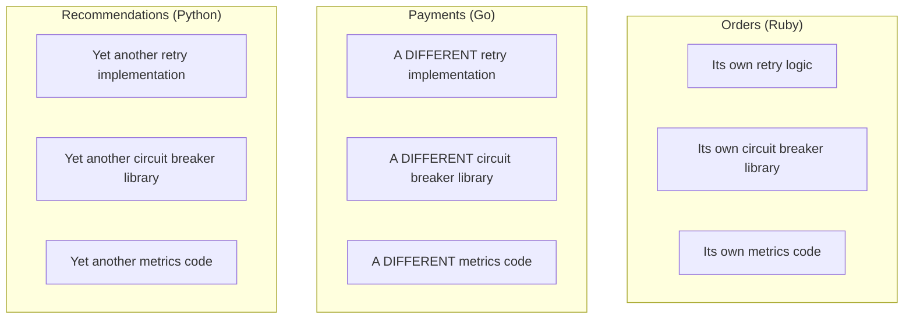
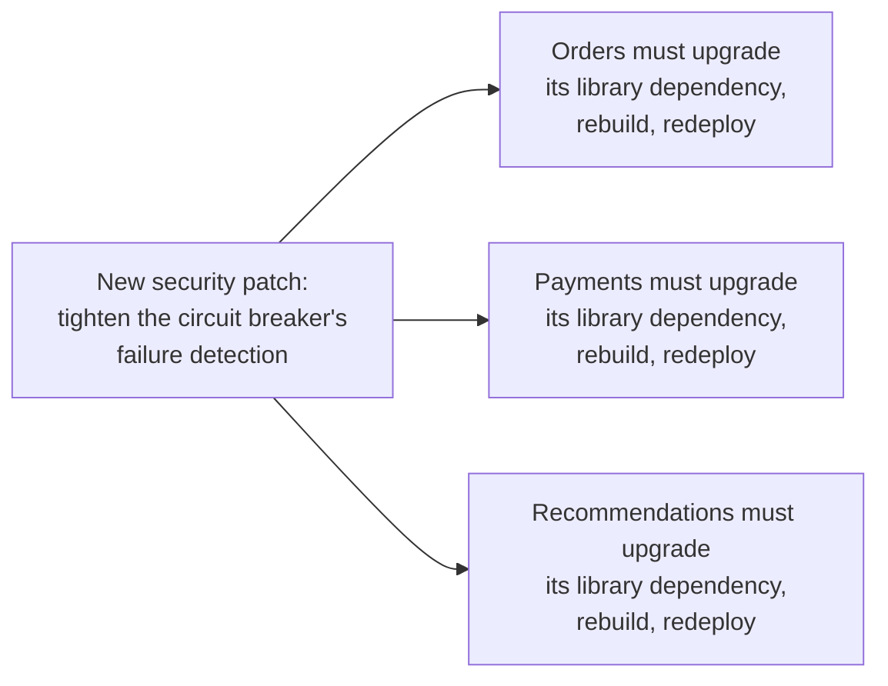
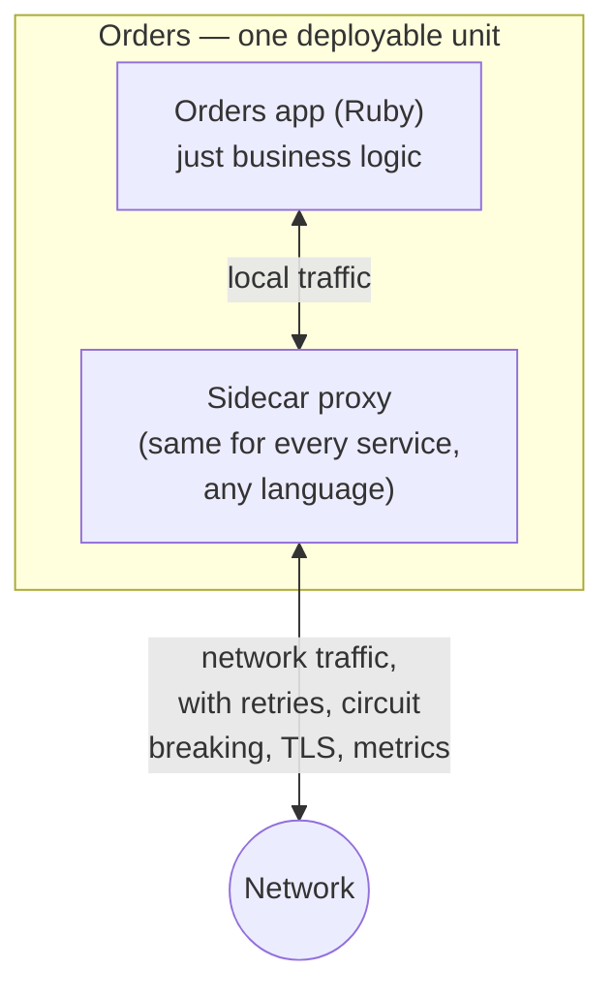
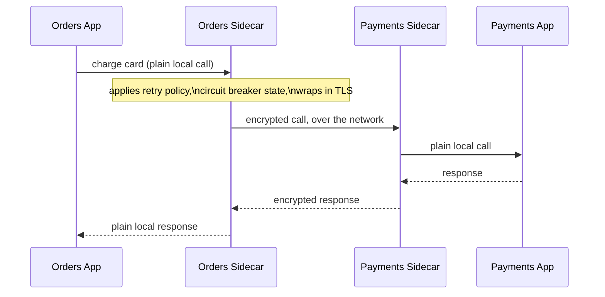
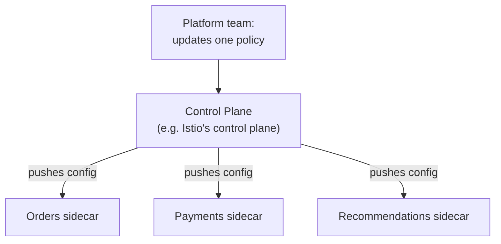
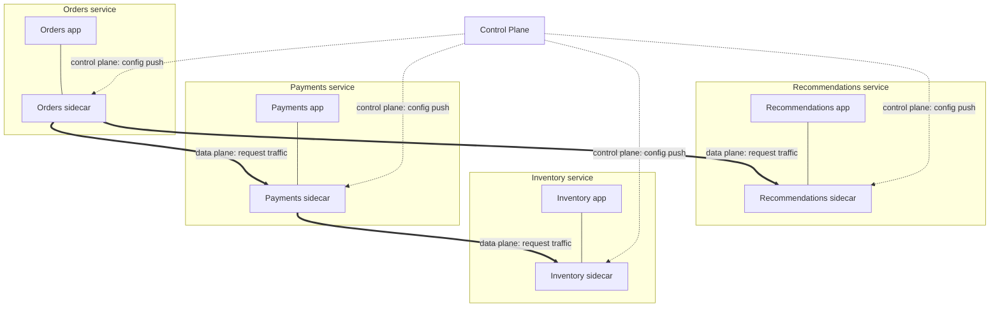
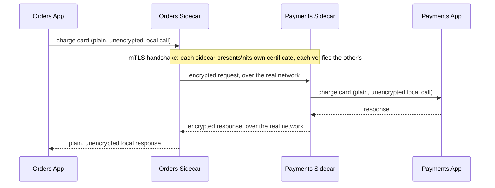
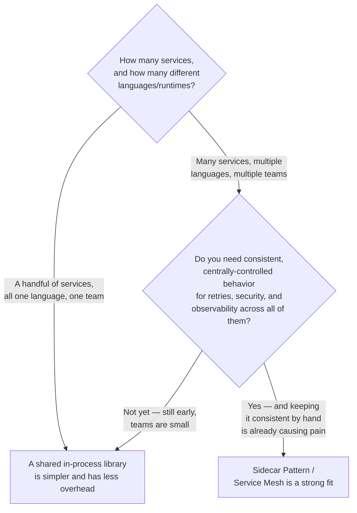
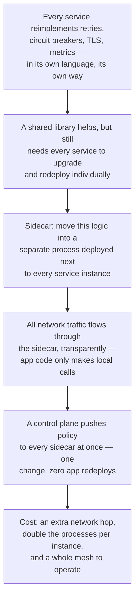

## The Story of the Sidecar Pattern

The last two guides gave every service circuit breakers and bulkheads. Good — except now someone has to actually write that logic, in every single service, and that's where this guide's problem begins.

---

## Interview Cheat Sheet

**Sidecar pattern:** deploy a small helper process alongside each service instance to handle cross-cutting networking concerns — retries, circuit breaking, TLS, metrics — so the application's own code never has to.

**Service mesh:** what you get when sidecars are deployed next to every service across a fleet, all following the same rules — a uniform network layer sitting underneath every service. **Control plane vs. data plane:** the **data plane** is the sidecars themselves, actually handling and shaping every request's traffic; the **control plane** is the one central place where policy is defined and pushed out to every sidecar in that data plane.

**Good fit:**
- A large, polyglot fleet of microservices owned by many independent teams
- Cross-cutting behavior (retries, mTLS, observability) needs to be identical everywhere, and keeping it consistent by hand is already causing pain
- Policy needs to change often (tightening a circuit breaker, rotating certs) without redeploying every application

**Bad fit:**
- A handful of services, one language, one team — a shared library is simpler and cheaper
- Latency budgets so tight that even a couple of extra milliseconds per hop matters
- No team or budget to operate a mesh control plane as its own distributed system

**Core trade-off:** uniform cross-cutting behavior and zero app redeploys to change policy, in exchange for an extra network hop on every call and double the processes running per service instance.

---

## Chapter 1: The Same Logic, Written Five Different Times

The bookstore's services aren't all written in the same language anymore — the first guide's promise of technology freedom came true. Orders is in Ruby. Payments is in Go, for raw throughput. Recommendations is in Python, for its machine learning libraries.

Every one of them needs the same cross-cutting concerns from the last few guides: retries on failure, a circuit breaker per dependency, bulkhead-isolated connection pools, TLS encryption on every call, and consistent metrics and tracing so an incident can actually be debugged.

Three teams, three languages, three separate implementations of the exact same idea. This isn't just triple the work — it's triple the ways for it to be subtly, quietly wrong. Maybe Ruby's retry logic waits 200ms between attempts, Go's waits 500ms, and Python's retries forever with no cap at all. Nobody decided this on purpose. It's just what happens when the same concern is reimplemented three times, by three teams, in three ecosystems, each borrowing whatever library happened to be popular in their language.

---

## Chapter 2: Why "Just Use a Shared Library" Doesn't Actually Fix It

The obvious fix: write one really good retry-and-circuit-breaker library, and have every team adopt it. This helps — until you need to upgrade it.

A shared library still has to be pulled in, rebuilt against, and redeployed by **every single service, individually** — and that's assuming a library even exists in all three languages with equivalent behavior, which for something as detailed as a circuit breaker's exact retry-and-backoff semantics is a real ask. In practice, you either end up with subtly different behavior per language anyway, or you spend enormous effort maintaining equivalent libraries across three ecosystems just to keep them in sync.

The real problem underneath both attempts: **this logic is about networking, not about business logic — and yet it's forced to live inside each application's own process, in each application's own language, redeployed on each application's own schedule.**

---

## Chapter 3: The Core Insight — Move It Out of the Process Entirely

The fix: stop putting this logic inside the application. Instead, run it as a **separate, small helper process, deployed right alongside your application — same host, same pod — that intercepts all of your application's network traffic and handles retries, circuit breaking, encryption, and metrics on its behalf, transparently.**

This helper process is called a **sidecar** — named after the sidecar attached to a motorcycle: it rides along, right next to the main vehicle, doing its own job, without being part of the motorcycle's own engine.

Notice what the Orders application itself now looks like: it just makes a plain, local call to its own sidecar, sitting right next to it. **The Orders code never touches retries, circuit breakers, or TLS at all anymore — that entire category of concern has moved out of the application and into infrastructure that's identical for every service, regardless of what language that service happens to be written in.**

---

## Chapter 4: How Traffic Actually Flows Through a Sidecar

Every one of the bookstore's services gets its own sidecar instance, deployed as a second process in the same unit (a Kubernetes pod, commonly). All outbound and inbound network traffic is transparently routed through it.

Neither Orders nor Payments' actual application code ever handles TLS, retries, or circuit breaking directly — both sidecars do, identically, regardless of the fact that one app is Ruby and the other is Go. When you have enough of these sidecars deployed across enough services, all following the same rules, you've built what's called a **service mesh** — a uniform network layer sitting underneath every service, handling every cross-cutting networking concern the same way, everywhere. Istio and Linkerd are the well-known implementations, both built on the idea of a sidecar proxy (Istio specifically uses Envoy) deployed next to every service instance.

This isn't a hypothetical — it's exactly how the pattern was born in practice. **Envoy**, the proxy most commonly used as the sidecar itself, was originally built at Lyft to solve this exact problem for Lyft's own polyglot fleet of microservices, long before it was open-sourced and became the default data-plane proxy underneath Istio. Google runs a similar sidecar-and-mesh approach internally at its own scale, and sells it to customers as Anthos Service Mesh. Linkerd exists because Istio's full feature set is more than many teams actually need: Buoyant built Linkerd as a lighter-weight alternative, trading away some of Istio's flexibility for a simpler mesh that's easier to run.

### The Control Plane — Changing the Rules Everywhere, at Once

The other half of a service mesh is a **control plane** — a central place where you define policy ("Payments should get 3 retries with exponential backoff," "all traffic must use mTLS") and it gets pushed out to every sidecar automatically.

This directly answers Chapter 2's problem. Tightening a circuit breaker's threshold is no longer "ask three teams in three languages to upgrade a library and redeploy." It's one config change in the control plane, pushed to every sidecar, with zero changes to any application's own code and zero redeploys of the applications themselves.

### Seeing the Whole Mesh at Once

Zoom out to the bookstore's actual fleet, and the two kinds of traffic — data plane and control plane — are happening side by side, all the time. Every service has its own sidecar, every sidecar talks to its neighbors' sidecars to move real requests, and every sidecar also stays connected to the one shared control plane that configures it.

The thick arrows are the **data plane**: actual request traffic, moving sidecar to sidecar, exactly like Chapter 4's charge-card example. The dotted arrows are the **control plane**: no business requests ever travel this path, only configuration — "here's the retry policy," "here's the mTLS certificate," "here's the traffic-splitting rule for a canary release." Every sidecar answers to the control plane, but the control plane is never in the path of an actual request — if it went down for a few minutes, in-flight traffic between Orders, Payments, Inventory, and Recommendations would keep flowing on whatever policy the sidecars already had.

### A Closer Look — mTLS Without the Apps Ever Knowing

**mTLS** (mutual TLS) means both sides of a connection prove their identity with certificates, not just the server the way a browser normally checks a website's certificate. It's exactly the kind of concern the control plane pushed out as policy in the diagram above ("all traffic must use mTLS") — and, like retries and circuit breaking, it's handled entirely by the sidecars, with neither application ever touching a certificate.

Look closely at where the certificates actually live: the Orders app makes a plain local call to its own sidecar, exactly as before. The two sidecars are the ones proving their identity to each other and encrypting everything that crosses the real network. Payments' app receives a plain local call from its own sidecar, no different from any other local call it's ever made. Neither application's code imports a TLS library, loads a certificate, or even knows mTLS is happening — that entire concern lives in the sidecars, which is exactly the point of moving it out of the process in the first place.

---

## Chapter 5: The Cost — You've Added a Hop, and a Whole New Layer

### Cost 1 — Every Call Now Makes an Extra Hop

Traffic that used to go directly from Orders to Payments now goes Orders → its own sidecar → Payments' sidecar → Payments. That's two additional local hops on every single call. Each hop is small — typically low single-digit milliseconds — but for a system with tight latency budgets, or a call chain that's already many services deep, this adds up in a way that's worth measuring, not assuming away.

### Cost 2 — Every Service Instance Now Runs Two Processes

Instead of one Orders process, you now have the Orders app **and** its sidecar, running side by side, each consuming its own memory and CPU. Multiply this by every instance of every service, and the aggregate resource overhead across a large fleet is real — often cited in the range of tens of percent additional memory and CPU across a cluster, though the actual number depends heavily on your specific mesh implementation and configuration.

### Cost 3 — Running the Mesh Itself Is a New Operational Job

A service mesh's control plane is itself a distributed system that needs deploying, upgrading, and monitoring — and if it goes down or misbehaves, it can affect traffic across your *entire* fleet at once, because every single service now depends on its sidecar being configured correctly. You've centralized a cross-cutting concern, which was the whole goal — but you've also centralized the blast radius of getting that concern wrong.

### Cost 4 — Debugging Gains a New Layer to Reason About

When a call between Orders and Payments fails, is it the application code, the network, or the sidecar's retry/circuit-breaker configuration? Tracing tools that understand the mesh (and most modern ones do) help enormously here, but this is still one more layer in the request's journey that whoever's debugging needs to know exists and know how to inspect.

---

## Chapter 6: When Do You Reach for This?

This pattern earns its cost at genuine scale: a large, polyglot fleet of microservices, owned by many independent teams, where keeping cross-cutting behavior consistent by hand (Chapter 1 and 2's problem) has become a real, ongoing source of pain. For a handful of services in one language, sharing one well-maintained library is simpler, has no extra network hop, and doesn't require running and operating an entire mesh control plane just to get consistent retry behavior.

---

## The Full Story, End to End

| | Logic Inside Each App | Sidecar / Service Mesh |
|---|---|---|
| Where retries/breakers live | Duplicated per-language, in-process | One process, identical for every service |
| Upgrading behavior | Every team updates their own library and redeploys | One control-plane change, pushed everywhere |
| Consistency across languages | Only as good as each team's own implementation | Guaranteed identical, since it's the same sidecar |
| Latency | Direct call, no extra hop | Extra local hop(s) through the sidecar(s) |
| Resource cost | One process per service instance | Two processes per service instance |
| Operational surface | None extra — just the app itself | An entire mesh control plane to run |
| Best for | Small fleets, one language, one team | Large, polyglot fleets, many teams |

**Where would you like to go next?** Natural threads from here:

- **Bulkhead Pattern & Circuit Breaker Pattern** (earlier guides) — the exact logic a sidecar most commonly takes over from your application code
- **Backpressure Handling in APIs** — the last pattern in this series, and the one concerned with what happens when a fast producer outruns a slow consumer, sidecar or not
