## The Story of Distributed Caching

The bookstore's Catalog service, from the CQRS guide in the ArchitecturePatterns series, already learned to split reads from writes. But even the read-optimized model has a database sitting behind it — and one particular book, trending after a celebrity book club pick, is about to expose a problem no amount of clever schema design can fix.

---

## Interview Cheat Sheet

**Distributed caching** puts a cluster of fast, in-memory key-value stores in front of (or beside) a database, so identical, repeated reads are served from memory across multiple machines instead of hitting disk-backed storage every time.

**Key facts:**
- **Cache-aside** (lazy loading) is the default pattern: check the cache first, fall back to the database on a miss, then populate the cache for next time
- A cache cluster distributes keys across nodes, usually via **consistent hashing**, so no single node has to hold — or answer for — the entire dataset
- **Redis Cluster** shards data across primary nodes (each with its own replicas) and uses a gossip protocol to track cluster state; **Hazelcast** is a peer-to-peer, JVM-native in-memory data grid with automatic partitioning built in as a library, not a separate server
- A **cache stampede** (or thundering herd) happens when a single hot key expires and a flood of concurrent requests all miss at once, hitting the database simultaneously

**Common interview gotchas:**
- A cache is not a source of truth — if it's ever the *only* copy of data that matters, you've built a database with worse durability guarantees than a database
- "Just add a cache" doesn't solve inconsistency — a cached value can silently drift from the database's real value the moment the database changes without the cache being told
- Consistent hashing isn't unique to caching — it's the same partitioning idea the DynamoDB paper popularized, and it resurfaces in the Important Papers guide later in this series
- A distributed cache cluster has its own availability and partition concerns — it is itself a small distributed system, not a magic performance dial

**The core trade-off:** a distributed cache trades a small, real risk of serving stale data for a dramatic reduction in database load and response latency — and the more nodes you add to scale that cache, the more coordination (partitioning, invalidation, replication) the cache cluster itself now needs.

---

## Chapter 1: One Book, A Million Identical Reads

A celebrity book club picks one of the bookstore's titles. Within an hour, its detail page — the same title, price, description, and rating, unchanged from one request to the next — is being requested tens of thousands of times a minute. Every one of those requests, without a cache, means a real query against the Catalog database.

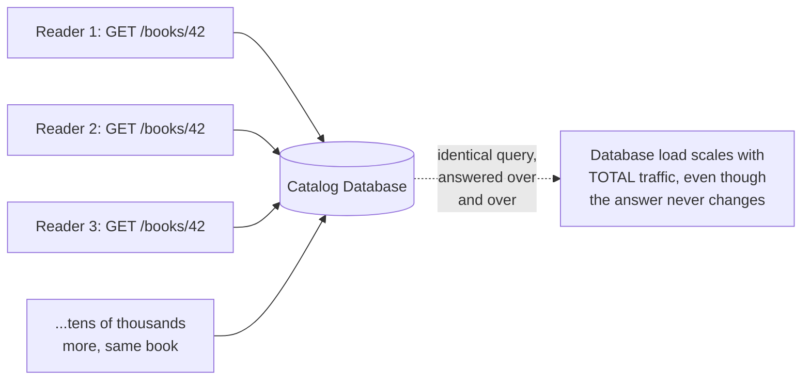

This is wasteful in a very specific way: the database is doing real work — disk I/O, lock management, query planning — to answer a question it already answered a moment ago, with an identical result every time. The CQRS guide's read model already denormalized this data for fast retrieval; the problem here is one layer more basic — even a fast, denormalized read still costs something, and at this volume, "something" adds up into real, measurable database load and latency.

---

## Chapter 2: Put the Answer Somewhere Faster to Reach

The fix: keep a copy of the answer in memory, on a server built for exactly this — a **cache** — and check there before ever touching the database. Memory reads are routinely 100 to 1,000 times faster than a disk-backed database query, because there's no disk I/O, no query planning, no lock contention — just a direct key lookup in RAM.

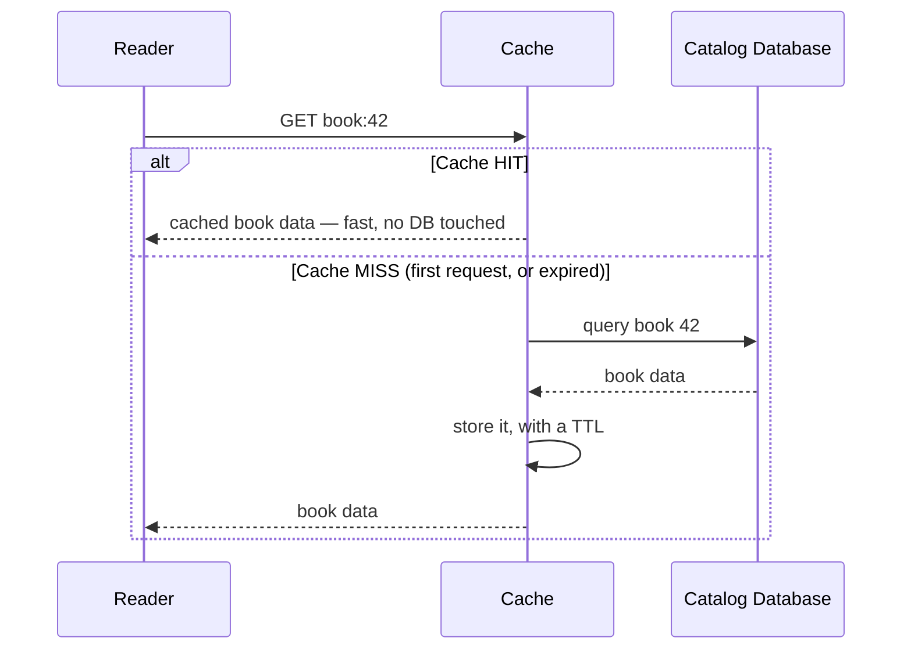

This pattern — check the cache, fall back to the database on a miss, then populate the cache for whoever asks next — is called **cache-aside** (or lazy loading), and it's the default most systems reach for first: simple to reason about, and the cache only ever holds data that's actually been requested, rather than everything the database has.

Two other patterns are worth knowing by name, because they shift *when* the cache gets written to rather than *whether* it's read from first:

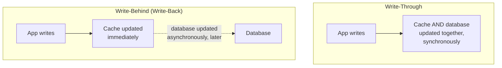

**Write-through** keeps the cache and database in lockstep on every write — safer, but every write now pays the cost of updating both. **Write-behind** updates the cache immediately and lets the database catch up asynchronously — faster writes, at the cost of a real window where a crash could lose data that only existed in the cache. Most systems default to cache-aside for reads and treat writes as "update the database, then invalidate (or update) the matching cache entry," which is simpler to reason about than either extreme.

---

## Chapter 3: One Cache Server Isn't Enough Either

A single cache server solves Chapter 1's problem beautifully — right up until the cache itself becomes the new bottleneck. Its memory is finite (you can't cache the whole internet, or even the whole catalog, on one machine), it's a single point of failure exactly like the monolith's single database was in the very first guide of the ArchitecturePatterns series, and it can only answer so many requests per second before it, too, is the thing under pressure.

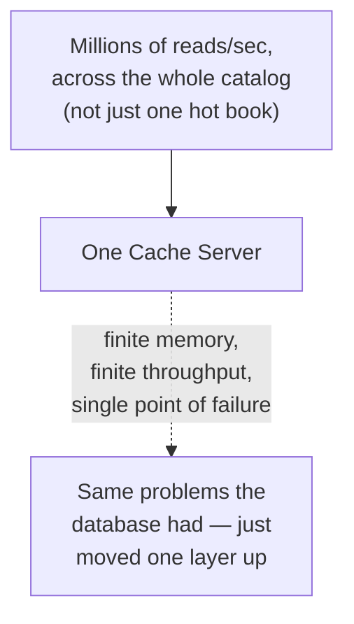

The fix follows the same shape as everything else in this series so far: don't rely on one node — build a **cluster** of cache nodes, and spread the data (and the load) across all of them.

---

## Chapter 4: Spreading Keys Across a Cluster

Once there's more than one cache node, something has to decide which node holds which key. The naive approach — `node = hash(key) % number_of_nodes` — has a specific, serious flaw: the moment you add or remove a node, `number_of_nodes` changes, and almost *every* key's assigned node changes with it, instantly invalidating nearly the entire cache cluster at once.

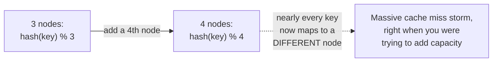

**Consistent hashing** fixes this: instead of hashing keys against a count that changes, place both the nodes and the keys onto positions on a fixed, circular hash ring (imagine hash values from 0 to some large maximum, wrapped around into a circle). A key belongs to whichever node's position is the next one clockwise from the key's own position on the ring.

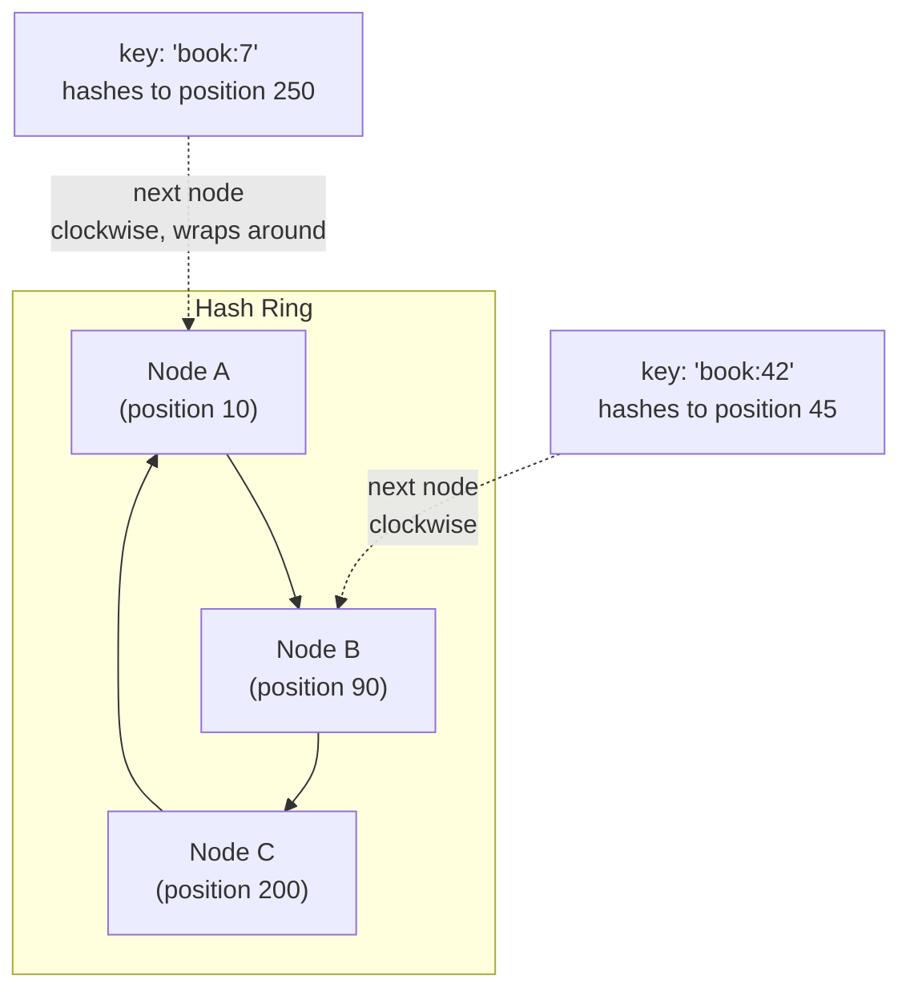

Adding or removing a node under this scheme only reshuffles the small slice of keys sitting between that node's position and its nearest neighbor on the ring — not the entire keyspace. This exact technique, worth remembering by name because it resurfaces later in this series, is one of the central ideas in Amazon's Dynamo paper (covered in depth in the Important Papers guide) — and it's the same partitioning concept a CDN's edge network and a sharded database both lean on, just applied here to an in-memory cache cluster.

---

## Chapter 5: Redis Cluster vs. Hazelcast

Two names come up constantly once you're picking real infrastructure for this layer, and they represent genuinely different design philosophies.

**Redis Cluster** shards data across multiple **primary** nodes using a fixed set of 16,384 hash slots (a variant of the consistent-hashing idea from Chapter 4, with a fixed slot count rather than an open-ended ring) — each primary owns a range of slots, and each primary typically has one or more **replica** nodes for failover. Nodes track cluster state (who owns which slots, who's alive) via a **gossip protocol** — each node periodically exchanges what it knows with a few random peers, so information about the cluster's state spreads without any single node needing to know everything centrally. A client that asks the wrong node for a key gets redirected (a `MOVED` or `ASK` response) toward the node that actually owns it.

**Hazelcast** takes a different shape: it's a peer-to-peer, JVM-native **in-memory data grid** — instead of running as a separate server process your application talks to over the network, it's typically embedded as a library directly inside your application's own JVM processes, and those processes automatically discover each other and partition data among themselves. It exposes familiar data structures (distributed maps, queues, sets) with the same API shape as their single-machine Java equivalents, so application code barely has to change to become "distributed."

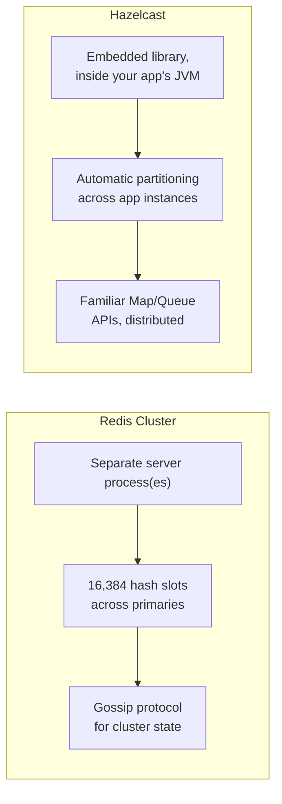

Neither is strictly "better" — Redis Cluster is language-agnostic and battle-tested as standalone infrastructure; Hazelcast is a natural fit specifically for JVM-based fleets that want a data grid without standing up and operating a separate caching tier at all.

---

## Chapter 6: The Cache Can Lie — Invalidation and Staleness

Every cached value is a copy, and copies can go stale the moment the original changes. If an admin updates a book's price and nothing tells the cache, every reader keeps seeing the old price until the cached entry's **TTL** (time to live) expires — the exact same trade-off the DNS and CDN guides in the Networking series already introduced: short TTL means fresher data but more cache misses and more database load; long TTL means better hit rates but longer-lived staleness.

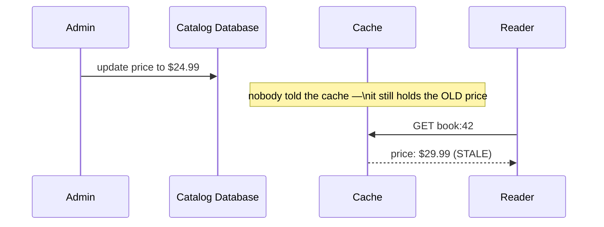

Beyond just waiting out a TTL, most real systems **explicitly invalidate** the cache entry the moment the underlying write happens — delete or update the cached value as part of the same write path, so the next read is forced to miss and re-fetch the fresh value. In a cluster, that invalidation message itself has to reach every node holding a copy of that key (if the cache also replicates for availability), usually via the cache cluster's own internal pub/sub or gossip mechanism — the same "tell every replica this changed" problem the CDN guide called cache invalidation one of the two genuinely hard problems in computer science, just one layer further into the infrastructure.

---

## Chapter 7: The Cost — Stampedes and False Confidence

### Cost 1 — Cache Stampede (Thundering Herd)

The celebrity book club pick's cache entry finally expires. In the same instant, thousands of requests that were all being served from cache all miss at once, and all of them turn around and hit the database simultaneously — for the exact same query — producing a sudden spike that can look exactly like the unprotected-database problem from Chapter 1, just delayed and concentrated into one bad moment.

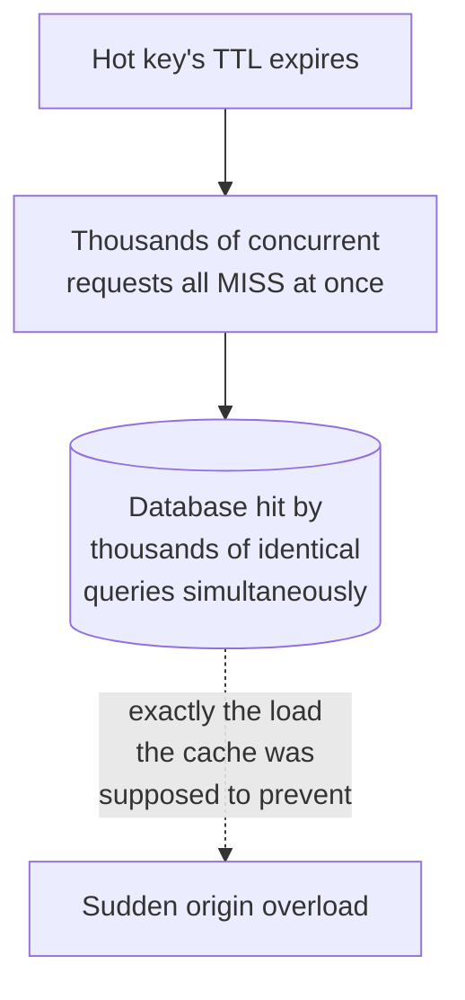

The standard mitigations: have only the *first* request that misses actually query the database while the rest wait for that result (request coalescing, sometimes called single-flight); refresh a hot key's cached value proactively, slightly before it actually expires, rather than waiting for a hard expiry that every concurrent reader hits at once; or add a small amount of random jitter to TTLs so a large batch of keys cached at the same moment don't all expire in the same instant.

### Cost 2 — The Cache Cluster Is Itself a Small Distributed System

Once a cache is sharded and replicated across multiple nodes, it inherits the same concerns every other distributed data store in this series does: what happens on a network partition between cache nodes, how quickly does a failed primary get detected and replaced, and whether a client can briefly see two different nodes disagree about who owns a given key during a reconfiguration. A distributed cache is not a simple performance dial — it's a genuine piece of distributed infrastructure with its own availability and consistency story, which the rest of this series goes on to explore in depth.

### Cost 3 — "The Cache Is Down" Should Never Mean "The Site Is Down"

Because a cache is a copy, not the source of truth, a well-designed system should degrade to hitting the database directly (slower, but correct) if the cache cluster becomes unavailable — not fail the request outright. Treating the cache as though it were load-bearing infrastructure that data can only be recovered from is a design mistake that turns a performance optimization into a new single point of failure.

---

## Chapter 8: When Do You Actually Reach for This?

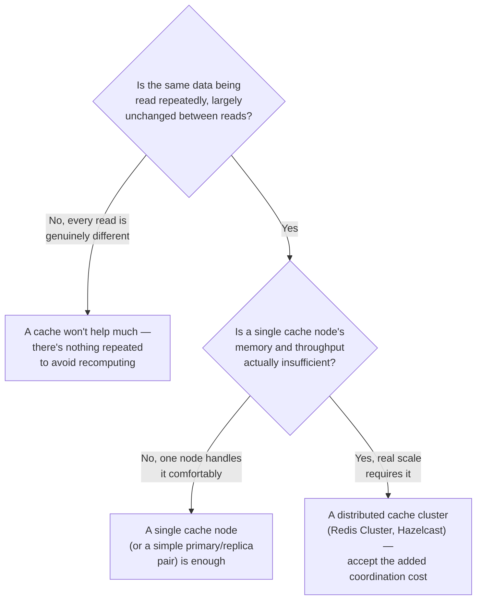

The signal to reach for a distributed cache specifically (rather than a single cache instance) is genuine scale: enough read volume, or enough data, that one machine's memory or request throughput is the actual bottleneck — not just "reads feel slow," which a single well-placed cache node often already fixes.

---

## The Full Story, End to End

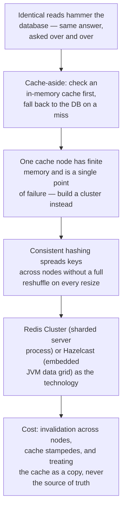

| | Single Cache Node | Distributed Cache Cluster |
|---|---|---|
| Capacity | Limited to one machine's memory | Scales with the number of nodes |
| Availability | Single point of failure | Survives individual node failure (with replicas) |
| Key placement | Trivial — one node holds everything | Consistent hashing across nodes |
| Invalidation | One place to update | Must propagate to every node holding a copy |
| Operational complexity | Low | Real — it's its own small distributed system |
| Best for | Modest scale, simple deployments | High read volume or large working sets |

**Where would you like to go next?** Natural threads from here:

- **Eventual Consistency and Quorum Mechanism** — once data is replicated across multiple nodes (cache or database), what does "consistent" even mean, and how do you tune the trade-off deliberately
- **Important Papers (DynamoDB & Spanner)** — where consistent hashing, introduced in Chapter 4, became one of the central ideas in a system built to run all of Amazon's shopping carts
