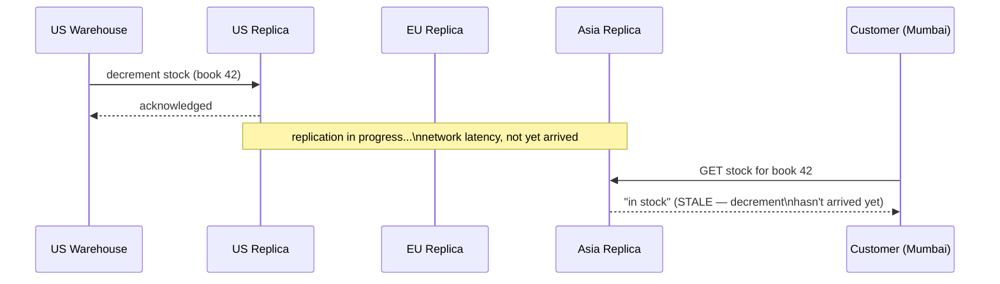
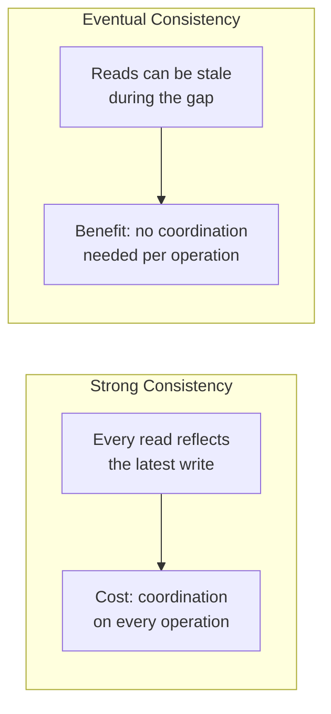
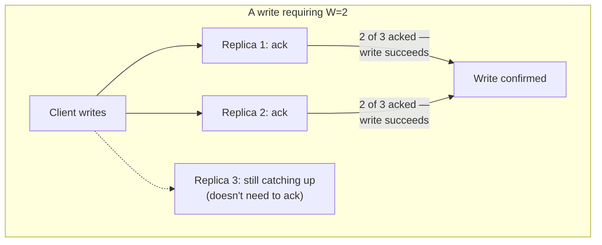
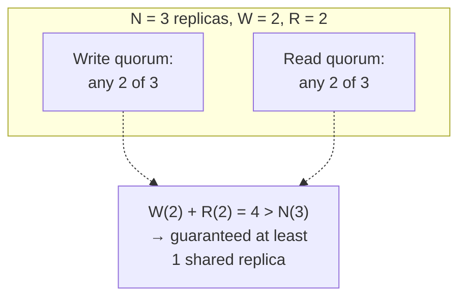
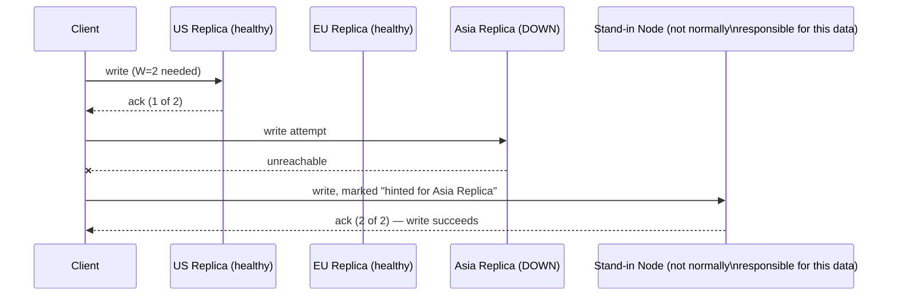
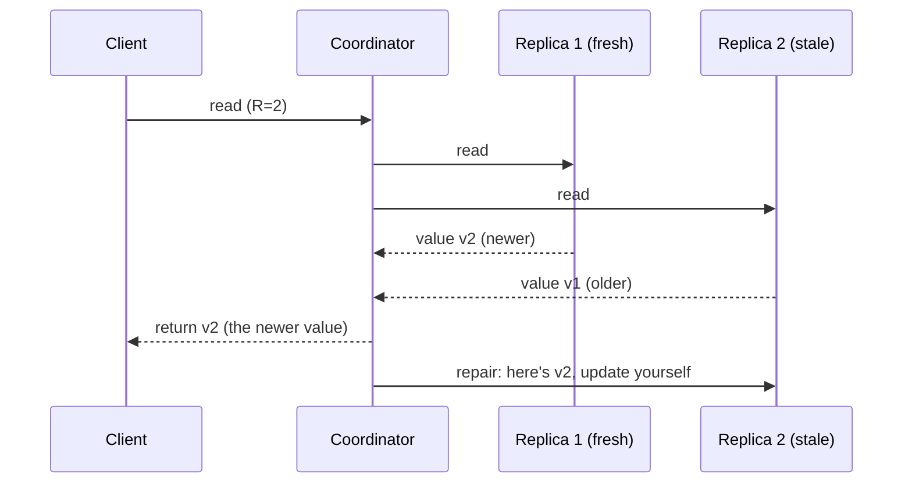
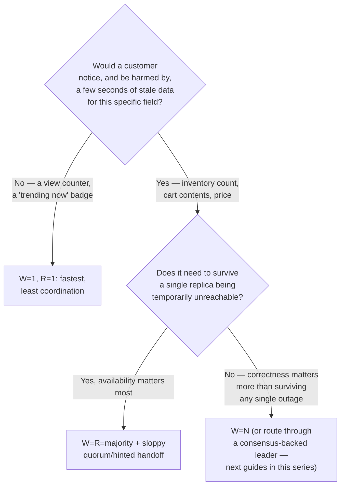
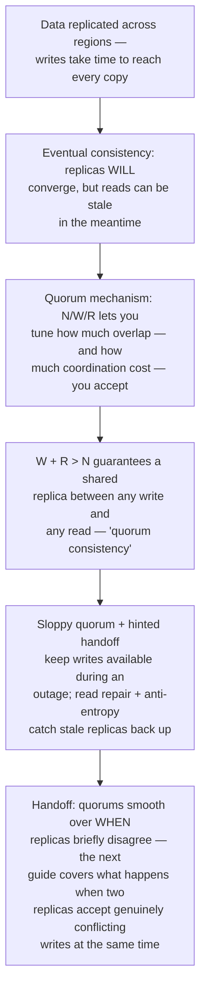

## The Story of Eventual Consistency and the Quorum Mechanism

The distributed cache from the previous guide solved a performance problem by keeping copies of data close to where it's needed. But the bookstore's actual source of truth — the Inventory database — has its own reason to need copies too: it's now replicated across three regions (US, EU, Asia), so a customer's read doesn't have to cross an ocean. The moment there's more than one copy of the truth, a new question appears that performance alone never raised: what happens when the copies don't agree, even for a moment?

---

## Interview Cheat Sheet

**Eventual consistency** guarantees that if writes stop, all replicas will *eventually* converge to the same value — but says nothing about how long "eventually" takes, or what a read sees in the meantime. **The quorum mechanism** (N/W/R) is the dial that lets you trade latency and availability against how strong that "meantime" guarantee actually is.

**Key facts:**
- **N** is the number of replicas holding a piece of data; **W** is how many must acknowledge a write before it's considered successful; **R** is how many must respond to a read before its result is returned
- If **W + R > N**, every possible read quorum and write quorum is guaranteed to overlap in at least one replica — the mathematical basis for "quorum consistency"
- **Sloppy quorum + hinted handoff** keeps writes succeeding even when a replica is temporarily unreachable, by letting another node hold the write on its behalf until the original node returns
- **Read repair** and background **anti-entropy** are how replicas that fell behind (or received a hinted write) eventually catch back up to the rest

**Common interview gotchas:**
- Eventual consistency is not "no consistency" — it's a specific, real guarantee (convergence, given no new writes) with a specific, real gap (no bound on staleness during the window before convergence)
- W + R > N gives you overlap, which strongly reduces the chance of reading stale data — it is not the same guarantee as linearizability, and clock/ordering subtleties can still surprise you
- Consistency level is frequently tunable *per operation*, not fixed for the whole system — a single database can serve one read at R=1 (fast, might be stale) and another at R=quorum (slower, much fresher) depending on what that specific request needs
- CAP theorem and the deeper FLP/PACELC treatment of this exact trade-off already exist in this repository's `database/DistributedTransactions/README.md` — this guide focuses on the quorum mechanics themselves, not re-deriving CAP from scratch

**The core trade-off:** the more replicas you require to agree before confirming a write or a read, the stronger your consistency guarantee — and the more latency and unavailability risk you accept every single time one of those replicas is slow or unreachable.

---

## Chapter 1: A Write in Virginia, A Read in Mumbai

The bookstore's Inventory database now runs as replicas in three regions. A warehouse in the US decrements stock for a book that just sold out. That write lands on the US replica first — it has to travel over real, physical distance before the EU and Asia replicas even hear about it.

Nothing here is broken. The write genuinely happened, and it will genuinely reach every replica — but not instantly, because information can only travel as fast as the network (and the speed of light) allows across that distance. The question this guide answers: what should the Asia replica do about reads that land in that gap, and how much control do you actually have over the size of that gap?

---

## Chapter 2: Two Honest Answers to "Is It Consistent?"

**Strong consistency** promises that every read, everywhere, reflects the most recent completed write — no gap, no stale answers, ever. The cost is real: guaranteeing this usually means coordinating with other replicas (or a majority of them) on every single read or write, which means paying real cross-region latency on operations that would otherwise be instant, and refusing to answer at all if too few replicas can be reached (a theme the later Consensus and Important Papers guides in this series build on directly).

**Eventual consistency** makes a weaker, more honest promise: *if writes to a given piece of data stop arriving, every replica will eventually converge to the same final value.* It says nothing about how long that convergence takes, and it explicitly allows a read during the gap to return a stale answer — in exchange for not having to coordinate with anyone else before answering.

Neither is universally correct. A bank balance probably wants strong consistency. A "12 people are viewing this listing" counter can happily be a few seconds stale. The bookstore's Inventory count sits somewhere in between — which is exactly why the **quorum mechanism** exists: instead of picking one extreme for an entire system, it lets you tune, per piece of data or even per operation, exactly how much coordination you're willing to pay for.

---

## Chapter 3: N, W, and R — The Dial Itself

Picture the Inventory record for one book, replicated across **N = 3** nodes. Every write and every read can require acknowledgment from some number of those replicas before it's considered complete:

**N** is how many replicas hold a copy of the data at all. **W** (write quorum) is how many of those replicas must acknowledge a write before the client is told it succeeded. **R** (read quorum) is how many replicas must respond to a read before the client gets an answer back (and if they disagree, the most recent value — determined by a timestamp or version — wins).

The single most important fact in this whole guide: **if W + R > N, every possible set of W replicas that could have accepted a write and every possible set of R replicas that could answer a read are mathematically guaranteed to share at least one replica in common.**

That guaranteed overlap means at least one replica answering your read is guaranteed to have also been part of the write that just happened — so it's holding the fresh value, not a stale one. This is why the combination is sometimes called **quorum consistency**: not the full guarantee of strong consistency, but a mathematically-grounded, tunable improvement over "just ask one random replica and hope."

---

## Chapter 4: Turning the Dial Deliberately

Because W and R can be set independently (as long as N is fixed), the same replicated data can be tuned toward different priorities depending on what a specific operation actually needs:

| Configuration | Behavior | Trade-off |
|---|---|---|
| **W = N, R = 1** | Writes wait for every replica; reads are instant | Writes are slow and fail if even one replica is unreachable; reads are fast and always fresh |
| **W = 1, R = N** | Writes are instant; reads wait for every replica | Writes are fast and highly available; reads are slow and fail if any replica is unreachable |
| **W = R = majority** (e.g., 2 of 3) | Balanced; overlap guaranteed (Chapter 3) | Neither writes nor reads depend on every single replica — the most common real-world default |
| **W = 1, R = 1** | Both fast | No overlap guarantee at all — this is plain eventual consistency, tuned toward availability and speed above all else |

Real systems like Cassandra and DynamoDB expose this as a genuine per-request choice, not a single fixed system-wide setting: a request updating a book's price might ask for `QUORUM` on both sides (balanced), while a request incrementing a "times viewed" counter might explicitly ask for `ONE` (fastest, least coordination, and nobody cares if it's briefly a bit off).

---

## Chapter 5: What Happens When a Replica Is Just... Gone

Quorums assume enough replicas are reachable to form one. What happens when the Asia replica from Chapter 1 is down for maintenance, and a write needs `W = 2` out of 3?

**Sloppy quorum**: instead of blocking the write because only 2 of the *intended* 3 replicas are reachable, hand the third copy to a different, healthy node that isn't normally responsible for this data at all — as a temporary stand-in, purely to keep the write count at W and the system available.

That stand-in node holds a **hint** — a note saying "this write actually belongs to the Asia replica; deliver it there the moment it comes back." Once the Asia replica returns, the stand-in forwards the hinted write to it — this handoff is exactly what **hinted handoff** means. The trade-off is explicit: availability was preserved (the write succeeded despite a real outage), at the cost of the Asia replica staying stale for longer than usual, and the guaranteed overlap from Chapter 3 technically not holding until the hint is delivered.

---

## Chapter 6: Catching Stale Replicas Back Up

Two complementary mechanisms bring a lagging or hinted replica back in sync with the rest:

**Read repair**: when a read quorum is gathered and the replicas disagree (one has an older version than the others), the coordinator handling the read notices the mismatch, determines the correct (most recent) value, and pushes that corrected value back to the stale replica — repairing it as a side effect of an ordinary read, with no separate process required.

**Anti-entropy**: a background process that periodically compares replicas directly, independent of any client read, and reconciles differences — useful specifically because read repair only fixes keys that actually get *read*; a key nobody happens to ask about could stay stale indefinitely without a separate mechanism checking on it. Real systems often use **Merkle trees** (a tree of hashes, where each parent node's hash summarizes its children) to make this comparison efficient — two replicas can compare just their top-level hash first, and only descend into the parts of the tree where hashes actually differ, instead of comparing every single key between two potentially enormous replicas.

---

## Chapter 7: The Real Cost of Choosing Eventual

**The customer-facing risk is concrete, not abstract.** A customer adds a book to her cart on one region's replica; a page refresh routed to a different, not-yet-synced replica can briefly show an empty cart. This is the exact same kind of visible cost the CQRS guide raised about its read model lagging behind writes — quorum-tuned eventual consistency is the same trade-off, one layer further down, inside the database's own replication instead of between a write model and a read model.

**Sloppy quorums trade correctness for availability, explicitly.** A hinted write briefly breaks the neat "W + R > N guarantees overlap" math from Chapter 3, because the write didn't land on one of its "real" replicas yet. Systems that use sloppy quorums are making a deliberate, informed bet that availability during a failure is worth more than the guarantee holding perfectly at every instant.

**The deeper theoretical floor underneath all of this — CAP, PACELC, and the FLP impossibility result — is already covered in exhaustive depth in this repository's `database/DistributedTransactions/README.md`.** The short version worth carrying forward: partition tolerance isn't optional in a real network, so the actual choice during a partition is between consistency and availability, and even without a partition, there's a constant, ongoing trade between consistency and latency. Quorums are simply the practical, tunable knob real systems expose to let you make that choice deliberately, per operation, instead of being stuck with one answer for everything.

---

## Chapter 8: Setting the Dial on Purpose

The skill isn't picking eventual consistency or strong consistency as a system-wide religion — it's recognizing, field by field, operation by operation, how much staleness a customer would actually notice and be harmed by, and setting W and R to match that, deliberately, rather than defaulting to whatever the database ships with out of the box.

---

## The Full Story, End to End

| | Strong Consistency | Eventual Consistency (tuned via quorum) |
|---|---|---|
| Read freshness | Always the latest write | Depends on W, R, and timing |
| Latency | Higher — coordination required | Lower, tunable per operation |
| Availability during a partition | Lower — may refuse to answer | Higher — sloppy quorums keep serving |
| Complexity | Simpler to reason about | Requires understanding N/W/R and repair |
| Best for | Money, inventory counts, anything a customer would notice being wrong | View counts, trending badges, most read-heavy, low-stakes data |

**Where would you like to go next?** Natural threads from here:

- **Vector Clocks & Conflict Resolution** — quorums handle replicas that are simply behind; this guide covers what happens when two replicas accept genuinely different, concurrent writes to the same key
- **Important Papers (DynamoDB & Spanner)** — the N/W/R quorum model in this guide comes directly from Amazon's Dynamo paper, covered in full in this series' capstone guide
