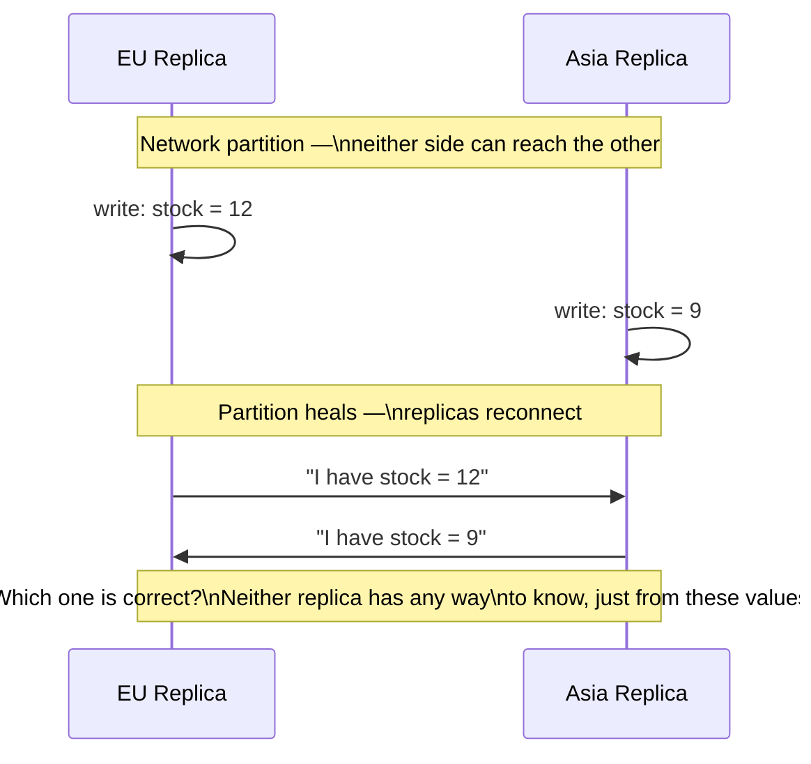
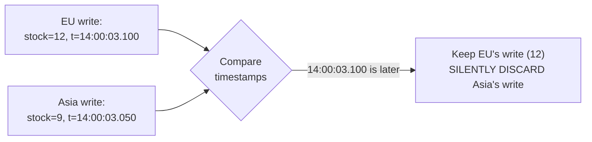
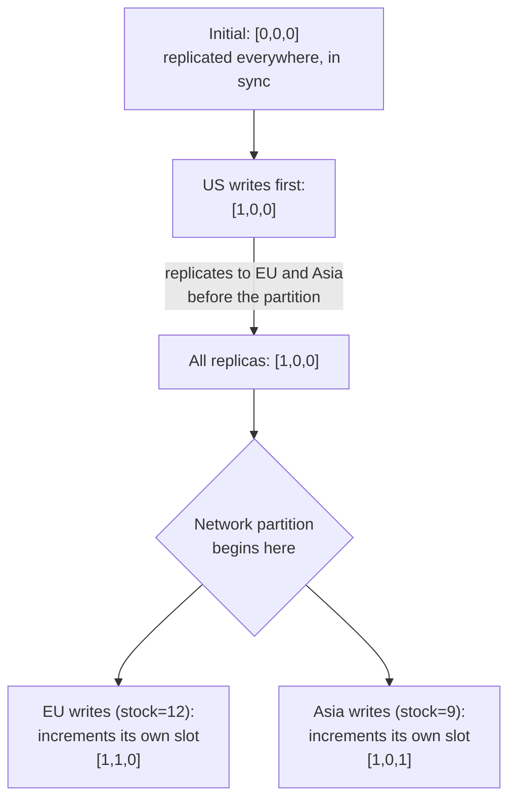
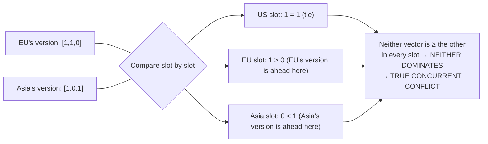
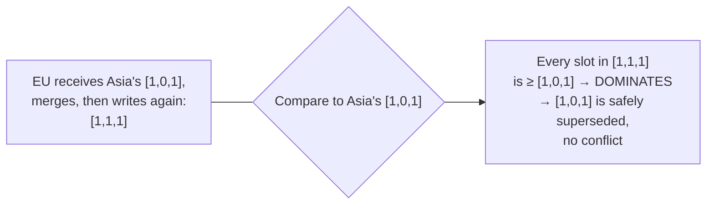
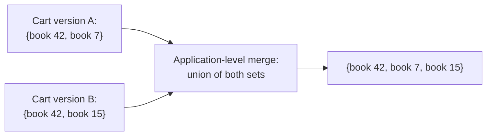
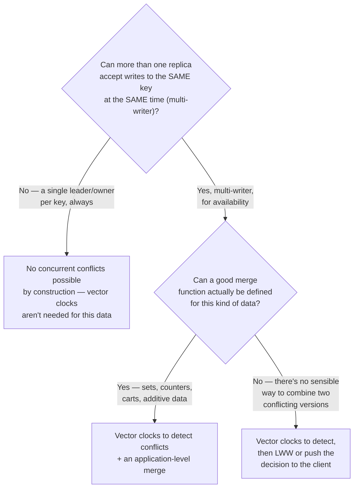
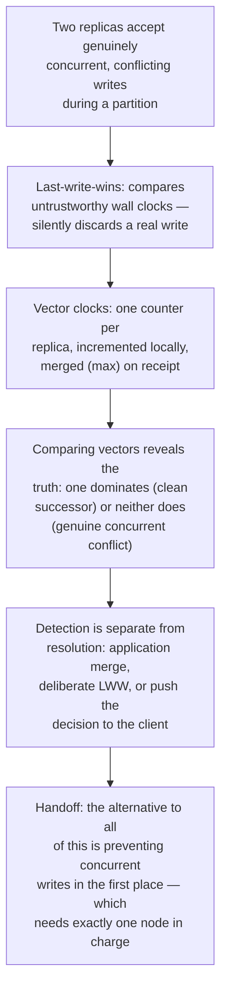

## The Story of Vector Clocks and Conflict Resolution

The previous guide's quorum mechanism smooths over replicas that are simply *behind* — a stale copy that hasn't heard about a write yet. It quietly assumed there's always one true, most-recent value to converge on. A network partition between the EU and Asia regions is about to break that assumption directly: both sides stay available (an explicit, deliberate choice under eventual consistency), and both sides accept a genuinely different write to the exact same record, at the exact same time.

---

## Interview Cheat Sheet

**Vector clocks** are a mechanism for detecting whether two writes to replicated data are causally ordered (one clearly happened after the other) or genuinely concurrent (neither knew about the other) — without relying on wall-clock time, which can't be trusted to agree across machines.

**Key facts:**
- **Last-write-wins** (comparing wall-clock timestamps) is the naive fix for conflicting writes, and it silently discards a legitimate concurrent update whenever clocks disagree or two writes land in the same instant
- A vector clock is one counter per replica; each replica increments only its own counter on a local write, and merges (takes the max of) every counter when it receives another replica's version
- Comparing two vector clocks tells you one of two things: one **dominates** the other (every counter is ≥, so it's the true successor — no conflict), or neither dominates (some counters are higher on each side — a genuine, detected **concurrent conflict**)
- Vector clocks **detect** conflicts; they do not **resolve** them — resolution is a separate decision, often left to the application (this is exactly the shape Amazon's Dynamo paper faced with shopping carts)

**Common interview gotchas:**
- Vector clocks are not about knowing *when* (in real time) something happened — they capture *causality*, which is a fundamentally different and more reliable relationship in a distributed system
- "The clocks disagree" is not the same bug category as "the writes conflict" — vector clocks assume no shared clock at all, and work entirely off message causality instead
- Detecting a conflict is the easy part; resolving it correctly (merge vs. pick-a-winner vs. ask the user) is where the real engineering judgment lives
- Vector clock size grows with the number of replicas that have ever written a key — real systems must prune or truncate old entries, trading some detection accuracy for bounded storage

**The core trade-off:** vector clocks give you an honest, mathematically grounded way to detect when two replicas truly disagree — at the cost of exposing that complexity (multiple valid versions of the same object) to whoever has to resolve it, instead of silently and sometimes incorrectly picking a winner for you.

---

## Chapter 1: Two Writes, No Way to Tell Which Is "Right"

A network hiccup briefly separates the EU and Asia replicas from each other (they're both still reachable by customers, just not by one another — exactly the kind of partition eventual consistency is built to tolerate by staying available on both sides). During that window, a warehouse update in the EU sets a book's stock to 12, while an unrelated correction in Asia sets the same book's stock to 9.

Both writes are completely legitimate — each replica did exactly what it was asked, at a moment when reaching the other replica simply wasn't possible. Now that they're back in contact, something has to decide what the record's real value is.

---

## Chapter 2: The Naive Fix, and Why It Silently Loses Data

The obvious first idea: attach a wall-clock timestamp to every write, and when two versions conflict, keep whichever has the later timestamp — **last-write-wins (LWW)**.

This looks reasonable until you remember a fact this series has already established more than once: machine clocks are never perfectly synchronized. If Asia's server clock is running even 100 milliseconds ahead of EU's, a write that actually happened *earlier* in real time can carry a *later* timestamp, and LWW will confidently keep the wrong one — with absolutely no indication to anyone that a legitimate update was just thrown away. Worse, if a customer's cart update ("add a book") and a separate cart update ("remove a book") happen to race each other, LWW doesn't merge them — it picks one write and erases the other entirely, which for a shopping cart specifically means a customer's item can vanish with no warning at all.

The deeper problem isn't clock precision — it's that LWW is trying to answer a question ("which one happened first?") using a tool (wall-clock time) that was never designed to be trustworthy across machines. What's actually needed is a way to know, reliably, whether one write *could have known about* the other — a question about causality, not time.

---

## Chapter 3: Causality Instead of Clocks

Two events can only be meaningfully ordered if one could have influenced the other — if information from the first had a chance to reach the second before it happened. If neither write had any way of knowing about the other, they aren't "earlier" or "later" relative to each other at all — they're **concurrent**, and treating them as if one simply beat the other to the finish line is the actual source of LWW's silent data loss.

This idea — replacing real time with a record of "what did I know about, and when" — starts with a simpler building block called a **Lamport timestamp**: each node keeps a single counter, increments it on every local event, and whenever it receives a message from another node, sets its counter to `max(own counter, received counter) + 1`. This correctly orders anything causally related (if A's counter value was included in the message that led to B, then B's counter is guaranteed higher than A's) — but it has a real limitation worth naming: two genuinely concurrent, unrelated events can still end up with a strict ordering between their Lamport timestamps, because a single number can't tell the difference between "this happened after, causally" and "this number is just higher." Lamport timestamps can order events; they can't reliably tell you whether two events were actually concurrent. That's exactly the gap **vector clocks** close.

---

## Chapter 4: How a Vector Clock Actually Works

A vector clock keeps not one counter, but **one counter per replica** — a vector, with one slot for every node that might write this data. The rule is simple: a replica increments *only its own slot* on a local write, and when it receives another replica's version, it **merges** by taking the element-wise maximum of every slot, then increments its own.

Let's trace the exact scenario from Chapter 1, with three replicas — US, EU, Asia — written as `[US, EU, Asia]`:

Both writes started from the same base version `[1,0,0]` — that's the crucial detail. When the partition heals and the two versions meet again, the replicas compare `[1,1,0]` against `[1,0,1]`:

This is the entire mechanism, stated precisely: **vector A dominates vector B if every one of A's counters is greater than or equal to B's corresponding counter, and at least one is strictly greater** — that means A definitely happened after B, causally, with full knowledge of it, and B can be safely discarded as superseded. If neither vector dominates the other — some counters higher on each side, exactly like EU's and Asia's versions above — the writes are provably concurrent, and *both* must be kept, because there is no causal basis for discarding either one. Compare this to Chapter 2's LWW: instead of guessing based on untrustworthy clocks, the vector clock gives a mathematically certain answer straight from the replicas' own version history.

For contrast, here's what a non-conflicting case looks like — EU writes again *after* actually receiving Asia's version first:

Because EU's new write incorporated Asia's version before incrementing, its vector clock now dominates Asia's — a clean, genuine "happened-after," not a guess.

---

## Chapter 5: Detecting a Conflict Is Not the Same as Resolving One

A vector clock tells you, with certainty, *that* `[1,1,0]` and `[1,0,1]` are concurrent. It says absolutely nothing about which stock count — 12 or 9 — should actually win, because there genuinely isn't a correct answer derivable from the vectors alone. Resolution has to come from somewhere else:

**Application-level merge** is the most powerful option when it's actually possible: this is precisely the scenario Amazon's original Dynamo paper (covered in full in this series' Important Papers guide) used to motivate vector clocks in the first place — a shopping cart. If two replicas concurrently accept different additions to the same customer's cart, the *correct* resolution usually isn't "pick one cart and discard the other" — it's to **merge** them, taking the union of both sets of items, since a customer would rather see an extra item they can remove than lose one they explicitly added.

**Last-write-wins, deliberately chosen** is still a legitimate option — for data where losing a concurrent update occasionally is genuinely acceptable (a "last viewed" timestamp, say), explicitly picking LWW as the resolution policy is fine, precisely because you've made an informed choice rather than stumbled into Chapter 2's silent data loss without realizing it.

**Push the decision to the client**, exactly as Dynamo did: return *both* concurrent versions to whoever's reading, and let the application (or in Dynamo's original design, sometimes even the end customer) decide how to reconcile them. This is honest about the fact that the system genuinely cannot determine the correct outcome on its own — but it means client code has to be written to expect and handle multiple versions coming back from a single read, which is a real API complexity most engineers don't expect the first time they encounter it.

**CRDTs** (Conflict-free Replicated Data Types) are worth knowing by name as a more advanced alternative: data structures specifically designed so that *any* merge of concurrent versions is always well-defined and safe by construction (a counter that only ever increments, or a set that only ever grows, for instance) — sidestepping the need for a separate resolution step entirely, at the cost of only working for data shapes that fit this constraint.

---

## Chapter 6: The Cost of Actually Using This

**Vector clocks grow with every distinct replica that has ever written a key.** In a system with a small, fixed number of replicas (three regions, say), this is trivial. In a system where clients themselves can act as writers — Dynamo's original design allowed this — the vector can grow unboundedly over time, and real implementations must **prune** old, no-longer-relevant entries, accepting a small, deliberate loss of precision in exchange for a vector that doesn't grow forever.

**The complexity becomes visible to application code, not just infrastructure.** A read that could return multiple concurrent versions is a fundamentally different API contract than one that always returns exactly one answer — every client of that API has to be written with this possibility in mind, which is real, ongoing engineering effort that a simpler (but lossier) LWW system never has to ask for.

**Most engineers avoid needing this entirely, on purpose.** A very common, much simpler alternative is to make sure only *one* replica is ever allowed to accept writes for a given key at a time (a single designated writer, or a leader) — which eliminates concurrent conflicting writes by construction, at the cost of needing the coordination this series' next two guides cover: Leader Election and Consensus.

---

## Chapter 7: When Do You Actually Need This?

The real decision this guide sets up is one level higher than vector clocks themselves: do you want a system where any replica can accept a write, accepting that conflicts are a real, ongoing possibility you need real machinery to detect and resolve — or do you want to eliminate multi-writer conflicts entirely by routing all writes to one place? That second option is exactly the destination the next two guides in this series head toward.

---

## The Full Story, End to End

| | Last-Write-Wins | Vector Clocks |
|---|---|---|
| Basis for ordering | Wall-clock timestamps | Causal history (happened-before) |
| Clock skew risk | Can silently pick the wrong winner | Immune — doesn't use wall-clock time at all |
| Concurrent writes | Silently discards one | Explicitly detected, both preserved |
| Resolution | Automatic (but sometimes wrong) | Requires a separate merge/decision step |
| Storage cost | Fixed (one timestamp) | Grows with number of writing replicas |
| Best for | Data where losing a rare update is acceptable | Multi-writer data where every write genuinely matters (carts, collaborative edits) |

**Where would you like to go next?** Natural threads from here:

- **Leader Election** — eliminate multi-writer conflicts at the source by ensuring only one node can write a given piece of data at a time
- **Important Papers (DynamoDB & Spanner)** — the exact shopping-cart scenario that motivated vector clocks in Amazon's original Dynamo paper, covered end to end
