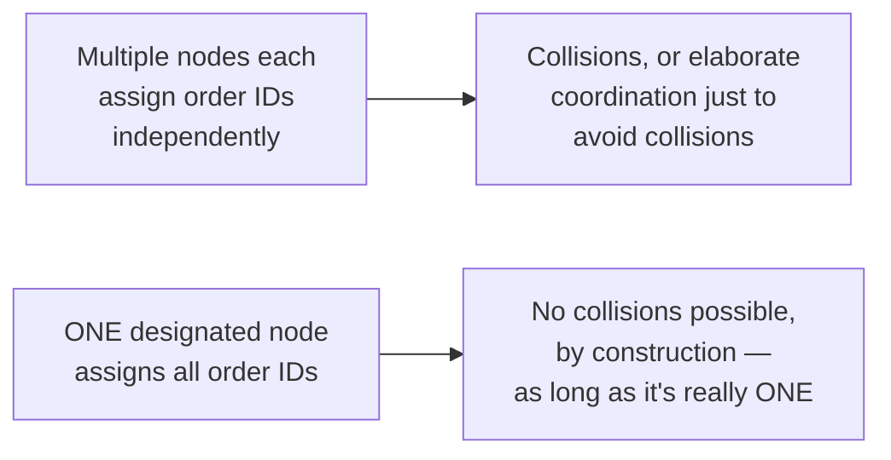
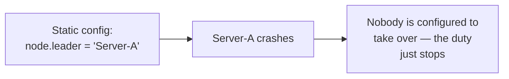
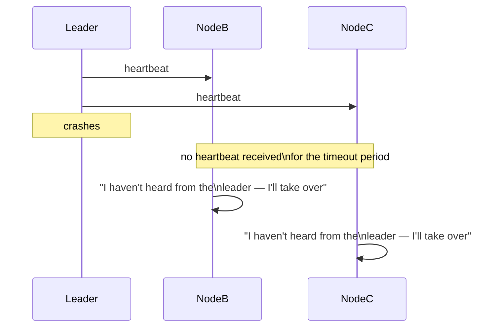
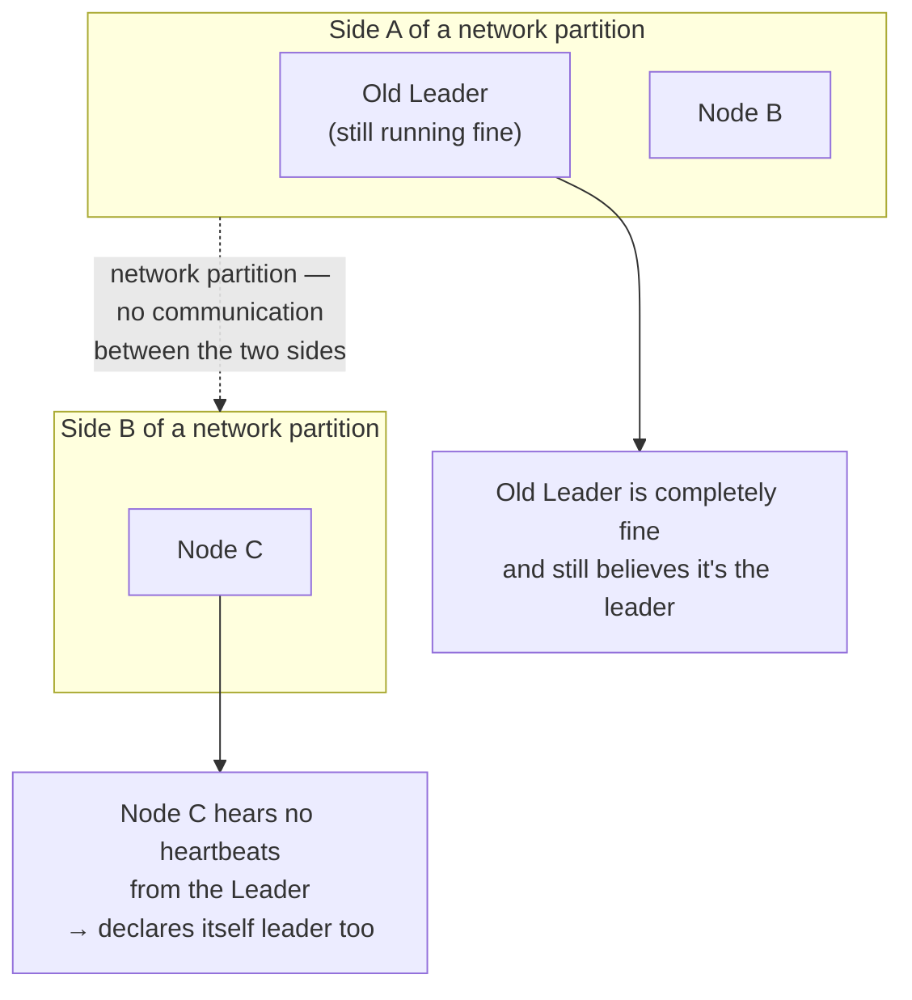
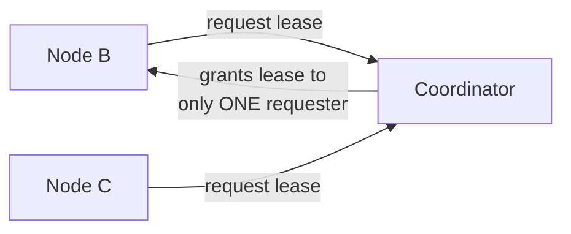
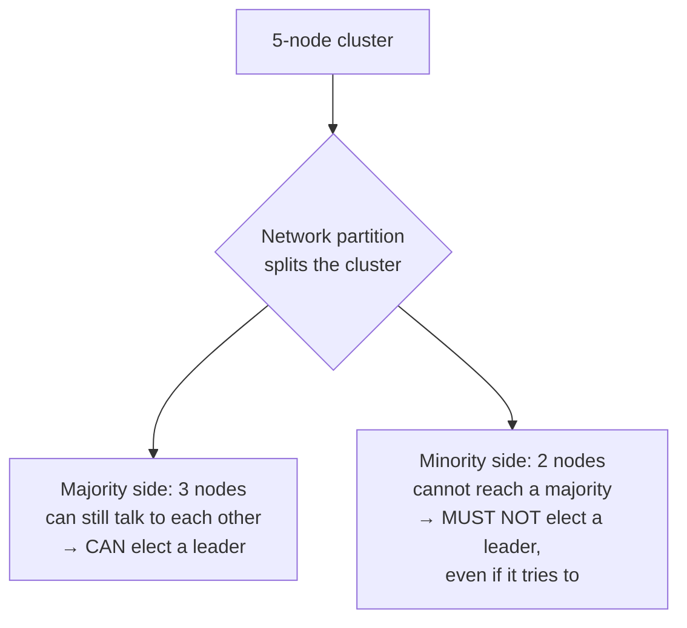
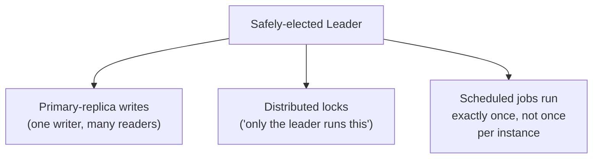
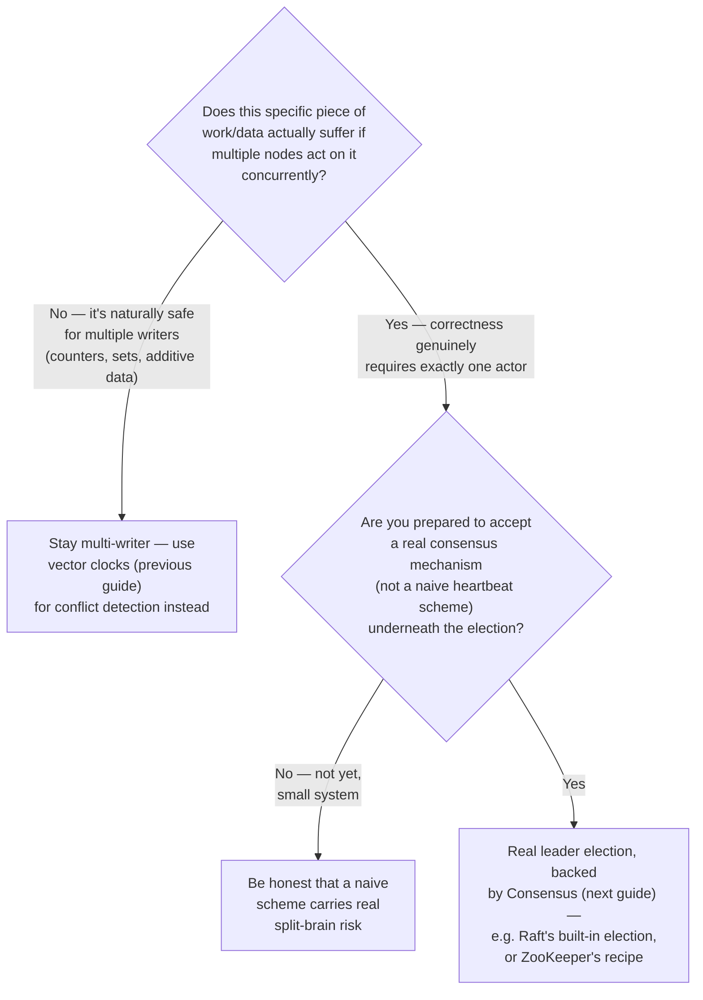
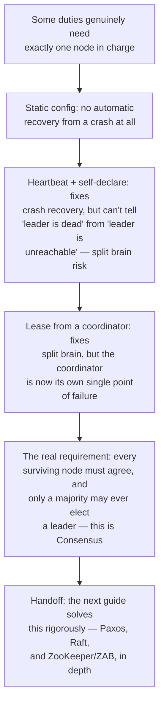

## The Story of Leader Election

The previous guide ended on a way out of vector clocks' complexity entirely: if only *one* node were ever allowed to accept writes for a given piece of data, concurrent conflicting writes couldn't happen at all — there'd be nothing to detect or merge. That's an appealing trade. It just raises a new question the bookstore's infrastructure team has to answer honestly: out of several identical, interchangeable replicas, how do you actually pick the one?

---

## Interview Cheat Sheet

**Leader election** is the problem of getting a group of nodes to agree on exactly one of them being "in charge" of some duty — and to keep that agreement correct even as nodes crash, restart, or lose contact with each other.

**Key facts:**
- Naive approaches (a fixed, pre-configured leader; "whoever notices silence first declares itself leader") all fail in the same way: they can't tell the difference between "the leader crashed" and "I just can't reach the leader right now," and network partitions make those two situations indistinguishable from one node's point of view
- **Split brain** — two nodes simultaneously believing they're the sole leader — is the specific, dangerous failure mode every leader election scheme has to prevent, not just detect after the fact
- A correct leader election requires **every surviving node to agree**, even during a partition, on who the leader is — which is a special case of the general agreement problem the next guide, Consensus Algorithms, solves rigorously
- A leader, once elected, typically becomes the single point of coordination for something specific — the sole writer for a shard, the sole scheduler for a cron job, the sole issuer of unique IDs — not a general-purpose "boss" of the whole system

**Common interview gotchas:**
- "The leader is down, elect a new one" sounds simple until you ask: down from whose perspective? A node on the other side of a network partition isn't down at all — it just can't be reached by *you*, which is a critical, easy-to-miss distinction
- A lease-based election scheme is only as safe as whatever's granting the lease — if that's a single coordinator, you've just moved the single point of failure, not removed it
- Having a leader at all is a trade-off, not a free win — it reintroduces a bottleneck and a failover pause, in exchange for eliminating the conflict-resolution complexity from the previous guide

**The core trade-off:** electing a leader trades away multi-writer availability (only one node can act at a time) for the simplicity of never having a concurrent-write conflict to resolve — and doing that election *safely*, without ever risking two leaders at once, is harder than it first appears.

---

## Chapter 1: Why Someone Needs to Be in Charge

Not every problem in the previous guide's world benefits from concurrent, multi-writer flexibility. Assigning a globally unique order ID, running the bookstore's nightly inventory-reconciliation job exactly once, or designating which database replica accepts writes for a given shard — all of these are naturally simpler if exactly one node handles them, rather than several nodes each doing their own version and needing to reconcile the results afterward.

The entire challenge packed into that last clause — "as long as it's really one" — is what this guide is about.

---

## Chapter 2: Naive Attempt 1 — Just Configure One

The simplest possible answer: pick a node ahead of time, write its address into every other node's configuration, and call it the leader. This works exactly until that node crashes — there's no mechanism for anyone else to notice and take over, so the moment it goes down, whatever duty it owned simply stops happening, indefinitely, until a human intervenes.

This isn't really "leader election" at all — it's the absence of it. But it's worth stating plainly as the baseline every real scheme has to beat: automatic recovery from a crash, without a human manually editing configuration and restarting things.

---

## Chapter 3: Naive Attempt 2 — Whoever Notices Silence First

A more automatic-sounding idea: the leader sends periodic **heartbeats**. Every other node watches for them, and if a node stops hearing heartbeats for some timeout, it assumes the leader is dead and declares itself the new leader.

Notice the problem baked directly into that diagram: **both** NodeB and NodeC can independently reach the same conclusion at the same time, and both can declare themselves leader simultaneously. If the "leader" actually just crashed, this is at worst a brief, resolvable race. But there's a far more dangerous version of this exact scenario:

This is **split brain**: the original leader never crashed at all — it's just unreachable from Node C's side of a partition. Now *two* nodes simultaneously believe they're the sole leader, and if this leader's duty is "the only node that accepts writes," both sides can accept different, conflicting writes at the same time — reintroducing the exact conflict problem the previous guide's vector clocks exist to detect, except now silently, because nobody involved thinks there's a conflict happening at all.

The uncomfortable truth this scenario exposes: **a single node, on its own, can never reliably distinguish "the leader crashed" from "I can't currently reach the leader."** Those two situations look identical from where that node is standing, and any scheme that lets one node unilaterally decide "the leader is gone, I'm taking over" is vulnerable to split brain the moment a partition — not a crash — is the actual cause.

---

## Chapter 4: Naive Attempt 3 — Ask a Referee for a Lease

A tempting fix: instead of letting nodes unilaterally declare themselves leader, require them to obtain a time-limited **lease** from some other, trusted coordinator — "you are the leader for the next 10 seconds; renew before it expires or someone else can claim it."

This genuinely fixes the split-brain scenario from Chapter 3 — the coordinator only ever grants one lease at a time, so at most one node can hold a valid leadership lease at once. But look at what this quietly did: it didn't remove the single point of failure, it **relocated** it. Now the coordinator itself needs to be reliable, always reachable, and never split-brained *itself* — which is the exact same problem this whole guide is trying to solve, just pushed one level up, unless that coordinator is built on something that already solves this problem correctly. That's not circular reasoning by accident — it's the honest shape of the problem, and it's exactly what motivates the next guide.

---

## Chapter 5: What Correctness Actually Requires

Step back and state the requirement precisely, instead of patching naive attempts one at a time: a correct leader election needs **every node that can still communicate with a majority of the cluster to agree on the same answer to "who is the leader," at all times — including during a partition** — and it needs a **minority** partition (one that can't reach a majority of the cluster) to be unable to elect a leader of its own at all.

This single rule — only a majority may ever elect a leader — is precisely what prevents split brain: a partition can produce at most *one* side with a majority of the original cluster (by simple arithmetic, you can't have two different groups both containing more than half the nodes), so at most one leader can ever legitimately exist at a time, even while the cluster is split. Getting every remaining node to correctly agree on this, safely, under real failures and real network delays, is not a small implementation detail — it's a rigorously studied problem with a name: **consensus**, and it's the entire subject of the next guide in this series.

---

## Chapter 6: What a Safely-Elected Leader Actually Buys You

Once leader election is solved correctly (next guide), it becomes the foundation for several familiar patterns:

**Primary-replica database replication**: exactly one node (the primary, chosen by election) accepts writes; the rest are read-only replicas that stream changes from it — eliminating the multi-writer conflicts the previous guide's vector clocks exist to handle, by construction, for any data that goes through this primary.

**Distributed locks**: "only the current leader may run this particular job" is a distributed lock in disguise — useful for ensuring a scheduled task (a nightly report, a cache-warming job) runs exactly once across a fleet, instead of once per instance.

**Coordination services**: rather than every application team implementing leader election themselves, systems like ZooKeeper (covered in depth in the next guide) expose leader election as a ready-made primitive, built once, correctly, on top of real consensus.

---

## Chapter 7: The Cost of Having a Leader at All

**A leader is a throughput ceiling.** If every write for a shard must go through one node, that node's own capacity becomes the hard ceiling on how fast that shard can accept writes — you can't just add more machines to push past it the way you could with the previous guide's multi-writer model.

**Failover has a real, if brief, unavailability window.** Even a correct election takes some time — detecting the old leader is gone, running the election protocol, having every node learn the new leader — during which writes to that shard are typically paused rather than risk being accepted by no one, or worse, by more than one node.

**A leader-based system only avoids split brain if the election underneath it is actually correct.** Reaching for "one node in charge" without a rigorous consensus mechanism underneath it — reverting to Chapter 3's naive heartbeat-and-declare approach — reintroduces every failure mode this guide just walked through, just with false confidence that it's been solved.

---

## Chapter 8: Do You Actually Need a Leader?

The decision that actually matters isn't "how do we elect a leader" in isolation — it's "does this specific job genuinely need exactly one actor, or would it be simpler and more available to make the underlying data safe for multiple concurrent writers instead." Only once the answer is genuinely "we need exactly one" does it make sense to pay for real, consensus-backed election.

---

## The Full Story, End to End

| | Static Config | Heartbeat + Self-Declare | Lease from a Coordinator | Consensus-Backed Election |
|---|---|---|---|---|
| Survives a crash | No | Yes | Yes | Yes |
| Split-brain risk | N/A (no failover at all) | High — can't distinguish crash from partition | Low, but coordinator is a new SPOF | Prevented by majority requirement |
| Single point of failure | The leader itself, permanently | The leader, until failover | The coordinator | None (survives minority failures) |
| Complexity | Trivial | Low, deceptively | Moderate | High, but correct |
| Best for | Never, for anything that matters | Nothing safety-critical | A stepping stone, not an end state | Anything where split brain is unacceptable |

**Where would you like to go next?** Natural threads from here:

- **Consensus Algorithms (Paxos, Raft, ZooKeeper)** — the rigorous, provably-correct solution to exactly the problem this guide raised, explained in full depth
- **Distributed Transactions** — how a safely-elected leader (or a replicated group of them) is used to coordinate atomic operations across multiple services
