## The Story of Consensus Algorithms

The previous guide ended on a precise, unresolved requirement: every surviving node must agree on who the leader is, and only a majority may ever elect one — and it left the actual mechanism as an open question. This guide is that mechanism. It is the longest, deepest guide in this series on purpose, because the question it answers — how do independent machines agree on anything at all, correctly, despite crashes and an unreliable network — is the single most load-bearing idea underneath almost everything else in distributed systems.

---

## Interview Cheat Sheet

**Consensus** is the problem of getting a group of nodes to agree on one value, safely, even if some nodes crash or messages are delayed — with the guarantee that the group never agrees on two different values, even during a partition.

**Key facts:**
- The safety of every consensus algorithm in this guide rests on one fact: **any two majorities out of the same N nodes are mathematically guaranteed to overlap in at least one node** — this single fact is why split brain (two conflicting decisions both "winning") is structurally impossible
- **Paxos** (Leslie Lamport, 1989) is the original, provably-correct algorithm — a two-phase protocol (Prepare/Promise, then Accept/Accepted) run against a majority of nodes — and it's notoriously difficult to implement correctly from the paper alone
- **Raft** (Ongaro & Ousterhout, 2014) was designed explicitly for understandability — it decomposes the problem into leader election, log replication, and safety, with a single strong leader driving both election and replication
- **ZooKeeper** (via the ZAB protocol) packages consensus as a ready-made coordination *service* with primitives — ephemeral and sequential znodes — that applications use directly, instead of embedding a consensus library themselves

**Common interview gotchas:**
- Consensus algorithms don't defy the FLP impossibility result (no algorithm can guarantee both safety and termination in a fully asynchronous network with even one failure) — they sidestep it by giving up *guaranteed* termination, blocking during a minority partition rather than risking an incorrect decision
- Raft's leader election isn't "first node to respond wins" — a candidate must have a log at least as up-to-date as a majority of voters, which is what prevents an out-of-date node from ever becoming leader and erasing committed data
- An even-sized cluster (4 nodes) doesn't tolerate more failures than the next odd size down (3 nodes) — both only tolerate 1 failure before losing a majority — so real deployments almost always use odd sizes (3, 5, 7) to avoid paying for capacity that buys nothing
- ZooKeeper's leader-election recipe has a specific, deliberate detail: each candidate watches only the node immediately before it in sequence, not the current leader directly — avoiding a "herd" of every waiting node reacting to every single departure

**The core trade-off:** consensus gives you a provably safe, single source of truth across a cluster — at the cost of every agreed decision needing a majority round trip, and the cluster refusing to make progress at all if a majority can't be reached.

---

## Chapter 1: Stating the Problem Precisely

The previous guide left this exact requirement on the table: get every node that can still reach a majority of the cluster to agree on a single value (in that case, "who is the leader"), and guarantee that a minority partition can never independently agree on a *different* value at the same time.

Generalized beyond just leader election, this is the **consensus problem**: a group of nodes needs to agree on one value, chosen from among proposals any of them might put forward, with three properties that must all hold at once:

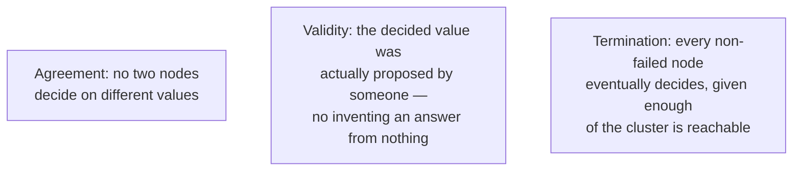

Leader election is one specific instance of this general problem (the "value" being agreed on is a node's identity). But the exact same machinery, once built, also answers "what's the next entry in this replicated log," "did this transaction commit or abort," and "what's the current cluster membership" — which is why consensus, not leader election specifically, is the concept worth understanding at its root.

---

## Chapter 2: Why Majority Is the Magic Number

Every algorithm in this guide leans on one simple, powerful fact, so it's worth proving to yourself before looking at any protocol: **in a cluster of N nodes, any two groups that each contain a majority (more than N/2 nodes) are mathematically guaranteed to share at least one common node.**

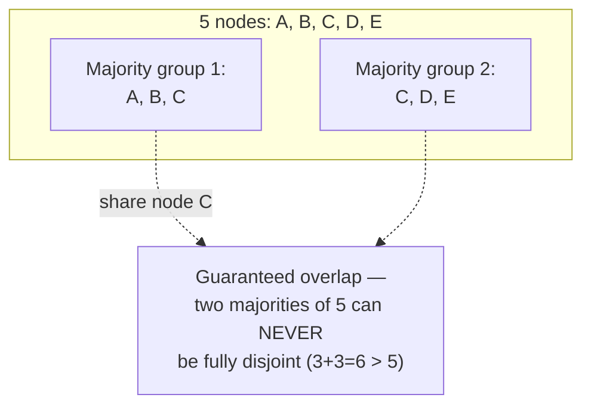

The arithmetic is simple but the consequence is everything: if two majority-sized groups together would need more nodes than actually exist in the cluster, they cannot possibly be made of entirely different nodes — some node has to be counted in both. That shared node is what makes consensus work: it's a witness that was present for *both* decisions, and by requiring that witness to behave honestly (never contradict a decision it already helped make), every algorithm below guarantees the two groups can never have agreed on two different things.

This is also, precisely, why the previous guide's leader election rule works: a network partition can produce at most one side with a genuine majority of the original cluster — so at most one side can ever complete a majority-based decision, and split brain becomes structurally impossible, not just unlikely.

---

## Chapter 3: Paxos — The Original, and Why It's Hard

**Paxos**, described by Leslie Lamport in a 1989 paper, was the first widely studied algorithm to solve consensus rigorously. It defines three roles — **Proposers** (suggest values), **Acceptors** (vote on values, and collectively hold the decision), and **Learners** (find out what was decided) — and it works in two phases.

### Phase 1 — Prepare / Promise

A Proposer picks a **proposal number** N (higher than any it has used before) and sends `Prepare(N)` to a majority of Acceptors. Each Acceptor that receives it makes a promise: *"I will not accept any proposal numbered less than N from now on"* — and, critically, if it has already accepted some earlier proposal, it reports that back too.

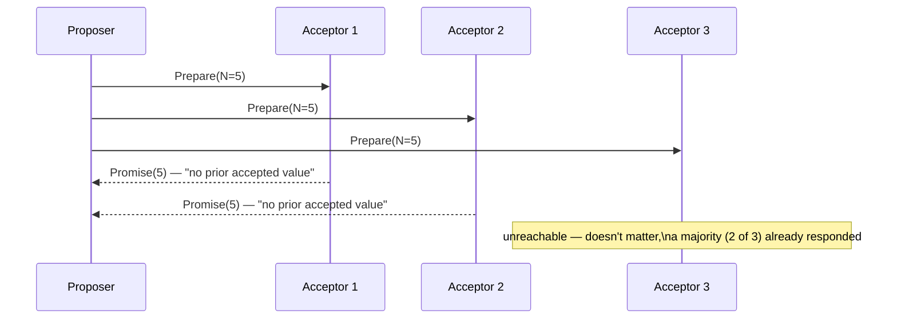

### Phase 2 — Accept / Accepted

If the Proposer received promises from a majority, it moves to Phase 2 and sends `Accept(N, V)` — but the choice of **V** has a rule that's easy to miss and is the entire reason Paxos is safe: if *any* Acceptor reported an already-accepted value during Phase 1, the Proposer **must** propose that value (specifically, the value from the highest-numbered proposal reported), not its own preferred value. Only if every Acceptor reported nothing already accepted is the Proposer free to propose its own value.

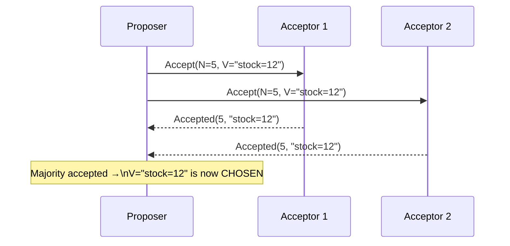

**Why this specific rule makes it safe:** suppose a value V was already chosen by some earlier majority. Any future Proposer that completes Phase 1 against a (possibly different) majority is guaranteed, by Chapter 2's overlap fact, to hear from at least one Acceptor that already accepted V. That forces the new Proposer to re-propose V, not something else — so once a value is chosen, every subsequent round is mathematically forced to confirm the same value, never a conflicting one. This is the actual mechanism, not a hand-wave: safety comes directly from combining the majority-overlap fact with the rule that a Proposer must adopt whatever value it discovers was already accepted.

### Why "Basic" Paxos Isn't Enough on Its Own

Running this full two-phase exchange for every single value a system needs to agree on — one election ID, one log entry, one at a time — costs two full round trips each time, which is expensive if you need to agree on a continuous stream of values (like every entry in a replicated log). Real systems use **Multi-Paxos**: elect a stable, long-lived Proposer (in effect, a leader) once, and let it skip Phase 1 for a whole sequence of subsequent values, only re-running Phase 1 when leadership actually changes. This optimization is exactly where the conceptual line to Raft's design begins — and it's also where Lamport's original paper left the most room for interpretation, which is a large part of why so many independent Paxos implementations over the following two decades made subtly different, and sometimes subtly incorrect, choices about how to actually build it.

---

## Chapter 4: Raft — Designed to Be Understood

Frustrated by exactly that gap between "provably correct" and "practically implementable," Diego Ongaro and John Ousterhout published **Raft** in 2014, under the explicit banner of designing for understandability first. Raft decomposes consensus into three separate, more approachable sub-problems: **leader election**, **log replication**, and **safety** — and instead of Paxos's more symmetric role model, Raft has an explicit, single strong leader at all times.

### Node States and Terms

Every Raft node is in exactly one of three states:

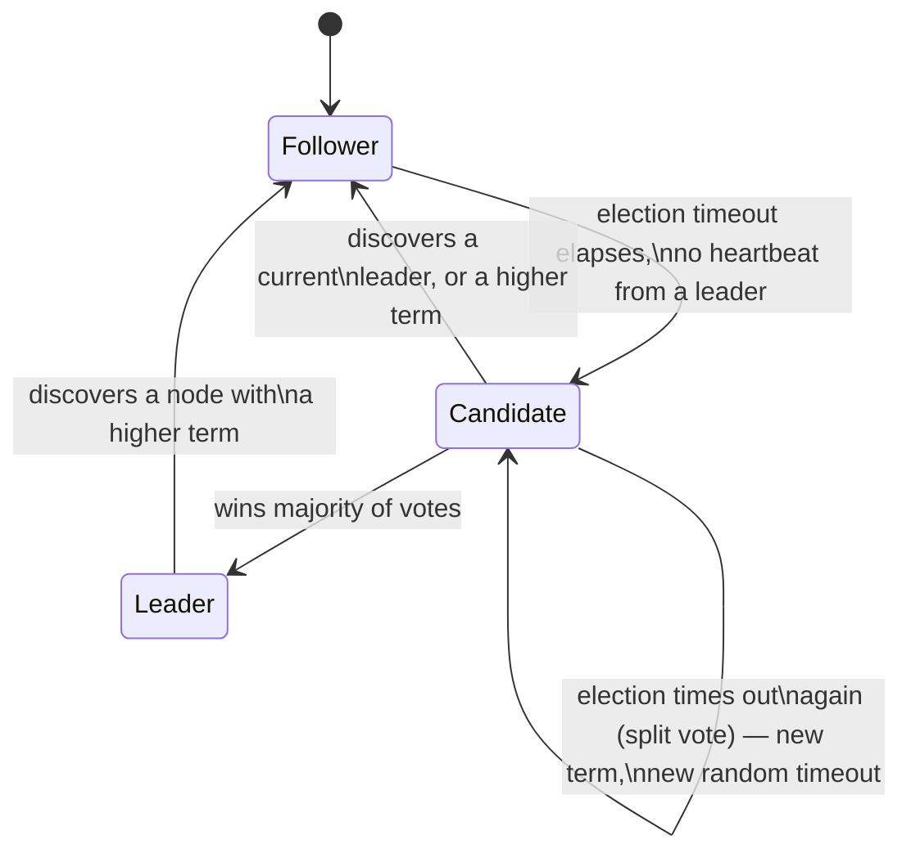

Every message in Raft carries a **term** — a monotonically increasing number, incremented on every new election, acting as a logical clock that lets any node instantly recognize a stale message from an old leader or a failed election attempt (if a node ever sees a term higher than its own, it immediately updates and steps down to Follower).

### Leader Election, Mechanically

A Follower that hears no heartbeat from a leader within its **election timeout** — randomized, commonly in a range like 150–300ms specifically so different nodes don't all time out simultaneously — becomes a **Candidate**: it increments its term, votes for itself, and sends `RequestVote(term, candidateId, lastLogIndex, lastLogTerm)` to every other node.

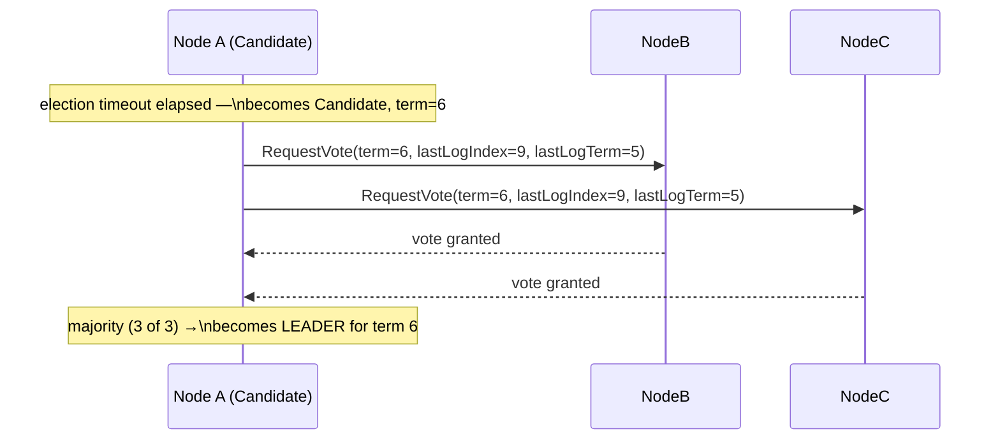

A node grants its vote only if: the request's term is at least as high as its own, it hasn't already voted for someone else in this term, **and** the candidate's log is at least as up-to-date as its own — compare the term of each node's last log entry first, and if those match, compare log length. This last condition, the **election restriction**, is what guarantees a newly-elected leader already holds every entry any previous majority has committed — tie this directly back to Chapter 2: because committing an entry requires a majority, and winning an election requires a majority, and any two majorities out of the same cluster must overlap in at least one node, the voter that overlaps between "who committed the entry" and "who voted for the new leader" is guaranteed to have rejected any candidate whose log doesn't already contain that entry. A leader can never accidentally win an election while missing data the cluster has already agreed on.

### Handling a Split Vote

If multiple Followers become Candidates at nearly the same moment (a genuine possibility, though the randomized timeout makes it rare) and votes split across them so no one reaches a majority, the term simply times out with no leader elected, and every Candidate reverts and retries with a fresh, independently randomized timeout.

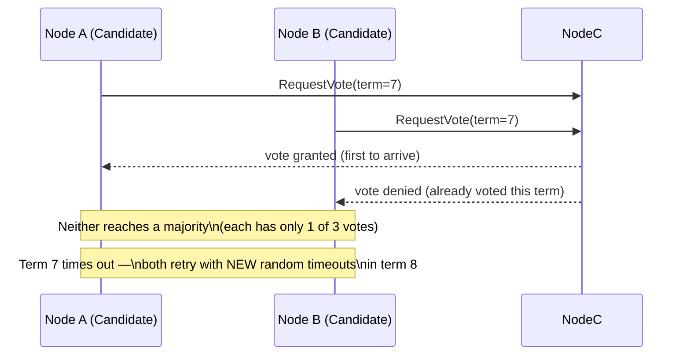

Because each Candidate's next timeout is independently re-randomized, the probability that the *same* split happens repeatedly, round after round, shrinks fast — this is a probabilistic, not guaranteed, resolution, but in practice it converges within a handful of rounds essentially always.

### Log Replication

Once elected, the leader is the only node that accepts client commands. It appends each one to its own log first, then replicates it to Followers via `AppendEntries(term, prevLogIndex, prevLogTerm, entries[], leaderCommit)` RPCs, sent in parallel.

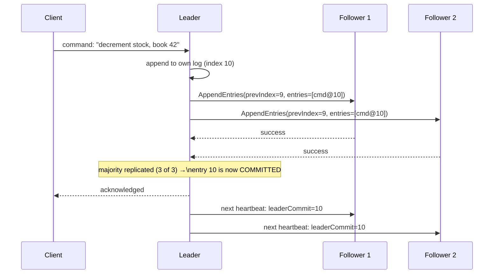

An entry is considered **committed** the moment a majority of nodes (including the leader) have it in their log — at that point it's durable and safe to apply to the actual state machine, because Chapter 2's overlap guarantee means any future leader is guaranteed to already have it.

### The Log Matching Property

Every `AppendEntries` call includes the term and index of the entry immediately *before* the new ones (`prevLogIndex`, `prevLogTerm`). A Follower rejects the call if its own log doesn't have a matching entry at that exact position — forcing the leader to walk backward and resend from further back until it finds a point of agreement, then overwrite anything conflicting after that point.

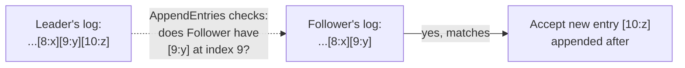

This works because Raft guarantees a stronger fact than it first appears to check: **if two logs contain an entry with the same index and the same term, every entry before that point in both logs is guaranteed to be identical too.** A leader never creates more than one entry per index within a single term, so a match at one position is proof the entire history up to that position already agrees — meaning the single-position check in `AppendEntries` is sufficient to guarantee the whole prefix matches, without ever having to compare full logs entry by entry.

### The Subtlety of Which Entries a New Leader Can Commit

One more genuinely important detail: a newly-elected leader is *not* allowed to declare an entry from a **previous** term committed purely because a majority now has it replicated — it may only directly commit entries from **its own current term**. Once a current-term entry is committed, every entry before it (including ones from earlier terms) becomes committed too, indirectly, via the Log Matching Property. This exists to close a rare but real edge case where an entry replicated to a majority under an old, since-crashed leader could otherwise end up silently overwritten by a later leader that never actually learned it was supposed to be permanent — a subtle safety detail that's exactly the kind of thing that made hand-rolled Paxos implementations fragile, and that Raft's paper spells out explicitly so implementers don't have to discover it themselves through a production incident.

### What Raft Actually Gave the World

Real systems built directly on Raft, citing its understandability as a deciding factor: **etcd** (the consensus-backed key-value store Kubernetes itself is built on), **Consul** (HashiCorp's service-discovery and coordination tool), and **CockroachDB** (which runs one independent Raft group per data shard — the exact "Paxos/Raft group per shard" architecture the Important Papers guide later in this series covers for Spanner).

---

## Chapter 5: ZooKeeper — Consensus as a Service

Paxos and Raft are algorithms you implement (or embed a library implementing) inside your own system. **Apache ZooKeeper** takes a different, complementary angle: it's a standalone coordination *service* — you run a small ZooKeeper cluster, and your application talks to it over the network to get leader election, distributed locks, and configuration management as ready-made primitives, without ever implementing consensus yourself.

### The Data Model — Znodes

ZooKeeper exposes a hierarchical namespace, much like a filesystem, made of **znodes**. Two flags on a znode matter enormously for building coordination primitives:

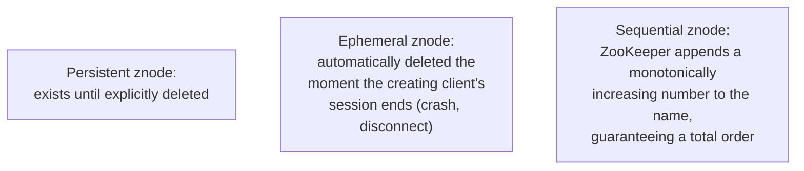

An **ephemeral** znode is the key primitive for liveness: if the client that created it crashes or its session times out, ZooKeeper itself removes the znode — no heartbeat-and-guess scheme required (Chapter 3 of the previous guide's problem, solved as an infrastructure primitive). A **sequential** znode gives every candidate a guaranteed, gap-free ordering with no coordination between them required to get it.

### ZAB — The Protocol Underneath

Internally, ZooKeeper's consistency is provided by **ZAB** (ZooKeeper Atomic Broadcast) — conceptually close to Multi-Paxos with a stable leader, the same shape Raft converged on independently: a single leader proposes state changes in strict order, followers acknowledge, and once a majority acknowledge, the change is committed and broadcast to everyone. The similarity to Raft's `AppendEntries` flow is not a coincidence — both are solving the same underlying problem, and both arrived at "one leader, majority-acknowledged, ordered log" as the practical shape of a working answer.

### The Leader Election Recipe, Built From These Primitives

Here's where ZooKeeper's design pays off concretely: leader election isn't a special built-in feature — it's a **recipe** applications build themselves out of ephemeral + sequential znodes, and it contains a genuinely clever detail worth knowing.

Every candidate creates an ephemeral, sequential znode under a known parent path (e.g., `/election/node-`), getting back a name like `node-0000000042`. The candidate with the **lowest** sequence number among current children is the leader.

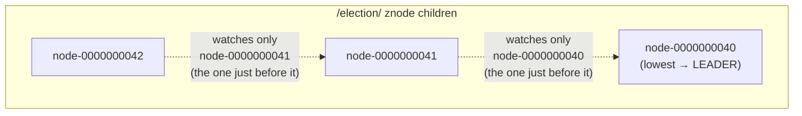

The subtle, deliberate detail: each waiting candidate sets a **watch** only on the znode immediately *before* its own in sequence — not on the current leader directly. If the leader (`node-40`) crashes, only `node-41` (the one watching it) gets notified, checks if it's now the lowest, and becomes leader; `node-42` is completely undisturbed, because it's watching `node-41`, which is still there. If every waiting node instead watched the leader directly, one crash would notify *all* of them simultaneously — a **herd effect** where every candidate wakes up, re-checks the full list, and hammers ZooKeeper at once, even though only one of them actually needed to act. Watching your immediate predecessor, rather than the leader, turns a crash into a clean, one-node, chain-reaction handoff instead of a stampede.

### Real Systems

**Apache Kafka** historically depended on ZooKeeper for exactly this kind of coordination — electing a controller broker and tracking cluster metadata — though newer Kafka versions have moved to **KRaft** (Kafka's own built-in Raft implementation), removing the separate ZooKeeper dependency entirely; a good, current example of a system moving from "depend on a coordination service" to "embed the consensus algorithm directly." **Apache HBase** also relies on ZooKeeper for master election and region-server coordination.

---

## Chapter 6: Paxos vs. Raft vs. ZooKeeper — Side by Side

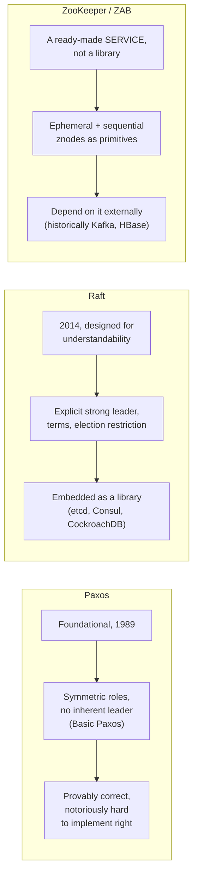

| | Paxos | Raft | ZooKeeper (ZAB) |
|---|---|---|---|
| What it is | An algorithm | An algorithm | A coordination service |
| Leader model | No inherent leader (Basic); optimized with one (Multi-Paxos) | Explicit, always | Explicit, internal to the service |
| Primary goal | Theoretical correctness, first | Understandability, first | Ready-to-use primitives for applications |
| How you use it | Implement it yourself, carefully | Embed a library (or a system built on it) | Run the service, call its client API |
| Real examples | Google Chubby, early Spanner | etcd, Consul, CockroachDB | Kafka (historically), HBase |

---

## Chapter 7: The Cost of Consensus

**Every write pays a majority round trip, minimum.** Whether it's Paxos's two phases, Raft's `AppendEntries`, or ZAB's proposal/ack, no write is safely committed until a majority of nodes have durably recorded it — meaning at least one network round trip to the slowest node in that majority, every single time, with no way around it without weakening the safety guarantee itself.

**A minority partition simply stops.** This is by design, not a bug: a group that can't reach a majority of the cluster must refuse to make progress, because allowing it to would risk exactly the split-brain scenario the previous guide's Chapter 5 ruled out. Consensus-backed systems choose consistency over availability during a partition — the CP side of the CAP theorem, covered in full in `database/DistributedTransactions/README.md` in this repository.

**Cluster size has a real, easy-to-get-wrong sweet spot.** A 3-node cluster tolerates 1 failure before losing majority (needs 2 of 3). A 4-node cluster *also* only tolerates 1 failure before losing majority (needs 3 of 4) — you paid for a whole extra node's worth of hardware and replication traffic and gained *zero* additional fault tolerance. This is why real deployments almost always use odd sizes (3, 5, 7): each additional pair of nodes (not single node) is what actually buys one more tolerated failure.

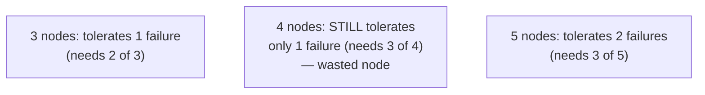

**Consensus doesn't defy FLP — it sidesteps it, deliberately.** The Fischer-Lynch-Paterson (FLP) impossibility result, covered in depth in `database/DistributedTransactions/README.md`, proves no algorithm can guarantee both safety and termination in a fully asynchronous network if even one process can fail. Every algorithm in this guide resolves that by relaxing termination: they guarantee progress *when a majority is reachable*, and accept blocking otherwise, rather than risking an unsafe decision just to keep moving.

---

## Chapter 8: When Do You Actually Need This?

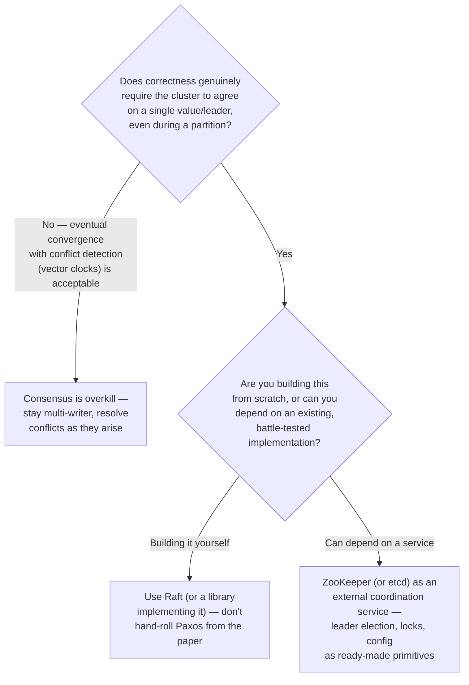

The honest, hard-won lesson from decades of production consensus systems: **never hand-implement Paxos or Raft from a paper for a real system if you can avoid it.** The subtleties covered in this guide — the election restriction, the current-term-only commit rule, the log matching property — are exactly the kind of details that are easy to get right in a diagram and easy to get catastrophically wrong in code under real failure conditions. Reach for a mature, widely-used implementation (etcd, a Raft library, ZooKeeper) rather than reproducing decades of hard-won correctness work from scratch. For the full, exhaustive Raft walkthrough with additional worked examples, and how these ideas connect into Spanner's globally-distributed architecture, `database/replication/claude.md` in this repository goes even further into the implementation-level detail.

---

## The Full Story, End to End

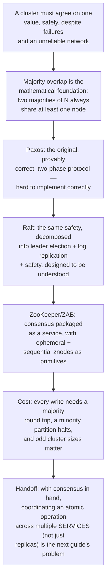

| | Paxos | Raft | ZooKeeper (ZAB) |
|---|---|---|---|
| Safety guarantee | Majority-based, provably correct | Majority-based, provably correct | Majority-based, provably correct |
| Ease of correct implementation | Low — many subtle pitfalls | Higher — explicitly designed for this | N/A — you depend on it, not implement it |
| Leader | Optional (Basic Paxos), common in practice (Multi-Paxos) | Always, explicit | Always, internal to the service |
| Consumed as | An algorithm you implement/embed | A library or a system built on it | A running coordination service |
| Best known for | Google Chubby, theoretical foundation | etcd, Consul, CockroachDB | Historically Kafka, HBase |

**Where would you like to go next?** Natural threads from here:

- **Distributed Transactions** — using this exact consensus machinery to replicate a transaction coordinator itself, removing 2PC's single point of failure
- **Important Papers (DynamoDB & Spanner)** — Spanner's architecture is literally a Paxos group per shard, combined with a mechanism (TrueTime) covered in full in that guide
