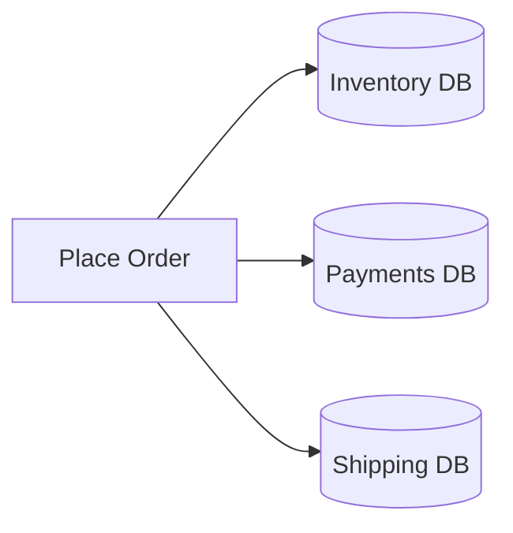
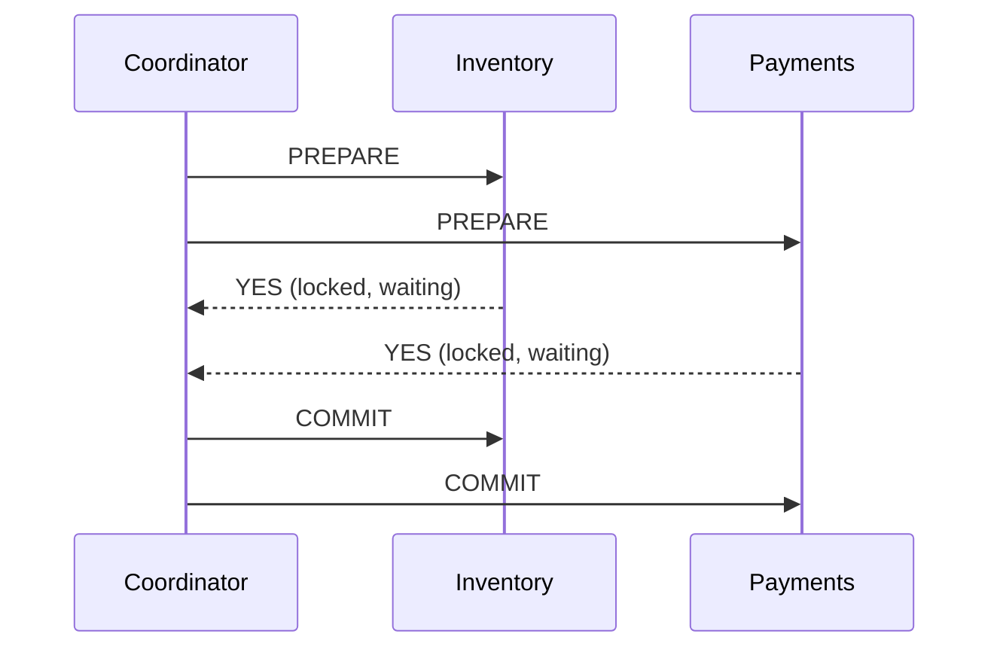
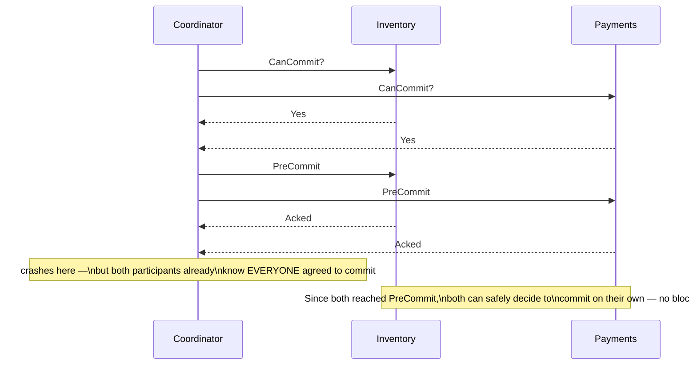
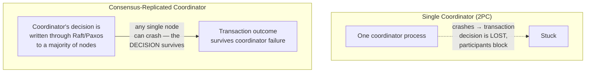
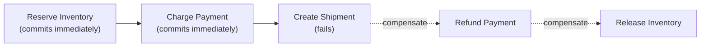
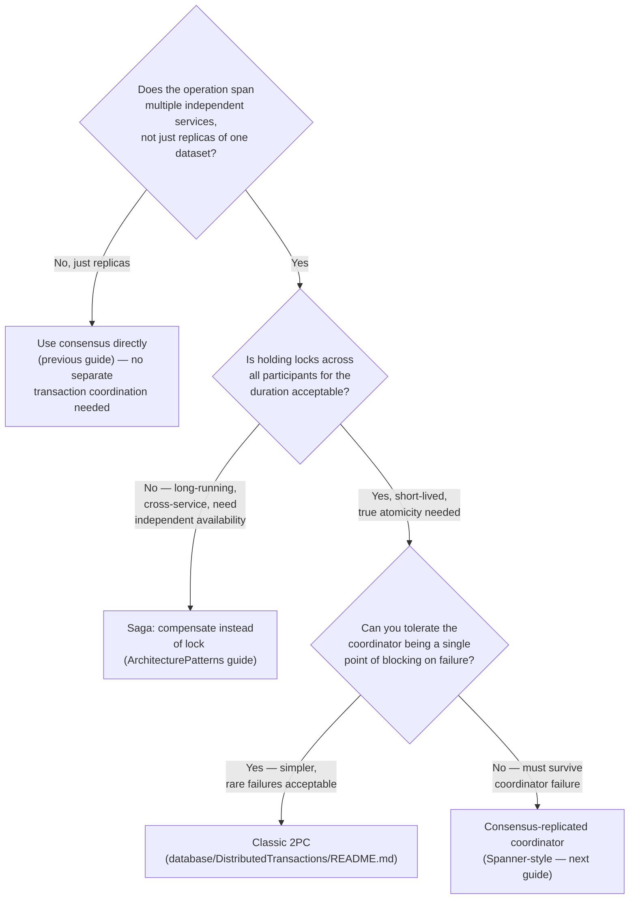
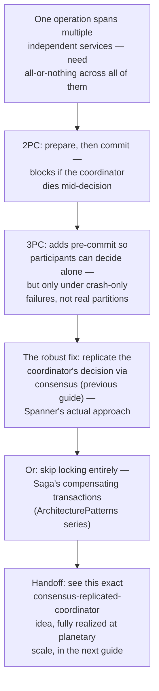

## The Story of Distributed Transactions

Consensus, from the previous guide, answers "how do a group of replicas agree on one value." A slightly different, related question remains: when one *operation* touches several independent services — each with their own database, each potentially wanting to say no — how do you get all of them to commit, or all of them to abort, together? This is the same problem the ArchitecturePatterns series' Saga guide opened with; this guide fills in the piece that sits between a naive coordinator and consensus-backed correctness.

---

## Interview Cheat Sheet

**Distributed transactions** coordinate an atomic outcome (all-or-nothing) across multiple independent nodes or services — and every real approach to this problem trades off some combination of blocking risk, latency, and isolation to get there.

**Key facts:**
- **Two-Phase Commit (2PC)** — prepare, then commit — is the classic approach, and it has one well-known failure mode: if the coordinator dies between phases, participants that already voted "yes" are stuck holding locks, unable to safely decide anything on their own
- **Three-Phase Commit (3PC)** adds an extra "pre-commit" phase specifically to let participants safely decide to commit on their own if the coordinator disappears — but it only actually works under a narrower assumption (crash failures, not network partitions) than most real systems can guarantee
- The genuinely robust fix is to **replicate the coordinator itself** using the consensus machinery from the previous guide, so "commit or abort" survives any single node's failure — this is exactly what Google Spanner does, covered in full in the next guide
- The **Saga pattern**, covered in complete depth in the ArchitecturePatterns series, sidesteps the whole problem by never holding a distributed lock at all — committing each step independently and compensating if a later one fails

**Common interview gotchas:**
- 2PC's blocking problem is specifically about the **coordinator** crashing after participants vote yes — participants crashing is a much easier case (the coordinator just retries)
- 3PC is rarely used in real production systems today — it reduces blocking under crash failures, but a network partition (not just a crash) can still let two sides of the same transaction reach different decisions, which is why most modern systems reach for consensus-backed coordination instead
- "Distributed transaction" and "Saga" are not the same tool for the same job — one gives you real atomicity at the cost of locking and availability; the other gives you availability and service independence at the cost of a weaker, compensatable guarantee

**The core trade-off:** the stronger the atomicity guarantee you want across multiple nodes, the more coordination (and therefore latency, and therefore reduced availability during a failure) you have to accept — there is no version of this problem that removes the trade-off entirely, only different places to put it.

---

## Chapter 1: One Operation, Several Independent Databases

Recall the exact scenario the Saga guide opened with: placing an order touches Inventory's database, Payments' database, and Shipping's database — three independent systems, no shared transaction log, and a real risk that some subset of them commit while others don't.

The previous guide solved a related but distinct problem — getting *replicas of the same data* to agree. This chapter's problem is getting *independent services*, each the authority over its own data, to agree on one shared outcome: commit everywhere, or abort everywhere, together.

---

## Chapter 2: Two-Phase Commit, Briefly Recapped

**Two-Phase Commit (2PC)** is the classical answer: a coordinator asks every participant to `PREPARE` (lock its resources and vote yes/no), and only after collecting unanimous yes votes does it tell everyone to `COMMIT`.

The well-known failure mode: if the coordinator crashes **after** collecting yes votes but **before** sending the commit decision, every participant is stuck — locks held, no idea whether to commit or abort, unable to safely decide on their own, because either decision could be wrong without knowing what the coordinator actually decided. This exact mechanism, the blocking problem, and Google's Percolator-based alternative are covered in full, byte-level depth in this repository's `database/DistributedTransactions/README.md` — this guide won't re-derive it, only build on it.

---

## Chapter 3: Three-Phase Commit — A Genuine Attempt to Fix Blocking

**Three-Phase Commit (3PC)** inserts an extra phase between prepare and commit, specifically to close 2PC's blocking gap: `CanCommit` (a preliminary check, similar to prepare), then `PreCommit` (once everyone says yes, the coordinator tells everyone "we're going to commit" and waits for acknowledgment — but doesn't actually commit yet), and only then `DoCommit`.

The insight: by the time a participant has reached `PreCommit`, it *knows* every other participant also voted yes (that's the only way the coordinator would have sent `PreCommit` at all) — so if the coordinator then disappears, the participant can safely commit on its own, confident no one else is going to abort.

This genuinely reduces blocking — under one specific assumption: that failures are **crashes**, and that a timeout reliably means "that node is dead," not "that node is just unreachable right now." The moment a real network **partition** enters the picture (not a crash, just an unreachable node — precisely the distinction the Leader Election guide spent a whole chapter on), 3PC's fix quietly breaks: a participant on one side of a partition, having reached `PreCommit`, might commit — while a differently-partitioned coordinator, unable to reach that participant, decides to abort the transaction instead, believing it timed out. Both sides act correctly on the information they have; the outcome still diverges. This is precisely the same FLP-and-partition-tolerance territory `database/DistributedTransactions/README.md` covers in its CAP/PACELC chapters — 3PC narrows the blocking window under crashes, but it does not remove the fundamental tension a real, partition-prone network imposes. In practice, this is exactly why 3PC sees little production use today — the assumption it needs (crash-only failures, no partitions) rarely holds for real infrastructure.

---

## Chapter 4: The Robust Fix — Replicate the Coordinator Itself

The previous guide's whole point was building a mechanism that lets a *value* survive any single node's failure, safely, via majority agreement. Applied here, the actual fix for 2PC's single-coordinator blocking problem is direct: **don't run the coordinator on one machine — replicate its decision using consensus, so "commit or abort" is itself backed by a majority, the same way a Raft-elected leader's log entries are.**

This is exactly what Google's **Spanner** does — the transaction coordinator's commit/abort decision for each participating shard is itself replicated via Paxos, so a single coordinator machine crashing doesn't lose the decision or leave anyone blocked. The next guide in this series covers Spanner's full architecture, including how this combines with its other headline mechanism, TrueTime, to give globally-consistent transactions.

---

## Chapter 5: The Saga Alternative, Briefly Recapped

Everything above assumes you're willing to hold locks across the whole operation until every participant agrees. The **Saga pattern** — covered in complete, dedicated depth in the ArchitecturePatterns series' Saga Pattern guide — takes the opposite approach entirely: never hold a distributed lock at all. Each step commits for real, immediately, on its own; if a later step fails, previously-committed steps are undone via **compensating transactions** rather than rolled back.

The trade this makes, stated plainly: full service independence and no cross-service locking, in exchange for giving up true atomicity (in-between states are real and visible to the rest of the system) and needing a designed compensating action for every step. That guide covers choreography vs. orchestration, the "hardest-to-undo-last" ordering trick, and real examples (Netflix's Conductor, Uber's trip-booking flow) in full.

---

## Chapter 6: The Family Tree — Which One Do You Actually Reach For?

Four real answers to the same underlying question, each paying a different cost: **2PC** is simple and well-understood but blocks if the coordinator dies; **3PC** narrows that blocking window under crash-only failures but doesn't hold up under real network partitions, which is why it sees little production use; a **consensus-replicated coordinator** removes the blocking risk entirely at the cost of running (or depending on) a real consensus system; and **Saga** avoids the locking problem altogether by giving up strict atomicity in favor of compensations.

---

## The Full Story, End to End

| | 2PC | 3PC | Consensus-Replicated Coordinator | Saga |
|---|---|---|---|---|
| Atomicity | True | True | True | Approximate (compensated) |
| Blocks on coordinator failure | Yes | Reduced (crash-only) | No | N/A — no central coordinator |
| Survives network partitions safely | No | No (assumption breaks) | Yes | Yes (by design) |
| Locking | Held across all participants | Held across all participants | Held across all participants | None — commits happen independently |
| Best for | Single datacenter, few participants, short-lived | Rarely used in practice today | Cross-region, must survive failures (Spanner) | Long-running, cross-service, no shared transaction manager |

**Where would you like to go next?** Natural threads from here:

- **Important Papers (DynamoDB & Spanner)** — Spanner's real architecture: Paxos-replicated shards plus TrueTime, explained in full
- **Distributed Transactions deep dive** — the complete 2PC, Percolator, FLP, and CAP/PACELC treatment already in `database/DistributedTransactions/README.md`
