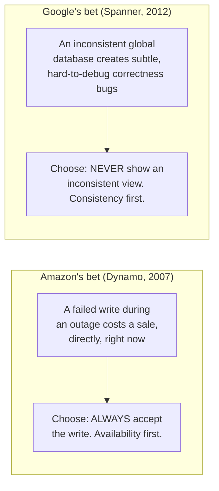
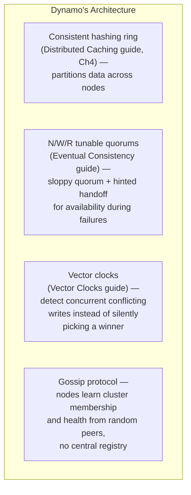
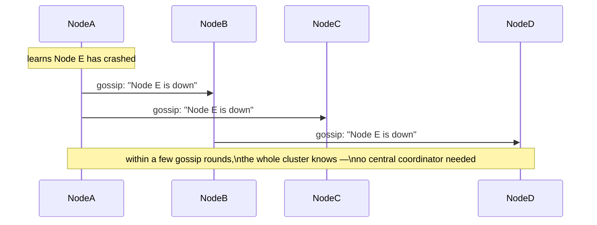
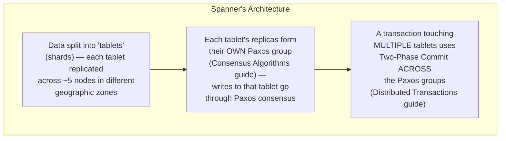
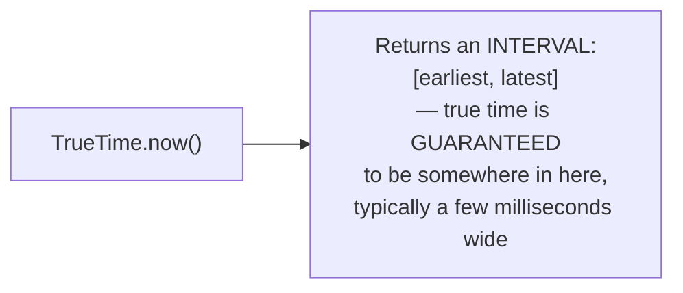
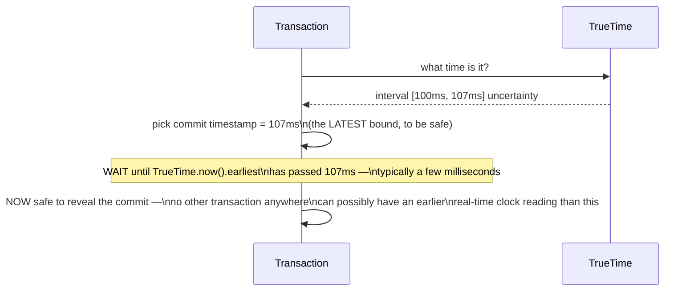
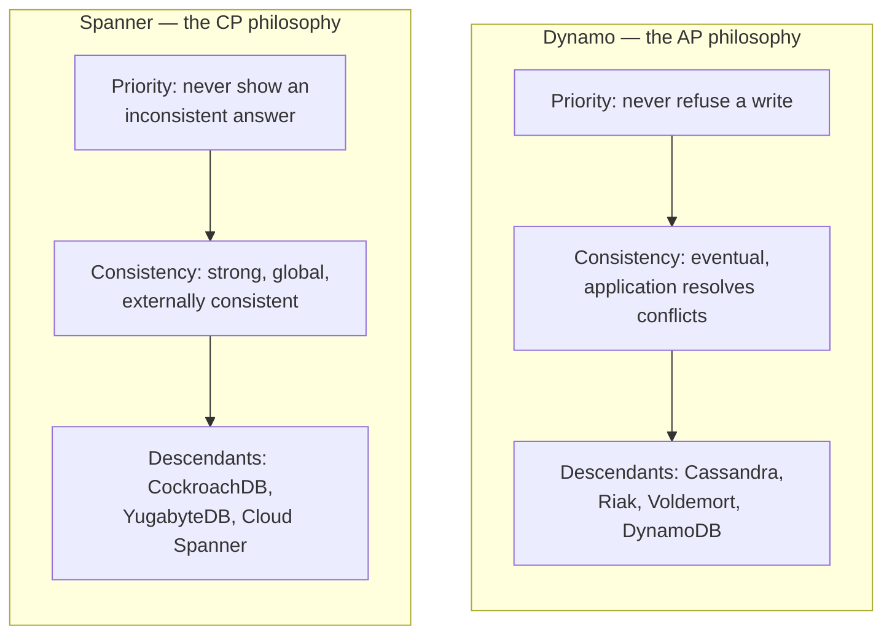
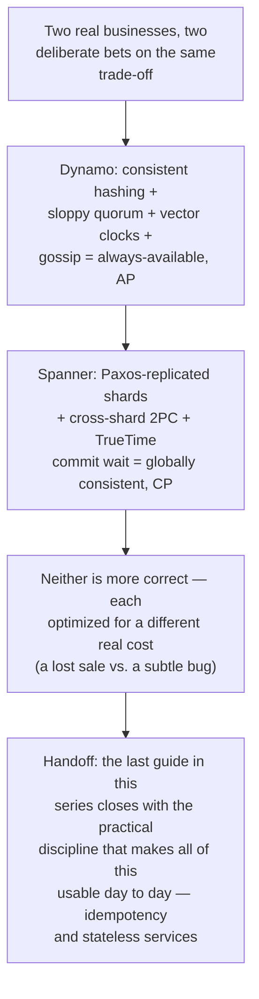

## The Story of the Important Papers — Dynamo and Spanner

Every guide in this series so far has introduced one idea at a time: caching, quorums, vector clocks, leader election, consensus, atomic commit. This guide is where two real, famous systems show up and reveal that they aren't a random assortment of techniques — they're two complete, opposing philosophies, each built by combining several of the exact ideas already covered, aimed at the same underlying question: what do you actually build, when "eventually consistent and always available" and "always consistent, globally" are both real, defensible answers?

---

## Interview Cheat Sheet

**Amazon's Dynamo paper (2007)** and **Google's Spanner paper (2012)** are the two most commonly cited real-world systems in distributed systems interviews — not because they're the only ones that matter, but because they represent the AP and CP choices, respectively, taken to their most complete, deliberate extremes.

**Key facts:**
- **Dynamo** chose Availability over Consistency, explicitly, because Amazon decided a failed "add to cart" costs a sale directly — it combines consistent hashing, sloppy quorums with hinted handoff, vector clocks, and gossip-based membership into one AP system
- **Spanner** chose Consistency over Availability during a partition, explicitly, because Google needed a globally-distributed database with real ACID transactions — it combines Paxos-replicated shards, two-phase commit across shards, and a novel clock mechanism called **TrueTime**
- **TrueTime**'s core trick isn't knowing the exact time — it's knowing a *guaranteed bound* on how wrong your clock might be, and simply waiting out that bound before revealing a commit, so no other transaction anywhere on Earth can ever dispute the order
- Both papers directly inspired entire lineages of later systems: Dynamo → Cassandra, Riak, Voldemort (and Amazon's own later DynamoDB service); Spanner → CockroachDB, YugabyteDB, Google's own Cloud Spanner

**Common interview gotchas:**
- Dynamo (the 2007 research paper/internal system) and DynamoDB (Amazon's 2012 public managed service) are related but not identical — DynamoDB's public API and internals evolved past the original paper, including eventually offering strongly-consistent reads as an option, not just the paper's pure eventual-consistency model
- TrueTime doesn't achieve perfect, zero-uncertainty clock synchronization — it succeeds by being *honest* about the uncertainty (a bounded interval) and designing the commit protocol around that bound, rather than pretending the uncertainty is zero
- Namedropping "this is basically Dynamo's approach" or "this is what Spanner does with TrueTime" in an interview is a much stronger, more concrete signal than reciting the CAP theorem in the abstract

**The core trade-off:** Dynamo proves you can build a highly available, partition-tolerant system by pushing conflict resolution up to the application; Spanner proves you can build a globally consistent one by pushing the cost down into synchronized clocks and consensus latency — neither paper is "more correct" than the other, they optimized for different businesses' actual pain.

---

## Chapter 1: Two Papers, Two Deliberate Bets

Read side by side, Dynamo and Spanner aren't really about which specific techniques they use — they're about a business decision, made explicit and then engineered around without compromise.

Neither bet is a mistake. They're optimized for genuinely different problems, and the rest of this guide shows exactly how each system was engineered, piece by piece, to deliver on its specific bet.

---

## Chapter 2: Dynamo — Built for "The Write Must Always Succeed"

Amazon's Dynamo paper opens from a specific operational pain: during Amazon's own busiest shopping periods, a customer trying to add an item to their cart is executing exactly the operation that must never be refused, because a refused write is a lost sale, right then. Dynamo is Amazon's answer to "how do we build a data store that is always available for writes, even during network partitions or node failures, and scales horizontally without a central bottleneck."

### The Architecture, As One Picture

Dynamo isn't one clever trick — it's several ideas already covered in this series, combined into a single, coherent system:

Each piece is a guide you've already read. Consistent hashing (Chapter 4 of the Distributed Caching guide) spreads keys across nodes without a full reshuffle when the cluster resizes — Dynamo introduced this exact technique to the wider industry. Tunable N/W/R quorums, sloppy quorum, and hinted handoff (the Eventual Consistency guide, in full) are exactly how Dynamo keeps accepting writes even when some replicas are unreachable. Vector clocks (the previous-but-one guide, in full) are exactly how Dynamo detects — rather than silently loses — genuinely concurrent writes to the same key, using the **shopping cart** as its own motivating example: if two replicas concurrently accept different additions to the same cart during a partition, Dynamo returns *both* versions on the next read and merges them (typically a union of items), rather than discarding one, because losing an item a customer explicitly added is worse than showing one they need to remove.

### Gossip — The One Genuinely New Piece

The one mechanism not yet covered in this series: how do Dynamo's nodes even know which other nodes exist and are healthy, without a central registry (which would just be a new single point of failure)? Dynamo uses a **gossip protocol**: each node periodically picks a few random peers and exchanges what it currently believes about cluster membership and health. Information spreads exponentially — like a rumor — without any node needing a complete, centrally-maintained picture at any single point in time.

### Dynamo's Legacy

The paper directly inspired **Cassandra** (built at Facebook, explicitly citing Dynamo's design, and adding Google Bigtable's column-family data model on top), **Riak**, and **Voldemort** — an entire generation of "Dynamo-style" databases. Amazon's own later public **DynamoDB** service (2012) shares the name and the lineage, but has evolved past the original paper's pure eventual-consistency model — it now offers strongly-consistent reads as an explicit option, an acknowledgment that the pure-AP model wasn't the right default for every workload, even at Amazon.

---

## Chapter 3: Spanner — Built for "Never Show an Inconsistent Answer"

Google's Spanner paper starts from the opposite pain: internal teams needed a database that behaved like a single, consistent, ACID-transactional system — with real SQL and real cross-row transactions — while actually running across multiple continents, for durability and low latency near users everywhere. Google's explicit position: eventual consistency creates a category of subtle application bugs that are too costly to keep re-discovering, and they were willing to pay real engineering and latency cost to eliminate that category entirely.

### The Architecture — Consensus, Layered

This is, very directly, the previous two guides made real at planetary scale: every shard is its own consensus group (exactly the Consensus Algorithms guide's Raft/Paxos machinery, one group per tablet, so no single node's failure loses a shard's data or availability), and a transaction spanning multiple shards runs 2PC across those Paxos groups — with the coordinator's own decision *itself* backed by Paxos, which is exactly the "consensus-replicated coordinator" fix the Distributed Transactions guide pointed to as the real solution to 2PC's single-coordinator blocking problem.

### TrueTime — The Genuinely Novel Piece

Consensus and 2PC explain how Spanner replicates and commits. They don't explain Spanner's most famous, specific claim: that transactions across the entire globe can be given a single, correct, real-time order — externally consistent, meaning if transaction A completes before transaction B *starts*, in real wall-clock time, anywhere in the world, every observer will agree A happened first.

The problem: no clock, anywhere, is perfectly accurate. Every clock has some amount of drift and uncertainty. Spanner's answer, **TrueTime**, doesn't pretend this problem away — it makes the uncertainty an explicit, first-class part of the API. Instead of returning a single timestamp, TrueTime returns an **interval**: `[earliest, latest]` — a guaranteed bound (backed by GPS receivers and atomic clocks installed in every Google datacenter) that the true current time is *somewhere* inside that interval, never outside it.

### Commit Wait — Turning Uncertainty Into Certainty

Here's TrueTime's actual trick, and it's genuinely clever: when a transaction is ready to commit, Spanner picks a commit timestamp, then **deliberately waits** until it's certain that timestamp is safely in the past for every possible observer — specifically, until `TrueTime.now().earliest` has passed the chosen commit timestamp. This deliberate pause is called **commit wait**.

By waiting out its own uncertainty window before letting anyone see the result, Spanner guarantees that once a transaction is visible, every possible observer's clock — no matter how it's drifted, within TrueTime's bound — agrees that transaction genuinely happened in the past. This is the entire mechanism behind Spanner's headline claim of external consistency at a global scale: not a perfect clock, but an honest, bounded one, combined with a deliberate wait that turns "we're not sure exactly when" into "we're now certain it's safely in the past."

The cost is direct and named in the paper itself: commit wait typically adds single-digit milliseconds of latency to every commit — small, but real, and paid on every single transaction, everywhere, forever, in exchange for a guarantee Dynamo's model never attempts to make at all.

### Spanner's Legacy

The paper directly inspired **CockroachDB** (which substitutes a software-only **Hybrid Logical Clock**, covered in this repository's `database/mvcc/README.md`, in place of Spanner's specialized GPS/atomic-clock hardware, accepting occasional transaction restarts instead of hardware-guaranteed bounds) and **YugabyteDB** — and Google itself later productized the ideas as a public **Cloud Spanner** service.

---

## Chapter 4: Side by Side

| | Dynamo | Spanner |
|---|---|---|
| Year | 2007 (Amazon) | 2012 (Google) |
| CAP choice | AP — Available, Partition-tolerant | CP — Consistent, Partition-tolerant |
| Partitioning | Consistent hashing | Paxos-replicated tablets (shards) |
| Conflict handling | Vector clocks + app-level merge | Prevented by design — 2PC + consensus |
| Ordering mechanism | None globally — eventual convergence | TrueTime + commit wait — external consistency |
| Failure behavior | Keeps accepting writes on both sides of a partition | Minority side refuses, majority side continues correctly |
| Real descendants | Cassandra, Riak, Voldemort, DynamoDB | CockroachDB, YugabyteDB, Cloud Spanner |

---

## Chapter 5: Why Knowing These By Name Actually Matters

Being able to say, precisely, "this reminds me of Dynamo's sloppy quorum" or "this is essentially Spanner's approach to cross-shard transactions" in an interview is a far stronger signal than reciting the CAP theorem in the abstract — it shows you've internalized not just the theory, but how real engineering teams, under real business pressure, actually resolved the trade-off one way or the other, and what it cost them to do it. Every guide in this series before this one was, in a real sense, building the vocabulary needed to describe these two systems precisely — which is exactly why this guide sits at the end, as the place where all of it comes together at once.

---

## The Full Story, End to End

**Where would you like to go next?** Natural threads from here:

- **Idempotency & Stateless Services** — the last guide in this series, and the practical engineering discipline that makes everything above tractable in real production systems
- **Consensus Algorithms** (earlier guide) — the Paxos/Raft internals underneath Spanner's Paxos-replicated tablets, in full depth
