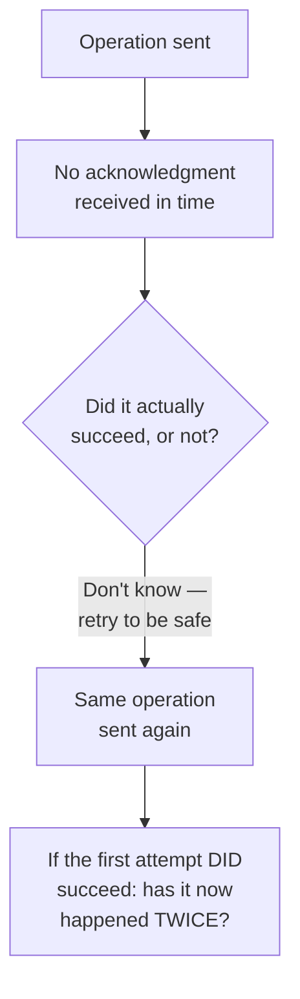
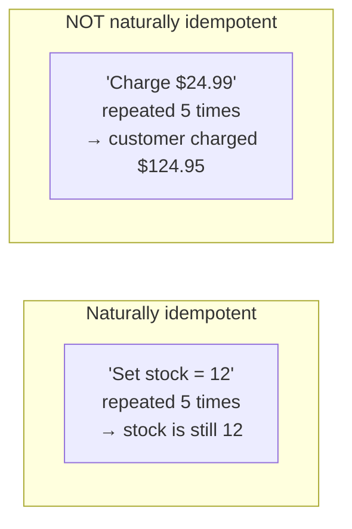
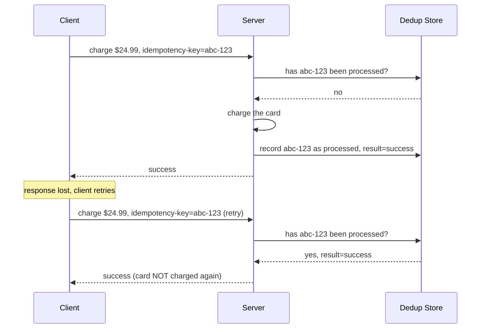
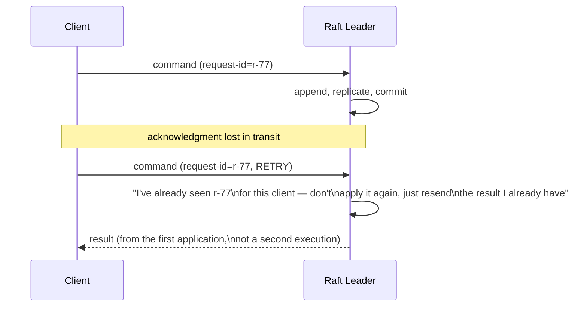
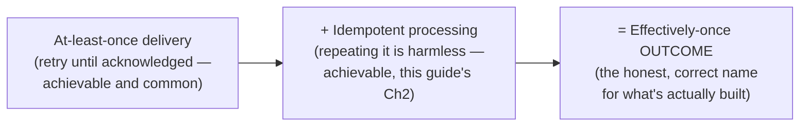
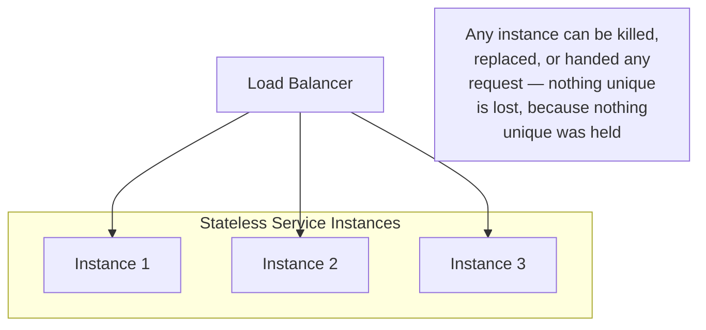
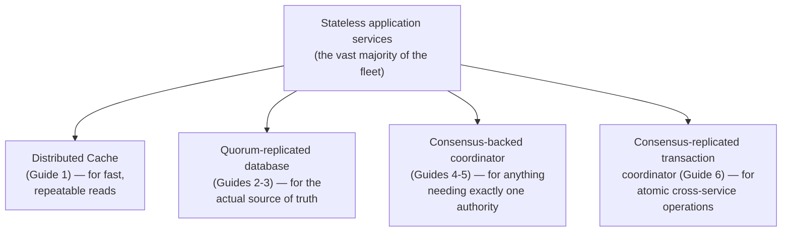
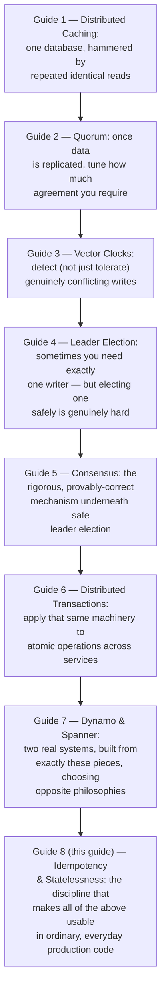
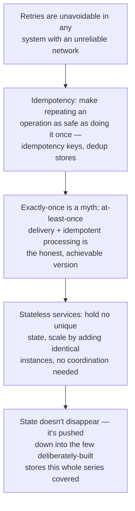

## The Story of Idempotency and Stateless Services

Every guide in this series has, at some point, run into the same quiet fact: in a system with retries, replicated logs, and an unreliable network, the same operation can be attempted more than once. Raft leaders retry `AppendEntries`. Dynamo's clients retry writes across a sloppy quorum. A customer's browser retries a checkout that timed out. This closing guide is about the discipline that makes all of that survivable — and about the architectural principle that decides, once and for all, where in your system state is even allowed to live.

---

## Interview Cheat Sheet

**Idempotency** means performing the same operation more than once has the same effect as performing it exactly once — which is what makes retries, at every layer this series has covered, safe rather than dangerous. **Stateless services** hold no unique in-memory state that would be lost if the instance were killed and replaced — which is what makes horizontal scaling and leader-agnostic load balancing trivial.

**Key facts:**
- **At-least-once delivery** (the honest default for most real message systems, including the ones covered earlier in this series) plus **idempotent processing** equals what most engineers actually mean by "exactly-once" — true exactly-once delivery across an unreliable network is provably impossible (the Two Generals Problem, covered in the ArchitecturePatterns Saga guide and `database/DistributedTransactions/README.md`)
- An **idempotency key** — a unique ID attached to a request, checked against a dedup record before acting — is the standard mechanism that makes a naturally non-idempotent operation (like "charge this card") safe to retry
- Even Raft's replicated log needs this discipline internally: a leader tracks each client's last-seen request ID so a retried command isn't applied to the state machine twice, even if the client never received the first acknowledgment
- Stateless services push all the *actual* state into a small number of deliberately-engineered, carefully-coordinated stores — the cache, the quorum-replicated database, the consensus-backed coordinator — everything covered earlier in this series — rather than accidentally scattering state across application instances

**Common interview gotchas:**
- "Exactly-once" is a common but imprecise phrase — the practically achievable, honest version is "at-least-once delivery, made safe by idempotent processing," and being able to state that distinction precisely is a strong interview signal
- Idempotency keys need their own storage and expiry policy — keep them forever and storage grows unbounded; expire them too soon and a legitimate late retry looks like a brand-new request
- "Stateless" doesn't mean "no state anywhere in the system" — it means the *service instance* holds none; state still exists, just concentrated in a few well-understood places instead of smeared across every instance
- Sticky sessions (from the WebSockets guide in the Networking series) are a deliberate, justified exception to statelessness, not a contradiction of it — a live WebSocket connection genuinely can't be "stateless" the way a plain HTTP handler can

**The core trade-off:** pushing every service toward statelessness and every operation toward idempotency is real, ongoing engineering discipline — but the payoff is a fleet that can be scaled, restarted, and load-balanced without a second thought, with all the genuinely hard coordination problems concentrated into a small number of places built specifically to handle them.

---

## Chapter 1: The Same Command, More Than Once

Look back across this entire series and one shape repeats constantly. A Raft leader sends `AppendEntries`, doesn't hear an acknowledgment in time, and retries — but what if the follower actually received and applied it the first time, and only the *acknowledgment* was lost? A Dynamo client, uncertain whether its write reached enough replicas, retries — what if it actually succeeded the first time? A customer's browser, staring at a timed-out "Place Order" button, clicks it again — what if the first request is still being processed?

Every layer of every system this series has covered faces this exact ambiguity, because it's a direct consequence of an unreliable network: you can lose a request, or you can lose its acknowledgment, and from the sender's side, those two failures are indistinguishable. The only way to make retrying safe is to make the operation itself tolerant of being repeated.

---

## Chapter 2: Idempotency, Precisely

An operation is **idempotent** if applying it multiple times produces the same result as applying it once. Some operations are idempotent by their very nature — "set stock to 12" is idempotent no matter how many times you send it, because it doesn't matter what stock was before. Others are inherently not — "decrement stock by 1" or "charge this card $24.99" absolutely do depend on prior state, and repeating them blindly changes the outcome every time.

For operations in the second category, the standard fix is an **idempotency key**: a unique identifier the client attaches to the request (often a UUID generated once, client-side, and reused on every retry of that same logical attempt). The server checks a dedup record before acting.

This is exactly the same shape as the Event-Driven Architecture guide's consumer-side deduplication in the ArchitecturePatterns series, and the same discipline the Networking series' HTTP guide flagged for retrying a non-idempotent `POST` — this closing guide is naming the single underlying principle that all of those specific instances were really the same thing in disguise.

---

## Chapter 3: Even Raft Needs This, Internally

It's worth being explicit that this isn't just an application-layer concern bolted on top of otherwise-perfect infrastructure — the consensus systems covered earlier in this series need exactly this discipline internally, too. A client sends a command to a Raft leader; the leader appends it, replicates it, and commits it — but the acknowledgment back to the client is lost. The client, seeing no response, retries the same command.

Real Raft implementations track, per client, the highest request ID they've already processed — the exact same idempotency-key pattern from Chapter 2, just applied inside the consensus layer itself rather than at an application's HTTP boundary. The principle doesn't change depending on which layer of the stack you're standing in.

---

## Chapter 4: "Exactly-Once" Is a Convenient Myth

It's worth stating plainly, because it's a genuinely strong thing to say precisely in an interview: **true exactly-once delivery, across a real, unreliable network, is impossible** — this is the same Two Generals Problem the ArchitecturePatterns Saga guide and `database/DistributedTransactions/README.md` both cover: you can never be fully certain a message was received, because the acknowledgment of receipt can itself be lost, and there's no way to break that chain with a finite number of messages.

What real systems actually build, and what people usually *mean* when they loosely say "exactly-once," is a composition of two honest, achievable guarantees:

This distinction — "effectively-once, built from at-least-once plus idempotency" versus a naive claim of "exactly-once delivery" — is a genuinely valuable thing to be able to state precisely, because it shows you understand *why* the stronger version is impossible, not just that a weaker version happens to work.

---

## Chapter 5: Stateless Services — Making Horizontal Scaling Trivial

The Networking series' HTTP guide already introduced statelessness at the protocol level: an HTTP server remembers nothing between requests, and that's precisely what lets any server in a pool answer any request. This closing guide generalizes that same idea to services as a whole: a **stateless service instance** holds no unique in-memory data that would be lost if it were killed and replaced right now.

This is precisely what makes horizontal scaling boring, in the best sense of the word: adding capacity is just adding more identical instances, with no coordination needed between them, because none of them hold anything the others don't already have access to (via whatever store actually holds the real state). Contrast this with the WebSockets guide's sticky-session requirement from the Networking series — a live WebSocket connection genuinely *does* hold unique state (the open socket itself), which is exactly why it needed a deliberate exception (pinned routing, a pub-sub backplane to reach it from other instances) rather than being treated as a design flaw.

---

## Chapter 6: Where State Actually Has to Live

Statelessness for most of a fleet doesn't mean state vanishes — it means state gets **pushed down** into a small number of places specifically engineered to hold it safely, which is, in a real sense, a map of this entire series:

This is the payoff of the whole series stated as a single architectural principle: don't let state accidentally accumulate inside every service instance you write — concentrate it, deliberately, into the small number of components this series spent eight guides teaching you to build (or choose) correctly, and let everything else scale mindlessly by just adding more identical, disposable copies.

---

## Chapter 7: The Real Costs

**Idempotency keys need their own lifecycle management.** A dedup record that's kept forever grows storage without bound; one that expires too soon means a legitimate, if unusually delayed, retry is indistinguishable from a brand-new request and gets processed twice anyway. Choosing a sensible expiry window (long enough to cover realistic retry delays, short enough to bound storage) is a real, deliberate engineering decision, not a detail to skip.

**True statelessness sometimes fights against genuine convenience.** Caching a user's session data locally on the instance that first handled their request is faster than fetching it from a shared store every time — but it reintroduces exactly the kind of instance-specific state statelessness is designed to eliminate. Real systems make deliberate, justified exceptions (the WebSockets guide's sticky sessions are the clearest example already covered in this series) rather than pretending every convenience is free.

**The discipline has to be applied consistently, or it doesn't hold at all.** One stateful service quietly hiding in an otherwise-stateless fleet reintroduces a single point of failure and a scaling bottleneck exactly where nobody's looking for one — statelessness is a property of the whole fleet's design discipline, not something you can half-apply.

---

## Chapter 8: Closing the Series

This is the last guide in the Distributed Systems series, and the whole arc is worth looking back on as one continuous argument rather than eight separate topics.

Every guide in this series solved a real, concrete problem that appears the moment "one database" becomes "several machines that don't share memory" — and, exactly like the two series before it, none of these ideas is "correct" in isolation. A cache without a consistency story goes stale silently. Quorums without conflict detection lose concurrent writes. Leader election without real consensus risks split brain. Consensus without idempotent clients still double-processes retries. The skill this series has been building isn't memorizing eight names — it's recognizing, in your own system, exactly which of these eight problems you actually have, and reaching for the specific piece of machinery built to solve it, not the one that merely sounds impressive.

---

## The Full Story, End to End

| | Stateful Everywhere | Idempotent Operations + Stateless Services |
|---|---|---|
| Retries | Dangerous — can duplicate effects | Safe by design |
| Scaling a service | Requires care — which instance holds what? | Trivial — add identical instances |
| Failure recovery | An instance's state is lost on crash | Nothing unique is lost — state lives elsewhere |
| Where hard problems live | Scattered across every service | Concentrated in a few well-engineered stores |
| Best for | Nothing, deliberately — this is the failure mode | Every production distributed system |

**This closes the Distributed Systems series.** Natural next threads from this repository's README:

- **Security & Compliance** — access control, encryption, and compliance concerns for the stateful stores this series spent eight guides building
- **Cloud & DevOps** — how the stateless-fleet-plus-a-few-stateful-stores architecture this guide describes is actually provisioned, deployed, and operated in a real cloud environment
