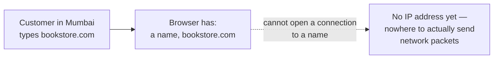
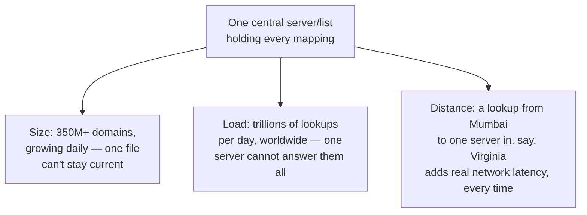
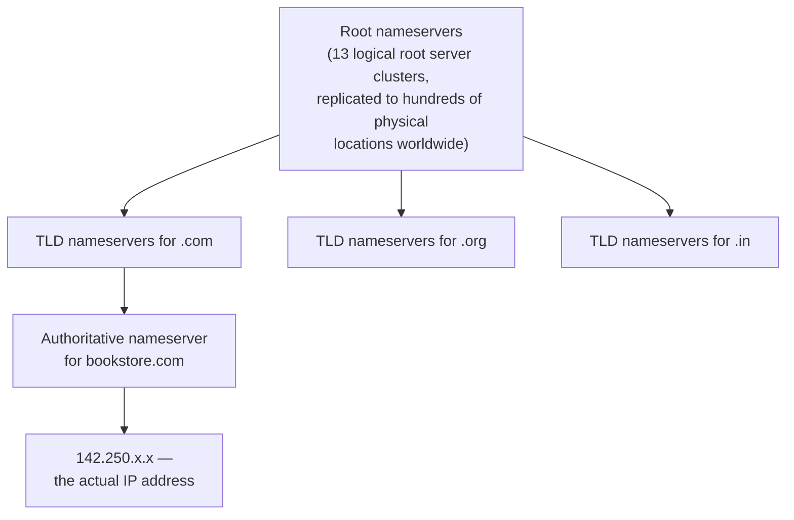
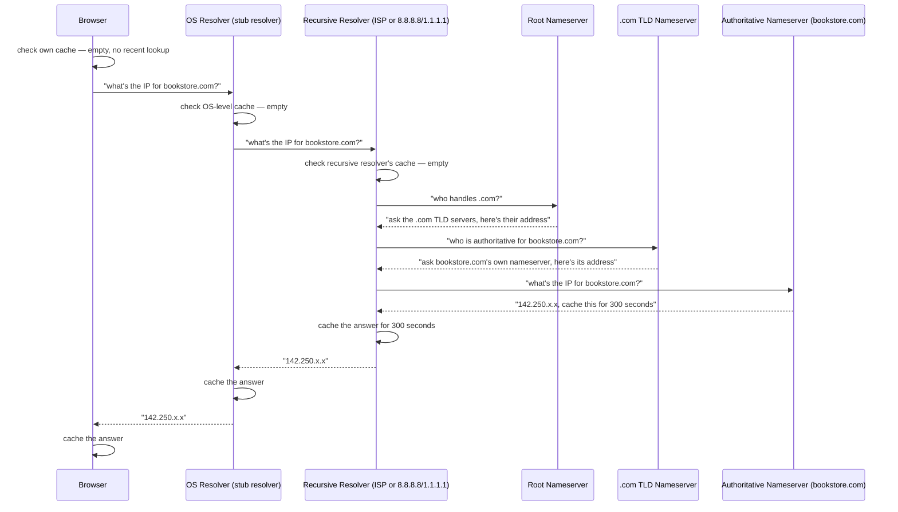
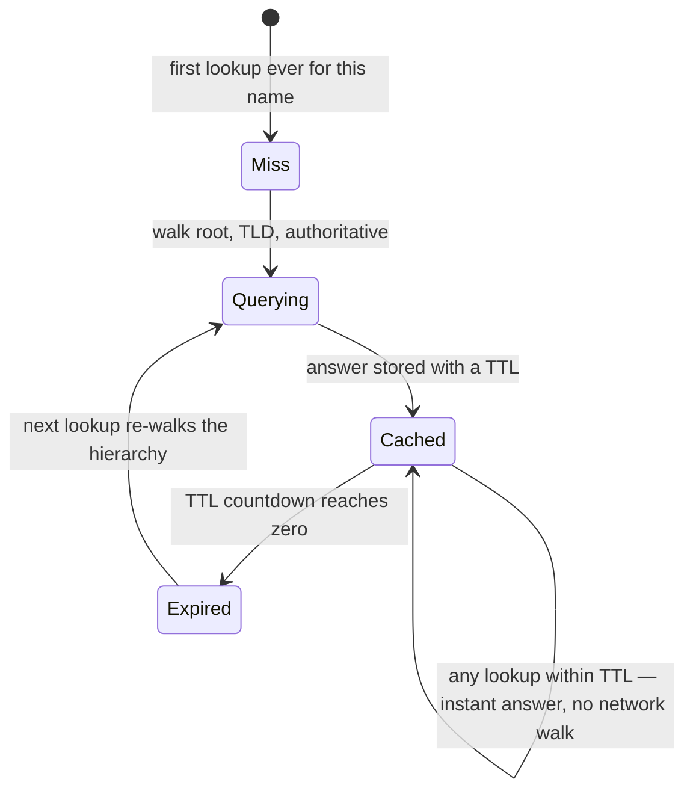
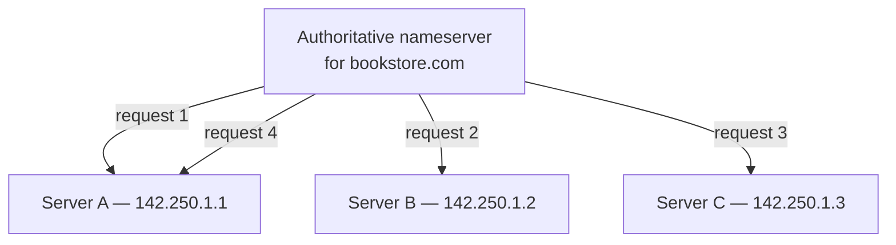
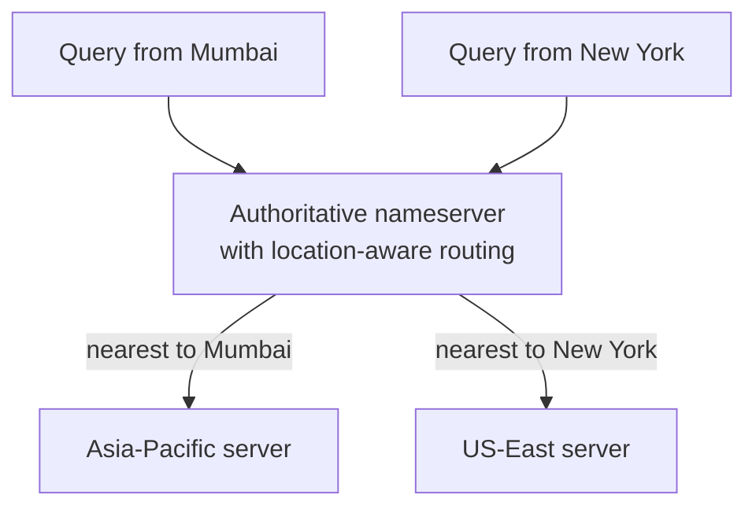
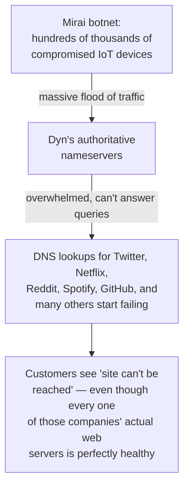
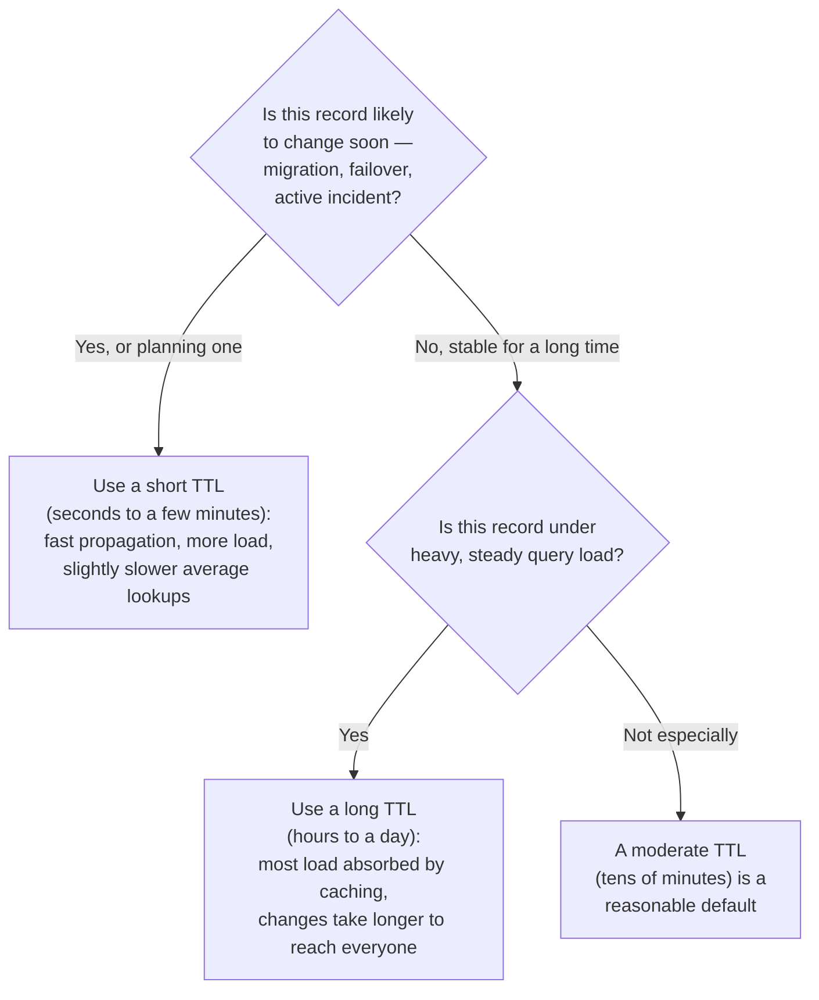
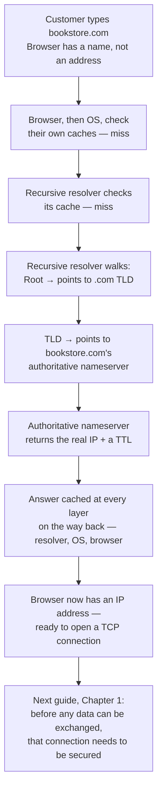

## The Story of DNS

A customer in Mumbai opens her laptop, types `bookstore.com` into the address bar, and hits enter. She expects a page of books within a second or two. But right now, at this exact instant, her browser has a problem it cannot get past on its own: it knows a name, and names are not something a computer can send a request to. This guide is the first stop in the request's journey — before any page loads, before any connection opens, the browser first has to find out which machine, anywhere on Earth, actually answers to the name `bookstore.com`.

---

## Interview Cheat Sheet

**DNS (the Domain Name System)** is the distributed, hierarchical, heavily cached lookup system that translates human-readable domain names (`bookstore.com`) into the numeric **IP addresses** (Internet Protocol addresses — the actual numeric location a computer connects to) that computers use to actually route network traffic.

**Key facts:**
- No single server holds the whole mapping. The lookup is split across **root**, **TLD** (top-level domain, e.g. `.com`), and **authoritative** nameservers, each of which only needs to know a small slice of the answer.
- Almost every real-world lookup is answered from a **cache** long before it would need to reach the root — that's what makes DNS fast in practice despite being globally distributed.
- **TTL** (time to live — how long a DNS answer is allowed to be cached before it must be re-checked) is the single dial that trades update speed against load and average latency.

**Common interview follow-ups:**
- "Walk me through what happens between typing a URL and the browser having an IP address." (Chapter 4)
- "Why did the Dyn outage in 2016 take down Twitter and Netflix when their servers were fine?" (Chapter 8)
- "How would you route a user to their nearest data center using DNS?" (Chapter 7)
- "Your team just migrated servers — why are some users still hitting the old server hours later?" (Chapter 5)

The single most important thing to remember: **DNS is a caching problem wearing a networking costume** — the hierarchy of root, TLD, and authoritative servers exists so the system can survive its own scale, but it's the caching at every layer on top of that hierarchy that actually makes it fast, and that same caching is exactly what makes DNS changes slow to take effect everywhere at once.

---

## Chapter 1: A Name With No Address

Our customer's laptop has exactly one job at this moment: turn `bookstore.com` into something it can actually open a connection to. And here's the part that's easy to forget because it's so deeply hidden under the surface — computers do not talk to each other using names at all. Every single network connection on the internet, without exception, is addressed to a numeric **IP address**, something like `142.250.1.14` in the IPv4 style, or a longer hexadecimal version in IPv6.

Routers — the machines that actually forward network traffic from one hop to the next, all the way across the internet — only understand IP addresses. They have no concept of `bookstore.com` at all. A router sees a destination IP address in a packet's header and forwards it toward that address, the same way postal sorting only cares about a ZIP code, not a business's name.

So why don't we just use IP addresses everywhere, and skip names entirely? Because humans are bad at remembering strings of numbers, and worse, the IP address behind a name can change — a company migrates servers, switches cloud providers, or adds more machines — while the name people type and bookmark and print on business cards should never have to change. Names are for humans. Addresses are for machines. Something has to sit between them and translate. That something is DNS — the **Domain Name System**, the internet's system for translating names into addresses.

The obvious next question: where does that translation actually live?

---

## Chapter 2: Why One Giant List Doesn't Work

The most obvious answer is also the one the early internet actually tried: keep one single file, somewhere, that lists every domain name and its matching IP address. In the 1970s and early 1980s, that's genuinely what happened — a single text file called `HOSTS.TXT`, maintained by one organization, was periodically downloaded by every machine on the fledgling internet.

That approach breaks the moment the internet stops being a small research network. Today there are more than **350 million registered domain names**, and that number only counts the domains themselves — the actual number of individual DNS lookups happening every second, across every browser tab, every mobile app, every server calling every other server, is in the trillions per day, globally. A single server, or even a single company's server farm, holding one file with every mapping and answering every one of those lookups, would face three problems at once:

Even if you solved the size and load problems by throwing enough hardware at them, the single-server design has a fourth, worse problem: it becomes one machine whose failure takes down name resolution for the entire internet at once. There is no way to make one thing both globally authoritative and safely undroppable. Something else was needed — a design where no single server has to know everything, and no single server's failure can take down the whole system.

---

## Chapter 3: The Core Insight — A Hierarchy That Delegates

The actual design that replaced `HOSTS.TXT` is DNS as we know it today, and its core idea is this: **split the knowledge into a hierarchy, where each level only needs to know how to point you to the next level down — not the final answer itself.** No single server anywhere on the internet knows the IP address for every domain. But together, by handing a query down through a small number of hops, the system can answer any domain's lookup, worldwide, in milliseconds.

Think of it as three layers, each with a narrower job than the one above it:

- **Root nameservers** know nothing about `bookstore.com` specifically. Their entire job is to know which servers are responsible for each **TLD** (top-level domain — the part after the last dot, like `.com`, `.org`, or `.in`). There are only 13 logical root server addresses, but each is replicated across hundreds of physical machines worldwide using a networking trick called anycast, so "the root" is never a single physical box anywhere.
- **TLD nameservers** know every domain registered under their TLD, but only well enough to say which company's servers are the authority for that specific domain. The `.com` TLD servers don't know `bookstore.com`'s IP address — they know which **authoritative nameserver** to send you to next.
- **Authoritative nameservers** are the actual source of truth for one specific domain. Whoever runs `bookstore.com`'s DNS — the bookstore's own infrastructure team, or a DNS provider they pay, like Cloudflare or AWS Route 53 — controls this layer, and this is the only layer that actually returns the real IP address.

Nobody in this chain knows everything. Root knows TLDs. TLD knows authoritative servers. Authoritative knows the actual answer. That's the entire trick behind why a system spanning 350 million domains can still answer any single query in a handful of hops. But there's a piece missing from this picture: something has to actually walk down through these three layers on the browser's behalf, because the browser itself doesn't do this walk directly.

---

## Chapter 4: The Actual Walk, Step by Step

That missing piece is the **recursive resolver** — a server whose job is to do the entire multi-hop walk through root, TLD, and authoritative nameservers on behalf of whoever asked it a question, and hand back just the final answer. Our customer's laptop never talks to root or TLD servers itself; it talks to one recursive resolver, usually run by her ISP (internet service provider) by default, or a public one like Google's `8.8.8.8` or Cloudflare's `1.1.1.1` if she or her network operator configured one of those instead.

Here is the full walk, from the moment she hits enter to the moment her browser has an IP address:

A few things worth noticing about this walk. First, the customer's own browser and operating system both check their own caches before asking anyone else anything — a **cache** here just means "an answer we already learned recently, kept nearby so we don't have to ask again." Second, the root nameserver never once mentions an IP address for `bookstore.com` — its entire contribution is pointing to the right TLD server, and the TLD server's entire contribution is pointing to the right authoritative server. Only the authoritative server, at the very bottom, actually knows the real answer. Third, every single layer that touched this answer caches it on the way back up, which is the setup for the next chapter, because that caching is what makes this five-hop walk something that almost never actually happens in practice.

---

## Chapter 5: Why Almost No Query Ever Reaches the Root

Here's the detail that makes DNS fast enough to be invisible in everyday browsing: the full five-hop walk in Chapter 4 is the **worst case** — what happens on a total cache miss, the very first time anyone, anywhere, asks that particular recursive resolver about `bookstore.com`. Once that recursive resolver has the answer cached, every other customer asking the same resolver about `bookstore.com` — and a popular ISP resolver might serve thousands of customers — gets the cached answer directly, skipping root, TLD, and the authoritative server entirely.

That cached duration is set by the **TTL** (time to live) — a number, in seconds, that the authoritative nameserver attaches to its own answer, telling every cache downstream "you may keep and reuse this answer for this long, then you have to ask again." This single number is one of the most consequential trade-offs in all of DNS:

- **Short TTL** (say, 60 seconds): if the bookstore needs to change its server's IP address — for a failover, a migration, an emergency — the change reaches everyone within a minute. The cost: recursive resolvers have to re-ask the authoritative server far more often, meaning more load on that authoritative server and a slightly slower average lookup for everyone, since fewer requests get the instant cached answer.
- **Long TTL** (say, 24 hours, or `86400` seconds): almost every lookup is answered instantly from cache, with minimal load anywhere upstream. The cost: if the bookstore needs to change something, some fraction of the internet keeps sending traffic to the old address for up to 24 hours, because their cached answer hasn't expired yet.

This isn't a hypothetical trade-off — it's a scenario that has bitten real engineering teams migrating real infrastructure. Imagine the bookstore's team, on a Friday, moves `bookstore.com` from an old data center to a new one, and updates the DNS record to point at the new IP. If the old record had a 24-hour TTL, every recursive resolver that had already cached the old IP keeps handing it out for up to a day. Customers hitting those resolvers keep connecting to the old, now-decommissioned server — which might be switched off entirely, turning what should have been an invisible migration into hours of "the site is down" reports, even though the new servers are healthy and waiting. The standard mitigation: lower the TTL well before a planned migration, wait for the old, longer TTL to fully expire, make the change, and only raise the TTL back up once things are stable.

---

## Chapter 6: What's Actually Stored — Record Types in Practice

So far we've talked about "the answer" as if it's always a single IP address. In practice, an authoritative nameserver stores several different kinds of entries, called **records**, and which type comes back depends on what's being asked. You don't need to memorize the full list for an interview — you need to recognize these five on sight and know what each is for:

| Record type | What it does | Example |
|---|---|---|
| **A** | Maps a name to an IPv4 address | `bookstore.com → 142.250.1.1` |
| **AAAA** | Maps a name to an IPv6 address | `bookstore.com → 2606:4700::1` |
| **CNAME** | An alias — points one name at another name, not directly at an IP | `www.bookstore.com → bookstore.com` |
| **MX** | Where to deliver email for this domain | `bookstore.com → mail.bookstore.com` |
| **TXT** | Free-text data, commonly used for domain ownership verification and email anti-spam rules (like SPF) | `bookstore.com → "v=spf1 include:..."` |
| **NS** | Delegates a domain (or subdomain) to a specific set of authoritative nameservers | `bookstore.com → ns1.dnsprovider.com` |

**CNAME** records are worth one extra beat, because they chain: `www.bookstore.com` might be a CNAME pointing at `bookstore.com`, which is itself an A record pointing at an IP — or in a more realistic modern setup, `www.bookstore.com` might CNAME to a CDN provider's own hostname, which then resolves to whichever edge server is closest to the customer.

Resolvers follow a CNAME chain automatically, transparently, until they land on an actual A or AAAA record — the customer's browser never sees the intermediate hop, it just gets a final IP address at the end of the chain.

---

## Chapter 7: Sending Users to Their Nearest Server

Everything so far has assumed there's exactly one right answer to "what's the IP for `bookstore.com`" — but a company the size of Amazon or Netflix runs servers on multiple continents, and the whole point of having servers close to customers is defeated if every customer, everywhere, gets pointed at the same one. DNS itself is often the tool used to solve this, by giving different customers different answers to the exact same question, on purpose.

The simplest version is **round-robin DNS**: the authoritative nameserver holds several A records for the same name, and hands them out to different askers in rotation, spreading load evenly across several servers with no awareness of where the customer actually is.

A more useful version, and the one that actually matters for a global business, is **GeoDNS** (also called latency-based DNS routing): the authoritative nameserver looks at where the query is physically coming from and deliberately returns a different, geographically or network-wise closer IP address depending on the asker's location. Our customer in Mumbai asking `bookstore.com` and a customer in New York asking the exact same question, at the exact same moment, get two different answers — each pointed at whichever server actually serves them fastest.

This is exactly what services like **AWS Route 53's latency-based routing** and **Cloudflare's** global network do in production, and it's the same core idea a **CDN** (content delivery network) relies on to get a customer talking to a nearby edge server instead of one central origin — worth flagging now, because that's precisely the mechanism a later guide in this series covers in depth once the request has a secure connection to work with.

---

## Chapter 8: When the Phonebook Itself Gets Attacked

Every layer discussed so far has assumed the DNS infrastructure itself is healthy and reachable. On **October 21, 2016**, a large piece of the internet found out what happens when that assumption fails, even though nothing was wrong with the actual websites people were trying to reach.

**Dyn** was, at the time, a major managed DNS provider — many large companies, instead of running their own authoritative nameservers, paid Dyn to run that layer for them. A botnet called **Mirai**, built out of hundreds of thousands of hijacked, ordinary internet-connected devices — security cameras, home routers, DVRs, many still running factory-default passwords — was aimed at Dyn's DNS infrastructure in a massive distributed denial-of-service attack, in three separate waves through the day.

For hours, users across the US and parts of Europe couldn't reach Twitter, Netflix, Reddit, Spotify, and a long list of other major sites — not because any of those companies' web servers or applications had failed, but because the DNS lookup that was supposed to hand back their IP address never got an answer. This is the cleanest real-world illustration of a point that's easy to underestimate: DNS sits in front of everything else in a request's path, which means it can take down an otherwise perfectly healthy system just by being unreachable itself — a single point of failure hiding in a layer most engineers never think about until it breaks.

Two smaller, related pieces worth knowing by name. **Public recursive resolvers** — Google's `8.8.8.8` and Cloudflare's `1.1.1.1` being the best known — exist partly as an alternative to relying solely on your own ISP's resolver, often trading in extra speed or privacy commitments. And **DNSSEC** (DNS Security Extensions) is the mechanism designed to stop a different DNS problem — **cache poisoning**, where an attacker tricks a resolver into caching a forged, malicious answer instead of the real one — by cryptographically signing DNS responses so a resolver can verify an answer actually came from the real authoritative source. DNSSEC helps, but adoption is partial: it adds real operational complexity (managing and rotating cryptographic keys) and plenty of domains and resolvers still don't use it, so this isn't a solved problem across the whole internet — just one this guide won't go deeper on here.

---

## Chapter 9: The Real Costs

Pull the last few chapters together, and DNS's costs are really the same handful of trade-offs showing up in different forms:

**Propagation delay.** Because of caching and TTL (Chapter 5), a DNS change is never instant everywhere. It's instant at the authoritative server, and then it takes up to one TTL's worth of time to reach every cache downstream. Planning around this — lowering TTL ahead of a planned change — is a real, recurring piece of operational work for any team that owns production DNS.

**A dependency that can take down a healthy system.** The Dyn incident (Chapter 8) is the sharpest example: your web servers, your database, your application code can all be perfectly fine, and your product is still unreachable if DNS resolution for your domain fails. This is why serious production setups often use more than one DNS provider, or at least understand explicitly that their DNS layer is a single point of failure worth planning for.

**Extra latency on a cold request.** Chapter 4's full five-hop walk isn't free — each hop is a network round trip, and on a total cache miss it can add tens of milliseconds before the browser even starts opening a connection to the actual website. This cost is almost entirely hidden in normal use precisely because caching (Chapter 5) means the overwhelming majority of lookups skip most of those hops — but it's there, and it's the reason a "cold" DNS lookup (nothing cached anywhere yet) is measurably slower than a "warm" one.

---

## Chapter 10: Deciding How to Set TTL — and Trusting the Cache

Everything in this guide collapses into one practical decision most teams running production DNS actually have to make: how long should this TTL be?

The pattern underneath this whole guide is that almost every real system leans on **multiple layers of caching at once** — browser, OS, recursive resolver — precisely because no one layer can be both instantly updatable and free of load at the same time. Short TTL trades efficiency for agility; long TTL trades agility for efficiency. Neither is universally correct — the right choice depends entirely on how likely that specific record is to change, and how much load re-querying it constantly would put on the authoritative server.

---

## The Full Story, End to End

| | Short TTL | Long TTL |
|---|---|---|
| Propagation speed for changes | Fast — minutes | Slow — can take hours |
| Load on authoritative nameserver | Higher — re-queried often | Lower — mostly served from cache |
| Average lookup latency | Slightly higher on average | Slightly lower on average |
| Best for | Records expected to change soon, active failover, migrations | Stable records under heavy, steady query load |
| Risk if misjudged | Unnecessary load and cost | Stale answers linger for a long time after a change |

**Where would you like to go next?**

- **TLS/SSL & Encryption Basics** — the browser now has an IP address; the very next thing that has to happen, before a single byte of the actual page loads, is securing that connection
- **HTTP vs. HTTPS** — once the connection is secured, this is the protocol the browser and server actually speak to exchange the request and the response
- **Content Delivery Networks (CDNs)** — a deeper look at exactly how GeoDNS-style routing from Chapter 7 gets a customer talking to a nearby edge server instead of one distant origin
