## The Story of TLS/SSL and Encryption Basics

DNS just did its job: the browser now has an IP address for bookstore.com and is about to open a connection; before any data can be exchanged, that connection needs to be secured. A raw connection to that IP address is just a pipe — anyone who can see the traffic on the way can read every byte flowing through it, including the customer's password and credit card number. This guide is about how the browser and the bookstore's server turn that open pipe into one only the two of them can read.

---

## Interview Cheat Sheet

**TLS** (Transport Layer Security, the modern name for what used to be called SSL) is a protocol that sits on top of a raw TCP connection and does two things before any application data is allowed to flow: it **encrypts** the traffic so eavesdroppers can't read it, and it **authenticates** the server (and optionally the client) so you know you're actually talking to who you think you are.

**Key facts:**
- TLS uses **asymmetric encryption** (public/private key pairs) only to safely agree on a shared secret, then switches to fast **symmetric encryption** for the actual data — a hybrid approach, not a single algorithm
- A **certificate** is a signed statement saying "this public key belongs to bookstore.com," and browsers trust it by tracing a **chain of trust** back to a small set of built-in root Certificate Authorities
- **TLS 1.3** cuts the handshake from two round trips down to one (and to zero on a repeat connection), directly reducing the latency cost of every new HTTPS connection
- **mTLS** (mutual TLS) flips the usual one-sided trust check into a two-sided one — both client and server present certificates and verify each other, not just the server proving itself to the browser

**Common interview gotchas:**
- "Encryption" and "authentication" are two different jobs TLS does at once — confusing them (e.g. thinking a valid certificate guarantees the site is trustworthy content, not just that it's really bookstore.com) is a common mistake
- HTTPS is not a separate protocol from HTTP — it's HTTP running over a TLS-encrypted connection (this is Guide 3's whole topic)
- A certificate can be perfectly valid and the connection still be worthless if the Certificate Authority that issued it was compromised — trust is only as strong as the weakest CA in the chain (see the DigiNotar story below)
- TLS protects data **in transit** only; it says nothing about what happens to that data once it's decrypted and sitting in the server's memory or database

**The core trade-off:** stronger security and identity guarantees always cost something — a slower handshake (fewer round trips in TLS 1.3, but still not free) and real operational burden (certificates expire and must be rotated, and mTLS in particular multiplies that burden by every service pair involved).

---

## Chapter 1: The Pipe Is Wide Open

Picture the customer sitting in a cafe, on the cafe's public WiFi, about to log in to bookstore.com and buy a book. DNS just resolved bookstore.com to an IP address, and the browser is opening a plain TCP connection to that address.

Here's the uncomfortable fact about a plain TCP connection: it carries **plaintext** — data sent exactly as written, with no scrambling at all. Every byte the browser sends travels, unprotected, across every hop between the customer and the bookstore's server: the cafe's WiFi router, the cafe's ISP, possibly several other networks in between, and finally the bookstore's own network.

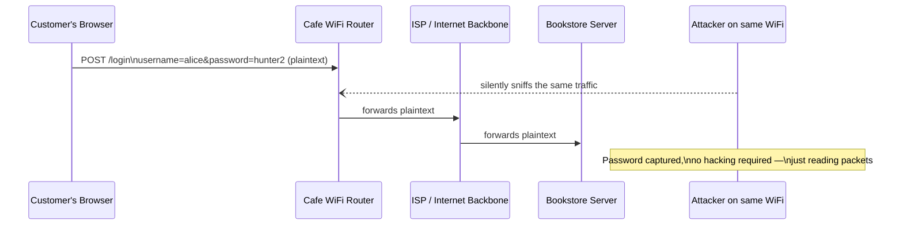

Anyone else on that same cafe WiFi network — someone running a simple, freely available packet-sniffing tool — can capture that traffic and read the password in plain sight. Nothing about this requires breaking into anyone's computer; it only requires being on the same network segment and looking at packets that were never hidden in the first place. Worse, a well-positioned attacker on the path (not even necessarily on the same WiFi — an ISP or any router the traffic passes through can do this too) can also **alter** the data in transit: change the order total, swap the shipping address, or redirect the payment. Plaintext gives you no way to tell that the message that arrived is the message that was sent.

So the fix seems obvious: encrypt everything. That turns out to be a lot less simple than it sounds.

---

## Chapter 2: Why "Just Encrypt It" Isn't Simple

The fast, efficient way to encrypt data is **symmetric encryption**: both sides use the exact same secret key to scramble and unscramble the data. It's fast because the math involved is cheap — computers can symmetrically encrypt gigabytes of data per second without much effort.

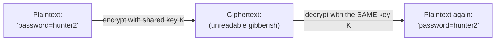

But notice the catch baked into that diagram: **both sides need the same key before any encryption can happen.** The browser and the bookstore's server have never met before this moment. They have no shared secret. And the only channel they have to agree on one is the exact same plaintext, unencrypted connection an attacker is already watching.

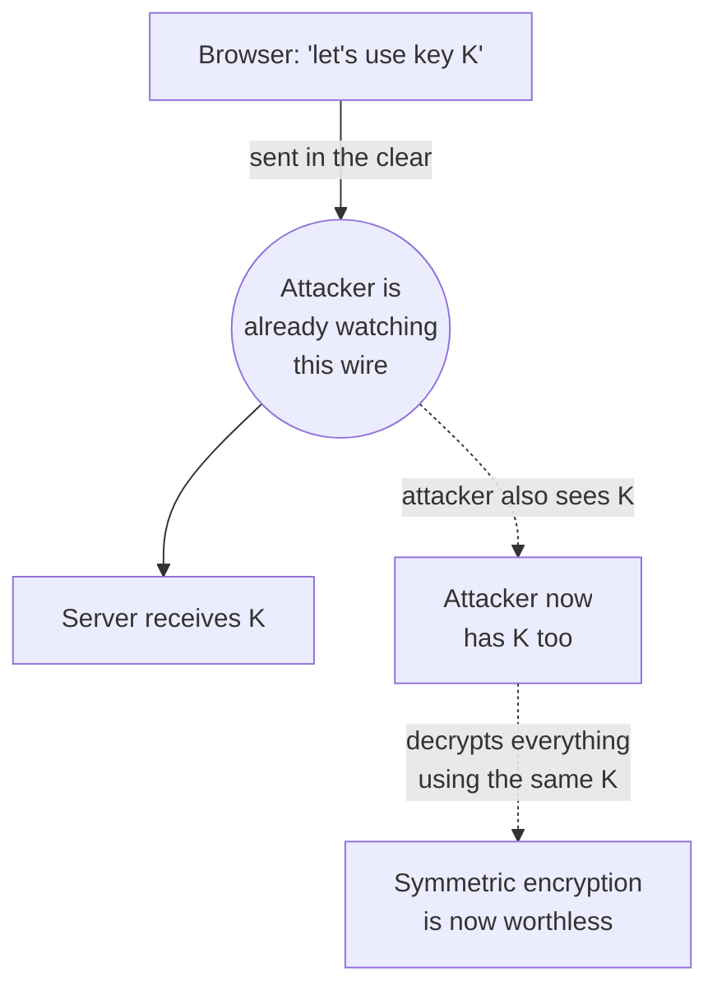

If you just send the symmetric key over the same insecure channel, the attacker who was already reading the traffic in Chapter 1 simply reads the key too, and every message after that is exactly as readable as before — you've encrypted nothing in practice. This is **the actual problem TLS exists to solve**: how do two strangers, with no prior shared secret, agree on a secret key over a channel that a third party can already see?

---

## Chapter 3: The Core Insight — Use Expensive Crypto Just Once

The answer is a second kind of encryption with a very different property: **asymmetric encryption**, built on a **public/private key pair**. The two keys are mathematically linked, but in a one-way fashion: a message encrypted with the **public key** can only be decrypted with the matching **private key** — and the public key can be handed to literally anyone, including an attacker, without giving away anything useful, because only the private key (which never leaves the server) can undo it.

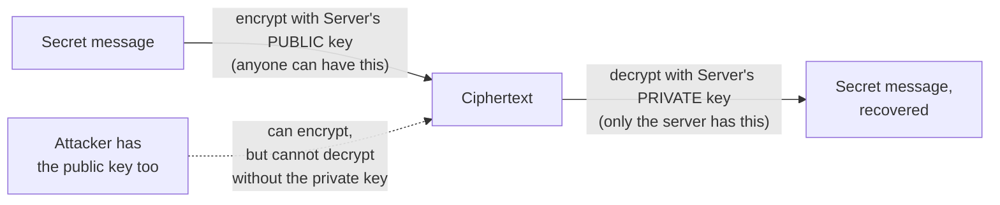

This solves Chapter 2's exact problem: the browser can encrypt a freshly generated symmetric key using the server's public key — which is safe to send in the open, because only the server's private key can unlock it — and send that over the same insecure wire the attacker is watching. The attacker sees the encrypted key, not the key itself, and asymmetric math makes it computationally infeasible to reverse that without the private key.

So why not just use asymmetric encryption for everything, and skip symmetric encryption entirely? Cost. Asymmetric encryption's math is dramatically more expensive per byte than symmetric encryption's — commonly cited as somewhere in the range of 100 to 1000 times slower depending on the algorithm and key size. Encrypting a login form with it is fine. Encrypting an entire video stream, or thousands of requests a second, with it would be prohibitively slow.

TLS's actual design is the **hybrid** answer to both problems at once: use the slow, expensive asymmetric encryption exactly once, for exactly one small message — safely agreeing on a symmetric key — and then switch to fast symmetric encryption for every byte of actual application data after that.

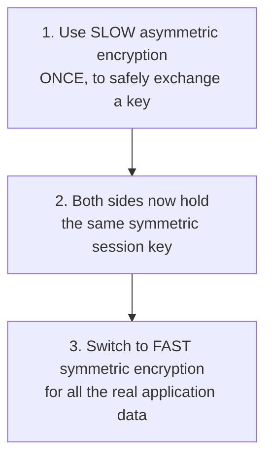

This single idea — expensive crypto to bootstrap trust, cheap crypto to do the actual work — is the spine of everything that follows. The rest of this guide is really just the details of how steps 1 and 2 get carried out safely, and how step 3's key gets thrown away and regenerated for every new connection.

---

## Chapter 4: The TLS 1.2 Handshake, Step by Step

The exchange that carries out Chapter 3's plan is called the **TLS handshake** — a sequence of messages the browser and server send before any encrypted application data is allowed to flow. Here's what it looked like under **TLS 1.2**, the version that dominated the web for most of the 2010s.

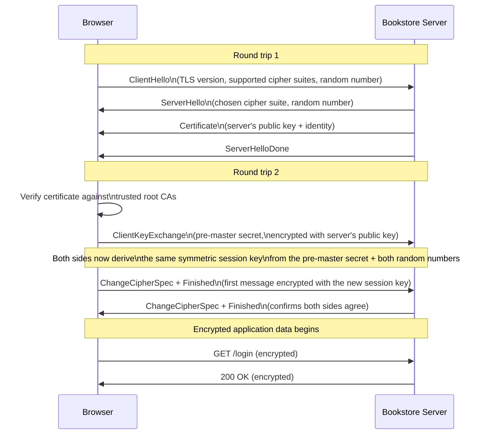

Count the round trips: **two full round trips** happen before a single byte of real application data can move. On a connection with 50ms of latency each way, that's roughly 200ms spent just on the handshake, before the browser has even asked for the login page. Every new HTTPS connection pays this tax — and on a mobile network, where a single round trip can easily be 100ms or more, it's a real, user-visible delay.

---

## Chapter 5: TLS 1.3 — The Same Idea, Fewer Round Trips

**TLS 1.3**, finalized in 2018, keeps Chapter 3's hybrid design exactly as it was — asymmetric to exchange a key, symmetric for the data — but restructures the handshake so it costs far less latency.

The key change: the browser no longer waits to see which cipher suite the server picked before sending its key material. Instead, the **ClientHello** message guesses the likely parameters and includes a **key share** in the very first flight, so the server can derive the session key and reply with everything needed in a single response.

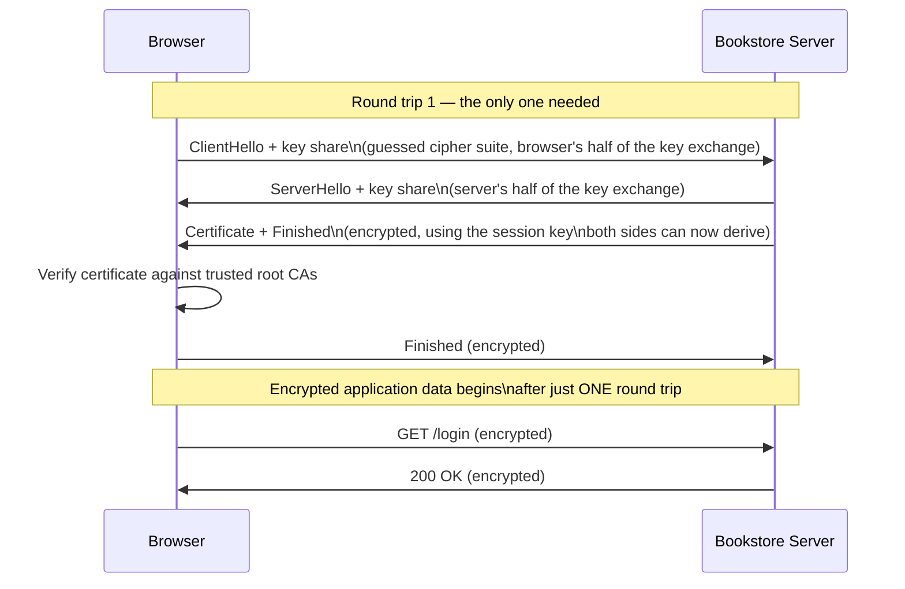

One round trip instead of two — roughly half the connection-setup latency of TLS 1.2, for free, just by rearranging the same messages.

TLS 1.3 goes one step further for **repeat** connections, with a mode called **0-RTT resumption** (zero round-trip time): if the browser has talked to this exact server before, it can reuse a secret left over from that earlier session to send encrypted application data in its very *first* message, with no handshake round trip at all.

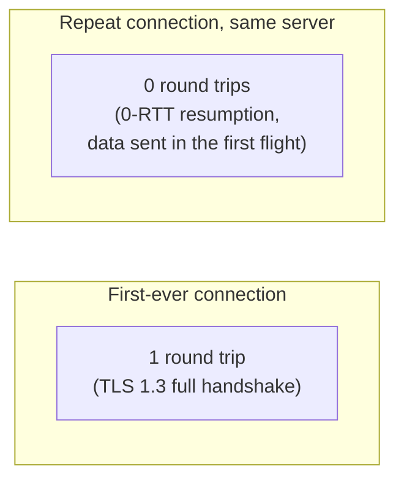

0-RTT isn't free of trade-offs — that very first 0-RTT message can, in rare setups, be replayed by an attacker who captured it, so it's typically restricted to requests that are safe to repeat (like loading a page) rather than ones that aren't (like submitting a payment). But for the common case — a returning customer's browser reconnecting to bookstore.com — it turns what used to be a two-round-trip tax into effectively no tax at all.

---

## Chapter 6: Certificates — Proving the Server Is Who It Says It Is

Chapter 4 and 5's handshakes both include a step easy to skim past: **Certificate**. This is the other half of what TLS does, and it matters just as much as the encryption. Encryption alone only guarantees that whoever holds the private key on the other end can read what's sent — it says nothing about who that is. Without some way to check identity, the browser could complete a perfectly encrypted handshake with an attacker impersonating bookstore.com, and never know the difference.

A **certificate** is a signed document that asserts exactly one thing: *this public key really belongs to bookstore.com.* It's issued by a **Certificate Authority (CA)** — an organization the browser has agreed in advance to trust — and the CA's signature is what makes the assertion credible.

But that just moves the question one level up: why should the browser trust the CA? The answer is a **chain of trust**. Browsers and operating systems ship with a built-in list of a few hundred **root CAs** they trust unconditionally. A root CA rarely signs website certificates directly — instead, it signs an **intermediate certificate**, and that intermediate signs the actual **leaf certificate** for bookstore.com. The browser verifies the chain by walking it backward: leaf signed by intermediate, intermediate signed by root, root already trusted.

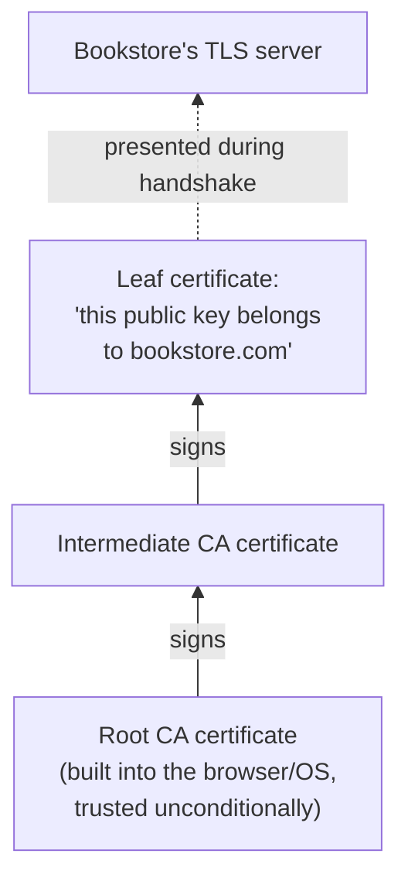

Why the extra intermediate layer, instead of the root signing leaf certificates directly? Because the root's private key is the single most valuable secret in the entire system — if it's ever compromised, every certificate it ever signed becomes suspect. Keeping the root offline, in a vault, and doing the day-to-day signing work with intermediates (which can be revoked and replaced without touching the root at all) limits the blast radius of a compromise.

### Let's Encrypt: Making This Free Changed the Web

For most of the web's history, getting a certificate cost real money and required a manual renewal process every year or two — annoying enough that huge numbers of site operators simply didn't bother, and stayed on plain, unencrypted HTTP. **Let's Encrypt**, launched in 2015 as a free, automated Certificate Authority, removed both barriers at once: certificates cost nothing, and a small piece of software on the server can request, install, and renew them automatically, with no human in the loop. This single change is widely credited as the biggest reason "every site is HTTPS now" became the default expectation, rather than the exception it used to be.

### DigiNotar: When the Chain of Trust Breaks

The chain of trust is only as strong as its weakest link, and 2011 provided a dramatic, real demonstration of what that means. **DigiNotar**, a Dutch Certificate Authority, was breached by attackers who used its compromised systems to issue fraudulent certificates for domains they didn't own — including one for google.com. Because DigiNotar was one of the CAs browsers trusted by default, every browser on earth treated those fraudulent certificates as fully legitimate, meaning an attacker holding one could impersonate google.com to any browser, and the browser would show no warning at all.

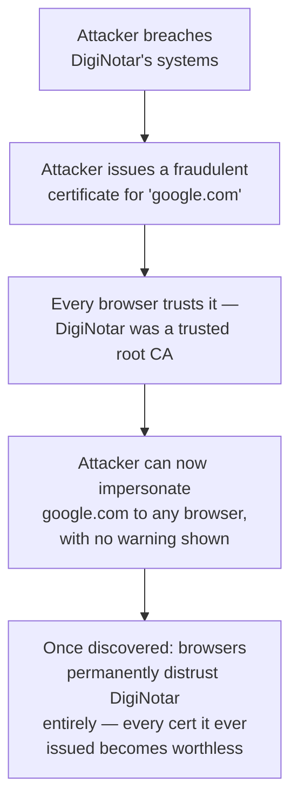

The fallout was total: once the breach was discovered, browser vendors distrusted DigiNotar outright, meaning every certificate the company had ever issued — including for its legitimate customers who had nothing to do with the breach — stopped being trusted, and DigiNotar itself went bankrupt within months. The lesson that stuck: a chain of trust makes the whole system only as trustworthy as the least-secure CA anywhere in it, which is exactly why the list of trusted root CAs is kept short, why CAs are audited, and why the industry now uses mechanisms like Certificate Transparency logs to make it much harder for a fraudulent certificate to go unnoticed the way DigiNotar's did.

---

## Chapter 7: mTLS — When Both Sides Have to Prove Themselves

Everything so far describes ordinary TLS, where only the **server** proves its identity — the browser checks bookstore.com's certificate, but the server never asks the browser to prove who it is. That's the right model for a public website: anyone should be able to connect, and the server just needs to know it's actually talking to bookstore.com's real customers' browsers, not that it needs to know each browser's identity.

**mTLS (mutual TLS)** changes that assumption: **both** sides present a certificate, and **both** sides verify the other's, before any data flows.

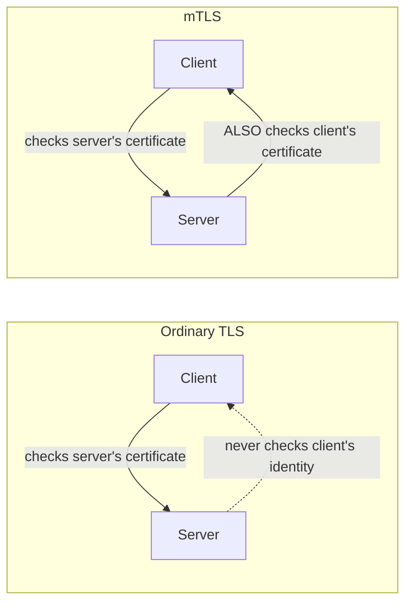

This is exactly the mechanism the Sidecar Pattern guide showed in action, without spelling out the underlying crypto: in that guide's Chapter 4 ("A Closer Look — mTLS Without the Apps Ever Knowing"), the Orders sidecar and the Payments sidecar each presented a certificate and verified the other's during their handshake, so that neither the Orders application nor the Payments application ever had to touch a certificate directly — the sidecars did the mutual identity check on their behalf. What's happening underneath that diagram is precisely this chapter's idea: two-sided proof of identity, instead of the one-sided proof a browser gets from a public website.

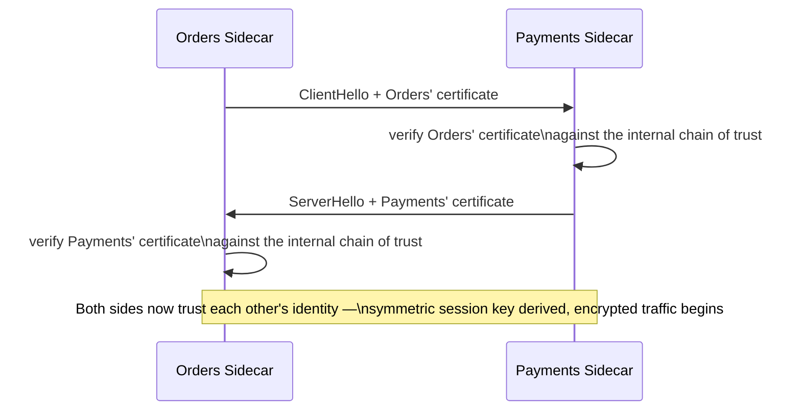

mTLS makes sense exactly where you have a closed set of known participants who all need to prove themselves to each other — service-to-service traffic inside a company's own infrastructure, as the Sidecar Pattern guide covered. It doesn't make sense for a public-facing website: you can't issue a client certificate to every anonymous customer's browser before they've even logged in, and requiring one would defeat the purpose of being a public website at all.

---

## Chapter 8: The Real Costs of TLS

TLS isn't free, in three distinct ways that show up in production, not just in theory.

**Handshake latency is real, even in TLS 1.3.** One round trip is much better than two, but it's still not zero, and it's paid on every *new* connection. This is mitigated three ways: TLS 1.3 itself, **session resumption** (reusing an earlier session's secret to skip the full handshake, the same idea behind 0-RTT from Chapter 5), and simply **reusing one connection for many requests** instead of opening a new one per request — a topic the next guide picks up directly, when it covers HTTP's connection keep-alive behavior.

**Certificates expire, and that expiry is a genuinely common cause of real outages.** A certificate is only valid for a fixed window — historically up to a couple of years, now capped much shorter (around 13 months for public web certificates as of recent CA/Browser Forum rules, and shrinking further). If nobody renews it before that window closes, the certificate silently becomes invalid, and every visiting browser shows a hard, scary security error — not a soft degradation, a full block. This has taken down major, well-resourced sites before, precisely because "renew the cert" is an easy thing to forget when it only needs to happen once a year, and the person who set it up may not even be at the company anymore by the time it expires. Automated renewal (the same idea Let's Encrypt popularized in Chapter 6) is the standard fix.

**TLS only protects data in transit.** Once a request reaches the bookstore's server and gets decrypted, TLS's job is done — it says absolutely nothing about what happens next. If the server logs the plaintext password by mistake, stores the credit card number unencrypted in a database, or hands it to a buggy analytics script, TLS did its job perfectly and the data is still exposed. Encryption in transit and protecting data at rest are two separate problems, and solving one says nothing about the other.

---

## Chapter 9: So What Do You Actually Do?

The decision framework, given everything above:

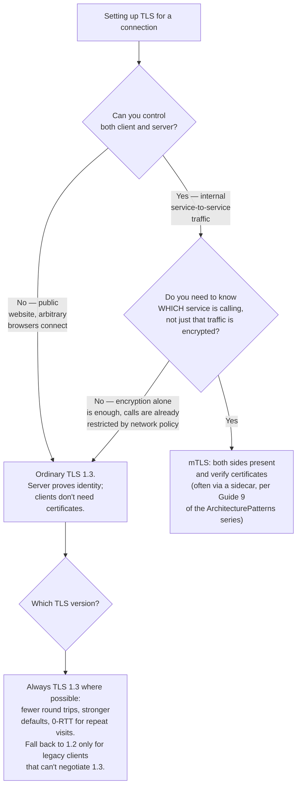

Two rules cover almost every real case: default to **TLS 1.3** everywhere you can, because it's strictly better than 1.2 on latency and security defaults with no real downside; and reach for **mTLS** specifically when you're dealing with internal, service-to-service traffic where knowing *which* service is on the other end matters, accepting the added operational cost of managing certificates on both sides of every connection — not for public traffic, where the client has no certificate to offer in the first place.

---

## The Full Story, End to End

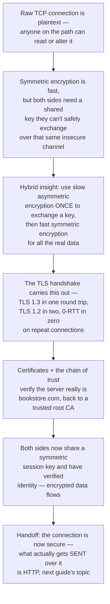

| | No TLS | TLS 1.2 | TLS 1.3 |
|---|---|---|---|
| Data in transit | Plaintext — readable and alterable by anyone on the path | Encrypted after handshake completes | Encrypted after handshake completes |
| Handshake round trips | None (nothing to negotiate) | 2 full round trips | 1 round trip (0 with 0-RTT resumption) |
| Server identity check | None | Certificate chain to a trusted root CA | Certificate chain to a trusted root CA |
| Client identity check | None | None, unless mTLS is configured | None, unless mTLS is configured |
| Protects data at rest | No | No | No |
| Right for | Nothing — never use this for real traffic | Legacy clients that can't negotiate 1.3 | The default choice everywhere possible |

**Where would you like to go next?** Natural threads from here:

- **HTTP vs. HTTPS** — now that the connection is encrypted, what actually gets sent over it, and exactly how HTTPS is "just HTTP over this TLS connection"
- **API Gateway & Reverse Proxy (Nginx, Envoy)** — where in a real architecture TLS is typically terminated, and what happens to traffic after that
- **Firewalls, VPNs & Network Security** — the broader security layer this guide's encryption and authentication ideas fit inside, closing out this series

