## The Story of HTTP vs. HTTPS

The previous guide finished its job: the browser and the bookstore's server now share a secret session key and have verified each other's identity, over an encrypted TLS connection. But encryption alone doesn't get the customer a page of books. Something still has to say, in a language both sides agree on, "send me the login page" and "here it is." That language is HTTP.

---

## Interview Cheat Sheet

**HTTP** (HyperText Transfer Protocol) is the request/response language browsers and servers use to exchange web content. **HTTPS** is not a separate protocol — it's the exact same HTTP, just carried inside the TLS-encrypted connection the previous guide built.

**Key facts:**
- HTTP is a **request/response** protocol: the client always speaks first, the server always replies — the server can never push data on its own in plain HTTP/1.1
- HTTP is **stateless** — the server remembers nothing about a client between requests; anything that needs to persist (a logged-in session, a shopping cart) is bolted on top, usually with **cookies**
- **HTTP methods** carry meaning: some are **safe** (don't change anything) and some are **idempotent** (repeating them has the same effect as doing them once) — GET and PUT are idempotent, POST is not
- The protocol evolved through three major versions — **HTTP/1.1 → HTTP/2 → HTTP/3** — each one solving a real performance problem the last version had in production, not just adding features for their own sake

**Common interview gotchas:**
- "HTTPS is HTTP with encryption" is true but incomplete — it's specifically HTTP layered on top of TLS, which also brings authentication, not just secrecy (see the previous guide)
- POST is not idempotent by default — retrying a failed POST (like "place order") can create a duplicate, which is exactly why idempotency keys exist (this connects directly to the Saga Pattern guide's idempotent consumers)
- HTTP/2 and HTTP/3 don't change what HTTP *means* — same methods, same status codes, same headers — they change how the bytes travel over the wire
- HTTP/3 doesn't run over TCP at all — it's built on UDP, specifically to escape a performance problem TCP itself causes (Chapter 7)

**The core trade-off:** each version of HTTP traded implementation complexity for less time wasted waiting on the network — HTTP/1.1's simplicity cost real page-load time, and every version since has spent engineering effort to claw that time back.

---

## Chapter 1: A Language for "Give Me This, Here's That"

The connection from the last guide is secure, but a secure pipe by itself doesn't know how to ask for anything. The browser and server need an agreed-upon shape for two things: how to ask for something, and how to answer.

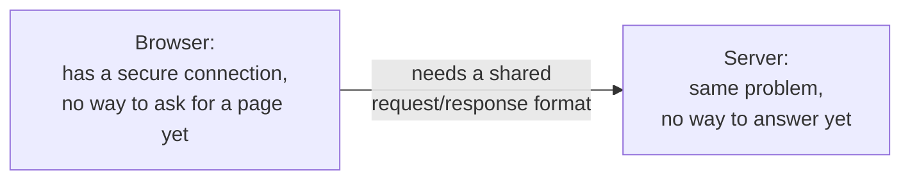

**HTTP** (HyperText Transfer Protocol) is that shared format. It defines exactly what a request looks like — a method, a path, a set of headers, maybe a body — and exactly what a response looks like — a status code, headers, a body. Here's the actual bytes of a real request and response, stripped down to the essentials:

```
Request:                          Response:
GET /books/42 HTTP/1.1            HTTP/1.1 200 OK
Host: bookstore.com               Content-Type: application/json
Accept: application/json          Content-Length: 118

                                   {"id": 42, "title": "..."}
```

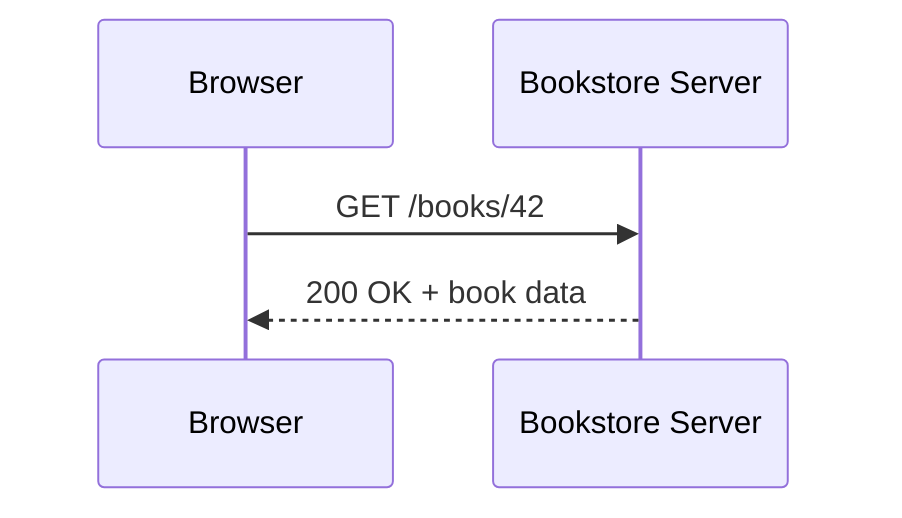

This is the **request/response model**, and it comes with a rule that's easy to miss because it's so basic: the client always speaks first. The server never sends anything unless it was just asked. Plain HTTP has no concept of the server saying "here's an update" out of nowhere — that limitation is exactly why a later guide in this series (WebSockets & Server-Sent Events) exists at all.

---

## Chapter 2: HTTPS Is Not a Different Protocol

Here's the misconception worth clearing up early: HTTP and HTTPS are not two competing protocols with different rules. **HTTPS is the exact same HTTP** — same methods, same status codes, same headers, same request/response shape — just carried inside the TLS-encrypted connection the previous guide built.

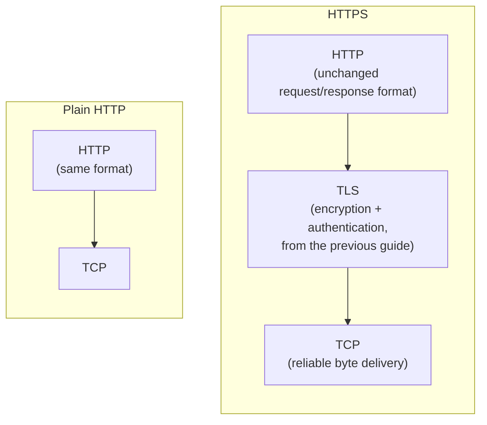

The only difference is which layer HTTP is riding on top of. Over plain HTTP, the exact same `GET /books/42 HTTP/1.1` request travels as plaintext, visible to anyone on the path — everything Chapter 1 of the previous guide warned about. Over HTTPS, that identical request is encrypted before it ever leaves the browser, and the server's identity has already been verified by the time it arrives. **"S" for secure isn't a new dialect of HTTP — it's the same dialect, spoken through a locked, verified channel instead of an open one.**

This is also why the port differs by convention — plain HTTP defaults to port 80, HTTPS to port 443 — but that's just a convention for "which door to knock on," not a difference in the language spoken once you're inside.

---

## Chapter 3: HTTP Remembers Nothing

Here's a property of HTTP that surprises people coming from almost any other kind of software: **HTTP is stateless.** The server that answers `GET /books/42` has no memory that this browser asked for anything before, and no memory that it will ask for anything after. Each request stands completely alone.

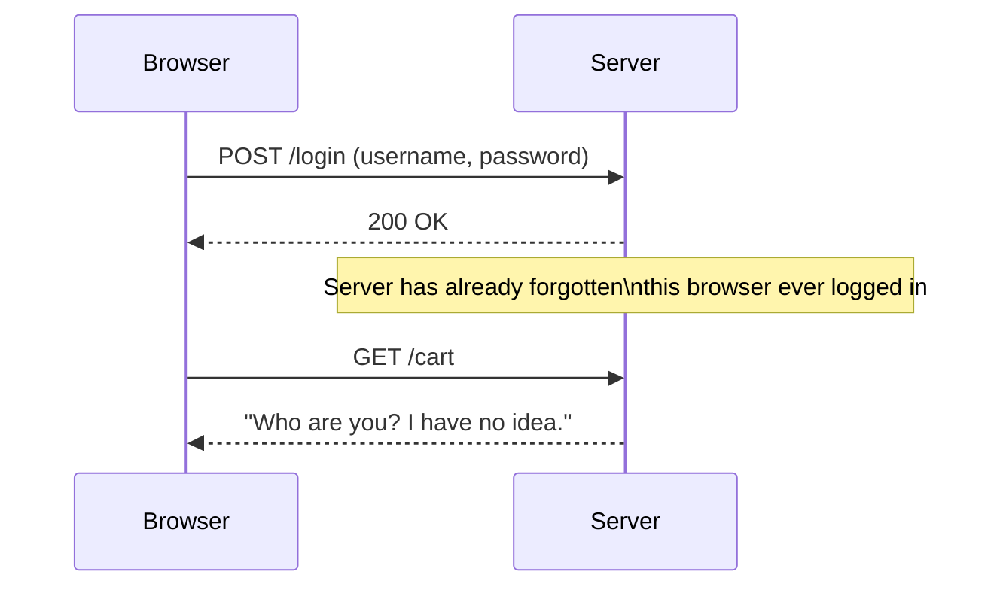

That's obviously not how a real website behaves — the bookstore needs to remember that the customer is logged in, and remember what's in her cart, across many separate requests. Since HTTP itself won't do that, the fix is bolted on top: a **cookie** — a small piece of data the server asks the browser to store and send back with every future request, effectively re-introducing the browser to the server on each request.

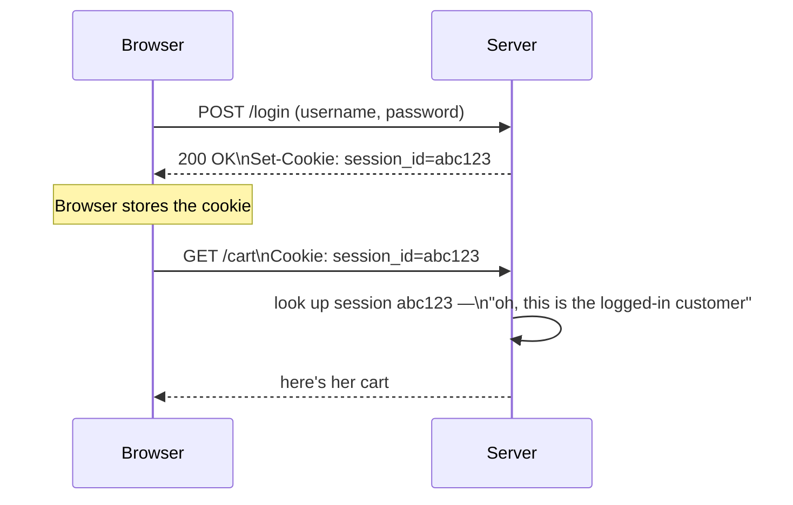

Statelessness wasn't an oversight — it's what makes HTTP servers easy to scale horizontally (recall the first guide of the ArchitecturePatterns series): any server in a pool can answer any request, because no single server is required to have "remembered" a particular customer. The cookie carries the state, not the server.

---

## Chapter 4: What Each Method Actually Promises

An HTTP request always names a **method** — GET, POST, PUT, DELETE, PATCH, and a few others — and each one is a promise about what kind of thing is about to happen, not just a label.

| Method | Meaning | Safe? | Idempotent? |
|---|---|---|---|
| **GET** | Retrieve something, change nothing | Yes | Yes |
| **POST** | Create something new, or trigger an action | No | No |
| **PUT** | Replace something entirely with what's given | No | Yes |
| **PATCH** | Partially update something | No | Usually not |
| **DELETE** | Remove something | No | Yes |

Two words in that table matter far more in practice than most engineers give them credit for. **Safe** means the method doesn't change any state on the server — a GET request should be free to retry, cache, or prefetch without consequence, because it never modifies anything. **Idempotent** means sending the exact same request twice has the exact same effect as sending it once.

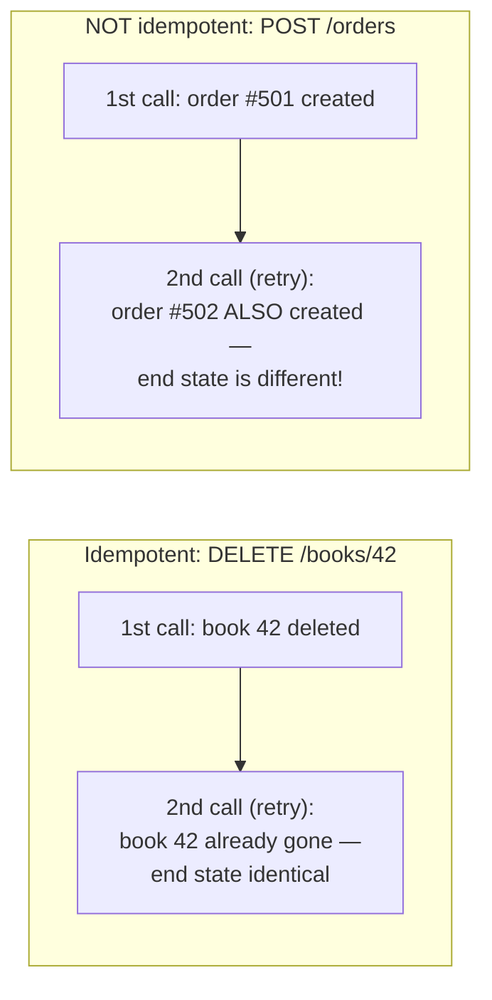

This distinction is exactly why a network retry is safe to do blindly for a GET or a DELETE, but dangerous to do blindly for a POST. If a customer clicks "Place Order" and the response times out — did the order go through, or not? Retrying that POST without care risks charging the customer twice, which is precisely the same "did it succeed or not" problem the very first ArchitecturePatterns guide raised about network calls in general, and precisely why the Saga Pattern guide's idempotent consumers (checking "have I already processed this?" before acting) exist: the fix for a non-idempotent operation is to make retrying it safe on purpose, usually by attaching a unique idempotency key to the request so the server can recognize and ignore a duplicate.

---

## Chapter 5: Status Codes Are Also a Promise

The response side has its own small vocabulary worth knowing at a glance, grouped by their first digit:

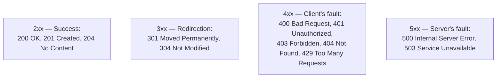

The 4xx/5xx split matters more than it might seem: a 404 tells the customer (and any monitoring dashboard) "you asked for something that doesn't exist" — nothing is broken. A 500 says "something on the server side genuinely failed" — this is the number that should page someone. Conflating the two in logs or alerts (treating every non-2xx response as "an error, go investigate") is a common, avoidable source of noisy on-call rotations.

---

## Chapter 6: HTTP/1.1's Head-of-Line Blocking Problem

HTTP's request/response model has been stable since the 1990s, but *how* those requests and responses actually travel over the wire has changed dramatically, because the simple version turned out to waste real time.

Under **HTTP/1.1**, a browser opens a TCP connection and can reuse it for multiple requests (**keep-alive**, avoiding a fresh TCP handshake for every single request) — but within one connection, requests are answered strictly in order.

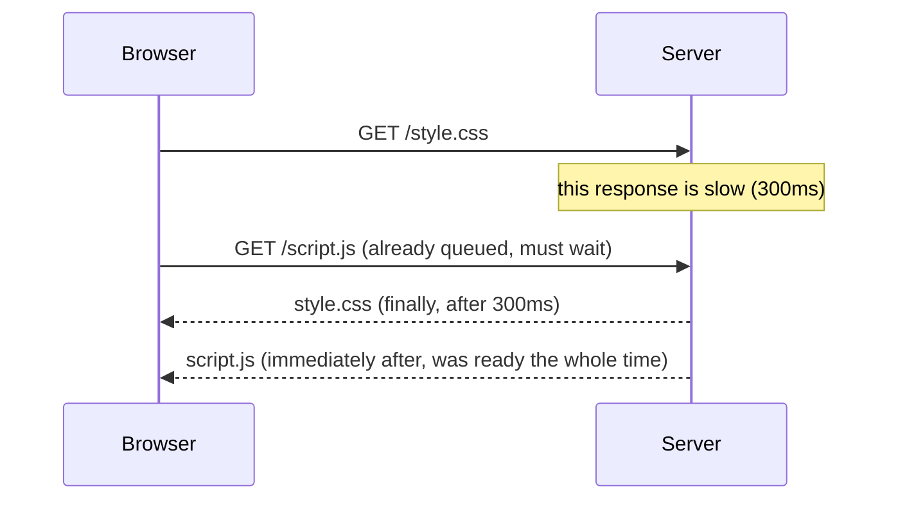

If the first request is slow, everything behind it on that connection is stuck waiting, even if the server already has the second response ready to go. This is **head-of-line blocking**: one slow response blocks every response queued behind it, purely because of ordering, not because anything is actually broken. The workaround browsers used for years — opening 6 to 8 parallel TCP connections to the same server just to get more requests moving concurrently — works, but each connection pays its own TLS handshake cost from the previous guide, and it's a blunt fix for a problem that shouldn't need one.

---

## Chapter 7: HTTP/2 — Multiplexing Over One Connection

**HTTP/2**, standardized in 2015 (evolved from Google's earlier experimental **SPDY** protocol), fixes head-of-line blocking at the HTTP layer directly: multiple requests and responses can be in flight, interleaved, over a single TCP connection, at the same time.

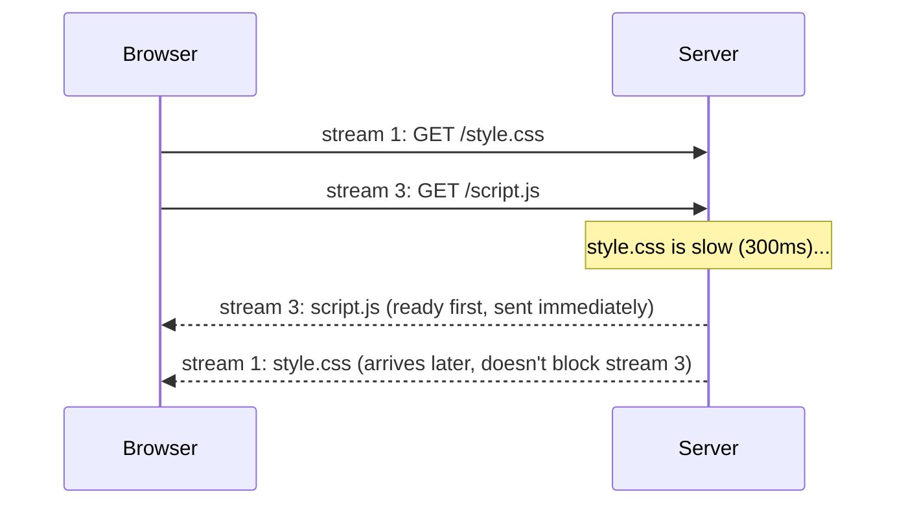

Each request/response pair travels as its own independent **stream**, multiplexed onto the one connection — a slow response on one stream no longer holds up a fast response on another. HTTP/2 also adds **header compression** (HTTP headers repeat enormously across requests to the same site — cookies, user-agent strings — and compressing that repetition saves real bandwidth) and, less commonly used in practice, **server push** (letting the server proactively send a resource it knows the browser will need next, without waiting to be asked — though most major browsers have since removed push support in favor of other techniques, because it turned out to be difficult to get real performance wins from in practice).

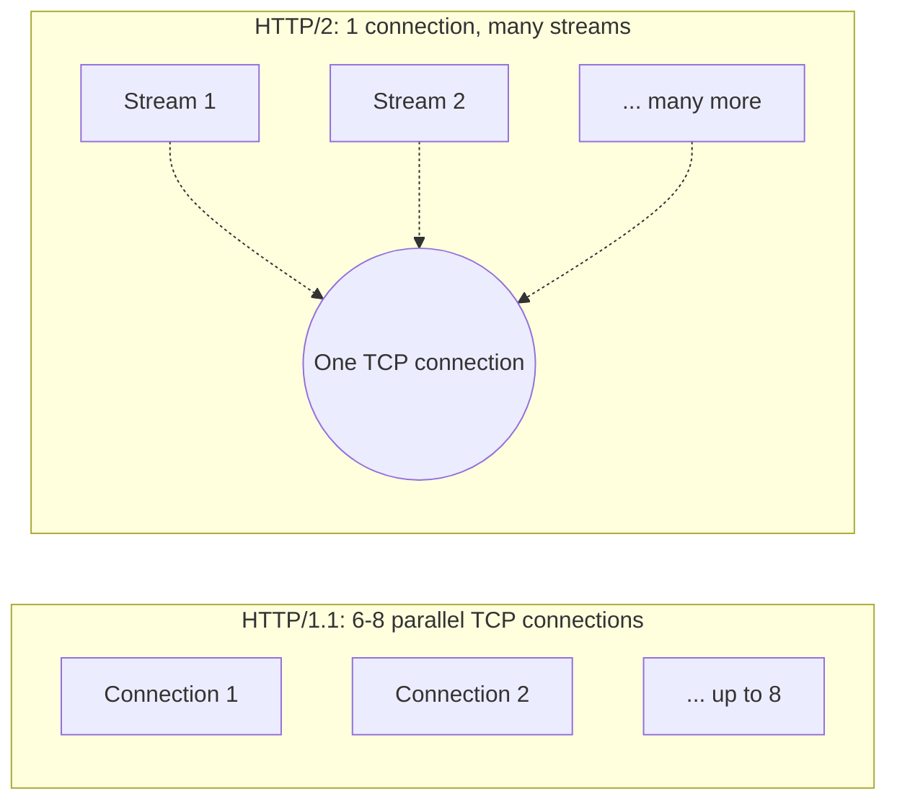

One connection instead of eight also means paying the TLS handshake cost from the previous guide exactly once per server, not once per parallel connection — a direct, compounding win on top of fixing head-of-line blocking.

---

## Chapter 8: HTTP/3 — Escaping TCP Itself

HTTP/2 fixed head-of-line blocking at the HTTP layer, but left a subtler version of the same problem sitting one layer down, in **TCP** itself: TCP guarantees bytes arrive in order, which means if a single packet is lost anywhere in the stream, TCP holds back *every* byte that arrived after it — across *all* of HTTP/2's multiplexed streams at once — until the lost packet is retransmitted and its place in line is filled. HTTP/2 solved head-of-line blocking between requests; a lost packet still blocks everything, because TCP doesn't know about HTTP's streams at all — to TCP, it's all just one ordered sequence of bytes.

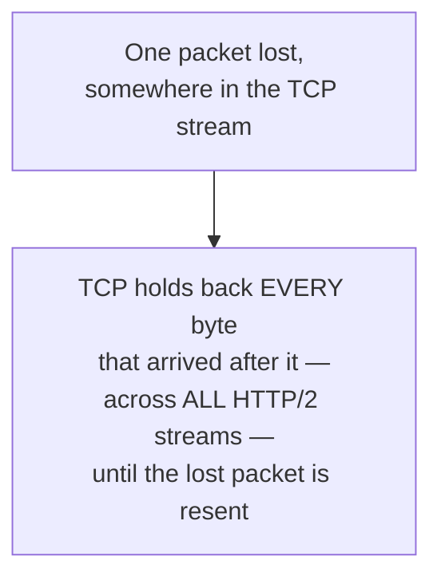

**HTTP/3**, standardized in 2022, fixes this by abandoning TCP entirely and building on **QUIC** — a transport protocol Google originally designed and later handed to the IETF for standardization, which runs over **UDP** instead of TCP. QUIC re-implements reliability and ordering itself, but crucially, it does so *per stream* — a lost packet on one stream only blocks that stream, and every other stream keeps flowing.

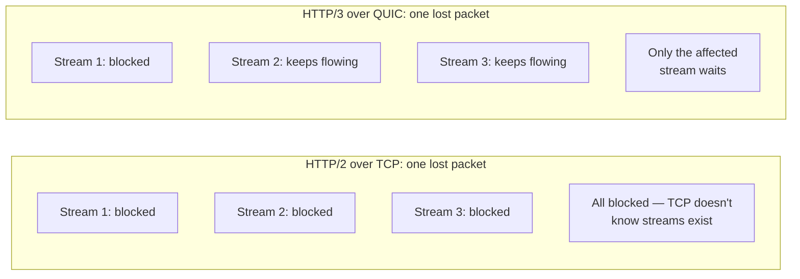

QUIC also folds the TLS handshake from the previous guide directly into its own connection setup, so establishing a new QUIC connection and negotiating encryption often happens in a single combined round trip rather than as two separate steps. Google shipped QUIC in Chrome and used it for YouTube years before formal standardization, and Cloudflare and Fastly were among the first major infrastructure providers to enable HTTP/3 broadly for their customers once it stabilized.

---

## Chapter 9: The Real Costs

**Adoption isn't universal or instant.** HTTP/1.1 is still extremely common in practice — plenty of internal services, older infrastructure, and simple use cases never had a reason to move off it, and moving is optional work with a real but not always urgent payoff.

**HTTP/3's UDP foundation has its own friction.** Plenty of corporate firewalls and older network equipment are configured to trust TCP traffic far more readily than UDP, sometimes blocking or throttling UDP outright — meaning a client attempting HTTP/3 may need to gracefully fall back to HTTP/2 over TCP, adding real client-side complexity to handle both paths correctly.

**Multiplexing shifts problems, it doesn't delete them.** HTTP/2 and HTTP/3 both make it cheaper to fire off many requests concurrently on one connection — but a server that was already close to its capacity limit doesn't get more capacity just because the requests arrive more efficiently. The requests still have to be processed somewhere; this is the same theme the Bulkhead and Backpressure guides in the ArchitecturePatterns series cover in depth.

---

## Chapter 10: Which Version Do You Actually Need to Think About?

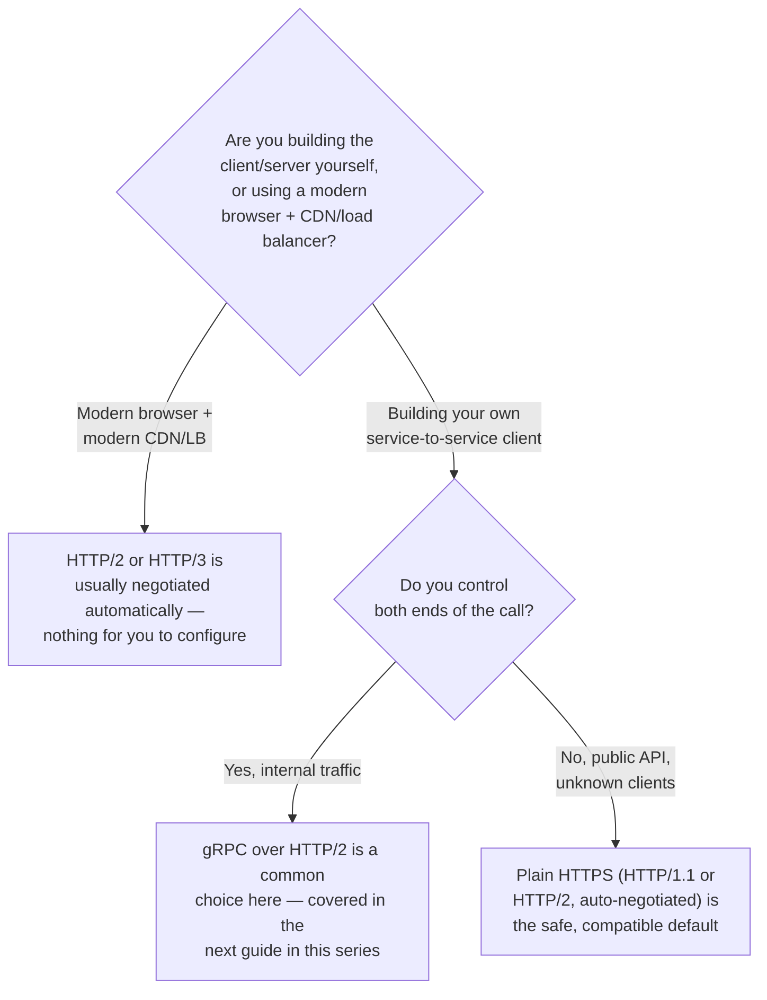

For most engineers, the honest answer is: HTTP/2 and HTTP/3 support is something your browser, CDN, and load balancer already negotiate automatically, and there's rarely a reason to think about it directly — the value is in understanding *why* the upgrade happened, so a "why is this slow" investigation doesn't stop at "well, it's HTTP" without asking which version, and whether head-of-line blocking is actually the culprit.

---

## The Full Story, End to End

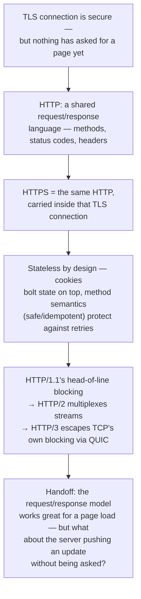

| | HTTP/1.1 | HTTP/2 | HTTP/3 |
|---|---|---|---|
| Transport | TCP | TCP | QUIC over UDP |
| Concurrent requests per connection | One at a time (or several parallel connections) | Multiplexed streams, one connection | Multiplexed streams, one connection |
| Head-of-line blocking | Yes, at the HTTP level | Fixed at HTTP level, still present in TCP | Fixed at both levels |
| Handshake | TCP + separate TLS handshake | TCP + separate TLS handshake | Combined into one round trip |
| Standardized | 1997 (revised 1999, 2014) | 2015 | 2022 |
| Best for | Legacy compatibility | The common default today | High-latency, lossy networks (mobile) |

**Where would you like to go next?** Natural threads from here:

- **WebSockets & Server-Sent Events** — plain HTTP's request/response model can't have the server push data on its own; this guide covers what does
- **RPC vs. REST vs. GraphQL vs. gRPC** — how client and server agree on the *shape* of the data exchanged over HTTP, not just the transport mechanics
- **API Gateway & Reverse Proxy** — where TLS termination and HTTP version negotiation typically happen in a real production architecture
