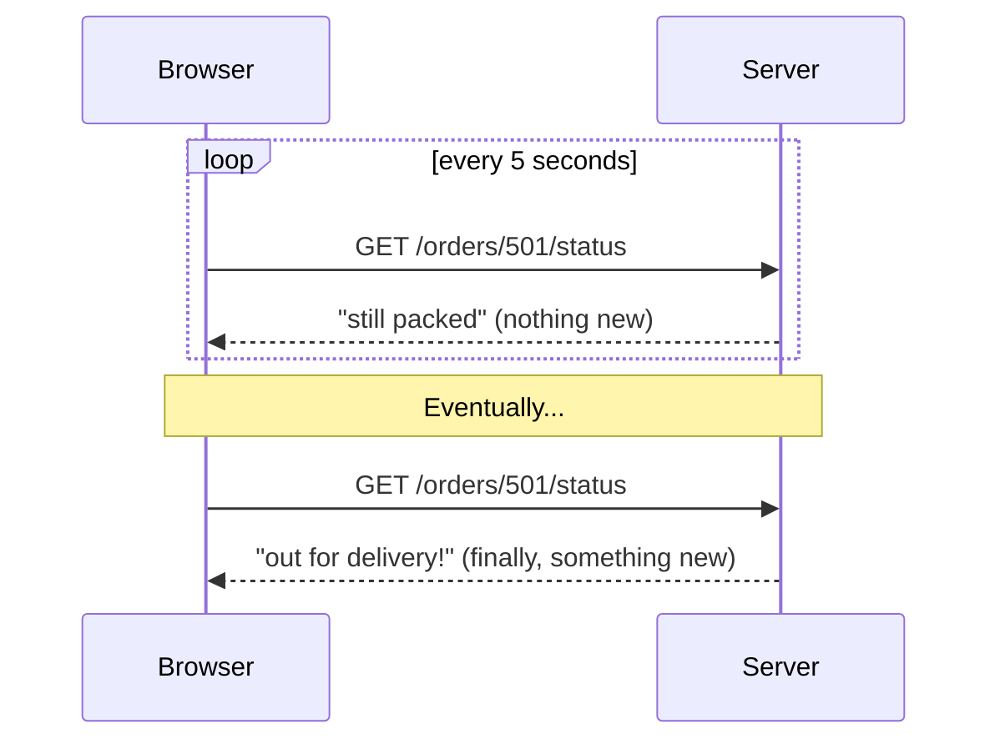
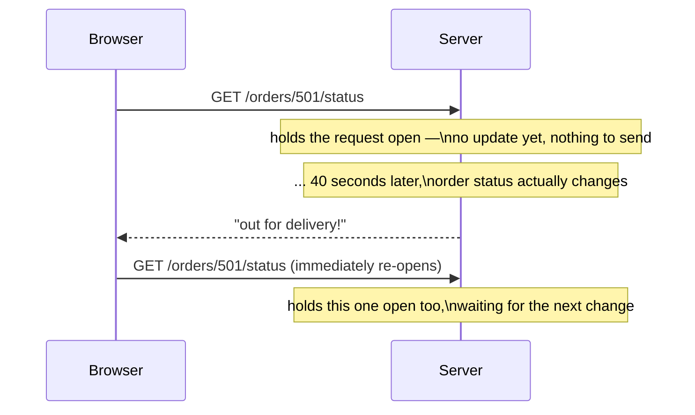
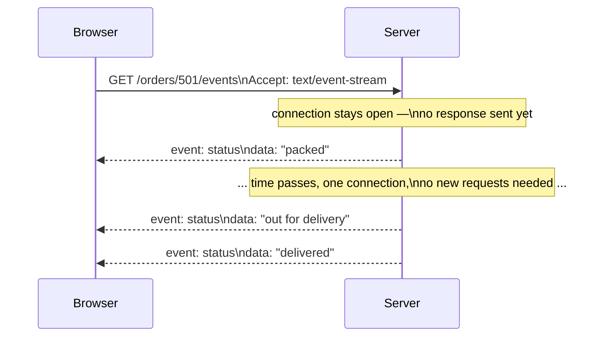
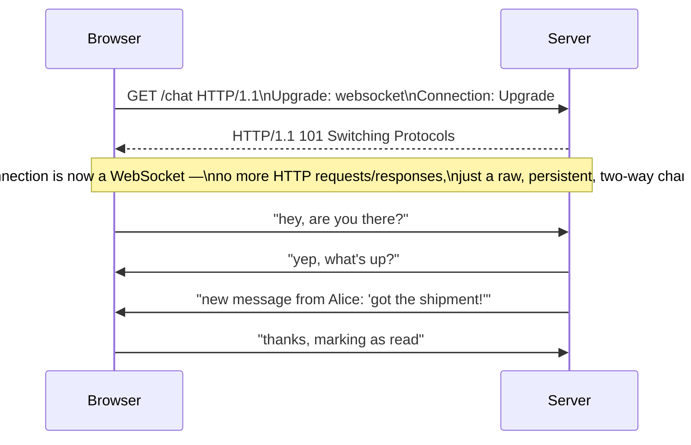
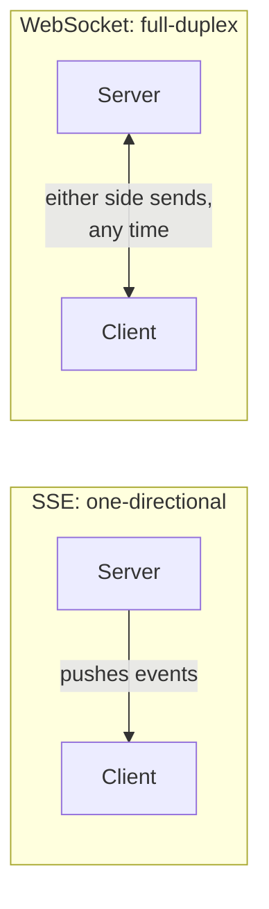
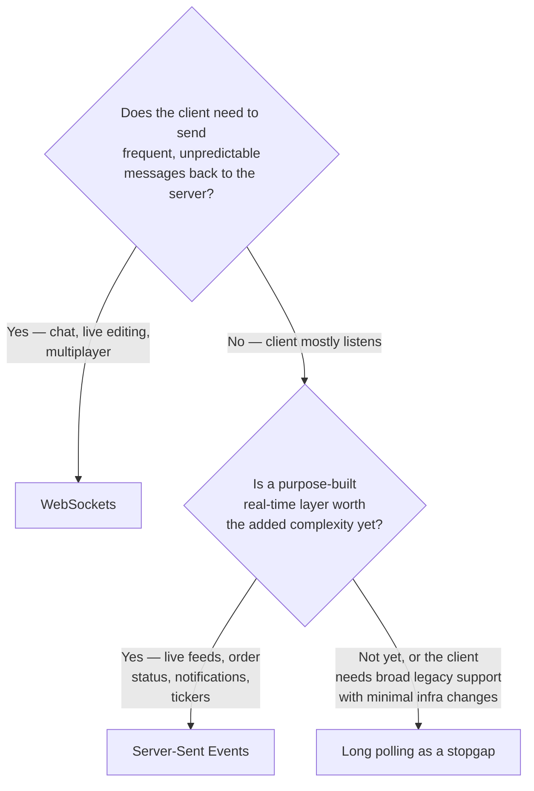
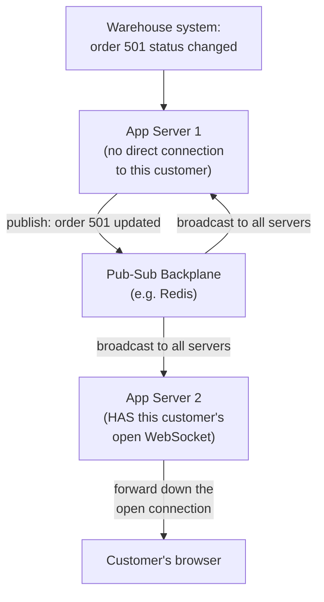
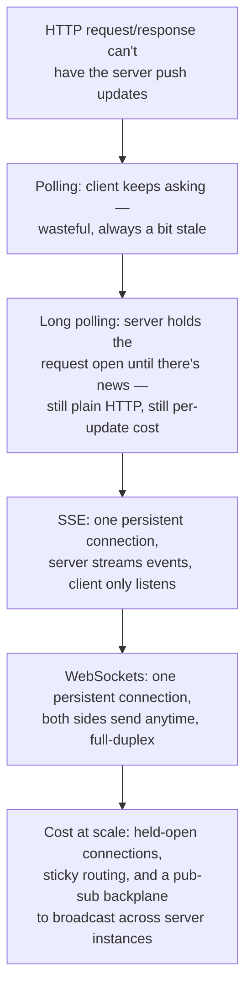

## The Story of WebSockets and Server-Sent Events

The previous guide ended on a limitation worth sitting with: plain HTTP is request/response only — the client always speaks first, and the server can never push anything on its own. That was fine for loading a page of books. It falls apart the moment the bookstore wants to show a customer her order moving from "packed" to "out for delivery" without her sitting there hitting refresh.

---

## Interview Cheat Sheet

**The problem these solve:** HTTP's request/response model has no way for a server to push data to a client that hasn't just asked for something — these are the tools that add that capability back in.

**Key facts:**
- **Long polling** fakes server push using only plain HTTP requests — simple, but wasteful and always a little behind real-time
- **SSE (Server-Sent Events)** is a one-directional stream — server to client only — built on plain HTTP, with automatic reconnection built into the browser
- **WebSockets** are full-duplex — both sides can send at any time, over one persistent connection, after an initial HTTP-based handshake
- None of these are free at scale: every open connection ties up a real resource on the server, and load balancers need to be configured to keep it alive, not treat it like a normal short-lived HTTP request

**Common interview gotchas:**
- SSE is one-directional; if the client also needs to send frequent updates back, that's a WebSocket, not SSE
- WebSockets don't run "on top of HTTP" after the handshake — the handshake itself is an HTTP request, but once upgraded, it's a completely different framing, not HTTP messages anymore
- Scaling WebSockets horizontally is not just "add more servers" — a message published because of a request on Server A has to somehow reach a connection held open on Server B, which needs a shared broadcast mechanism (a **pub-sub backplane**)
- Reconnection handling is not optional — networks drop connections constantly (a phone switching from WiFi to cellular, for example), and a real system needs a defined behavior for "what happens when the connection blips"

**The core trade-off:** the closer you get to true real-time, bidirectional communication, the more server-side connection state you're committing to hold open and scale — plain polling holds no state between requests at all; WebSockets hold a live, stateful connection per client, for as long as that client is around.

---

## Chapter 1: Refresh Isn't Good Enough Anymore

Picture the customer from the earlier guides, now watching her order's tracking page. The simplest possible design: her browser just asks "any updates?" over and over.

This is called **polling**, and it works, but it's wasteful in a specific, measurable way: almost every one of those requests comes back with nothing new, yet it still costs a full HTTP request/response round trip, a TLS handshake's worth of setup if the connection isn't reused, and a hit to the server just to say "nothing changed." And whatever the polling interval is — 5 seconds, in this example — that's also the worst-case delay before the customer finds out about a real update. Poll more often, and you waste more; poll less often, and updates feel sluggish. Neither direction of that dial actually fixes the underlying problem: **the client is guessing when to ask, instead of the server simply saying something the moment it has something to say.**

---

## Chapter 2: Long Polling — A Clever Patch, Still Just HTTP

**Long polling** is the first real improvement, and it's a clever trick rather than a new protocol: the client sends a request exactly like before, but this time the server doesn't answer right away. It holds the request open, waiting, until either something actually changes or a timeout is reached — and only then sends the response. The moment the client gets a response, it immediately sends another request, so there's always one request "parked," open, waiting for the next update.

This closes most of the gap from Chapter 1 — the customer finds out about the update almost the instant it happens, instead of waiting for the next poll interval — using nothing more exotic than plain HTTP requests held open a little longer than usual. But it's still fundamentally a request/response cycle repeated forever: every single update still costs a full new HTTP request, the server still has to hold a connection (and often a server-side thread or worker) open per waiting client, and if the update never comes before the timeout, the whole cycle repeats for nothing. Long polling is a genuinely useful patch, and it's also the clearest possible illustration of *why* a purpose-built solution was worth inventing.

---

## Chapter 3: Server-Sent Events — Let the Server Just Keep Talking

**SSE (Server-Sent Events)** solves the "why does every update need a whole new request" problem directly: the client opens **one** HTTP connection, and instead of the server sending one response and closing it, the server keeps that same connection open indefinitely and streams a sequence of small text events down it over time, whenever it has something new to say.

This is exactly one-directional: the server pushes, the client only ever listens on this connection (it would use a separate, normal HTTP request if it needed to send something, like cancelling the order). That one-way limitation is a feature, not an oversight — it keeps SSE simple, and browsers ship a built-in `EventSource` API that handles the connection and, notably, **automatic reconnection** if the connection drops, including remembering the last event ID it received so the server can resume from where it left off, all without the application writing any of that reconnection logic itself.

SSE is a strong fit for exactly the shape of problem that opened this guide: a live order-status feed, a stock ticker, a social feed's live update count, a notifications badge — anything where the server has things to announce and the client just needs to listen.

---

## Chapter 4: WebSockets — When the Client Needs to Talk Back, Live

SSE assumes the client is a listener. That assumption breaks the moment you need both sides talking at once — a customer support chat window, two people editing the same document simultaneously, a multiplayer game. For those, you need **WebSockets**: one persistent connection where either side can send a message to the other, at any moment, with no request/response structure at all once it's set up.

A WebSocket connection starts as a normal HTTP request, then asks to be upgraded:

That `101 Switching Protocols` response is the pivot point: the browser asked for an ordinary resource, but told the server it's willing to speak a different language on this same TCP connection from here on out, and the server agreed. After that handshake, neither side is sending HTTP requests anymore — they're exchanging small **frames** (WebSocket's own message unit) in either direction, whenever either side has something to say, with no "who goes first" rule at all.

Real products lean on exactly this distinction: Slack and Discord use WebSockets for live chat because messages flow in both directions unpredictably; Google Docs uses a similar persistent, bidirectional connection so every collaborator's keystrokes propagate to everyone else editing the same document in real time. Many teams don't hand-roll raw WebSockets directly — libraries like **Socket.IO** wrap WebSockets with fallback to long polling for clients or networks that can't complete the upgrade, plus reconnection and message-acknowledgment logic on top.

---

## Chapter 5: Picking the Right One

The honest ranking, from simplest-but-least-real-time to most-capable-but-most-stateful: **plain polling** costs nothing to build but wastes requests and always lags; **long polling** is a solid stopgap using only ordinary HTTP infrastructure; **SSE** is the right default the moment updates only ever flow server-to-client; **WebSockets** are the right (and only) choice the moment the client needs to push data back just as freely as it receives it.

---

## Chapter 6: The Cost — Every Open Connection Is a Held Resource

### Cost 1 — Connections Don't Come Free at Scale

A normal HTTP request occupies a server resource for milliseconds. An open SSE stream or WebSocket occupies one for as long as the customer keeps the page open — minutes, hours, sometimes an entire work session. Ten thousand customers with an order-tracking page open is ten thousand connections a server pool has to hold simultaneously, not ten thousand quick in-and-out requests. This is precisely the kind of shared-resource pressure the Bulkhead Pattern guide (in the ArchitecturePatterns series) covers — a server handling both quick REST calls and long-lived WebSocket connections out of the same resource pool risks the long-lived connections starving the quick ones, unless they're deliberately isolated.

### Cost 2 — Load Balancers Need to Know These Connections Are Special

A normal load balancer, built around the assumption that each request is short and independent, can freely send any request to any backend server. A WebSocket or SSE connection is the opposite: once established, it has to stay pinned to the same backend server for its entire lifetime (often called **sticky sessions** or session affinity), because that server is the one holding the actual open socket and whatever in-memory state goes with it.

### Cost 3 — Scaling Out Means Broadcasting Across Servers

Here's the subtlety that catches teams off guard the first time they scale past one server: if Customer A's order-status update is triggered by a warehouse system calling into Server 1, but Customer A's browser has its WebSocket connection open to Server 2, Server 1 has no direct way to reach that connection — it doesn't own it. The standard fix is a **pub-sub backplane**: a shared messaging layer (Redis pub/sub is a common, lightweight choice; the message brokers from the ArchitecturePatterns Event-Driven guide work too) that every server subscribes to, so any server can publish "order 501 changed" and whichever server actually holds that customer's live connection picks it up and forwards it down the socket.

Without this piece, "real-time updates" quietly only work when the triggering event and the customer's connection happen to land on the same server — which looks fine in testing with one server and breaks unpredictably in production with several.

### Cost 4 — Reconnection Is Part of the Design, Not an Edge Case

Mobile networks drop connections routinely — a phone moving from WiFi to cellular, an elevator, a tunnel. SSE's built-in reconnection (Chapter 3) handles this gracefully by default. WebSockets don't include this for free; the application has to detect a dropped connection, reconnect, and often re-synchronize any state that might have been missed while disconnected — which is exactly the gap libraries like Socket.IO exist to fill.

---

## The Full Story, End to End

| | Polling | Long Polling | SSE | WebSockets |
|---|---|---|---|---|
| Direction | Client asks, server answers | Client asks, server delays answer | Server → client only | Both directions, anytime |
| Built on | Plain HTTP | Plain HTTP | Plain HTTP (streamed) | HTTP handshake, then its own framing |
| Update latency | Up to one poll interval | Near-instant | Near-instant | Near-instant |
| Reconnection | N/A — stateless anyway | Manual | Automatic (built into browsers) | Manual (or via a library) |
| Server cost per client | Low, brief | Held connection per client | Held connection per client | Held connection per client |
| Best for | Rarely — a fallback of last resort | Simple real-time on legacy infra | Live feeds, order status, tickers | Chat, collaborative editing, multiplayer |

**Where would you like to go next?** Natural threads from here:

- **RPC vs. REST vs. GraphQL vs. gRPC** — now that transport (HTTP and WebSockets) is settled, how client and server agree on the actual shape of the data being exchanged
- **API Gateway & Reverse Proxy** — the infrastructure layer that has to be configured correctly to keep a WebSocket connection pinned and alive, not treated like a short-lived HTTP request
