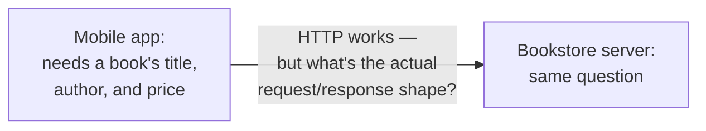
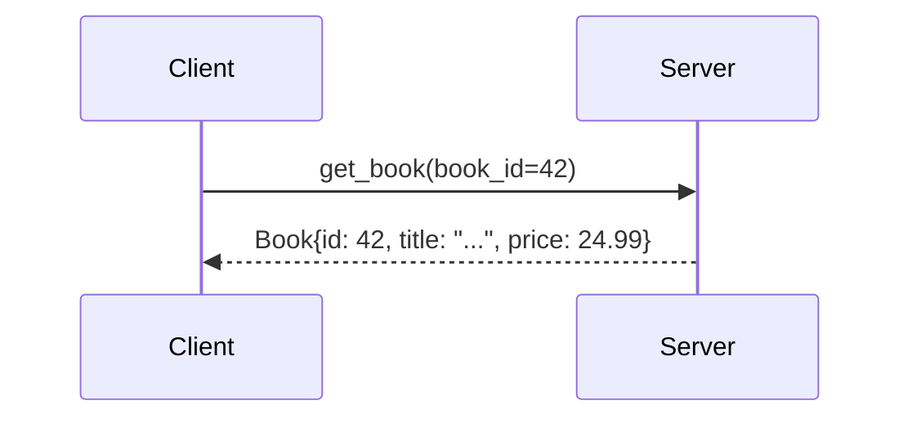
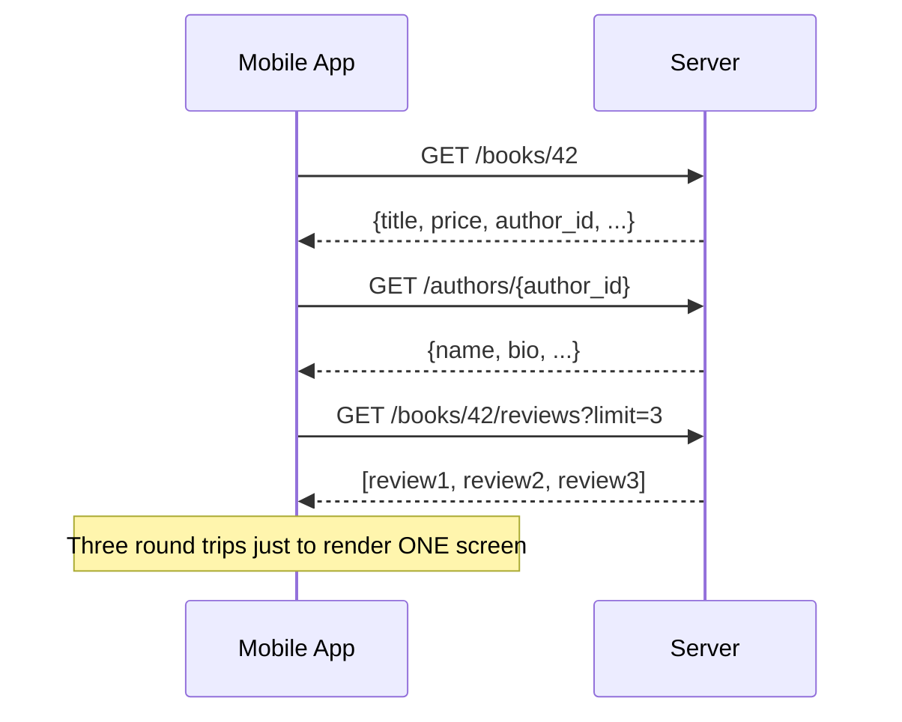
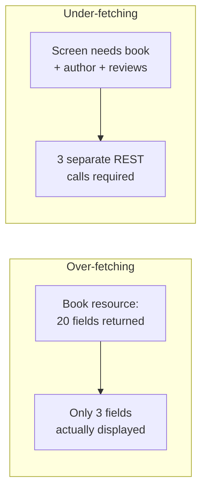
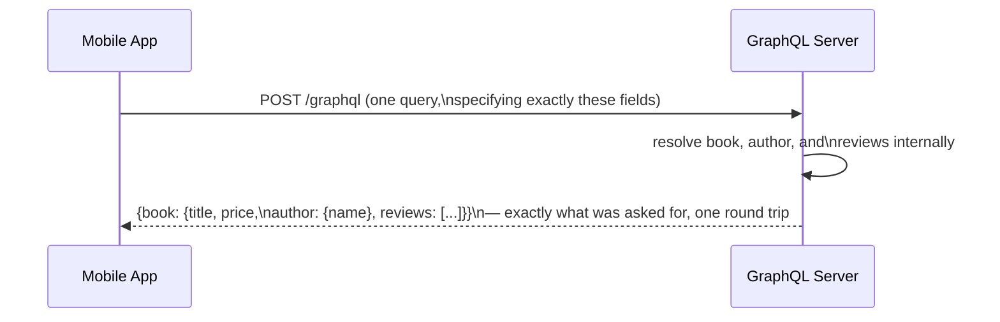
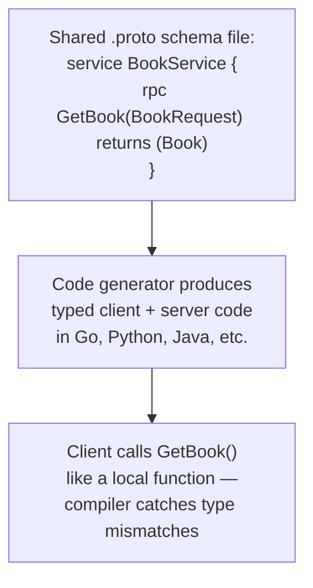
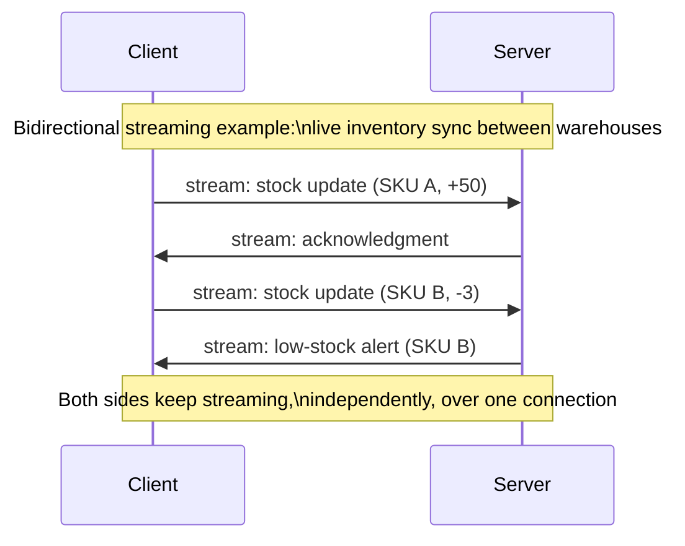
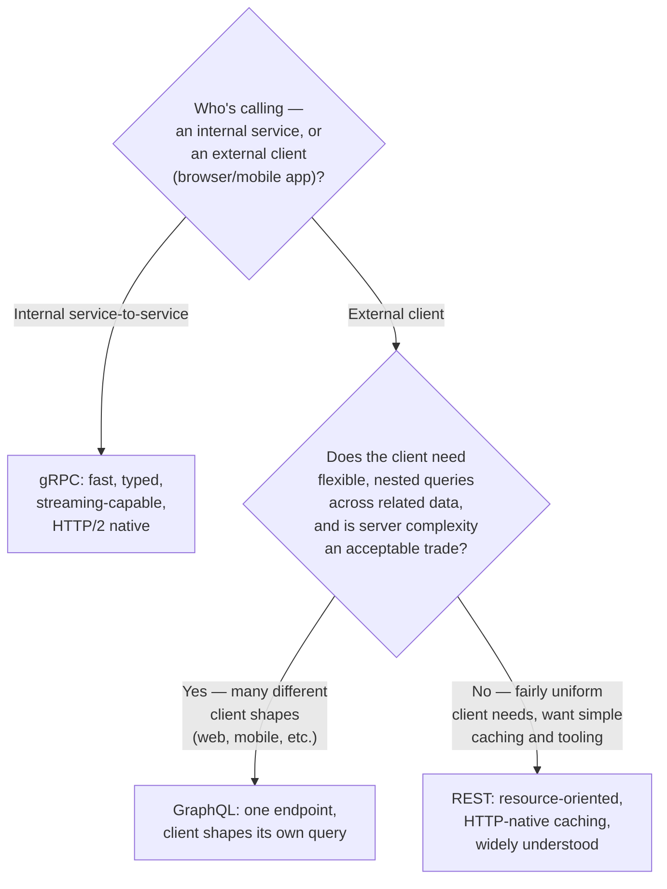
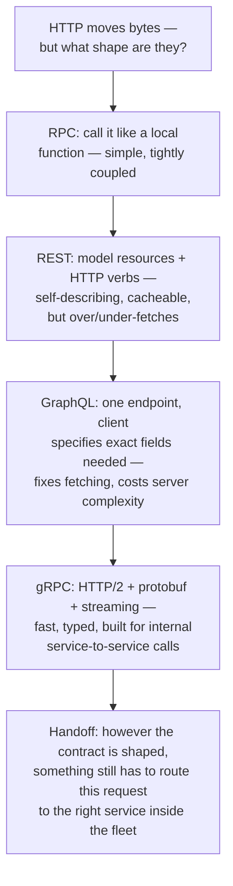

## The Story of RPC vs. REST vs. GraphQL vs. gRPC

Transport is settled: a connection can be secured (TLS), spoken over (HTTP or WebSockets), and kept open for live updates when needed. None of that says anything about the actual question a client and server still have to agree on: when the bookstore's mobile app asks for a book's page, what shape does that request take, and what shape comes back?

---

## Interview Cheat Sheet

**The problem these solve:** transport protocols move bytes; none of them define what those bytes *mean* — RPC, REST, GraphQL, and gRPC are four different answers to "how do client and server agree on the shape of a request and response."

**Key facts:**
- **RPC (Remote Procedure Call)** makes a network call look like calling a local function — simple to reason about, tightly coupled to a specific function signature
- **REST** models everything as **resources** (nouns, like `/books/42`) manipulated with standard HTTP methods (verbs) — this is the dominant style for public web APIs
- **GraphQL** flips the model: one endpoint, and the client specifies exactly which fields it wants, in one request, even across related resources
- **gRPC** is Google's RPC framework, built on HTTP/2, using compact binary serialization (protobuf) and native support for streaming — the default choice for internal service-to-service calls

**Common interview gotchas:**
- REST's defining property isn't "uses JSON over HTTP" — it's resource-oriented URLs plus meaningful use of HTTP methods and status codes (see the previous guide's idempotency chapter)
- GraphQL doesn't replace REST's HTTP transport — a GraphQL API is still typically one `POST` endpoint over HTTP; what changed is the query shape, not the transport
- gRPC isn't callable directly from a browser — its binary framing needs `grpc-web` or a proxy translation layer, which is why public browser-facing APIs rarely use raw gRPC
- "GraphQL vs REST" is not "new vs old, always pick new" — GraphQL trades REST's simple HTTP caching away in exchange for flexible querying, and that trade isn't free

**The core trade-off:** the more flexibility you give the client to shape its own request (GraphQL) or the more efficiency you optimize for machine-to-machine calls (gRPC), the further you move away from REST's simplicity, human-readability, and out-of-the-box cacheability.

---

## Chapter 1: A Network Call Still Needs an Agreed Shape

A raw HTTP request is just a method, a path, some headers, and maybe a body — none of that says what a "book" looks like, what fields it has, or what operations are valid on it. Client and server need a shared contract on top of the transport, the same way two people need a shared language even once the phone line connecting them works perfectly.



Four different answers to that question, each with a real history and a real reason it exists, are what this guide walks through.

---

## Chapter 2: RPC — Make It Look Like a Local Function Call

The oldest and most direct idea: make calling a remote service look, in code, exactly like calling a function in the same program.

```python
# This reads like a local function call —
# but "get_book" is secretly a network request to another service.
book = bookstore_client.get_book(book_id=42)
```

This is **RPC (Remote Procedure Call)** — the client calls a named procedure with specific arguments, the network call happens invisibly underneath, and a response comes back shaped like a return value. It's intuitive precisely because it hides the fact that a network call happened at all — which the first guide of the ArchitecturePatterns series warned is exactly the danger: a function call can't time out or receive a garbled response from a half-crashed server, but code written in this RPC style *looks* like it can't either, even though the network call underneath absolutely can fail in all those ways.



RPC's core weakness is tight coupling: the client's code is written against one specific function's exact name and argument shape. Change that function's signature on the server, and every client calling it needs to update in lockstep — there's no resource model or generic vocabulary sitting between them to absorb the change.

---

## Chapter 3: REST — Resources, Not Function Calls

**REST (Representational State Transfer)**, defined in Roy Fielding's year-2000 doctoral dissertation, took a different approach: instead of exposing named functions, expose **resources** — nouns, like "a book" or "an order" — each with its own URL, manipulated using a small, standard, reusable set of HTTP methods (the same GET/POST/PUT/DELETE vocabulary the previous guide covered) instead of an unlimited number of custom function names.


This constraint is what makes REST powerful in practice, not a limitation: because every resource follows the same small vocabulary of methods, a REST API is largely self-describing — a developer who's never seen this specific API can still correctly guess that `DELETE /orders/501` cancels order 501, without reading custom documentation for a `cancelOrder` function. It's also why REST became the default style for public web APIs: **GET requests are naturally cacheable** (a browser, CDN, or proxy can safely cache and reuse a response to a GET without any special coordination, precisely because GET is defined to be safe and idempotent, as covered in the previous guide) — and caching a plain resource fetch is exactly the sort of thing the CDN guide later in this series depends on being possible by default.

---

## Chapter 4: Where REST Starts to Strain

REST's resource model works beautifully for one resource at a time. It starts to strain the moment a screen needs data assembled from *several* related resources at once — which is most real screens.

Picture the bookstore's book detail page: title and price (from the book resource), the author's name and bio (a separate resource), and the top 3 reviews (yet another resource).



That's **under-fetching**: one screen, three separate round trips, each one adding its own latency on a slow mobile connection. The opposite problem shows up just as often: **over-fetching** — the `GET /books/42` response might include 20 fields (ISBN, publisher, print date, warehouse location, dimensions...) when the mobile app's book detail screen only actually displays 3 of them, wasting bandwidth on every single request, which matters a great deal on a slow or metered mobile connection.



Neither problem is REST being done wrong — it's a direct consequence of resources being fixed, server-defined shapes. Fixing over-fetching for one client (making the response smaller) risks under-fetching for a different client that needed one of the fields you just removed. This exact tension is what the next tool was built to eliminate.

---

## Chapter 5: GraphQL — Let the Client Ask for Exactly What It Needs

**Facebook** built **GraphQL** internally starting in 2012, open-sourcing it in 2015, specifically because its mobile news feed was hitting Chapter 4's problem hard: slow mobile networks made every extra round trip expensive, and every unused field in an over-fetched response was wasted bandwidth on connections where that mattered.

GraphQL's core move: instead of many fixed-shape resource endpoints, expose **one** endpoint, and let the client send a **query** describing exactly which fields it wants, across however many related objects, in a single request.

```graphql
query {
  book(id: 42) {
    title
    price
    author { name }
    reviews(limit: 3) { text, rating }
  }
}
```



This directly fixes both of Chapter 4's problems at once: **no over-fetching**, because the client listed exactly the fields it wants, nothing more; and **no under-fetching**, because related data (author, reviews) comes back nested in the same single response, instead of needing separate round trips. Note what didn't change: this is still a `POST` request over the same HTTP transport from the previous guide — GraphQL is a different way of shaping the request and response, not a replacement for HTTP itself.

---

## Chapter 6: gRPC — Built for Fast, Typed, Internal Calls

**gRPC**, built by Google and open-sourced in 2015, targets a different problem entirely: not "how do we serve flexible queries to public web/mobile clients," but "how do internal services call each other as fast and safely as possible." It's built directly on **HTTP/2** (from the previous guide) to take advantage of multiplexed streams, and it serializes data using **Protocol Buffers (protobuf)** — a compact binary format defined by a strict schema — instead of REST or GraphQL's human-readable JSON.



That schema-first design (writing the `.proto` file, then generating strongly-typed client and server code from it in whatever language each side uses) gives gRPC something REST and GraphQL don't have out of the box: a compile-time guarantee that client and server agree on the exact shape of every field, catching a whole category of "the field I expected isn't there" bugs before the code even runs.

gRPC also has native support for **streaming** — not just one request, one response, but a client sending a stream of messages, a server sending a stream back, or both at once — built directly on top of HTTP/2's multiplexed streams from the previous guide.



This is exactly why gRPC shows up as the default choice for service-to-service traffic inside a microservices fleet — the same Orders-calls-Payments traffic the ArchitecturePatterns series covered — and why Envoy, the sidecar proxy from that series' Sidecar Pattern guide, has first-class, built-in support for understanding and routing gRPC traffic specifically.

---

## Chapter 7: The Cost Each Style Doesn't Advertise

**REST's cost:** the over/under-fetching problem from Chapter 4 doesn't go away just because REST is simple — it's a real, ongoing tax on mobile clients and slow networks, sometimes worked around with ad hoc "give me the book plus its author" custom endpoints that quietly turn REST into something closer to RPC.

**GraphQL's cost:** flexibility on the client side becomes complexity on the server side. A client can ask for deeply nested data in one query, and the server has to actually resolve all of it — naively implemented, a query asking for 10 books, each with their author, each with all of *that* author's other books, can silently trigger the "N+1 query problem" (one query becomes hundreds of underlying database lookups) if the server-side resolvers aren't carefully batched. GraphQL also loses REST's free HTTP caching almost entirely — since most GraphQL traffic is a `POST` to one endpoint with a different query body each time, a CDN or browser can't cache it the simple way it caches a REST `GET` by URL.

**gRPC's cost:** it isn't natively callable from a web browser at all — protobuf's binary framing needs a translation layer (`grpc-web`, or a proxy that converts between HTTP/1.1 JSON and gRPC) to reach browser-based clients, adding an extra moving part specifically for anything public-facing. The binary format that makes it fast also makes it opaque — you can't just open browser dev tools or `curl` a gRPC call and read the response the way you can with REST's JSON.

**RPC's cost (in general):** the tight coupling from Chapter 2 means client and server versions are harder to evolve independently — a real cost the resource-oriented, verb-based style of REST was specifically designed to reduce.

---

## Chapter 8: Which One Do You Actually Reach For?



In practice, real architectures often mix all three: gRPC between internal microservices where speed and type-safety matter most, REST or GraphQL at the public edge where external developers and client apps need something simpler and more cacheable (REST) or more flexible (GraphQL) to work against, and plain RPC-style calls occasionally showing up inside a single team's tightly-coupled internal tooling where the coupling cost is acceptable because both ends deploy together anyway.

---

## The Full Story, End to End



| | RPC | REST | GraphQL | gRPC |
|---|---|---|---|---|
| Model | Named function calls | Resources + HTTP verbs | One endpoint, client-shaped queries | Named function calls, typed |
| Format | Varies (often JSON) | JSON (usually) | JSON | Protobuf (binary) |
| Caching | Not built in | Native (GET is cacheable) | Not native | Not native |
| Browser-callable | Sometimes | Yes | Yes | No (needs grpc-web/proxy) |
| Streaming | Rarely | No | Limited (subscriptions) | Native, bidirectional |
| Best for | Tightly-coupled internal tools | Public web/mobile APIs | Flexible multi-client APIs | Internal service-to-service |

**Where would you like to go next?** Natural threads from here:

- **API Gateway & Reverse Proxy** — where in a real architecture these different API styles actually get routed, translated, and exposed to the outside world
- **Content Delivery Networks (CDNs)** — why REST's cacheable GET requests specifically are what make CDN caching of API responses possible at all
