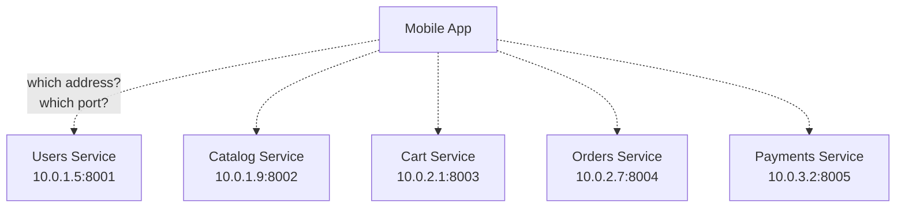
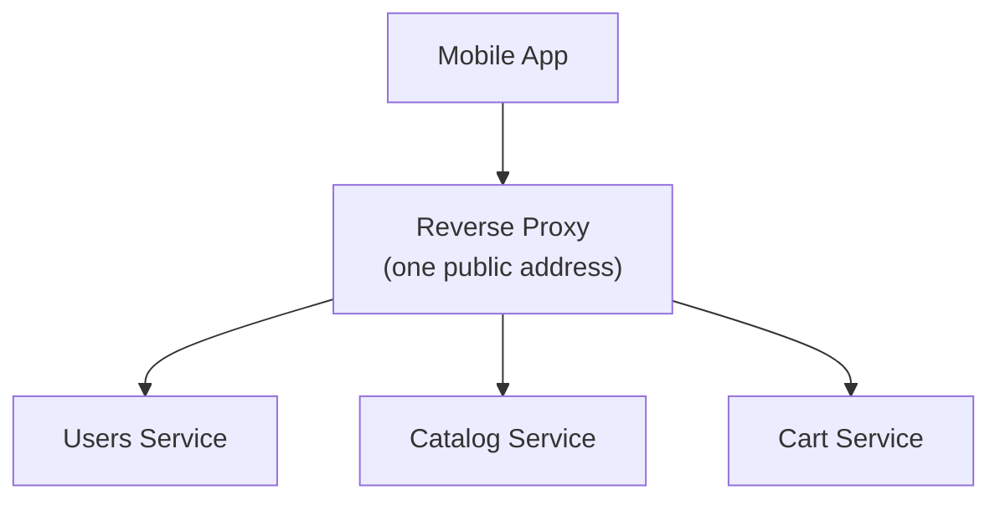
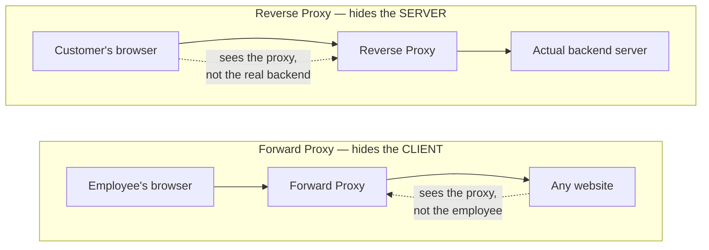
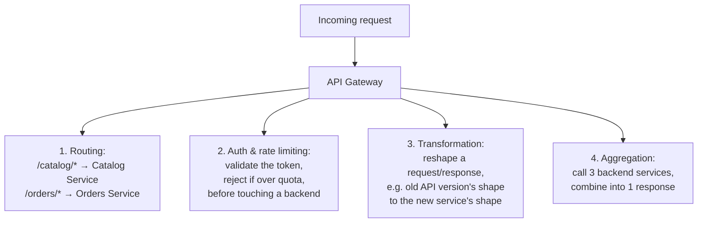
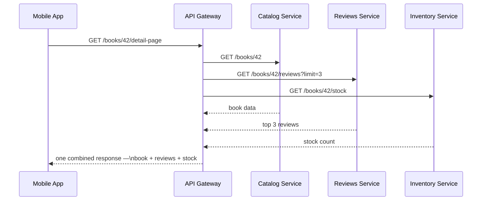
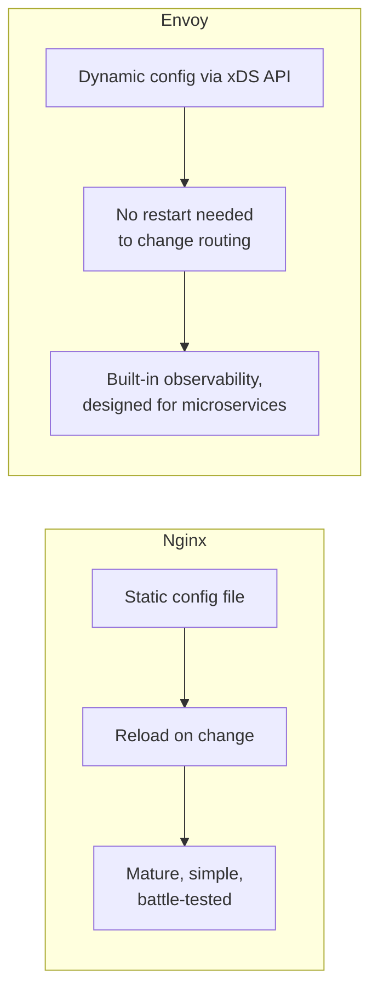
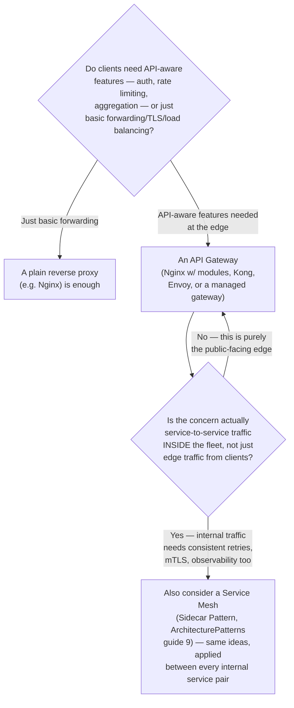
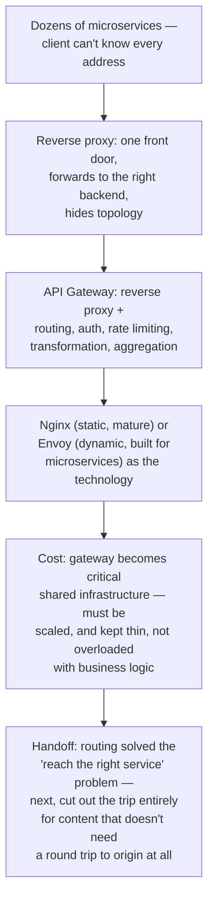

## The Story of API Gateway & Reverse Proxy

The last guide settled what shape a request takes — REST, GraphQL, gRPC, whichever fits. It quietly assumed the client already knows exactly which server to send that request to. In the real bookstore, following the ArchitecturePatterns series, that's no longer true: there's a Users service, a Catalog service, a Cart service, an Orders service, a Payments service, each with its own address, and that number only grows over time.

---

## Interview Cheat Sheet

**A reverse proxy** sits in front of one or more backend servers and forwards client requests to them, so the client only ever needs to know the proxy's address, never the backend's. **An API gateway is a reverse proxy with API-aware smarts layered on top** — routing by path to the correct service, authentication, rate limiting, and combining multiple backend calls into one client-facing response.

**Key facts:**
- **Forward proxy** and **reverse proxy** solve opposite problems: a forward proxy sits in front of *clients*, hiding their identity from servers (a corporate proxy); a reverse proxy sits in front of *servers*, hiding their topology from clients — this distinction is a very common interview trip-up
- An API gateway typically does at least four jobs at once: routing, authentication/rate limiting, request/response transformation, and aggregation (calling several backend services and combining the results)
- **Nginx** is a mature, configuration-file-driven reverse proxy and web server; **Envoy** is a newer proxy built for dynamic service discovery and rich observability — the same Envoy the ArchitecturePatterns Sidecar Pattern guide covered, just deployed centrally here instead of one-per-service
- The exact routing mechanism an API gateway uses — redirect one path to one service, leave the rest untouched — is the same mechanism the Strangler Fig Pattern guide used to migrate a monolith gradually

**Common interview gotchas:**
- "Reverse proxy" and "load balancer" overlap in practice (most reverse proxies can load-balance) but aren't the same concept — load balancing is one job a reverse proxy commonly does, not its definition
- An API gateway that accumulates too much business logic over time stops being a thin routing layer and starts becoming a second monolith — a real, common failure mode, not a hypothetical one
- A gateway that isn't scaled and made highly available becomes a single point of failure for every service behind it, even though each of those services might individually be perfectly resilient

**The core trade-off:** centralizing routing, auth, and cross-cutting concerns at the edge makes every backend service simpler and more consistent to build — at the cost of making the gateway itself a critical, shared piece of infrastructure that the entire system now depends on.

---

## Chapter 1: The Client Can't Know Every Service's Address

Following the ArchitecturePatterns series' first guide, the bookstore's monolith has become a fleet of independent microservices — Users, Catalog, Cart, Orders, Payments — each its own process, its own database, its own deployment schedule.

Expecting the mobile app — running on a customer's phone, updated on the customer's own schedule, not the bookstore's — to know each service's internal address, keep that list current as services move or scale, and handle TLS separately for each one, is unworkable. Internal addresses change constantly as services scale up and down; a mobile app baked with today's addresses would break the next time the infrastructure team reshuffles anything.

---

## Chapter 2: The Reverse Proxy — One Front Door

The fix starts with a **reverse proxy**: a single server that sits in front of the backend services, accepts every incoming request, and forwards it to whichever backend actually handles it — hiding the backend topology from the client entirely. The client only ever needs to know one address: the proxy's.

It's worth pinning down a distinction that trips people up in interviews, because the two concepts sound almost identical but solve opposite problems: a **forward proxy** sits in front of *clients* — a company's outbound web proxy, for instance, which every employee's browser is configured to send traffic through, hiding each individual employee's identity from the websites they visit, and centrally enforcing rules like content filtering. A **reverse proxy** sits in front of *servers* — hiding backend topology from clients, the opposite direction of the same basic idea.

A plain reverse proxy typically also handles **TLS termination** (decrypting HTTPS traffic once, at the edge, so internal services don't each need to manage their own certificates from the earlier TLS guide) and basic **load balancing** across multiple instances of the same backend service — genuinely useful on its own, but still fairly dumb about what the requests actually mean.

---

## Chapter 3: The API Gateway — A Reverse Proxy That Understands APIs

An **API gateway** is what you get when a reverse proxy is given API-specific intelligence on top of basic forwarding. Four jobs, typically, all at the edge, before a request ever reaches a real backend service:

Routing (job 1) is the mechanism you've already seen in this series without the name attached: it's exactly what the ArchitecturePatterns Strangler Fig Pattern guide's routing layer does — sending `/catalog/*` to a newly-migrated service while everything else still goes to the old monolith. An API gateway is that same routing idea, running permanently in production rather than as a temporary migration aid.

Aggregation (job 4) deserves its own look, because it's the piece that most directly saves the client from Chapter 1's problem and the previous guide's under-fetching problem at once: the gateway can call several backend services on the client's behalf and hand back one combined response.

This pattern — one gateway endpoint tailored to exactly what one specific client screen needs, aggregating several backend calls behind the scenes — is common enough to have its own name, **BFF (Backend For Frontend)**: a gateway layer (sometimes even one per client type — a different BFF for mobile than for web) shaped around what that particular front end actually needs to render, rather than forcing the client to know about and call every backend service individually.

---

## Chapter 4: Nginx vs. Envoy

Two names come up constantly once you're picking real infrastructure for this layer, and they represent two different eras of the same idea.

**Nginx**, first released in 2004, is a mature, extremely widely deployed reverse proxy and web server. Its configuration is typically a static file, reloaded when it changes — simple, predictable, battle-tested at enormous scale, and the default choice for straightforward reverse-proxying, load balancing, and TLS termination.

**Envoy**, built at Lyft and open-sourced in 2016 — the same Envoy the ArchitecturePatterns series' Sidecar Pattern guide covered in depth — was designed from the start for a world of constantly-changing microservices: instead of a static config file, it has a dynamic configuration API (**xDS**) that lets a control plane push routing and policy changes to it in real time, without a restart, plus rich built-in observability (metrics, tracing) baked in as a first-class feature rather than an add-on.

The two aren't strictly competitors so much as fits for different eras of a system's growth: Nginx as a single, centralized API gateway or reverse proxy in front of a fleet is a completely reasonable, common choice; Envoy shows up both as a centralized API gateway *and*, as covered in the Sidecar guide, deployed one-per-service as part of a service mesh — the same proxy technology, applied at two different layers of the same architecture.

---

## Chapter 5: The Cost — A Gateway Becomes Critical Infrastructure

### Cost 1 — It's a New Single Point of Failure

Every one of the bookstore's individually resilient microservices is now reachable only through one shared front door. If that gateway goes down or falls over under load, it doesn't matter that Catalog, Cart, and Orders are all individually healthy — nothing gets through. This means the gateway itself needs the same redundancy and scaling discipline the individual services get — running multiple instances behind its own load balancer, not treated as a single always-up box.

### Cost 2 — Gateway Sprawl

Aggregation and transformation (Chapter 3, jobs 3 and 4) are useful exactly until a team starts adding real business logic to the gateway because it's the easiest place to make a quick change — a pricing rule here, a validation check there. Do this enough times, and the "thin routing layer" quietly grows into a second monolith, one that every team now has to coordinate changes through, recreating the very coordination bottleneck the ArchitecturePatterns series' first guide described microservices as solving.

### Cost 3 — An Extra Hop, Every Time

Every request now passes through the gateway before reaching a real backend — one more network hop, one more piece of latency, on every single call. Usually small compared to the actual backend work, but it's not free, and it compounds if a gateway calls another gateway calls another proxy in a deep chain.

---

## Chapter 6: Reverse Proxy, API Gateway, or Service Mesh?

The API gateway handles the boundary between the outside world and the fleet; the service mesh (sidecars, from the earlier series) handles traffic *within* the fleet, service to service. Real production architectures commonly run both at once — an API gateway like Kong, AWS API Gateway, or Envoy at the edge, and a full service mesh internally — because they're solving problems at two different layers, not competing for the same job. Netflix's own **Zuul** gateway (which later gave rise to Spring Cloud Gateway in the broader ecosystem) is a well-known real example of exactly this edge-layer role, sitting in front of Netflix's enormous internal microservices fleet.

---

## The Full Story, End to End

| | Forward Proxy | Reverse Proxy | API Gateway |
|---|---|---|---|
| Sits in front of | Clients | Servers | Servers |
| Hides identity of | The client, from servers | The server, from clients | The server, from clients |
| Typical jobs | Content filtering, anonymizing clients | TLS termination, load balancing, forwarding | Routing, auth, rate limiting, transformation, aggregation |
| API-aware | No | Not necessarily | Yes, by definition |
| Example tech | Corporate web proxies | Nginx, HAProxy | Kong, AWS API Gateway, Envoy, Nginx w/ modules |

**Where would you like to go next?** Natural threads from here:

- **Content Delivery Networks (CDNs)** — for content that doesn't need a round trip to any backend at all, not even through the gateway
- **Firewalls, VPNs & Network Security** — securing everything behind this gateway from traffic that shouldn't reach it in the first place, closing out this series
