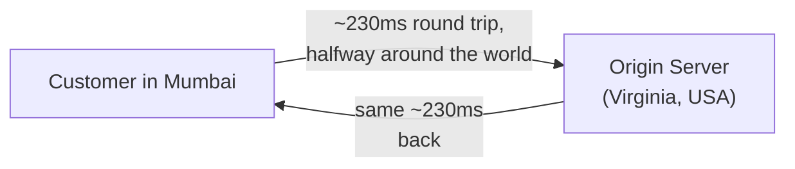
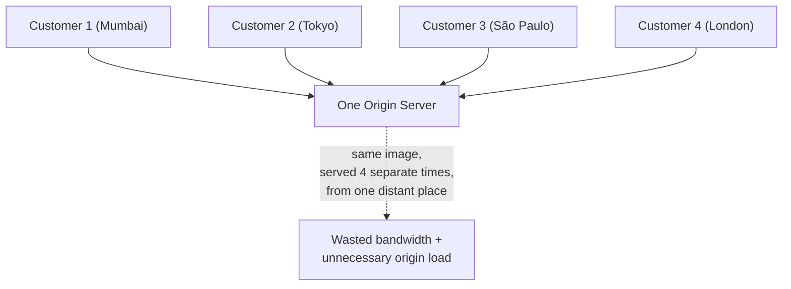
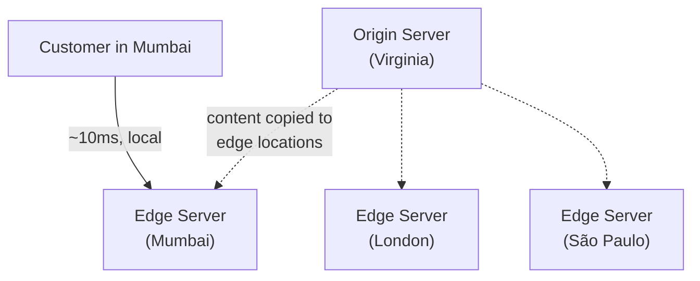
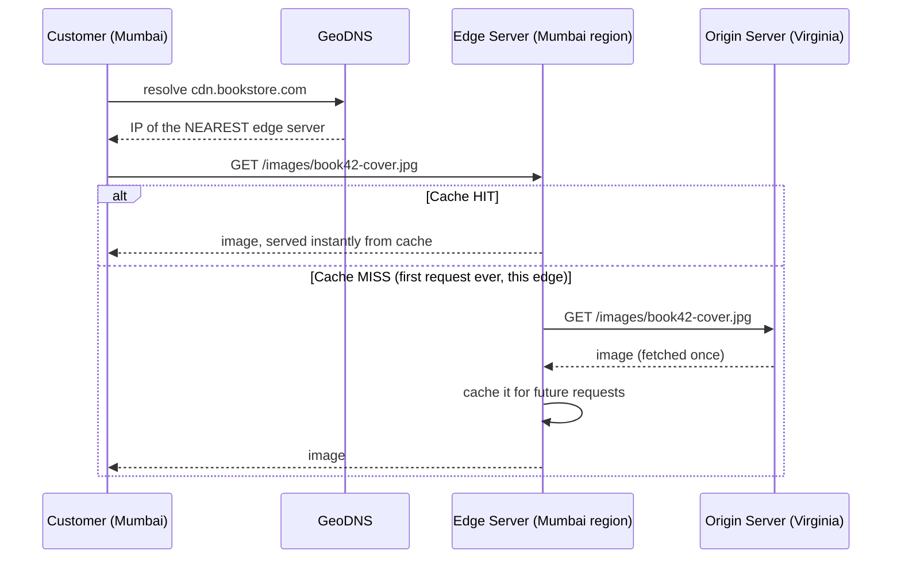
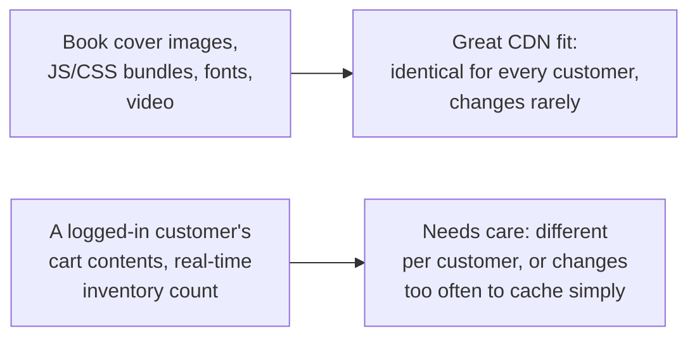
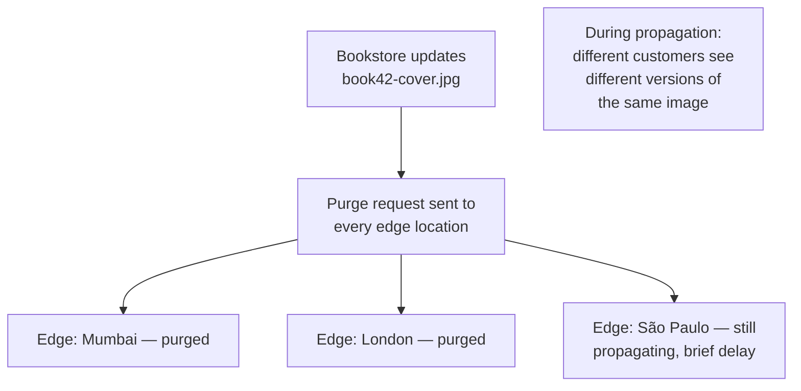
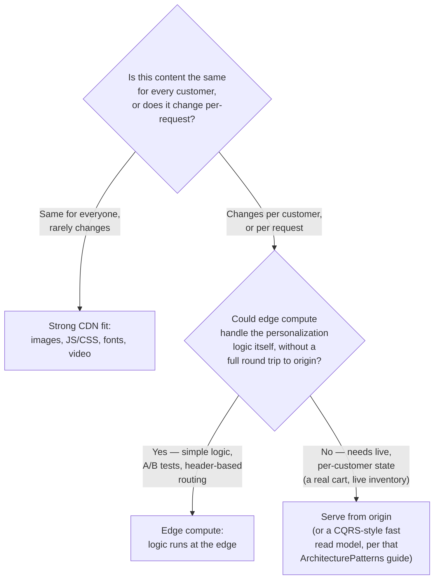
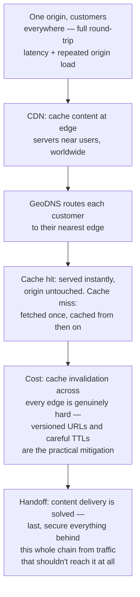

## The Story of Content Delivery Networks

The API gateway from the last guide solved "which service handles this request" — but it assumed the request has to reach the bookstore's own infrastructure at all. For a huge share of what a customer actually loads — the book cover images, the site's JavaScript and CSS, the fonts — that trip is one the bookstore doesn't need to make the customer take every single time.

---

## Interview Cheat Sheet

**A CDN (Content Delivery Network)** is a globally distributed network of servers that cache content close to users, so a request is served from a nearby **edge server** instead of traveling all the way to the **origin** server every time.

**Key facts:**
- Users are routed to their nearest edge server, typically using the GeoDNS/anycast routing covered in the DNS guide earlier in this series
- A request either **hits** the cache at the edge (served instantly, origin never touched) or **misses** (the edge fetches it from origin once, caches it, then serves every subsequent request from cache)
- Static content (images, JS, CSS, video, fonts) is the classic fit; **edge compute** (Cloudflare Workers, AWS Lambda@Edge) now lets some genuinely dynamic logic run at the edge too, blurring what "cacheable" even means
- **Cache invalidation** — telling every edge server worldwide "this cached copy is now wrong, stop serving it" — is famously one of the hardest problems in this space, not a solved detail

**Common interview gotchas:**
- A CDN doesn't make your origin server faster — it makes most requests never need to reach your origin server at all
- "Cache it forever" and "never cache it" are both real answers for different content — the actual skill is knowing which content is safe to cache and for how long, not defaulting to one extreme
- Purging (invalidating) a cached item at every edge location worldwide, instantly and consistently, is a genuinely hard distributed systems problem — treat "we'll just invalidate it" as non-trivial in any answer
- A sudden wave of simultaneous cache misses after an invalidation (a **cache stampede**) can hit the origin as hard as if the CDN wasn't there at all, for a brief window

**The core trade-off:** a CDN trades a small, real risk of serving slightly stale content for a dramatic reduction in latency and origin load — and the harder the content changes over time, the harder that trade becomes to manage safely.

---

## Chapter 1: One Origin, Customers Everywhere

The bookstore's origin server lives in one physical place — say, a data center in Virginia. A customer in Mumbai requesting a product photo has to send that request across the literal width of the planet, and back, before she sees anything.

That latency is physics, not a bug — light itself takes time to cross that distance, and real network paths are slower than light in a vacuum. No amount of origin server optimization changes the distance. And it's not just Mumbai: every customer, everywhere in the world, requesting that same product photo sends their own separate request all the way to the same one origin server, which now has to serve that identical image over and over, to everyone, every time.

Two separate problems live in this picture: unnecessary latency for every distant customer, and unnecessary repeated load on one origin server for content that never actually changes between requests.

---

## Chapter 2: Cache It Where the Customer Already Is

The fix follows directly from the problem: instead of every customer's request traveling all the way to one origin, **cache a copy of the content at servers physically distributed around the world, and serve each customer from whichever copy is nearest to them.**

This is a **CDN (Content Delivery Network)**: a globally distributed network of **edge servers**, each holding a cached copy of the origin's content, positioned physically close to real clusters of users. The Mumbai customer's request now travels tens of kilometers to a local edge server instead of thousands of kilometers to Virginia — the actual content never has to leave the neighborhood it's needed in, for every request after the first.

---

## Chapter 3: Getting Routed to the Right Edge, and What Happens on a Miss

Getting a customer's request to the *nearest* edge server, rather than a random one, leans directly on a mechanism this series already covered: the DNS guide's **GeoDNS** (also called anycast routing in some CDN implementations) — the same authoritative nameserver, asked the same question by two different customers in two different places, deliberately returns two different IP addresses, each pointing at whichever edge location actually serves that customer fastest.

A **cache hit** means the edge already has a valid copy and serves it directly — the origin never even hears about this request. A **cache miss** means this particular edge doesn't have it yet (or its copy expired), so the edge fetches it from origin exactly once, caches it, and every subsequent request to that same edge — from any customer in that region — becomes a hit. The origin ends up serving each piece of content once per edge location, not once per customer worldwide, which is the whole efficiency gain in one sentence.

---

## Chapter 4: What Actually Belongs on a CDN

The classic, uncontroversial fit is **static content**: images, videos, JavaScript bundles, CSS files, fonts — anything that's identical for every customer and doesn't change from one request to the next. Response headers like `Cache-Control` tell the edge (and the browser) exactly how long a given piece of content is safe to keep and reuse before checking back with origin.

The line has blurred in recent years with **edge compute** — platforms like Cloudflare Workers and AWS Lambda@Edge let you run actual code at the edge location itself, not just serve a static cached file. A/B test assignment, simple personalization, request validation, and even assembling parts of a page can now happen at the edge, milliseconds from the customer, without a round trip to origin for logic that used to require one. This doesn't erase the static/dynamic distinction so much as it moves the line — genuinely user-specific, frequently-changing data (an actual live cart, a live inventory count) still generally isn't something you'd cache at the edge the simple way.

---

## Chapter 5: The Cost — Cache Invalidation Is a Genuinely Hard Problem

There's an old programmer's joke that there are only two hard problems in computer science: cache invalidation, naming things, and off-by-one errors. It's a joke precisely because it's true, and CDNs are where most engineers meet the first one head-on.

**The core difficulty:** once content is cached at potentially hundreds of edge locations worldwide, "this content just changed" has to somehow reach every single one of those copies — or customers in different regions see genuinely different, inconsistent versions of the same page for a window of time. The bookstore updates a book's cover image; some customers see the new cover instantly, others keep seeing the old one until their local edge's cached copy expires or is explicitly purged.

**A second, sharper version of the same problem: cache stampede.** If a piece of extremely popular content expires or gets invalidated at the exact same moment across many edge locations at once — a flash sale's hero image, say — every one of those edges can simultaneously experience a cache miss and simultaneously hit the origin at once, producing a sudden traffic spike against origin that can look exactly like the very overload problem the CDN exists to prevent, just delayed and concentrated into one bad moment instead of spread out.

The practical mitigations worth knowing by name: **cache-busting via versioned URLs** (naming a file `book42-cover-v2.jpg` instead of overwriting `book42-cover.jpg` in place, so a "new" version is simply a new cache entry rather than something that needs invalidating at all — the standard technique for anything build-generated, like JS/CSS bundles); shorter TTLs for content expected to change; and staggering or rate-limiting origin fetches after a mass invalidation so the origin doesn't get hit by every edge's cache miss at the same instant.

---

## Chapter 6: Real Networks, Real Trade-offs

**Akamai**, founded out of MIT research in 1998, was the original large-scale commercial CDN, built on exactly this insight: cache content at the network edge, close to users, rather than serving everything from one place. **Cloudflare** runs one of the largest modern edge networks, combining CDN caching with the edge-compute capability from Chapter 4 and, notably, DNS services — the same GeoDNS routing from Chapter 3 and the earlier DNS guide, run by the same company operating the CDN. **Netflix** took a different, even more aggressive approach with **Open Connect**: rather than only using third-party edge locations, Netflix builds and physically ships its own caching appliances directly into ISPs' own networks — putting video content as close to the customer as physically possible, one network hop from an ISP's own infrastructure rather than a separate CDN provider's data center.

---

## Chapter 7: What Actually Goes Behind a CDN?

Pulling Chapters 4 through 6 together into one practical question: for any given piece of content, is it the same for everyone, and if not, can edge compute handle the difference without a full round trip to origin?

Most real catalogs split cleanly along this line: product images and static assets go behind the CDN without a second thought, genuinely live, per-customer data stays at origin, and the edge-compute middle ground (Chapter 4) picks up whatever simple, stateless logic can be pushed closer to the customer without needing a real backend round trip.

---

## The Full Story, End to End

| | No CDN | With CDN |
|---|---|---|
| Distant customer's latency | Full round trip to one origin | Round trip to a nearby edge only |
| Repeated identical requests | Every one hits origin | Only the first, per edge, hits origin |
| Origin load | Scales with total global traffic | Scales with cache-miss traffic only |
| Content update | Instant everywhere | Must propagate/purge across all edges |
| Best for | Rarely — even small sites benefit | Any content shared identically across many users |

**Where would you like to go next?** Natural threads from here:

- **DNS and How It Works** (earlier guide) — the GeoDNS/anycast routing mechanism that gets a customer to their nearest edge in the first place
- **Firewalls, VPNs & Network Security** — the last guide in this series, securing what's left of the path once content delivery and routing are both handled
