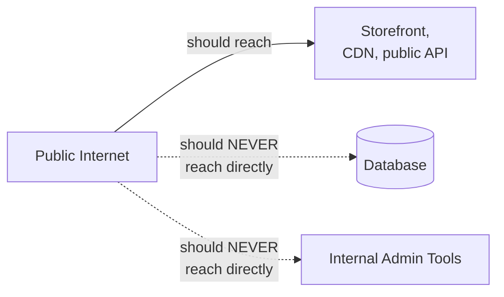
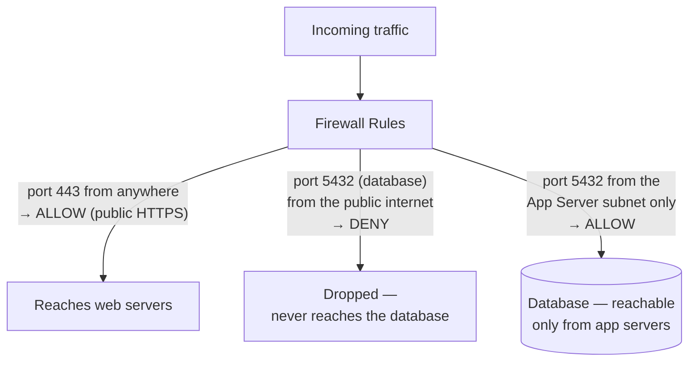
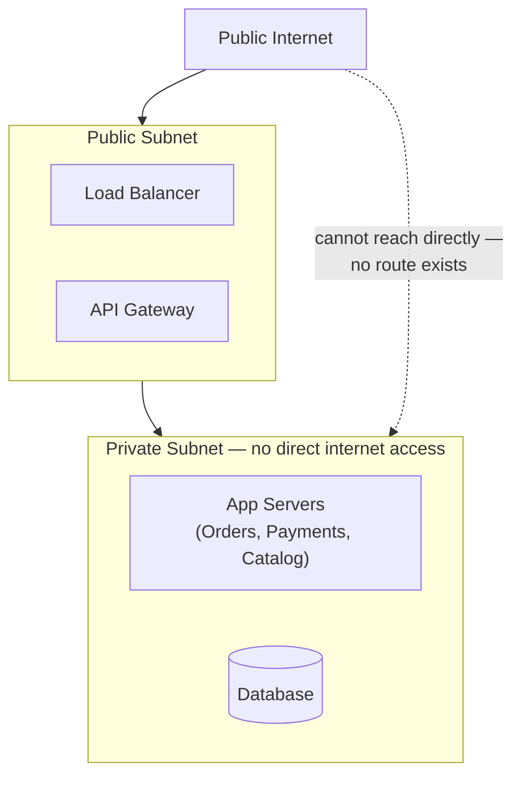
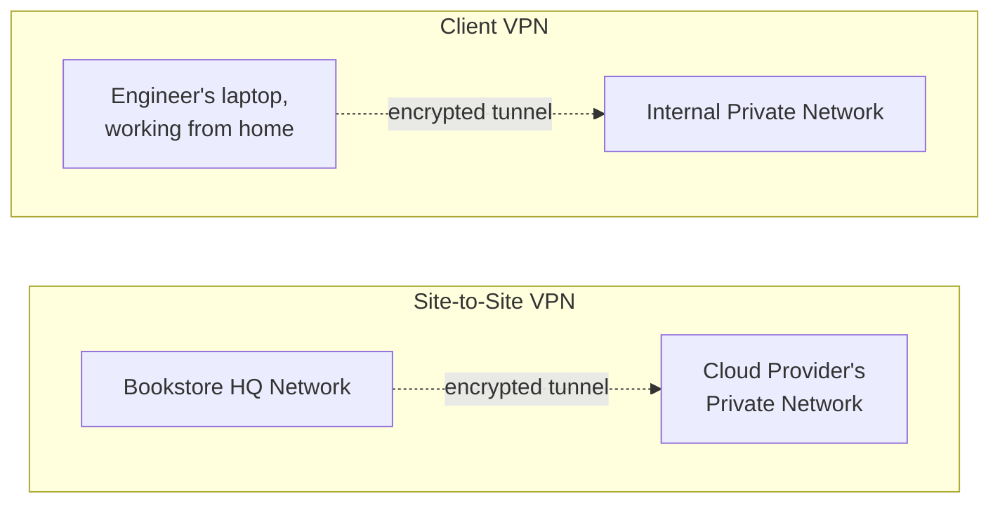
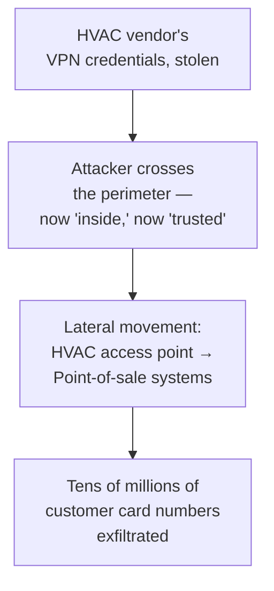
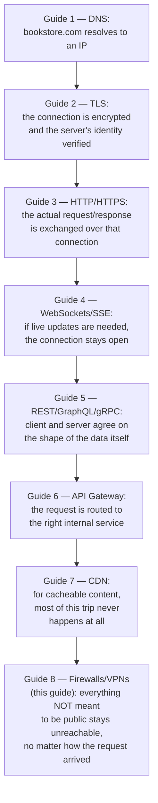
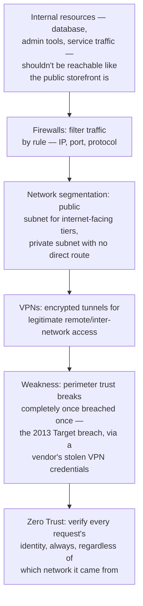

## The Story of Firewalls, VPNs, and Network Security

Every guide so far in this series has followed one customer's request outward, toward the bookstore's public-facing storefront — DNS found it, TLS secured it, HTTP spoke to it, the gateway routed it, the CDN sometimes skipped the trip entirely. This last guide turns around and looks at everything *behind* that storefront: the databases, the internal admin tools, the service-to-service traffic — none of which should be reachable from the public internet the same way the storefront is.

---

## Interview Cheat Sheet

**Firewalls** filter network traffic by rule (allow/deny based on IP, port, protocol); **VPNs** extend a private network over the public internet through an encrypted tunnel; together they've traditionally formed the network **perimeter** — a hard boundary between "trusted inside" and "untrusted outside."

**Key facts:**
- A **stateful** firewall tracks ongoing connections and automatically allows return traffic for a connection it already approved; a **stateless** firewall checks every packet against the rule list independently, with no memory of what came before
- **Network segmentation** — splitting infrastructure into a public subnet (internet-facing) and a private subnet (no direct internet access) — is how "the database should never have a public IP" actually gets enforced, not just recommended
- A **site-to-site VPN** connects two networks (say, two office locations, or a company network to a cloud provider); a **client VPN** connects one remote device to a private network
- **Zero Trust** is the modern answer to the perimeter model's biggest weakness: instead of trusting anything just because it's "inside," verify every single request's identity and authorization, regardless of which network it came from

**Common interview gotchas:**
- "We have a firewall" is not the same claim as "we're secure" — a firewall filters based on network-level rules (IP, port), and says nothing about whether a request that's allowed through is actually legitimate at the application level
- The perimeter model's core assumption — anything inside the network is trusted — fails completely the moment an attacker breaches the perimeter once, or an insider goes rogue, because there's nothing stopping lateral movement once inside
- A VPN is encryption for the *path*, not authorization for what happens after — a compromised VPN credential still gets full network access, the same as a legitimate one

**The core trade-off:** perimeter security (firewalls + VPN) is simple to reason about and cheap to operate, but a single breach anywhere on the perimeter gives an attacker broad access to everything "inside" — Zero Trust closes that gap by verifying constantly, at the cost of far more infrastructure and complexity to build and maintain.

---

## Chapter 1: Not Everything Should Answer the Public Internet

The bookstore's storefront — the Catalog service, the CDN-served images, the public API — needs to be reachable by any customer, anywhere. Its database, its internal admin dashboard, and the raw service-to-service traffic between Orders and Payments do not. If the database had a public IP address, anyone on the internet could attempt to connect directly to it, bypassing every application-level check the bookstore's own services perform.

The question this guide answers: how do you actually build and enforce that boundary, rather than just hoping nobody tries?

---

## Chapter 2: Firewalls — Filtering by Rule

A **firewall** sits on the network path and makes a simple decision on every piece of traffic: allow it through, or drop it, based on a set of rules — typically source/destination IP address, port number, and protocol.

A **stateless** firewall evaluates every single packet independently against the rule list — simple, fast, but it has to be explicitly told to allow both the outbound request and the inbound reply as separate rules. A **stateful** firewall tracks active connections, and once it's approved the outbound half of a connection, it automatically permits the matching inbound reply without a separate rule — the far more common model in practice, because writing correct rules for every possible reply direction by hand is tedious and error-prone.

In cloud infrastructure, this concept usually shows up under a different name: AWS **security groups** (rules attached directly to a server or group of servers) and **NACLs**, Network Access Control Lists (rules attached to an entire subnet) are both, functionally, firewalls — the same filtering idea, expressed as cloud-native configuration instead of a physical box.

---

## Chapter 3: Segmentation — Splitting the Network Itself

Firewall rules are only as good as the network layout they're applied to. **Network segmentation** takes this further: physically or logically dividing infrastructure into separate zones with different exposure, so an entire category of resource simply cannot be reached from the internet, rule-writing mistakes notwithstanding.

Resources in the **public subnet** — load balancers, the API gateway from the earlier guide — have a route to and from the internet by design; they're meant to be reached. Resources in the **private subnet** — application servers, the database — have no direct route to the internet at all; the only way to reach them is through the public subnet's controlled entry points. This is sometimes called a **DMZ** (demilitarized zone) when there's an intermediate, more tightly controlled public-facing tier sitting between the fully open internet and the fully private internal network. The database having no public IP isn't a firewall rule that could be misconfigured — it's a structural fact about the network it lives on.

---

## Chapter 4: VPNs — A Private Tunnel Over Public Infrastructure

Segmentation handles "servers talking to servers" within the bookstore's own infrastructure. But real engineers still need to reach those private resources sometimes — to deploy code, debug a production issue, or connect two data centers together. A **VPN (Virtual Private Network)** solves this by creating an encrypted tunnel over the public internet that makes a remote device or network behave, from a routing perspective, as if it's actually inside the private network.

A **site-to-site VPN** connects two entire networks — say, the bookstore's own office network and its cloud provider's private network — so servers on either side can reach each other as if they shared one physical network, without either side being exposed to the public internet directly. A **client VPN** connects one individual device — an engineer's laptop, working remotely — into the private network, so that engineer's traffic to internal tools is encrypted and treated as if they were plugged in on-site.

---

## Chapter 5: The Weakness Perimeter Security Never Fixed

Firewalls plus VPNs, together, describe the traditional **perimeter security** model: build a hard boundary around "the inside," carefully control every way in, and trust anything that makes it past that boundary. For a long time, this was considered good enough. It has one structural weakness that eventually became impossible to ignore: **once something gets past the perimeter — through a stolen credential, a misconfigured rule, a compromised third party — it's trusted just as much as anything that was always supposed to be there, with nothing further stopping it from moving around freely inside.**

This is not a hypothetical concern. In the well-documented **2013 Target breach**, attackers gained their initial foothold not through Target's own systems directly, but through stolen network credentials belonging to a third-party HVAC (heating/cooling) vendor who had remote VPN access to Target's network for billing and system-monitoring purposes. Once inside that "trusted" internal network, the attackers moved laterally — hopping from the HVAC vendor's limited access point to Target's point-of-sale systems — and ultimately exfiltrated tens of millions of customers' credit card details.

Nothing about the firewall rules or the VPN itself was misconfigured in the way most people picture a "hack" — the credentials were valid, the VPN connection was legitimate. The failure was structural: the perimeter model had no mechanism to ask "does this specific credential, on this specific request, actually need access to point-of-sale systems?" once it had already been let inside.

**Zero Trust** is the direct answer to this exact gap: instead of trusting a request because it originated from inside the network, verify the identity and authorization of *every* request, individually, regardless of which network it's coming from — treating "inside the perimeter" and "trustworthy" as two completely separate questions. **Google's BeyondCorp**, described in a series of public engineering papers starting in 2014, is the best-known real implementation of this idea: Google moved its own employees off a traditional VPN-based internal network model entirely, requiring every internal request — no matter where the employee physically was — to prove device and user identity before being granted access, rather than granting broad trust just for being "on the corporate network."

This guide won't go deep on Zero Trust's implementation — this repository's README lists **Zero Trust Architecture** under the Security & Compliance section, alongside OAuth2, JWTs, and access control models, which is where that depth belongs. What matters here is the shape of the problem: the perimeter model isn't wrong, exactly, it's incomplete, and knowing precisely where it stops protecting you is the real interview-relevant insight.

---

## Chapter 6: The Real Costs

**A VPN is a single choke point for remote access.** Every remote engineer's traffic funnels through the same VPN infrastructure — if it goes down, or gets overloaded, remote access to everything behind it goes down at once, the same single-point-of-failure risk the API Gateway guide raised about a shared front door.

**Firewall rules accumulate, and rarely get cleaned up.** A rule added three years ago for a service that no longer exists usually just... stays, because removing it feels riskier than leaving it, and nobody wants to be the one who breaks something by deleting a rule they don't fully understand the history of. Over years, this "rule sprawl" becomes its own liability — a wide, half-understood attack surface that nobody can fully account for.

**"We have a firewall" creates a false sense of completeness.** A firewall filtering by IP and port says nothing about whether a request that's allowed through — correct IP, correct port — is actually a legitimate, well-formed, authorized request at the application level. Defense in depth means firewalls and VPNs are one layer among several (also including the TLS and authentication layers from earlier guides in this series), never the entire security posture on their own.

---

## Chapter 7: Closing the Series — the Full Journey of One Request

This is the last guide in this Networking and Communication series, and it's worth looking back at the whole path one customer's request has taken, guide by guide, to see how each layer handed off to the next.

Every guide in this series solved a different, real, concrete problem a single request faces on its way from a customer's browser to the bookstore's infrastructure and back — and, just like the ArchitecturePatterns series before it, none of these is "correct" in isolation. DNS without TLS leaves the connection wide open. TLS without a gateway leaves every service directly exposed. A gateway without network segmentation behind it is a locked front door on a house with no back wall. The skill isn't memorizing eight names — it's recognizing which layer of a request's actual journey you're being asked about, and knowing what problem that specific layer was built to solve.

---

## The Full Story, End to End

| | Perimeter Security (Firewall + VPN) | Zero Trust |
|---|---|---|
| Trust model | Trust anything "inside" the perimeter | Trust nothing by default — verify every request |
| Failure mode | One breach grants broad internal access | A compromised credential is still checked per-request |
| Complexity to operate | Lower — a well-understood, mature model | Higher — every request needs identity/policy checks |
| Real example | Traditional corporate VPN + firewall | Google BeyondCorp |
| Best for | A starting baseline, still necessary | Layered on top, especially for high-value internal systems |

**This closes the Networking and Communication series.** Natural next threads from this repository's README:

- **Security & Compliance** — OAuth2/OIDC/JWT, access control models (RBAC/ABAC), and Zero Trust Architecture in the depth this guide deliberately left for that section
- **Cloud & DevOps** — how firewalls, VPNs, and network segmentation are actually provisioned and managed as Infrastructure as Code in a real cloud environment
