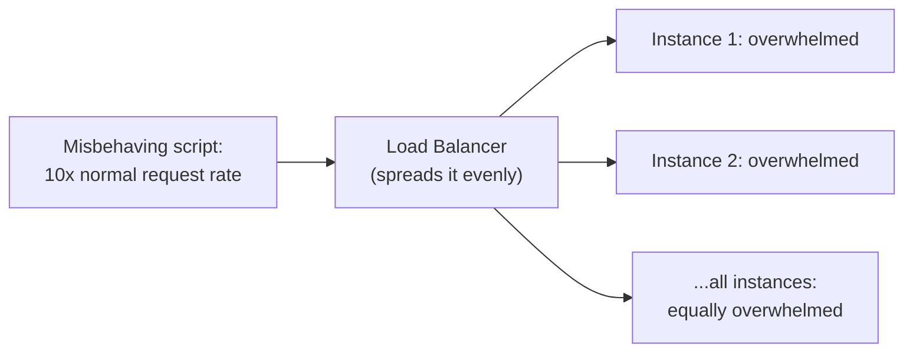
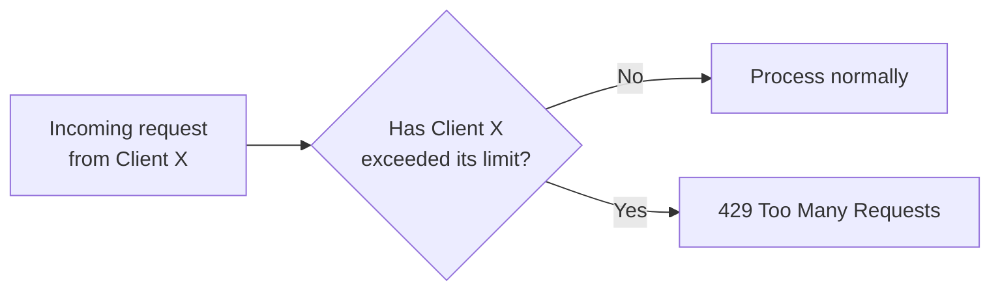
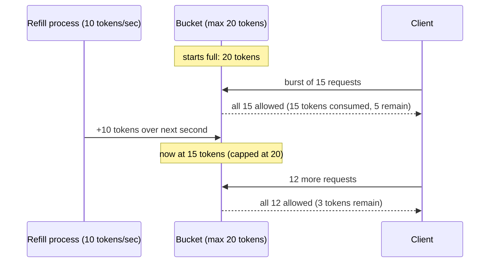
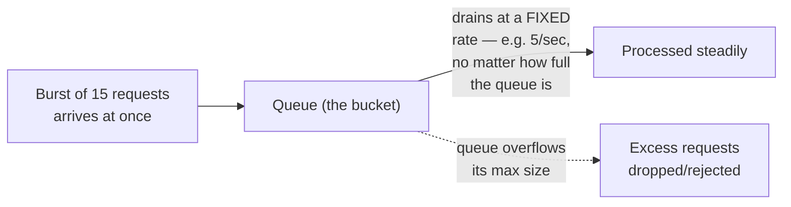
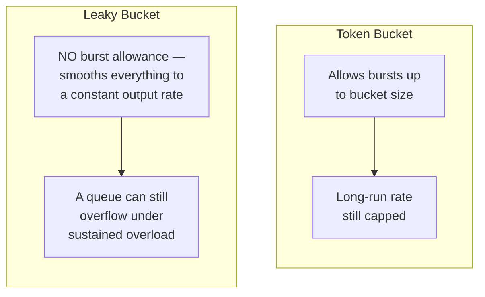
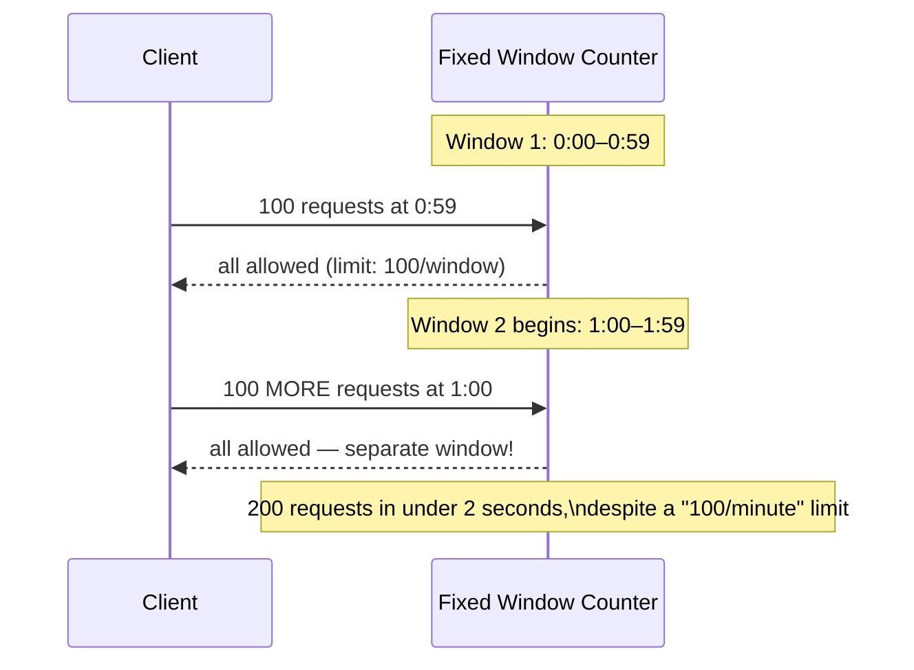
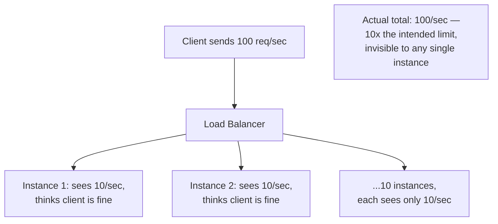
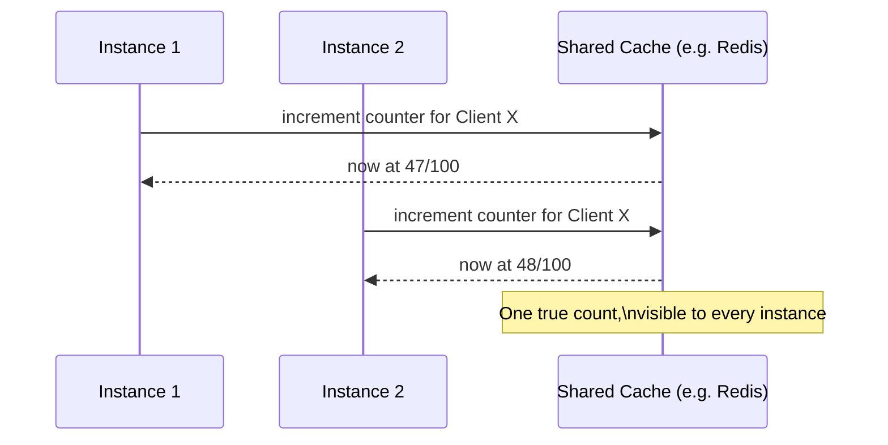
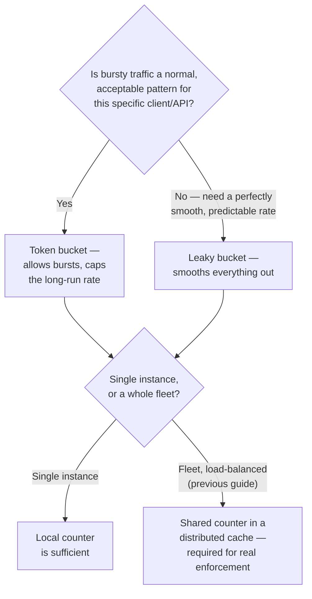
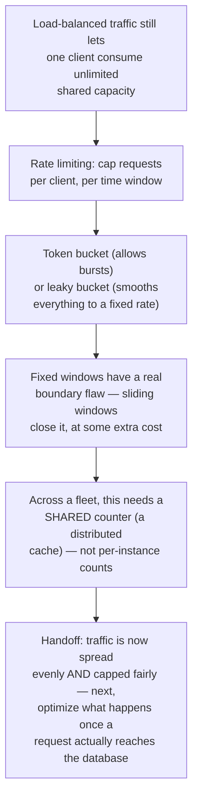

## The Story of API Rate Limiting and Throttling

The load balancer from the previous guide solved a distribution problem — spreading traffic evenly across a healthy fleet. It says nothing about the total *volume* of traffic arriving in the first place. A single misbehaving script, a runaway retry loop, or one overly enthusiastic integration partner can send the bookstore's Orders API more requests per second than the entire fleet was ever sized to handle — evenly distributed across ten overwhelmed instances is still overwhelmed.

---

## Interview Cheat Sheet

**Rate limiting** caps how many requests a given client is allowed to make in a given window of time, rejecting or delaying whatever crosses that cap — protecting shared capacity from being monopolized by any single source.

**Key facts:**
- **Token bucket**: tokens refill at a steady rate up to a maximum bucket size; each request consumes one token; requests are allowed as long as tokens remain — this naturally permits short bursts (up to the bucket's capacity) while enforcing a steady long-run rate
- **Leaky bucket**: requests queue up and are processed out at a strictly fixed rate, regardless of how bursty the arrivals were — smooths traffic into a constant output rate, with no burst allowance at all
- **Fixed window counters** are simple but have a real boundary flaw: a client can send a full window's worth of requests right at the end of one window and another full window's worth right at the start of the next, doubling the effective rate for a brief moment at the boundary
- Enforcing this **per client, across a fleet of instances**, requires a shared counter — usually kept in a fast, distributed cache (the previous series' Distributed Caching guide), because each instance keeping its own local count would let a client get several times its real limit just by hitting different instances

**Common interview gotchas:**
- Token bucket and leaky bucket are often confused because they sound similar — the deciding difference is burst tolerance: token bucket allows it (up to the bucket size), leaky bucket smooths it away entirely
- Rate limiting a client and backpressure (the ArchitecturePatterns series' Backpressure guide) solve related but distinct problems — rate limiting caps what one *client* is allowed to send you; backpressure is about a *consumer* signaling a *producer* to slow down when it's falling behind, regardless of which client is involved
- A distributed rate limiter has to solve the same "shared counter across many nodes" problem the Distributed Systems series covered — a naive per-instance counter isn't actually enforcing the limit you think it is
- What happens when the rate limiter itself is unreachable is a real design decision (fail-open vs. fail-closed), not an afterthought

**The core trade-off:** the more precisely and fairly you want to enforce a limit across a distributed fleet, the more coordination (a shared, consistent counter) it costs to check on every single request — versus a cheap, approximate, per-instance check that's fast but easy for a client to route around.

---

## Chapter 1: One Client, All the Capacity

Picture an integration partner's script, retrying aggressively after a transient error, hammering the bookstore's Orders API at ten times its intended rate. The load balancer from the previous guide dutifully spreads that flood evenly across all ten instances — which doesn't help at all, because now all ten are overwhelmed instead of just one.

Evenly distributed overload is still overload. The load balancer's job was never to decide *how much total traffic* is acceptable — that's a separate, deliberate control this guide adds.

---

## Chapter 2: Cap It, Explicitly

**Rate limiting** enforces a cap: a given client (identified by API key, IP address, user ID, or similar) may make at most N requests in a given time window. Requests beyond that cap are rejected (typically with an HTTP `429 Too Many Requests`) or delayed, rather than being allowed to consume capacity meant for everyone else.

The question this guide actually answers isn't "should you cap it" — it's *how* to define "exceeded its limit" precisely, because the naive ways to do it have real, well-known flaws.

---

## Chapter 3: Token Bucket — Allow Bursts, Cap the Long Run

**Token bucket** is the most common approach, and it's worth understanding mechanically. Picture a bucket that holds up to some maximum number of tokens. Tokens are added at a steady rate (say, 10 per second). Every request consumes one token; if the bucket is empty, the request is rejected.

The genuinely useful property here: a client that's been idle can burst — spend all its saved-up tokens at once — while a client sending a sustained, steady stream is capped at exactly the refill rate over time. This matches real traffic patterns well: a customer's browser loading a page fires off a burst of several API calls at once, then goes quiet — token bucket accommodates that burst naturally, as long as the bucket has capacity, without letting sustained abuse through.

---

## Chapter 4: Leaky Bucket — No Bursts, Ever

**Leaky bucket** takes the opposite stance: requests queue up on arrival, and are processed out of the queue at a strictly constant rate, no matter how bursty the arrivals were. Picture a literal bucket with a small, fixed-size hole in the bottom — water (requests) can pour in fast, but it only ever drains out at one constant rate.

The choice between them is really a choice about whether bursts are a normal, healthy pattern you want to accommodate (token bucket) or something you specifically want to eliminate in favor of a perfectly smooth, predictable output rate (leaky bucket) — useful when the thing behind the rate limiter genuinely can't handle any burst at all, even a brief one.

---

## Chapter 5: Fixed Window's Boundary Flaw

A simpler-sounding approach: count requests in fixed calendar windows (e.g., "100 requests per minute, resetting on the minute"). It's easy to implement — just a counter that resets on a schedule — but it has a specific, well-known flaw at window boundaries.

A client that times its bursts around the window reset can send double the intended rate in a very short real interval, entirely within the letter of the rule. **Sliding window** approaches (tracking a rolling interval instead of a fixed calendar one) close this gap, at the cost of a bit more bookkeeping per request — this is exactly the kind of edge case the exhaustive existing HLD guide on this topic (referenced at the end of this guide) walks through in full detail, including sliding window logs and sliding window counters as the fix.

---

## Chapter 6: Enforcing This Across an Entire Fleet

Here's the part that connects directly back to the Distributed Systems series: if each of the bookstore's ten Orders instances keeps its own local request count for a client, that client can get up to **ten times** its intended limit just by having its requests spread across all ten instances by the load balancer from the previous guide — each instance sees only a tenth of the traffic and thinks the client is well within its limit.

The fix is the same shape as the previous series' quorum and consensus guides: use a **shared, external counter** every instance checks against, rather than trusting each instance's own local view. In practice, this shared counter almost always lives in a fast, distributed cache — exactly the Distributed Caching guide's territory — because it needs to answer "how many requests has this client made recently" in single-digit milliseconds, on every single request, across every instance.

---

## Chapter 7: The Cost — What Happens When the Limiter Itself Fails

**Fail-open vs. fail-closed is a real, deliberate decision.** If the shared counter (the cache from Chapter 6) becomes unreachable, does the system let requests through unchecked (**fail-open** — availability first, risking real overload) or reject everything until it's reachable again (**fail-closed** — safety first, at the cost of legitimate traffic being blocked too)? Neither answer is universally correct; it depends entirely on whether unchecked traffic or a false rejection is the worse outcome for that specific API.

**The rate limiter adds a real check on every single request.** Even a fast cache lookup is one more network hop, one more piece of latency, paid by every request, all the time — this needs to be cheap enough not to become its own bottleneck, echoing the Circuit Breaker guide's concern about adding overhead to the common, healthy case.

**Clock skew matters for time-window-based algorithms.** Fixed and sliding window approaches depend on agreeing what time it currently is — the same clock-trust problem the Distributed Systems series' Vector Clocks guide raised, here showing up as a subtler, smaller-scale version of the same issue.

---

## Chapter 8: Where Do You Actually Enforce This?

The most common real deployment point is the API Gateway from the Networking series — enforcing rate limits at the edge, before a request even reaches a specific backend instance, means the limit is checked exactly once per request, in exactly one place, rather than needing every individual service to implement it separately.

---

## The Full Story, End to End

| | Token Bucket | Leaky Bucket | Fixed Window | Sliding Window |
|---|---|---|---|---|
| Allows bursts | Yes, up to bucket size | No | Effectively yes, at boundaries (a flaw) | No |
| Output rate | Variable, capped over time | Perfectly smooth | Variable | Smooth, more precise |
| Implementation cost | Low | Low | Very low | Moderate |
| Best for | Most APIs — accommodates natural burstiness | Protecting something that truly can't handle bursts | Simple internal limits, low stakes | Public APIs needing precise, fair enforcement |

For the exhaustive algorithm comparison, distributed rate-limiting architecture (v1 → v2 → v3), capacity math, and interview-drilling depth on this topic, see `HLD/0-course/19-Rate-Limiter-FAANG-Guide.md` in this repository.

**Where would you like to go next?** Natural threads from here:

- **Database Optimization** — once traffic is both spread evenly and capped fairly, the database is usually the next place real latency hides
- **Backpressure Handling in APIs** (ArchitecturePatterns series) — the related, but distinct, problem of a slow consumer signaling a fast producer to slow down
