## The Story of Database Optimization

Traffic is now spread evenly (Load Balancing) and capped fairly (Rate Limiting). A request that survives both still has to actually do its job — and for the bookstore, almost every job eventually means asking the database a question. This guide is about the levers that decide whether that question comes back in a millisecond or a full second: how quickly you can even reach the database, how the data is *organized* for reading, how much of the asking can be avoided entirely, and what happens when the load itself isn't spread evenly.

---

## Interview Cheat Sheet

**Database optimization**, for reads and writes, rests on a handful of complementary levers: **connection pooling** (avoid paying connection-setup cost on every request), **indexes** (organize data so the database doesn't have to scan everything), **caching** and **read replicas** (avoid or spread the querying itself), and deliberate handling of **pagination** and **hot keys** once scale exposes their specific failure modes.

**Key facts:**
- A **connection pool** keeps a set of already-open, already-authenticated database connections ready to borrow, rather than paying a fresh TCP-handshake-plus-auth cost on every single request
- An **index** is a separate, sorted structure pointing back to the real rows — it turns "scan every row" into "look up directly," at the cost of extra storage and extra write work to keep the index itself up to date
- **B-Trees** are the default index structure for decades; **LSM-Trees** trade some read simplicity for dramatically better write throughput, by buffering writes in memory and flushing them in sorted batches
- **Cursor-based (keyset) pagination** avoids offset pagination's growing cost as you page deeper, by remembering the last row seen instead of asking the database to skip and discard everything before it
- A **hot key** — one row or partition taking disproportionate load (a viral post's like counter) — breaks the assumption that caching and read replicas spread load evenly; **sharded counters** are the standard fix

**Common interview gotchas:**
- "Just add an index" is not a free win — every index is a second data structure that every write must also update (**write amplification**), and a table with too many indexes can have write latency dominated by index maintenance
- A **composite index**'s column order matters — an index on `(customer_id, order_date)` serves queries filtering by `customer_id` alone, but does *not* efficiently serve a query filtering by `order_date` alone
- A connection pool that's too small makes requests queue waiting for a connection; one that's too large can overwhelm the database server itself, which has its own hard connection limit regardless of how many application instances are asking
- Offset pagination (`LIMIT 20 OFFSET 10000`) gets slower the deeper you page, even with a perfect index, because the database still has to walk past and discard every row before the offset

**The core trade-off:** every optimization in this guide makes reads (or connections, or deep pages) faster by either doing more work ahead of time (an index, a warm connection pool, sharded counters) or by serving slightly stale or restructured data instead of asking the source of truth directly (a cache, a read replica) — there is no version of "fast" here that doesn't pay for it somewhere else.

---

## Chapter 1: The Query That Reads Every Row

A customer searches the bookstore's order history for `WHERE customer_id = 4471`. Without any help, the database has exactly one way to answer that: read every single row in the Orders table, check each one's `customer_id`, and keep the matches — a **full table scan**.

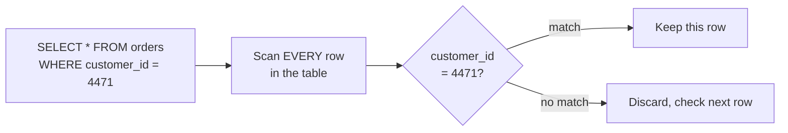

On a table with a few hundred rows, this is instant. On a table with 500 million orders, it means reading 500 million rows to find perhaps a few dozen — real disk I/O, real time, for almost entirely wasted work.

---

## Chapter 2: The Cost of Connecting, Before You Even Query

Here's a cost that shows up before any of this guide's other levers even get a chance to help: establishing a database connection at all isn't free. It means a TCP handshake, often a TLS negotiation (the Networking series' TLS guide), and an authentication round trip — real work, paid in full, before a single query runs.

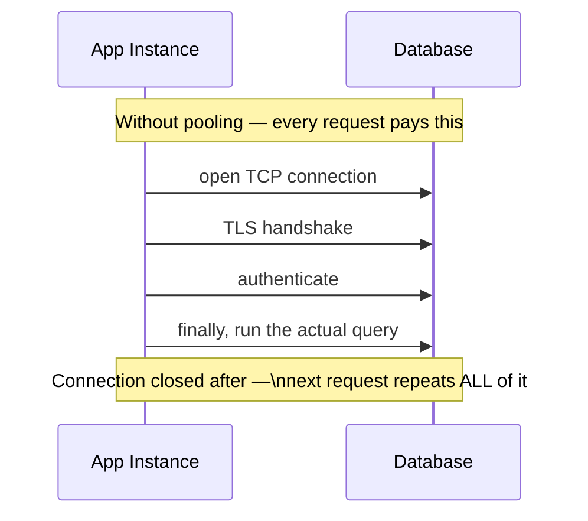

A **connection pool** fixes this the same way the Load Balancing guide's traffic cop fixed request routing: keep a set of connections already open, already authenticated, and hand one out on request instead of building a new one from scratch every time.

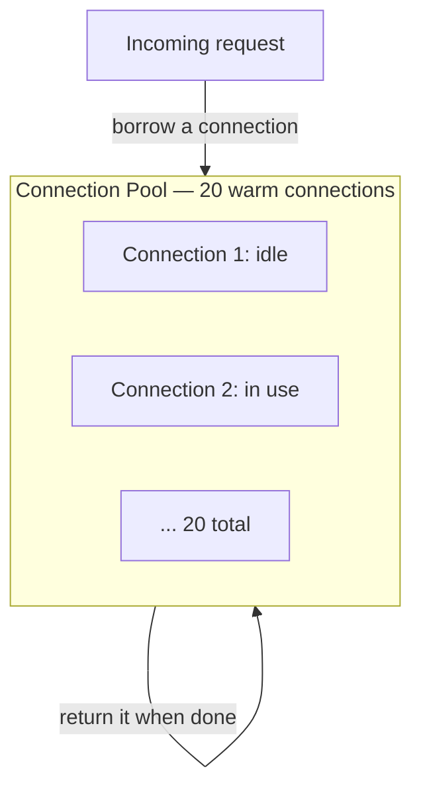

The sizing question cuts both ways, and it's a genuinely common real-world failure mode: a pool that's **too small** makes requests queue up waiting for a connection to free up — effectively the same backpressure the Rate Limiting guide described, just an accidental version instead of a deliberate one. A pool that's **too large** can overwhelm the database itself, because every open connection consumes real memory and resources on the database server, regardless of whether it's actively running a query — and the database has its own hard connection ceiling. This is precisely why the Load Balancing guide's autoscaling adds a subtlety worth remembering: if 10 application instances each open a pool of 100 connections, that's 1,000 connections arriving the moment the fleet scales up — a number the database itself may never have been sized to hold, even though every individual instance's pool size looks reasonable on its own. Tools like **PgBouncer** (for Postgres) and **HikariCP** (for the JVM) exist specifically to manage this pooling layer well, including options to pool connections centrally across many application instances rather than per-instance.

---

## Chapter 3: Indexes — Stop Scanning, Start Looking Up

An **index** is a separate structure, built and maintained alongside the table, that keeps a sorted (or otherwise organized) view of one or more columns, each entry pointing back to where the actual row lives.

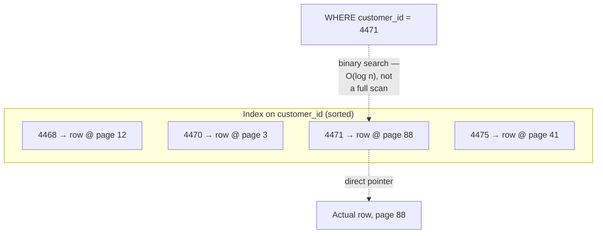

Because the index is sorted, finding `4471` is a binary search — a handful of comparisons, regardless of whether the table has a thousand rows or a billion — instead of reading every row in order. This is the entire value proposition of an index in one sentence: **trade a small amount of extra storage and write overhead for turning an O(n) scan into an O(log n) lookup.**

The most common index structure, and the default in almost every mainstream relational database, is the **B-Tree** — a balanced, sorted tree structure where every leaf is the same distance from the root, keeping lookups, insertions, and range scans all efficient and predictable, even as the table grows into the billions of rows.

Knowing an index exists is only half the skill — confirming the database actually *used* it for a given query is the other half. Every mainstream relational database exposes a query planner's actual execution plan (Postgres and MySQL's `EXPLAIN`, for instance), showing whether a query hit an index lookup or fell back to a full scan. This repository's `database/explain-analyze/README.md` covers reading and interpreting these plans in full depth — a skill worth having alongside knowing what an index is, since an index that silently isn't being used provides none of this chapter's benefit.

---

## Chapter 4: The Part Nobody Mentions First — Write Amplification

Here's the cost side of the previous chapter's trade, and it's easy to underestimate: **every index on a table has to be updated on every write to that table**, not just the ones that touch the indexed column's typical query pattern.

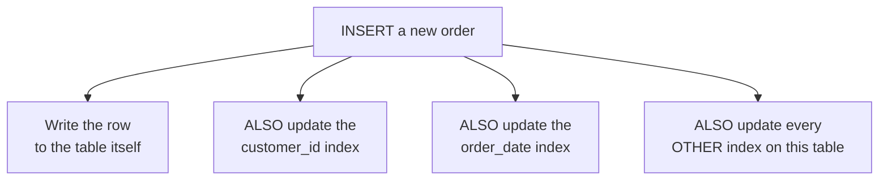

A table with five indexes doesn't pay the cost of one write per insert — it pays the cost of one table write plus five index updates, every single time. This is **write amplification**: the real, physical write work multiplies with every index you add, which is precisely why "just add an index for every query pattern" is not a free strategy — at some point, a heavily-indexed, write-heavy table spends more time maintaining its indexes than doing the actual work a write represents.

This exact tension — reads want more indexes, writes want fewer — is the deeper reason **LSM-Trees** (Log-Structured Merge Trees) exist as an alternative to B-Trees: instead of updating a sorted structure in place on every write, an LSM-Tree buffers writes in memory and flushes them to disk in large, sorted batches, trading some read complexity (a lookup may need to check several of these batches) for dramatically higher write throughput — the standard choice for write-heavy workloads (Cassandra, RocksDB, and many modern key-value stores use this design). The full mechanics of B-Trees versus LSM-Trees — memtables, SSTables, compaction, and the exact read/write/space trade-off triangle — are covered in complete depth in this repository's `HLD/0-course/9.5 Storage Engines - B-Tree vs LSM-Tree.md`; the takeaway worth carrying forward here is simply that the read/write optimization tension in this chapter is *the* reason two fundamentally different storage engine designs exist at all.

---

## Chapter 5: Making an Index Work Even Harder — Composite and Covering Indexes

A **composite index** covers more than one column at once, and its column order is not a cosmetic detail — it determines which query patterns the index can actually serve efficiently.

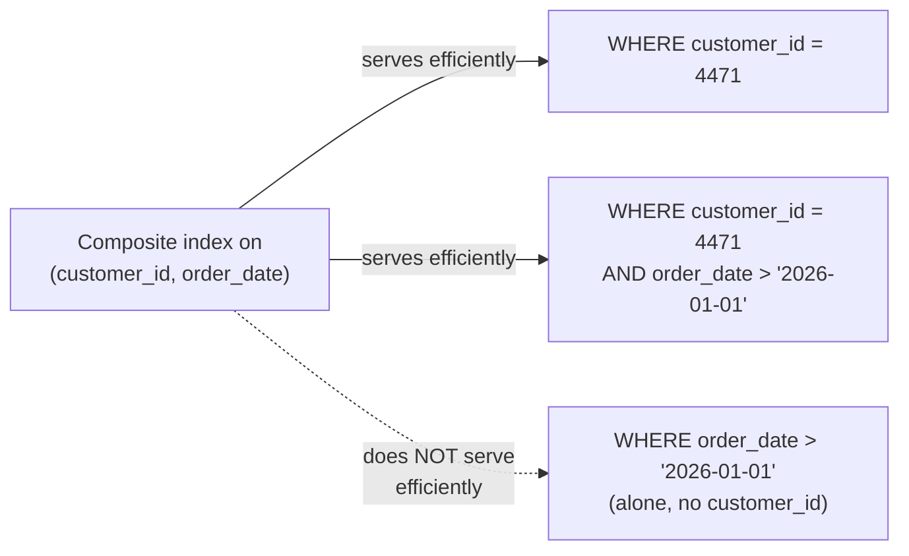

Because the index is sorted first by `customer_id` and only *then* by `order_date` within each customer, a query filtering by `order_date` alone has no way to use the sorted order efficiently — it's back to something close to a full scan. The rule of thumb: put the column most queries filter on (often the most selective one) first.

A **covering index** takes this further: if the index includes *every* column a query needs — not just the filter column, but the columns being selected too — the database can answer entirely from the index, never touching the actual table row at all.

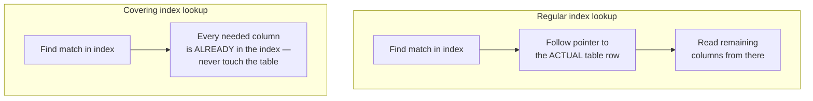

This is a meaningfully faster path — one structure read instead of two — and it's a common, deliberate optimization once a specific query pattern is known to matter enough to design an index around it precisely.

---

## Chapter 6: Querying Deep Into Large Result Sets — Pagination

A customer scrolling through page 500 of her order history sends `SELECT * FROM orders WHERE customer_id = 4471 ORDER BY order_date LIMIT 20 OFFSET 10000`. Even with a perfect index on `(customer_id, order_date)`, the database still has to walk through and discard the first 10,000 matching rows before it can return the 20 the customer actually wants — the deeper the page, the more rows get silently thrown away just to reach it.

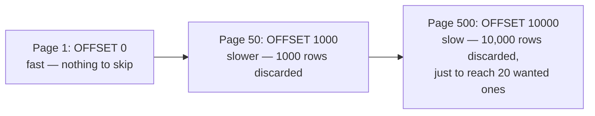

**Cursor-based (keyset) pagination** fixes this directly: instead of asking the database to skip N rows, remember the sort key of the last row seen on the previous page, and ask for "the next 20 rows where `order_date` comes after that value."

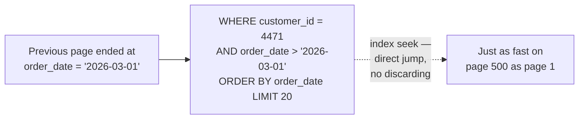

Because the index from the previous two chapters is already sorted by `order_date`, this becomes a direct seek to the right starting point — no rows discarded, regardless of how deep into the results you are. The real trade-off: cursor pagination only supports moving forward and backward from a known position — it can't jump straight to "page 500" the way offset pagination can, since there's no cursor value for a page nobody has visited yet. Most infinite-scroll feeds are perfectly happy with that limitation; an admin table that needs direct page-number jumping genuinely may still need offset pagination, accepting its deep-page cost as the price of that feature.

---

## Chapter 7: The Other Lever — Avoid the Database Entirely

Everything so far makes the database itself faster to reach and query. The Distributed Systems series' Distributed Caching guide covers an entirely different, complementary lever in full: don't ask the database at all for data you've already fetched recently. A cache-aside layer in front of the Catalog service, holding a trending book's detail page in memory, serves that page in microseconds — no connection pool, no index lookup, no query planner, because the database was never touched for that request at all.

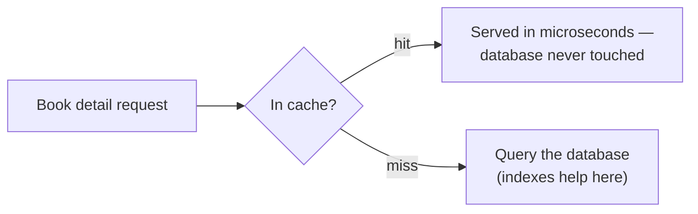

Indexing and caching aren't competing solutions to the same problem — they solve different shapes of it. Indexing makes a query that *does* have to hit the database faster. Caching avoids hitting the database at all for repeated, unchanged reads. A well-optimized system uses both, for exactly the reasons each guide already covered: caching for read-heavy, repeat-request data; indexing for the queries that do need to reach the actual source of truth.

---

## Chapter 8: A Third Lever — Read Replicas

The Distributed Systems series' Eventual Consistency & Quorum guide covers the third major lever, from a different angle again: instead of avoiding the database (caching) or making individual queries faster (indexing), **spread read traffic across multiple copies of the database** — a primary handles writes, and one or more read replicas, kept in sync via replication, handle the read load.

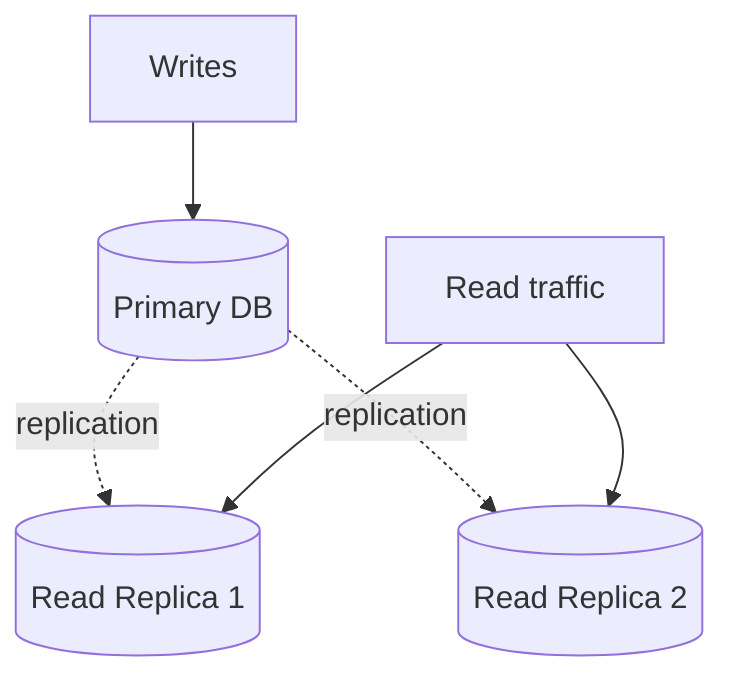

This is exactly the CQRS guide's territory from the ArchitecturePatterns series, applied at the database-replica level rather than a fully separate read model — and it inherits the exact same trade-off the Eventual Consistency guide covered: a replica can lag slightly behind the primary, so a read immediately following a write on a *different* replica can briefly see stale data, the same "read-your-own-write" concern that guide's CQRS discussion raised.

---

## Chapter 9: When Load Isn't Even — Hot Keys and Sharded Counters

Read replicas assume load spreads reasonably evenly across the whole keyspace — more replicas genuinely help when a million different customers are each reading their own different order. That assumption breaks the moment *all* the load concentrates on one specific row: a bestseller's review count, or a viral book club post's "like" counter, receiving thousands of increments per second, all against the exact same row.

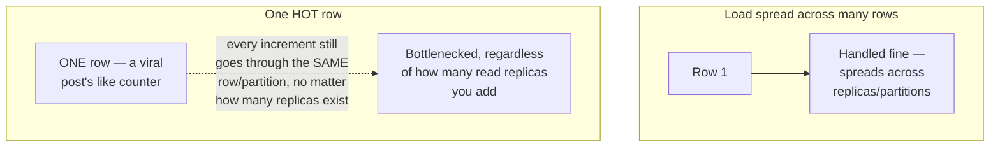

Read replicas don't help here at all, because they scale *read* load, not concentrated *write* load to a single row — and even for reads, a single row is still, physically, a single row. This is the exact same shape of problem the Distributed Caching guide's cache stampede described, one layer deeper into the database itself.

The standard fix: **sharded counters** — instead of one row holding the true count, split it into several shard rows (`counter_shard_0` through `counter_shard_9`, say), route each increment to one shard (randomly, or round robin), and sum across all shards whenever the total is actually needed.

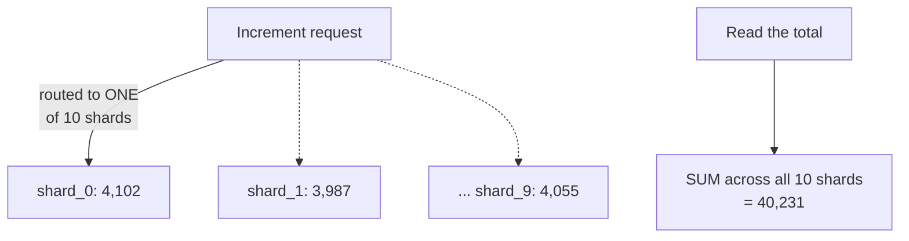

The real trade-off: reading the total now costs N reads and a sum instead of one direct read — a real cost, paid specifically to relieve the write-side bottleneck, and the shard count itself needs tuning to the actual write volume (too few shards and it's still hot; too many and the read-side summing cost grows for no additional benefit). This exact pattern is covered in full, dedicated depth in this repository's `HLD/0-course/24-Sharded-Counters-FAANG-Guide.md`.

---

## Chapter 10: The Cost — Several Levers, Several Different Bills

**Connection pooling costs careful sizing.** Too small, and requests queue; too large, and the database's own connection ceiling becomes the bottleneck — especially once the Load Balancing guide's autoscaling adds instances, each with its own pool, all multiplying against the same database.

**Indexing costs write throughput and storage**, growing with every index added, as write amplification covered — the fix is deliberate: index the columns real queries actually filter or sort by, not every column that might someday be useful.

**Cursor pagination costs the ability to jump to an arbitrary page.** It solves deep-page performance completely, at the cost of a real, occasionally-relevant product feature.

**Caching costs freshness**, exactly as the Distributed Caching guide's whole "the cache can lie" chapter covered — a cached value can silently drift from the database's real value until it's invalidated or expires.

**Read replicas cost consistency**, exactly as the Eventual Consistency guide covered — a replica's read can lag behind the primary's most recent write by a real, measurable amount.

**Sharded counters cost read-side simplicity**, trading one fast read for N reads and a sum, specifically to relieve a write bottleneck no other lever in this guide touches.

None of these costs disappears by choosing a different lever — each lever just relocates the cost to a different place: more write latency (indexing), staler reads (caching, replicas), more read-side work (sharded counters), or lost flexibility (cursor pagination).

---

## Chapter 11: Which Lever Do You Actually Reach For?

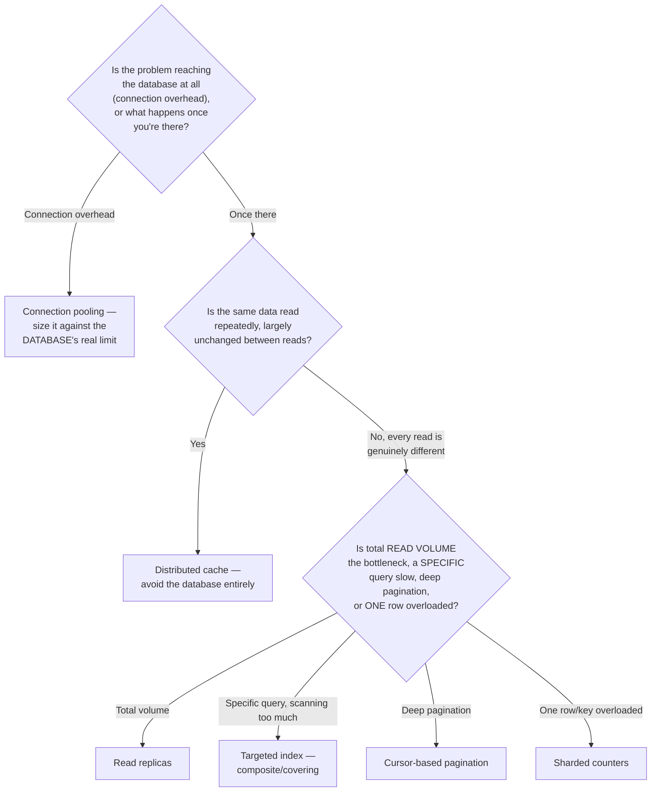

These levers compose rather than compete: a mature system pools its connections deliberately, indexes the queries that must reach the database, caches the reads that can tolerate slight staleness, spreads what's left across read replicas, paginates deep result sets by cursor, and shards any individual key that turns out to be disproportionately hot — each lever picking up exactly the shape of "this is slow" that the others don't address.

---

## The Full Story, End to End

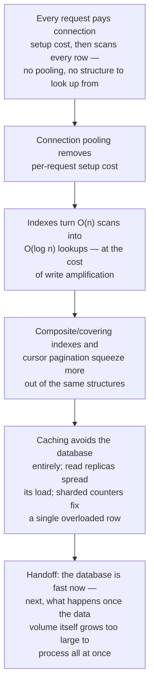

| | Connection Pooling | Indexing | Caching | Read Replicas | Sharded Counters |
|---|---|---|---|---|---|
| What it does | Avoids per-request connection setup | Makes a query faster | Avoids the database entirely | Spreads read load across copies | Relieves one overloaded row |
| Cost | Careful sizing against DB's limit | Slower writes (write amplification) | Staleness | Staleness (replication lag) | Extra read-side work (sum across shards) |
| Best for | Any DB-backed service at scale | Specific, known, slow query patterns | Repeated reads of largely unchanged data | High total read volume | One hot row/key under disproportionate load |
| Covered in full | PgBouncer / HikariCP docs | `HLD/0-course/9.5 Storage Engines - B-Tree vs LSM-Tree.md` | Distributed Systems series, Guide 1 | Distributed Systems series, Guide 2 | `HLD/0-course/24-Sharded-Counters-FAANG-Guide.md` |

For reading and interpreting real query execution plans, see this repository's `database/explain-analyze/README.md`.

**Where would you like to go next?** Natural threads from here:

- **Batch vs. Stream Processing** — once data volume grows past what a single optimized database can comfortably hold, how do you actually process all of it
- **Distributed Caching** (Distributed Systems series) — the full mechanics of cache-aside, consistent hashing, and Redis Cluster referenced in Chapter 7
