## The Story of Batch vs. Stream Processing

Every guide so far in this series has been about answering a single question fast — one query, one cache lookup, one request. This guide is about a different shape of problem entirely: the bookstore now has years of order history, every page view, every search, every click — and the business wants answers that require looking at *all* of it, or reacting to *each new piece* of it the instant it happens. Those are two different problems wearing the same name, "data processing," and confusing them is where this guide begins.

---

## Interview Cheat Sheet

**Batch processing** collects data over a period and processes all of it at once, on a schedule. **Stream processing** processes each event continuously, as it arrives, with results available within seconds instead of hours.

**Key facts:**
- The real trade-off is **latency versus completeness**: batch can see the entire, final dataset before computing anything (accurate, but slow — hours); streaming must produce an answer using only the data that's arrived *so far* (fast — seconds — but provisional, and possibly revised)
- A batch job's output is often stored as a **materialized view** — a precomputed, physically-stored result set, refreshed on the same schedule as the job — rather than recomputing the same expensive aggregation on every single read
- **Windowing** is how streaming systems group an inherently endless flow of events into finite chunks to compute over — tumbling (fixed, non-overlapping), sliding (fixed size, overlapping), and session (gap-based, variable length) are the three common shapes
- A **watermark** is a stream processor's explicit, engineered guess at "I am not expecting any more late data older than this point" — the mechanism that lets a window ever actually close, despite events arriving out of order
- **Lambda architecture** runs a batch pipeline and a streaming pipeline in parallel (streaming for fast, approximate answers; batch for slow, guaranteed-correct ones that eventually override them); **Kappa architecture** simplifies this to streaming only, reprocessing history by replaying the event log itself when needed

**Common interview gotchas:**
- "Real-time" and "streaming" are not automatically the same thing — a stream processor still has real latency (seconds, not milliseconds), and a badly-tuned batch job running every minute can feel "real-time enough" for some use cases
- A **materialized view** is not the same as a plain SQL `VIEW` — a plain view is just a saved query, recomputed fresh every time it's read; a materialized view is precomputed and physically stored, fast to read but only as fresh as its last refresh
- A watermark is a heuristic, not a guarantee — it's possible for data to arrive even later than the watermark predicted, and a real system has to decide explicitly what happens to that late data (drop it, or update a result that was already emitted)
- Kappa architecture didn't make Lambda's dual-pipeline complexity disappear — it traded "maintain two pipelines" for "make your streaming pipeline capable of the accuracy batch used to guarantee," which is its own real engineering effort
- Exactly-once processing in a stream is the same idempotency problem the Distributed Systems series closed on, applied specifically to checkpointing a stream processor's own progress

**The core trade-off:** the faster you want an answer, the less total data you're allowed to have seen before producing it — and every technique in this guide is really a different way of managing that one unavoidable tension.

---

## Chapter 1: Two Genuinely Different Questions

"How many books did we sell last quarter, broken down by category and region?" and "Should this specific customer see a low-stock warning right now?" sound like the same kind of task — query some data, get an answer — but they demand almost opposite processing shapes.

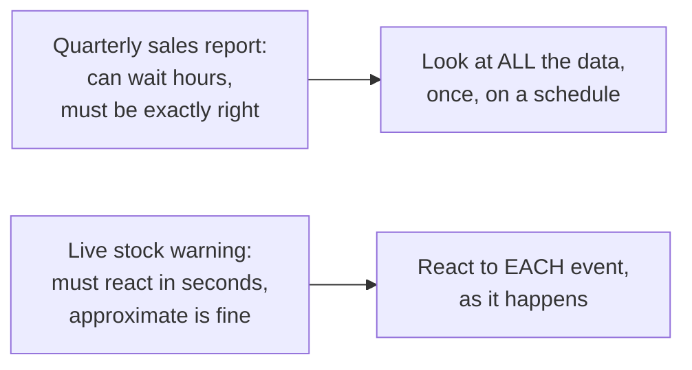

The quarterly report needs completeness far more than speed — a report that's an hour late but correct is fine; a report that's fast but wrong is useless. The stock warning needs the opposite — a warning that's instant but occasionally slightly off is useful; one that's perfectly accurate but arrives after the customer already checked out is not. Neither approach is "better" — they're solving genuinely different problems.

---

## Chapter 2: Batch Processing — See Everything, Then Compute

**Batch processing** collects data over a period (an hour, a day) and processes the entire accumulated set at once, typically on a fixed schedule — a nightly job that reads the full day's orders and produces the sales report.

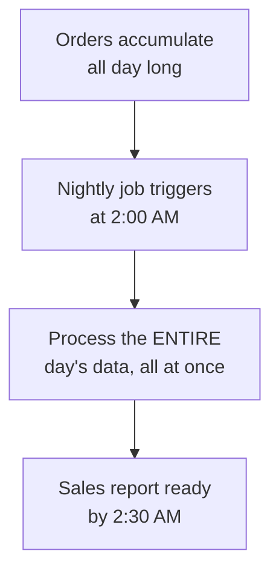

Because the job runs after the day is fully over, it genuinely has *all* the data — there's no "what if more arrives later" uncertainty to manage, which is exactly why batch results are the accuracy baseline the rest of this guide keeps coming back to. The classic mental model here is **MapReduce**: split the data into chunks, apply a computation independently to each chunk in parallel ("map"), then combine the partial results into a final answer ("reduce") — the model Hadoop popularized, and one that modern batch engines like Apache Spark still build on conceptually, even with much richer optimizations layered on top.

The cost is baked into the definition: results are only as fresh as the last time the batch job ran. A customer's order placed five minutes after the nightly job started won't show up in today's report at all — it'll wait for tomorrow's run.

---

## Chapter 3: What a Batch Job Actually Produces — Materialized Views

The nightly job computes "sales by category and region" once — but what happens when fifty different dashboards, viewed throughout the next day, all ask for that same report? Recomputing the full aggregation from raw order data on every single page view would be exactly the wasted, repeated work the Database Optimization guide's opening chapter described.

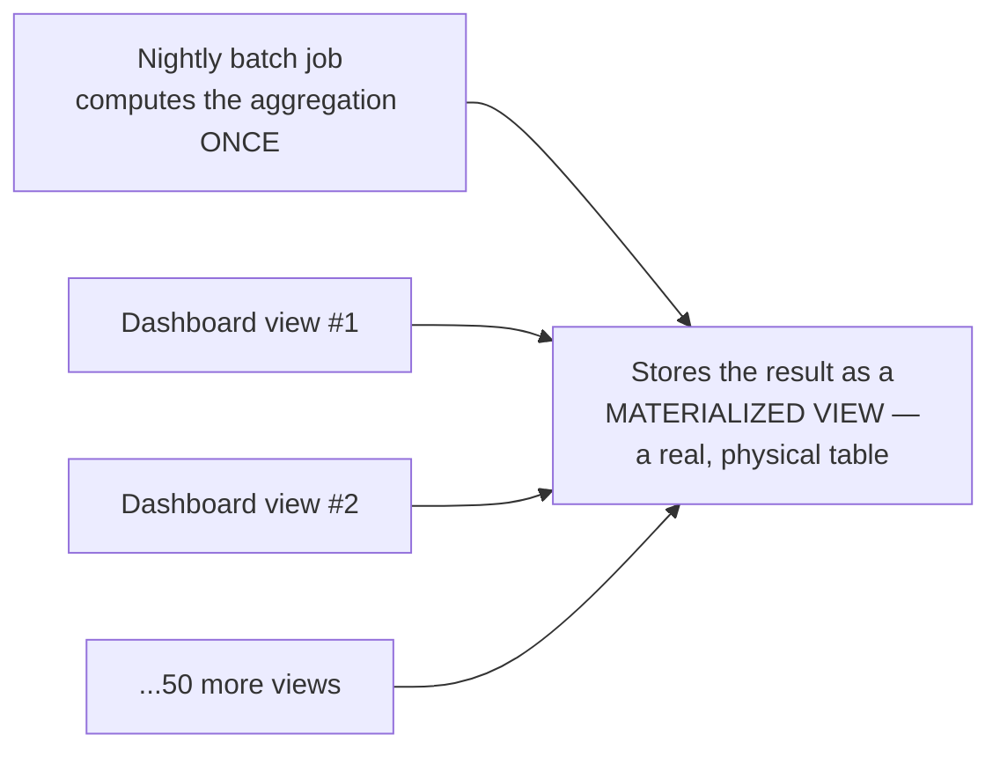

A **materialized view** is precisely this: the precomputed result of an expensive query or aggregation, physically stored so that reading it is a fast, direct lookup rather than a recomputation. It's worth distinguishing from a plain SQL `VIEW`, which is really just a saved query definition — reading a plain view still recomputes the underlying query fresh every time, giving no performance benefit at all; a materialized view is refreshed on a schedule (often the same schedule as the batch job that populates it) and read many times in between, exactly the read-many-times-relative-to-write-once shape the Data Compression guide's Chapter 4 used to decide when paying more upfront cost is worth it.

This connects directly to two ideas already covered elsewhere in this body of work: it's the same underlying goal as the Database Optimization guide's caching lever — avoid recomputing something repeatedly requested — just implemented as a real, queryable table instead of an in-memory cache entry; and it's a simple, single-database-native version of the ArchitecturePatterns series' CQRS pattern, where a separate, denormalized read model is kept in sync with a source of truth specifically to make reads fast.

The cost is the same staleness trade-off that's shown up throughout this series: a materialized view is only as fresh as its last refresh, and if the underlying data changes faster than the refresh schedule, readers see a genuinely outdated aggregation until the next batch run catches up.

---

## Chapter 4: Stream Processing — React to Each Event, Continuously

**Stream processing** flips the assumption entirely: instead of waiting for a full day's data to accumulate, process each event the moment it arrives, continuously, with results available within seconds.

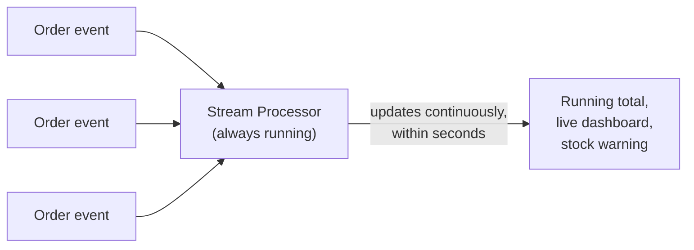

This is the exact mechanism underneath the ArchitecturePatterns series' Event-Driven Architecture guide — a message broker (Kafka, in the most common real deployment) delivers a continuous stream of events, and a stream processor (Kafka Streams, Apache Flink, Spark Streaming) consumes them continuously rather than waiting for a batch to accumulate. The cost mirrors the benefit: because the processor is computing on data as it arrives, it can never be *certain* it's seen everything relevant to a given moment — an event can always still be in transit, or arrive late.

---

## Chapter 5: Windowing — Carving an Endless Stream Into Chunks

A stream, by definition, never ends — but most useful computations ("orders per minute," "average order value in the last 5 minutes") need a finite chunk to compute over. **Windowing** is how a stream processor defines that chunk.

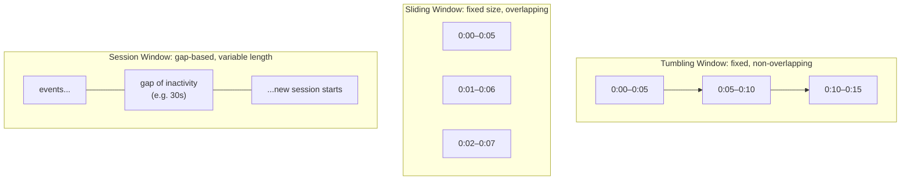

**Tumbling windows** are the simplest — fixed-size, back-to-back, no overlap ("orders per 5-minute block"). **Sliding windows** recompute over a fixed-size range that moves continuously, giving a smoother, more frequently-updated view ("the last 5 minutes, recalculated every minute"), at the cost of more computation since each event now contributes to several overlapping windows. **Session windows** are shaped by the data itself rather than the clock — a window stays open as long as events keep arriving, and closes only after a defined gap of inactivity, useful for grouping "everything one customer did in one browsing session" without a fixed duration.

---

## Chapter 6: Watermarks — Deciding When a Window Can Actually Close

Here's the genuinely subtle problem windowing creates: events don't always arrive in the order they actually happened. A mobile customer's request, delayed by a spotty connection, might arrive at the stream processor several seconds — or minutes — after it was generated, and *after* other, later events have already arrived. If a 5-minute tumbling window simply closes the instant 5 minutes of processing time has passed, that late event gets excluded from the window it actually belongs to.

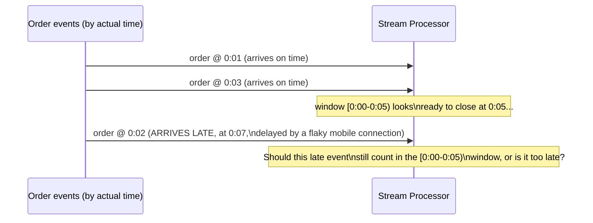

A **watermark** is the stream processor's explicit, engineered answer to exactly this question: a moving marker, based on observed event timestamps, that says *"I don't expect to see any more events with a timestamp earlier than this."* Once the watermark passes a window's end time, the processor considers that window closed and emits its result — accepting that any event arriving even later than the watermark predicted will be handled as explicitly late data (dropped, or used to issue a correction to a result already emitted), rather than silently waited for forever.

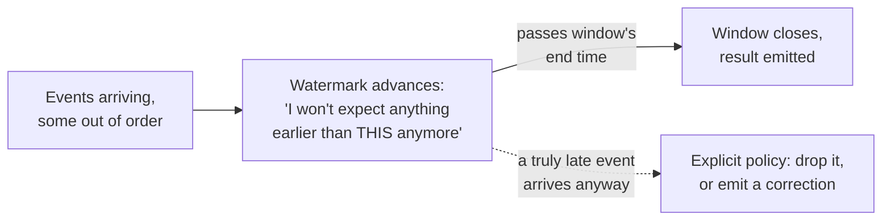

This is the single most important mechanical idea in real stream processing, and it's rarely explained well: a watermark is a **heuristic**, not a guarantee — set it too aggressively (assume data arrives quickly) and you close windows before genuinely late data shows up, silently undercounting; set it too conservatively (wait a long time for stragglers) and every window's result is delayed by however long you're willing to wait, eroding the entire reason you chose streaming in the first place. Tuning this trade-off deliberately, for the specific lateness pattern your actual event sources produce, is real, ongoing engineering work — not a one-time setting.

---

## Chapter 7: Lambda Architecture — Run Both, Let Batch Win Eventually

Faced with "streaming is fast but might be wrong; batch is slow but guaranteed right," an early, influential answer (popularized by Nathan Marz) was simply: **run both, in parallel, and reconcile.**

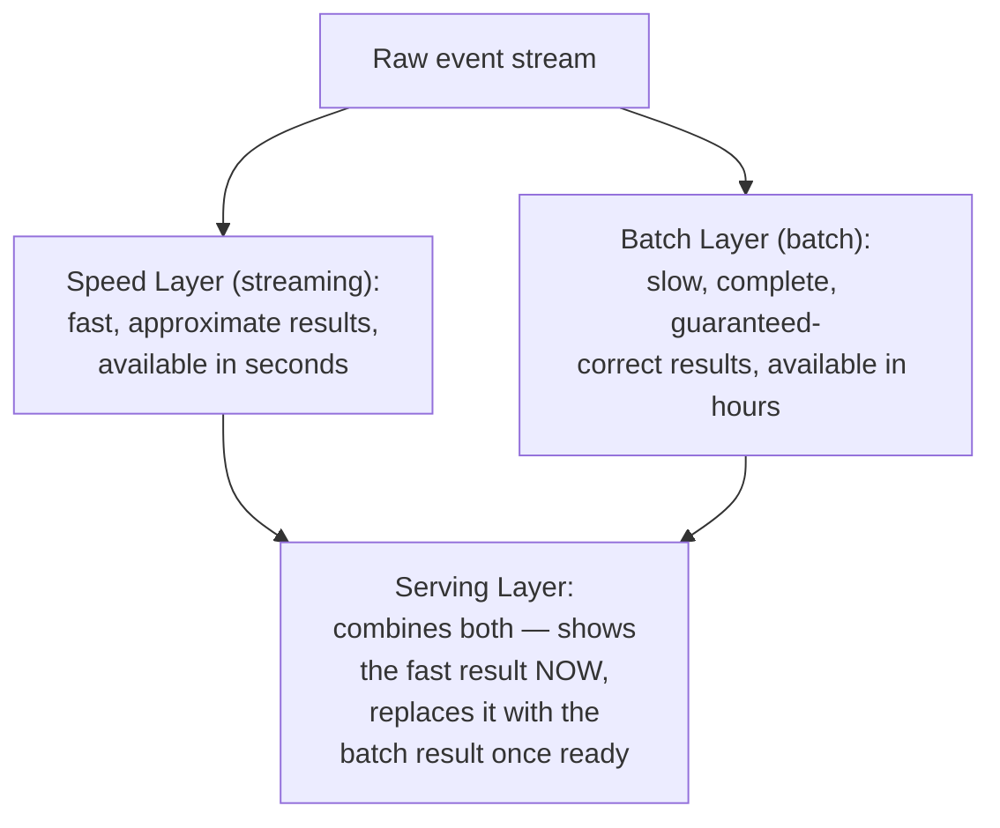

The customer sees the streaming layer's fast-but-provisional number the moment it's available, and that number is quietly corrected once the batch layer's slower, complete recomputation finishes and overrides it. This genuinely works — but it means building, deploying, and keeping in sync **two separate pipelines**, often in two different processing frameworks, computing the same logic twice, which is a real and lasting operational cost, not a one-time setup tax.

---

## Chapter 8: Kappa Architecture — Just Use the Stream for Everything

**Kappa architecture** is the simplification that followed: what if the streaming pipeline were made accurate and complete enough that the separate batch pipeline wasn't needed at all? The key enabling idea: treat the event log itself (the message broker from the ArchitecturePatterns series' Event-Driven Architecture guide) as the durable, replayable source of truth. If you ever need to recompute history — fix a bug, change a calculation — **replay the log from the beginning** through the same streaming logic, rather than maintaining a whole second batch codepath to do it.

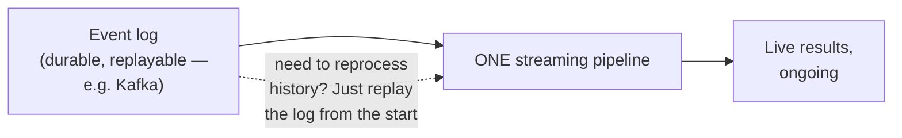

This is a real simplification — one pipeline, one codebase, one place logic can drift out of sync — but it isn't free: it requires the streaming logic itself to be capable of the correctness Lambda relied on batch to eventually guarantee, and it requires the event log to actually retain enough history to be replayed when needed, which has its own real storage cost.

---

## Chapter 9: Exactly-Once Processing, Applied to Streams

A stream processor tracking a running total has to periodically checkpoint its own progress — "I've processed up through event #48,201" — so that if it crashes and restarts, it knows where to resume. This is precisely the Distributed Systems series' closing guide's problem, applied to a new layer: if the processor crashes *after* updating its running total but *before* recording the new checkpoint, restarting will reprocess events it already counted, double-counting them.

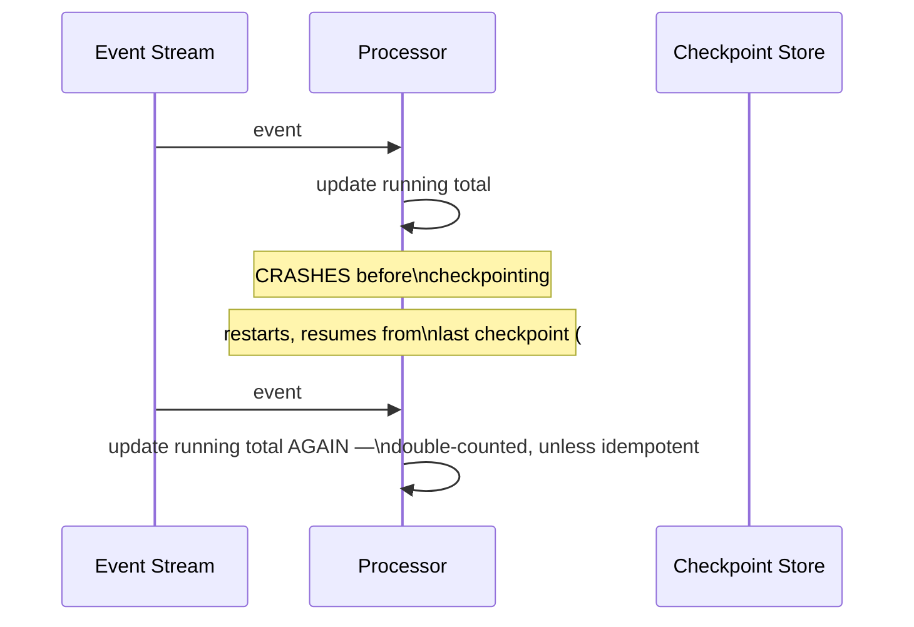

Real stream processors solve this the exact same way the Idempotency & Stateless Services guide described: either make the update itself idempotent (so reprocessing the same event twice produces the same result — natural for a "set" operation, harder for an "increment"), or make the checkpoint and the state update **atomic together** — both happen, or neither does — so a crash between them is structurally impossible rather than merely unlikely. This is what "exactly-once semantics" actually means in a stream processing engine: not that a message is magically delivered exactly once (still impossible, per the same Two Generals reasoning covered earlier in this series), but that at-least-once delivery combined with idempotent, checkpoint-consistent processing produces an outcome indistinguishable from exactly-once.

---

## Chapter 10: The Cost

**Lambda's cost is duplication, indefinitely.** Two pipelines, in practice often two different frameworks, computing the same business logic — every change has to be made (and tested) twice, and the two can drift subtly out of agreement if not maintained with real discipline.

**Kappa's cost is pushed into the streaming layer's sophistication.** Making a streaming pipeline handle late data, corrections, and full historical reprocessing as well as a batch pipeline once did is genuinely hard engineering — Kappa doesn't remove that difficulty, it just concentrates it in one place instead of splitting it across two.

**Debugging a stream is harder than debugging a batch job, structurally.** A batch job's input is a fixed, known dataset — rerunning it is deterministic. A stream's behavior depends on timing, arrival order, and watermark tuning — the same non-determinism the ArchitecturePatterns series flagged repeatedly about distributed systems in general, here showing up specifically as "this bug only reproduces when events arrive in this particular order."

**A materialized view is only as fresh as its refresh schedule.** Widening the refresh interval to save compute cost directly widens how stale a reader's view of the data can be — the exact same freshness-versus-cost dial the Database Optimization guide's caching chapter turned, just at the scale of a whole precomputed aggregation instead of a single cached value.

---

## Chapter 11: Which One Do You Actually Reach For?

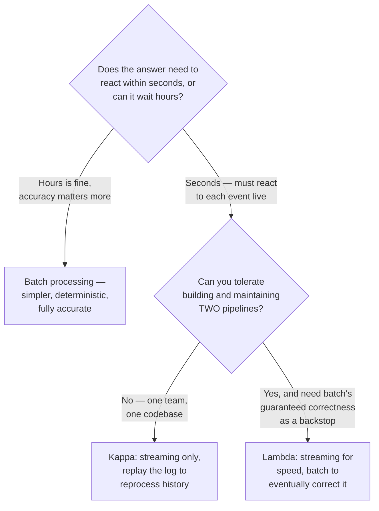

Most new systems today lean toward Kappa or pure streaming by default — the tooling has matured enough that "streaming, done well" can usually replace what Lambda needed two pipelines for. Lambda still earns its cost in domains where a slow-but-provably-correct backstop is worth the duplication — financial reconciliation being the clearest example, where an approximate real-time number is fine for a dashboard, but the actual books must be closed by a guaranteed-correct batch process.

---

## The Full Story, End to End

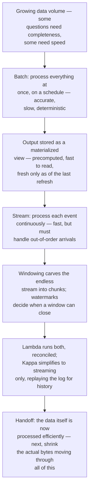

| | Batch Processing | Stream Processing |
|---|---|---|
| Latency | Hours (or longer) | Seconds |
| Completeness | Full, guaranteed | Provisional — must handle late data |
| Determinism | Fully deterministic | Depends on arrival order/timing |
| Core mechanism | MapReduce over a fixed dataset; output often a materialized view | Continuous processing + windowing + watermarks |
| Best for | Reports, reconciliation, anything needing full accuracy | Live dashboards, alerts, anything needing a fast reaction |

**Where would you like to go next?** Natural threads from here:

- **Data Compression & Optimization** — the growing volume of data this guide processes still has to be stored and moved efficiently
- **Event-Driven Architecture** (ArchitecturePatterns series) — the message broker and event log this guide's streaming pipelines are built directly on top of
