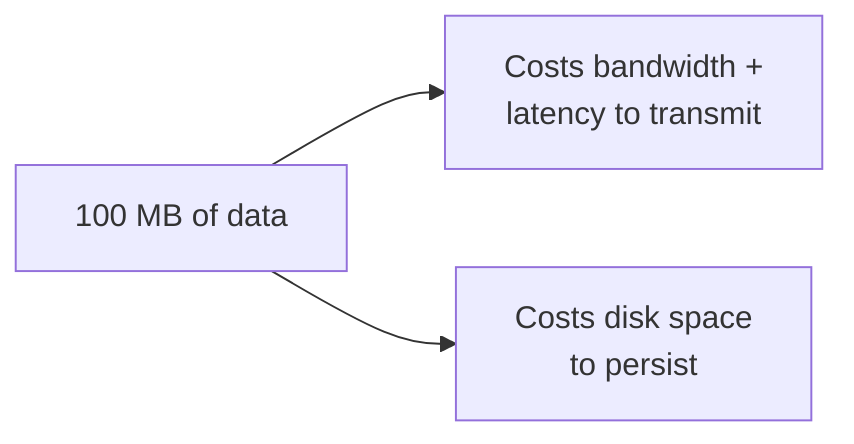
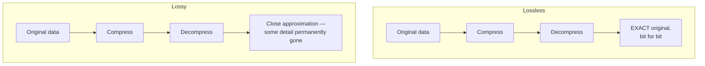
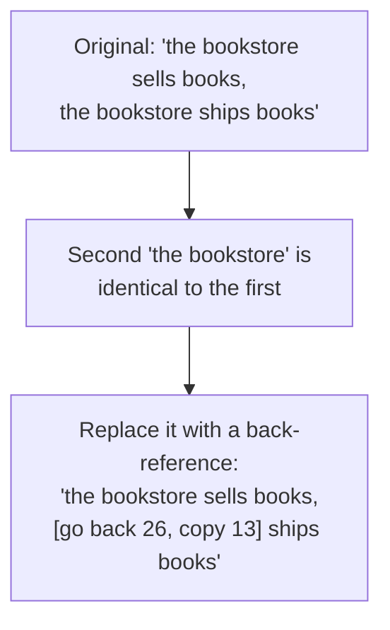
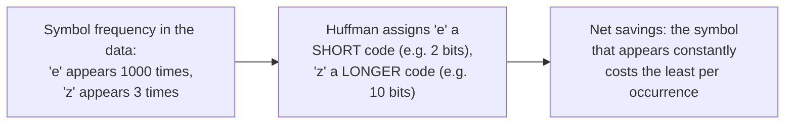
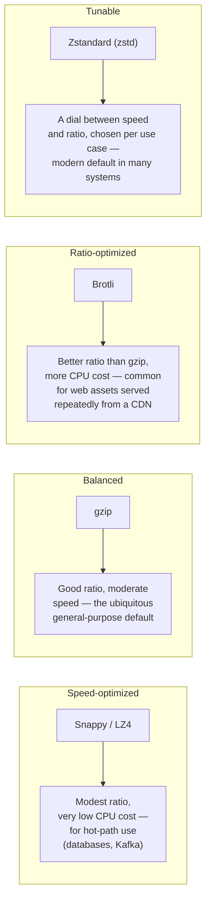
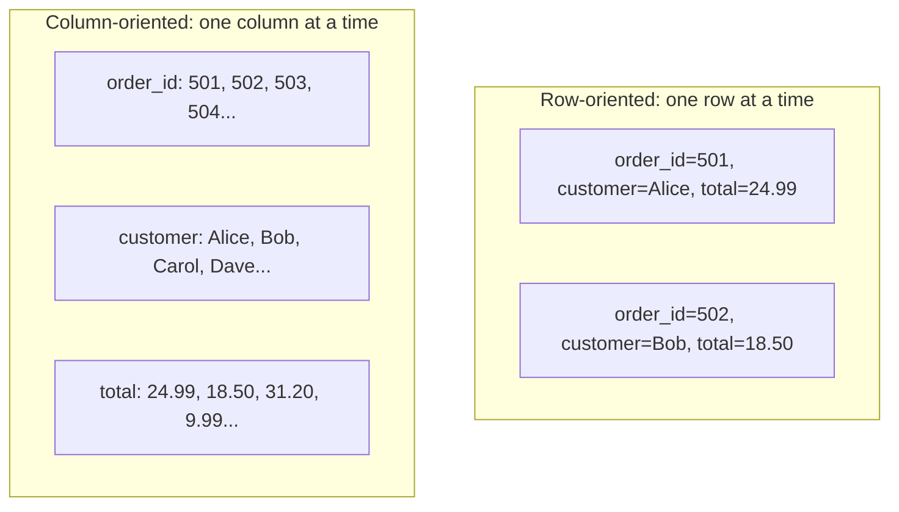
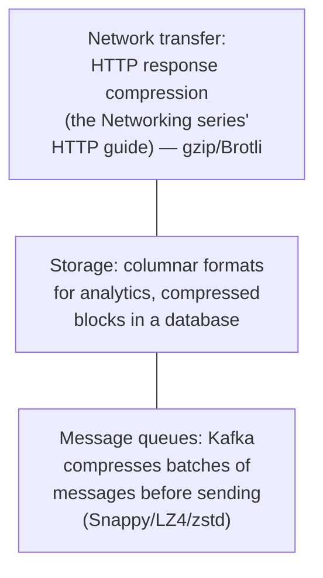
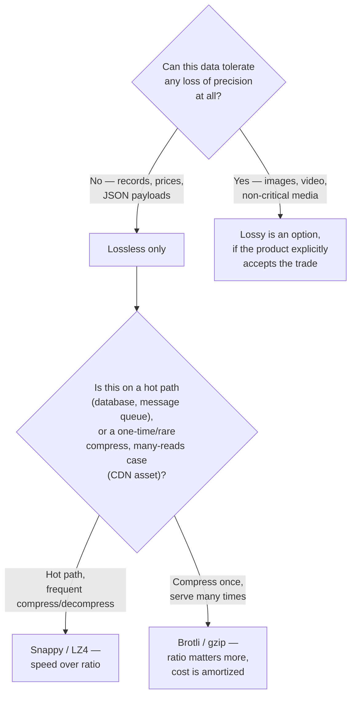
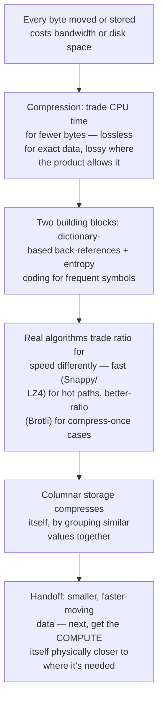

## The Story of Data Compression and Optimization

The previous guide's batch and streaming pipelines are humming, processing every order, click, and search the bookstore generates. All of that data still has to travel across networks and sit on disks — and every one of those bytes costs real money and real time to move and store. This guide is about the lever that shrinks the bytes themselves, before anything else gets a chance to move them.

---

## Interview Cheat Sheet

**Data compression** trades CPU time (to compress and decompress) for less data moved and stored — worthwhile exactly when data is redundant enough that the trade pays off, and wasteful when it isn't.

**Key facts:**
- **Lossless** compression can reconstruct the exact original data (required for anything a customer expects to be exact — an order record, a JSON payload); **lossy** compression discards some information permanently in exchange for a much smaller result (acceptable for a thumbnail image, unacceptable for a price)
- Most real compression algorithms combine two building blocks: **dictionary-based compression** (replace repeated sequences with short back-references to where they appeared before) and **entropy coding** (give frequently-occurring symbols shorter codes than rare ones)
- Real algorithms trade ratio for speed differently: **gzip** is a balanced, ubiquitous default; **Brotli** achieves a better ratio for web assets; **Snappy/LZ4** prioritize raw speed over ratio, for use inside databases and message queues where compression sits on the hot path; **Zstandard** is a modern, tunable middle ground
- **Columnar storage** (storing all values of one column together, rather than each row together) is itself a compression-friendly layout — similar values end up adjacent, which every compression algorithm exploits far better than a row-oriented layout ever could

**Common interview gotchas:**
- Compression ratio and compression speed are usually in tension — a better ratio typically costs more CPU time to achieve, which is why databases and message brokers reach for fast, modest-ratio algorithms (Snappy, LZ4) rather than the best-ratio ones
- Compressed data generally isn't directly indexable or searchable — you have to decompress a block before you can look inside it, which is a real tension with the previous guide's indexing techniques
- Choosing lossy compression is a product decision, not just a technical one — it needs to be an explicit, deliberate choice about what data is allowed to change, not a default reached for because it's smaller
- Compression's benefit scales with redundancy in the data — already-compressed or already-random data (encrypted data, media files re-compressed a second time) barely shrinks further, and sometimes grows slightly from the format overhead

**The core trade-off:** compression always spends CPU time to save bytes — the question in every real system is whether that CPU time is cheaper than the network and storage cost of the bytes it saves, and that answer changes depending on where in the system you're asking it.

---

## Chapter 1: Every Byte Costs Something, Twice

A product image, a JSON API response, a batch of Kafka messages from the previous guide's event stream — every one of these has to travel across a network (costing bandwidth and latency) and often sit on a disk somewhere (costing storage). Neither of those costs disappears just because the data is important; they scale directly with how many bytes are actually involved.

The lever this guide is about is direct: if the same information can be represented in fewer bytes, both costs shrink, for free, on every future transfer and every day it sits in storage — the only price paid is the CPU time spent compressing it once and decompressing it every time it's read.

---

## Chapter 2: Lossless vs. Lossy — A Product Decision First

Before any algorithm, there's a more fundamental choice: can this data change at all, even slightly, in exchange for being smaller?

An order record, a price, a JSON API payload — these must round-trip exactly, or the bookstore is silently corrupting its own data. A product thumbnail, a preview video, a background audio track — these can tolerate some quality loss in exchange for a dramatically smaller file, because a human looking at a slightly-compressed thumbnail usually can't tell the difference, and the file being small enough to load instantly matters more than pixel-perfect fidelity. This is a deliberate, product-level decision about what's allowed to change — never a default reached for silently just because lossy formats tend to produce smaller files.

---

## Chapter 3: How Compression Actually Works — Two Building Blocks

Most real, general-purpose lossless algorithms are built from two complementary ideas, and seeing them concretely demystifies what "compression" is actually doing under the hood.

**Dictionary-based compression** (the LZ77 family, the basis of gzip, Brotli, Snappy, and most others) replaces a repeated sequence of bytes with a short reference back to where that exact sequence appeared earlier in the data — "back-reference 12 characters back, 5 characters long," instead of repeating the actual 5 characters.

**Entropy coding** (Huffman coding is the classic example) assigns shorter binary codes to symbols that appear frequently, and longer codes to rare ones — the same intuition Morse code uses, giving the common letter "E" a single dot while a rare letter like "Q" gets a longer sequence.

A real algorithm like **DEFLATE** (the core of gzip and PNG) runs both steps in sequence: dictionary-based back-references first, to eliminate repeated sequences, then entropy coding on what's left, to squeeze the remaining symbols based on how often each one shows up. Neither step alone would get nearly as far as the two combined.

---

## Chapter 4: Real Algorithms Make Genuinely Different Trade-offs

Knowing the two building blocks explains *how* compression works; knowing the real algorithm landscape explains *which one to reach for*, because they don't all sit in the same spot on the ratio-versus-speed trade-off.

The reasoning behind each choice traces directly back to where the compression happens: a database or message broker (Kafka, covered in the ArchitecturePatterns series' Event-Driven Architecture guide) compresses and decompresses constantly, on the hot path of every write and read, so it needs the cheapest possible CPU cost even at a worse ratio — Snappy and LZ4 exist specifically for this. A CDN (the Networking series' guide) compresses a web asset once and serves the compressed version to millions of requests afterward — paying more CPU once, upfront, for Brotli's better ratio is a clear net win, because the cost is amortized across every one of those millions of served requests.

---

## Chapter 5: Columnar Storage — A Layout That Compresses Itself

Here's a genuinely elegant idea that connects directly back to the previous guide's batch processing: how you *arrange* data on disk affects how well it compresses, independent of which algorithm you use.

A row-oriented layout interleaves wildly different kinds of values next to each other (a number, a name, another number) — poor material for either of Chapter 3's building blocks to exploit. A column-oriented layout groups every value of the *same* column together — and similar, repetitive values sitting adjacent to each other is exactly the pattern dictionary-based compression and entropy coding both thrive on (a column of `order_status` values might be 95% "delivered," compressing dramatically better grouped together than scattered one-per-row). This is precisely why analytical/batch-processing systems (the previous guide's territory) favor columnar formats — the storage layout itself is a compression optimization, before any specific algorithm is even chosen.

---

## Chapter 6: Where Compression Actually Shows Up in a Real System

Each of these is the same underlying trade from Chapter 1, applied at a different layer: HTTP compression shrinks what travels over the wire to a browser; storage compression shrinks what sits on disk for months or years; message-queue compression shrinks what a broker has to hold and forward for every consumer. None of them are exotic, special-purpose techniques — they're the same handful of algorithms from Chapter 4, chosen deliberately for the speed/ratio trade-off that layer actually needs.

---

## Chapter 7: The Cost — Compression Isn't Free, and It Fights Back Against Indexing

**CPU cost is real and constant, not one-time.** Every compressed byte has to be decompressed again to be read — a hot-path system compressing and decompressing constantly is spending real, ongoing CPU cycles on this, which is exactly why hot-path systems reach for the cheapest algorithms (Snappy, LZ4) rather than the best-ratio ones.

**Compressed data resists the previous guide's indexing techniques.** A database index (Chapter 2 of the Database Optimization guide) depends on being able to compare individual values directly — but a compressed block generally has to be fully decompressed before anything inside it can be inspected at all, which is a genuine tension: compress too aggressively, at too coarse a granularity, and you lose the ability to efficiently look inside without paying the full decompression cost for data you didn't actually need.

**Compression only pays off when there's real redundancy to exploit.** Data that's already compressed (a JPEG, an already-gzipped file), or genuinely random (encrypted data, by design), has little to no redundancy left for a compressor to find — attempting to compress it again often barely shrinks it, and can occasionally grow it slightly from the format's own overhead.

---

## Chapter 8: When Do You Actually Reach for This, and Which Kind?

The deciding question is almost never "which algorithm is best" in the abstract — it's "how often does this specific piece of data get compressed relative to how often it gets decompressed and read," because that ratio is what determines whether spending more CPU for a better compression ratio actually pays for itself.

---

## The Full Story, End to End

| | Lossless | Lossy |
|---|---|---|
| Reconstructs exactly | Yes | No — some detail permanently discarded |
| Compression ratio | Moderate | Often much higher |
| Use case | Records, JSON, code, anything exact | Images, video, audio where quality loss is acceptable |
| Decision level | Default assumption | Explicit, deliberate product choice |

**Where would you like to go next?** Natural threads from here:

- **Edge Computing & Latency Reduction** — shrinking the data is one lever; moving the compute physically closer to where it's needed is the next
- **HTTP vs. HTTPS** (Networking series) — where compression shows up directly in the request/response cycle covered in that guide
