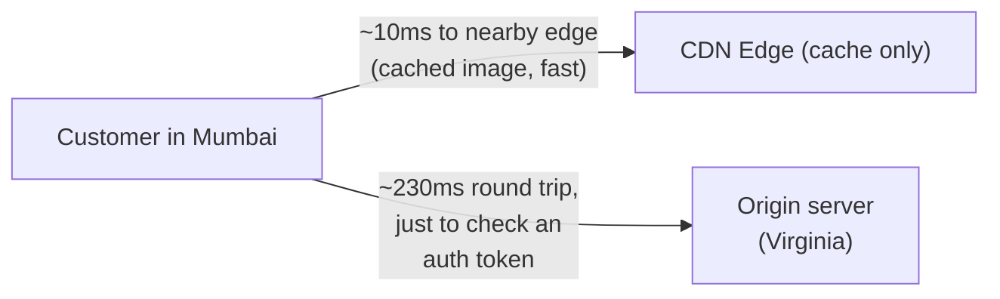
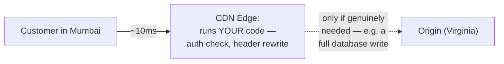
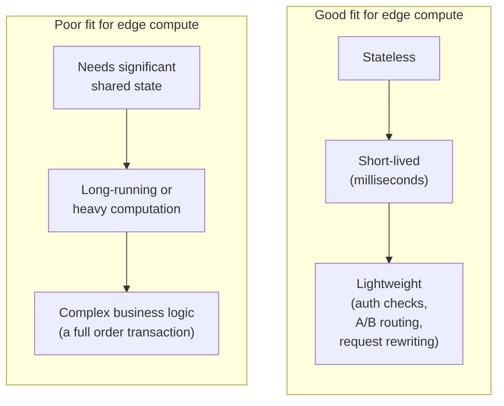
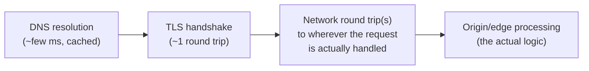
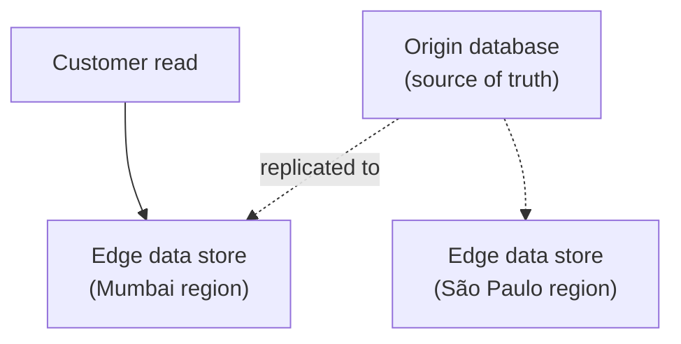
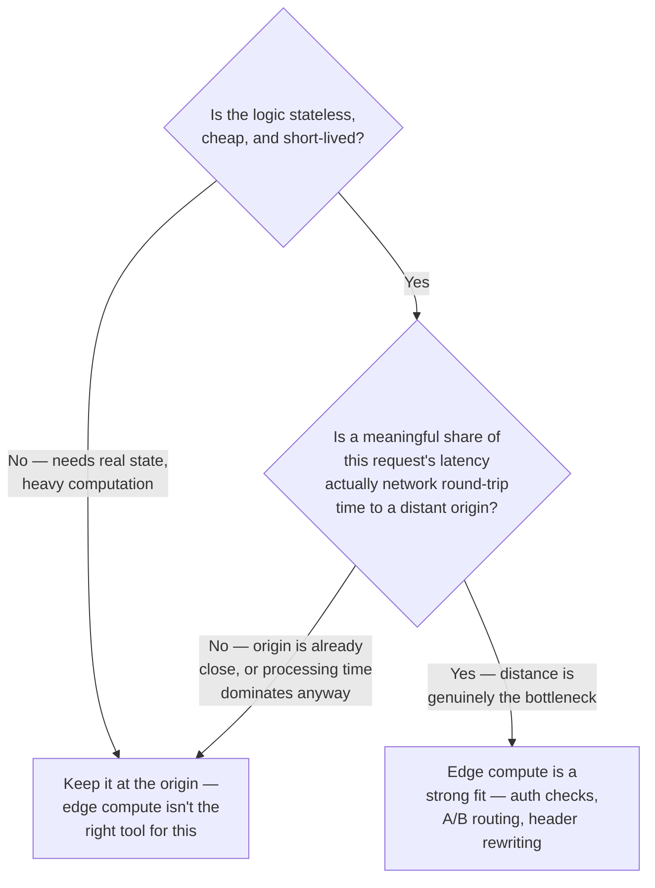
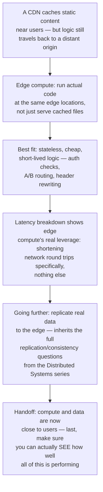

## The Story of Edge Computing and Latency Reduction

The Networking series' CDN guide already solved half of this problem: cache a book's cover image at an edge server near the customer, and the request for that image never has to cross an ocean. That guide's Chapter 4 mentioned, almost in passing, that some CDN providers now let you run actual *code* at those same edge locations — not just serve a cached file. This guide is about taking that mention seriously: what happens when it's not the data that moves closer to the customer, but the computation itself?

---

## Interview Cheat Sheet

**Edge computing** runs actual application logic at points of presence physically close to users, rather than routing every request back to a distant, centralized origin — reducing latency by shortening the physical distance a request has to travel before getting a meaningful response.

**Key facts:**
- Edge compute is well-suited to logic that's **stateless, short-lived, and lightweight** — auth checks, A/B test assignment, request/response transformation, simple personalization — and poorly suited to anything needing significant shared state or heavy computation
- A request's total latency breaks down into distinct pieces — DNS resolution, TLS handshake, network round trips, origin processing — and edge compute's actual leverage is specifically on the network-round-trip portion, not the others
- Some systems now go further than compute alone and replicate a genuine (if limited) copy of data *to* the edge, not just a cache of it — narrowing, but not eliminating, the same replication and consistency questions the Distributed Systems series covered at global scale
- Real platforms — Cloudflare Workers, AWS Lambda@Edge and CloudFront Functions, Fastly Compute@Edge — each impose real constraints (execution time limits, memory limits, restricted APIs) specifically because code is running in hundreds of locations at once, not one

**Common interview gotchas:**
- Edge computing and a CDN are related but not the same claim — a CDN, on its own, only caches and serves existing content; edge *compute* specifically means running your own logic at those same edge locations
- "Move it to the edge" doesn't reduce the total amount of work — it changes *where* the work happens, and only helps latency for the portion of a request's time that was actually spent on network round trips to a distant origin
- Edge functions are usually billed and constrained per-invocation, with tight execution time and memory limits — reaching for edge compute to run something heavy or long-running is fighting the platform, not using it as intended
- Replicating real data to the edge (not just caching it) reintroduces the exact consistency questions the Distributed Systems series covered — at an even larger, more geographically spread scale

**The core trade-off:** the closer to the user you push computation, the less network latency a request pays — but the less state, memory, and execution time you're allowed to use once you're there, because that same logic now has to run correctly, cheaply, and simultaneously across hundreds of physical locations worldwide.

---

## Chapter 1: Caching Solved Half the Problem

The Networking series' CDN guide fixed latency for *static* content — a product image, once cached at a nearby edge server, never has to travel back to the distant origin again. But not every slow part of a request is static content. A request that needs even a small amount of *logic* — checking an auth token, deciding which A/B test variant to show, rewriting a header — still, in the CDN-only model, has to travel all the way back to the origin server just to run that logic, even if the logic itself takes a single millisecond to execute.

The image is fast. The auth check — trivial, cheap logic — still pays the full round-trip cost, because there was nowhere closer to actually run it.

---

## Chapter 2: Push the Logic Itself to the Edge

**Edge computing** closes this gap directly: instead of only caching content at edge locations, run actual application code there too — the same physical points of presence a CDN already uses, now executing your logic instead of just serving a file.

The auth check that used to cost a 230ms round trip now runs in the same ~10ms it takes to reach a nearby edge server at all — because the logic never had to leave the neighborhood it was needed in, the same fundamental win the CDN guide described for cached images, now applied to code instead of files.

---

## Chapter 3: What Belongs at the Edge, and What Doesn't

Edge platforms deliberately constrain what can run there, and understanding *why* clarifies what genuinely belongs at the edge versus what still needs to go back to a central origin.

This is the exact same principle the Distributed Systems series' closing guide established for services in general — **stateless** logic scales trivially, because any instance (or in this case, any of hundreds of edge locations) can run it without needing to coordinate with any other. The moment logic needs meaningful shared state — the current inventory count, a customer's full order history — it needs to reach back to wherever that state actually, authoritatively lives, because replicating that state to every edge location the way a static image is cached would reintroduce the full consistency problem the Distributed Systems series spent a whole series solving, at a scale of hundreds of locations instead of a handful of regions.

---

## Chapter 4: Where Every Millisecond Actually Goes

To see precisely where edge compute's leverage is, and isn't, it helps to break down a request's total latency into its real components — the same request the Networking series traced end to end, guide by guide.

Edge compute's entire leverage point is the **network round trip** segment — shortening the physical distance a request travels before its logic runs. It does essentially nothing for DNS resolution or TLS handshake time (both already optimized by the mechanisms the Networking series' DNS and TLS guides covered — GeoDNS, TLS 1.3's reduced round trips), and it does nothing at all for the actual processing time once a request has arrived, if that processing is genuinely heavy. Edge compute's win is specifically, only, the distance a request has to travel to reach *some* logic — which is precisely why it's such a strong fit for cheap, simple checks, and a poor fit for anything that would take real processing time no matter where it ran.

---

## Chapter 5: Going Further — Replicating Data, Not Just Compute

A newer, more ambitious pattern pushes further than stateless logic alone: replicate a genuine (if deliberately limited) copy of real data *to* the edge — not a cache with a TTL, but an actual local read (and sometimes write) replica, geographically distributed the same way the Distributed Systems series' Eventual Consistency guide described regional database replicas, just spread across many more, smaller locations.

This is genuinely more powerful than simple caching — reads can be served locally even for data that changes more often than a typical cache TTL would tolerate — but it inherits the exact same trade-offs the Distributed Systems series spent an entire series on: replication lag, the quorum question of how many edge copies must agree before a write is confirmed, and the vector-clock question of what happens if two edge locations accept conflicting writes during a network partition between them. Pushing data to the edge doesn't sidestep those questions — it just asks them at a much larger geographic scale, with more, smaller replicas involved.

---

## Chapter 6: Real Platforms, Real Constraints

**Cloudflare Workers** run on Cloudflare's global network of edge locations, with a lightweight JavaScript/WebAssembly runtime and strict execution-time limits, specifically because the same function might be invoked simultaneously across hundreds of physical locations — Cloudflare's **Durable Objects** extend this toward limited, coordinated state at the edge, for cases that genuinely need it. **AWS Lambda@Edge** and the lighter-weight **CloudFront Functions** run at Amazon's CloudFront edge locations, with CloudFront Functions imposing even tighter constraints (sub-millisecond execution budgets) for the simplest, cheapest class of edge logic, and Lambda@Edge allowing more capability at a higher latency and cost budget. **Fastly Compute@Edge** takes a WebAssembly-first approach, aiming for near-native execution speed at the edge across multiple source languages.

Every one of these platforms imposes real, deliberate constraints — execution time caps, memory limits, restricted APIs (often no arbitrary outbound network calls, no long-running processes) — not as an oversight, but because the same piece of code is running concurrently, cheaply, across an enormous number of physical locations at once, and a platform that let any one invocation run heavy or long would break that model for everyone.

---

## Chapter 7: The Cost

**Edge platforms constrain what you can build, deliberately.** Reaching for edge compute to run something that genuinely needs more memory, more execution time, or heavier computation than the platform allows means fighting the platform's own design, not using it as intended — that logic belongs at the origin, not the edge.

**Debugging code running in hundreds of locations is genuinely harder.** A bug that only reproduces at one specific edge location, under one specific regional traffic pattern, is a much harder thing to reproduce and fix than a bug in one centralized origin server — the same "distributed systems make debugging harder" theme this whole set of series keeps returning to, here at its most physically distributed extreme.

**Vendor lock-in is real and specific.** Each edge platform's runtime constraints, APIs, and deployment model differ meaningfully — moving edge logic from Cloudflare Workers to Lambda@Edge is rarely a simple copy-paste, echoing the exact same portability cost the Serverless Architecture guide (ArchitecturePatterns series) raised about FaaS platforms generally.

---

## Chapter 8: When Do You Actually Reach for This?

The clearest sign edge compute is worth reaching for: the logic in question is small enough to run identically, correctly, and cheaply at hundreds of locations at once, and the latency it's trying to save is genuinely dominated by the physical distance to a centralized origin — not by the processing time the logic itself takes once it arrives.

---

## The Full Story, End to End

| | CDN Caching | Edge Compute |
|---|---|---|
| What moves to the edge | Static content (images, JS/CSS) | Actual application logic |
| Handles dynamic/per-request logic | No | Yes, if lightweight and stateless |
| State | None — pure cache | Limited (Durable Objects-style), or none |
| Constraints | Cache-control headers, TTLs | Execution time, memory, restricted APIs |
| Best for | Assets identical for every user | Auth, routing, transformation, simple personalization |

**Where would you like to go next?** Natural threads from here:

- **Distributed Logging & Monitoring** — the last guide in this series, and how you actually observe a system now spread across load balancers, caches, streaming pipelines, and edge locations
- **Content Delivery Networks** (Networking series) — the caching half of this exact story, covered in full
