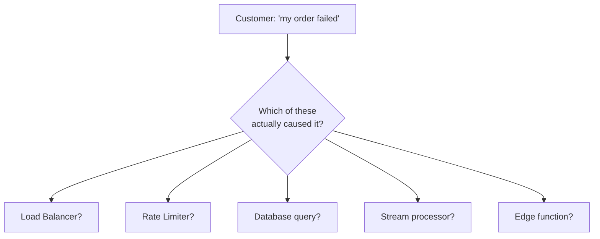
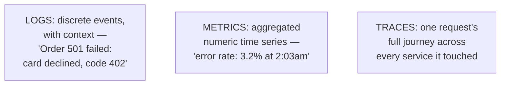
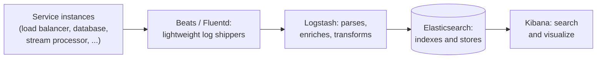
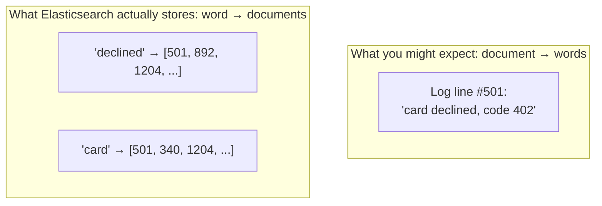
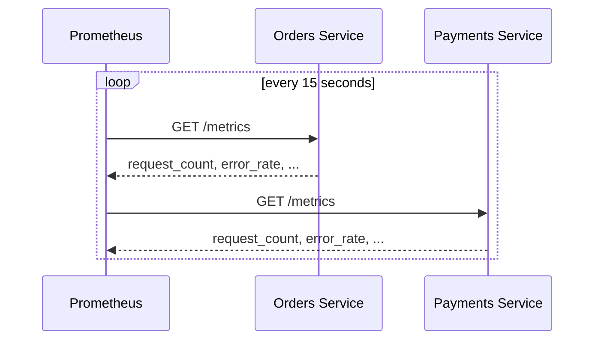
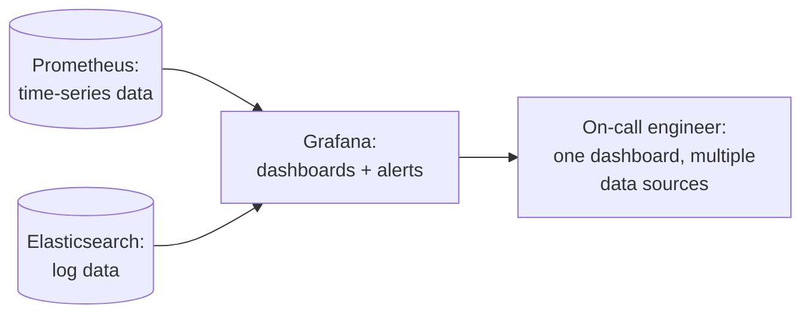
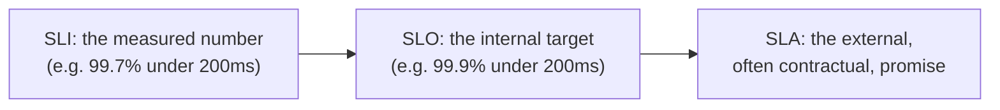
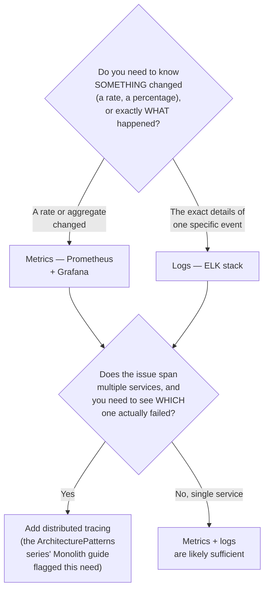
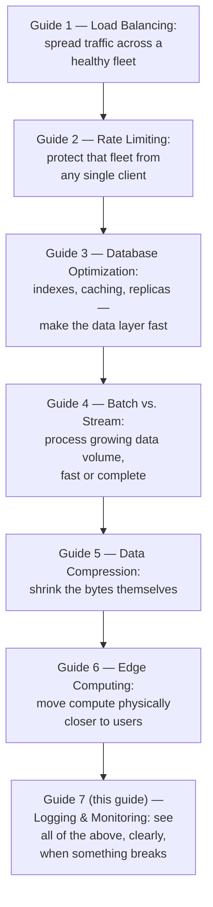
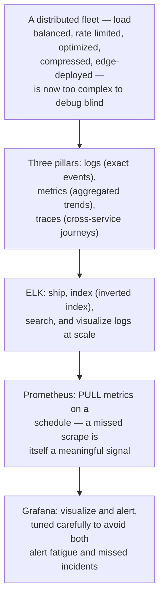

## The Story of Distributed Logging and Monitoring

This series has spread the bookstore's traffic across a load-balanced fleet, capped it fairly, optimized the database, split processing into batch and stream pipelines, shrunk the data itself, and pushed compute out to the edge. Every one of those pieces is now a separate moving part, running somewhere in the world, at every moment. This closing guide is about the question none of the others answer: when something breaks at 3am, how do you even find out — let alone figure out which of these many moving parts is actually at fault?

---

## Interview Cheat Sheet

**Observability** rests on three complementary pillars — **logs** (discrete, timestamped events with context), **metrics** (aggregated numeric time series), and **traces** (one request's journey across every service it touched) — and a mature system needs all three, because each answers a different question the others can't.

**Key facts:**
- The **ELK stack** (Elasticsearch, Logstash, Kibana — often with Beats/Fluentd for lightweight shipping) is the standard open-source pipeline for logs: collect, ship, index, search, visualize
- **Elasticsearch** answers "search across billions of log lines" using an **inverted index** — a structure mapping each word to the list of documents containing it, the mirror image of the previous series' guide on database indexes, built for text search rather than range lookups
- **Prometheus** collects metrics by **pulling** (scraping) from each service on a schedule, rather than having services push to it — a deliberate design choice that scales better and fails more gracefully than the alternative
- **Grafana** sits on top of Prometheus (and other data sources) purely as the visualization and alerting layer, turning raw time-series data into dashboards and threshold-based alerts

**Common interview gotchas:**
- Logs, metrics, and traces are not three ways to view the same data — a metric can tell you *that* error rates spiked at 2:03am, a trace can tell you *which* service in a request's path actually failed, and a log can tell you the *exact* error message and stack trace — you typically need all three to go from "something's wrong" to "here's the fix"
- Prometheus's pull model means a service that's completely down simply fails to be scraped — which is itself a detectable, meaningful signal, distinct from a service that's up but reporting bad data
- **Cardinality explosion** — accidentally including a high-cardinality value (a user ID, a full URL with query parameters) as a metric label — can silently multiply a monitoring system's storage and query cost by orders of magnitude
- A poorly-tuned alerting threshold produces the exact same "flapping" problem the ArchitecturePatterns series' Circuit Breaker guide described for a badly-tuned failure threshold — too sensitive, and real signal drowns in noise; too lax, and it misses real incidents

**The core trade-off:** the more visibility you build into a system — more logs, more metrics, more trace spans — the more it costs to store, query, and maintain that visibility itself, and a system with too much unfocused observability can become as hard to make sense of as one with too little.

---

## Chapter 1: Something Broke, and Nobody Knows Where

A customer reports her order failed. Behind that one failure sits everything this series has built: a load balancer, a rate limiter, an optimized (or unoptimized) database query, a stream processor, compressed data moving between services, and possibly logic that ran at the edge before the request ever reached the origin. Without a deliberate way to observe all of it, "something broke" is where the investigation starts and, often, where it stalls.

---

## Chapter 2: The Three Pillars, Precisely Defined

**Observability** is usually described as resting on three pillars, and it's worth being precise about what each one actually is, because they answer genuinely different questions.

A **log** is a discrete, timestamped record of one specific event, with as much context as whoever wrote it chose to include — precise, but expensive to store and search at volume. A **metric** is an aggregated number over time — a request rate, an error percentage, a queue depth — cheap to store and fast to query, but it tells you *that* something changed, never *why*. A **trace** follows one specific request across every service boundary it crossed — exactly the mechanism the ArchitecturePatterns series' Monolithic vs. Microservices guide flagged as becoming necessary the moment a system splits into multiple services, since a single request's story is no longer sitting in one log file.

The practical workflow almost always moves between all three: a metric's dashboard shows an error-rate spike ("something's wrong"); a trace narrows down *which* service in the request's path the spike is actually coming from; a log at that specific service gives the exact error message needed to fix it.

---

## Chapter 3: The ELK Stack — Logs at Scale

**ELK** — **E**lasticsearch, **L**ogstash, **K**ibana — is the standard open-source pipeline for handling logs at real volume, with lightweight shippers (**Filebeat**, **Fluentd**, or Logstash itself) collecting logs from every service instance and forwarding them centrally.

**Elasticsearch**'s core trick, worth understanding at the same mechanical depth the previous guide's B-Tree discussion covered for databases, is the **inverted index**: instead of storing "document 501 contains these words," it stores the mirror image — "the word 'declined' appears in documents 501, 892, 1204..." — for every word, across every log line ever indexed.

Searching for every log line containing "declined" becomes a direct lookup into that word's list — instead of scanning every log line and checking whether it contains the word, the exact same scan-versus-lookup trade the previous guide's B-Tree index made for database rows, just built for text search rather than sorted range queries.

---

## Chapter 4: Prometheus — Metrics, Pulled Rather Than Pushed

**Prometheus** takes a deliberately different collection model than ELK's shipping approach: instead of each service pushing its metrics somewhere, Prometheus **pulls** (scrapes) metrics from each service on a fixed schedule, hitting a `/metrics` endpoint every service exposes.

This pull model has a genuine, deliberate advantage: Prometheus itself decides the collection schedule and controls its own load, rather than every service independently deciding when to push and potentially overwhelming a central collector all at once — and critically, **a service that's completely down simply fails to be scraped**, which is itself an immediately visible, meaningful signal ("this target has been unreachable for 30 seconds"), distinct from a service that's up but silently reporting nothing. Each metric is stored as a **time series** — a metric name plus a set of labels (e.g., `http_requests_total{service="orders", status="500"}`), with a value at each point in time — the data model that lets Prometheus's query language slice and aggregate across any combination of labels after the fact.

---

## Chapter 5: Grafana — Turning Numbers Into Something a Human Reads at 3am

**Grafana** is purely the visualization and alerting layer — it queries Prometheus (or Elasticsearch, or several other data sources at once) and renders dashboards, without storing any of the underlying data itself.

The separation matters: Prometheus's job is collecting and storing metrics correctly and efficiently; Grafana's job is making them legible to a human, and firing an alert (paging someone, posting to a chat channel) when a defined threshold is crossed — two genuinely different concerns, each replaceable independently of the other.

---

## Chapter 6: Alerting — SLIs, SLOs, and the Flapping Problem

An **SLI** (Service Level Indicator) is the actual measured metric — say, "percentage of requests completing under 200ms." An **SLO** (Service Level Objective) is the target for that indicator — "99.9% of requests under 200ms, measured over 30 days." An **SLA** (Service Level Agreement) is the SLO turned into an external, often contractual, promise to customers, usually with a defined consequence if it's missed.

Alerts are built on top of SLOs — "page someone if the SLI drops below the SLO's threshold for more than 5 minutes." Getting that threshold right is the exact same tuning problem the ArchitecturePatterns series' Circuit Breaker guide described for failure detection thresholds: too sensitive, and every brief, harmless blip pages someone at 3am for nothing (alert fatigue, the monitoring equivalent of a circuit breaker "flapping" open and closed on noise); too lax, and a real, sustained incident goes unnoticed far longer than it should.

---

## Chapter 7: The Cost

**Cardinality explosion is a real, easy-to-trigger failure mode.** If a metric's labels accidentally include something with enormous variety — a raw user ID, a full URL including query parameters — Prometheus ends up tracking a separate time series for every unique combination of label values, which can silently multiply storage and query cost by orders of magnitude. The fix is deliberate: labels should describe a bounded, small set of categories (a service name, an HTTP status code range), never an unbounded, per-request identifier.

**Log volume at real scale costs real money.** Every service instance logging verbosely, all the time, adds up fast across a large fleet — teams often have to make deliberate decisions about log levels, sampling, and retention (keeping recent logs fully searchable, archiving or discarding older ones), the same hot-vs-cold storage tension the previous series' CDN guide raised for cached content.

**Observability infrastructure needs its own observability.** Prometheus, Elasticsearch, and Grafana are themselves distributed systems that can fail, fall behind, or run out of capacity — and if the monitoring system goes down silently, you can lose visibility into an incident at the exact moment you need it most, which is why mature setups monitor their own monitoring stack, not just the services it watches.

---

## Chapter 8: What Do You Actually Need?

A mature system builds all three pillars deliberately, not by accident: metrics as the cheap, always-on early warning system; logs as the detailed record you dig into once a metric points you somewhere; traces as the connective tissue across service boundaries once a system has grown past the point where "check the one log file" is still a viable strategy.

---

## Chapter 9: Closing the Series

This is the last guide in the Scalability and Performance Optimization series, and it's fitting that it closes on observability — every guide before it built a faster, more efficient, more distributed system, and this guide is the one that lets you actually confirm any of it is working.

Every guide in this series made the bookstore's fleet faster, cheaper, or more geographically distributed — and, exactly like every series before it, none of these techniques is free or universally correct. A load balancer without health checks routes traffic to dead instances. Indexes without write-amplification awareness quietly slow every write. Compression without regard for indexability fights the very queries it was meant to speed up. Edge compute pushed too far runs into the platform's own limits. The thread running through all seven guides isn't a checklist to apply uniformly — it's the same recurring skill this entire body of work has been building: recognize precisely which cost your system is actually paying, before reaching for the specific tool built to address it.

---

## The Full Story, End to End

| | Logs | Metrics | Traces |
|---|---|---|---|
| Granularity | One discrete event | Aggregated over time | One request, end to end |
| Cost to store/query | High at volume | Low | Moderate |
| Answers | "What exactly happened?" | "Did something change?" | "Which service actually failed?" |
| Tooling | ELK (Elasticsearch, Logstash, Kibana) | Prometheus + Grafana | Jaeger, OpenTelemetry (ArchitecturePatterns series) |

For the exhaustive architecture (v1 → v2 → v3), capacity math, retention-tier design, and interview-drilling depth on this topic, see `HLD/0-course/22-Distributed-Logging-FAANG-Guide.md` and `HLD/0-course/13-Distributed-Monitoring-FAANG-Guide.md` in this repository.

**This closes the Scalability and Performance Optimization series.** Natural next threads from this repository's README:

- **Security & Compliance** — access control and encryption for the fleet, data, and observability infrastructure this series spent seven guides optimizing
- **Cloud & DevOps** — how load balancers, edge functions, and observability stacks are actually provisioned and deployed as infrastructure-as-code
