## The Story of Authentication & Authorization

The Distributed Systems series closed by naming its own blind spot directly: eight guides spent building caches, quorum-replicated databases, and consensus-backed coordinators — real, working stores holding real, valuable data — without ever asking who's allowed to touch any of it. This guide is where that question starts getting answered. Before encryption, before compliance frameworks, before any of the harder security machinery later in this series, every system needs two much more basic mechanisms working correctly: proving who's making a request, and deciding what that identity is allowed to do once proven. Get either one wrong, and every store this repository has spent eight guides teaching you to build correctly becomes exposed anyway.

---

## Interview Cheat Sheet

**Authentication (AuthN)** answers "who are you?" — verifying an identity, usually once, at the start of a session. **Authorization (AuthZ)** answers "what are you allowed to do?" — checked on every single request, against the specific resource being touched, not just the fact that someone is logged in.

**Key facts:**
- Conflating the two is one of the most common real-world vulnerability classes: checking "is this user logged in" as a stand-in for "is this user allowed to see *this specific* record" produces an **IDOR** (Insecure Direct Object Reference) — an authenticated stranger reading someone else's data simply by changing an ID in the URL
- Passwords must be stored as a **salted hash**, never plaintext and never reversibly encrypted — encryption implies a key that can decrypt it back, which is a liability no legitimate login flow ever needs, since the server only ever needs to *verify* a password, not recover it
- A **salt** doesn't make an individual password harder to crack — it defeats **precomputed rainbow tables** and stops two users with the same password from producing the same hash, forcing an attacker to attack every hash independently
- **bcrypt / scrypt / Argon2** are deliberately slow and tunable (a **work factor**); plain **SHA-256/MD5** are deliberately fast, which is exactly why they're wrong for passwords — fast hashing is a feature for checksums and a vulnerability for secrets
- **Session-based auth** is stateful (a lookup against a server-side store on every request); **token-based auth** is stateless (the token is self-contained and cryptographically verifiable) — this is the same stateless-vs-stateful tension `DistributedSystems/8_IdempotencyAndStatelessServices.md` closed the previous series on, applied directly to identity
- **RBAC** (roles → permissions) is simple and auditable; **ABAC** (attributes + policy engine) handles contextual rules — "only your own department's records," "only during business hours" — that RBAC can only express by exploding into one role per condition

**Common interview gotchas:**
- "The user is logged in" and "the user is allowed to do this" are not the same check, and code that only performs the first one is a textbook IDOR waiting to be found
- A salt is stored in plaintext right next to the hash — it isn't a secret, and it doesn't need to be; its entire job is to make precomputed attacks and cross-user pattern matching useless, not to add secret entropy
- Session fixation isn't about stealing a session ID — it's about the attacker *supplying* one before login and the victim unknowingly authenticating into it; the fix is regenerating the session ID at the moment of login, not encrypting the cookie
- ABAC is not strictly "better" than RBAC — for a small, static permission set, a policy engine is overhead an app doesn't need; the right question is whether the rule genuinely depends on runtime context, not just "which model sounds more sophisticated"

**The core trade-off:** every authentication and authorization scheme in this guide trades some combination of simplicity, statelessness, and revocability against each other — a stateful session can be instantly revoked but doesn't scale for free; a stateless token scales for free but can't be un-issued before it expires; RBAC is simple to audit but can't express context; ABAC expresses context but needs a policy engine to evaluate it correctly.

---

## Chapter 1: Two Different Questions, Asked in Order

**Authentication** establishes an identity: this request comes from user `riyaz`, and here's cryptographic or credential-based proof of it. **Authorization** takes that already-established identity and asks a second, separate question against a specific resource and action: is `riyaz` allowed to `read` order `#12345`?

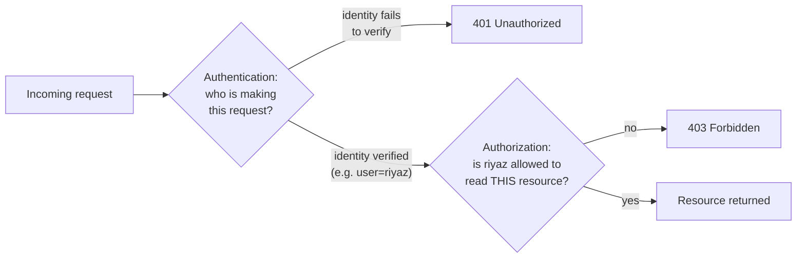

These have to run as two genuinely separate checks, in that order, every single request — not one check that happens to imply the other. The most common way real systems get this wrong is treating "the request has a valid session or token" as sufficient on its own, and skipping the second question entirely.

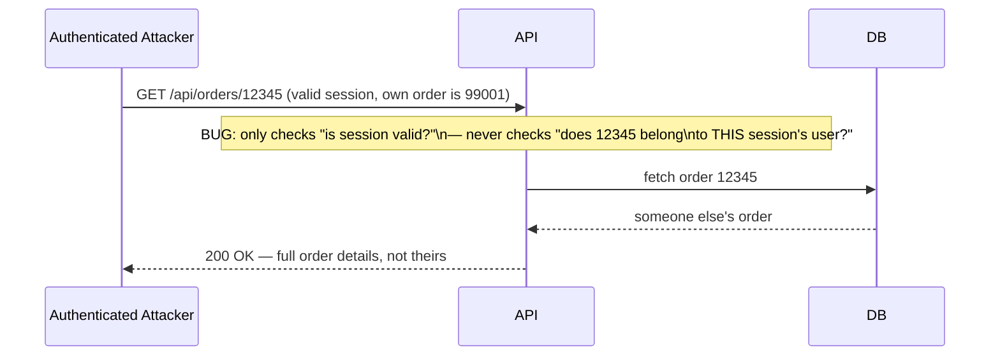

This is the **Insecure Direct Object Reference** class of bug: authentication passed, authorization was never actually checked, and the only thing standing between the attacker and every other user's data was the assumption that nobody would try changing the number in the URL. The fix isn't more authentication — a stronger password policy does nothing here — it's an authorization check that compares the resource's owner against the authenticated identity on every single access, not just at login.

---

## Chapter 2: Password Authentication — What Actually Happens to a Password

The first rule is absolute: a password is never stored as plaintext, and never stored **encrypted** either — encryption is reversible by design (whoever holds the key can recover the original), and a login flow has no legitimate reason to ever recover the original password, only to check whether a submitted one matches. What gets stored instead is the output of a one-way **hash**.

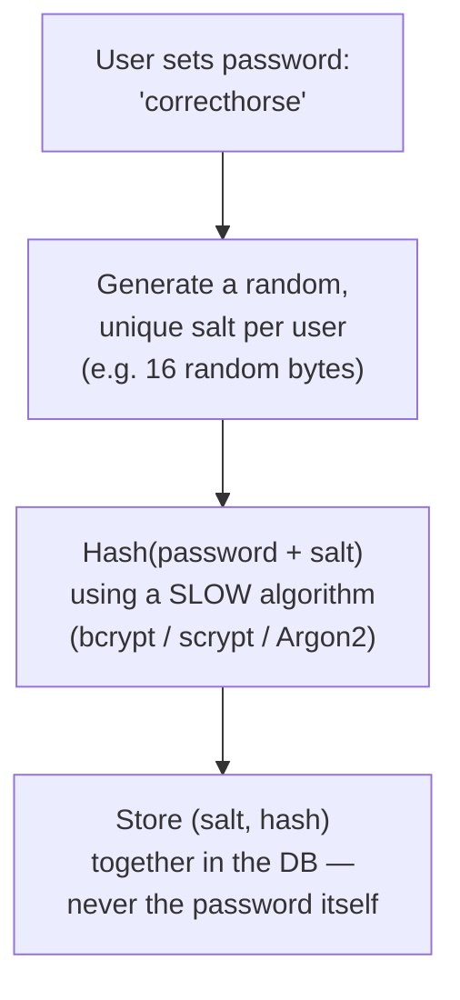

### What a Salt Actually Defeats

A salt is a random value, unique per user, stored right alongside the hash in plaintext — it isn't a secret, and it doesn't need to be. Its job is narrow and specific:

- **It kills precomputed rainbow tables.** A rainbow table is a precomputed mapping of common passwords to their hash under one specific algorithm — built once, reused against every stolen database that used that algorithm unsalted. A per-user salt means the attacker would need a separate precomputed table *per salt*, which is computationally the same as having no precomputed table at all.
- **It stops cross-user pattern matching.** Without a salt, two users who both chose `password123` produce the identical hash — instantly visible to anyone who steals the database, and a huge shortcut ("crack this one hash, silently compromise every account sharing it"). With unique salts, those two users produce two completely unrelated hashes, and the attacker has to attack every single one independently.

A salt does **not** make one individual password harder to brute-force in isolation — it makes attacking many stolen passwords at once far more expensive, by removing every shortcut that comes from repetition and precomputation.

### Why Work Factor Is the Other Half of the Story

Even salted, a **fast** hash is still the wrong tool. SHA-256 and MD5 were designed to be fast — that's exactly right for a file checksum, and exactly wrong for a password, because "fast to compute" is identical to "fast to brute-force." A modern GPU can compute billions of SHA-256 hashes per second; against an 8-character password drawn from a 95-character keyboard alphabet (roughly 6.6 × 10^15 possibilities), a GPU farm doing 10 billion hashes/second exhausts the entire space in under two weeks — and most real passwords are far weaker than a true random 8-character string, so the real number is much worse.

**bcrypt, scrypt, and Argon2** solve this by being deliberately, tunably slow:

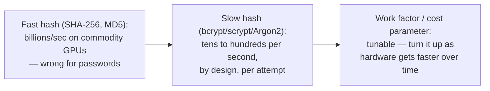

The **work factor** (bcrypt's cost parameter, or Argon2's time/memory/parallelism parameters) is a dial: raising it linearly slows down both a legitimate login *and* every brute-force attempt equally, and it can be increased years later as hardware improves, without changing the algorithm itself. scrypt and Argon2 go a step further and are **memory-hard** — they deliberately require a large, tunable amount of RAM per hash attempt, which specifically blunts the advantage GPUs and custom ASICs otherwise have (those chips are built for massive parallelism, not massive per-thread memory, so memory-hardness is a targeted defense, not a generic slowdown).

The trade-off is real and worth stating plainly: a higher work factor means slower logins and more CPU cost on your own servers too — tuning it is a genuine engineering decision (commonly targeting roughly 100–250ms per hash on production hardware), not a "set it to the maximum and forget it" setting.

---

## Chapter 3: Session-Based Authentication — Stateful, and Honest About It

Once a password (or any credential) is verified, the server needs a way to recognize the same client on every subsequent request without re-checking the password every time. The classic answer is a **session**: the server creates a record — user ID, login time, whatever else it needs — and stores it server-side, in memory or in a shared store like Redis, then hands the client back an **opaque session ID** as a cookie. Opaque means it carries no meaning by itself; it's just a lookup key.

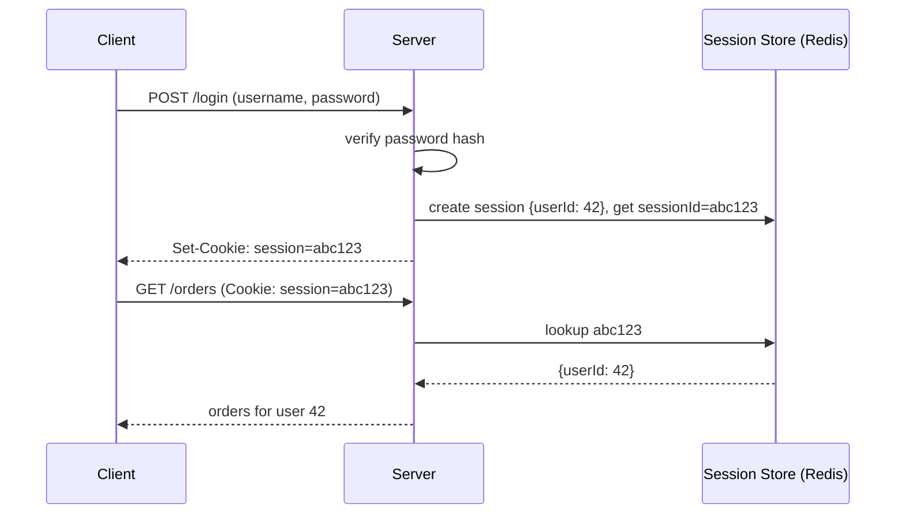

### Session Fixation — A Concrete Attack on This Flow

The vulnerable version of this flow has a subtle gap: if the server ever accepts a session ID the *client* supplies, rather than always minting a fresh one at login, an attacker can pre-plant a known session ID and wait for a victim to authenticate into it.

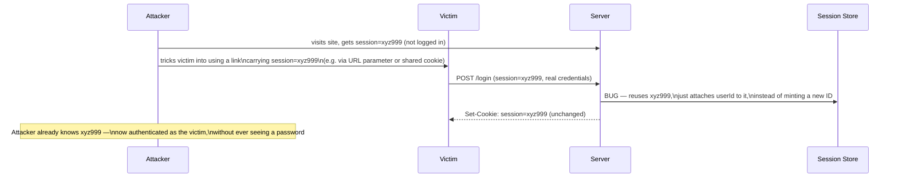

The victim did everything right — real credentials, legitimate login — and is compromised anyway, because the vulnerable server treated the pre-existing session ID as trustworthy simply because it already existed. **The fix is narrow and specific: regenerate the session ID at the exact moment authentication succeeds, and invalidate the old one.** Whatever ID the attacker planted stops being valid the instant the victim logs in, because the server never reuses a pre-login session ID for a post-login identity.

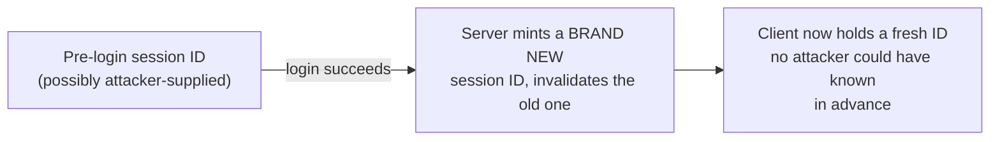

### The Cost This Approach Always Pays

A session store is, by definition, shared state that every service instance must consult on every request — precisely the kind of state `DistributedSystems/8_IdempotencyAndStatelessServices.md` spent its Chapter 6 arguing should be pushed out of application instances and into a small number of deliberately-engineered stores, rather than scattered around. Session-based auth doesn't violate that principle — Redis or a database *is* exactly the kind of centralized store that guide had in mind — but it does mean login state is never actually free: every authenticated request costs a lookup against that store, and losing the store (or a network partition to it) means losing the ability to authenticate anyone, cluster-wide, until it's reachable again.

---

## Chapter 4: Token-Based Authentication — Trading the Lookup for a Signature

The alternative is to make the credential **self-contained**: instead of an opaque ID that means nothing without a server-side lookup, issue a **token** that carries the claims directly (who the user is, what their role is, when it expires) and is cryptographically signed by the server. Verifying it means checking the signature — no database or Redis round trip required.

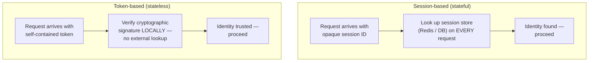

This is the same stateless-vs-stateful shape the previous series closed on, now applied to identity itself: a token-verifying service can be killed, replaced, or load-balanced to arbitrarily, exactly like the stateless instances in `DistributedSystems/8_IdempotencyAndStatelessServices.md`'s Chapter 5, because no instance needs to hold or reach a shared session record to answer "who is this." The trade-off, left deliberately unexplored here, is what it costs to give up that server-side lookup — namely, that a token can't be instantly revoked the way deleting a session record can, since the server never has to be asked again before the token's own expiry.

This guide stops at that conceptual level on purpose. The actual structure of a token — how its claims are encoded, how the signature is produced and verified, and how an entire third party (an identity provider) can issue one on an application's behalf — is substantial enough to be its own guide, next in this series: **OAuth2, OpenID Connect, and JWT**.

---

## Chapter 5: Authorization Models — RBAC vs. ABAC

Once identity is settled, the second question — what is this identity allowed to do — needs its own model. The two dominant approaches make very different bets about where permission logic should live.

### RBAC — Roles, Simple and Auditable

**Role-Based Access Control** assigns each user one or more **roles**, and each role a fixed set of **permissions**. A user's access is entirely determined by which roles they hold.

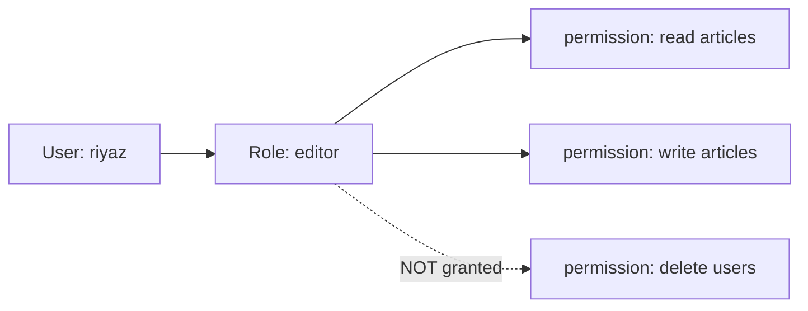

This is simple to reason about, simple to audit ("who can delete users? — everyone with the admin role, full stop"), and covers the large majority of real applications well.

### ABAC — Attributes, Evaluated by a Policy

**Attribute-Based Access Control** makes no fixed role-to-permission table at all. Instead, an access decision is computed at request time by evaluating a **policy** against three kinds of attributes: the **subject** (the user's department, clearance level, employment status), the **resource** (its owner, classification, department), and the **environment** (time of day, request location, device trust level). A dedicated **policy engine** — Open Policy Agent (OPA) is the common real-world example — evaluates the policy against whichever attributes are present on that specific request.

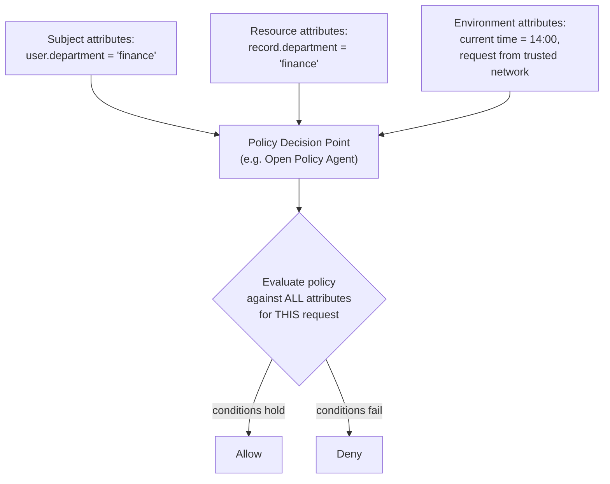

### Where Each One Genuinely Fails

**RBAC struggling with context:** consider "records can only be edited by staff in the same department as the record" or "admin actions are only allowed during business hours." RBAC has no way to express a relationship between a user's own attribute and the resource's attribute, or a condition on the current time — the only way to bolt it on is a role explosion: `finance-editor`, `hr-editor`, `legal-editor` per department, and separately `business-hours-admin` vs `after-hours-admin`, and then the cross product of both if you need them combined. The role table stops being "a handful of clear roles" and becomes a combinatorial mess that's genuinely hard to audit.

**ABAC expressing the same thing as one policy:**

```
allow if:
  user.department == resource.department
  and (action == "read" or (action == "write" and 9 <= now.hour < 17))
```

One rule, evaluated per request against whatever attributes happen to be present — no new role ever needs to be created as departments or business hours change.

**ABAC failing where RBAC is the better fit:** a small internal tool with three fixed permission levels (viewer, editor, admin) that never depend on department, time, or any other context gains nothing from a policy engine — it adds a new moving part (the engine itself), a new language to write and test policies in, and a per-request evaluation cost, all to solve contextual complexity that was never actually present. Reaching for ABAC because it sounds more sophisticated, rather than because a rule genuinely depends on runtime attributes, is trading real simplicity for imagined future flexibility.

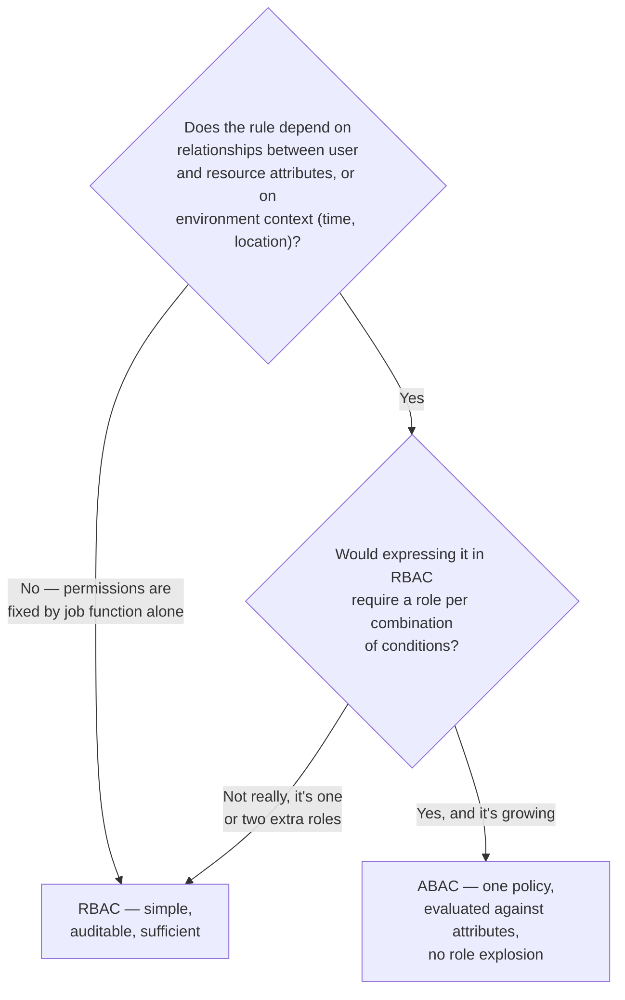

| | RBAC | ABAC |
|---|---|---|
| Decision basis | Fixed role → permission table | Policy evaluated against subject + resource + environment attributes |
| Simplicity | High — easy to read and audit | Lower — requires a policy engine and a policy language |
| Handles context (time, ownership, location) | Poorly — forces role explosion | Naturally — one policy expresses the condition |
| Auditability | "List everyone with role X" is trivial | Requires understanding the policy logic itself |
| Common real implementation | Roles/permissions tables in the app or DB | Open Policy Agent (Rego), AWS IAM policies |
| Best fit | Small-to-medium, mostly static permission sets | Large systems with genuinely contextual, relational rules |

---

## Chapter 6: The Real Costs

**Authentication and authorization checked at the wrong layer is worse than either checked slowly.** A perfectly hashed, perfectly salted password protects nothing if the endpoint serving order details never checks that the order belongs to the requester — Chapter 1's IDOR bug isn't a hashing problem or a session problem, it's a missing second question, and no amount of strengthening the first question fixes it.

**Statefulness bought with sessions is a real, ongoing cost, not a one-time design choice.** Every session-backed request pays a lookup, and losing the session store is losing the ability to authenticate anyone until it recovers — the same coordination cost `DistributedSystems/8_IdempotencyAndStatelessServices.md` flagged for any shared state a stateless fleet still depends on.

**Statelessness bought with tokens is paid back at revocation time.** A compromised or fired user's token-based access doesn't stop the instant an admin acts — it stops at the token's own expiry, unless the system pays for an additional revocation mechanism (a short-lived token plus a blocklist, effectively re-introducing some server-side state) — a trade-off the next guide picks up directly.

**ABAC's flexibility is not free flexibility.** A policy engine is a new component to run, monitor, and test — and a wrong policy is a silent, systemic authorization bug, not a single endpoint's bug, because every request now runs through the same shared decision logic.

---

## The Full Story, End to End

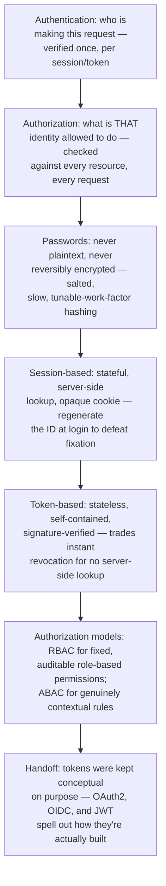

| | Session-Based Auth | Token-Based Auth |
|---|---|---|
| State location | Server-side store (memory/Redis) | Self-contained in the token itself |
| Per-request cost | Lookup against the session store | Local signature verification only |
| Scales like | The stateful stores earlier series warned about | The stateless fleet those series aimed for |
| Revocation | Instant — delete the session record | Only at token expiry, unless extra machinery is added |
| Fixation risk | Real — mitigated by regenerating the ID at login | Not applicable — no server-issued ID to fixate on |

**Where would you like to go next?** Natural next threads from here:

- **OAuth2, OpenID Connect & JWT** — delegating authentication to a third-party identity provider, and the actual structure of a signed token that carries claims, both left deliberately unopened in this guide
- **Encryption fundamentals** — protecting data at rest and in transit, the layer beneath both authentication and authorization
