## The Story of OAuth2, OpenID Connect & JWT

`SecurityAndCompliance/1_AuthenticationAndAuthorization.md` ended with the mechanics of proving identity to a system you have an account with — passwords, sessions, RBAC and ABAC deciding what you're allowed to do once you're in. All of that assumes one relationship: a user and the one service they're logging into directly. This guide starts from a different, harder problem that relationship can't solve at all.

Say a third-party app — a photo printing service — wants to read your Google Contacts so it can suggest people to send prints to. The naive answer is: type your Google username and password into the printing app, and let it log in to Google as you. That's a disaster waiting to happen. The printing app now holds your actual Google password, forever, with no way for you to limit what it can do with it, no way to revoke access without changing your password everywhere else you use it, and no way to know if it's storing that password securely at all. Handing over a password isn't delegation — it's an unconditional surrender of the entire account, contacts included, to read your email, buy things, delete your files. This guide is about the protocol built specifically to make that unnecessary: letting one app act on your behalf, for a specific purpose, without your password ever leaving Google's servers.

---

## Interview Cheat Sheet

**OAuth2** is a delegated-authorization framework: it lets a user grant a third-party application limited access to their data on another service, without ever sharing their password with that application. **OpenID Connect (OIDC)** is a thin identity layer built on top of OAuth2 that adds actual *authentication* (proving who the user is), which plain OAuth2 was never designed to do. A **JWT** (JSON Web Token) is the compact, self-contained token format both commonly use to carry that information.

**Key facts:**
- OAuth2 has four roles: the **Resource Owner** (the user), the **Client** (the third-party app), the **Authorization Server** (issues tokens, e.g. Google's login servers), and the **Resource Server** (holds the data, e.g. the Google Contacts API) — mixing these up is the most common source of confusion in interviews
- The **Authorization Code flow with PKCE** is the modern, universally recommended flow for any client that can't keep a secret confidentially (mobile apps, single-page apps) — and, as of OAuth 2.1, is recommended for confidential (server-side) clients too
- A **JWT** is `header.payload.signature`, each part base64url-**encoded**, not encrypted — anyone who intercepts a JWT can read every claim inside it; only the signature is cryptographically protected
- **OIDC's ID Token** is the actual authentication artifact — a JWT asserting "this user, identified by `sub`, authenticated at this time" — separate from the OAuth2 **access token**, which only grants API access and says nothing about identity

**Common interview gotchas:**
- "OAuth2 is for login" is technically wrong — OAuth2 alone only proves the client has *authorization* to call an API on the user's behalf; it was never designed to tell the client *who* the user is, which is exactly the gap OIDC closes
- A JWT's signature proves the token wasn't tampered with and was issued by whoever holds the signing key — it does **not** make the payload secret; never put a password, SSN, or anything you wouldn't paste into a public URL inside a JWT payload
- HS256 uses one shared secret to both sign and verify — fine when only one party (the auth server) both issues and checks tokens, but wrong for microservices, because any service that can *verify* a token with that shared secret can also *forge* one
- Stateless tokens can't be revoked server-side the way a session cookie can (Guide 1's session store has no equivalent here) — the real fix is short-lived access tokens plus refresh token rotation, not "just revoke it"

**The core trade-off:** OAuth2/JWT trade the simplicity of a single password-based login for a system where access is scoped, delegated, and independently verifiable across many services — at the cost of real complexity (four roles, several similar-looking flows, tokens that can't be un-issued) and a token format that is verifiable everywhere but readable everywhere too.

---

## Chapter 1: The Problem, and the Four Roles

The photo-printing example has exactly four participants, and OAuth2 names each one precisely because keeping them straight is what makes the rest of the protocol readable.

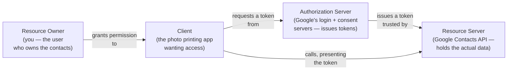

The goal, precisely: the Client gets a **token** — not a password — that the Resource Server will accept as proof of "this specific app is allowed to do these specific things, on this specific user's behalf, for a limited time." The Resource Owner's actual credentials never leave the Authorization Server. If the printing app is compromised tomorrow, the fix is revoking one token, not resetting your Google password everywhere it's reused.

This is the fundamental shift from Guide 1: that guide's sessions and RBAC answer "is this the right user, and what can they do" for one first-party service talking to itself. OAuth2 answers a structurally different question — "can this *other* app act on the user's behalf, and how much" — and it needs an extra hop and an extra role (the Authorization Server, separate from the Resource Server) to answer it safely.

---

## Chapter 2: The Authorization Code Flow with PKCE

This is the flow to reach for by default. It's built around one central idea: the browser (where a user interacts and where things are most exposed to snooping and malicious redirects) only ever sees a short-lived, single-use **authorization code** — never the actual access token. The token itself is fetched later, over a direct, back-channel request the browser never touches.

Public clients — mobile apps and single-page apps — have an extra problem on top of that: they can't hold a secret. Anything embedded in an app's binary or its JavaScript bundle can be extracted by anyone who downloads the app. **PKCE** (Proof Key for Code Exchange, pronounced "pixy") exists specifically to secure the code exchange for exactly these clients, without requiring a secret they can't actually keep secret.

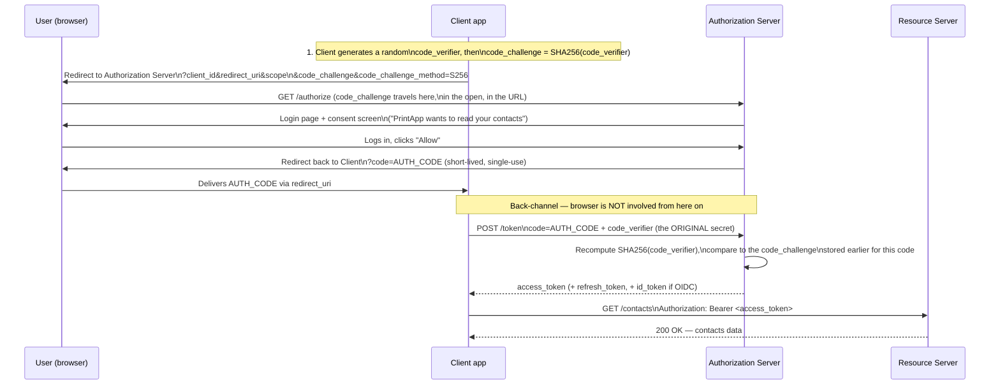

**Why PKCE specifically defeats authorization-code interception.** The `code_challenge` sent up front is a one-way hash of a secret (`code_verifier`) the client generated and never transmits until the very last, back-channel step. If a malicious app on the same mobile device registers the same custom URL scheme and intercepts the redirect carrying `code=AUTH_CODE` (a real, documented attack against public clients before PKCE existed), that attacker gets the authorization code — but not the `code_verifier`, which only ever lived inside the legitimate client and was never sent anywhere until the final exchange. The Authorization Server will only trade the code for a token if the presented `code_verifier` hashes to the exact `code_challenge` recorded when that code was issued. An intercepted code, without the matching verifier, is worthless. This is the whole mechanism: bind the code to a secret established before the redirect, so intercepting the code in transit doesn't hand over anything usable.

---

## Chapter 3: The Implicit Flow — Why It's Deprecated

Before PKCE was standardized, single-page apps used the **Implicit flow**: skip the authorization-code step entirely and have the Authorization Server redirect straight back with the **access token itself** in the URL fragment.

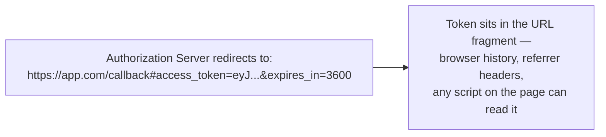

Two structural problems killed it. First, the token is exposed directly in the URL, which routinely ends up in browser history, server logs (if any redirect hop uses the fragment as a query string by mistake), and is readable by any JavaScript running on the page — a much larger exposure surface than a short-lived, single-use code. Second, there was no client authentication step at all in the exchange — nothing analogous to PKCE's `code_verifier` binds the token to the specific app instance that started the flow, making it easier to intercept and replay. Modern guidance (and OAuth 2.1) drops the Implicit flow entirely in favor of Authorization Code + PKCE even for public clients, since PKCE gives an equivalent security property without ever putting the token in a URL.

---

## Chapter 4: Client Credentials Flow — No User Involved

Not every token exchange has a human in it. When one backend service needs to call another API on its own behalf — a billing microservice calling an inventory API on a schedule, say — there is no Resource Owner to redirect or ask for consent. The **Client Credentials flow** covers exactly this machine-to-machine case: it's just the Client authenticating directly to the Authorization Server with its own credentials.

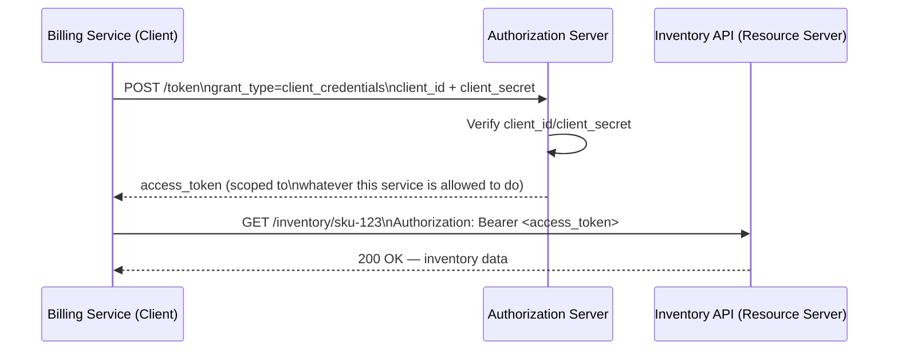

No browser redirect, no login screen, no refresh token (there's no user session to keep alive — the service just requests a fresh token again when the old one expires, using the same client credentials it already holds securely on the backend).

---

## Chapter 5: OpenID Connect — Adding Authentication on Top

Here's the gap worth stating precisely: an OAuth2 access token proves "this client is authorized to call this API with these scopes." It says **nothing** about who the user is, or even that a human was involved at all (Chapter 4 has no user in it whatsoever). Plenty of early systems bolted authentication onto OAuth2 anyway, informally, by treating "I got an access token" as "the user logged in" — and it worked just often enough to cause real security bugs, because an access token issued for one purpose (reading contacts) could sometimes be replayed to falsely claim identity somewhere else.

**OpenID Connect (OIDC)** closes this gap cleanly by adding one specific new artifact to the same Authorization Code flow: the **ID Token**.

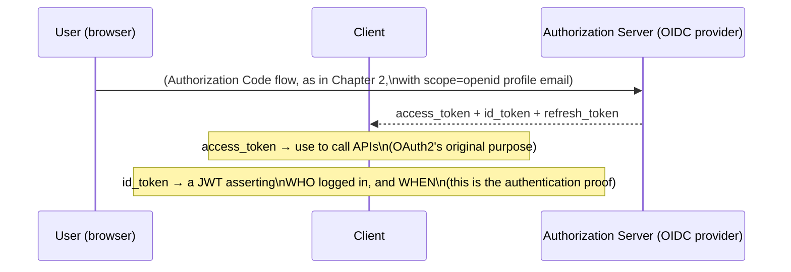

The ID Token is always a JWT, always signed, and carries claims specifically about the authentication event: `sub` (the user's stable unique identifier), `iss` (who issued it), `aud` (which client it's for), `iat`/`exp` (when the user authenticated and when this assertion expires), and often `email`/`name` if the `profile`/`email` scopes were requested. The Client reads and verifies the ID Token once, right after login, to establish "this user is now signed in" — this is the piece that makes "Sign in with Google" actually authentication, not just a slightly indirect authorization request. The access token remains purely about calling APIs; the ID Token is the one built to answer "who is this."

---

## Chapter 6: JWT Internals — What's Actually Inside

A JWT is a compact, URL-safe string made of exactly three parts joined by dots: `header.payload.signature`. It's worth decoding one by hand once, because the format hides a fact that trips up almost everyone the first time: **only the signature is cryptographically protected — the header and payload are just base64url-encoded, which is not encryption and is trivially reversible by anyone.**

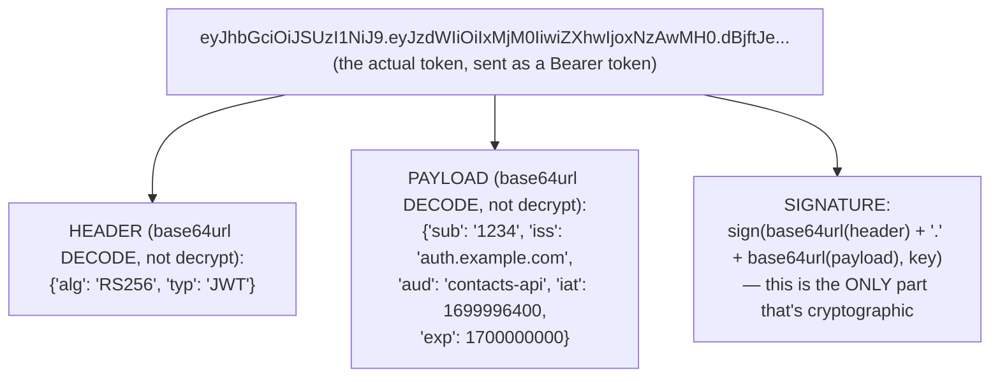

Concretely: paste any real JWT's first two dot-separated segments into a plain base64 decoder — no key, no secret, nothing — and you get readable JSON straight back. This is why the golden rule of JWTs is unconditional: **never put anything in the payload you wouldn't be comfortable appearing in a plaintext URL or an unencrypted log line** — no passwords, no SSNs, no raw credit card numbers, nothing confidential. The signature guarantees the payload wasn't *altered* since it was issued (and, depending on the algorithm, who issued it) — it guarantees nothing about who else can *read* it.

**The standard claims worth knowing by name:**
- `iss` (issuer) — who created and signed the token
- `sub` (subject) — the unique identifier this token is about, usually the user
- `aud` (audience) — who the token is intended for; a resource server should reject a token whose `aud` isn't itself, even if the signature is otherwise perfectly valid
- `exp` (expiration) — a Unix timestamp after which the token must be rejected outright, no matter how valid the signature is
- `iat` (issued at) — when the token was minted, useful for auditing and for capping how old a token is allowed to be even before `exp`

### HS256 vs. RS256 — Who Can Sign, Who Can Verify

The `alg` field in the header names the signing algorithm, and the choice between the two most common ones has a real architectural consequence.

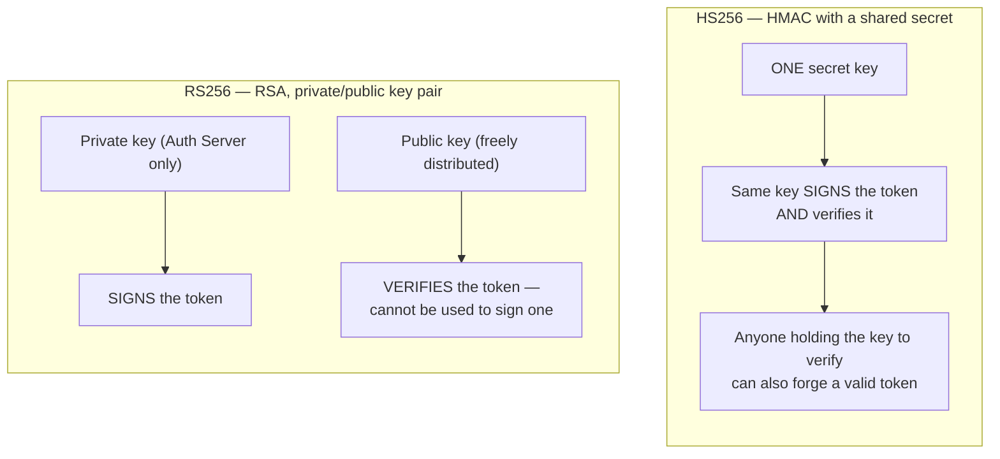

HS256 is fine, and simpler, when exactly one party ever needs to both mint and check tokens — a single monolithic app checking its own tokens, say. It falls apart the moment more than one service needs to verify tokens independently, which is the normal case in a microservices architecture: distributing the same HMAC secret to every service that needs to verify a token also hands every one of those services the ability to mint tokens themselves, since signing and verifying use the identical key. Compromise any one service, and the attacker can forge tokens claiming to be anyone.

RS256 removes that risk by splitting the key: the Authorization Server alone holds the **private** key and is the only party on earth that can mint a validly-signed token. Every Resource Server gets only the **public** key (often fetched automatically from a well-known JWKS endpoint the Authorization Server publishes) — enough to verify a signature, but mathematically useless for creating one. This is exactly why RS256 (or its elliptic-curve cousin, ES256) is the standard choice for any system with more than one service verifying tokens: it lets you distribute verification everywhere, while keeping the power to mint tokens in exactly one place.

### Stateless Verification — the Whole Point

Once a Resource Server has the Authorization Server's public key, verifying a token is a purely local operation — no network call back to the Authorization Server required, for every single request.

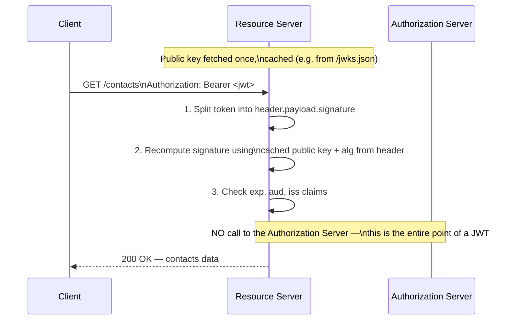

This is what makes JWTs attractive at scale: a session-token model (Guide 1's session store) requires every single request to check a shared, centralized store — a network hop and a shared point of load and failure for every service, on every request. A JWT lets any of a hundred microservices verify a token entirely on its own, using nothing but a locally cached public key, with zero calls back to the Authorization Server. The cost of that convenience is the entire subject of the next chapter.

---

## Chapter 7: The Real Cost — You Can't Revoke What You Never Stored

Chapter 6 ended with the whole point of a JWT: no lookup, no shared state, pure local verification. That same property is also the token's biggest liability. If a JWT is stolen — leaked in a log, intercepted, exfiltrated from a compromised client — there is no server-side session row to delete, no shared state to flip, nothing to revoke. The token remains fully valid, to every service that checks it, for every second up until its `exp` claim says otherwise. Stateless verification and "instantly revocable" are directly in tension, by construction.

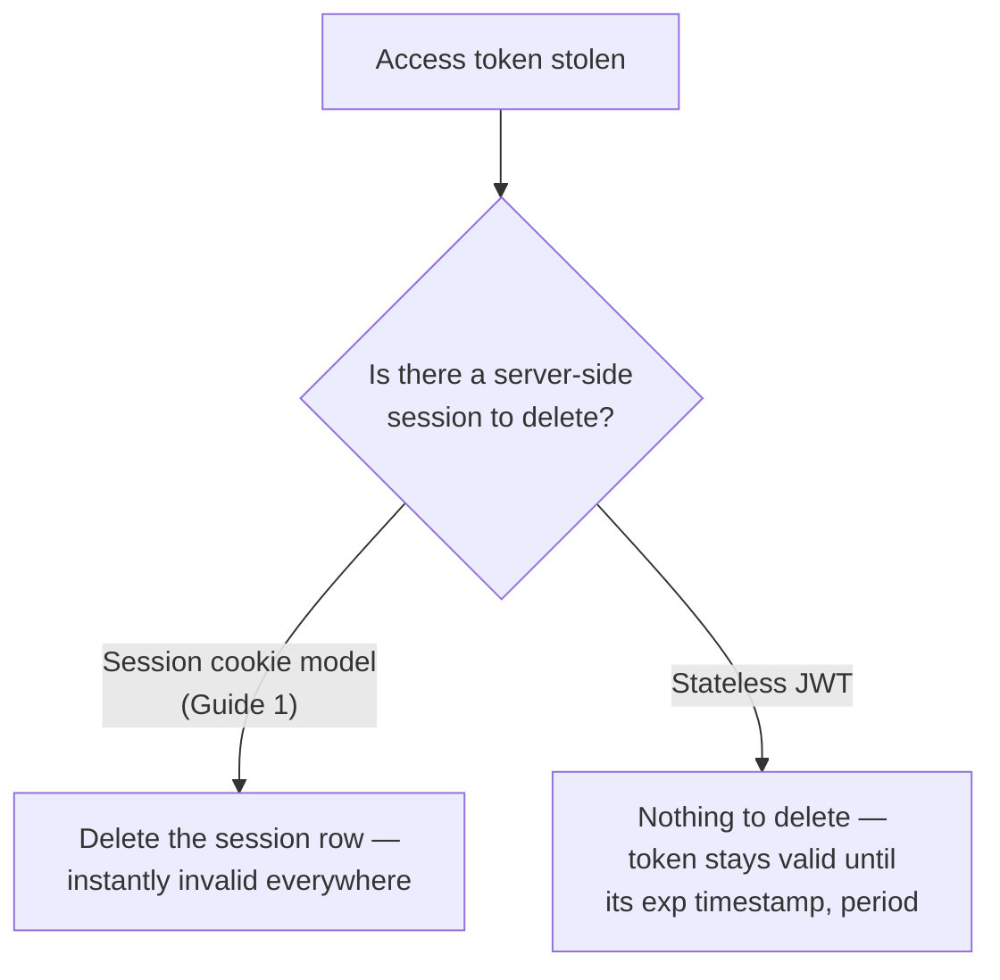

The practical, universally-used fix has two parts working together:

**Short-lived access tokens.** Issue access tokens with an `exp` of minutes, not days — commonly 5 to 15 minutes. A stolen token is only useful to an attacker for that narrow window, which shrinks the blast radius of a leak from "until someone notices" down to "at most a few minutes."

**Longer-lived refresh tokens, with rotation.** Since forcing a user to log in again every 10 minutes is unusable, the Client also receives a longer-lived **refresh token** (hours to weeks), used only to silently request a new access token from the Authorization Server once the old one expires — never sent to a Resource Server directly. **Refresh token rotation** closes the remaining gap: every time a refresh token is used, the Authorization Server issues a brand-new refresh token and immediately invalidates the one just used.

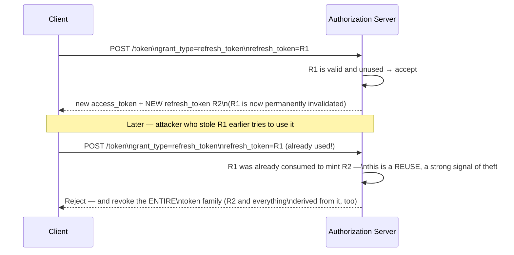

This is what makes a stolen-and-reused refresh token detectable rather than silently exploitable: a refresh token is single-use by design, so if it's ever presented a second time, the Authorization Server knows for certain that either the legitimate client or an attacker is holding a stale, already-superseded copy — and the safe response is to assume the worst and revoke the whole chain of tokens descended from it, forcing a fresh login. Short-lived access tokens bound the damage from an access-token leak; refresh token rotation turns a refresh-token leak from invisible into detectable.

---

## Chapter 8: Flows and Algorithms, Side by Side

| | Authorization Code + PKCE | Implicit (deprecated) | Client Credentials |
|---|---|---|---|
| User involved | Yes | Yes | No |
| Best for | Mobile apps, SPAs, server-side web apps | Nothing — deprecated | Machine-to-machine (service-to-service) |
| Token exposed in URL? | No — only a short-lived code | Yes — access token in the fragment | No user redirect at all |
| Client authentication | PKCE `code_verifier` binds the exchange | None | `client_id` + `client_secret` |
| Refresh token issued? | Yes, typically | No | Not usually — reissues on demand |

| | HS256 (HMAC) | RS256 (RSA) |
|---|---|---|
| Key model | One shared secret | Private/public key pair |
| Who can sign | Anyone holding the shared secret | Only the holder of the private key |
| Who can verify | Anyone holding the shared secret | Anyone with the public key |
| Verify = can also forge? | Yes — same key does both | No — public key can't sign |
| Right for | Single service issuing and checking its own tokens | Microservices — many verifiers, one issuer |

---

## The Full Story, End to End

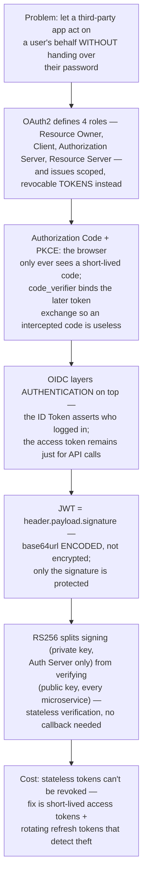

| | Session cookies (Guide 1) | JWT access tokens |
|---|---|---|
| Where state lives | Server-side session store | Nowhere — the token itself is the state |
| Verification cost | A lookup, every request | Local signature check, every request |
| Revocation | Instant — delete the session row | Not possible before `exp`; mitigated by short lifetimes + rotation |
| Scales across services | Needs a shared session store | Any service with the public key verifies independently |
| Payload confidentiality | N/A — server holds the real data | None — anyone can decode and read the payload |

**Where would you like to go next?** Natural threads from here:

- **API Security** — using JWTs as bearer tokens is only one piece of how services actually authenticate calls day-to-day; the next guide covers API keys, HMAC request signing, and mTLS as the other tools in that same toolbox
