## The Story of API Security

The previous guide worked out how to establish *identity* — a user proves who they are through an OAuth2 flow, walks away with an ID token and an access token, and that access token (typically a JWT) rides along as a bearer credential on every subsequent API call. But that guide closed on an honest admission: a bearer token is only one piece of how services actually authenticate the millions of individual API calls flying between browsers, mobile apps, third-party integrations, and internal services every single day. A user logs in once. Then what? Every one of the next ten thousand requests — some from that user's phone, some from a partner's server calling the bookstore's public API, some from the Orders service calling the Payments service internally — needs its own answer to two separate questions: *who is actually making this specific call*, and *has this specific request been tampered with in flight*. This guide is about the mechanisms that answer both questions, call by call.

---

## Interview Cheat Sheet

**API security**, at the request level, is the set of mechanisms that let a server verify two things about every incoming call: the identity of the caller (a human user, a third-party app, or another internal service) and the integrity of the request itself (that it wasn't altered or replayed after it left the caller). Four distinct mechanisms cover almost every real case: **API keys**, **HMAC request signing**, **bearer tokens (JWTs)**, and **mTLS**.

**Key facts:**
- An **API key** is just a long random secret sent in a header (`X-API-Key` or similar) — it identifies *which caller* is making a request (for attribution, quotas, and rate limits), it does **not** authenticate a human user, and it carries no built-in expiry or scope
- **HMAC request signing** (the model AWS SigV4 uses) never sends the shared secret itself over the wire — the client uses the secret to compute a signature *over* the request, and the server recomputes the same signature independently to verify it matches
- A signed request that includes a **timestamp** in the signed payload defeats replay attacks: the server rejects any request signed more than a few minutes ago, so a captured request becomes useless once its window closes
- **mTLS** gives both sides of a connection strong cryptographic identity, verified at the transport layer, before a single byte of the application-level request is even read — this is the same mTLS mechanism `NetworkingAndCommunication/2_TLSAndEncryption.md`'s Chapter 7 covers in full
- An **API Gateway** (`NetworkingAndCommunication/6_APIGatewayAndReverseProxy.md`) is where all four of these mechanisms typically get *enforced* in practice — once, at the edge — instead of every backend service reimplementing key validation, signature verification, or JWT parsing itself

**Common interview gotchas:**
- "We use an API key" is not an answer to "how do you authenticate users" — a key identifies a *caller* (an app, a partner, a service account), not an individual end user; conflating the two is a common interview slip
- A shared secret sent as a plain header value (unlike HMAC signing) is only as safe as every log file, proxy, and browser history it ever passes through — if it's ever logged, cached, or committed to a git repo, it's compromised permanently until manually rotated
- mTLS authenticates the *connection*, not necessarily each individual request on it — a compromised process on an authenticated connection can still send whatever it wants over that same channel, which is why mTLS is usually paired with, not a replacement for, application-level authorization
- HMAC signing does not encrypt the request — an eavesdropper can still read the body in plaintext (that's TLS's job); signing only proves the body wasn't *changed* and that it came from someone who holds the shared secret

**The core trade-off:** every mechanism in this guide trades operational simplicity against blast radius when something leaks — a bare API key is trivial to issue and trivial to compromise permanently; mTLS is the most resistant to compromise but the most expensive to operate at scale, with HMAC signing and JWTs occupying the middle ground.

---

## Chapter 1: API Keys — A Long Random Secret, Nothing More

The simplest possible answer to "how does this API call identify its caller" is an **API key**: the server issues a long, random string when a caller signs up for API access, and the caller includes it on every request, usually in a header.

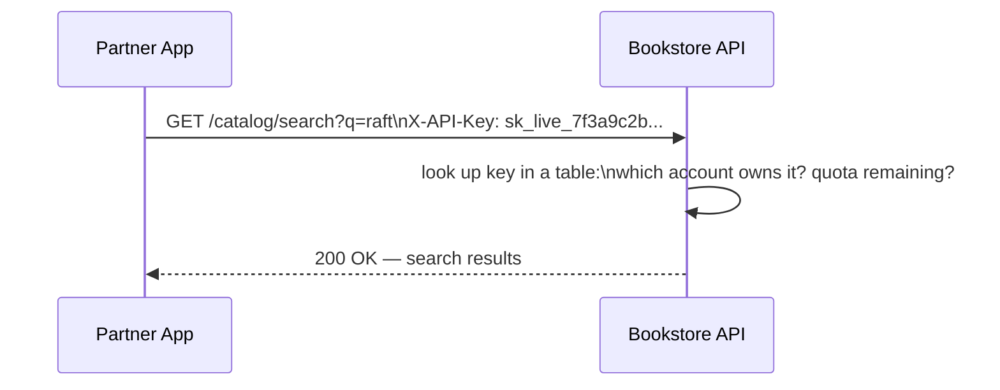

That's the entire mechanism. There's no handshake, no cryptography beyond generating a sufficiently random string, and no session. This simplicity is exactly why API keys are still everywhere — issuing one is a single database insert, and checking one is a single lookup.

### What API keys are actually good for

An API key answers exactly one question well: **which registered caller is this request coming from?** That's genuinely useful for a specific, narrow set of jobs:

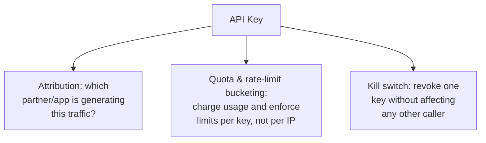

A weather API that gives every registered developer a key isn't trying to authenticate a *person* — it's tracking which app is responsible for which volume of traffic, so it can bill correctly and throttle abusive callers without throttling everyone else.

### What API keys are bad at

The list of what a bare API key does *not* give you is longer, and it's the actual reason this guide keeps going instead of stopping here:

- **No built-in expiry.** A key issued in 2019 is, by default, valid forever — unless the issuing service builds its own separate expiry and rotation logic on top, which many don't bother to.
- **No scoping.** A single key is typically all-or-nothing: whoever holds it can call every endpoint the associated account can reach, not just the one endpoint they actually need.
- **No proof of an individual user.** A key identifies the *calling application*, not which of that application's end users triggered the call — if you need "which human did this," a key alone can't answer it.
- **It travels as a plain, static secret.** The same string is sent, unencrypted at the application layer, on every single request. If it ever ends up in a server access log, a browser's network tab, a support ticket screenshot, or — famously and often — committed straight into a public GitHub repo, whoever finds it has full access, indistinguishable from the legitimate caller, until someone notices and revokes it.

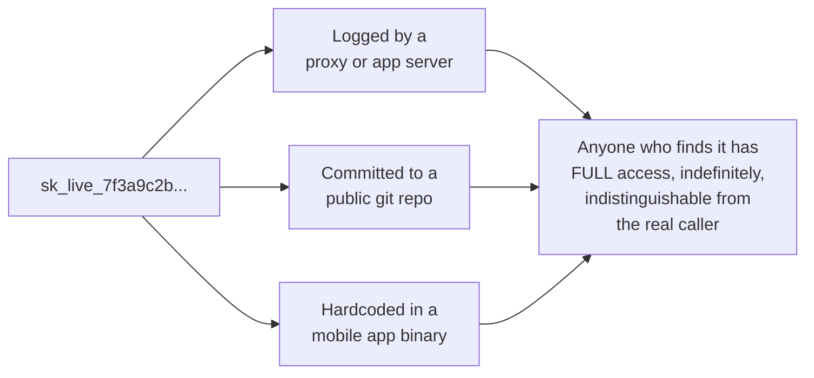

This is not a hypothetical — leaked API keys sitting in public git history are one of the single most common findings in real security scans, precisely because the key is a static string with no expiry pressuring anyone to rotate it. An API key is the right tool for attribution and quota; it is the wrong tool for anything that needs real authentication strength.

---

## Chapter 2: HMAC Request Signing — Proving the Secret Without Sending It

The next mechanism fixes the most dangerous property of a bare API key: the secret itself never has to travel over the wire at all. This is the model **AWS SigV4** uses for every single call to an AWS API, and it's a general pattern worth understanding on its own terms.

### The core idea

Both the client and the server hold the same shared secret key, established once, out of band (much like an API key is issued once). But instead of sending that secret on every request, the client uses it to compute a **signature** — an HMAC (Hash-based Message Authentication Code) over a canonical, deterministic representation of the request itself: the HTTP method, the path, the body, and a timestamp.

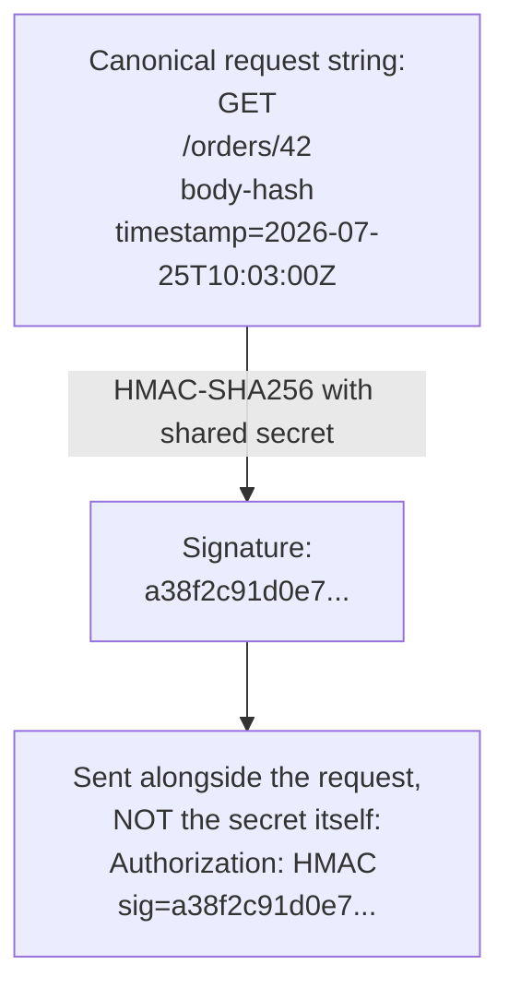

The server, holding the same shared secret, performs the exact same computation over the request it actually received and checks whether its own signature matches the one the client sent. If even one byte of the method, path, body, or timestamp differs from what the client originally signed, the recomputed signature won't match, and the server rejects the request.

### The full exchange

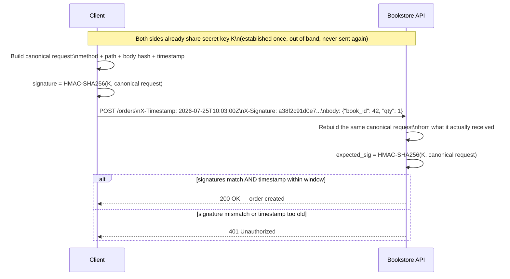

### Why this concretely beats sending a plain shared secret

Two properties fall directly out of this design, and both matter for reasons that are easy to state precisely rather than hand-wave:

**The secret itself never crosses the network, ever, on any request.** Compare this to a plain API key or a raw shared password sent in a header: that string travels, in the clear at the application layer, on every single call, meaning it appears in every proxy log, every browser dev tools panel, every place the request passes through. With HMAC signing, only the *signature* — a one-way function of the secret and the request — ever travels. Even a full packet capture of every request this client has ever sent gives an attacker zero material to derive the secret itself from; HMAC is specifically designed so that recovering the key from any number of (message, signature) pairs is computationally infeasible.

**The timestamp inside the signed payload defeats replay attacks.** Because the timestamp is *part of what gets signed*, an attacker can't strip it out or swap in a new one without invalidating the whole signature. So even if that attacker captures a complete, validly-signed request off the wire, replaying it later fails the moment the server checks the timestamp against an allowed window (commonly ±5 minutes): the signature is still mathematically valid, but the server enforces a separate rule — reject anything outside the freshness window — that a pure replay can never satisfy no matter how perfectly the bytes were copied.

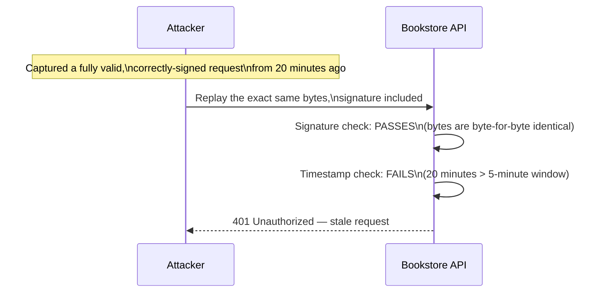

And because the body itself is part of the canonical, signed string, tampering with it in flight — changing the quantity, the price, the recipient — invalidates the signature immediately, giving HMAC signing the tamper-detection an API key never had. The trade-off is operational: both sides need to implement the exact same canonicalization logic (which fields, in which order, hashed how), and a subtle mismatch between client and server canonicalization is a real, recurring source of "valid requests getting rejected" bugs in practice.

---

## Chapter 3: Bearer Tokens (JWTs) — A Different Trade-off Entirely

The previous guide covered how an OAuth2 flow ends with the client holding a JWT access token, and how that token gets attached to API calls as a **bearer token** — literally, an `Authorization: Bearer <token>` header. It's worth placing that mechanism side by side with the two above, because all three solve overlapping problems in genuinely different ways.

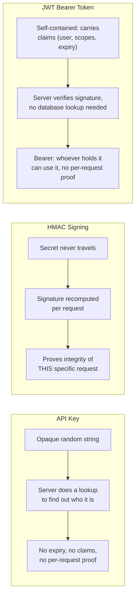

A JWT's defining property, from the previous guide, is that it's **self-contained** — it carries its own claims (who this is, what scopes they have, when it expires) signed by the issuer, so any service that trusts the issuer's public key can verify it locally, with no database round trip. That's a real advantage over an opaque API key, which requires a lookup on every single call to find out anything about who it belongs to.

But a JWT is still a **bearer** credential in exactly the same sense a plain API key is: it's presented as-is, and possession alone is sufficient — nothing about the request itself is being re-proven the way an HMAC signature proves per-request integrity. If a JWT leaks (logged, intercepted, stolen from client storage), an attacker can replay it for anything within its (hopefully short) expiry window, and it carries no protection against the request body being altered in flight beyond whatever TLS itself provides.

So the three mechanisms this far actually split into two different axes: **opaque vs. self-contained** (API key vs. JWT — does the server need a lookup, or can it verify locally) and **bearer vs. signed-per-request** (API key and JWT are both bearer credentials; HMAC signing re-proves the specific request every single time). JWTs win on statelessness and rich claims; HMAC signing wins on tamper-evidence and replay resistance; API keys win on sheer operational simplicity. None of the three is strictly better — they answer different questions.

---

## Chapter 4: mTLS — Identity at the Transport Layer, Before the Request Is Even Read

Every mechanism so far operates at the **application** layer — a header the server has to parse before it can decide whether to trust the request. **mTLS** (mutual TLS) moves identity verification down a layer entirely: both the client and server present X.509 certificates and verify each other during the TLS handshake itself, before a single byte of the HTTP request is exchanged. The full mechanics of that handshake — the certificate chain of trust, why both sides verify instead of just one — are covered in depth in `NetworkingAndCommunication/2_TLSAndEncryption.md`'s Chapter 7; this guide picks up specifically at *why* it's the mechanism of choice for internal service-to-service API calls.

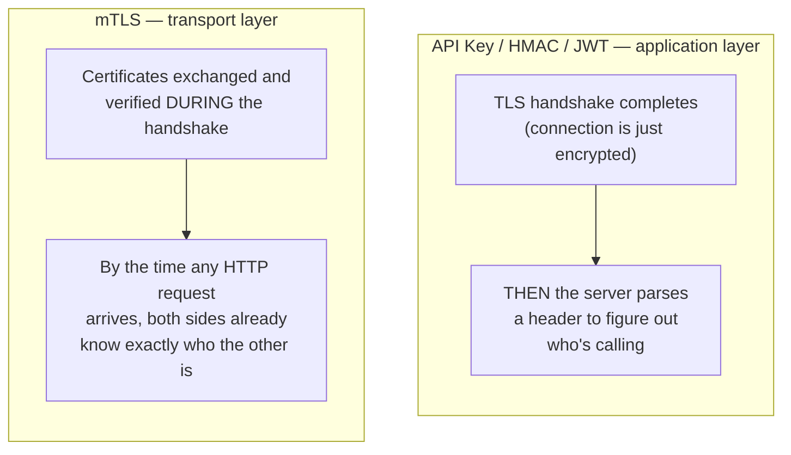

Three concrete reasons this is specifically attractive for internal, service-to-service traffic — not for a public API with anonymous third-party callers:

**Both sides get strong cryptographic identity, not a string comparison.** A certificate is backed by a private key that never leaves the service that holds it, verified against an internal certificate authority, the same chain-of-trust mechanism `NetworkingAndCommunication/2_TLSAndEncryption.md` covers for public web certificates, just run against a private internal CA instead of a public one. Forging it requires compromising a private key, not guessing or leaking a string.

**There's no shared secret sitting in a config file waiting to leak.** An API key or an HMAC shared secret is a piece of static data that has to be distributed to both sides and stored somewhere — an environment variable, a secrets manager, a config map — and every one of those storage locations is a place it can leak from. A certificate's private key is generated on the service that uses it and, in a well-run setup, never needs to be copied anywhere else at all.

**It pairs naturally with short-lived, automatically rotated certificates.** Because verifying a certificate doesn't require the client to remember a long-lived secret — just to present whatever current, valid certificate it was issued — internal mTLS setups commonly issue certificates that live for hours, not years, and rotate silently in the background. A leaked short-lived certificate is only useful for the small remaining window before it expires anyway, which sharply limits the blast radius compared to a leaked API key that's valid indefinitely until someone notices and manually revokes it.

The trade-off, matching what `NetworkingAndCommunication/2_TLSAndEncryption.md`'s Chapter 8 already lays out for TLS generally: running an internal CA, issuing and rotating certificates for every service, and handling the failure modes when a rotation goes wrong is real, ongoing operational work — which is exactly why mTLS shows up as infrastructure (a service mesh sidecar handling it transparently) far more often than as something every service team hand-rolls itself.

---

## Chapter 5: The API Gateway — Where All Four Actually Get Enforced

Every mechanism in this guide has the same weak point if left to each backend service individually: if the Catalog service checks API keys one way, the Orders service checks them slightly differently, and the Payments service forgets to check the timestamp window on HMAC signatures, the system's real security posture is only as strong as its most carelessly implemented service. `NetworkingAndCommunication/6_APIGatewayAndReverseProxy.md` already established the fix for this shape of problem in general — push a cross-cutting concern to one place at the edge instead of every backend service reimplementing it — and authentication is one of the clearest cases where that pays off.

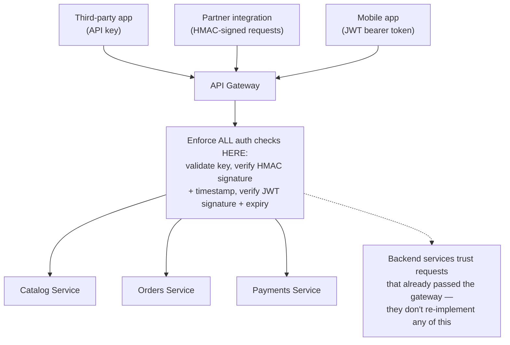

Concretely, the gateway becomes the single place that:

- Looks up and validates API keys, enforces per-key rate limits, and can revoke one key without touching any backend service's code
- Recomputes and checks HMAC signatures and timestamp windows, rejecting stale or tampered requests before they ever reach a backend
- Verifies a JWT's signature against the issuer's public key and checks its expiry and scopes, so backend services can trust an already-validated identity (often re-injected as a simple internal header) instead of re-parsing and re-verifying the token themselves

Traffic *behind* the gateway — service to service — is exactly where Chapter 4's mTLS typically takes over: the gateway authenticates the outside world coming in, and mTLS (often via the sidecar mesh pattern `NetworkingAndCommunication/6_APIGatewayAndReverseProxy.md`'s Chapter 6 gestures at) authenticates traffic moving between internal services once it's already inside. The gateway doesn't replace the need for backend services to still do their own authorization (does *this* caller have permission for *this specific* resource) — but it removes the far more error-prone, easy-to-get-subtly-wrong work of authentication itself from every team's individual codebase.

---

## Chapter 6: The Four Mechanisms, Side by Side

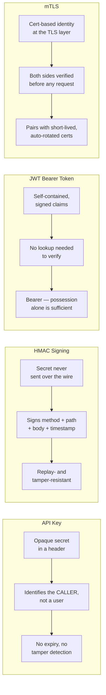

| | API Key | HMAC Signing | JWT Bearer Token | mTLS |
|---|---|---|---|---|
| What travels over the wire | The secret itself, every request | Only a signature, never the secret | The token itself, every request | Only a certificate (public), never the private key |
| Proves per-request integrity | No | Yes — body/path/method are signed | No (relies entirely on TLS for that) | No (proves connection identity, not request integrity) |
| Built-in expiry | No, unless built separately | Timestamp window only | Yes — `exp` claim | Yes — short-lived certs are common |
| Needs a server-side lookup to verify | Yes (which account owns this key) | Yes (which secret to recompute with) | No — verified via issuer's public key | No — verified via the CA chain |
| Best fit | Third-party API attribution, quotas | Programmatic API clients, cloud APIs (SigV4) | User/app sessions after OAuth2 login | Internal service-to-service calls |
| Blast radius if leaked | Full, indefinite access until revoked | Limited — can't derive the secret from a signature | Full access until token expiry | Limited — short-lived certs expire fast |

---

## Chapter 7: Choosing the Right Mechanism

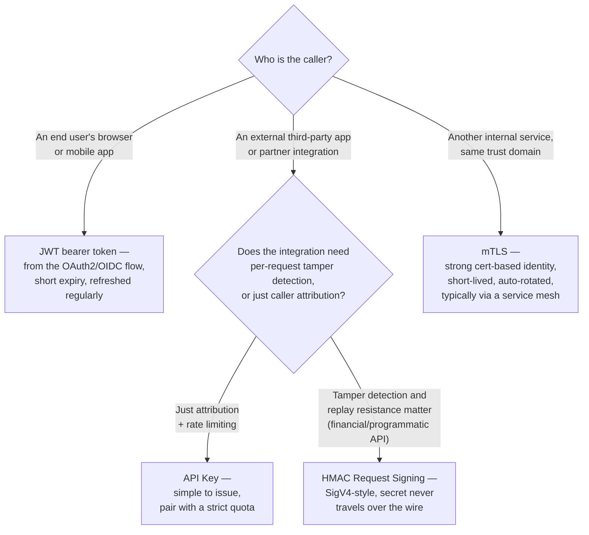

The pattern across all four branches: caller type and threat model decide the mechanism, not preference. A public-facing partner API that moves money (payment webhooks, banking integrations) reaches for HMAC signing specifically because tampering with a request in flight has to be detectable, not just attributable. An end-user client reaches for JWTs because it already went through an identity flow the previous guide covered, and a bearer token fits that flow naturally. Internal services default to mTLS because the certs can be issued and rotated automatically by infrastructure, with no human ever handling a secret directly. A bare API key is the right call only when the actual requirement is "which of our registered callers is this," nothing more.

---

## The Full Story, End to End

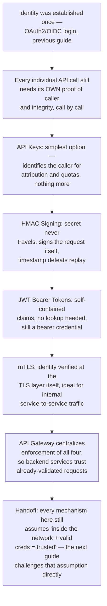

| | API Key | HMAC Signing | JWT Bearer Token | mTLS |
|---|---|---|---|---|
| Layer | Application | Application | Application | Transport (TLS) |
| Identifies | The calling app/account | The holder of the shared secret | The authenticated user/app (claims) | The service (via certificate) |
| Protects request integrity | No | Yes | No | No (protects the connection) |
| Typical home | Public API attribution, quotas | Cloud provider APIs (AWS SigV4), webhooks | User sessions post-OAuth2 | Internal service mesh |
| Enforced centrally at | API Gateway | API Gateway | API Gateway | Sidecar / service mesh |

**Where would you like to go next?** Natural threads from here:

- **Zero Trust Architecture** — every mechanism in this guide still quietly assumes "if you're inside our network perimeter, and you're presenting valid credentials, you're trusted" — the next guide challenges that assumption directly, requiring every request to prove itself on its own merits, regardless of which network it came from
