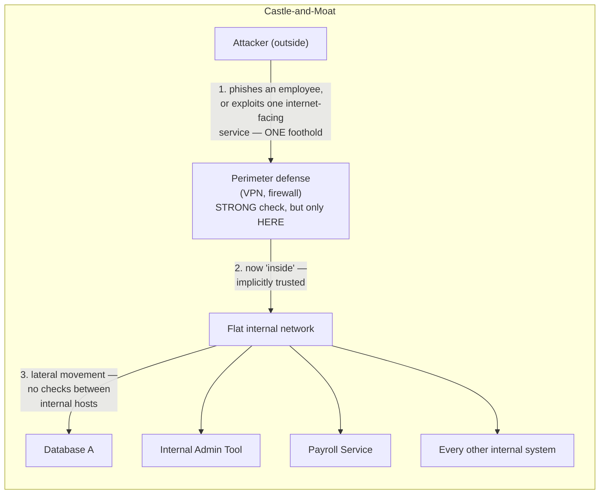
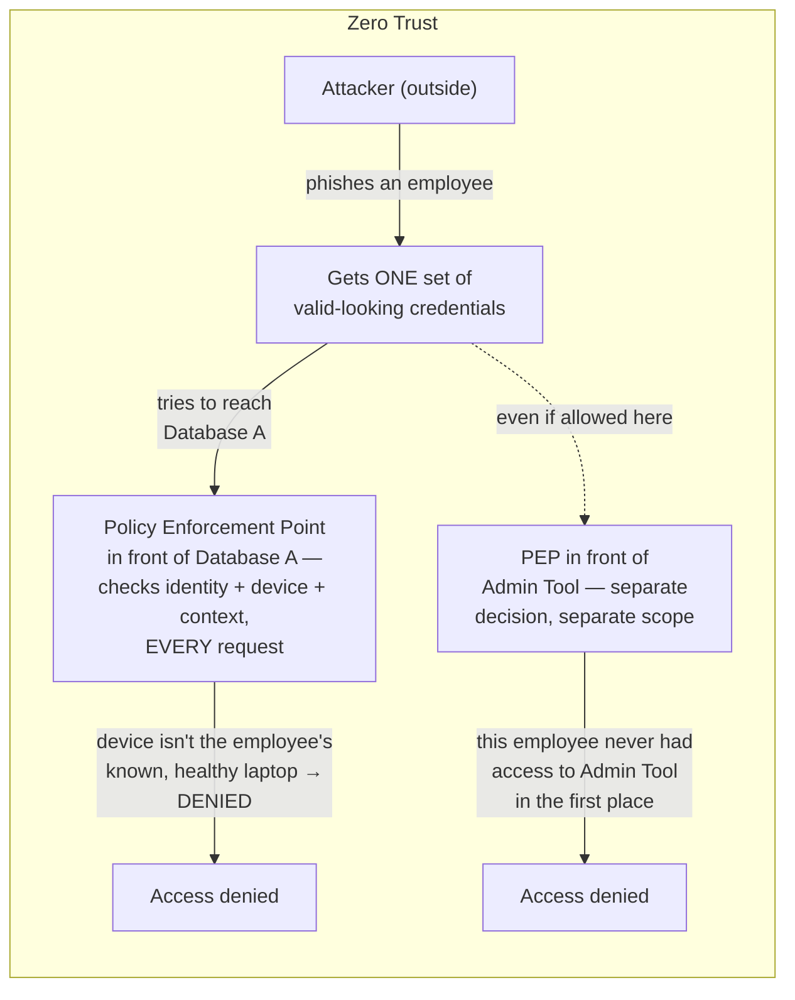
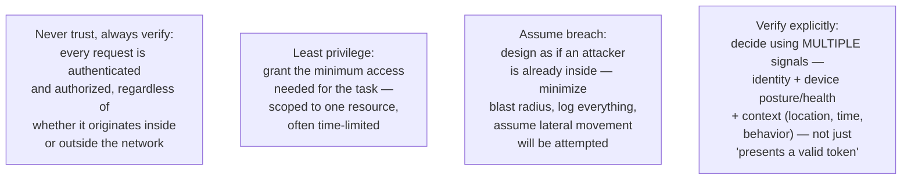
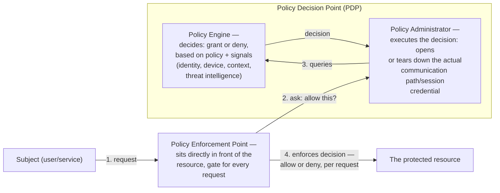
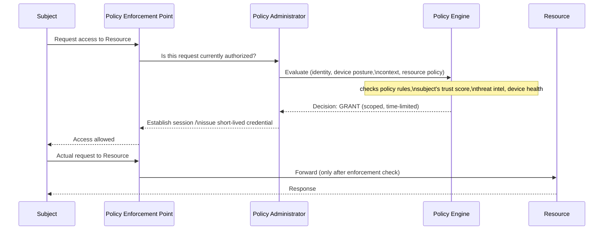
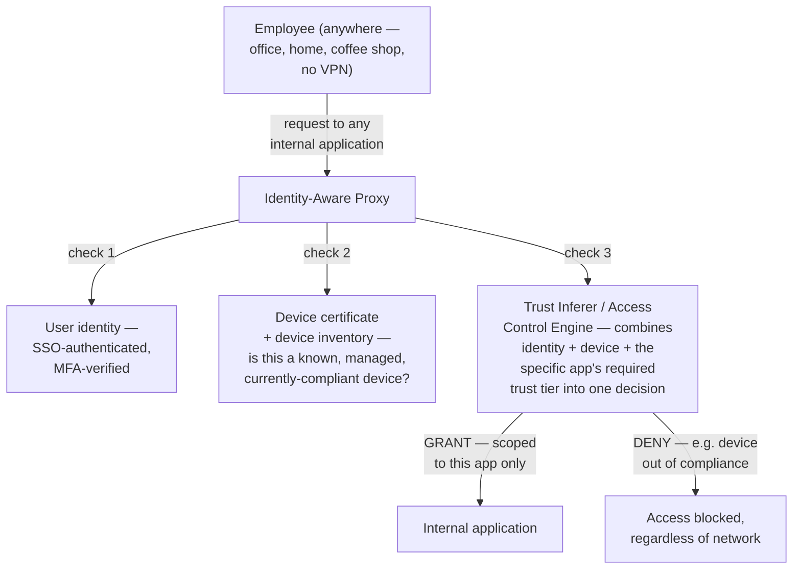
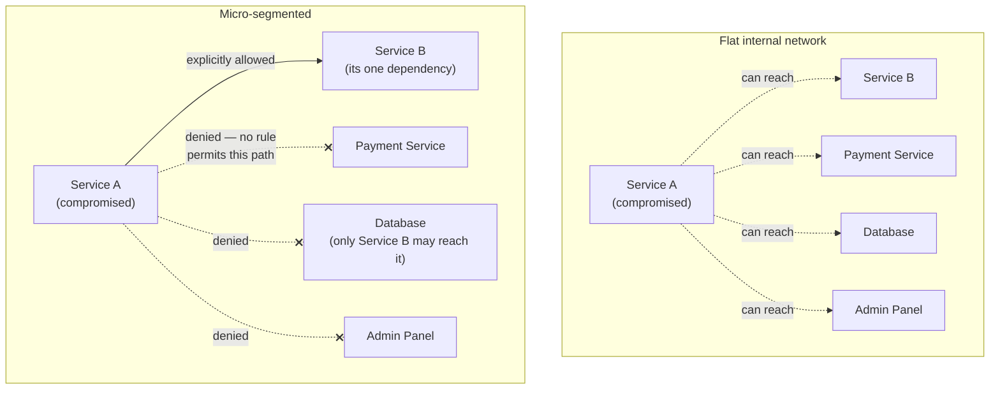
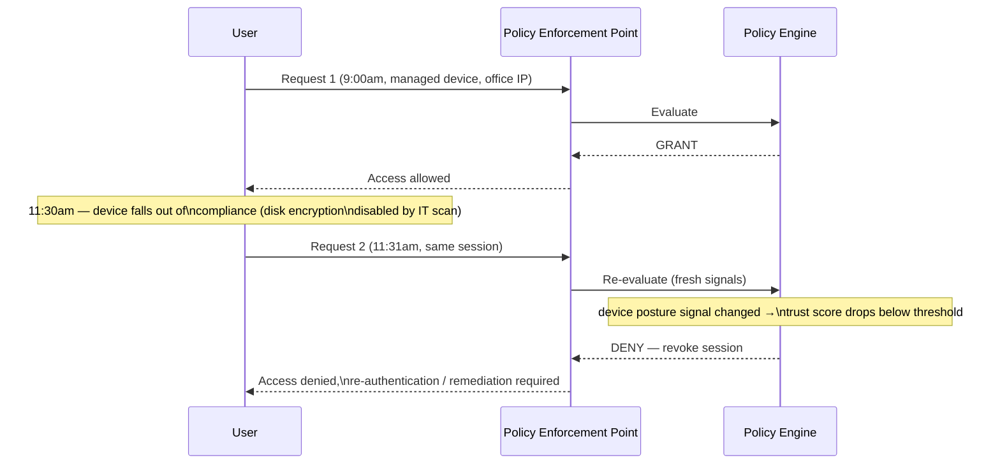
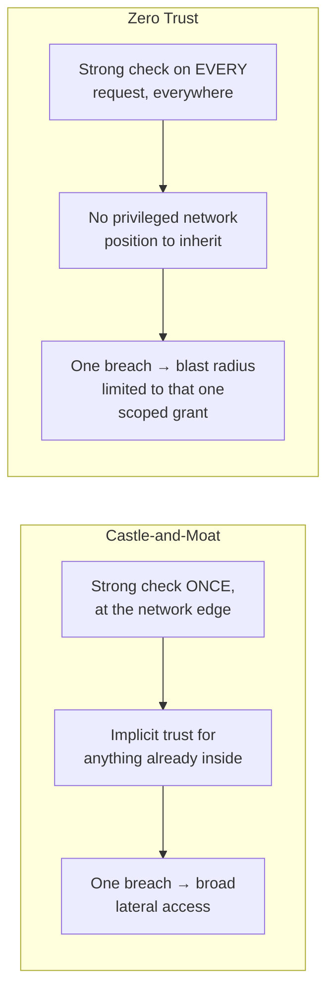
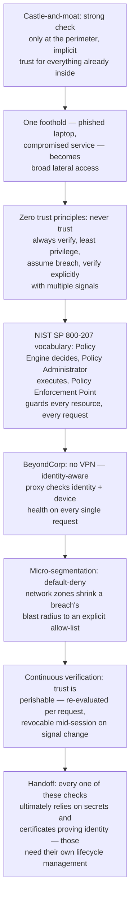

## The Story of Zero Trust Architecture

The previous guide armed every request with strong credentials — API keys, HMAC signatures, JWTs, mTLS certificates — and every one of those mechanisms shares a quiet, unspoken assumption: once a request has proven who it is and gotten past the front door, it's trusted for a while. A valid JWT is trusted until it expires. An mTLS-authenticated service is trusted for the life of the connection. A user behind the corporate VPN is trusted because, well, they're behind the corporate VPN.

Now ask the uncomfortable question those mechanisms don't answer: what happens the instant *one* of those credentials falls into the wrong hands? An employee's laptop gets phished. An internal microservice gets compromised through a dependency vulnerability. A stolen session token gets replayed from inside the network. In the traditional model — build a strong wall around the network, trust everything already inside it — that single foothold is often catastrophic: the attacker isn't just inside a compromised laptop, they're inside the *network*, and the network was never designed to defend against something that's already past the wall. This guide is about the architecture built specifically to make that one foothold worthless: **Zero Trust**.

---

## Interview Cheat Sheet

**Zero Trust Architecture** is a security model built on the assumption that no request should be trusted by default, regardless of whether it originates outside or inside the network perimeter — every single request must be authenticated, authorized, and evaluated against policy, every time, based on identity, device health, and context, not on which network segment it happened to arrive from.

**Key facts:**
- The formal reference architecture is **NIST SP 800-207**, which defines three logical components: the **Policy Engine** (decides, using policy and signals, whether to grant access), the **Policy Administrator** (executes that decision by establishing or tearing down the actual communication path), and the **Policy Enforcement Point** (sits directly in front of the resource and enforces the decision on every request) — the Policy Engine and Policy Administrator together are often called the **Policy Decision Point (PDP)**
- **Google's BeyondCorp**, published in 2014 after Google's own internal migration away from a trusted internal network (accelerated by the 2009 Operation Aurora attacks), is the origin of zero trust *in practice* — every employee request to every internal application goes through an identity-aware proxy, with no VPN, and no special trust for being on Google's corporate network
- **Micro-segmentation** shrinks the blast radius of a breach by dividing the network into small, isolated zones with explicit allow-lists between them — a compromised service can only reach what it's explicitly permitted to reach, not the entire flat internal network
- **Continuous verification** treats trust as perishable, not a one-time login event — access can be re-evaluated and revoked mid-session the moment a signal changes (device falls out of compliance, an impossible-travel login appears, a certificate expires)

**Common interview gotchas:**
- Zero trust is **not** "no trust ever" — it's "no *implicit, standing* trust based on network location"; every request still results in an access decision, it's just made explicitly and continuously instead of once at the perimeter
- It's not a single product you buy — vendors sell pieces of it (identity providers, device posture tools, proxies), but zero trust is an architecture and an operating principle, and a checklist of purchased tools without the "verify every request" discipline behind them isn't zero trust
- "Least privilege" doesn't mean static role-based permissions handed out once — the zero trust version is scoped tightly to the specific resource and often **time-limited**, expiring automatically rather than accumulating forever
- A VPN is a perimeter-extension tool, not a zero trust control — connecting over VPN and then being implicitly trusted on the internal network afterward is exactly the castle-and-moat pattern zero trust replaces; BeyondCorp's headline result was removing the VPN requirement entirely, not making the VPN itself stronger

**The core trade-off:** zero trust removes the single point of failure that a breached perimeter represents — but it requires authenticating and authorizing *every* request against fresh signals, which means more infrastructure (policy engines, device attestation, identity-aware proxies), more latency per request, and a much larger amount of continuously-collected signal data to get right.

---

## Chapter 1: The Castle-and-Moat Model, and Precisely How It Fails

The traditional model treats the network like a medieval castle: build strong walls at the edge — firewalls, VPN gateways, network access control — and once someone is let in through the gate, they're assumed to belong there. Internal traffic between services, once past the perimeter, is often barely checked at all: flat internal networks, broad internal firewall rules ("allow all from 10.0.0.0/8"), and services that trust any caller reachable on the internal network.

The failure mode isn't hypothetical — it's the shape of nearly every large breach post-mortem: an attacker doesn't need to defeat every system, only the weakest single entry point, because everything past that point trusts everything else past that point too. A phished laptop's credentials, once inside, can often reach far more than that one employee's actual job requires, simply because internal network reachability was never scoped to need.

Zero trust rejects the premise that "inside the network" should mean anything at all to an access decision:

The structural difference: in the castle-and-moat model, the strong check happens *once*, at the edge, and its result (a trusted network position) is reused implicitly for every subsequent internal interaction. In zero trust, there is no privileged network position to reuse — every single request to every single resource re-runs its own check, so a stolen credential is scoped to exactly what that credential is allowed to do, not to "everything reachable from inside."

---

## Chapter 2: The Core Principles, Not Just the Slogan

"Never trust, always verify" is the slogan; the actual architecture rests on four distinct, concrete principles.

**Never trust, always verify** is the rejection of Chapter 1's implicit trust: there is no "already authenticated for this session, skip the check" shortcut once you're inside — every request, from a user, a service, or a machine, is independently evaluated, whether it originates from the public internet or from a rack sitting three feet from the resource it's calling.

**Least privilege** goes further than the old idea of role-based access control. It means scoping a grant to the *specific* resource actually needed (not "engineering can reach the engineering VLAN," but "this identity can call this one API endpoint"), and, wherever possible, making that grant **time-limited** — a temporary elevated credential that expires in minutes or hours rather than a standing permission that accumulates and is rarely audited or revoked.

**Assume breach** flips the design posture from "prevent all intrusion" (impossible to guarantee) to "assume an attacker is already inside right now, and design so that assumption is survivable" — segment the network so a breach can't spread (Chapter 5), log and monitor every access decision so lateral movement attempts are visible, and make sure no single compromised credential or component grants broad reach.

**Verify explicitly** is the mechanical core: a decision isn't "does this bearer token validate" alone — it's a combination of signals evaluated together: *identity* (who is this, authenticated how strongly), *device posture* (is this a known device, is its disk encrypted, is its OS patched, is it enrolled in management), and *context* (is this login from an expected location, at an expected time, following an expected behavior pattern). A perfectly valid token from an unmanaged, unpatched device from a new country at 3 a.m. can and should be denied, or challenged further, even though the token itself checks out.

---

## Chapter 3: NIST SP 800-207 — The Reference Architecture

Zero trust as a slogan needed a common vocabulary before organizations could actually build to it consistently. **NIST Special Publication 800-207** (2020) supplies that vocabulary, defining a request's path through three logical components.

Walking a single request through this end to end:

The separation of roles matters mechanically: the **Policy Engine** is the brain — it never talks to the subject directly, it only evaluates. The **Policy Administrator** is the hands — it's the only component that actually establishes or revokes the communication path (which is what makes it possible to cut a session off mid-flight the instant the Policy Engine's next evaluation comes back negative, covered in Chapter 6). The **Policy Enforcement Point** is the gate — it's the only component sitting directly between the subject and the resource, and it enforces the PDP's decision on literally every request, not just the first one in a session. This separation is also what lets an organization swap or upgrade the decision logic (the Policy Engine) without touching every enforcement point deployed in front of every resource.

---

## Chapter 4: BeyondCorp — Zero Trust in Production

**Google's BeyondCorp**, described publicly starting in 2014, is the architecture that took zero trust from a NIST diagram to something that actually shipped and ran a company's entire internal access model. Its headline property: **no VPN**. A Google employee accesses internal tools the exact same way whether they're on the corporate network or a coffee-shop Wi-Fi — because the network they're on is no longer part of the trust decision at all.

The mechanically important part, easy to miss if you only remember "no VPN required": the check isn't performed once at login and then cached for the session. **Every single request** to every internal application is routed through the identity-aware proxy, and every one of those requests is re-checked against the user's identity *and* the device's certificate and current health — a device that was compliant an hour ago but has since had its disk encryption disabled, or whose managed-device certificate has been revoked, loses access on the *next* request, not at the next login. Each internal application also has its own required trust tier — a low-sensitivity wiki might accept a broader range of devices and contexts than a production deployment console — so the same user, on the same device, can be granted access to one internal app and denied for another, based purely on what that specific resource requires.

This is the concrete answer to Chapter 1's problem: there is no "inside Google's network" privileged position left to steal. A phished credential without the legitimate employee's specific managed device attached to it simply doesn't produce a valid decision at the identity-aware proxy, regardless of what network the attacker is connecting from.

---

## Chapter 5: Micro-Segmentation — Shrinking the Blast Radius

Even with strong identity and device checks at the edge, a flat internal network is still a liability for service-to-service traffic: if every backend service can, at the network level, open a connection to every other backend service, then a single compromised service becomes a launchpad for probing the entire internal estate. **Micro-segmentation** applies the same "never trust, always verify" logic to the network fabric itself, dividing it into small zones with default-deny between them.

Concretely, this is implemented with per-workload firewall rules (often called a **service mesh** with mutual TLS and explicit authorization policies, or cloud-native security groups scoped per service rather than per subnet) — each zone or service has an explicit allow-list of exactly which other identities may connect to it, on which ports, for which operations, and everything else is denied by default. The previous guide's mTLS mechanism is frequently the actual enforcement primitive here: a service mesh sidecar checks the calling service's certificate identity against a policy before permitting the connection at all, which is micro-segmentation and "verify explicitly" applied to service-to-service traffic instead of user traffic.

The payoff directly answers this guide's opening scenario: if Service A is compromised, the attacker doesn't inherit "everything reachable on the internal network" — they inherit exactly the small, explicit set of connections Service A itself was ever allowed to make, and nothing else. The blast radius of a single compromised component shrinks from "the whole company's internal network" to "the handful of systems that one component genuinely needed to talk to."

---

## Chapter 6: Continuous Verification — Trust as a Perishable Good

The last structural piece is about *when* verification happens. A login event, even a strong one with MFA and device checks, is a snapshot of the world at one instant. Zero trust treats that snapshot as decaying immediately — trust isn't earned once at login and then held for the rest of a session; it's re-evaluated continuously, and it can be revoked mid-session the moment new signals warrant it.

Signals that can flip a decision mid-session include: the device posture changing (an EDR agent reports malware, disk encryption gets disabled, the OS falls out of patch compliance), the context changing (a login appears from an impossible-travel location relative to the last request, or from a new, unrecognized network at an unusual hour), or explicit revocation (IT marks the device lost or stolen, the user's employment status changes, a certificate is revoked). Because the Policy Enforcement Point checks in with the Policy Decision Point on an ongoing basis — not just once — and because the Policy Administrator is the component actually holding the session's communication path open, revocation is a live capability, not something that only takes effect at the next login. This is what makes "assume breach" from Chapter 2 an operational reality rather than just a design philosophy: even a session that started out completely legitimate can be cut off the moment it starts looking compromised.

---

## Chapter 7: Castle-and-Moat vs. Zero Trust, Side by Side

| | Castle-and-Moat | Zero Trust |
|---|---|---|
| Where trust is decided | Once, at the network perimeter (VPN, firewall) | Continuously, per request, at a Policy Enforcement Point in front of each resource |
| What trust is based on | Network location ("inside" vs "outside") | Identity + device posture + context, combined |
| Internal traffic | Largely implicit, flat, unchecked | Micro-segmented, default-deny, explicitly allow-listed |
| Session model | Authenticate once, trusted for the session's lifetime | Trust is perishable — re-evaluated and revocable mid-session |
| Effect of one compromised credential/service | Often broad lateral movement across the internal network | Scoped to exactly what that one credential was explicitly granted |
| Reference architecture | Ad hoc, vendor/product-specific | NIST SP 800-207 (Policy Engine, Policy Administrator, Policy Enforcement Point) |
| Production example | Traditional corporate VPN + internal LAN | Google BeyondCorp — identity-aware proxy, no VPN |

---

## The Full Story, End to End

Zero trust doesn't add a new kind of check the previous guide's mechanisms didn't have — API keys, JWTs, and mTLS certificates are still exactly what identity gets proven with. What zero trust changes is *when* and *how often* those checks are trusted: never implicitly, never just once, and never based on which side of a network boundary a request happened to originate from. The castle wall is gone; every door inside the castle now checks ID on its own, every time.

**Where would you like to go next?** A theme runs through every chapter of this guide — the Policy Engine's decision, BeyondCorp's device certificate, micro-segmentation's mTLS identities, continuous verification's re-evaluation — every one of them ultimately rests on a secret or a certificate proving *this is really who it claims to be*. A zero trust system that re-verifies identity on every request is only as strong as the secrets and certificates used to do that proving, and those artifacts need their own dedicated issuance, rotation, and revocation lifecycle. That's exactly where the next guide picks up:

- **Secrets Management & PKI** — how private keys, certificates, and credentials are generated, distributed, rotated, and revoked safely, at the scale a zero trust architecture actually demands
