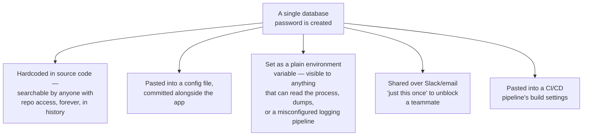
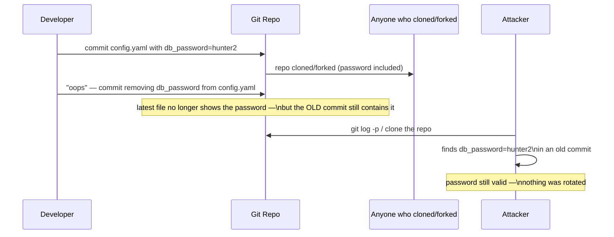
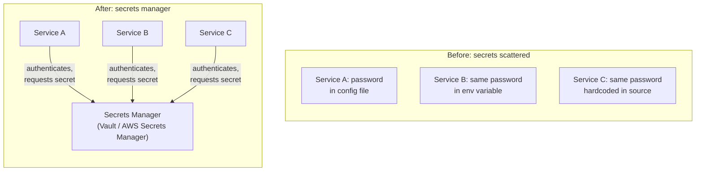
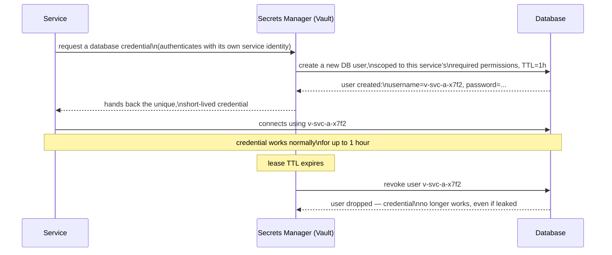
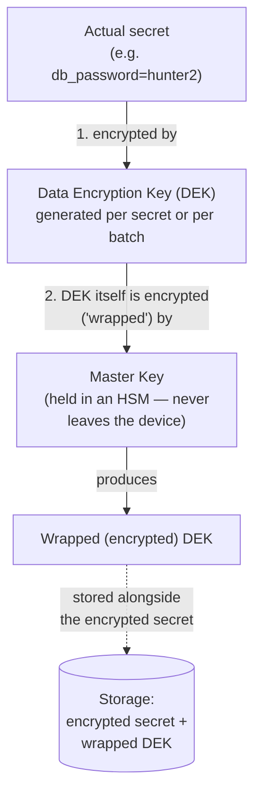
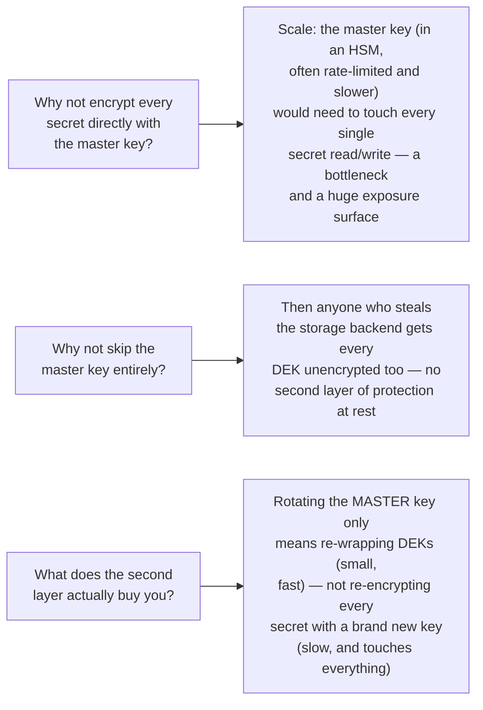
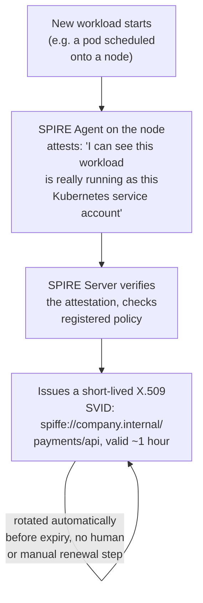
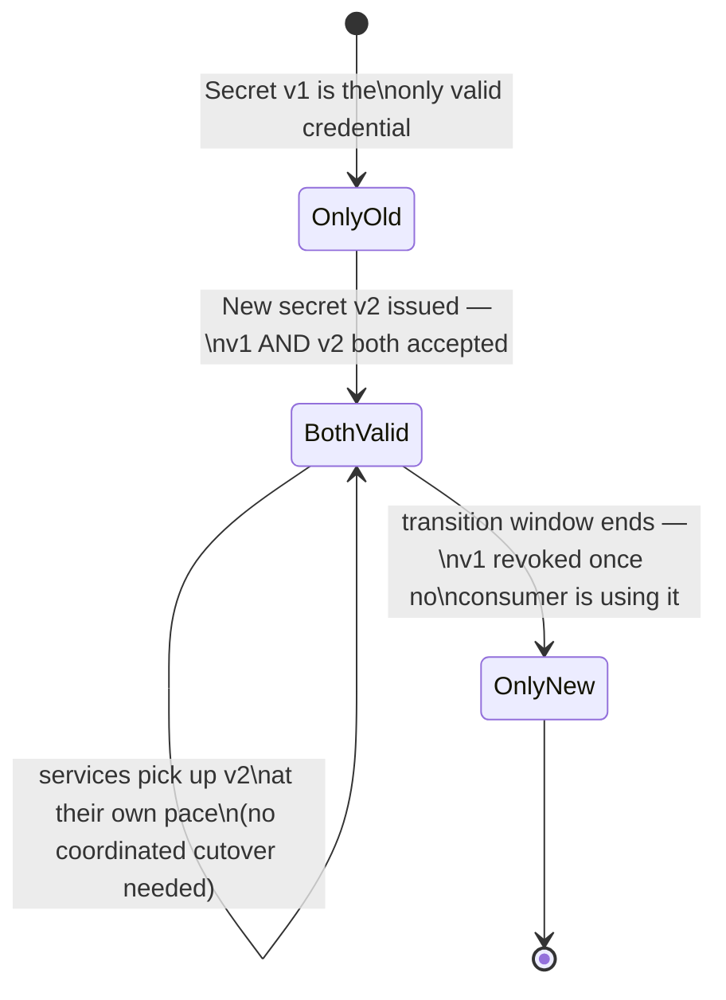
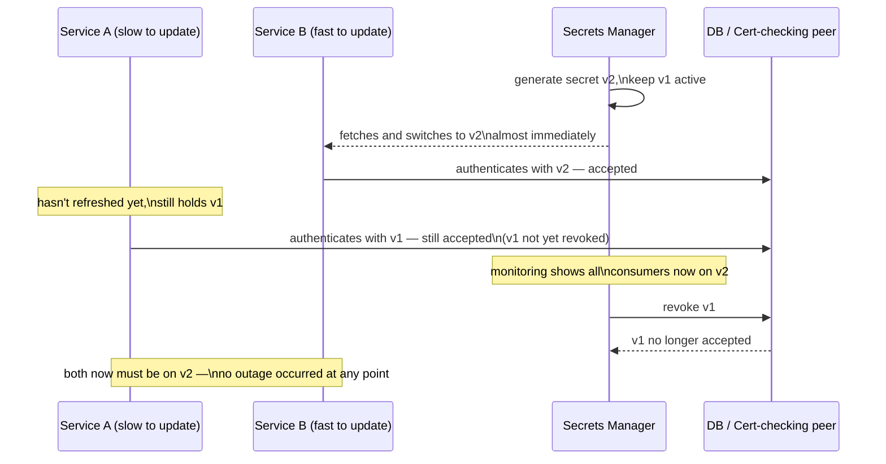
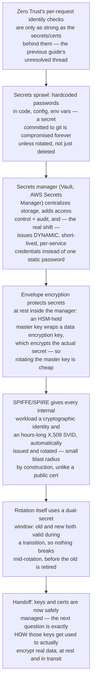

## The Story of Secrets Management & PKI

The previous guide closed on an uncomfortable observation: Zero Trust's whole premise — verify every request, trust nothing by default, check identity on every hop — is only as strong as the secrets and certificates used to prove that identity in the first place. A service can present a perfect mTLS handshake and a beautifully scoped token, and none of it means anything if the private key behind that certificate leaked from a config file six months ago, or if the database password every service has been quietly sharing since launch day is sitting in plaintext in a Slack message. This guide is about that exact gap: how an organization actually manages the passwords, keys, and certificates that every other security guarantee is built on top of.

---

## Interview Cheat Sheet

**Secrets management** is the discipline of storing, distributing, and rotating credentials (passwords, API keys, encryption keys, TLS certificates) so they're never hardcoded, rarely long-lived, and always auditable — and **PKI** (Public Key Infrastructure) is the system of certificates and certificate authorities that gives services and machines a cryptographically verifiable identity, the internal-infrastructure counterpart to the public-web certificate story.

**Key facts:**
- A secret committed to git is **compromised forever** the moment it's pushed, even if the commit is later reverted or deleted — git history retains every prior version, forks and clones may already have it, and the only real fix is **rotating the secret**, not scrubbing the repo
- **Dynamic secrets** (issued per-service, per-session, and short-lived) replace **static secrets** (one password, shared by everyone, valid until someone remembers to change it) — a secrets manager like HashiCorp Vault or AWS Secrets Manager generates a unique database credential on demand and revokes it automatically when its lease expires
- **Envelope encryption** layers a master key (often locked inside an HSM) over a data encryption key, which in turn encrypts the actual secret — so the master key is never touched at the scale of individual secrets, and rotating it only means re-wrapping data keys, not re-encrypting every secret in the store
- **SPIFFE/SPIRE** issues short-lived X.509 certificates (SVIDs) to workloads automatically, rotating them on the order of hours — a sharp contrast to a public web certificate's roughly 13-month validity window
- **Rotation without downtime** works via a dual-secret (versioned) window: old and new credentials are both valid simultaneously so in-flight services aren't broken mid-swap, and only after every consumer has moved over is the old one retired

**Common interview gotchas:**
- Deleting a leaked secret from the latest commit does **not** fix the leak — the secret lives in every earlier commit's history, and must be treated as compromised and rotated, not just removed going forward
- A secrets manager isn't just "a database for passwords" — the point of most of its value is *dynamic* secrets and audited access, not merely centralized storage of the same static passwords you had before
- Envelope encryption's master key is deliberately kept out of the encryption path for individual secrets — it only ever encrypts/decrypts the (much smaller number of) data keys, which is precisely what makes master-key rotation cheap
- Internal service PKI (SPIFFE/SPIRE) and public web PKI (`NetworkingAndCommunication/2_TLSAndEncryption.md`) share the same chain-of-trust math, but solve different problems at very different timescales — hours-long certs for a fleet of ephemeral workloads vs. year-long certs for a stable public domain
- Rotating a secret "all at once" (revoke old, issue new, at the same instant) is exactly what causes an outage — any in-flight request or cached connection using the old value fails hard; the dual-validity window is what makes rotation actually safe

**The core trade-off:** centralizing secrets and shrinking their lifetime dramatically reduces blast radius when something leaks — at the cost of a new, highly critical piece of infrastructure (the secrets manager itself) that every other service now depends on, and a rotation/rewrap discipline that has to be built and tested, not assumed.

---

## Chapter 1: Secrets Sprawl — Where Credentials Actually End Up

Ask any team where their database password lives, and the honest answer is usually "in more places than anyone can list." A credential created once tends to get copy-pasted everywhere it's needed, and each copy is a separate place it can leak from.

Each of these is a separate, independent way for the same one password to leak — and none of them expire, get rotated, or get audited on their own. Nobody can answer "who has read this password" because reading a file or an environment variable leaves no trail.

### The Specific Failure Mode: Git History Is Forever

The most concrete version of this problem, and the one worth internalizing precisely: a secret committed to a git repository is compromised **the instant it's pushed**, regardless of what happens after.

Deleting the line in a follow-up commit does not remove it from history — `git log`, `git show` on the old commit hash, or a simple clone still exposes it. Even rewriting history (`git filter-repo`, force-push) doesn't fully solve it once the repo has been cloned, forked, or mirrored even once, because every copy still has the old history unless every copy is also rewritten. The only action that actually neutralizes the leak is **rotating the secret** — issuing a new password and invalidating the old one — because that's the only step that makes the leaked value stop working. This is exactly the problem the rest of this guide solves: get secrets out of anything that's copied, committed, or cached, and make the ones that do exist short-lived enough that a leak has a small, bounded window of usefulness.

---

## Chapter 2: A Secrets Manager — Centralized, Access-Controlled, Audited

The fix is a **dedicated secrets manager** — HashiCorp Vault, AWS Secrets Manager, GCP Secret Manager are the common real-world examples — a purpose-built service that becomes the single place secrets are created, stored, retrieved, and rotated. Nothing gets hardcoded anywhere; a service authenticates to the secrets manager at runtime and asks for what it needs.

Centralizing gets you three things a scattered password never had: **access control** (a policy decides exactly which service identity can read exactly which secret), **audit** (every read is logged — who asked, when, for what), and **a single place to rotate** (change it once, in the manager, instead of hunting down every copy).

### The Bigger Shift: Static Secrets Become Dynamic Secrets

Centralized storage alone would just be a nicer filing cabinet for the same static password every service holds forever. The real architectural shift a secrets manager enables is **dynamic secrets**: instead of every service sharing one long-lived database password, the secrets manager mints a **unique, narrowly-scoped, short-lived credential per request**, and revokes it automatically when its lease expires.

This changes the leak calculus completely. If this credential ends up in a log line, a stack trace, or an attacker's hands, it's already scoped to one service's permissions and it expires on its own within the hour — compare that to Chapter 1's git-history password, which is valid indefinitely and shared across every service that ever used it. A service can also renew the lease before it expires if it's still actively using the credential, or request a fresh one on next use — the manager, not the service, owns the lifecycle.

---

## Chapter 3: Envelope Encryption — Protecting Secrets at Rest, Inside the Manager Itself

The secrets manager is now the single most sensitive piece of infrastructure in the whole system — every credential passes through it. So how does it protect what it's storing? Not by encrypting every secret directly with one master key — that creates exactly the same single-point-of-failure problem it was meant to solve, just moved up one level, and makes rotating that one key catastrophically expensive (every secret would need re-encrypting). The real answer is **envelope encryption**: a layered scheme where the master key never directly touches the secret.

Reading a secret back reverses the process: the master key (inside the HSM) unwraps the stored DEK, and the unwrapped DEK decrypts the actual secret. The master key itself is typically held in a **Hardware Security Module (HSM)** — dedicated hardware built so the key material physically never leaves the device; the HSM performs the unwrap operation internally and only returns the result, never the master key itself.

**Why bother with two layers instead of one?**

That third point is the practical payoff: master key rotation is a routine, low-risk operation precisely because envelope encryption decouples "the key that must never leak" from "the key that touches actual data at high volume." The master key only ever operates on the comparatively tiny number of DEKs, and DEKs — cheap to generate, cheap to re-wrap — absorb the actual workload of protecting potentially millions of individual secrets.

---

## Chapter 4: PKI for Internal Service Identity — SPIFFE/SPIRE

`NetworkingAndCommunication/2_TLSAndEncryption.md` already covered the chain-of-trust basics — root CA signs an intermediate, intermediate signs a leaf certificate, browsers verify the chain back to a trusted root — for the public-web case: one certificate, one domain, valid for roughly 13 months, renewed (ideally) by automation like Let's Encrypt. Internal service-to-service identity is the same underlying idea, chain of trust and all, but the requirements are different enough that it's worth treating as its own problem.

Inside a company's infrastructure, "who is calling" isn't a stable domain name — it's potentially thousands of short-lived workloads (containers, pods, serverless functions) spinning up and down constantly, each of which needs a verifiable identity the moment it starts, without a human ever manually requesting a certificate for it.

**SPIFFE** (Secure Production Identity Framework For Everyone) defines the identity format — a **SPIFFE ID**, a URI like `spiffe://company.internal/payments/api` that names a workload's role, not a hostname. **SPIRE** is the concrete implementation: an agent running alongside every workload that attests to what that workload actually is (which node, which container, which Kubernetes service account) and, once satisfied, issues it a short-lived X.509 certificate called an **SVID** (SPIFFE Verifiable Identity Document).

The deliberately short validity window — commonly on the order of hours, not months or years — is the whole point: a compromised SVID has a small blast radius by construction. If a certificate leaks, it's only useful until its next scheduled rotation, which SPIRE handles automatically and continuously in the background, in sharp contrast to a public web certificate's roughly-13-month lifetime and manual-feeling renewal process. Two services holding valid SVIDs can then perform mTLS directly against each other — the same mutual-certificate-verification mechanism `NetworkingAndCommunication/2_TLSAndEncryption.md` covered for the public case, just with SPIFFE IDs standing in for domain names, and hours instead of months as the unit of trust.

---

## Chapter 5: Rotating Secrets and Certificates Without Downtime

Whether it's a database password, an API key, or a certificate, rotation has one recurring failure mode if done naively: revoke the old value and issue the new one at the same instant, and every in-flight request, open connection, or cached credential using the old value breaks immediately.

The fix is the **dual-secret (versioned secret) pattern**: for a transition window, both the old and new values are simultaneously valid, so nothing breaks mid-rotation, and only after every consumer has demonstrably picked up the new value is the old one retired.

The same shape applies to TLS/SVID certificate rotation: a peer verifying a certificate is usually configured to trust *both* the current and the next signing authority (or both the old and new leaf) for an overlap period, so a certificate swapped mid-flight on one side of a connection doesn't cause the other side to reject it. SPIRE's automatic hourly-scale rotation (Chapter 4) and Vault's dynamic-lease expiry (Chapter 2) both lean on exactly this pattern under the hood — rotation isn't a single atomic swap, it's a scheduled overlap window with a clean retirement step at the end.

---

## Chapter 6: Static vs. Dynamic Secrets, and Public vs. Internal PKI — Side by Side

| | Static shared secret | Dynamic secret (Vault-issued) |
|---|---|---|
| Lifetime | Indefinite — until someone manually changes it | Minutes to hours, auto-expiring |
| Scope | Usually one shared credential for many services | Unique per service/session |
| Blast radius if leaked | Every consumer, indefinitely | One service, until the lease expires |
| Revocation | Manual, often forgotten | Automatic, built into the lease |
| Audit trail | Rarely — a shared password has no "who used it" | Every issuance tied to a requesting identity |

| | Public web PKI | Internal service PKI (SPIFFE/SPIRE) |
|---|---|---|
| Identity format | Domain name (bookstore.com) | SPIFFE ID (spiffe://company.internal/payments/api) |
| Typical certificate lifetime | ~13 months (public web), shrinking | Hours |
| Issuance | CA (e.g. Let's Encrypt), often automated | SPIRE Server, always automated |
| Renewal | Automation exists but is bolted on (cron/ACME client) | Native to the system — continuous, expected |
| Chain of trust | Root CA → intermediate → leaf, browser-trusted roots | Root CA → intermediate → SVID, internal trust domain |
| Failure if forgotten | Site goes down (hard browser error) | Workload loses ability to authenticate — often self-healed by next scheduled rotation |

---

## The Full Story, End to End

| | Before a secrets manager | After a secrets manager + internal PKI |
|---|---|---|
| Where secrets live | Source code, config files, env vars, chat messages | One centralized, access-controlled store |
| Secret lifetime | Indefinite | Minutes to hours (dynamic secrets, SVIDs) |
| Leak in git history | Permanent compromise unless manually rotated | Same risk, but blast radius is bounded by short TTLs |
| Rotation | Manual, risky, often skipped | Automated, dual-valid transition window, no downtime |
| Service identity | Shared passwords, no per-service distinction | Cryptographic per-workload identity (SPIFFE ID) |

**Where would you like to go next?** Natural thread from here:

- **Data Encryption** — with keys and certificates now safely issued, stored, and rotated, the next question is exactly how those keys get used to actually encrypt real data, both at rest and in transit
