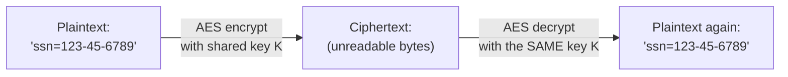
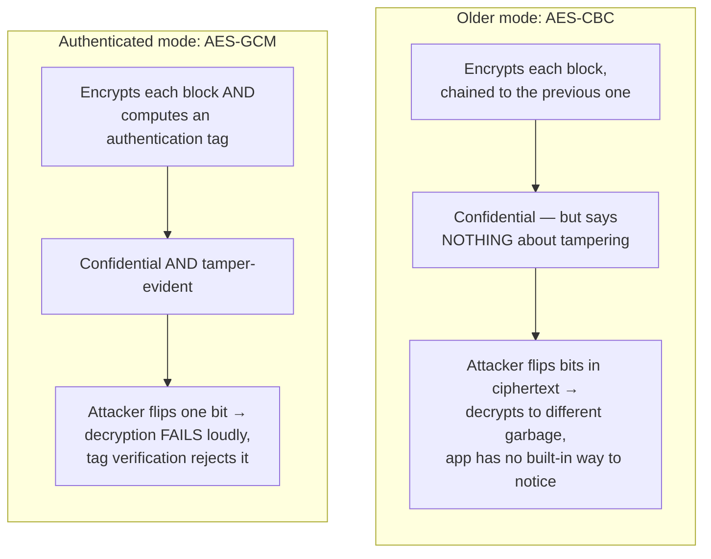
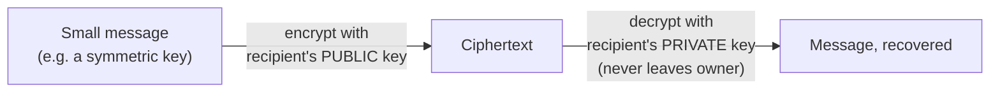
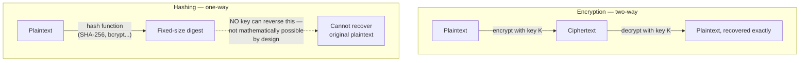
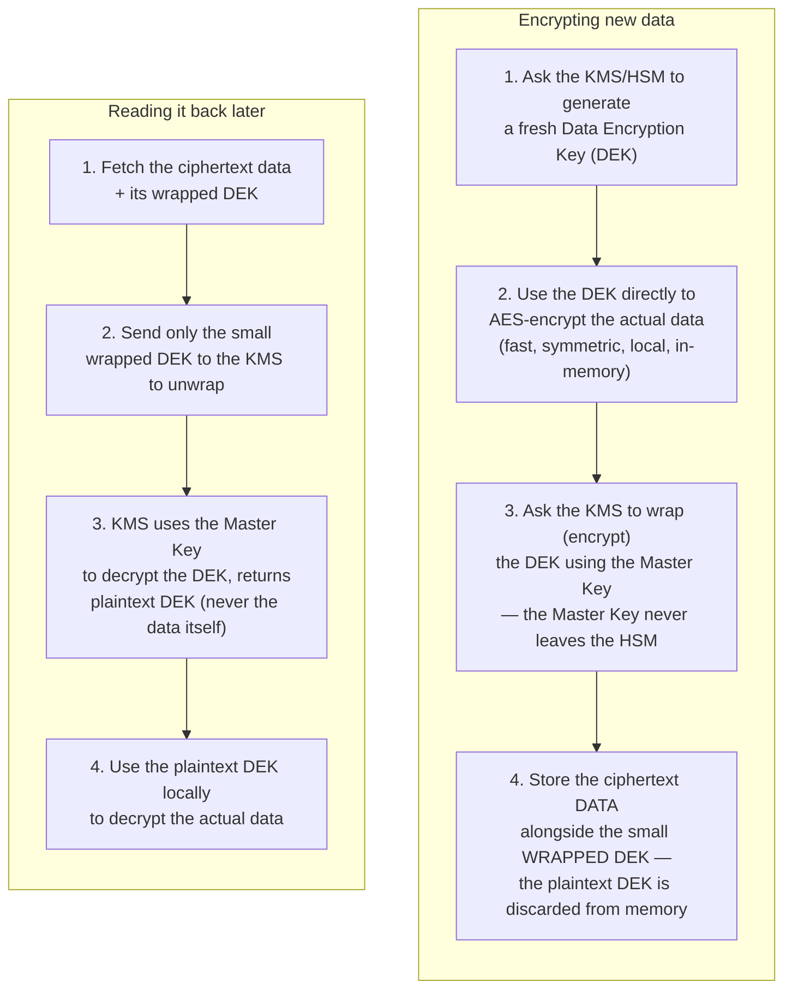
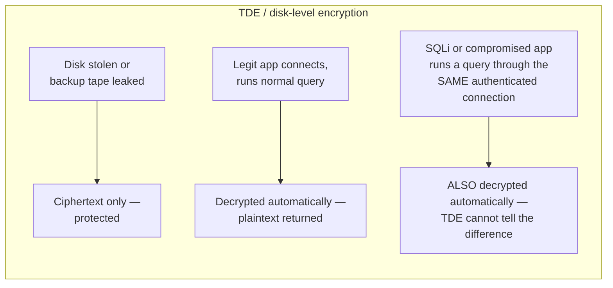
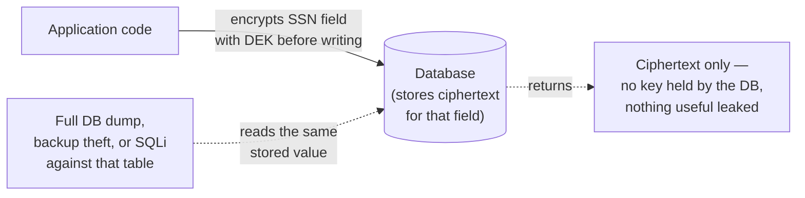
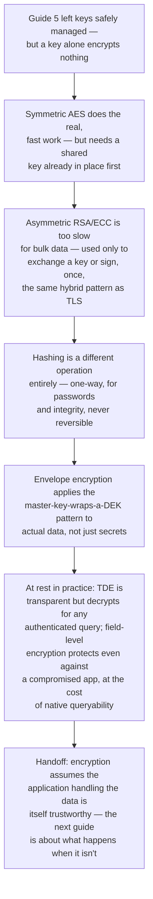

## The Story of Data Encryption

The previous guide left the keys in good hands: master keys locked inside an HSM, secrets wrapped by envelope encryption, certificates rotated automatically before they ever expire unnoticed. That's the *management* problem solved — a key exists, it's generated safely, it's stored safely, it's rotated safely. But a key sitting safely in a vault, by itself, encrypts nothing. This guide picks up exactly where that thread was left dangling: now that a key can be trusted to exist and stay secret, how does it actually turn a customer's real data — a password, a credit card number, a row in a database, a file on a disk — into ciphertext, and at which exact point in the system does that transformation happen?

---

## Interview Cheat Sheet

**Data encryption** is the process of using a cryptographic key to turn readable data (plaintext) into unreadable data (ciphertext), so that anyone without the key — an attacker on the network, a thief with a stolen disk, an intruder in a database — sees only gibberish, while anyone with the right key can reverse the process.

**Key facts:**
- **Symmetric encryption (AES)** uses one shared key for both encrypting and decrypting — fast enough for gigabytes of real data per second, but the key must already be safely available to both sides before it can be used at all
- **Asymmetric encryption (RSA/ECC)** uses a mathematically linked public/private key pair — far too slow for bulk data, so it's used only to exchange a symmetric key or to sign something, never to encrypt the actual payload directly
- **Hashing is not encryption** — a hash is one-way and irreversible by design (used for passwords and integrity checks); encryption is two-way and reversible by anyone holding the key
- **Envelope encryption** applies the same master-key-wraps-a-data-key pattern from `SecurityAndCompliance/5_SecretsManagementAndPKI.md` to actual application data, not just secrets: a KMS/HSM-held master key never touches the bulk bytes, it only ever wraps and unwraps a small, disposable data encryption key (DEK)
- **TDE (Transparent Data Encryption)** protects a stolen disk or backup tape; it does **not** protect against a compromised application or a SQL-injection vulnerability, because decryption happens transparently for any authenticated query through the normal path

**Common interview gotchas:**
- "The database is encrypted at rest" is frequently assumed to mean "the data is safe from any breach" — it only means safe from *physical* theft of the storage media; a SQLi hole or a stolen application credential reads the same plaintext a legitimate query would
- Encrypting a password (reversible) instead of hashing it (irreversible) is a real, recurring mistake — if anyone, even the system's own operators, can turn a stored password back into plaintext, it was implemented wrong
- A bigger AES key isn't free performance-wise, and AES-128 isn't "broken" — both are computationally unbreakable by brute force today; the choice is about long-term margin, not near-term risk
- Rotating a KMS master key does **not** mean re-encrypting terabytes of underlying data — only the small, already-wrapped DEKs need to be re-wrapped, which is the entire point of the envelope pattern

**The core trade-off:** the closer to the raw disk you encrypt, the less work it costs and the less anyone has to think about it — but the weaker the boundary, since anything that can issue an authenticated query walks straight past it; the closer to the application you encrypt, the stronger the boundary against exactly that scenario — at the direct cost of losing the database's native ability to index, search, or sort on that data.

---

## Chapter 1: Symmetric Encryption — Fast, but It Needs a Key Already in Hand

**AES (Advanced Encryption Standard)**, adopted in 2001 to replace the aging DES, is the near-universal answer whenever bulk data needs to be encrypted quickly. It's a **symmetric** cipher: the exact same key both scrambles and unscrambles the data, and because the underlying math is comparatively cheap, modern hardware can encrypt gigabytes per second without breaking a sweat.

**Key size — AES-128 vs. AES-256:** a longer key means more possible combinations an attacker would have to brute-force, but both sizes already sit so far beyond what any realistic computer could exhaust that "AES-128 is weak" is not a defensible claim today. The real reason large systems often default to AES-256 anyway is margin against the future — a longer runway against advances in cryptanalysis or (eventually) large-scale quantum computers — accepted at the cost of modestly more CPU work per byte, not because 128 bits is broken now.

**Mode of operation matters at least as much as key size.** Raw AES only encrypts one fixed-size block (16 bytes) at a time; a **mode of operation** decides how a whole message gets chained across many blocks — and this is where a critical, easy-to-miss detail lives.

This is exactly why "AES-256-GCM," not just "AES," is the answer worth giving in an interview: an **authenticated** mode like GCM detects tampering as a first-class guarantee, not an afterthought bolted on separately — the same idea as TLS's record layer, which also relies on an authenticated cipher mode so a modified packet is rejected outright rather than silently decrypted into corrupted data.

**The one thing symmetric encryption never solves by itself:** both sides need the key *before* any of this can happen. Where that key came from, how it was generated without ever appearing in a log or a git commit, and how it got safely into the hands of exactly the services that need it — that's precisely the problem `SecurityAndCompliance/5_SecretsManagementAndPKI.md` already solved. This guide assumes that problem is handled and asks the next one: once the key exists safely, what actually happens to the data.

---

## Chapter 2: Asymmetric Encryption — Slow, and Used for a Different Job Entirely

**Asymmetric encryption** (RSA, or its faster modern cousin ECC — elliptic curve cryptography) uses a mathematically linked **public/private key pair** instead of one shared secret: anything encrypted with the public key can only be decrypted with the matching private key, and the public key is safe to hand out to literally anyone.

The catch is cost: asymmetric math is commonly cited as 100 to 1000 times slower per byte than AES. Encrypting a whole database or a video stream with RSA directly would be prohibitively slow — so in practice, asymmetric crypto is almost never used to encrypt bulk data. It's used for two narrower, high-value jobs instead: **key exchange** (safely agreeing on a symmetric key with a stranger over an insecure channel) and **digital signatures** (proving a message really came from the holder of a specific private key, and wasn't altered afterward).

ECC deserves a specific mention here because it comes up often in interviews: a 256-bit ECC key provides roughly the same real-world security as a 3072-bit RSA key, at a fraction of the computational cost and bandwidth — which is why modern TLS deployments and mobile/IoT systems increasingly favor ECC over RSA where both are available.

**This is the exact same hybrid pattern `NetworkingAndCommunication/2_TLSAndEncryption.md` already covered in full for data in transit**, and it's worth naming explicitly because it reappears everywhere in this guide, not just at network setup: use the slow, expensive asymmetric crypto exactly once, for one small piece of key material, then switch to fast symmetric crypto for everything else. TLS uses it to bootstrap a session key before any HTTP traffic flows. Chapter 4 below shows the *identical* shape applied to data sitting at rest, not in motion — a master key wraps a small data key, and the data key does all the real work.

---

## Chapter 3: Hashing vs. Encryption — Not the Same Operation

This is one of the most common interview mix-ups, so it's worth stating with no ambiguity: **encryption is reversible, hashing is not.**

**Encryption** turns data into ciphertext with the explicit expectation that someone, somewhere, holding the right key, will turn it back into plaintext later — that's its entire purpose. **Hashing** produces a fixed-size digest that is intentionally, mathematically designed to never be reversible, even by its own creator.

That difference is exactly why passwords are **hashed**, not encrypted — a topic this series' first guide covers in depth. If passwords were encrypted, anyone with access to the key (an operator, an attacker who steals the key) could decrypt every user's password back to plaintext, which defeats the entire purpose of protecting them. Hashing (with a slow, salted algorithm like bcrypt, scrypt, or Argon2) means there is no key to steal that unlocks the password — verifying a login means hashing the submitted password again and comparing digests, never decrypting anything.

Hashing has a second, unrelated use that also shows up constantly: **integrity checks.** A hash (or its keyed cousin, an HMAC) can prove a file or message wasn't altered in transit, by comparing digests computed before and after — conceptually the same job as the authentication tag inside AES-GCM from Chapter 1, just applied outside the cipher instead of built into it.

**The gotcha to watch for:** if someone describes "decrypting a hash," that phrase itself is the tell that something is being confused — a properly designed hash cannot be decrypted, only guessed (via brute force or a rainbow table, which is exactly why salting and slow hash functions matter). If data *can* be turned back into plaintext with a key, it was encrypted, not hashed, full stop.

---

## Chapter 4: Envelope Encryption for Data — Reusing the Pattern for Bulk Bytes

`SecurityAndCompliance/5_SecretsManagementAndPKI.md` already introduced **envelope encryption** for protecting secrets at rest: a master key held in a KMS/HSM wraps (encrypts) a smaller data key, and that data key is what actually gets used day to day. The exact same pattern is how large systems encrypt real application data — customer records, files, database columns — and the mechanics are worth walking through concretely, because the "why" behind it is one of the more genuinely useful pieces of systems knowledge in this whole guide.

Why bother with this extra layer instead of just encrypting everything directly with the master key? Two concrete, load-bearing reasons:

**The master key never has to touch bulk data, or leave the HSM at all.** An HSM is deliberately built to be slow, audited, and rate-limited on purpose — every operation against it is expensive and heavily logged, which is exactly what you want for a key that protects everything. Asking it to wrap or unwrap a 32-byte DEK is cheap and fast enough to do constantly; asking it to directly encrypt gigabytes of customer data, over and over, would turn it into both a throughput bottleneck and a much bigger attack surface, since the master key would need to be exposed to the actual bulk data path.

**Rotating the master key only means re-wrapping DEKs — never re-encrypting the underlying data.** If the master key is ever suspected of compromise, or simply due for scheduled rotation, the fix is to decrypt every existing DEK with the old master key and re-encrypt (re-wrap) it with the new one — a fast operation on small key-sized blobs. The actual data those DEKs protect, however much of it there is, sits completely untouched the entire time. Without this layer, rotating a master key that directly encrypted the data would mean decrypting and re-encrypting every single byte of data it ever touched — for a system with petabytes of stored data, the difference is the gap between a routine maintenance task and a project that could take weeks and risk data loss mid-flight.

This exact pattern is what real managed key services sell as their core product: **AWS KMS**, **Google Cloud KMS**, and **HashiCorp Vault's Transit engine** all expose a `GenerateDataKey` / `encrypt` / `decrypt` API shaped precisely like the flowchart above — a caller asks for a DEK, gets back both a plaintext copy (to use immediately, then discard) and a wrapped copy (to store), and the master key backing all of it never leaves the service's own HSM boundary.

---

## Chapter 5: Encryption at Rest, in Practice — TDE vs. Application-Level

Once data actually needs to sit on disk, there are two fundamentally different places to put the encryption boundary, and the choice has real, concrete consequences.

**Transparent Data Encryption (TDE)** encrypts at the disk or database-file level — full-disk encryption, or a database engine encrypting its own data files before they hit storage. It's called "transparent" for a reason: the application and its queries are completely unaware it's even happening. Data is decrypted automatically, in memory, for any authenticated connection that runs a normal query.

That last branch is the entire trade-off in one picture: TDE sits **below** the query engine, so it protects against someone stealing the physical media, but it has no visibility into *who* or *what* is asking for the data through the front door — a SQL-injection vulnerability, a leaked database credential, or a compromised application server all read exactly the same plaintext a legitimate request would, because as far as the storage layer is concerned, it's an authenticated query like any other.

**Application-level (field-level) encryption** moves the boundary up into the application itself: specific sensitive fields (a social security number, a card number) are encrypted by application code, using a DEK from Chapter 4, *before* the value is ever sent to the database — and decrypted only after the application reads it back out. The database never holds the key and never sees the plaintext for that field, under any circumstance.

The cost is real and specific: once a field is encrypted this way, the database can no longer natively index, sort, range-query, or pattern-match on it — `WHERE ssn = ?` against ciphertext either fails outright or requires extra machinery (a deterministic encryption mode, a separate blind index, or tokenization) that each carry their own trade-offs. This is exactly why field-level encryption is reserved for a small set of genuinely high-sensitivity fields, not applied blanket across an entire schema — most columns are far better served by TDE plus good access controls than by giving up native querying.

| | TDE / Disk-Level Encryption | Application-Level / Field-Level Encryption |
|---|---|---|
| Where encryption happens | Storage layer (disk or DB engine), below the query engine | In application code, before data reaches the database |
| Protects against | Physical disk/backup theft, decommissioned drives | Full DB dump, backup theft, **and** SQLi / compromised app reading through the normal query path |
| Transparent to queries? | Yes — no application changes needed | No — encrypted fields lose native indexing, sorting, range queries |
| Blast radius of a compromised app/SQLi | Full plaintext exposed — TDE decrypts for any authenticated query | Only ciphertext exposed for protected fields — DB never held the key |
| Typical use | Whole database/disk, applied broadly, low effort | A small set of high-sensitivity fields (SSNs, payment data), applied deliberately |

---

## Chapter 6: Rotating Data Encryption Keys

Key rotation for data at rest leans directly on the envelope pattern from Chapter 4, and it's worth being precise about which key is actually being rotated, because the two cases have very different costs.

**Rotating the master key** is cheap, exactly as Chapter 4 set up: decrypt each existing DEK with the old master key, re-encrypt (re-wrap) it with the new one, and store the newly-wrapped DEK back in place of the old one. The underlying bulk data — everything that DEK protects — is never touched, never re-encrypted, and never even read during this process. A scheduled or compliance-driven master key rotation (the same operational discipline `SecurityAndCompliance/5_SecretsManagementAndPKI.md` covers for secrets generally) becomes a fast, low-risk metadata operation instead of a data migration.

**Rotating a DEK itself** is a different story: since the DEK is what actually encrypted the bytes, retiring one in place does require decrypting the data with the old DEK and re-encrypting it with a new one — real work, proportional to the size of the data. In practice, most systems sidestep this cost for existing data by rotating DEKs **going forward** — every new object or write gets encrypted under a freshly generated DEK, while older data keeps its original DEK (still safely wrapped by the current master key) until a deliberate, scheduled re-encryption pass touches it, if one is ever required at all.

---

## The Full Story, End to End

| | TDE / Disk-Level Encryption | Application-Level / Field-Level Encryption |
|---|---|---|
| Where encryption happens | Storage layer, below the query engine | In application code, before the database ever sees it |
| Protects against | Physical media theft | Physical theft **and** DB dump/SQLi through the normal query path |
| Query/index impact | None — fully transparent | Loses native indexing/sorting/range queries on protected fields |
| Effort to adopt | Low — a database or OS setting | Higher — application code changes, key management per field |
| Best used for | The whole dataset, as a baseline | A small set of the most sensitive fields, layered on top of TDE |

**Where would you like to go next?** Natural threads from here:

- **Secure Coding Best Practices & OWASP Top 10** — everything in this guide quietly assumes the application code handling the plaintext is itself trustworthy; a vulnerable application can leak that plaintext before encryption ever happens, or let an attacker query straight around the encryption boundary entirely (the exact SQLi scenario Chapter 5 called out) — that guide is about closing that assumption's gap
