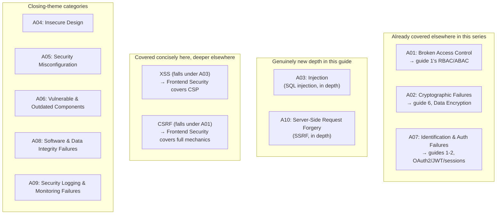
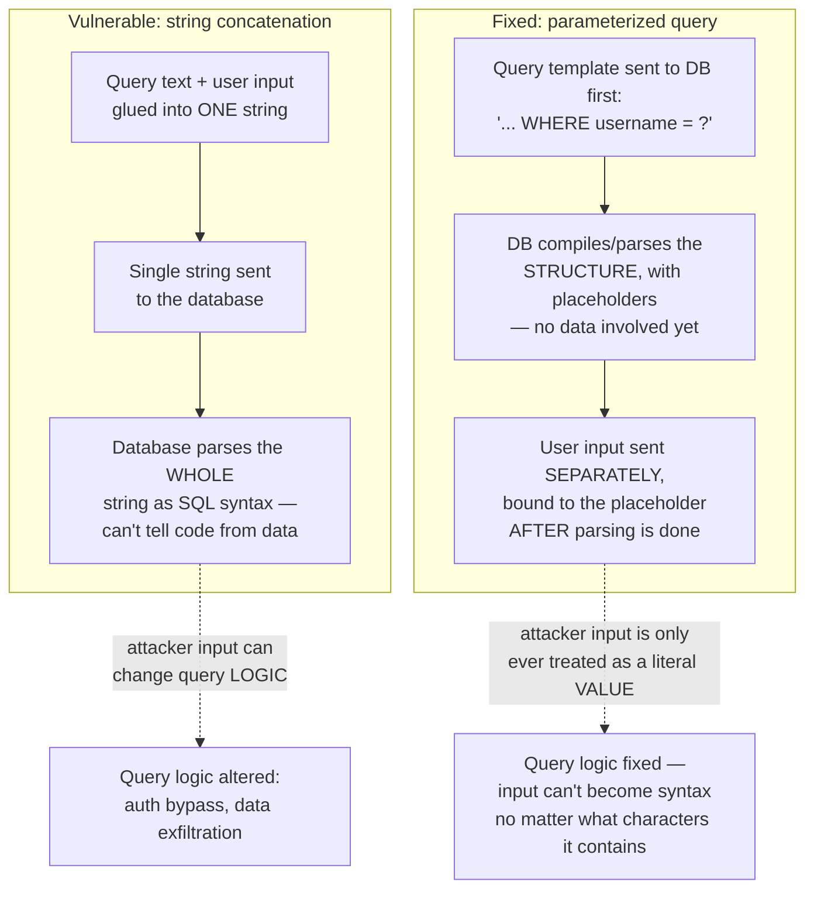
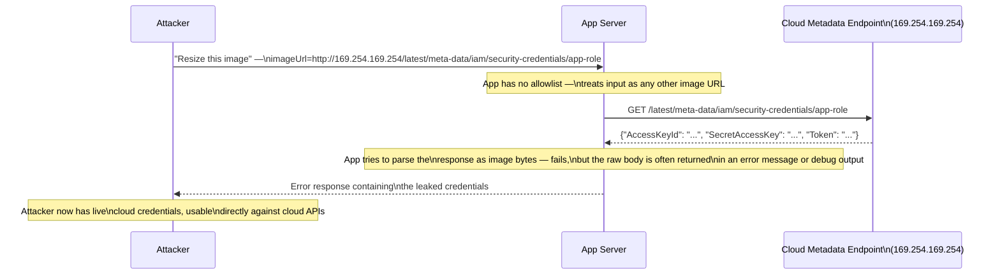
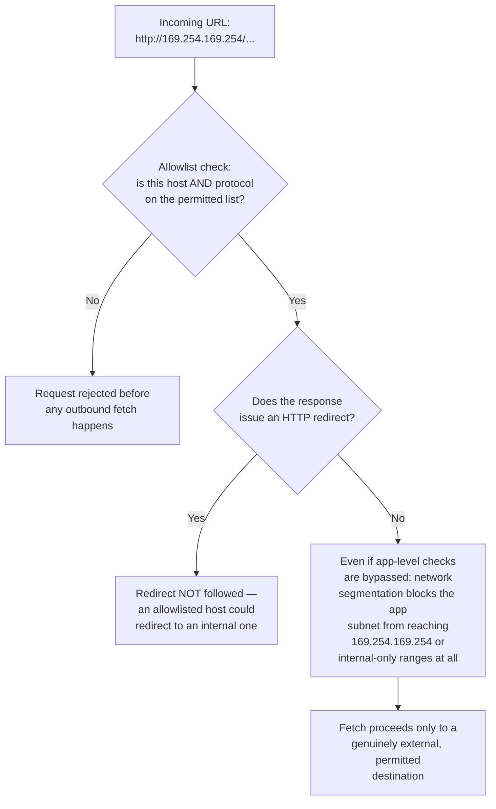
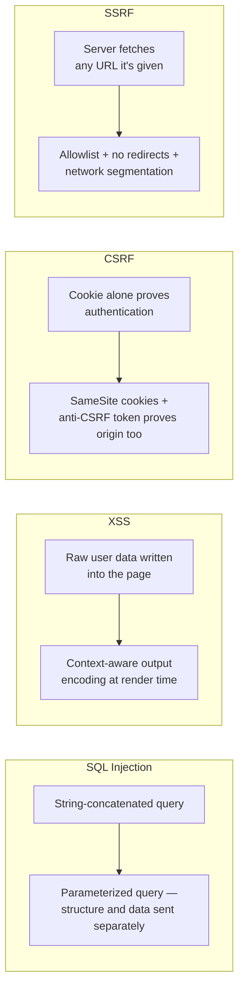
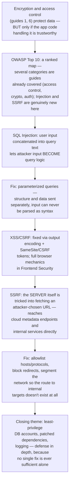

## The Story of Secure Coding & the OWASP Top 10

The previous guide ended on a deliberately uncomfortable note: encryption only protects data if the application code handling it can be trusted in the first place. A field encrypted at rest and in transit is still fully exposed the instant a vulnerable endpoint hands back the plaintext before encryption ever happens, or lets an attacker query straight past the access checks that were supposed to gate it. Encryption protects data *in a channel*; it says nothing about what happens when the code sitting at either end of that channel has a hole in it.

This guide is about that hole. Every access control from guide 1, every encryption guarantee from guide 6, every authentication check standing between an attacker and your data — all of it can be walked straight through, not by breaking cryptography or stealing a key, but by exploiting how the application itself parses, trusts, and acts on input it receives. That's the entire subject here: the concrete vulnerability classes the industry has spent two decades cataloguing as the **OWASP Top 10**, how each one actually works at the code level, and — most importantly — the precise mechanical reason each fix closes the hole rather than just papering over the symptom.

---

## Interview Cheat Sheet

**The OWASP Top 10** is a periodically-updated, evidence-based ranking of the most common and impactful web application vulnerability categories, maintained by the Open Web Application Security Project — used industry-wide as the baseline checklist for secure code review and security testing.

**Key facts:**
- **SQL Injection** happens when user input is concatenated directly into a query string instead of being sent to the database as data — the fix (parameterized queries) works because it removes the database's ability to ever parse user input as syntax, not because it "filters bad characters"
- **XSS** (Cross-Site Scripting) is fixed at the *output* boundary — escaping data at the moment it's rendered into HTML/JS/a URL — not at the input boundary, because the same string can be safe in one rendering context and dangerous in another
- **SSRF** (Server-Side Request Forgery) tricks the *server* into making a request on the attacker's behalf, most dangerously against a cloud metadata endpoint (`http://169.254.169.254/...`) that hands back live IAM credentials to anything that asks from inside the network
- **Broken Access Control**, **Cryptographic Failures**, and **Identification and Authentication Failures** are not new material in this series — they're the OWASP framing of exactly what guides 1, 2, and 6 already covered in depth; this guide's real depth is reserved for Injection and SSRF, which are genuinely new

**Common interview gotchas:**
- "We use an ORM, so we're safe from SQL injection" is false the moment anyone drops to a raw query or string-builds a `WHERE` clause for dynamic filtering — an ORM removes the *habit* of concatenating SQL, it doesn't remove the *capability*
- Escaping input at the point it's saved (rather than at the point it's rendered) breaks the moment the same data is later rendered into a different context (HTML body vs. HTML attribute vs. `<script>` block vs. URL) — each context has different characters that are dangerous, so encoding has to happen contextually, at output
- SSRF mitigations that only block by hostname (blocklisting `169.254.169.254` or `localhost`) are routinely bypassed with alternate representations of the same address (decimal IP notation, `0177.0.0.1`, DNS rebinding, redirects) — the durable fix is an allowlist plus network-level segmentation, not a denylist of known-bad strings
- Parameterized queries and input validation are not substitutes for each other — validation narrows what a field *should* contain (an email looks like an email), parameterization guarantees what a field *can never do* (be interpreted as code), and both are still worth doing

**The core trade-off:** secure coding practices add real friction — every query goes through a slightly more verbose API, every rendered value gets an encoding pass, every outbound fetch gets checked against an allowlist — in exchange for closing off entire classes of bugs structurally, rather than hoping every developer remembers to sanitize every input by hand, every time, forever.

---

## Chapter 1: The OWASP Top 10, and Which Parts of This Series Already Covered It

The OWASP Top 10 is not ten unrelated bugs — it's a ranked list of *categories*, several of which are just formal names for problems this series has already solved in earlier guides. Sorting them that way first is the fastest way to see exactly what's new here.



One line each, for completeness:

- **A01 — Broken Access Control**: users acting outside their intended permissions (a customer editing another customer's order by ID). Already the subject of guide 1.
- **A02 — Cryptographic Failures**: weak, missing, or misused encryption exposing sensitive data. Already the subject of guide 6.
- **A03 — Injection**: untrusted input changing the *meaning* of a command interpreter (SQL, OS shell, LDAP) — this guide's first deep dive.
- **A04 — Insecure Design**: missing or inadequate security control *at the design stage*, before a single line of code is wrong — a threat-modeling gap, not a coding bug.
- **A05 — Security Misconfiguration**: default credentials left in place, verbose stack traces in production, unnecessary services left enabled.
- **A06 — Vulnerable and Outdated Components**: shipping a library with a known CVE because nobody updated it — covered in this guide's closing theme.
- **A07 — Identification and Authentication Failures**: broken session management, weak password policies, credential stuffing. Already the subject of guides 1-2.
- **A08 — Software and Data Integrity Failures**: trusting unsigned code or data from an untrusted source (a CI/CD pipeline pulling an unverified dependency, an application deserializing untrusted data).
- **A09 — Security Logging and Monitoring Failures**: an attack that succeeds *and* goes unnoticed for months because nothing was logged or alerted on.
- **A10 — Server-Side Request Forgery**: the application server itself is tricked into making a request the attacker chose — this guide's second deep dive.

XSS and CSRF get a concise treatment below (they're too well-known to skip entirely), with the browser-side mechanics — CSP, `SameSite` cookie behavior in the browser, the same-origin policy — left to this repository's **Frontend System Design Considerations** section, under Frontend Security, which already covers CSP, CORS, XSS, and CSRF from that angle.

---

## Chapter 2: SQL Injection — How a String Becomes a Command

Injection earns its top-three ranking because it's conceptually simple, endlessly reachable (any input field that eventually touches a query), and totally devastating when it lands — a single injectable field can expose or destroy an entire database.

### The Vulnerable Pattern

The root cause is always the same shape: user input gets woven directly into a query string, and the database has no way to tell where the developer's intended SQL ends and the attacker's input begins.

```
// VULNERABLE
String query = "SELECT * FROM users WHERE username = '" + userInput + "' AND password = '" + passInput + "'";
statement.execute(query);
```

If `userInput` is the literal string `admin' --`, the constructed query becomes:

```sql
SELECT * FROM users WHERE username = 'admin' --' AND password = '...'
```

`--` starts a SQL comment, so everything after it — including the password check — is discarded. The attacker is now authenticated as `admin` with **no valid password at all**. A slightly different classic payload, `' OR '1'='1`, achieves a related but distinct effect:

```sql
SELECT * FROM users WHERE username = '' OR '1'='1' AND password = '...'
```

`'1'='1'` is always true, so the `WHERE` clause matches every row in the table — the query returns every user, and depending on how the application uses the first result, that's often enough to log in as whichever account happens to come back first.

### Going Further: UNION-Based Extraction

Once an attacker confirms a field is injectable, `UNION SELECT` lets them pull data from a completely different table through the same vulnerable query, as long as they can match the original query's column count:

```sql
' UNION SELECT username, password, NULL FROM admin_accounts --
```

If the application blindly renders whatever rows come back (say, in a product search results page), the attacker just exfiltrated admin credentials through a search box — no error message, no crash, just data quietly appearing where product listings normally would.

### The Fix, and Precisely Why It Works

```
// FIXED — parameterized query / prepared statement
String query = "SELECT * FROM users WHERE username = ? AND password = ?";
PreparedStatement stmt = connection.prepareStatement(query);
stmt.setString(1, userInput);
stmt.setString(2, passInput);
stmt.executeQuery();
```

The reason this closes the hole completely — not "mostly," not "for common payloads" — is a structural one, not a filtering one:



The database receives the query's *structure* (the SQL grammar, the `?` placeholders) and the *data* (the actual values) as two separate messages, in that order. Parsing finishes before your input is ever attached to anything — so no matter what characters an attacker's input contains, including a literal quote, a semicolon, or the word `UNION`, it is bound to a placeholder as an inert value, never re-parsed as SQL syntax. This is why "escaping quotes" and "blocklisting keywords" are both weaker, incomplete fixes — they're trying to filter dangerous *characters*, while parameterization removes the database's ability to interpret input as code at all, structurally, regardless of what's in it.

---

## Chapter 3: Cross-Site Scripting (XSS) — Fixed at Output, Not Input

XSS lets an attacker get their own JavaScript to execute in another user's browser, in the security context of your own site — meaning it can read cookies, make authenticated requests, or rewrite the page, all as if it were your legitimate code. There are three flavors: **stored** (the payload is saved server-side — a comment field, a profile bio — and served to every later visitor), **reflected** (the payload comes back in the same response that carried it, typically via a URL parameter, and only fires for whoever clicks a crafted link), and **DOM-based** (the payload never even touches the server — client-side JavaScript reads something attacker-controlled, like `location.hash`, and writes it unsafely into the page).

The fix is the same for all three, and the detail worth internalizing is *where* it applies: **output encoding, at the point of render, contextual to where the value lands** — not sanitizing input when it's first received. The reason input-time cleaning falls short is that the same stored string can later be rendered into an HTML body, an HTML attribute, a `<script>` block, or a URL — and each of those contexts has a different set of characters that are dangerous. Encode once at storage time and you've picked one context; render the same value somewhere else later, and the encoding you already applied doesn't protect it. Modern templating engines (React, most current server-side frameworks) HTML-encode by default, which is why XSS has become rarer in practice — but it re-opens the moment code deliberately opts out (`dangerouslySetInnerHTML`, `innerHTML =`, an "unescape" template tag) for content that isn't fully trusted.

Content Security Policy (CSP) is the defense-in-depth layer on top of correct output encoding — restricting which script sources a browser will execute at all, so even a successful injection often has nowhere to run. The full CSP mechanics, along with CORS, belong to and are covered in this repository's Frontend Security material, under Frontend System Design Considerations.

---

## Chapter 4: CSRF — Making the Browser Lie About Who's Asking

Cross-Site Request Forgery flips the direction of trust: instead of injecting code into your site, the attacker gets a *victim's own browser*, already authenticated to your site via cookies, to submit a request the victim never intended — a hidden form on an attacker-controlled page that auto-submits a POST to `yourbank.com/transfer` the moment the victim's browser (which is still logged in) loads it.

The fix has two complementary layers: **`SameSite` cookies** (set to `Strict` or `Lax`) tell the browser itself not to attach the session cookie to requests originating from a different site, closing most of the attack at the browser level with zero application code; and **anti-CSRF tokens** — a random, unpredictable value the server issues per session or per form, which must be echoed back on the state-changing request — close the gap for the cases `SameSite` alone doesn't cover. Both work by giving the server a way to verify the request's *origin*, since a session cookie alone only proves *who* is asking, not *from where*. The full browser-side mechanics of `SameSite`, and how it interacts with cross-origin requests generally, live in this repository's Frontend Security material alongside CSP and CORS.

---

## Chapter 5: SSRF — Tricking the Server Into Attacking Itself

SSRF is the one item on this list that's distinctly a backend problem, has no browser-side equivalent, and has become sharply more relevant with cloud infrastructure — which is exactly why it gets full depth here.

### The Setup

Any feature where the server fetches a URL on the user's behalf is a candidate: "paste an image URL to use as your avatar," "enter a webhook URL," "fetch this PDF from a link." The vulnerability appears the instant the application doesn't restrict *which* URL it's willing to fetch — an attacker simply supplies an internal address instead of a real one.

The single most damaging target is the **cloud instance metadata endpoint**, reachable at the well-known link-local address `169.254.169.254` from inside almost any cloud VM or container, which (on many default configurations) hands back the IAM role's live, temporary security credentials to anything that asks — no authentication required, because it's designed to be reachable only from inside the trusted instance.

### The Attack, Step by Step



Notice what makes this so dangerous: the attacker never touches the internal network directly — they can't, from outside. They only ever talk to the public-facing app. It's the **app server itself**, acting as an unwitting proxy, that reaches into the internal network on the attacker's behalf and carries the response back out. This same technique reaches any internal-only service the pattern applies to — an admin API with no external exposure, an internal Redis instance, a database dashboard — not just the metadata endpoint; the metadata endpoint is simply the highest-value target because it hands back credentials directly.

### The Mitigations



Three layers, each catching what the one before it might miss:

1. **Allowlist destination hosts and protocols** — accept only `https://` (never `file://`, `gopher://`, or bare IP literals) and only hosts that match an explicit allowlist, resolved and checked *after* DNS resolution, not just against the string the user typed (otherwise DNS rebinding — a hostname that resolves to a safe IP at check time and an internal one at fetch time — walks straight past the check).
2. **Disable HTTP redirects during the fetch, or re-validate the target on every hop** — an allowlisted, genuinely external host can still be attacker-controlled and issue a 302 to `http://169.254.169.254/...`; if the HTTP client automatically follows it, the allowlist was checked against the wrong URL.
3. **Network-level segmentation as the backstop** — even if every application-level check has a bug, the app server's subnet or security group simply has no route to the metadata endpoint or the internal network by default (AWS's IMDSv2, which requires a session token obtainable only via a request that can't be proxied through a simple GET, exists specifically to add friction here); this is the layer that holds when the code-level defenses don't.

---

## Chapter 6: Vulnerable Pattern vs. Fix, Side by Side



| Vulnerability | Vulnerable pattern | Fix | Why the fix actually works |
|---|---|---|---|
| SQL Injection | Query built by concatenating user input into a string | Parameterized queries / prepared statements | Structure and data are sent to the DB separately — input can never be parsed as syntax |
| XSS | User data written into the page without encoding | Context-aware output encoding at render time, plus CSP | Encoding is applied at the exact context (HTML/attr/JS/URL) where it's rendered, not once at input |
| CSRF | Session cookie alone authorizes a state-changing request | `SameSite` cookies + anti-CSRF tokens | Server can now verify the request's origin, not just the user's identity |
| SSRF | Server fetches any URL supplied by the user | Host/protocol allowlist, no auto-follow redirects, network segmentation | Even a bypassed application check still hits a network with no route to the internal target |

The pattern repeating across all four rows is the real lesson: in every case, the fix moves a decision that used to depend on a developer remembering to handle a specific attacker input, into a structural guarantee that holds regardless of what the input contains.

---

## Chapter 7: Secure by Default — Why No Single Fix Is Ever Enough

Even a codebase with zero SQL injection, zero XSS, and a fully allowlisted SSRF policy is not done, because these fixes only guarantee that specific attacks *don't work* — they say nothing about what happens when a bug slips through anyway, which it eventually will. Secure-by-default design is about making sure that a single mistake doesn't become a total breach.

**Least-privilege database accounts** are the clearest example: the application's own database user should never hold `DROP`, `ALTER`, or superuser privileges, and should only be able to touch the specific tables its features require. If a parameterized-query discipline still has one forgotten raw-concatenated query somewhere, a least-privilege account is the difference between an attacker reading one table they shouldn't and an attacker dropping the entire schema.

**Vulnerable and Outdated Components (A06)** — patching dependencies — matters for the same reason from a different angle: your own code can be flawless and still ship a known CVE because a transitive dependency three levels deep hasn't been updated in two years. Software composition analysis tooling (Dependabot, Snyk, `npm audit` and equivalents) exists specifically to surface this automatically, because no team tracks CVEs against every transitive dependency by hand.

**Security Logging and Monitoring (A09)** closes the loop: parameterized queries and an allowlist reduce how often something goes wrong, but they don't tell you when something *did* go wrong anyway. An injection attempt that gets rejected by a WAF, an SSRF attempt blocked by the network layer, a spike of failed logins — all of these are only useful signals if they're logged and someone (or some alert) is watching.

None of this works as a single silver bullet. Parameterized queries don't help if the database account they run under has superuser rights. A CSP doesn't help if the underlying template still writes raw HTML. Network segmentation doesn't help if the application-level allowlist is the only thing anyone bothered to build. **Defense in depth** — several independent layers, each catching what the one before it missed — is the actual conclusion of this entire guide, not a footnote to it.

---

## The Full Story, End to End



| | SQL Injection | XSS | CSRF | SSRF |
|---|---|---|---|---|
| What's tricked | The database | The victim's browser | The victim's browser | The application server |
| Core fix | Parameterized queries | Contextual output encoding | `SameSite` cookies + tokens | Allowlist + no redirects + segmentation |
| Depth in this guide | Full | Concise (cross-ref Frontend Security) | Concise (cross-ref Frontend Security) | Full |
| Backstop layer | Least-privilege DB account | CSP | — | Network segmentation |

**Where would you like to go next?** Even a codebase with none of the vulnerabilities in this guide — airtight queries, perfectly encoded output, a locked-down SSRF allowlist — can still be taken offline completely, not by exploiting a single line of logic, but simply by overwhelming it with more traffic than it can serve. That's the next guide: **DDoS Protection Techniques**.
