## The Story of DDoS Protection

The previous guide ended on an uncomfortable truth: application code with zero logical vulnerabilities — no injection flaw, no broken auth, nothing on the OWASP list — can still be taken offline completely. Not by finding a bug, but by ignoring the code entirely and going after something underneath it: the finite amount of bandwidth, connection slots, and CPU time the system has to work with. This guide is about that whole class of attack. None of them need to find a single flaw in the bookstore's code. They just need enough traffic — or the *right kind* of traffic — to exhaust some finite resource before a legitimate customer ever gets a turn.

---

## Interview Cheat Sheet

**A DDoS (Distributed Denial of Service) attack** uses many machines, often a botnet of compromised or spoofed sources, to exhaust a target's finite resources — bandwidth, connection state, or CPU/application capacity — so that legitimate requests can no longer be served, without needing to exploit any actual code defect.

**Key facts:**
- **Volumetric attacks** saturate raw network bandwidth, frequently using **amplification/reflection** — a spoofed small request tricks an open server into sending a much larger response at the victim, multiplying the attacker's effective output far beyond what they could send directly
- **Protocol attacks** exploit the mechanics of a protocol itself — the classic case is a **SYN flood**, which exhausts the server's table of half-open TCP connections rather than its bandwidth
- **Application-layer attacks** (HTTP floods, Slowloris) send traffic that looks like ordinary, complete requests — each one is comparatively cheap for the attacker to generate but expensive for the server to process, so a low request rate can still exhaust the target
- **SYN cookies** defend against SYN floods by having the server allocate *zero* state for a half-open connection — the state is instead encoded cryptographically into the sequence number itself, and only decoded (and real resources allocated) once the client's ACK proves it received that exact number

**Common interview gotchas:**
- "DDoS mitigation" is not one technique — the right defense depends entirely on which layer is under attack; a WAF does nothing against a volumetric flood, and a scrubbing center does nothing against Slowloris
- Slowloris doesn't need much bandwidth at all — it's often mistaken for "not a real DDoS" because there's no traffic spike to see, just many connections quietly stuck half-open
- Amplification factor isn't fixed per protocol — it depends on the specific query crafted against the specific misconfigured server, which is why "how big can the response get relative to the request" is the number worth reasoning about, not a memorized constant
- A CDN's edge network (`NetworkingAndCommunication/7_CDN.md`) already absorbs a large share of volumetric attacks as a side effect of its normal job — distributing where traffic lands — even though that isn't why it was originally built

**The core trade-off:** every mitigation in this guide adds a checkpoint — a scrubbing hop, a cryptographic cookie, a rate-limit counter, a challenge page — that costs a small amount of latency or complexity on every request, in exchange for making the finite resource behind it effectively very hard to exhaust from the outside.

---

## Chapter 1: Three Different Resources, Three Different Attacks

Before reaching for any specific technique, the first thing worth pinning down is that "DDoS" is not one attack — it's a name for three genuinely different attacks that happen to share a goal (deny service) while exhausting three completely different resources.

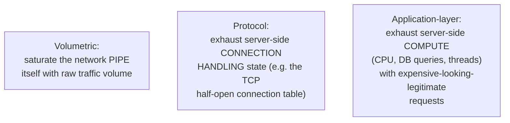

A volumetric attack never needs to reach the application at all — it can drown the network link before a single packet is even parsed by the web server. A protocol attack gets past the network link but never reaches the application layer either — it targets the OS's TCP stack directly. An application-layer attack, by contrast, deliberately looks like a completely normal, well-formed request all the way up the stack — the "attack" only becomes visible in how expensive it is to actually fulfill. This is exactly why the three layers need three different mitigations, covered chapter by chapter below, and why a system defended against one is often still completely open to the other two.

---

## Chapter 2: Volumetric — Amplification and Reflection

The attacker's own bandwidth is usually far smaller than the victim's — a home connection or a modest botnet can rarely, on its own, out-muscle a well-provisioned data center link. **Amplification/reflection attacks** solve that mismatch for the attacker with a trick: instead of sending traffic directly, spoof the *victim's* IP address as the source of a small request sent to an open, misconfigured DNS or NTP server. That server dutifully sends its (much larger) response not back to the attacker, but to the spoofed address — the victim.

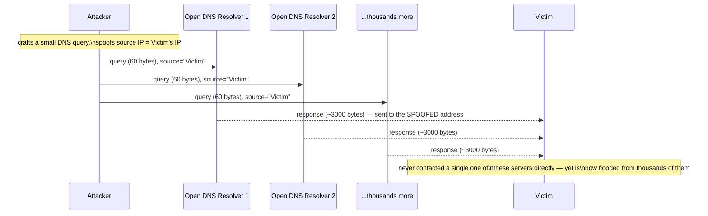

The **amplification factor** is the ratio between the size of the tiny spoofed query and the much larger response it provokes — a well-chosen DNS query can be answered with a response tens of times larger, and some NTP commands (like the now-infamous `monlist`) have historically produced responses hundreds of times larger than the request that triggered them. The attacker never sends the large volume directly; they send a small volume of *queries*, and the reflectors — thousands of legitimately-configured-but-open DNS or NTP servers scattered across the internet — do the actual work of turning that small volume into a flood, each contributing its own slice of amplified traffic, all aimed at one victim address none of them ever actually chose to talk to. The victim's own connection to the internet is what gets saturated — this is purely a bandwidth problem, resolved entirely before any packet reaches an application, or even a TCP handshake.

---

## Chapter 3: Protocol — The SYN Flood

### How a Normal Handshake Works

TCP establishes a connection with a three-way handshake, and the server's behavior at the middle step is exactly what a SYN flood exploits.

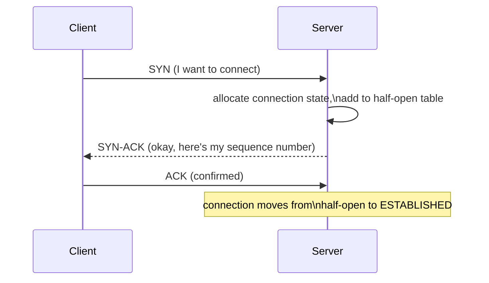

The server commits real memory — an entry in its connection table — the moment it sends the SYN-ACK, *before* it has any proof the client is real or ever intends to complete the handshake. That table has a finite size. That single design decision is the entire vulnerability.

### The Attack

An attacker sends a flood of SYN packets, typically with spoofed, unreachable source IP addresses, and never sends the final ACK. The server allocates a half-open connection slot for every single one and sits waiting — because from the server's point of view, each SYN is indistinguishable from a real client whose ACK is simply still in flight.

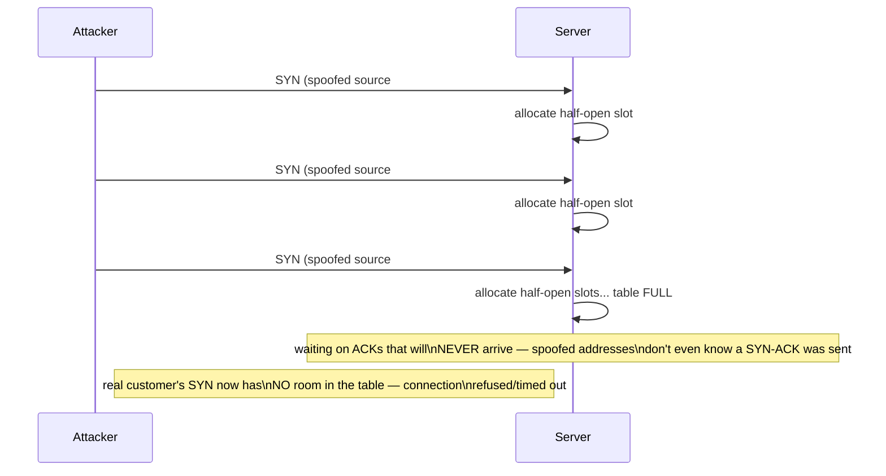

The table fills up with entries the server will hold onto until each one individually times out, and by then the attacker has already sent more. Notice this costs the attacker almost nothing — a SYN packet is tiny — while it costs the server a real, finite resource per packet received. That asymmetry is exactly why protocol attacks are so efficient compared to trying to out-volume a target directly.

### The Mitigation: SYN Cookies

The fix is a genuinely clever piece of engineering: stop allocating any state at all for a half-open connection. Instead of remembering "I sent a SYN-ACK to X, waiting on its ACK" in a table entry, the server **encodes** that same information cryptographically directly into the sequence number it sends back — a value derived from the connection's source/destination IP and port, a timestamp, and a server-side secret, all hashed together. Nothing is stored. If the ACK never comes back, nothing was ever spent.

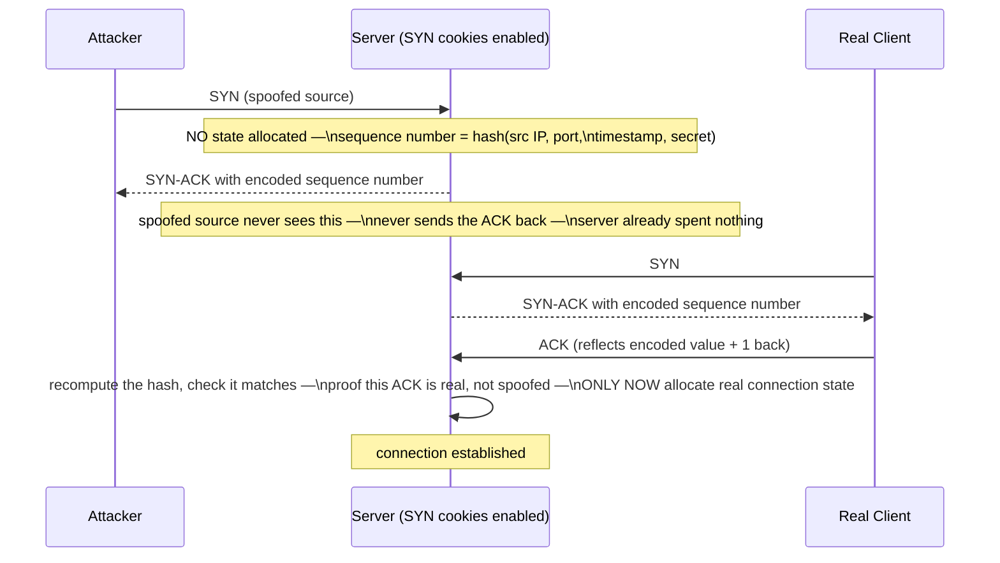

The genuinely important detail: the server doesn't need to remember anything to verify the returning ACK — it just recomputes the same hash from the ACK's IP/port and timestamp and checks whether the client reflected back the value it was actually sent. A spoofed source can never produce a valid ACK for a cookie it never received in the first place, so the flood of fake SYNs simply evaporates without ever touching the connection table — real resources are allocated exactly once, at the very last step, only for connections that prove themselves genuine.

---

## Chapter 4: Application-Layer — HTTP Floods and Slowloris

Once traffic has enough bandwidth to get past volumetric filtering and looks like well-formed TCP to get past protocol-layer defenses, the last place left to attack is the application itself — with requests that are completely valid, just expensive.

### HTTP Flood

An **HTTP flood** sends a large number of complete, legitimate-looking HTTP requests — real headers, a real completed TCP handshake, nothing malformed at all — aimed specifically at whichever endpoint costs the server the most to answer. Hitting an unindexed search endpoint or a report-generation page is far more effective per-request than hammering a static homepage, because each request forces real, expensive backend work (a full table scan, a heavy aggregation query) rather than a cheap cache hit.

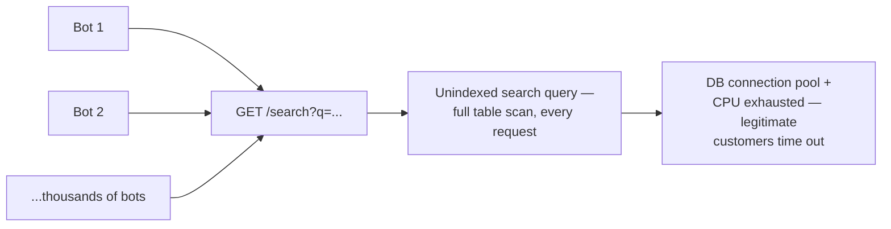

Nothing here looks structurally wrong to a firewall inspecting packets — every request is a syntactically valid HTTP GET. The only signal that something is off is the *volume and pattern* of requests against one specific, expensive endpoint, which is why this layer needs behavioral defenses (Chapter 5) rather than protocol-level ones.

### Slowloris — The Sneaky One

**Slowloris** takes the opposite approach from a flood: instead of many complete requests sent fast, it opens many connections and sends each one's HTTP headers *deliberately, extremely slowly* — one header line every 10-15 seconds, never quite finishing the request. Most web servers, by design, keep a connection open and reserved while they wait for the rest of a request they believe is still arriving.

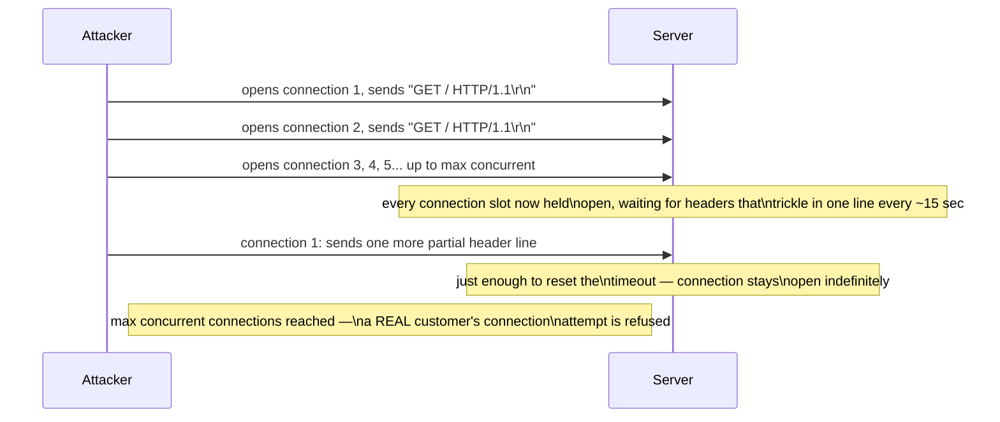

This one is genuinely sneaky for a specific reason: there is no traffic spike to notice at all. Bandwidth usage stays negligible — a handful of bytes trickling in per connection, per minute — so it looks exactly like a room full of very slow, very patient legitimate clients on bad connections, not an attack. The resource being exhausted isn't bandwidth or the TCP table, it's the application server's **maximum concurrent connection count** — a limit that exists independently of both of the previous two layers' defenses, and one that Chapter 3's SYN cookies do nothing to protect, since Slowloris completes its TCP handshakes perfectly normally.

---

## Chapter 5: Mitigations, Mapped to the Layer They Defend

Each layer from Chapter 1 needs its own defense — there is no single control that covers all three.

**Volumetric → scrubbing centers and Anycast routing.** Rather than letting a flood converge on one origin data center, traffic is routed — via the same Anycast mechanism covered for CDN edge routing in `NetworkingAndCommunication/7_CDN.md` — to many geographically distributed points of presence at once, each absorbing only a fraction of the total flood instead of one origin absorbing all of it. At each point, a **scrubbing center** inspects and filters out the malicious traffic, forwarding only clean, legitimate requests onward to the actual origin. A CDN's edge network already provides much of this absorption as a natural side effect of the exact same distributed-presence architecture `NetworkingAndCommunication/7_CDN.md` describes for ordinary content delivery — the same many-points-of-presence design that makes a cache hit fast for a legitimate customer also happens to mean no single point ever sees the attack's full volume.

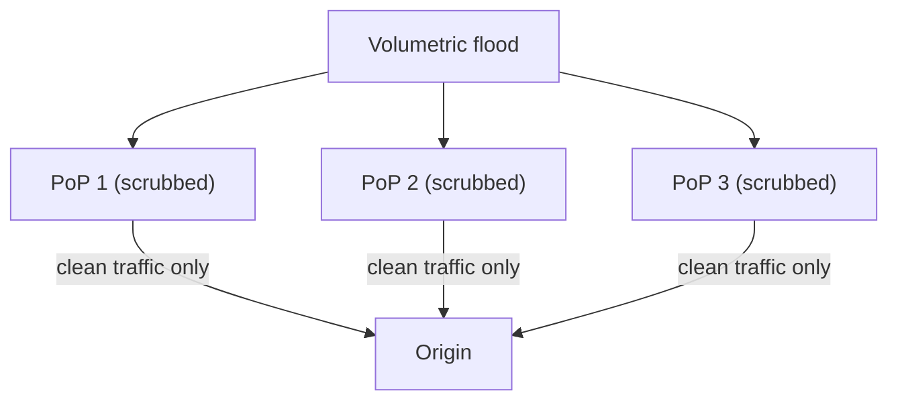

**Protocol → SYN cookies.** Already covered in full mechanical depth in Chapter 3 — the server allocates zero state for a half-open connection, encoding what it needs into the sequence number itself, and only commits real resources once the returning ACK proves the client is genuine.

**Application-layer → rate limiting, CAPTCHA/proof-of-work, and a WAF.** Rate limiting caps how many requests any one client can make in a window — the token bucket and leaky bucket mechanics behind this are covered in full in `ScalabilityAndPerformance/2_RateLimitingAndThrottling.md`, and apply here without needing to be re-derived. A **CAPTCHA** or **proof-of-work challenge** raises the cost of *each* request specifically for automated clients — a human solves a CAPTCHA once per session at negligible cost, while a bot farm has to solve millions of them; a proof-of-work challenge instead forces the client's own CPU to spend real computation before its request is honored, which is cheap for one legitimate browser making one request and expensive for a botnet trying to make millions. A **WAF (Web Application Firewall)** sits in front of the application and pattern-matches requests against known-bad signatures and behavioral anomalies — including the specific request patterns an HTTP flood or Slowloris produces — blocking or challenging traffic that matches, before it ever reaches the expensive endpoint behind it.

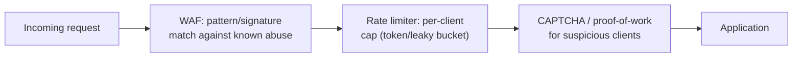

### Side by Side

| | Volumetric | Protocol | Application-layer |
|---|---|---|---|
| Mechanism | Amplification/reflection floods raw bandwidth | Half-open connections left to hang (SYN flood) | Legitimate-looking requests, expensive to process (HTTP flood, Slowloris) |
| Resource exhausted | Network bandwidth | Server connection table | CPU, DB connections, max concurrent connections |
| Primary mitigation | Scrubbing centers + Anycast (CDN edge presence) | SYN cookies | Rate limiting, CAPTCHA/proof-of-work, WAF |

---

## Chapter 6: A Real Attack Rarely Stays in One Layer

The three layers aren't mutually exclusive in practice — a sophisticated attack often blends them specifically because a target defended well at one layer is frequently wide open at another. A botnet might open a volumetric smokescreen to distract monitoring and saturate upstream links, while simultaneously running a slow, quiet Slowloris attack against the application layer underneath — the kind of attack that a scrubbing center's bandwidth-focused filtering wouldn't even notice, because Slowloris was never a bandwidth problem to begin with. This is the practical reason defense in depth matters here more than almost anywhere else in this series: each layer's mitigation only covers its own layer, and a target needs all three deployed simultaneously to actually be covered end to end.

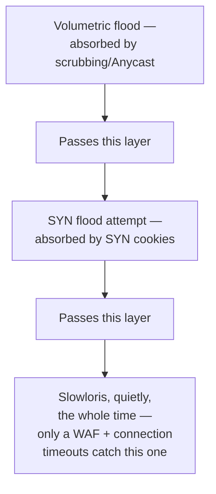

---

## The Full Story, End to End

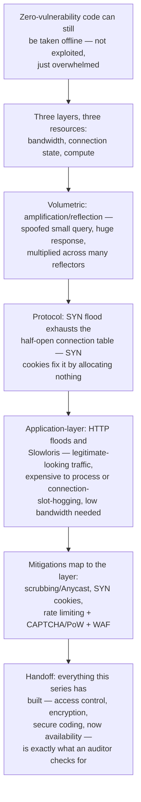

| | Volumetric | Protocol | Application-layer |
|---|---|---|---|
| Mechanism | Amplification/reflection saturates bandwidth | SYN flood fills the half-open connection table | HTTP flood / Slowloris exhausts compute or connection slots |
| Resource exhausted | Network bandwidth | Server connection table | CPU, DB connections, max concurrent connections |
| Primary mitigation | Scrubbing centers + Anycast (CDN edge presence) | SYN cookies | Rate limiting, CAPTCHA/proof-of-work, WAF |
| Attacker cost | Low (spoofed, reflected) | Very low (tiny packets) | Low-to-moderate (looks like real traffic) |
| Visible as a traffic spike? | Yes, dramatically | Often, in connection counts | Not always — Slowloris looks like nothing |

**Where would you like to go next?** Natural threads from here:

- **Compliance Standards** — the final guide in this series: everything covered so far — access control, encryption, secure coding, and now availability defenses against DDoS — is exactly what regulators and auditors actually check for, and that's the closing lens the series ends on
