## The Story of Compliance Standards

The previous guide closed on a pointed observation: access control, encryption, secure coding, and DDoS defenses aren't just good engineering — they're exactly the list of things a regulator or an auditor actually checks for. This guide picks up that thread directly. Every technical control this series has built lives inside a legal and contractual context that doesn't care how well-designed your RBAC policy is unless you can *prove* it — to a customer's procurement team, to a regulator with subpoena power, to an auditor who bills by the hour and trusts nothing you say without evidence. Compliance is where "we built it correctly" becomes "we can show, on demand, that it's correctly built and stays that way."

---

## Interview Cheat Sheet

**Compliance** is the set of legal, contractual, and industry-standard requirements a system must satisfy — and, critically, be able to *prove* it satisfies — regarding how it handles sensitive data, covering privacy (GDPR), healthcare data (HIPAA), payment data (PCI-DSS), and general operational trustworthiness (SOC 2).

**Key facts:**
- **GDPR** (EU) grants individuals enforceable rights over their personal data — access, erasure, portability — and requires breach notification within **72 hours**; **HIPAA** (US) protects a specific category of data, **PHI**, and binds any vendor touching it via a **Business Associate Agreement (BAA)**
- **SOC 2** isn't a pass/fail law — it's an *auditor's report* against five **Trust Service Criteria** (Security is mandatory, the other four are chosen), and a **Type II** report (controls working over 6-12 months) is what most enterprise buyers actually require, not a **Type I** (design only, at one point in time)
- **PCI-DSS** scope is defined by contact with cardholder data — **tokenization** (swap the real card number for a non-sensitive token via a PCI-compliant processor, on day one) is the standard way to shrink that scope down to almost nothing
- None of these frameworks invent new technical controls — they audit the controls the rest of this series already described (encryption, access control, secure coding, availability)

**Common interview gotchas:**
- GDPR's "right to erasure" is not "delete the row" — it has to reach backups, derived stores (search indexes, caches, data warehouses), and logs, which is a genuinely hard distributed-systems problem, not a `DELETE` statement
- SOC 2 has no fixed checklist of controls — two companies can both pass the Security criterion with completely different technical implementations, as long as each can evidence its own controls are effective
- PCI-DSS applies based on whether your systems *touch* cardholder data, not whether you "are a payments company" — a SaaS app that stores card numbers in its own database is in full PCI-DSS scope even if payments are a minor feature
- A BAA doesn't make a vendor HIPAA-compliant by itself — it's a contractual acknowledgment of shared responsibility; the vendor still has to actually implement the safeguards (encryption, access control, audit logging) HIPAA requires

**The core trade-off:** compliance work produces very little new *engineering* — most of it was already built by the rest of this series — but it demands continuous, auditable proof (logs, access reviews, penetration test reports, signed attestations) that never stops being collected, which is its own ongoing cost distinct from the original implementation.

---

## Chapter 1: Why Compliance Exists at All

Framed honestly, compliance exists for three overlapping but distinct reasons, and conflating them is where "just a checkbox exercise" cynicism usually comes from.

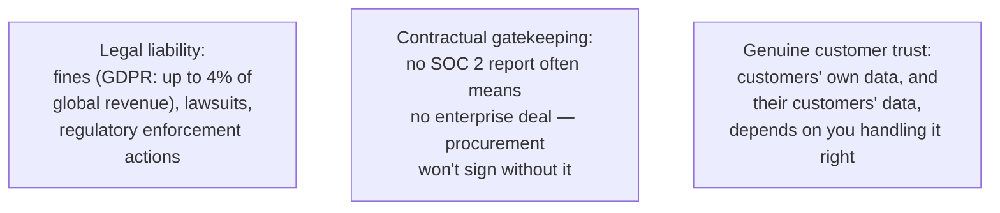

**Legal liability** is the one everyone knows: GDPR fines can reach 4% of global annual revenue or €20 million, whichever is larger; HIPAA violations carry both civil and, in willful-neglect cases, criminal penalties. **Contractual gatekeeping** is the one engineers underestimate: a mid-market SaaS company without a SOC 2 Type II report will simply be excluded from a large share of enterprise RFPs before a human ever evaluates the product — it's a filter applied before the sales conversation even starts. **Genuine customer trust** is the one that's easy to dismiss as PR but shouldn't be: a company processing healthcare records or payment data that gets breached doesn't just pay a fine, it loses the thing its entire business model depends on.

All three reasons are real simultaneously. The honest caveat: compliance programs frequently *do* degrade into checkbox theater — a control that exists on paper, evidenced by a screenshot taken once a year, that nobody actually maintains. The rest of this guide is about the frameworks as they're supposed to work; whether an organization treats them as living engineering discipline or annual paperwork is a separate, cultural question this guide can't answer for you.

---

## Chapter 2: GDPR — Rights Over Data, Not Just Rules About It

The **General Data Protection Regulation** (EU, effective 2018) is built around a different premise than most US-style compliance frameworks: personal data belongs, in a meaningful legal sense, to the individual it describes — not to the company that collected it. Two ideas fall out of that premise.

### Lawful Basis for Processing

GDPR requires every instance of processing personal data to rest on one of six **lawful bases** — briefly, the ones that come up most in practice:

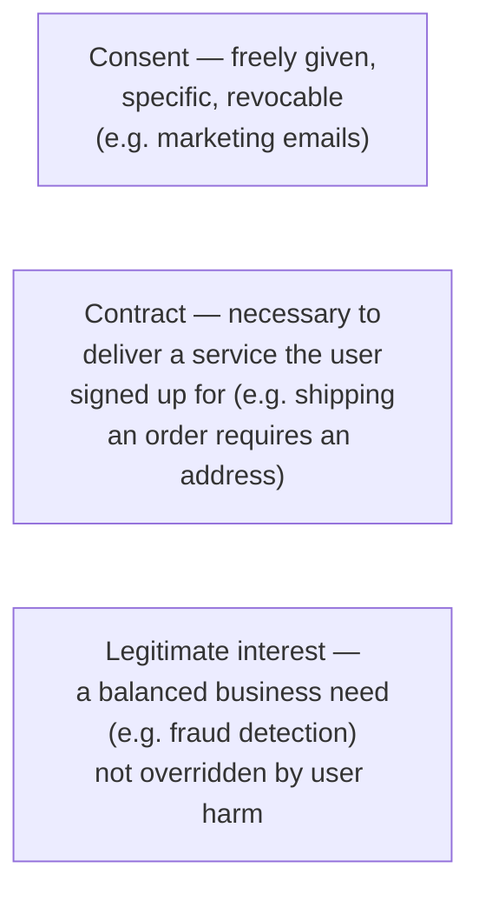

The engineering consequence: your data model needs to know, per field and per purpose, *why* it's allowed to hold that data — because the answer determines whether a user can simply revoke it (consent) or not (contractual necessity).

### Data Subject Rights — the Features Engineering Actually Builds

This is where GDPR stops being a legal document and becomes a backlog.

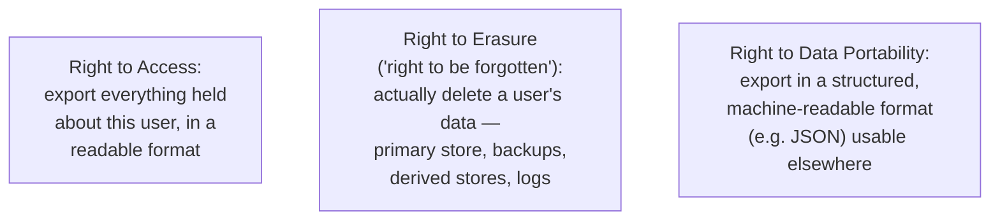

**Right to access** is the most straightforward: a "download my data" endpoint that walks every store holding user data and assembles a package. **Right to portability** is closely related — the export just has to be structured and machine-readable, not a PDF.

**Right to erasure is the genuinely hard one**, and it's worth connecting directly back to earlier guides in this series. `SecurityAndCompliance/6_DataEncryption.md` covered encryption at rest across replicated, sharded stores — and deleting a user's row from the primary database is the easy 10% of the problem. The other 90%:

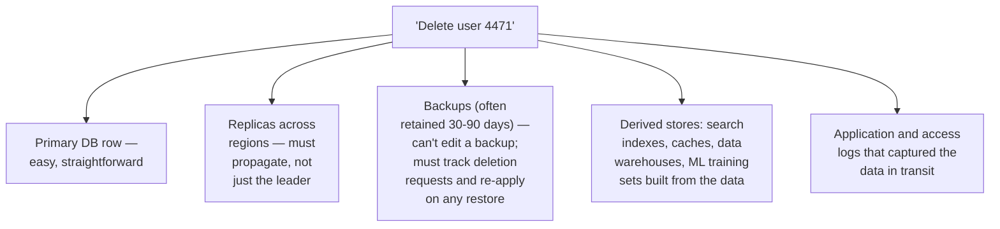

One pattern that makes this tractable, rather than a manual scramble every time: **crypto-shredding** — encrypt each user's data with a per-user key (an extension of the envelope encryption pattern from `SecurityAndCompliance/6_DataEncryption.md`), and "delete" the user by discarding that key instead of hunting down every physical copy of their data. The ciphertext can persist in backups and derived stores indefinitely; without the key it's unrecoverable noise, which satisfies erasure without requiring a distributed hunt-and-destroy operation across every replica and backup snapshot.

### 72-Hour Breach Notification

If personal data is exposed, GDPR requires notifying the relevant supervisory authority within **72 hours** of becoming aware of the breach — and, in cases of high risk to individuals, notifying those individuals too. This is a direct argument for having breach detection and an incident response runbook *before* an incident, not during one: 72 hours is not enough time to first build the process for figuring out what happened.

### Data Residency

GDPR also restricts where EU personal data may be processed and stored — transfers outside the EU require an approved mechanism (adequacy decisions, standard contractual clauses). This lands squarely on distributed-systems architecture covered in the `DistributedSystems/` guides: sharding a database by geography so EU user data physically stays on EU-region infrastructure, and constraining replication topology so a "replicate everywhere for durability" default doesn't silently copy EU personal data onto a US replica. Residency isn't a legal footnote you bolt on afterward — it's a constraint on where your shard and replica placement is allowed to route data, decided at the same time as the sharding key.

---

## Chapter 3: HIPAA — Protecting a Specific Category of Data

The **Health Insurance Portability and Accountability Act** (US) protects **PHI — Protected Health Information**: any individually identifiable health information (diagnoses, treatment records, health plan information) tied to a specific person. Unlike GDPR's broad "any personal data" scope, HIPAA scope is narrower and more specific: it's about *this particular kind* of data.

### Covered Entities, Business Associates, and the BAA

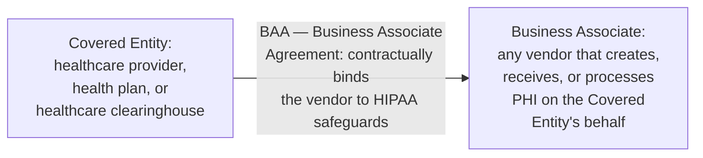

A hospital (the **Covered Entity**) using a cloud analytics vendor to process patient records makes that vendor a **Business Associate** — and HIPAA requires a signed **BAA** before any PHI can legally flow to them. The BAA matters because it's the mechanism that extends HIPAA's obligations down the vendor chain: without one, a Covered Entity handing PHI to a vendor is itself in violation, regardless of what the vendor's own security posture looks like. For any engineering team building a product healthcare customers might adopt, "do you sign a BAA" is one of the first questions in the sales cycle — no BAA, no deal, the same gatekeeping dynamic Chapter 1 described for SOC 2.

### Minimum Necessary

HIPAA's **minimum necessary** principle: only access, use, or disclose the minimum PHI required for a specific purpose — a billing clerk doesn't need a patient's full clinical history, a support engineer debugging a UI bug doesn't need to see PHI at all. This isn't an abstract policy; it's directly implementable with the exact machinery `SecurityAndCompliance/1_AuthenticationAndAuthorization.md` covered:

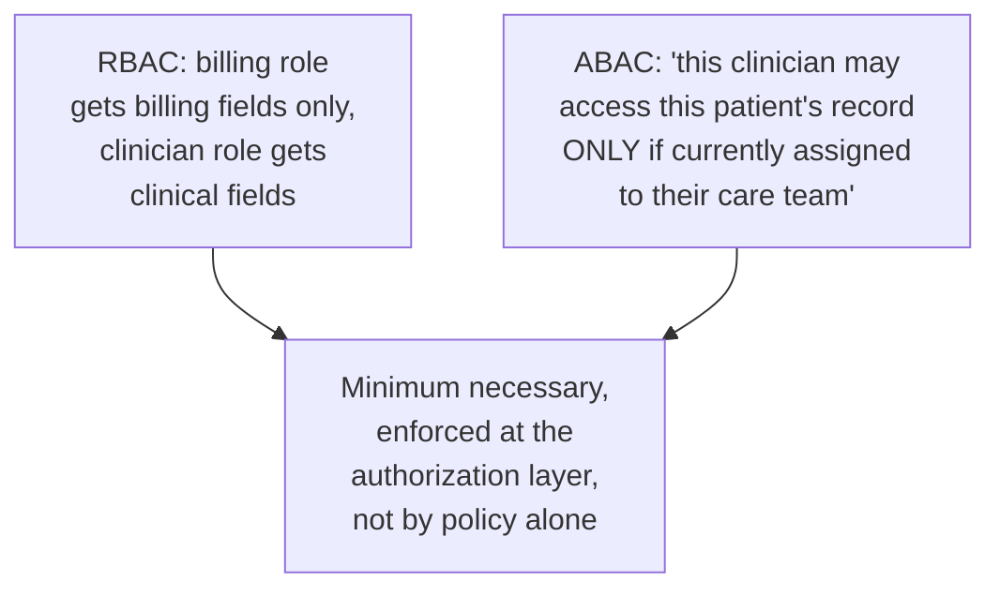

RBAC handles the coarse version (role determines field-level access); ABAC handles the fine version (a specific relationship — "assigned to this patient" — gates access to a specific record). Minimum necessary is what those two access-control models look like when a healthcare auditor asks you to justify every access grant.

---

## Chapter 4: SOC 2 — An Auditor's Opinion, Not a Law

**SOC 2** (Service Organization Control 2) is different in kind from GDPR and HIPAA: it isn't a law at all, it's a reporting **framework** run by the AICPA, and the actual deliverable is an independent auditor's opinion — a report you hand to prospective customers as evidence.

### The Five Trust Service Criteria

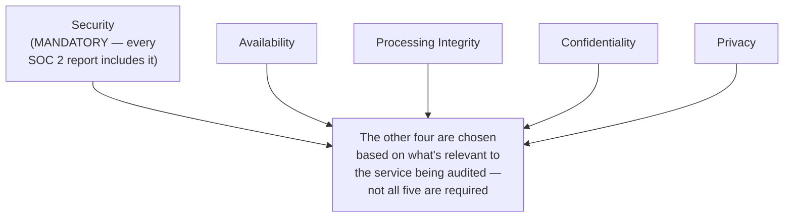

**Security** (the "common criteria") is non-negotiable — access control, change management, monitoring, incident response. The other four are picked based on relevance: a company selling uptime-sensitive infrastructure adds **Availability**; a payments-adjacent product adds **Processing Integrity** (data is processed completely, accurately, and on time); a company handling especially sensitive data adds **Confidentiality** or **Privacy**. Most B2B SaaS companies scope a SOC 2 report to Security plus Availability, and add the rest only when a specific customer segment demands it.

### Type I vs. Type II

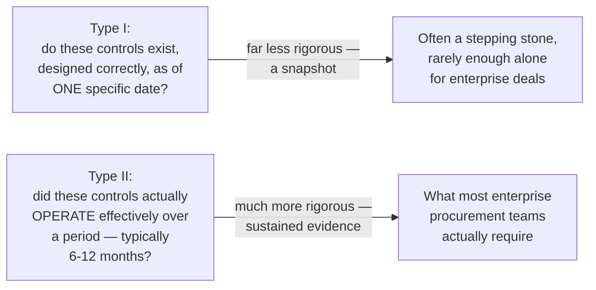

The distinction matters enormously in practice: **Type I** just confirms controls are designed reasonably as of a point in time — it's comparatively cheap and fast to obtain, and many young companies get one first as a stepping stone. **Type II** requires the auditor to sample evidence across the entire observation window (access logs, ticket trails, actual incident responses) proving the controls didn't just exist on paper but actually ran, continuously, for months. Enterprise procurement almost universally asks for Type II specifically because Type I says nothing about whether the controls held up under real operation.

**Why SOC 2 is usually the first framework a B2B SaaS company pursues**: it's the one nearly every enterprise buyer asks for regardless of industry, it doesn't require a specific regulated data type (unlike HIPAA/PCI-DSS), and — this is the punchline of this whole guide — most of its Security criteria map directly onto controls a competent engineering team already built for reasons that have nothing to do with compliance (access control, encryption, monitoring, incident response). Pursuing SOC 2 first is largely the cheapest framework to satisfy, because most of the underlying engineering is already done.

---

## Chapter 5: PCI-DSS — Shrinking Scope Instead of Expanding Controls

**PCI-DSS** (Payment Card Industry Data Security Standard) protects **cardholder data** — the primary account number (PAN), and related data like expiration date and cardholder name. Its defining engineering idea isn't a control at all — it's a strategy for making most of the standard *not apply to you*.

### Scope Is Defined by Contact, Not Intent

Any system component that stores, processes, or transmits cardholder data — or is connected to a network segment that does — falls inside PCI-DSS audit scope, with all its attendant requirements (network segmentation, quarterly vulnerability scans, penetration testing, strict key management). A system that never touches the raw card number at all falls outside scope entirely.

### Tokenization: the Scope-Reduction Pattern

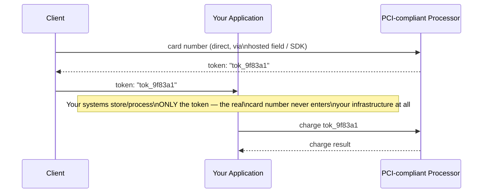

The pattern: route the raw card number directly from the customer's browser to a PCI-compliant processor (Stripe, Braintree, and similar), which returns a **token** — a non-sensitive reference with no exploitable value outside that processor's system. Your application stores and uses the token everywhere a card reference is needed, and the real PAN never touches your database, your logs, or your backups. The direct payoff: most of your infrastructure — the application servers, the primary database, the log pipeline — falls outside PCI-DSS's audit scope entirely, because scope is defined by contact with cardholder data, and tokenization is architected specifically so that contact never happens.

This is the same underlying idea `SecurityAndCompliance/6_DataEncryption.md` covered as **field-level encryption** — replacing a sensitive value with something the rest of the system can safely hold — but tokenization goes a step further: field-level encryption still leaves you holding *a form of* the sensitive data (an encryptable, decryptable ciphertext under your own key management), which is why fully in-scope PCI environments often use it internally. Tokenization removes the sensitive data from your systems entirely, replacing it with a value that's meaningless outside the processor that issued it. The trade-off: tokenization requires trusting an external processor's uptime and API for every transaction, where field-level encryption keeps the (encrypted) data local at the cost of PCI scope covering your own key management.

---

## Chapter 6: The Frameworks, Side by Side

| | GDPR | HIPAA | SOC 2 | PCI-DSS |
|---|---|---|---|---|
| What it protects | Personal data of EU individuals | PHI (health information) | Trust that controls exist and work | Cardholder data |
| Legal status | EU law, binding | US law, binding | Voluntary framework, auditor's opinion | Industry mandate (card networks) |
| Key requirement | Data subject rights, 72hr breach notice, lawful basis | BAA for vendors, minimum necessary | 5 Trust Service Criteria, Type I vs II | Scope reduction (tokenization), network segmentation |
| Who needs it | Anyone processing EU residents' data | Covered Entities and their Business Associates | Any B2B SaaS selling to enterprises | Anyone storing/processing/transmitting card data |
| Enforcement | Fines up to 4% global revenue | Civil and criminal penalties | No direct penalty — contractual gatekeeping | Fines from card networks, loss of processing rights |

---

## Chapter 7: Compliance Is Mostly Proof, Not New Engineering

The point worth landing precisely: almost nothing in this guide asked for a *new* technical control. Compliance frameworks are, overwhelmingly, a demand for **evidence** that the engineering the rest of this series already described is actually in place and stays in place.

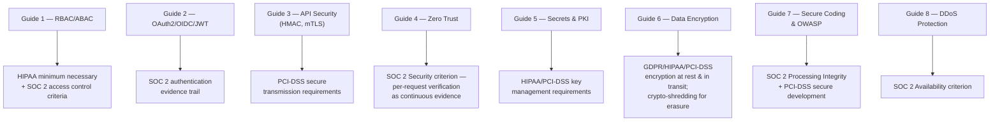

This is why an engineering org that already took the first eight guides seriously finds compliance audits far cheaper than one that didn't: the controls exist, and the work is collecting and organizing evidence, not inventing safeguards under audit deadline pressure. An org that skipped the earlier guides discovers, during its first SOC 2 Type II audit or its first HIPAA risk assessment, that it's being asked to build real controls retroactively, under a compliance deadline instead of ordinary engineering prioritization — a strictly worse position to build them from.

Looking back across the whole series as one continuous argument rather than nine separate topics: it started with the basic question of who's allowed to do what (`SecurityAndCompliance/1_AuthenticationAndAuthorization.md`'s passwords, sessions, RBAC/ABAC), extended that trust decision across organizational boundaries (`2_OAuth2OIDCAndJWT.md`'s delegated auth) and across service-to-service calls (`3_APISecurity.md`'s API keys, HMAC, mTLS), then hardened the assumption itself so that trust is never implicit anywhere in the request path (`4_ZeroTrustArchitecture.md`). It built the machinery to hold and rotate the credentials all of that depends on (`5_SecretsManagementAndPKI.md`), protected the data those credentials guard whether it's sitting still or moving across a network (`6_DataEncryption.md`), closed the application-layer holes that would let an attacker bypass all of it anyway (`7_SecureCodingAndOWASP.md`), and defended the system's ability to simply stay up and answer requests at all (`8_DDoSProtection.md`). This closing guide's contribution is the observation that none of that engineering matters to a regulator, an auditor, or an enterprise buyer unless it can be *proven* — continuously, not once — which is the entire reason compliance exists as a distinct discipline layered on top, rather than being just another engineering task indistinguishable from the rest.

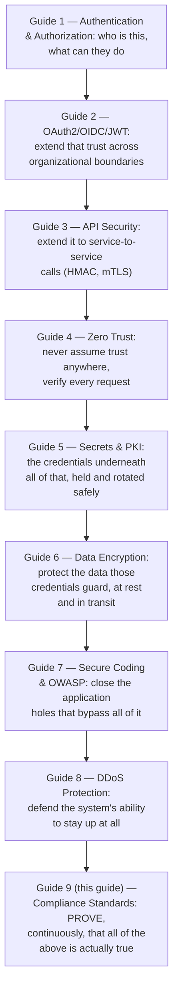

---

## The Full Story, End to End

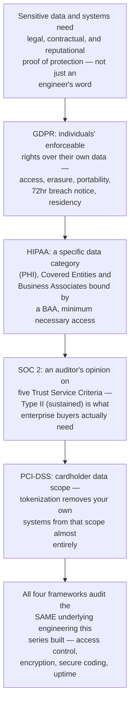

| | GDPR | HIPAA | SOC 2 | PCI-DSS |
|---|---|---|---|---|
| Core mechanism | Enforceable individual rights | Covered Entity / Business Associate + BAA | Auditor's report, Type I vs Type II | Scope reduction via tokenization |
| Hardest engineering problem | Erasure across backups, derived stores, logs | Minimum necessary enforcement at the access layer | Sustaining evidence over 6-12 months | Never letting raw card data enter your systems |
| Primarily protects | Individual privacy | Health information | Customer confidence in operational controls | Payment card ecosystem |
| Relies on (from this series) | Guide 6 (encryption/crypto-shredding), residency-aware sharding | Guide 1 (RBAC/ABAC) | Guides 1-8, collectively, as evidence | Guide 6 (tokenization vs field-level encryption) |

**This closes the Security & Compliance series.** Natural next threads from this repository's README:

- **Cloud & DevOps** — how all of this is actually provisioned, deployed, and continuously monitored and audited in a real cloud environment, turning the evidence this guide demands into something collected automatically rather than assembled by hand before every audit
- **Frontend System Design Considerations** — the browser-side security concerns (CSP, CORS, XSS, CSRF) that `SecurityAndCompliance/7_SecureCodingAndOWASP.md` deliberately deferred to that section of the repository
