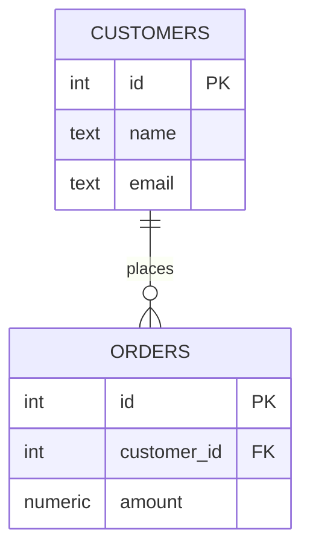
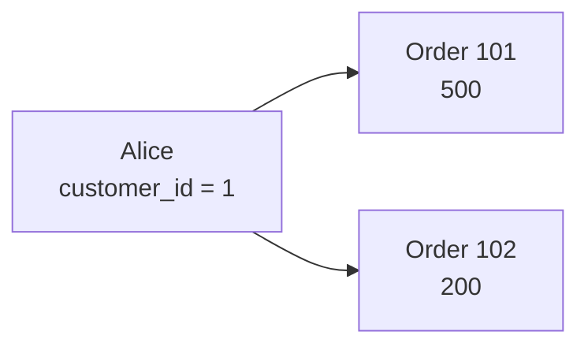
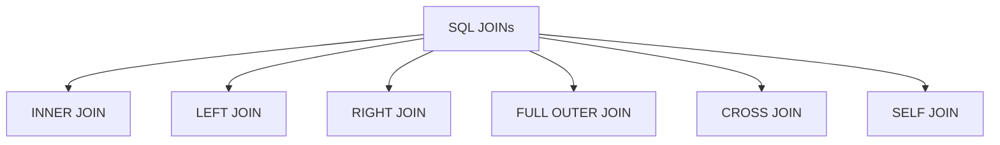

# Database Relational Joins — PostgreSQL

We’ll learn **relational joins from fundamentals to advanced PostgreSQL usage**, one concept at a time.

## Course Roadmap

```mermaid
flowchart TD
    A["1. Why Joins?"] --> B["2. INNER JOIN"]
    B --> C["3. LEFT JOIN"]
    C --> D["4. RIGHT JOIN"]
    D --> E["5. FULL OUTER JOIN"]
    E --> F["6. CROSS JOIN"]
    F --> G["7. SELF JOIN"]
    G --> H["8. JOIN Conditions"]
    H --> I["9. ON vs WHERE"]
    I --> J["10. Multiple Joins"]
    J --> K["11. One-to-One / One-to-Many / Many-to-Many"]
    K --> L["12. Duplicate Rows & Join Explosion"]
    L --> M["13. NULL and Joins"]
    M --> N["14. Anti Joins"]
    N --> O["15. Semi Joins"]
    O --> P["16. EXISTS vs JOIN"]
    P --> Q["17. JOIN with Aggregation"]
    Q --> R["18. JOIN with GROUP BY / HAVING"]
    R --> S["19. Subqueries vs Joins"]
    S --> T["20. CTEs and Joins"]
    T --> U["21. PostgreSQL Join Algorithms"]
    U --> V["22. Nested Loop Join"]
    V --> W["23. Hash Join"]
    W --> X["24. Merge Join"]
    X --> Y["25. EXPLAIN / EXPLAIN ANALYZE"]
    Y --> Z["26. Join Performance & Indexing"]
    Z --> AA["27. Advanced Join Patterns"]
    AA --> AB["28. Real-World Query Design"]
```



---

# 1. What Is a Relational Join?

A **join combines rows from two or more tables based on a relationship between them**.

Suppose we have:

### `customers`

| id | name    |
| -: | ------- |
|  1 | Alice   |
|  2 | Bob     |
|  3 | Charlie |

### `orders`

|  id | customer_id | amount |
| --: | ----------: | -----: |
| 101 |           1 |    500 |
| 102 |           1 |    200 |
| 103 |           2 |    800 |

The tables are related through:

```text
customers.id
      │
      │
      ▼
orders.customer_id
```

A join lets us ask:

> "Give me each order together with the name of the customer who placed it."

---

# 2. Why Do We Need Joins?

A relational database normally avoids storing the same information repeatedly.

Instead of storing:

```text
orders

order_id | customer_name | customer_email | amount
---------------------------------------------------
101      | Alice         | alice@...      | 500
102      | Alice         | alice@...      | 200
103      | Bob           | bob@...        | 800
```

we normalize the data:



Now:

```text
customers
+----+---------+
| id | name    |
+----+---------+
|  1 | Alice   |
|  2 | Bob     |
|  3 | Charlie |
+----+---------+

orders
+-----+-------------+--------+
| id  | customer_id | amount |
+-----+-------------+--------+
| 101 |      1      | 500    |
| 102 |      1      | 200    |
| 103 |      2      | 800    |
+-----+-------------+--------+
```

The join reconstructs the information when we need it.

---

# 3. The Most Important Idea

A join does **not** mean:

> "Put two tables next to each other."

It means:

> **Match rows from one relation with rows from another relation according to a condition.**

For example:

```sql
customers.id = orders.customer_id
```

Conceptually:

```text
customers                 orders

Alice (id=1) ──────────── order 101 (customer_id=1)
       │
       └───────────────── order 102 (customer_id=1)

Bob (id=2) ────────────── order 103 (customer_id=2)

Charlie (id=3)            no matching order
```

Notice something important:

**One customer can match multiple orders.**

Therefore:

```text
1 customer
    ↓
many orders
```

This is a **one-to-many relationship**.

---

# 4. Basic PostgreSQL Syntax

The general syntax is:

```sql
SELECT columns
FROM table_a
JOIN table_b
    ON join_condition;
```

Example:

```sql
SELECT
    customers.name,
    orders.id,
    orders.amount
FROM customers
JOIN orders
    ON customers.id = orders.customer_id;
```

Result:

| name  |  id | amount |
| ----- | --: | -----: |
| Alice | 101 |    500 |
| Alice | 102 |    200 |
| Bob   | 103 |    800 |

Charlie isn't returned because Charlie has no matching order.

This is an **INNER JOIN**.

---

# 5. `JOIN` Means `INNER JOIN`

In PostgreSQL:

```sql
JOIN
```

is equivalent to:

```sql
INNER JOIN
```

So these are equivalent:

```sql
SELECT *
FROM customers
JOIN orders
    ON customers.id = orders.customer_id;
```

and:

```sql
SELECT *
FROM customers
INNER JOIN orders
    ON customers.id = orders.customer_id;
```

Usually, explicitly writing `INNER JOIN` makes the intended join type clearer.

---

# 6. Visualizing an INNER JOIN

Consider:

```text
CUSTOMERS

id   name
-----------
1    Alice
2    Bob
3    Charlie
```

and:

```text
ORDERS

id    customer_id
-----------------
101      1
102      1
103      2
104      4
```

The relationship is:

```text
Customer             Order

Alice (1) ────────── 101 (customer_id=1)
        └──────────── 102 (customer_id=1)

Bob (2) ───────────── 103 (customer_id=2)

Charlie (3) ───────── no order

Customer 4 doesn't exist
                     │
                     └── 104
```

An INNER JOIN keeps only successful matches:

```text
Alice  → 101
Alice  → 102
Bob    → 103
```

It removes:

```text
Charlie
Order 104
```

because neither has a matching row on the other side.

---

# 7. A More Formal View

Suppose:

```text
A = customers
B = orders
```

An inner join:

```text
A ⋈ B
```

returns:

```text
all combinations of rows
where the join condition is TRUE
```

For:

```sql
ON customers.id = orders.customer_id
```

we conceptually examine matching pairs:

```text
Alice + Order 101 → TRUE
Alice + Order 102 → TRUE
Alice + Order 103 → FALSE
Alice + Order 104 → FALSE

Bob + Order 101 → FALSE
Bob + Order 102 → FALSE
Bob + Order 103 → TRUE
Bob + Order 104 → FALSE

Charlie + Order 101 → FALSE
Charlie + Order 102 → FALSE
Charlie + Order 103 → FALSE
Charlie + Order 104 → FALSE
```

The resulting relation contains only the `TRUE` matches.

---

# 8. Creating the Example Tables

You can experiment with the following PostgreSQL schema:

```sql
CREATE TABLE customers (
    id BIGINT PRIMARY KEY,
    name TEXT NOT NULL,
    email TEXT NOT NULL
);

CREATE TABLE orders (
    id BIGINT PRIMARY KEY,
    customer_id BIGINT NOT NULL,
    amount NUMERIC(10, 2) NOT NULL,

    CONSTRAINT fk_orders_customer
        FOREIGN KEY (customer_id)
        REFERENCES customers(id)
);
```

Insert sample data:

```sql
INSERT INTO customers (id, name, email)
VALUES
    (1, 'Alice', 'alice@example.com'),
    (2, 'Bob', 'bob@example.com'),
    (3, 'Charlie', 'charlie@example.com');

INSERT INTO orders (id, customer_id, amount)
VALUES
    (101, 1, 500.00),
    (102, 1, 200.00),
    (103, 2, 800.00);
```

Now:

```sql
SELECT
    c.name,
    o.id AS order_id,
    o.amount
FROM customers AS c
INNER JOIN orders AS o
    ON c.id = o.customer_id;
```

Result:

```text
 name  | order_id | amount
-------+----------+--------
 Alice |      101 | 500.00
 Alice |      102 | 200.00
 Bob   |      103 | 800.00
```

---

# 9. Why Does Alice Appear Twice?

This is one of the **most important concepts in joins**.

Alice has:

```text
customer_id = 1
```

Orders:

```text
101 → customer_id = 1
102 → customer_id = 1
```

Therefore:

```text
Alice × Order 101
Alice × Order 102
```

produces two result rows.

This is not a duplicate caused by PostgreSQL.

It is the correct relational result.



---

# 10. The First Critical Rule

When learning joins, always ask:

> **What is the cardinality of the relationship?**

For example:

```text
Customer
   │
   │ 1
   │
   │
   │ N
   ▼
Order
```

Meaning:

```text
One customer → many orders
```

Therefore joining:

```sql
customers
JOIN orders
```

can increase the number of rows.

For example:

```text
customers = 3 rows
orders    = 3 rows

result    = 3 rows
```

But this doesn't mean:

```text
3 + 3 = 6
```

or:

```text
3 × 3 = 9
```

The result depends on the **matching relationships**.

---

# 11. A Common Beginner Mistake

People sometimes expect:

```sql
SELECT *
FROM customers c
JOIN orders o
    ON c.id = o.customer_id;
```

to return:

```text
Alice
Bob
Charlie
```

But that isn't what the query asks.

It asks:

> Return customer/order combinations where the IDs match.

Therefore:

```text
Alice + Order 101
Alice + Order 102
Bob   + Order 103
```

are the actual matching combinations.

---

# 12. The Six Main Join Types

You will repeatedly encounter these:



The first four are especially important:

```text
INNER JOIN
    ↓
Only matching rows

LEFT JOIN
    ↓
Everything from left + matches from right

RIGHT JOIN
    ↓
Everything from right + matches from left

FULL OUTER JOIN
    ↓
Everything from both sides
```

We'll study each one carefully rather than trying to memorize them.

---

# 13. Mental Model

For every join, think in terms of:

```text
LEFT TABLE                 RIGHT TABLE

   A                           B
   │                           │
   │      JOIN CONDITION       │
   └───────────┬───────────────┘
               │
               ▼
          MATCHING RULE
               │
               ▼
          RESULT ROWS
```

And always ask:

1. **What are my two tables?**
2. **What connects them?**
3. **Can one row match multiple rows?**
4. **What happens when there is no match?**
5. **Which side's unmatched rows should remain?**

These five questions will make almost every join problem much easier.

---

# Next Concept

## 2. INNER JOIN — Deep Dive

Next we'll go deeper into `INNER JOIN`, including:

* exact row-matching behavior
* `ON` conditions
* multiple matching rows
* composite join conditions
* joining on non-PK columns
* common mistakes
* `INNER JOIN` vs filtering with `WHERE`
* practical PostgreSQL examples
* how PostgreSQL actually executes the join
