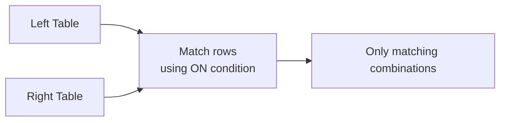
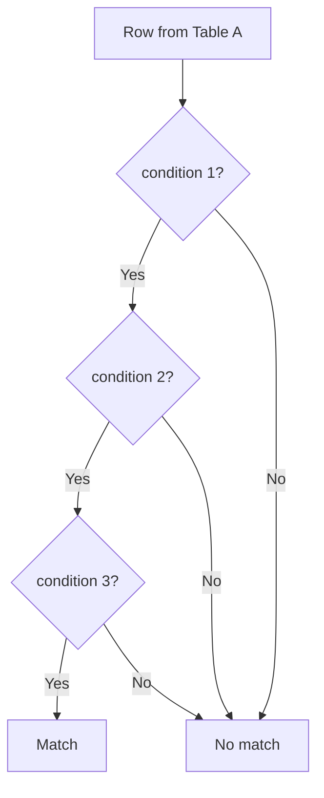
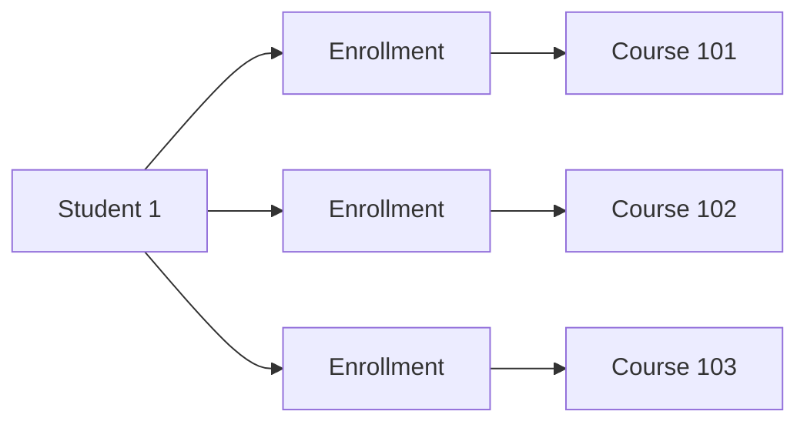
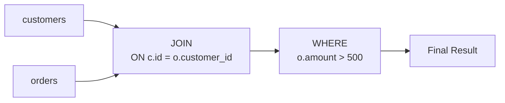
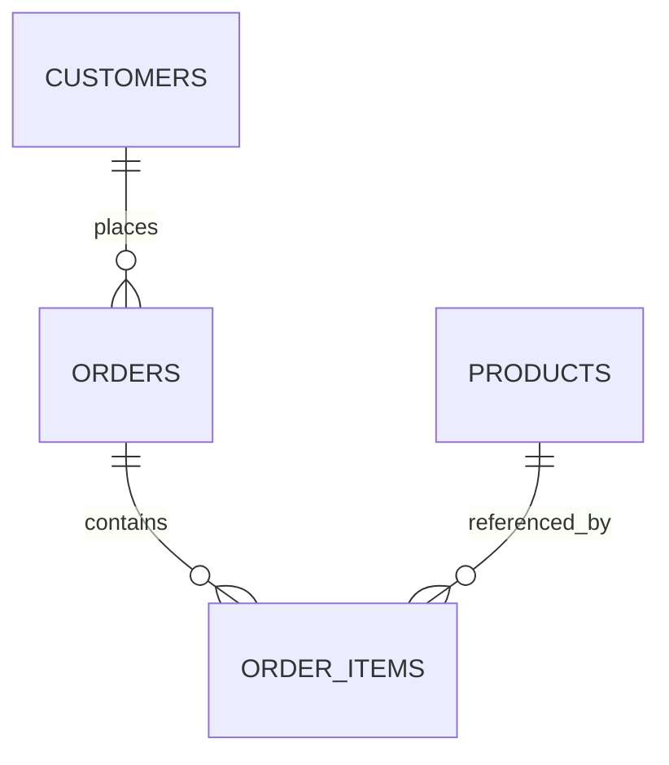
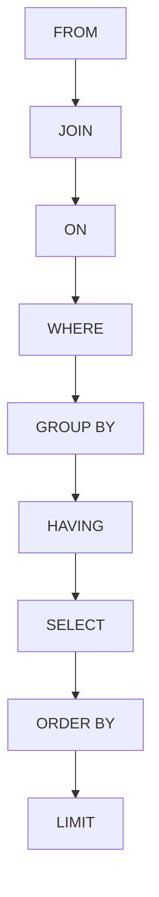
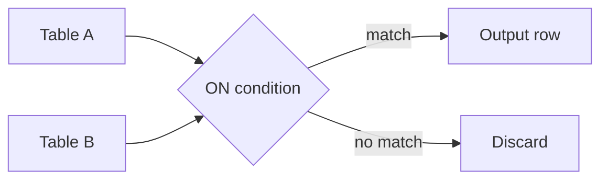

# 2. INNER JOIN — Deep Dive

We already saw the basic idea:

```sql
SELECT ...
FROM customers AS c
INNER JOIN orders AS o
    ON c.id = o.customer_id;
```

Now let's understand **exactly what PostgreSQL is doing**.

---

# 2.1 What Does INNER JOIN Mean?

An `INNER JOIN` returns:

> **Only rows where the join condition matches on both sides.**

Think of it as:



Example:

```text
customers

id   name
-----------
1    Alice
2    Bob
3    Charlie
```

```text
orders

id    customer_id
-----------------
101      1
102      1
103      2
```

Join condition:

```sql
c.id = o.customer_id
```

Matches:

```text
Alice (1)   ↔ Order 101 (1)
Alice (1)   ↔ Order 102 (1)
Bob   (2)   ↔ Order 103 (2)
```

No match:

```text
Charlie (3)
```

So Charlie disappears.

---

# 2.2 Basic Syntax

```sql
SELECT
    c.name,
    o.id,
    o.amount
FROM customers AS c
INNER JOIN orders AS o
    ON c.id = o.customer_id;
```

The important pieces are:

```text
FROM customers
     │
     ▼
  left table

INNER JOIN orders
     │
     ▼
 right table

ON c.id = o.customer_id
     │
     ▼
 matching condition
```

---

# 2.3 `ON` Is the Join Condition

The `ON` clause determines **which rows are related**.

```sql
ON c.id = o.customer_id
```

means:

```text
customer's id
      =
order's customer_id
```

For example:

```text
c.id = 1
o.customer_id = 1

1 = 1
TRUE
```

Therefore they join.

But:

```text
c.id = 1
o.customer_id = 2

1 = 2
FALSE
```

Therefore they don't join.

---

# 2.4 One Row Can Match Many Rows

This is extremely important.

Suppose:

```text
customers

id   name
-----------
1    Alice
```

And:

```text
orders

id    customer_id
-----------------
101      1
102      1
103      1
```

The join produces:

```text
Alice → 101
Alice → 102
Alice → 103
```

Result:

| name  | order_id |
| ----- | -------: |
| Alice |      101 |
| Alice |      102 |
| Alice |      103 |

So:

```text
1 customer
    ↓
3 matching orders
    ↓
3 result rows
```

This is expected.

---

# 2.5 Join Cardinality

This leads to the concept of **cardinality**.

Suppose:

```text
customers
    1
    │
    │
    N
    ▼
orders
```

This is:

```text
ONE-TO-MANY
```

When joining them:

```sql
customers
INNER JOIN orders
```

one customer can produce multiple output rows.

### Example

```text
Customer Alice
     │
     ├── Order 101
     ├── Order 102
     └── Order 103
```

Therefore:

```text
Alice appears 3 times
```

This is **not necessarily duplicate data**.

It represents three different relationships.

---

# 2.6 Many-to-One

The same relationship can be viewed from the other direction:

```text
orders
   N
   │
   │
   1
   ▼
customers
```

Each order belongs to one customer.

Therefore:

```text
many orders
     ↓
one customer
```

When you join from orders to customers:

```sql
SELECT
    o.id,
    c.name
FROM orders AS o
INNER JOIN customers AS c
    ON o.customer_id = c.id;
```

you get:

| order_id | name  |
| -------: | ----- |
|      101 | Alice |
|      102 | Alice |
|      103 | Bob   |

---

# 2.7 What Actually Gets Matched?

A useful mental model is:

```text
For each row from table A:

    find rows in table B

    where ON condition is TRUE

    produce a result for every match
```

Conceptually:

```text
customers
    │
    ├── Alice
    │     │
    │     ├── order 101 ✓
    │     ├── order 102 ✓
    │     └── order 103 ✗
    │
    ├── Bob
    │     │
    │     ├── order 101 ✗
    │     ├── order 102 ✗
    │     └── order 103 ✓
    │
    └── Charlie
          │
          ├── order 101 ✗
          ├── order 102 ✗
          └── order 103 ✗
```

Output:

```text
Alice + 101
Alice + 102
Bob   + 103
```

This is the logical behavior.

The **physical algorithm PostgreSQL uses internally can be different**. We'll study that later.

---

# 2.8 INNER JOIN Doesn't Require a Foreign Key

You can join tables even if there is no declared foreign key.

For example:

```sql
SELECT
    c.name,
    o.amount
FROM customers AS c
INNER JOIN orders AS o
    ON c.id = o.customer_id;
```

The database can perform this join regardless of whether:

```sql
orders.customer_id
```

has a foreign key constraint.

However, a foreign key provides **data integrity**.

For example:

```sql
FOREIGN KEY (customer_id)
REFERENCES customers(id)
```

prevents an order from referring to a nonexistent customer.

So:

```text
FOREIGN KEY
    ↓
Data integrity

JOIN
    ↓
Combining related rows
```

They are related concepts but serve different purposes.

---

# 2.9 Joining Non-PK Columns

A join doesn't have to use:

```text
PRIMARY KEY = FOREIGN KEY
```

You can technically join on any compatible condition.

Example:

```sql
SELECT
    e.name,
    d.name AS department_name
FROM employees AS e
INNER JOIN departments AS d
    ON e.department_code = d.code;
```

Here:

```text
employees.department_code
          │
          ▼
departments.code
```

The columns don't have to be named the same.

---

# 2.10 Joining on Multiple Columns

Sometimes one column isn't enough to identify the relationship.

Example:

```text
student_id
course_id
```

Together they identify an enrollment.

Suppose:

```text
enrollments

student_id | course_id | semester
-----------+-----------+---------
1          | 101       | 2026
1          | 102       | 2026
2          | 101       | 2026
```

You might need:

```sql
ON e.student_id = s.id
AND e.semester = s.semester
```

A join condition can contain multiple predicates:

```sql
ON condition_1
AND condition_2
AND condition_3
```

Conceptually:



All conditions must be true when connected with `AND`.

---

# 2.11 Join Conditions Can Use Expressions

You are not limited to simple equality.

For example:

```sql
SELECT *
FROM products AS p
INNER JOIN discounts AS d
    ON p.category_id = d.category_id
   AND p.price >= d.minimum_price;
```

Now a product matches a discount when:

```text
same category
AND
product price >= minimum price
```

Joins can therefore contain richer logic.

---

# 2.12 Equality Join

The most common form is:

```sql
ON a.id = b.a_id
```

This is called an **equi-join**.

Example:

```sql
SELECT *
FROM employees AS e
INNER JOIN departments AS d
    ON e.department_id = d.id;
```

The condition uses:

```sql
=
```

---

# 2.13 Non-Equality Join

A join can also use operators such as:

```text
<
>
<=
>=
<>
```

Example:

```sql
SELECT
    e.name,
    r.level
FROM employees AS e
INNER JOIN salary_ranges AS r
    ON e.salary >= r.minimum_salary
   AND e.salary < r.maximum_salary;
```

Conceptually:

```text
Employee salary
      │
      ▼
Find range containing salary
      │
      ▼
Matching salary level
```

This is sometimes called a **range join**.

---

# 2.14 Multiple Matches Can Multiply Rows

This becomes especially important with many-to-many relationships.

Suppose:

```text
students

id
---
1
```

And:

```text
courses

id
---
101
102
103
```

And:

```text
enrollments

student_id | course_id
-----------+----------
1          | 101
1          | 102
1          | 103
```

Then:



A student can appear multiple times after joining.

This is why understanding relationship cardinality is essential before writing joins.

---

# 2.15 INNER JOIN vs `WHERE`

These two queries can sometimes produce the same result:

```sql
SELECT
    c.name,
    o.amount
FROM customers AS c
INNER JOIN orders AS o
    ON c.id = o.customer_id;
```

and:

```sql
SELECT
    c.name,
    o.amount
FROM customers AS c,
     orders AS o
WHERE c.id = o.customer_id;
```

The second uses old-style comma joins.

Although PostgreSQL supports it, prefer explicit `JOIN` syntax:

```sql
FROM customers AS c
INNER JOIN orders AS o
    ON c.id = o.customer_id
```

because it clearly separates:

```text
JOIN relationship
       ↓
      ON

Filtering
       ↓
     WHERE
```

That distinction becomes **very important with OUTER JOINs**.

---

# 2.16 `ON` vs `WHERE`

Consider:

```sql
SELECT
    c.name,
    o.amount
FROM customers AS c
INNER JOIN orders AS o
    ON c.id = o.customer_id
WHERE o.amount > 500;
```

There are two different jobs:

```text
ON
↓
Which customer and order rows are related?

WHERE
↓
Which resulting rows should remain?
```

Conceptually:



For an `INNER JOIN`, moving certain predicates between `ON` and `WHERE` can produce the same final rows.

But **do not generalize this to LEFT/RIGHT/FULL JOINs**.

That difference is one of the most important topics in the course.

---

# 2.17 Example: Filtering in `ON`

```sql
SELECT
    c.name,
    o.amount
FROM customers AS c
INNER JOIN orders AS o
    ON c.id = o.customer_id
   AND o.amount > 500;
```

The join only considers orders where:

```text
amount > 500
```

For our data:

```text
101 → 500
102 → 200
103 → 800
```

Only:

```text
103 → 800
```

matches the additional condition.

Result:

| name | amount |
| ---- | -----: |
| Bob  |    800 |

---

# 2.18 Same Filter in `WHERE`

```sql
SELECT
    c.name,
    o.amount
FROM customers AS c
INNER JOIN orders AS o
    ON c.id = o.customer_id
WHERE o.amount > 500;
```

For an `INNER JOIN`, this produces the same logical result:

| name | amount |
| ---- | -----: |
| Bob  |    800 |

But the semantics are conceptually different:

```text
ON
→ determines matching rows

WHERE
→ filters the joined result
```

Keep that mental distinction even when the output happens to be identical.

---

# 2.19 Joining Three Tables

Real applications rarely stop at two tables.

Suppose:



Tables:

```text
customers
orders
order_items
products
```

You can join them:

```sql
SELECT
    c.name AS customer_name,
    o.id AS order_id,
    p.name AS product_name,
    oi.quantity
FROM customers AS c
INNER JOIN orders AS o
    ON c.id = o.customer_id
INNER JOIN order_items AS oi
    ON o.id = oi.order_id
INNER JOIN products AS p
    ON p.id = oi.product_id;
```

Conceptually:

```text
Customer
   │
   ▼
Order
   │
   ▼
Order Item
   │
   ▼
Product
```

The result can look like:

| customer | order | product  | quantity |
| -------- | ----: | -------- | -------: |
| Alice    |   101 | Laptop   |        1 |
| Alice    |   101 | Mouse    |        2 |
| Bob      |   103 | Keyboard |        1 |

---

# 2.20 Order of Logical Processing

A simplified logical model is:



Don't interpret this as the exact physical execution plan.

It is a **logical model** that helps understand SQL semantics.

PostgreSQL's optimizer can execute things differently while preserving the correct result.

We'll study this distinction later.

---

# 2.21 Common Mistake: Forgetting the Join Condition

Consider:

```sql
SELECT *
FROM customers
INNER JOIN orders;
```

For an ordinary `INNER JOIN`, PostgreSQL requires a join condition unless you intentionally use:

```sql
CROSS JOIN
```

A missing relationship is usually a sign that something is wrong with the query.

---

# 2.22 Common Mistake: Wrong Join Condition

Suppose you accidentally write:

```sql
ON c.id = o.id
```

instead of:

```sql
ON c.id = o.customer_id
```

The query can still execute.

That's dangerous.

SQL doesn't necessarily know your business relationship.

It only knows the condition you gave it.

So:

```text
Correct:

customer.id
    ↓
order.customer_id
```

versus:

```text
Incorrect:

customer.id
    ↓
order.id
```

Both may be syntactically valid.

Only the first represents the intended relationship.

---

# 2.23 Common Mistake: Joining on Non-Unique Columns

Suppose:

```text
customers

id | name | city
---+------+--------
1  | A    | London
2  | B    | London
3  | C    | Paris
```

and:

```text
stores

id | city
---+--------
10 | London
11 | London
12 | Paris
```

If you do:

```sql
SELECT *
FROM customers AS c
INNER JOIN stores AS s
    ON c.city = s.city;
```

London produces:

```text
Alice → Store 10
Alice → Store 11
Bob   → Store 10
Bob   → Store 11
```

The join multiplied rows because both sides had multiple matching rows.

This is not necessarily wrong.

But it is something you must **understand intentionally**.

---

# 2.24 The Golden Question

Before writing:

```sql
JOIN table_b
    ON ...
```

ask:

> **For one row in A, how many rows can match in B?**

Possible answers:

```text
0
1
many
```

Then ask the reverse:

> **For one row in B, how many rows can match in A?**

Possible relationships:

```text
1 : 1
1 : N
N : 1
N : N
```

This predicts the shape of your result.

---

# 2.25 INNER JOIN Summary

```text
INNER JOIN
    │
    ├── Returns matching rows only
    │
    ├── Uses ON to define relationship
    │
    ├── Unmatched rows disappear
    │
    ├── One row can match many rows
    │
    ├── Result row count can increase
    │
    ├── Can join multiple tables
    │
    └── Can use complex conditions
```

The key mental model:



---

# 2.26 Practice

Given:

```text
customers

id | name
---+-------
1  | Alice
2  | Bob
3  | Charlie
```

```text
orders

id  | customer_id | amount
----+-------------+-------
101 | 1           | 100
102 | 1           | 200
103 | 2           | 300
104 | 4           | 400
```

What does this return?

```sql
SELECT
    c.name,
    o.id AS order_id,
    o.amount
FROM customers AS c
INNER JOIN orders AS o
    ON c.id = o.customer_id;
```

Think through the matching pairs:

```text
Alice   → ?
Bob     → ?
Charlie → ?
Order 104 → ?
```

The answer is:

```text
Alice → 101 → 100
Alice → 102 → 200
Bob   → 103 → 300
```

`Charlie` has no matching order, so it is excluded.

Order `104` has `customer_id = 4`, but customer `4` doesn't exist, so it is excluded.

---

# Next Concept: `LEFT JOIN`

The key question changes from:

> "Which rows have matches?"

to:

> **"What if I want every row from the left table, even when there is no match?"**

We'll use the same `customers` and `orders` example to understand exactly how `LEFT JOIN` preserves unmatched rows, why `NULL` appears, and why `LEFT JOIN` + `WHERE` is one of the most common SQL pitfalls.

